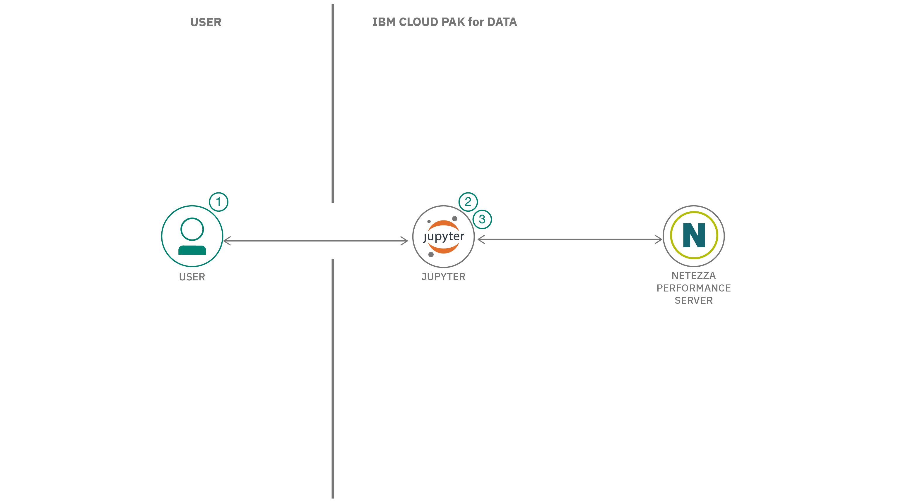

## まとめ

この開発者コードパターンでは、Netezza&reg; Performance Serverを使って、さまざまなソースからデータをロードし、それにアクセスして研究やその他のビジネス関連の活動を行う方法を学びます。Netezzaデータベース環境の並列アーキテクチャは、大規模なデータセットに対する高性能な計算を可能にし、大規模なデータマイニングアプリケーションの理想的なプラットフォームとなっています。

## 説明

エネルギー価格データとオーストラリアの気象観測所のデータセットを使用して、Jupyter Notebook with IBM Cloud Pak&trade; for Dataを使ってデータを分析します。順を追って説明します。

* Netezzaデータベースへの接続
* CSVファイル、外部テーブル、Cloud Object Storageを使用したNetezzaへのデータのロード
* Netezza Performance Serverから読み込まれたデータの分析と視覚化

## フロー

1. ユーザーはJupyter NotebookをIBM Cloud Pak for Dataにロードします。
1. ユーザーはnzpyライブラリコネクタを使用してNetezzaに接続します。
1. Netezza Performance Serverからデータを読み込み、分析する。

##指示

詳しい手順については、[README](https://github.com/IBM/loading-accessing-data-from-nps/blob/main/README.md)をご覧ください。

1. CP4Dで新しいプロジェクトを作成する
1. Netezza Performance Serverへの接続を追加する
1. プロジェクトにノートブックをロードする
1. nzpyライブラリのインストール
1. ノートブックでNetezza Performance Serverの接続を設定する
1. 外部ソースからデータをロードまたはアンロードする
1. 他のデータソースからデータをロードする
1. クラウドオブジェクトストレージからのデータの読み込み
1. オーストラリアのウェザーステーションデータの読み込みと解析

## 次のステップ

この学習パスの次の部分を以下で試してみてください。