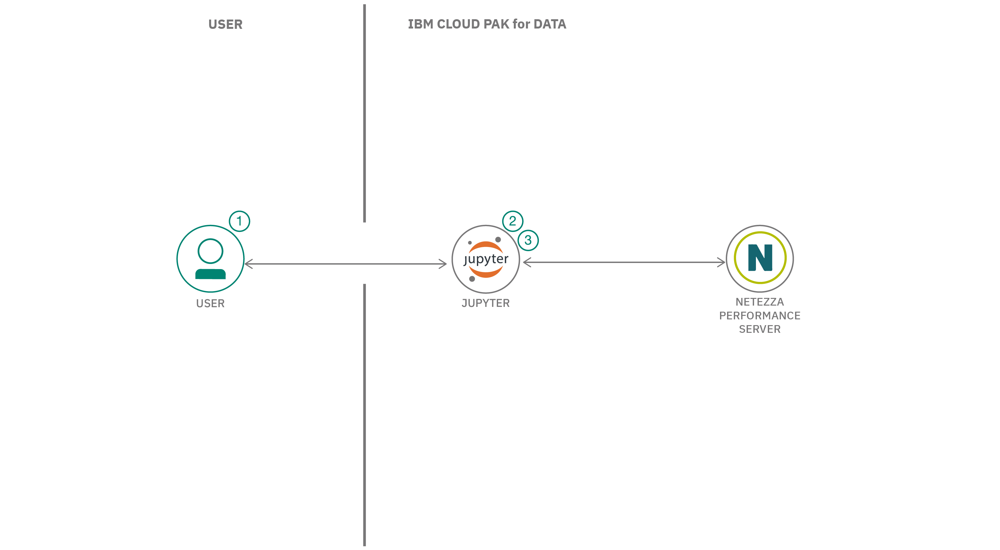

## Summary

In this developer code pattern, you will learn how to load data from various sources and access it to perform research or other business-related activities using Netezza&reg; Performance Server. The parallel architecture of the Netezza database environment enables high-performance computation on large data sets, making it the ideal platform for large-scale data mining applications.

## Description

We will use energy price data and an Australian weather station dataset to analyze the data using Jupyter Notebook with IBM Cloud Pak&trade; for Data. We will step through:

* Connecting to the Netezza database
* Loading data to Netezza using a CSV file, external table, and Cloud Object Storage
* Analyzing and visualizing the data loaded from Netezza Performance Server

## Flow

1. User loads Jupyter Notebook into IBM Cloud Pak for Data.
1. User connects to Netezza using nzpy library connector.
1. User loads and analyzes data from Netezza Performance Server.

## Instructions

Please see the [README](https://github.com/IBM/loading-accessing-data-from-nps/blob/main/README.md) for detailed instructions on how to:

1. Create a new project in CP4D
1. Add connection to Netezza Performance Server
1. Load notebook to your project
1. Install nzpy library
1. Configure Netezza Performance Server connection in notebook
1. Load or unload data from external source
1. Load data from other data sources
1. Load data from Cloud Object Storage
1. Load and analyze Australian weather station data

## Next steps

Try the next part of this learning path below.