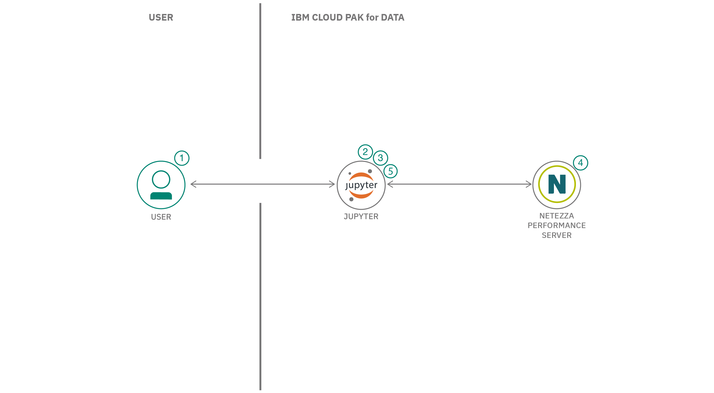

## まとめ

この開発者向けコードパターンでは、Netezza&reg; Performance Serverを使って、分析アルゴリズムの開発や使用を活用し、研究やその他のビジネス関連の活動を行う方法を紹介します。Netezza Performance Serverは、Netezzaアプライアンスが提供する計算能力と並列化メカニズムを利用して、大規模なデータセットに対するデータマイニングタスクを可能にする。Netezzaデータベース環境の並列アーキテクチャは、大規模なデータセットに対する高性能な計算を可能にし、大規模なデータマイニングアプリケーションの理想的なプラットフォームとなっている。

## 説明

Netezzaには、さまざまなサイズのデータセットをマイニングするためのデータベース内分析パッケージがある。IBM Netezza Analyticsは、主要な技術と一般的な実世界のアルゴリズムを適用したデータベース内データマイニングアプリケーションです。

このコードパターンでは、IBM Watson&reg;StudioサービスのIBM Cloud Pak for Data&reg;を使用してJupyter Notebookを使用します。このノートブックには、Netezzaに接続し、データベース内の分析機能を使用してデータを分析し、機械学習アルゴリズムを実行する手順があり、データの予測や予想を行うことができます。Netezzaの分析機能にアクセスするためには、Netezza AnalyticsモジュールをNetezzaサーバーにインストールする必要があります。

ここでは、エネルギー価格のデータセットを使用して、IBM Cloud Pak for Dataを使用してJupyter Notebookでデータを分析します。順を追って説明します。

* Netezzaのデータベース内分析機能を使ってデータを分析する。
* Netezzaのデータベース内の機械学習アルゴリズムを使った機械学習モデルの作成

##フロー

1. ユーザーはJupyter NotebookをIBM Cloud Pak for Dataにロードします。
1. ユーザーはPythonコネクタを使ってNetezzaに接続する。
1. Netezza Performance Serverからデータを読み込み、分析する。
1. Netezzaはデータベース内の分析機能を使ってモデルを作成する。
1. モデルを使って、エネルギー価格を予測・予想する。

##指示

詳しい手順は[README](https://github.com/IBM/prediction-using-netezza-in-database-analytics-functions/blob/main/README.md)に記載されており、以下の方法を学ぶことができます。

1. IBM Cloud Pak for Data で新しいプロジェクトを作成する。
1. Netezzaサーバーへの接続を追加する
1. データ資産のアップロード
1. ノートブックをプロジェクトに読み込む
1. nzpy Pythonライブラリのインストール
1. ノートブックでNetezza Performance Serverの接続を設定する
1. Netezzaにデータを読み込む
1. エネルギー価格データの可視化
1. エネルギー価格データの分析
1. 時系列アルゴリズムによる機械学習モデルの作成

## 次のステップ
次のステップについては、ラーニングパスの概要をご覧ください。