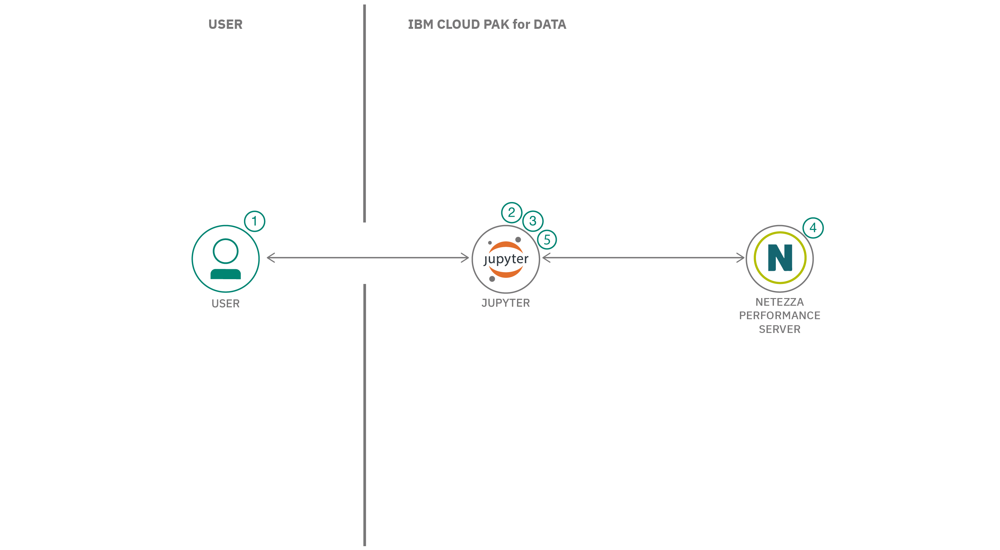

## Summary

In this developer code pattern, we will show you how to leverage the development and use of analytic algorithms to perform research or other business-related activities using Netezza&reg; Performance Server. The Netezza Performance Server enables data mining tasks on large data sets using the computational power and parallelization mechanisms provided by the Netezza appliance. The parallel architecture of the Netezza database environment enables high-performance computation on large data sets, making it the ideal platform for large-scale data mining applications.

## Description

Netezza has in-database analytics packages for mining the spectrum of data set sizes. IBM Netezza Analytics is an in-database data mining application that applies key techniques and popular real-world algorithms.

In this code pattern, we will use a Jupyter Notebook using the IBM Watson&reg; Studio service IBM Cloud Pak for Data&reg;. The notebook has steps to connect to Netezza and use in-database analytic functions to analyze the data and run machine learning algorithms, allowing you to predict and forecast data. In order to access the analytical functions of Netezza, you should install the Netezza Analytics module into the Netezza server.

We will use an energy price dataset to analyze the data with Jupyter Notebook using IBM Cloud Pak for Data. We will walk you through:

* Analyzing data using Netezza in-database analytic functions
* Creating machine learning models using Netezza in-database machine learning algorithms

## Flow

1. User loads Jupyter Notebook into IBM Cloud Pak for Data.
1. User connect to Netezza using Python connector.
1. User loads and analyzes data from Netezza Performance Server.
1. Netezza creates models using in-database analytics functions.
1. User forecasts and predicts energy price using the model.

## Instructions

Detailed instructions are in the [README](https://github.com/IBM/prediction-using-netezza-in-database-analytics-functions/blob/main/README.md), where you will learn how to:

1. Create a new project in IBM Cloud Pak for Data
1. Add connection to Netezza server
1. Upload data assets
1. Load notebook to your project
1. Install the nzpy Python library
1. Configure Netezza Performance Server connection in notebook
1. Load data into Netezza
1. Visualize energy price data
1. Analyze energy price data
1. Create machine learning model using time series algorithm

## Next steps
See the learning path summary for further steps.