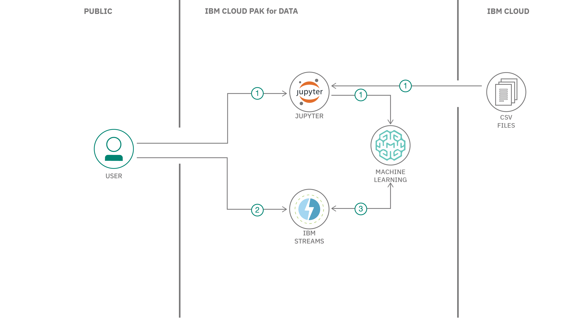

## まとめ

この開発者向けコードパターンでは、オンラインショッピングのデータをストリーミングし、そのデータを使って各顧客がカートに追加した商品を追跡します。scikit-learnを使ってk-meansクラスタリングモデルを構築し、ショッピングカートの内容に応じて顧客をグループ化します。クラスタの割り当てを利用して、推奨する追加商品を予測することができます。

## 説明

私たちのアプリケーションは、IBM Cloud Pak&reg; for Data上のIBM Streamsを使用して構築されます。IBM Streams は、Streams Flows と呼ばれる内蔵 IDE を提供しており、視覚的にストリーミング・アプリを作成することができます。IBM Cloud Pak for Data プラットフォームは、複数のデータ・ソースとの統合、組み込みのアナリティクス、Jupyter Notebooks、機械学習などの追加サポートを提供します。

機械学習モデルを構築してデプロイするには、IBM Watson&reg; Studio の Jupyter Notebook と Watson Machine Learning インスタンスを使用します。この例では、両方とも IBM Cloud Pak for Data 上で実行しています。

Streams Flows エディターを使用して、以下の演算子を持つストリーミングアプリを作成します。

* サンプルのクリックストリームデータを生成するSource演算子
* 「カートに入れる」イベントのみを保持するFilter演算子
* ショッピングカートのアイテムをPythonコードでスコアリング用の入力配列に配置するCode演算子
* 顧客をクラスタに割り当てる WML Deployment 演算子
* 結果を表示するためのDebug演算子

## フロー

1. ユーザーが機械学習モデルを構築し、デプロイします。
1. ユーザーは、IBM Streams アプリケーションを作成して実行します。
1. Streams Flow UIでは、ストリーミング、フィルタリング、スコアリングの動作が表示されます。

##指示

[始める準備はできましたか？README](https://github.com/IBM/ibm-streams-with-ml-model/blob/master/README.md)では、以下の手順を説明しています。

1. Cloud Pak for Data上のIBM Streamsインスタンスへのアクセスを確認します。
1. Cloud Pak for Dataで新しいプロジェクトを作成します。
1. モデルを構築して保存します。
1. デプロイメントスペースをプロジェクトに関連付けます。
1. モデルをデプロイする。
1. Streams Flow アプリケーションを作成して実行します。