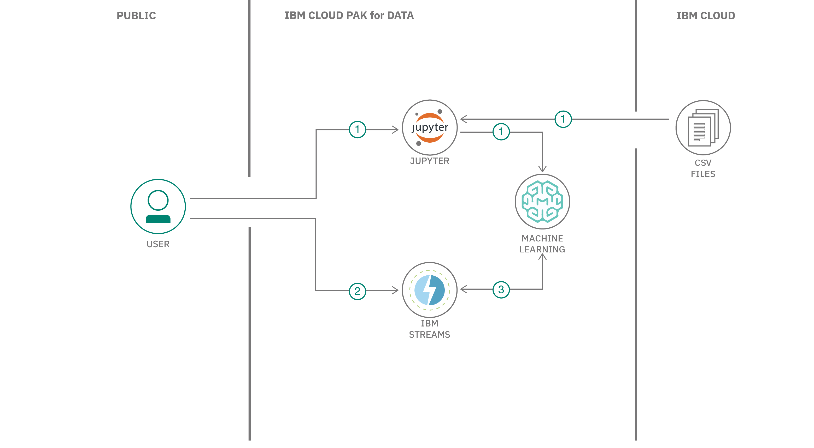

## Summary

In this developer code pattern, we will be streaming online shopping data and using the data to track the products that each customer has added to the cart. We will build a k-means clustering model with scikit-learn to group customers according to the contents of their shopping carts. The cluster assignment can be used to predict additional products to recommend.

## Description

Our application will be built using IBM Streams on IBM Cloud Pak&reg; for Data. IBM Streams provides a built-in IDE, called Streams Flows, that allows you to visually create a streaming app. The IBM Cloud Pak for Data platform provides additional support, such as integration with multiple data sources, built-in analytics, Jupyter Notebooks, and machine learning.

To build and deploy our machine learning model, we will use a Jupyter Notebook in IBM Watson&reg; Studio and a Watson Machine Learning instance. In our examples, both are running on IBM Cloud Pak for Data.

Using the Streams Flows editor, we will create a streaming app with the following operators:

* A Source operator that generates sample clickstream data
* A Filter operator that keeps only the "add to cart" events
* A Code operator where we use Python code to arrange the shopping cart items into an input array for scoring
* A WML Deployment operator to assign the customer to a cluster
* A Debug operator to demonstrate the results

## Flow

1. User builds and deploys a machine learning model.
1. User creates and runs an IBM Streams application.
1. The Streams Flow UI shows streaming, filtering, and scoring in action.

## Instructions

Ready to get started? The [README](https://github.com/IBM/ibm-streams-with-ml-model/blob/master/README.md) explains the steps to:

1. Verify access to your IBM Streams instance on Cloud Pak for Data.
1. Create a new project in Cloud Pak for Data.
1. Build and store a model.
1. Associate the deployment space with the project.
1. Deploy the model.
1. Create and run a Streams Flow application.