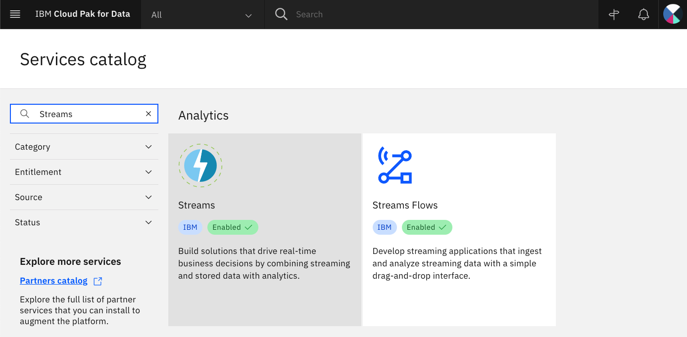
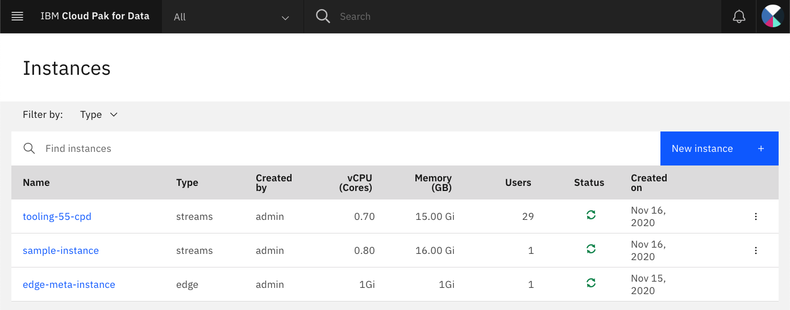

## Introduction

このチュートリアルの目的は、ストリーミング・アプリケーションにWebサービスを追加する方法を学ぶことです。ストリーミング・アプリケーションは、データ・ソースから始まり、フィルタリングやアグリゲーションなどのデータ処理を行い、その結果を1つまたは複数のターゲットに送信します。RESTエンドポイントを持つWebサービスを追加することで、IBM Streams Pythonアプリケーションにデータを「POST」し、アプリケーションが生成したデータを「GET」する方法を紹介します。

Webサービスは、IBM Cloud Pak&reg; for Data上のサービス・インスタンスとして実行されます。Web サービスのクライアントはどこでも実行できます。cURL を使ってコマンドラインからテストしたり、IBM Streams アプリを別のアプリと統合したりすることができます。ここでは、Python ノートブックからのテスト方法と、Web サービスに組み込まれた Swagger UI からのテスト方法を紹介します。

## 前提条件

機能の詳細やドキュメントについては、[ブログ記事](https://community.ibm.com/community/user/cloudpakfordata/blogs/natasha-dsilva1/2020/12/07/send-and-receive-streaming-data-via-rest-with-ibm?CommunityKey=c0c16ff2-10ef-4b50-ae4c-57d769937235)をお読みください。

このチュートリアルを完了するには、IBM Cloud Pak for Data 3.5 と IBM Streams のインスタンスにアクセスする必要があります。IBM Cloud Pak for Data のユーザー・アカウントは、IBM Streams インスタンスのユーザーまたは管理者として割り当てられる必要があります。

## 見積もり時間

このチュートリアルを完了するには、約 30 分かかります。

## 手順

このチュートリアルでは、REST API と連動するシンプルな IBM Streams アプリを構築するためのすべての手順を説明します。これには以下が含まれます。

1. IBM Cloud Pak for Data で新しいプロジェクトを作成する
1. プロジェクトにノートブックを追加する
1. IBM Cloud Pak for DataでIBM Streamsインスタンスを識別する
1. REST経由でデータを利用可能にするStreamsアプリケーションの作成
1. REST経由でデータを取り込むStreamsアプリケーションの作成

### ステップ 1.IBM Cloud Pak for Data で新規プロジェクトを作成します。

IBM Cloud Pak for Dataでは、特定の目標を達成するために使用するリソース(問題に対するソリューションを構築するためのリソース)を集めて整理するために、プロジェクトという概念を使用しています。プロジェクトのリソースには、データ、共同作業者、ノートブックやモデル、IBM Streams Flows などの分析資産が含まれます。

画面左上のハンバーガー(☰)メニューをクリックし、「**Projects > All projects**」をクリックします。「**新規プロジェクト+**」ボタンをクリックし、空のプロジェクトを作成します。プロジェクトに固有の名前を入力して、**Create**をクリックします。

### ステップ 2.プロジェクトにノートブックを追加する

ここでは、Streamsx APIを利用して、`Topology`と呼ばれるストリーミングアプリケーションを構築するためのPythonコードを含むJupyterノートブックを用意しました。このアプリケーションは、`Topology`を送信することで開始され、実行中のStreamsジョブが作成されます。

また、アプリケーションを起動すると、IBM Cloud Pak for Data上のサービス・インスタンスとして実行されるWebサービスが作成されます。このサービスは、実行中のIBM Streamsアプリケーションと対話できるREST APIを提供します。

プロジェクト内で、**Add to project +**ボタンをクリックして、**Notebook**を選択します。

**From URL**タブを選択し、**Select runtime**プルダウンでDefault Python 3.6を選択し（Streamsは3.6が必要）、**Notebook URL**に以下のURLを入力し、**Create**をクリックします。

次のステップに進み、ノートブックの実行とREST APIへのアクセスを説明します。ノートブックには、以下のセクションがあります。

* Streams インスタンスの構成
* 例1：REST経由でデータを利用可能にするStreamsアプリケーションの作成
  * アプリケーションの送信
  * RESTエンドポイントのテスト
  * ジョブとインスタンスのキャンセル
* 例2：REST経由でデータを取り込むStreamsアプリケーションの作成
  * インジェストアプリケーションの送信
  * Streamsジョブにいくつかのデータを送信
  * Use a view to see the data sent to the application
  * ジョブとインスタンスをキャンセルする

### ステップ 3.IBM Cloud Pak for Data で IBM Streams インスタンスを特定します。

管理者が IBM Streams のインスタンスをプロビジョニングし、ユーザーにそのインスタンスへのアクセス権を与えていることを確認します。

利用可能なサービスを確認するには、画面左上のハンバーガー（☰）メニューのアイコンをクリックし、**Services > Services catalog**をクリックします。「Streams」を検索します。「Enabled」のインジケータが表示されているはずです。

プロビジョニングされたインスタンスを確認するには、画面左上のハンバーガー(☰)メニューアイコンをクリックし、**Services > Instances**をクリックします。以下に使用するStreamsインスタンスの名前をコピーします。

1. ノートブックの最初のコードセルを編集して、Streamsインスタンス名を設定します。

  # この例のPOST_ENDPOINTを編集して、SwaggerのUIから取得した値を設定する
  POST_ENDPOINT = "<your-post-endpoint>"

  endpoint = base_cpd_url + post_endpoint