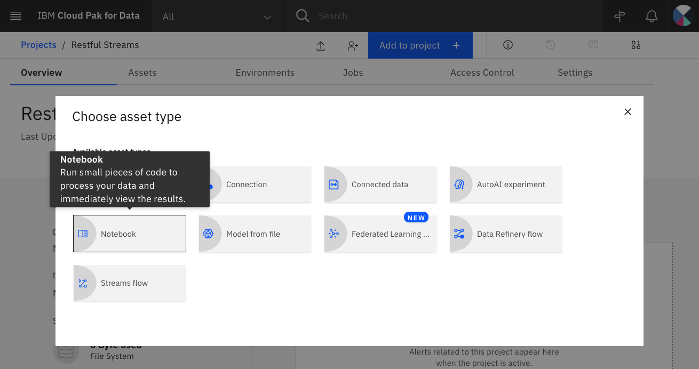
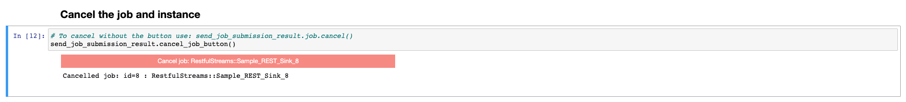

## Introduction

The goal of this tutorial is to teach you how to add a web service to a streaming application. Streaming apps start with a data source, do some data processing (such as filtering and aggregation), and send the results to one or more targets. By adding a web service with REST endpoints, we'll show you how you can `POST` data to an IBM Streams Python application and `GET` the data produced by the application.

The web service will run as a service instance on IBM Cloud Pak&reg; for Data. Your web service clients can run anywhere. You can test it from your command line with cURL or integrate the IBM Streams app with another app. We'll demonstrate how to test it from a Python notebook and from the web service's built-in Swagger UI.

## Prerequisites

You may like to read a [blog post](https://community.ibm.com/community/user/cloudpakfordata/blogs/natasha-dsilva1/2020/12/07/send-and-receive-streaming-data-via-rest-with-ibm?CommunityKey=c0c16ff2-10ef-4b50-ae4c-57d769937235) about feature details and documentation.

To complete this tutorial, you will need access to IBM Cloud Pak for Data 3.5 and an instance of IBM Streams. Your user account in IBM Cloud Pak for Data will need to be assigned as a user or administrator of the IBM Streams instance.

## Estimated time

It will take approximately 30 minutes to complete this tutorial.

## Steps

This tutorial will cover all of the steps to building simple IBM Streams apps that interact with a REST API. This includes:

1. Creating a new project in IBM Cloud Pak for Data
1. Adding the notebook to your project
1. Identifying your IBM Streams instance on IBM Cloud Pak for Data
1. Creating a Streams application that makes data available via REST
1. Creating a Streams application that ingests data via REST

### Step 1. Create a new project in IBM Cloud Pak for Data

In IBM Cloud Pak for Data, we use the concept of a project to collect and organize resources used to achieve a particular goal (resources to build a solution to a problem). Your project resources can include data, collaborators, and analytic assets like notebooks, models, IBM Streams Flows, etc.

Click on the hamburger (☰) menu in the top-left corner of your screen, then click **Projects > All projects**. Click the **New project +** button and create an empty project. Enter a unique name for your project, then click **Create**.


### Step 2. Add the notebook to your project

We have provided a Jupyter Notebook that contains Python code utilizing the streamsx API to build a streaming application, called a `Topology`. The application is started by submitting the `Topology`, which will create a running Streams job.

Starting the application will also create a web service that runs as a service instance on IBM Cloud Pak for Data. The service provides a REST API that allows us to interact with the running IBM Streams application.


From within your project, click on the **Add to project +** button, then select **Notebook**.



Select the **From URL** tab, use the **Select runtime** pulldown to choose Default Python 3.6 (Streams requires 3.6), and under **Notebook URL**, provide the following URL, then click **Create**.

```
static/restful_streams.ipynb
```


Continue on to the next steps, which will walk you through running the notebook and accessing the REST API. The notebook includes the following sections:

* Configure the Streams instance
* Example 1: Create a Streams application that makes data available via REST
  * Submit the application
  * Test the REST endpoint
  * Cancel the job and instance
* Example 2: Create a Streams application that ingests data via REST
  * Submit the ingest application
  * Send some data to the Streams job
  * Use a view to see the data sent to the application
  * Cancel the job and instance

### Step 3. Identify your IBM Streams instance on IBM Cloud Pak for Data

Ensure that your admin has provisioned an instance of IBM Streams and has given your user access to the instance.

To see the available services, click on the hamburger (☰) menu icon in the top-left corner of your screen and click **Services > Services catalog**. Search for Streams. You should see an Enabled indicator.


To see your provisioned instances, click on the hamburger (☰) menu icon in the top-left corner of your screen and click **Services > Instances**. Copy the name of your Streams instance to use below.


1. Edit the first code cell in the notebook to set your Streams instance name:

   ```python
   # Edit to specify the name of the streams instance to use

   STREAMS_INSTANCE_NAME = "<your-streams-instance-name>"
   ```

1. Run the cell to assign the `STREAMS_INSTANCE_NAME` variable, which is used in later cells to submit your applications to the Streams instance.

1. Run the next cell and enter your USERNAME and PASSWORD at the prompt. These variables will be used for REST API testing.

### Step 4. Create an IBM Streams application that makes data available via REST

In the first example, we'll generate a stream of random numbers to use as the source data and demonstrate using the REST API to `GET` the streaming data.


The key to creating a web service that allows us to `GET` the result data via a REST API is the `EndpointSink` operator. It receives a stream of data and responds to GET requests by returning the data on the stream as JSON. To use the operator, you must have a stream of data you wish to access via REST and define a schema for the stream.

Continue running the notebook cells one at a time, from the top down, to:

* Import Python modules
* Define shared functions and globals
* Create the topology
* Define the schema
* Define a source data generator
* Call the `EndpointSink` operator
* Submit the application
* Test the REST endpoint

#### Define the schema

To make a stream available via a REST endpoint, a schema must be defined for the data tuples on the stream. We create a class that inherits from `typing.NamedTuple` and use type annotations to specify data types for each field in the tuple.  Later in the notebook we will use this schema to create the stream of data.

```python
class Readings(typing.NamedTuple):
    reading: float
    index: int
    address: str
    timeStamp: int
```

#### Call the `EndpointSink` operator

The `Topology` definition ends with invoking this operator. This will result in the creation of the web service instance on IBM Cloud Pak for Data. See the notebook for more details.

```python
# Add an EndpointSink with service and endpoint documentation
# Send each tuple on the source stream to the EndpointSink operator.
# This operator will create a REST endpoint that you can use to access the data from the stream.
source.for_each(EndpointSink(
    buffer_size=100000,
    service_documentation=service_documentation,
    endpoint_documentation=endpoint_documentation
    ), name='Send to Job Service_Tuples')
```

#### Submit the `Topology`

When you submit the `Topology`, a status indicator is shown.


When the application has been submitted, the job ID and name is shown.


To see the project's jobs:

* Use another browser tab and go to your project.
  * Click on the hamburger (☰) menu in the top-left corner of your screen.
  * Click **Projects > All projects**.
  * Click on your project.
* Select the **Jobs** tab.


To see the running application:

* Click on the start time of the current run.
* Click on the Streams job graph name.


To see your provisioned web service instances:

* Click on the hamburger (☰) menu icon in the top-left corner of your screen and click **Services > Instances**.
* Look for a new instance of type `streams-application` with a name in the format `<streams-instance-name>.<streams-space-name>.<job-id>`.
* Click on the name.
* Copy the data access endpoint for the `GET` method (right-click and copy).
  

To test the endpoint from the notebook:

* Paste the `GET` endpoint into the next cell of the notebook (wrapped with quotes) to set `GET_ENDPOINT`.
* Set the `BASE_CPD_URL` to the URL you use to access IBM Cloud Pak for Data.

  ```python
  # Edit this example GET_ENDPOINT to set the value you get from the Swagger UI
  GET_ENDPOINT = "<your-get-endpoint>"
  # Edit this example BASE_CPD_URL to set the URL of your CPD
  BASE_CPD_URL = "<your-cpd-url>"

  ENDPOINT = BASE_CPD_URL + GET_ENDPOINT
  ```

* Run the cell to set these values.
* Run the next cell to test `GET` in a loop.
  * The first fetch will print a collection of tuples with random readings.
  * After sleeping 1 second, the second fetch retrieves only the new reading.
  

To cancel the job and the instance from the notebook:

* Run the next cell.
* Click the button it produces.
  

### Step 5. Create an IBM Streams application that ingests data via REST

Continuing in the same notebook, you will create a streaming application that lets you `POST` data to the application. The application accepts numbers as input, doubles each number, and then makes them available again via the `GET` endpoint.  

To ingest data via REST, this application will use the `EndpointSource` operator to create a stream that contains the data received from POST requests. To call the operator, you need to define the expected schema of the POST data.

#### Define the schemas

This time we define two schemas:

* `IncomingReadings`, schema for data received via `POST`
* `DoubledReading` schema for data sent via `GET`

```python
# Define the schema of the incoming data
class IncomingReadings(typing.NamedTuple):
    index: int
    ID: str
    timeStamp: datetime.datetime

# Define the schema of the outgoing data
class DoubledReading(typing.NamedTuple):
    doubled_value: int
    index: int
    ID: str
    timeStamp: datetime.datetime
```

#### Call the `EndpointSource` operator

After defining the schema, call the `EndpointSource` operator, specifying the schema as a parameter.

```python
# Invoke the EndpointSource operator as the data source
source_operator = reciever_topology.source(EndpointSource(
   schema=IncomingReadings,
   buffer_size=10000,
   service_documentation=service_documentation,
   endpoint_documentation=endpoint_documentation), name='IngestData')

incoming = source_operator
```

The `incoming` object is the stream produced by the `EndpointSource` operator.

After processing the `incoming` stream, we will again use an `EndpointSink` to `GET` the result data via the REST API.

#### The running application


#### Testing the REST API with POST

After you submit the ingest application, find the new instance and copy the `POST` endpoint:

* Click on the hamburger (☰) menu icon in the top-left corner of your screen and click **Services > Instances**.
* Look for a new instance of type `streams-application` with a name in the format `<streams-instance-name>.<streams-space-name>.<job-id>`.
* Click on the name.
* Copy the data access endpoint for the `POST` method.
  

To test the `POST` endpoint from the notebook:

* Paste the `POST` endpoint into the next cell of the notebook.

  ```python
  # Edit this example POST_ENDPOINT to set the value you get from the Swagger UI
  POST_ENDPOINT = "<your-post-endpoint>"

  ENDPOINT = BASE_CPD_URL + POST_ENDPOINT
  ```

* Run the cell to set these values.
* Run the next cell to test `POST` in a loop in the background.
* The following cells allow you to view a sample of the streaming data.

  

Try the Swagger UI to `POST` data:

* Go to the Swagger web page.
* Click on `POST`.
* Click **Try it out**, then click **Execute**.


* View the results
  * The Responses section provides an example cURL command you can try on your command line.
  * The Server response should be code 204, which means the data was successfully posted.

  

To cancel the job and the instance from the notebook:

* Run the next cell.
* Click the button it produces.

  