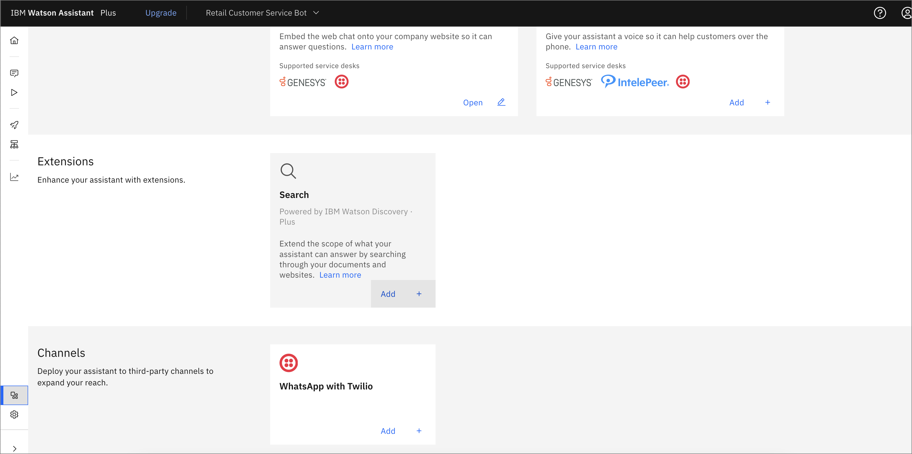
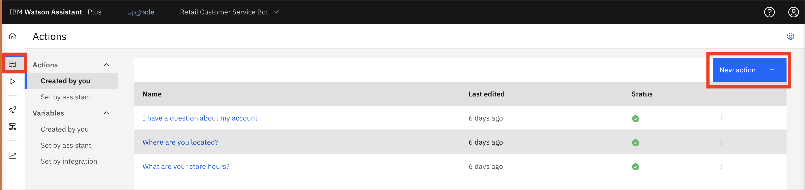
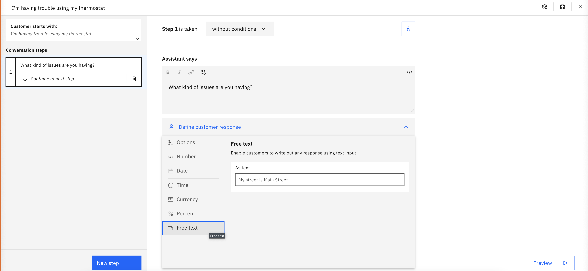
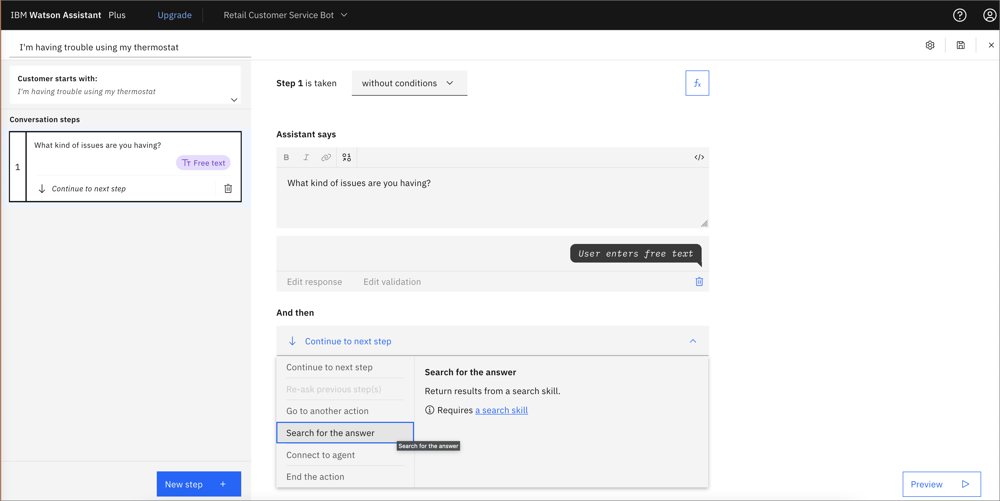
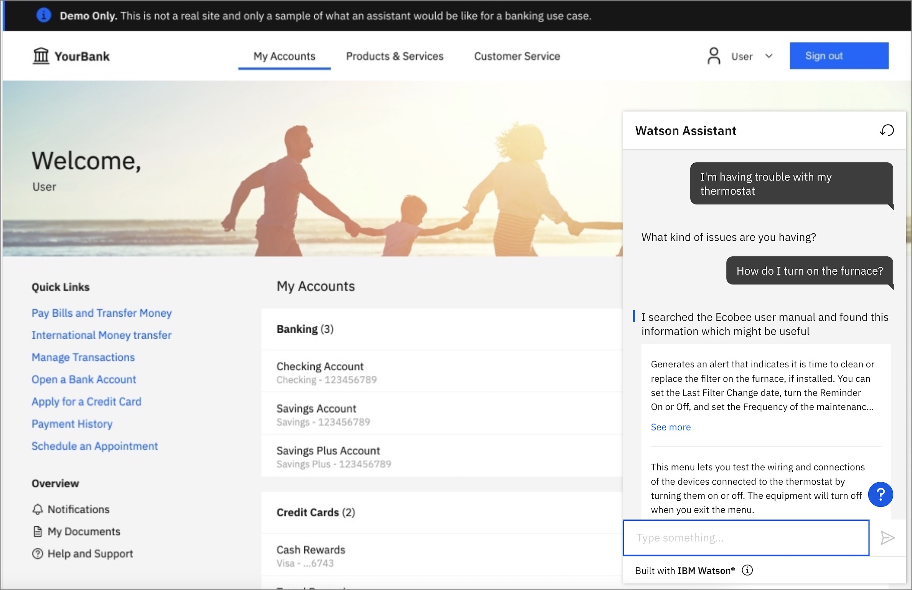
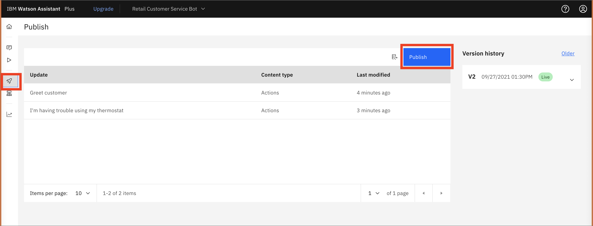
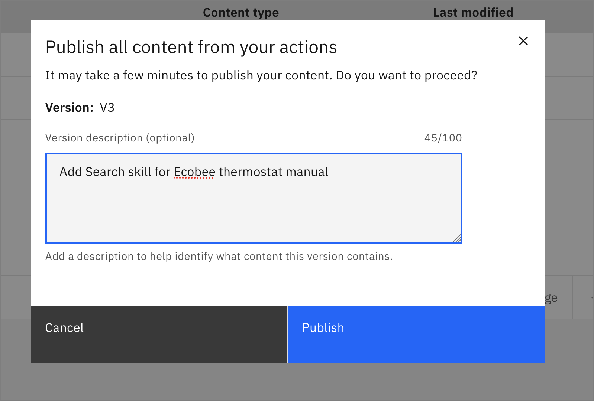
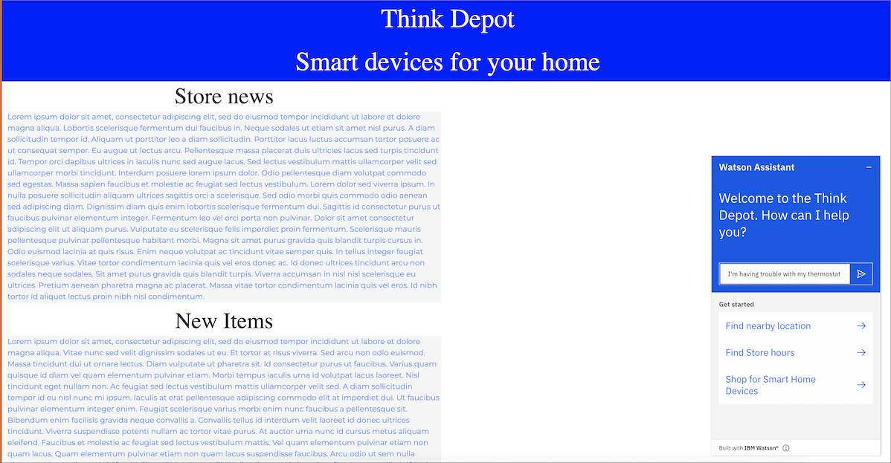
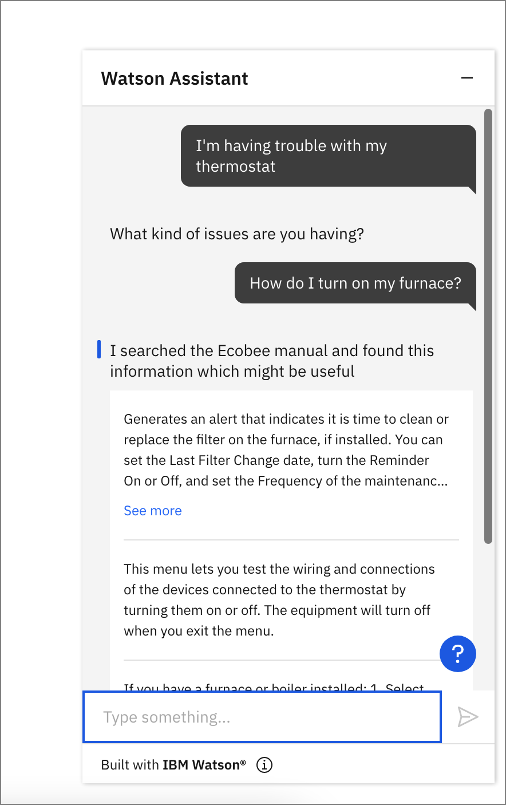

IBM Watson Assistantは、自然言語を用いたインテリジェントなインターフェースを提供することで、問題解決を支援します。GUI ツールと API の柔軟性を組み合わせることで、アプリケーションやツールをシンプルかつ効率的に強化することができます。アシスタントを公開した後は、簡単に Web ページに埋め込んで、ユーザーが対話できるようにすることができます。

## 前提条件

[Watson Assistant](https://cloud.ibm.com/catalog/services/watson-assistant?cm_sp=ibmdev-_-developer-tutorials-_-cloudreg)の公開されたインスタンスが必要です。[Watson Assistant ラーニングパス](https://developer.ibm.com/learningpaths/get-started-watson-assistant) に従っている場合はすでに持っていますが、どの Assistant チャットボットでも使用できます。

また、[Watson Discovery](https://cloud.ibm.com/catalog/services/watson-discovery?cm_sp=ibmdev-_-developer-tutorials-_-cloudreg)のインスタンスも必要です。[スマートドキュメント理解検索スキル](https://developer.ibm.com/learningpaths/get-started-watson-discovery/smart-document-understanding-search-skill/)を完了している場合は、そのスキルを使用できます。それ以外の場合は、Discoveryプロジェクトのサンプルの1つを使用できます。

## ステップ

### チャットボットにディスカバリースキルを追加する

1. アシスタントのインスタンスを起動し、**統合**をクリックします。

    

1. **拡張機能**セクションまでスクロールダウンして、検索の下にある**Add +**をクリックします。

    をクリックします。

1. ウィンドウが開いたら、「**Confirm**」をクリックします。

1. **Search Integration**ページで、このチュートリアルで使用するDiscoveryインスタンスを選択します。

    をクリックします。

1. 使用したいプロジェクトを選択します。チュートリアルの[スマートドキュメント理解検索スキル](https://developer.ibm.com/learningpaths/get-started-watson-discovery/smart-document-understanding-search-skill/)を完了している場合は自分で作成したものを選ぶか、**サンプルプロジェクト**を選びます。

    

1. 次の画面では、結果の内容を設定することができます。この例では、タイトルを削除し、表示テキストを変更しました。プレビューを使ってテストすることができます。

    

1. 次に、この検索のアクションを追加します。**Actions**タブに戻り、**New action +**をクリックします。

    

1. 新しいアクションに名前を付けて、**Save**をクリックします。

    

1. **Define customer response**で、**Free text**を選択します。

    

1. **And then**の下で、**Search for the answer**をクリックします。

    をクリックします。

1. **プレビュー**タブをクリックして、テキスト`I'm having trouble with my thermostat`を入力してテストすることができます。と聞かれたら、「How do I turn on the furnace?」と入力してください。なお、質問の別の方法を追加することができ、検索スキルは他の質問にも答えてくれます。

    

1. プレビューテストに問題がなければ、**公開**にアクセスして**公開**をクリックすることで、この新しいアクションを公開できます。

    

1. バージョンの説明を追加して、**Publish**をクリックします。

    

1. 検索スキルはまだドラフトモードなので、Integrationsに戻って検索を開く必要があります。

    

1. ドロップダウンメニューで **Live** を選択し、**Confirm** をクリックします。

    

1. [チャットボットを組み込んだデプロイ済みのアプリ](/learningpaths/get-started-watson-assistant/embed-an-assistant-chatbot/)を作成している場合は、新しい検索スキルをテストできます。

    

1. ダイアログで検索スキルが使えるようになりました。

    

## 結論

このチュートリアルでは、UI ツールを使用して Watson Discovery Search スキルをチャットボットに数分で統合する方法を紹介しました。この機能を使えば、ユーザーはウェブチャット環境を離れることなく、製品やサービスに関する追加情報を得ることができます。