IBM Watson Assistant can help you solve a problem by providing an intelligent interface using natural language. The flexibilities of the GUI tools and APIs combine to let you power applications and tools simply and efficiently. After your assistant is published, you can easily embed it into a web page to allow your users to interact.

## Prerequisites

You need a published instance of [Watson Assistant](https://cloud.ibm.com/catalog/services/watson-assistant?cm_sp=ibmdev-_-developer-tutorials-_-cloudreg). If you are following the [Watson Assistant learning path](https://developer.ibm.com/learningpaths/get-started-watson-assistant), then you already have this, but you can use any Assistant chatbot.

You also need an instance of [Watson Discovery](https://cloud.ibm.com/catalog/services/watson-discovery?cm_sp=ibmdev-_-developer-tutorials-_-cloudreg). If you have completed the [Smart Document Understanding search skill](https://developer.ibm.com/learningpaths/get-started-watson-discovery/smart-document-understanding-search-skill/), you can use that skill. Otherwise, you can use one of the sample Discovery projects.

## Steps

### Add the Discovery skill to your chatbot

1. Launch your Assistant instance, and click **Integrations**.

    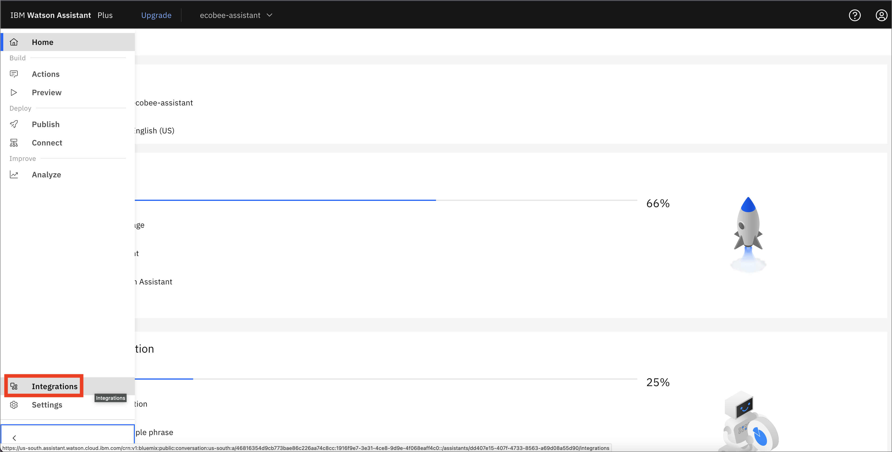

1. Scroll down to the **Extensions** section, and click **Add +** under Search.

    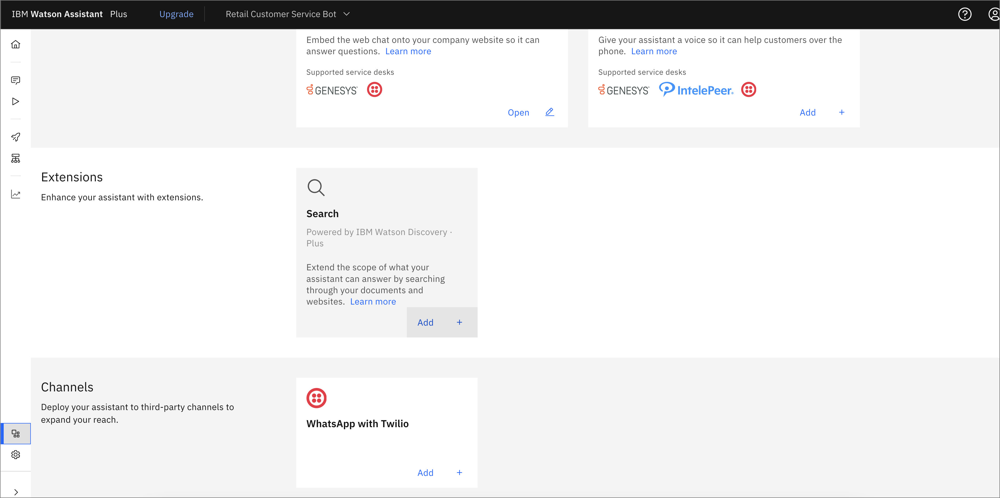

1. When the window opens, click **Confirm**.

1. On the **Search Integration** page, choose the Discovery instance that you want to use for this tutorial.

    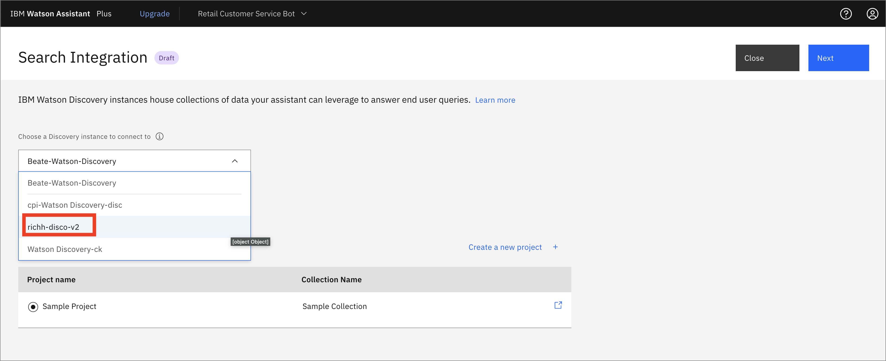

1. Choose which project you want to use. Either choose the one that you created if you have completed the [Smart Document Understanding search skill](https://developer.ibm.com/learningpaths/get-started-watson-discovery/smart-document-understanding-search-skill/) tutorial, or choose **Sample project**.

    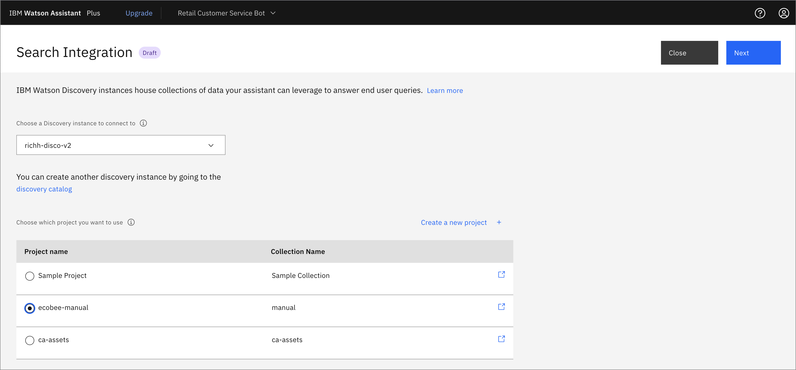

1. On the next screen, you can configure the result content. In this example, we removed the title and changed the display text. You can use the preview to test.

    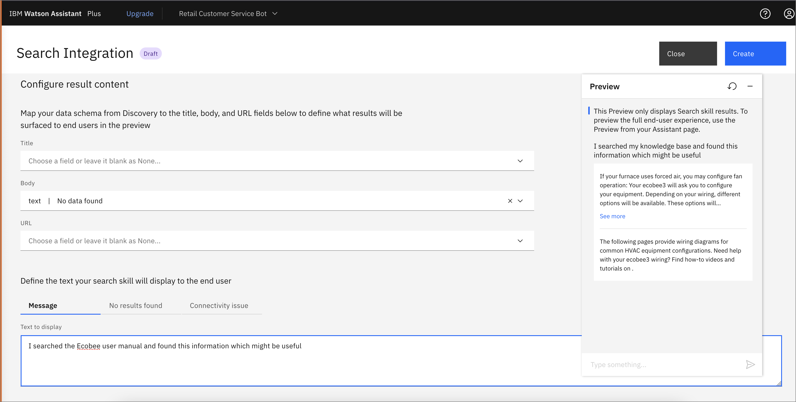

1. Next, add an action for this search. Go back to the **Actions** tab, and click **New action +**.

    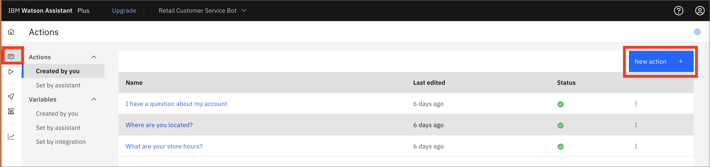

1. Name the new action, then click **Save**.

    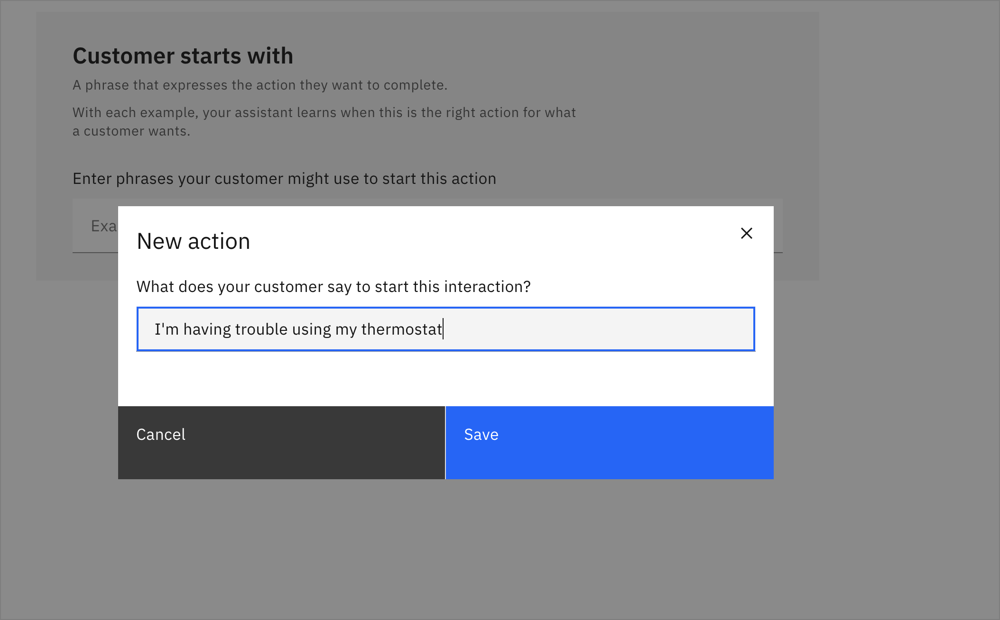

1. Under **Define customer response**, choose **Free text**.

    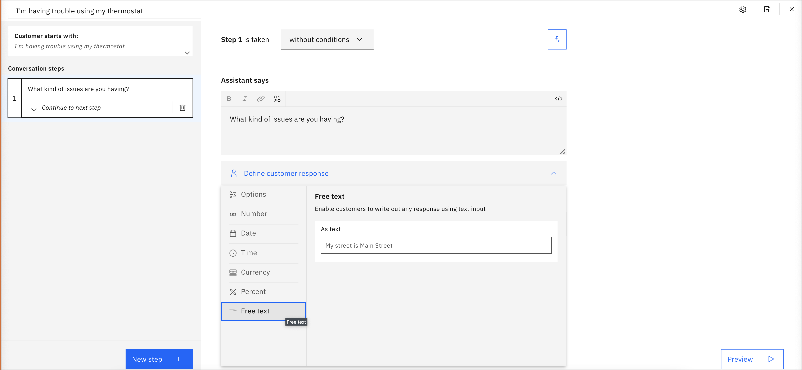

1. Under **And then**, click **Search for the answer**.

    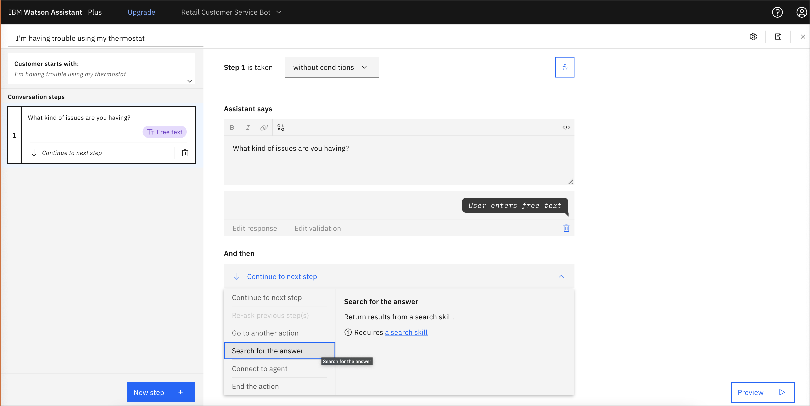

1. You can click the **Preview** tab and test by entering the text `I'm having trouble with my thermostat`. When asked "What kind of issues are you having?", you can enter `How do I turn on the furnace?`. Note that you can add alternative ways of asking the question and the search skill answers the other questions as well.

    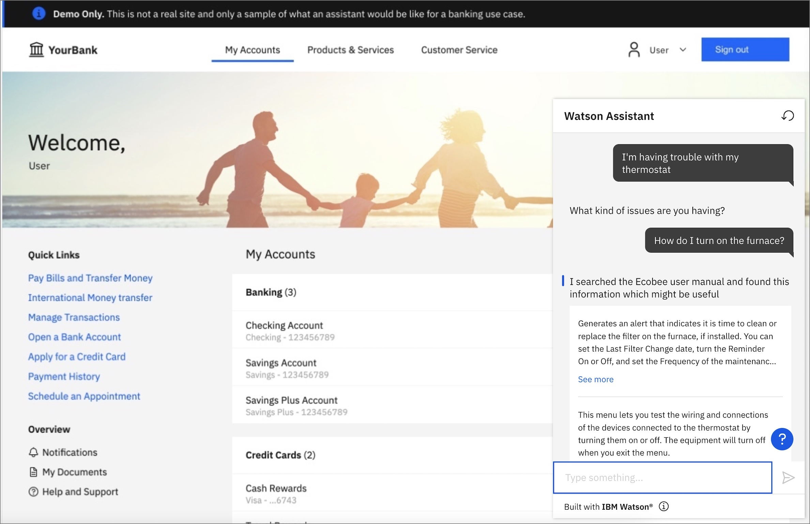

1. If you are happy with the preview test, you can publish this new action by going to **Publish** and clicking **Publish**.

    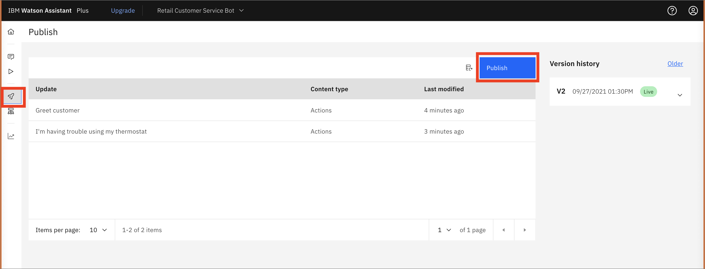

1. Add a version description, and click **Publish**.

    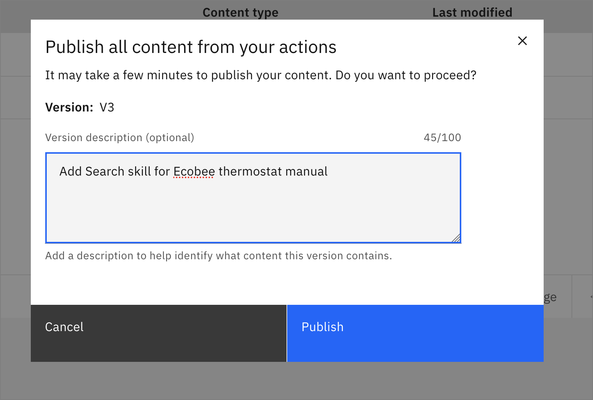

1. The Search skill is still in draft mode, so you must return to the Integrations and open the search.

    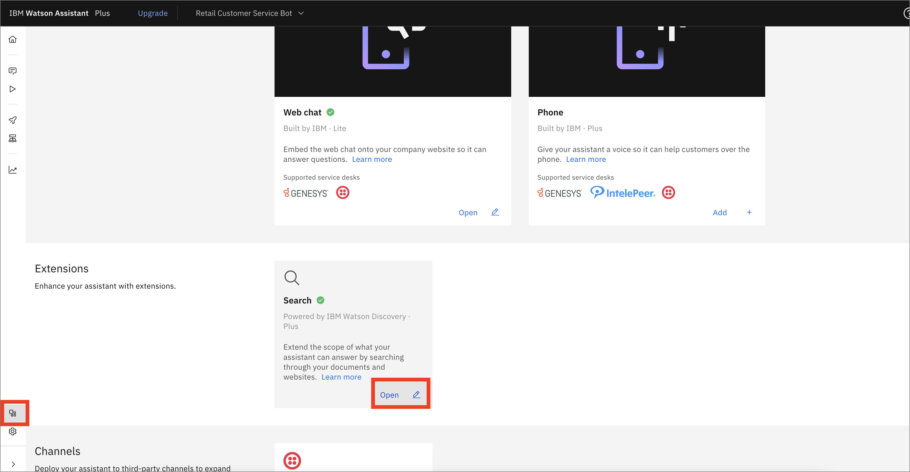

1. Choose **Live** in the drop-down menu, and click **Confirm**.

    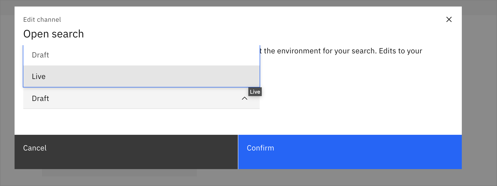

1. If you have created a [deployed app with an embedded chatbot](/learningpaths/get-started-watson-assistant/embed-an-assistant-chatbot/), you can test the new search skill.

    

1. The dialog can now use the search skill.

    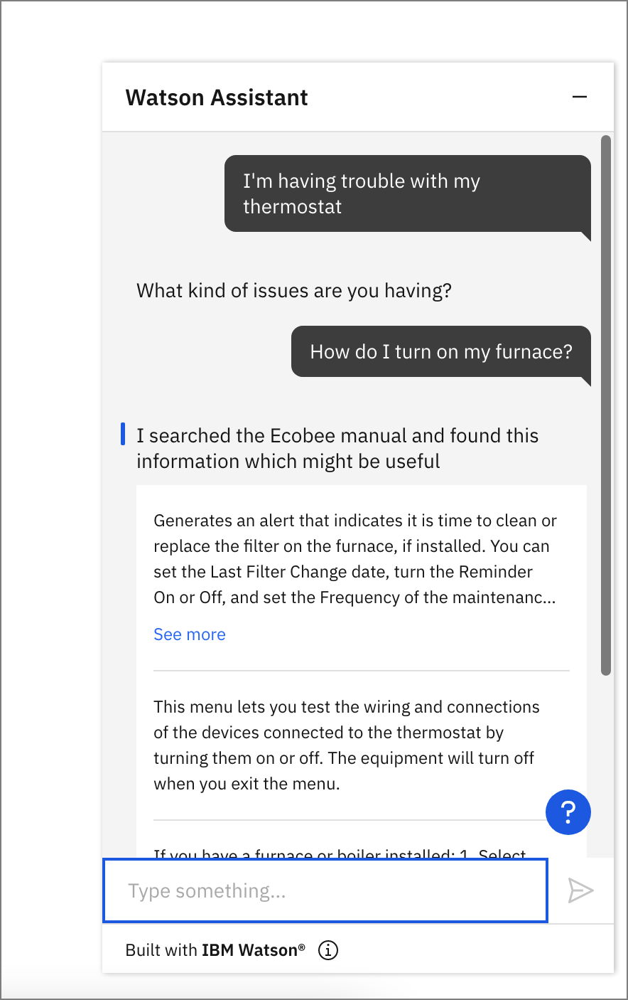

## Conclusion

This tutorial showed how to integrate a Watson Discovery Search skill into a chatbot using the UI tooling in a few minutes. With this feature, the user can get additional information on a product or service without leaving the web chat environment.