---
also_found_in:
- learningpaths/dataops-fundamentals/
authors: ''
completed_date: '2021-07-20'
components:
- cloud-pak-for-data
draft: false
excerpt: 発見されたデータの扱い方と、発見された資産にガバナンスの成果物を関連付ける方法を学びます。データ資産の主キーを特定し、資産間の外部キー関係を特定するために関係分析を行う。
last_updated: '2021-10-19'
meta_description: 発見されたデータの扱い方と、発見された資産にガバナンスの成果物を関連付ける方法を学びます。データ資産の主キーを特定し、資産間の外部キー関係を特定するために関係分析を行う。
meta_keywords: dataops
meta_title: 発見されたデータを分析して、データの品質に関する洞察を得る
primary_tag: analytics
subtitle: データ品質の分析と向上
tags:
- data-management
title: 発見されたデータを分析して、データの品質に関する洞察を得る
---

[Learn to discover data that resides-in-your-data-sources](/tutorials/learn-toiscover-data-that-resides-in-your-data-sources) チュートリアルでは、Watson Knowledge Catalog のデータ発見機能を使ってデータを発見する方法を見ました。このチュートリアルでは、発見されたデータを扱い、発見された資産にガバナンスの成果物を関連付ける方法を学びます。データ資産の主キーを特定し、関係分析を行って資産間の外部キー関係を特定します。さらに、データ品質分析の結果を見て、データ資産の品質スコアに何が影響するかを観察します。また、データ資産が遵守すべきルールを実施する方法も学びます。

## 学習目標

このチュートリアルでは、以下のことを行います。

* データ資産のデータクラス、ビジネス用語、キーを見直し、更新する。
* リレーションシップ分析を実行して、データ資産間の外部キーの関係を特定します。
* データ品質ディメンションの見直し
* データ品質を向上させるためのルールの追加
* データ資産の再分析を行い、データ品質の変化を観察する

## 前提条件

* [IBM Cloud Pak for Data v4.0](https://www.ibm.com/jp-ja/products/cloud-pak-for-data)
* [Watson Knowledge Catalog on Cloud Pak for Data](https://www.ibm.com/docs/en/cloud-paks/cp-data/4.0?topic=services-watson-knowledge-catalog)
* [Learn to discover data that resides in-your-data-sources](/tutorials/learn-toiscover-data-that-resides-in-your-data-sources)の手順の完了。

## 見積もり時間

このチュートリアルを完了するには、約60分かかります。

## Step 1.データ資産のデータクラス、ビジネス用語、キーの確認と更新

1. IBM Cloud Pak for Data インスタンスにログインします。

    

1. 左上の **ハンバーガー（☰）** メニューに移動し、**Governance** を展開し、**Data quality** をクリックします。**HealthcareAnalysis**データ品質プロジェクトのタイルをクリックします。これは、[Learn to discover data that resides in your data-sources](/tutorials/learn-to-discover-data-that-resides-in-your-data-sources)で実施した自動検出プロセスの結果を含むプロジェクトです。

    

1. **Data assets**タブで、**PATIENTS**をクリックして、PATIENTSデータアセットを開きます。

    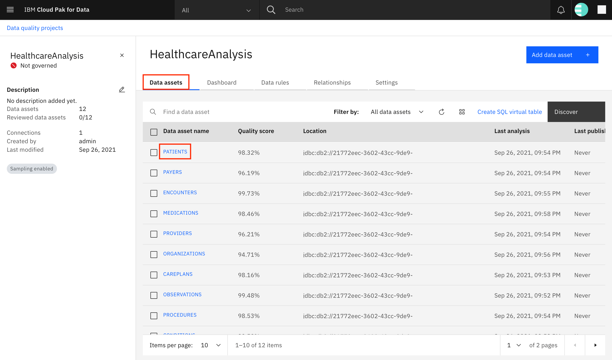

1. PATIENTSデータ・アセットのColumnsタブには、アセット内のカラムに関する情報が表示されます。分析プロセスによって、いくつかの列にデータ・クラスとビジネス用語が特定され、自動割り当てされていることがわかります。これらの値を編集するには、「**編集**」をクリックし、最初の列をクリックします。「**ID**」をクリックします。

    

1. **Data classes**タブに移動します。この列には、データクラス「Text」と「UUID」が特定されていることがわかります。また、これらのデータクラスの信頼度はどちらも100%です。これらのうち、UUIDデータクラスは分析中にこの列のデータクラスとして検出されたため、「検出されたデータクラス」にUUIDが記載されています。この場合、データクラスは正しく認識されましたが、そうではなく、データクラスを更新したい場合は、Selected Data Classの下にあるドロップダウンメニューを使って、このカラムに割り当てたいデータクラスを選択することができます。

    

1. 「ガバナンス」タブに移動します。いくつかのビジネス用語が提案されていますが、ID列に割り当てられたものはありません。これは、信頼度が80%以上のビジネス用語がないためです。「**患者ID**」の隣にあるチェックマークをクリックすると、このビジネス用語をIDカラムに割り当てることができます。また、割り当てられていない、あるいは提案されていない場合には、検索バーを使って用語を検索することができます。さらに、提案された他の用語の横にあるXをクリックすると、それらの用語を「却下」としてマークすることができます。用語を「割り当て」または「却下」とマークすることで、将来データを分析したときに、その用語が割り当てまたは却下されたままになります。

    
    
    **注意**。このコラムの場合のように、間違って提案された用語の拒否を省略することはできますが、間違った用語の拒否は、それらの用語の信頼度が80%以上で、その結果としてコラムに自動的に割り当てられた場合には特に重要です。このような場合には、信頼度が80%以上であっても、拒否された用語が今後の分析でこの列に割り当てられないようにします。

1. ビジネス用語の受け入れと拒否が完了したので、左ペインの**列**タブに移動し、リンクを使用して他の列に移動することで、他の列のデータクラスとビジネス用語を修正する手順を繰り返すことができます。[データ・アセット注釈](static/data-asset-annotations.pdf)ファイルのPATIENTSセクションを参照して、PATIENTSデータ・アセットの列にデータ・クラスとビジネス・タームを割り当てます。PATIENTSデータ・アセット内の残りのすべての列の手順を完了したら、上部のパンくずを使ってPATIENTSデータ・アセットに戻ります。

    

1. [**Governance**]タブに移動します。ここでは、「PATIENTS」データ・アセットに対して提案されたビジネス用語と割り当てられたビジネス用語が表示されます。このケースでは、正しい用語である「Patient」がすでにデータ資産に割り当てられています。また、前のステップでの列の場合と同様に、用語の割り当て/拒否を行うことができます。

    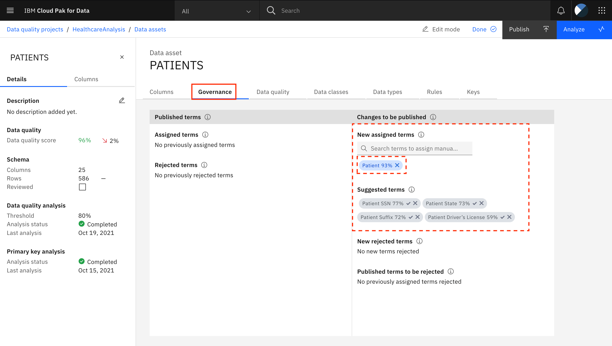

1. [**Keys**]タブに移動します。PATIENTSデータ・アセットのキー候補として識別された列のリストが表示されます。ID列の横のボックスをチェックして、**Mark as selected**をクリックします。ポップアップ・ウィンドウで、**Mark**をクリックして確定します。これにより、PATIENTSデータ・アセットの主キーとしてID列が使用されることがシステムに確実に認識されます。特定された他の候補キーを選択し、**Mark as rejected**をクリックして、これらのキーを拒否することができます。これにより、将来PATIENTSデータ・アセットを再分析するときに、拒否されたキーが候補キーとして提案されないようになります。

    

1. 1. **Done**をクリックして、PATIENTSデータ資産に行ったデータ・クラス、ビジネス用語、およびキーの更新をすべて保存し、**Analyze**をクリックして、これらの更新に基づいてデータ資産を再分析します。

    

1. ポップアップウィンドウで、**Analyze data quality**のチェックボックスを選択して、**Analyze**をクリックします。

    

1. 解析結果が更新されます。(**注**:新しい分析結果を表示するには、ページを更新する必要がある場合があります)。割り当てたデータクラスとビジネス用語が保持されていることがわかります。ID列には、データ資産の主キーであることを示す鍵のアイコンが前に表示されています。左側のペインでは、PATIENTSアセットのデータ品質スコアの変更がDetailsタブに表示され、各列の個々の品質スコアの変更がColumnsタブに表示されています。ここでは、「BIRTHDATE」の品質スコアが低下していることがわかりますが、デルタ（変化）が非常に小さいため、全体の品質スコアに大きな低下は見られません。

    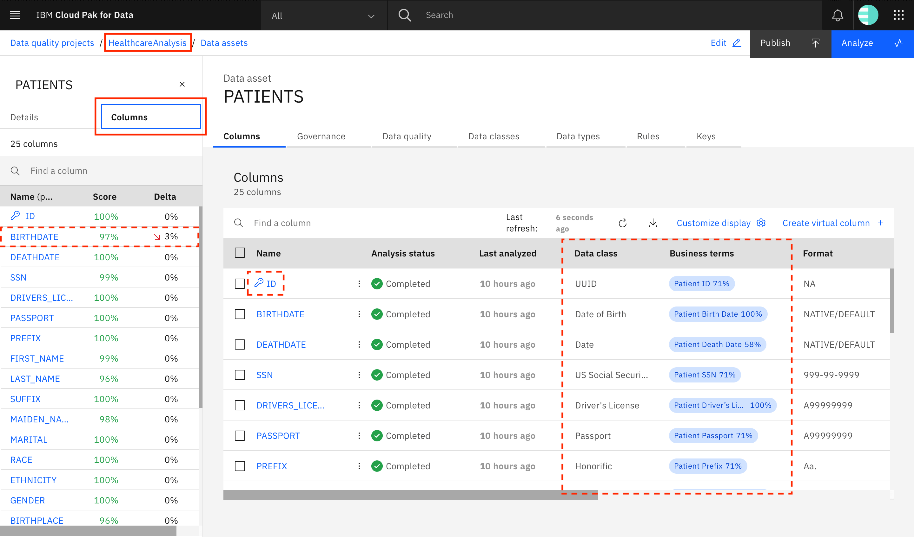

1. パンくずリストを使ってプロジェクトに戻ります。ENCOUNTERSデータアセットのデータクラス、ビジネス用語、およびキーを更新します。(**注**。このチュートリアルの拡張バージョンでは、12個のデータ資産すべてのガバナンスアーティファクトを更新します)。[データ資産の注釈](static/data-asset-annotations.pdf)ファイルを使用して、各データ資産の各列にどのデータクラスとビジネス用語を割り当てるかを学びます。また、このファイルには、各データ資産のガバナンス用語と主キーが記載されています。各データ資産について、更新後に再分析を行います。

## Step 2.関係性分析を実行して、データ資産間の外部キー関係を特定する

1. テーブルの主キーを選択したら、リレーションシップ分析を実行して、データ資産間の外部キーの関係を特定することができます。プロジェクトでは、**Relationships**タブに移動します。**ENCOUNTERS**と**PATIENTS**の横のチェックボックスをクリックして選択し、**Run analysis**をクリックします。

    

1. ポップアップウィンドウで、**Key Relationship Analysis**を選択し、**Analyze**をクリックします。

    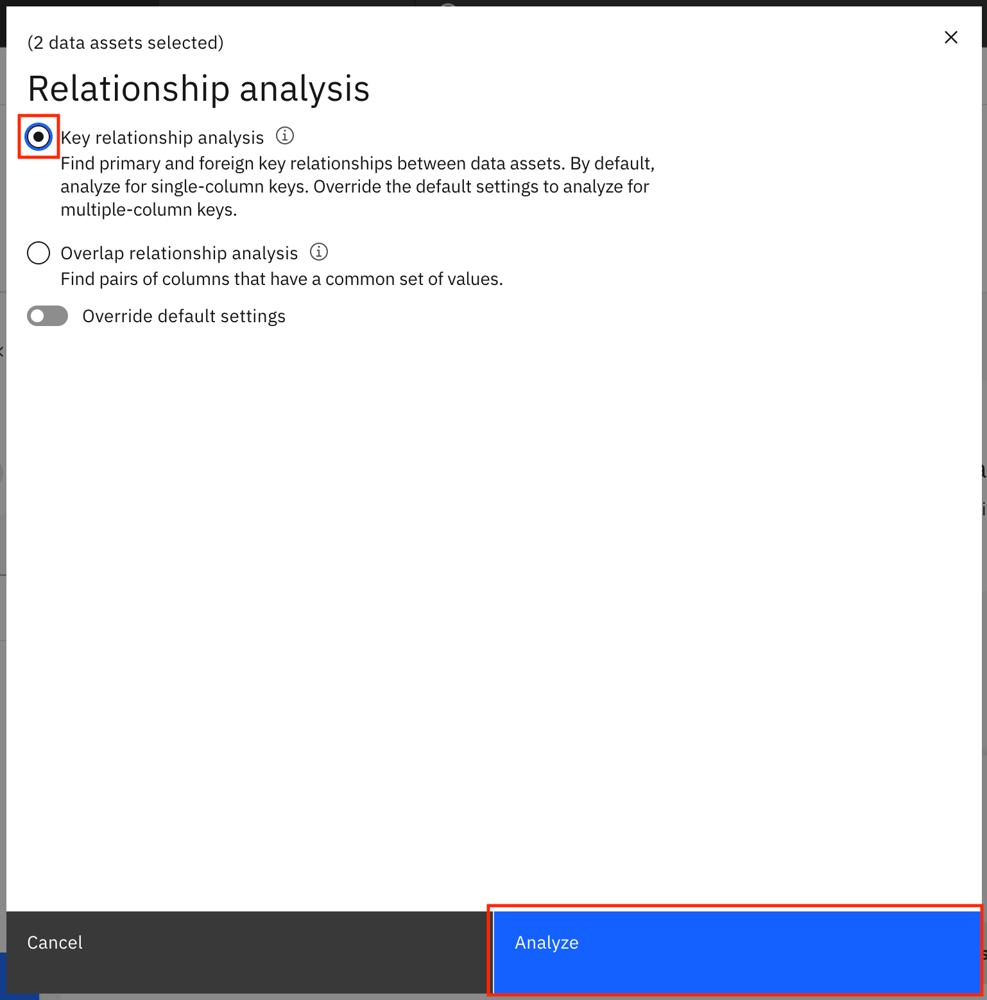

1. 分析が完了するのを待ちます。待っている間に、左ペインの**Customize display**タブに行き、画面に表示するリレーションシップを指定します。フィルターのドロップダウンメニューで**Selected**と**Candidate**を選択し、**すべてのデータ資産を選択**（またはすべてのデータ資産を個別に選択）するチェックボックスをクリックしてから**Customize display**をクリックします。これにより、すべてのアセットの候補および選択されたリレーションシップが画面に表示されます。

    

1. **Refresh**アイコンをクリックして、ページを更新します。PATIENTSとENCOUNTERSのアセット間の関係を示すチャートとテーブルが表示されます。

    

1. 表の最後までスクロールします。このリレーションシップが **選択** ステータスに設定されていることがわかります。そのレコードのオーバーフローメニューをクリックします。ステータスを**Candidate**または**Rejected**に設定するオプションと、キー・リレーションシップを削除するオプションが表示されます。このリレーションシップは**Selected**に設定する必要があります（すでに設定されています）。生成した他のリレーションシップについては、オーバーフローメニューのオプションを使用して、選択済みまたは拒否としてマークすることができます。これにより、今後のキー・リレーションシップ分析では、設定した内容が確実に記憶されます。

    

**注**:このチュートリアルの拡張バージョンでは、他のデータ資産間の関係分析を実行します。次の表は、Healthcare-Data.zipファイル内の12のデータ資産すべての間の外部キーの関係をすべて示しています。これらの関係をSelected（選択）、その他の関係をRejected（拒否）としてマークすることを確認してください。

| 親データ資産｜主キー｜子データ資産｜外部キー
|-------------------|-------------|------------------|--------------|
| 遭遇｜id｜アレルギー｜遭遇
| 患者｜ID｜アレルギー｜患者
| エンカウンター｜ID｜ケアプラン｜エンカウンター｜患者
| 遭遇する｜患者｜ID｜ケアプラン｜患者
| 遭遇｜ID｜条件｜遭遇｜患者
| 患者様｜ID｜条件｜患者様
| 組織｜イド｜エンカウンター｜組織
| 患者｜イド｜エンカウンター｜患者
| 支払者｜ID｜出会い｜支払者
| プロバイダー｜イド｜エンカウンター｜プロバイダー
| 遭遇者｜イド｜予防接種｜遭遇者｜患者
| 患者｜イド｜予防接種｜患者
| 遭遇者｜id｜薬｜遭遇者
| 患者｜イド｜薬｜患者
| 支払い者｜ID｜薬｜支払い者
| 遭遇｜ID｜観察｜遭遇｜患者｜ID｜観察｜患者
| 患者｜ID｜観察｜患者
| 遭遇｜id｜手順｜遭遇｜id｜手順｜遭遇
| 患者｜イド｜手順｜患者
| 組織｜ID｜プロバイダー｜組織

## Step 3.データ品質次元の違反を確認する

1. **データ資産**タブを開き、**PATIENTS**をクリックしてPATIENTSデータ資産を開きます。

    

1. **Data quality**タブに移動します。データ品質分析プロセスでは、品質ディメンションを分析することでデータの品質問題を特定し、観測された違反を「Data quality」タブにリストアップします。各データ品質次元で検出された違反の数と、デルタ（過去2回の分析の間の違反数の変化率）が画面に表示されます。

    

1. リストの最初の次元「Data class violations」は、列の検出されたデータ・クラスに一致しない列の値を示します。クラスに違反している各値は、違反として識別されます。**Data class violations**をクリックして展開します。データクラス違反を含む列名が、各列で見つかった違反の数とともに表示されます。リスト内の最初の列名をクリックします。「**CITY**」をクリックします。

    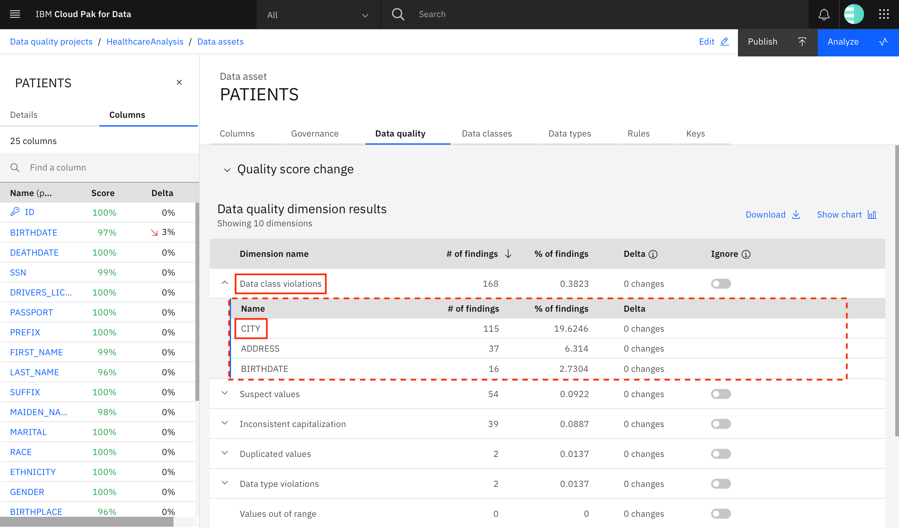

1. ポップアップ・ウィンドウが開き、Patientsデータ・アセットからCITY列にデータ・クラス違反があるすべてのレコードが表示されます。左から右にスクロールするとレコード全体が表示され、上下にスクロールするとさらに多くのレコードが表示されます。また、［ダウンロード］ボタンを使ってレコードをCSVファイルとしてダウンロードすることもできます。右上の**X**をクリックして、ポップアップウィンドウを閉じます。

    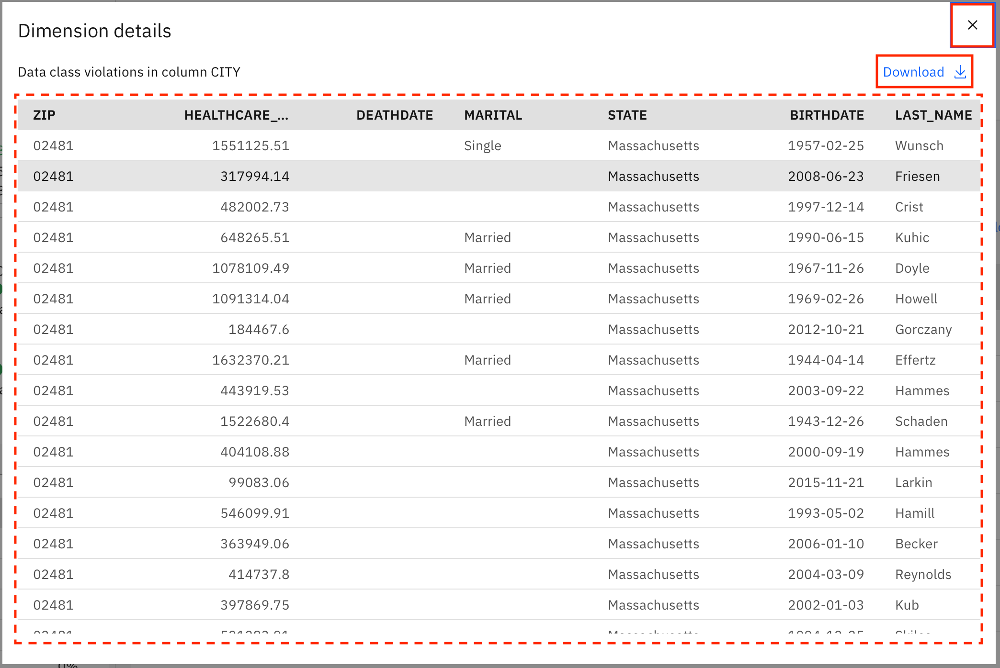

1. データクラス違反の下に表示されている他の列（ADDRESSやBIRTHDATEなど）のレコードを展開して見ることができます。

1. 画面に表示されている他のデータ品質ディメンションを展開して確認します。

    * *Suspect values* は、その特性が異なるため、列の他の値のほとんどと一致しないと思われる値を識別します。
    *Inconsistent capitalization* 大文字と小文字の使用が一貫していない値を識別します。
    *Data type violations*は、長さ、精度、またはスケールにおいて推測されるデータタイプに適合しない、または指定/識別されたデータタイプに違反する値を識別します。
    *Duplicated values* は、ほとんどの値がユニークである列において、重複した値を識別します。
    *Values out of range* は、列のデータの異常値を識別します。列に指定された最小値と最大値の間に入らない値が識別されます。
    *Suspect values in correlated columns* は、他の列と相関のある列を特定し（ある列の値は他の列を使って予測できる）、その情報を使って同じ相関を持たないレコードを特定します。
    * *Missing values* は、Non-nullable 列として定義されている列の欠損値を検索します。
    *Inconsistent representation of missing values* 欠落データのさまざまな表現（たとえば、NA、NULL、または空白のフィールド）を探します。NULL値と空の値の両方を含むカラムは、欠損値を表現する標準的な方法がないことを示唆しています。
    * *Format violations* は、分析中の特定の列に対して無効であると指定されたフォーマットに一致する値を特定します。

1. また、任意のディメンジョンを無視することもできます。その結果、そのディメンションの違反が品質分析のスコアに影響を与えることはありません。ディメンションを無視するには、**Edit**をクリックして編集モードに入り、ディメンションの横にある**Ignore**ボタンを切り替えます。**Done**（**Edit**ボタンの代わりに表示される）をクリックして変更を保存し、**データ品質の分析**を再度行って品質スコアの変化を確認します。

    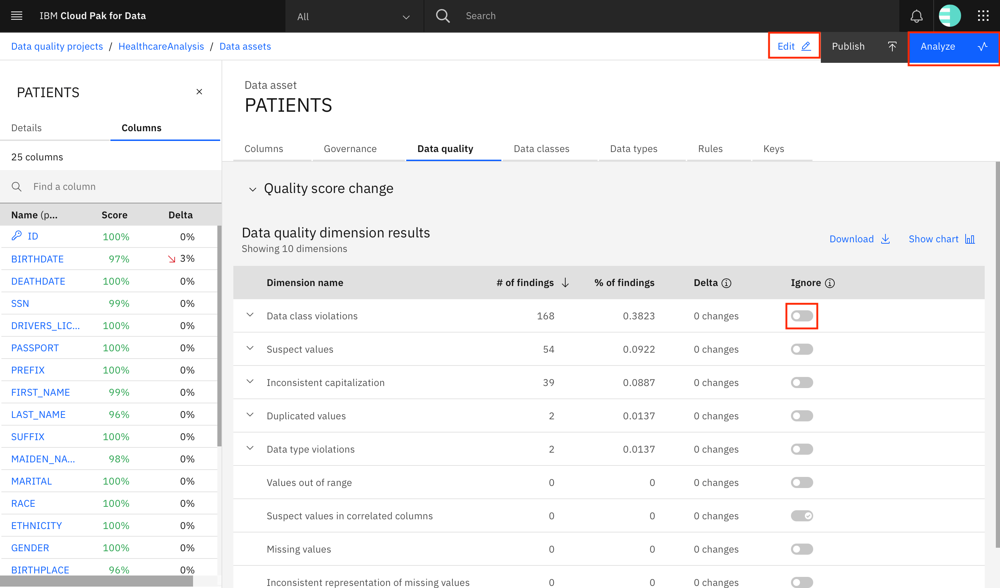

## Step 4.ルールの追加

データの品質を確保するために、ルールを使用することができます。これには次のようなものがあります。

*データを分析するためのルールロジックを作成するために使用される * *Data rule definitions*。これらは、データルールや品質ルールの基礎となります。
* データルール定義の集合体である、ルールセット定義。
* データルール定義を物理的なデータにバインドすることで、データソースに関連する特定の条件を評価し、検証します。
* データルールの集合体である「ルールセット」。
*Automation rules*：データを管理するプロセスを自動化するために使用することができます。

### データルール定義のインポート

1. [HealthcareAnalysis-rules.xml](static/HealthcareAnalysis-rules.xml)ファイルをダウンロードします。

1. データ品質プロジェクトで、「Data rules」タブを開き、「Import rules and definitions」をクリックします。

    

1. ポップアップウィンドウで、**Add file**をクリックし、先にダウンロードしたHealthcareAnalysis-rules.xmlファイルを選択します。ファイルのアップロードが完了したら、**Next**をクリックします。

    

1. 次の画面では、アップロードされたファイルに3つのチェックボックスがあり、それぞれがデータルールの定義を表しています。3つともチェックされていることを確認し、「**Import**」をクリックします。

    

1. アセットが正常にインポートされたという通知が表示されます。「閉じる」をクリックします。

    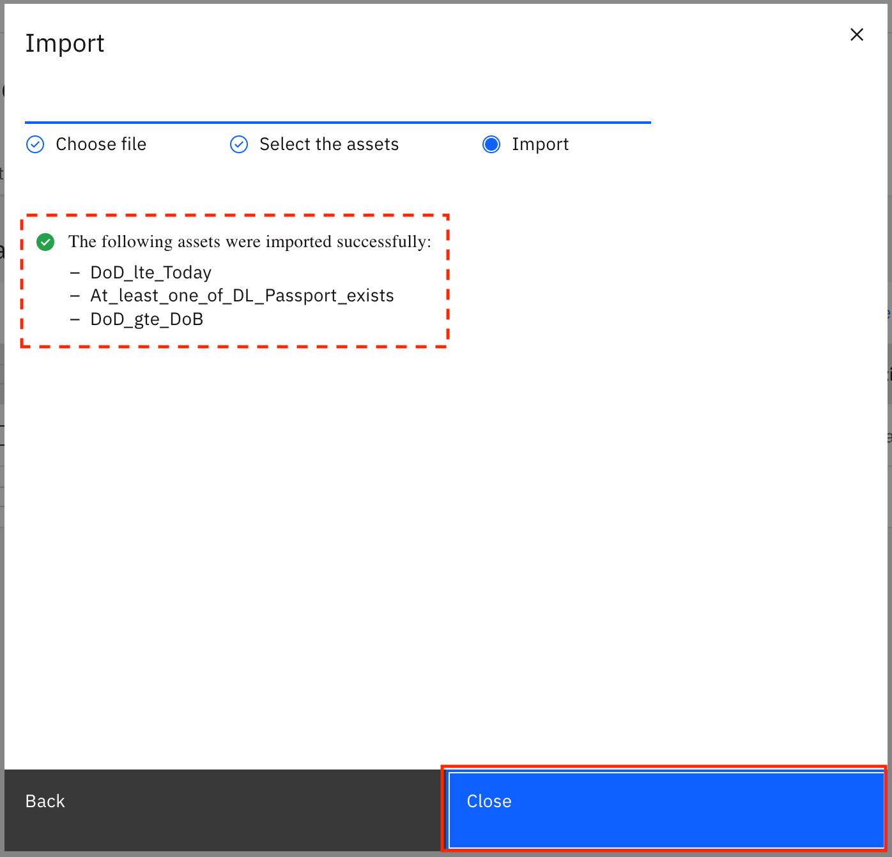

1. [Data rules]タブで、**Refresh**をクリックしてルールのリストを更新し、**Rules in project**を展開します。「プロジェクト内のルール」に3つの新しいレコードが表示されていることがわかります。

    

    新しく追加されたレコードのうち2つは、（患者の）死亡日に関するものです。このレコードには2つのデータルール定義が含まれており、1つはDate of Deathの値が今日以下であることを検証し（つまり、Date of Deathは将来の日付ではないということです）、もう1つはDate of DeathがDate of Birth以降に発生することを検証しています。3番目の新規レコードは、少なくとも患者の運転免許証番号またはパスポート番号が提供されたことを検証するデータルール定義です。

### データルールの作成

インポートしたデータ定義の1つを使って、データルールを作成することができます。

1. 1. **Data assets** タブに戻り、**PATIENTS** をクリックします。

    

1. **Rules**タブをクリックし、**Create rule +**をクリックします。

    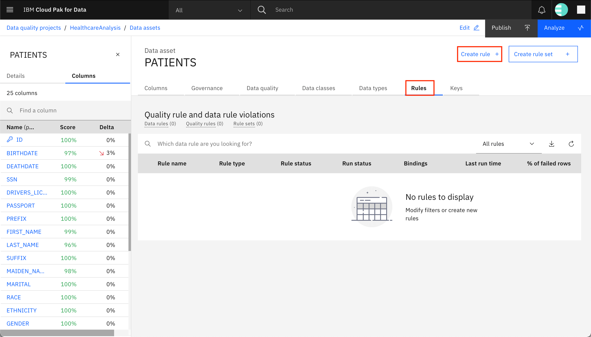をクリックします。

1. **Data rule**を選択し、Data rule definitionで**Rules in project**を展開し、**DoD_gte_DoB**ルールを選択します。このルール定義では、「患者の死亡日は常に患者の生年月日以上でなければならない」としています。「**Next**」をクリックします。

    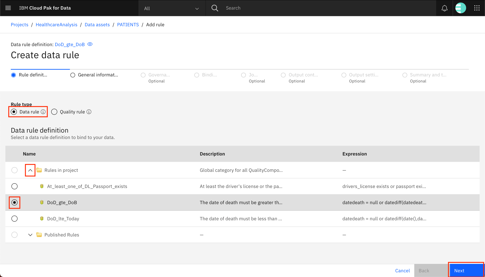

1. ルールの名前（`DeathDate greater than or equal to BirthDate`）、およびオプションの短い説明と長い説明を入力します。「**Next**」をクリックします。

    

1. 次の画面で「**Next**」をクリックします。

    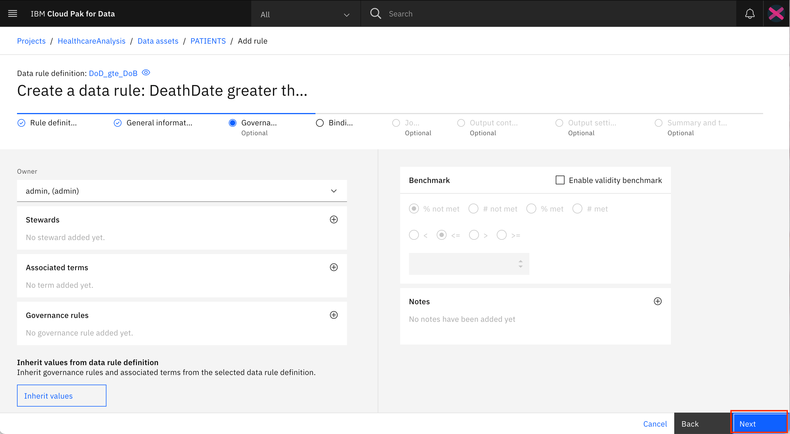

1. 左側の **datebirth** 変数を選択します。右側のテーブルで、データ・ソースを展開し、PATIENTSデータ・アセットを探します。PATIENTSデータ・アセット内の**BIRTHDATE**列を選択します。画面の左側にある**結合**をクリックします。PATIENTS.BIRTHDATE列は、「実装されたバインディング」に示すように、datebirth変数にバインドされます。左側の**datedeath**変数についても同じ手順を繰り返し、PATIENTSデータ・アセットのDEATHDATE列にバインドします。両方の変数のバインドが完了したら、**Next**をクリックします。

    

1. 次の画面では、「**Next**」をクリックします。

    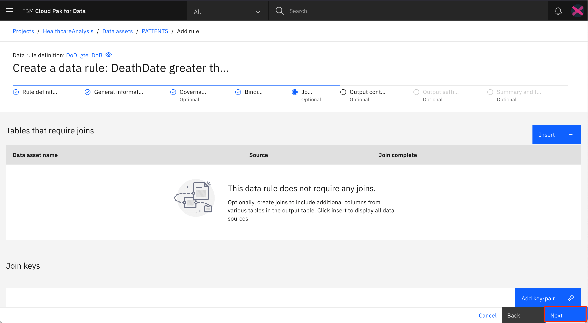

1. データルールからの出力は、カスタマイズされたテーブルに保存することができ、含まれなければならない行や列を指定することができます。この画面では、出力テーブルに含めたい列を選択できます。**datedeath**と**datebirth**の変数は、出力テーブルに自動的に追加され、画面右側の「Selected output」に表示されます。画面左側の「Columns」をクリックし、リストの中から「**ID**」「**FIRST_NAME**」「**LAST_NAME**」の各カラムを探して選択します。「**Add to output**」をクリックします。3つのカラムが右側の「Selected output」に表示されます。「**Next**」をクリックします。

    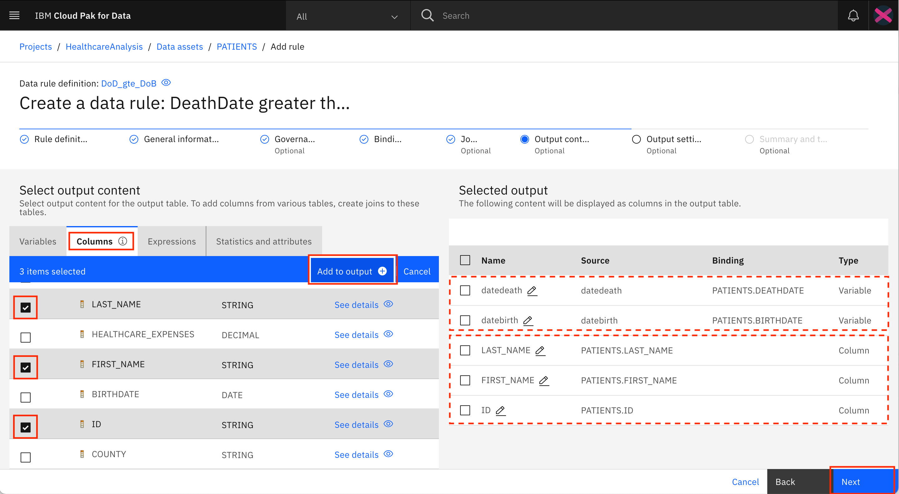

1. 次の画面で、「**Next**」をクリックします。

    をクリックします。

1. **Test**をクリックして、ルールをテストします。100行のサンプルに対してルールが実行され、その結果が画面に表示されます。画面の下部にある「**Did not meet rule conditions**」タブをクリックすると、ルールを満たさなかったサンプルのレコードが表示されます。**保存**をクリックして、データルールを保存します。(**注意**。サンプルの100レコードすべてがルールの条件を満たす可能性があります)。

    

1. 新しく追加されたデータ・ルールは、PATIENTSデータ・アセットのRulesタブに表示されます。

    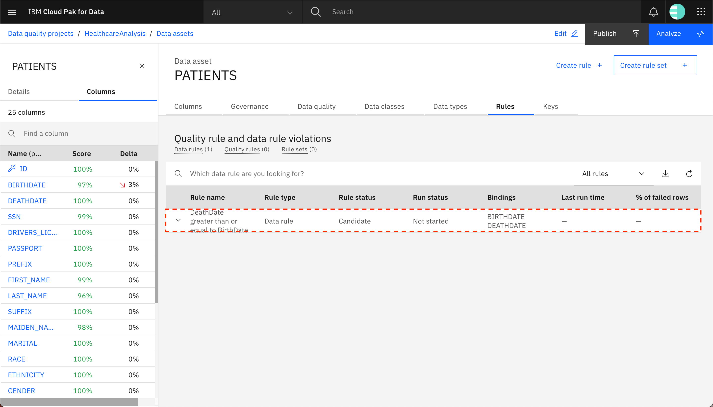

### データルールの実行

1. 最後までスクロールして、データルールのオーバーフローメニュー（縦の3つの点）をクリックし、メニューの**Run**をクリックします。

    

1. **Refresh**アイコンをクリックして、データルールの実行ステータスを更新します。ルールの実行が完了すると、実行状況が **成功** に更新され、PATIENTSデータ資産の行の割合と数がルールに失敗したことがわかります。オーバーフロー・メニュー・アイコンをクリックし、**実行履歴の表示**をクリックします。

    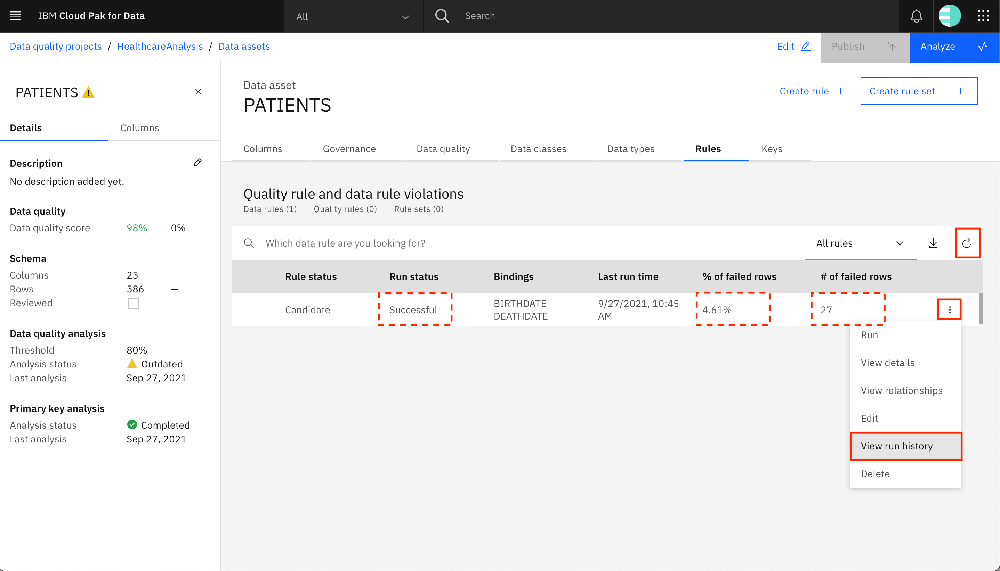

1. 最新のラン（リストの最初のラン）の横にあるチェックボックスをクリックしてから、**ランの詳細を表示**をクリックします。

    

1. ルールに失敗した27件のレコードが画面に表示されます。これらのレコードの［死亡日］が［誕生日］と同じか後ではないことがわかります。**ダウンロード**ボタンをクリックして、失敗したレコードをローカルマシンにエクスポートすることができます。ここでは、使用するデリミタや、カラムヘッダを含めるかどうかを指定できます。また、開始インデックスとそのインデックスで始まる行の数を指定してエクスポートすることもできます。最後に、画面上部のパンくずリストで**PATIENTS**をクリックすると、PATIENTSデータ・アセットに戻ります。

    

1. データ・ルールは品質分析プロセスの一部としても実行され、データ・ルールの結果（ルール条件を満たさないレコード）は、データ資産の品質スコアに影響を与えます。

### 品質ルールの作成

次に、品質ルールの作成方法を学習します。

1. PATIENTSデータアセットの**Rules**タブで、**Create rule +**をクリックします。

    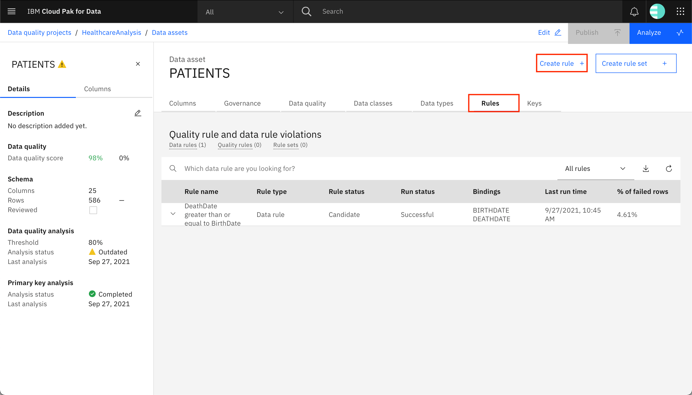

1. **Quality rule**を選択し、Data rule definitionで**Rules in project**を展開し、**At_least_one_of_DL_Passport_exists**ルールを選択します。このルール定義では、少なくとも患者のパスポートまたは運転免許証が提供されなければならないとしています（両方ともnullは不可）。「**Next**」をクリックします。

    

1. 左側の **passport** 変数を選択します。右側のテーブルで、データ・ソースを展開し、**PATIENTS**データ・アセットを探します。PATIENTSデータ・アセット内の**PASSPORT**列を選択します。画面の左側にある**Bind**をクリックします。「実装されたバインディング」に示すように、PATIENTS.PASSPORT列が**passport**変数にバインドされます。左側の**drivers_license**変数についても手順を繰り返し、PATIENTSデータ・アセットのDRIVERS_LICENSE列にバインドします。両方の変数のバインドが完了したら、**Next**をクリックします。

    

1. **Test**をクリックして、ルールをテストします。100行のサンプルに対してルールが実行され、その結果が画面に表示されます。**Save**をクリックして、品質ルールを保存します。(**注意**。サンプルの100レコードすべてがルールの条件を満たしている可能性があります)。

    

    新しく追加された品質ルールは、Patientsデータ資産のRulesタブに表示されます。

    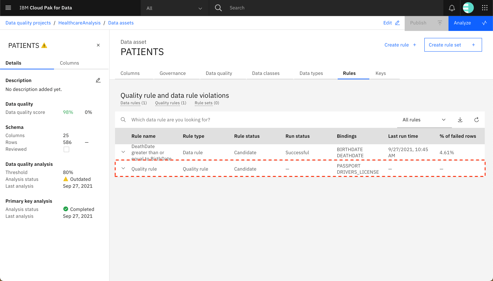

品質ルールは、データ・ルールとは異なり、品質分析プロセスの一部としてのみ実行できます。

### 自動化ルールの作成

次に、自動化ルールを作成します。自動化ルールは、データを最高の品質に保つためにデータに対して実行する必要があるタスクの一部を自動化するのに役立ちます。これには、ルール定義の適用、データ品質ディメンションの追加、データ品質のしきい値の設定などが含まれます。

1. 自動化ルールを実行するには、データ品質プロジェクトが構成されている必要があります。**HealthcareAnalysis**プロジェクトに移動し、**Settings**タブに移動します。**Data quality**をクリックし、スクロールダウンして**Enable automation rules**のチェックボックスを見つけます。チェックボックスにチェックを入れ、**Save**をクリックします。

    

[先ほど](#import-data-rule-definitions)で、**DoD_lte_Today**データルール定義を**HealthcareAnalysis**プロジェクトにインポートしました。このルールでは、「死亡日」は今日以下でなければならない、つまり将来の日付であってはならないとしています。

次に、このルール定義を使用した品質ルールを、**Patient Death Date**ビジネス用語が割り当てられているすべてのアセットに追加する自動化ルールを作成します。

自動化ルールでデータ・ルール定義を使用するには、まずその定義を公開して他のユーザが利用できるようにする必要があります。

1. **Data rules**タブに移動します。**プロジェクト内のルール**を展開し、**DoD_lte_Today**データルール定義を探し、その横にある**オーバーフロー**メニュー（縦に3つの点）をクリックし、**公開**をクリックします。ポップアップウィンドウで**Publish**をクリックして、ルールを発行することを確認します。

    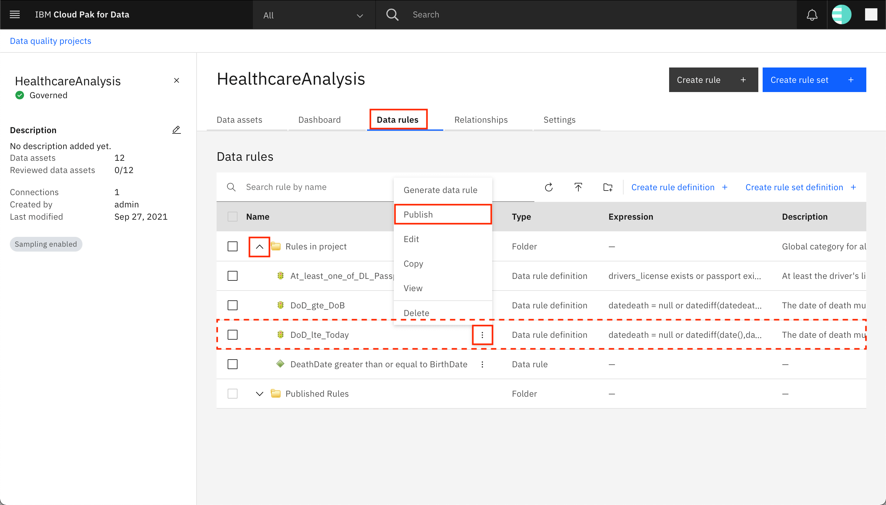

    データルールの定義が公開され、**Published Rules**にデータルールのレコードが表示されます。(**注意**。テーブルをTypeでソートすると、新しく発行されたルールが[Published Rules]のテーブルの一番上に表示されます。

    

    **注**:必要に応じて、他のルールや定義も「**Rules in project**」で公開して、他のユーザーが利用できるようにすることができます。

1. 左上の **ハンバーガー（☰）** メニューを開き、**ガバナンス** を展開し、**自動化ルール** をクリックします。「オートメーションルールの作成＋」をクリックします。

    

1. 自動化ルールに名前（`Date of Death cannot be in the future`）、説明を付け、ステータスを **Accepted** に設定します。ステータスをAcceptedに設定すると、ルールが有効になり、ルールロジックで指定されたアセットが影響を受けることになります。

    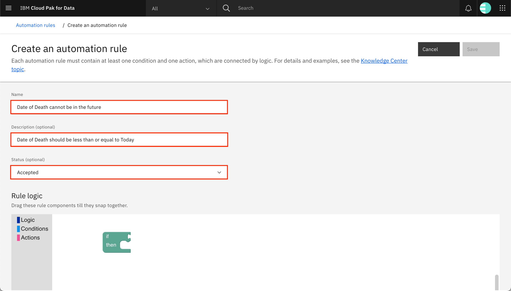

1. 次に、ルールロジックを構築する必要があります。スクロールダウンして **ルールロジック** キャンバスに移動します。**Conditions**をクリックし、表示されたメニューで**the asset has the term (Select a term) assigned**をクリックします。

    

1. 選択した条件が画面上のキャンバスに追加されます。キャンバス上にすでに存在していた「if-then」ロジックステートメントの「if」に対して、条件をドラッグ＆ドロップします。条件が固定されると、クリック音が鳴ります。条件が `if-then` 文に追加されたことを確認するには、緑色の `if-then` ブロックをクリックしてキャンバス上で動かしてみてください。条件は、if-then ブロックと一緒に移動するはずです。次に、条件の中の虫眼鏡をクリックして、ビジネス用語を選択します。

    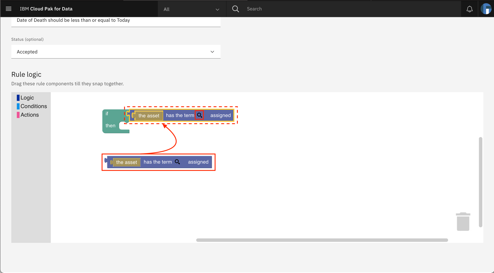

1. 新しいポップアップウィンドウが開きます。**Patient Death Date**のビジネス用語を検索し、リストから**Patient Death Date**のビジネス用語を選択します。「保存」をクリックします。

    

    キャンバスに戻ると、ビジネス用語が条件で更新されていることがわかります。

    

1. 次のステップでは、アクションを追加します。左メニューの**Actions**をクリックして、**bind the data rule definition**を選択します。

    

1. 選択したアクションが画面上のキャンバスに追加されます。先ほどと同じように、キャンバス上にすでに存在している「if-then」ロジック文の「then」に対してアクションをドラッグ＆ドロップします。アクションが固定されると、クリック音が鳴ります。緑色の「if-then」ブロックをクリックしてキャンバス上で移動させると、条件もアクションも一緒に移動します。次に、アクション内の虫眼鏡をクリックして、データルール定義を選択します。

    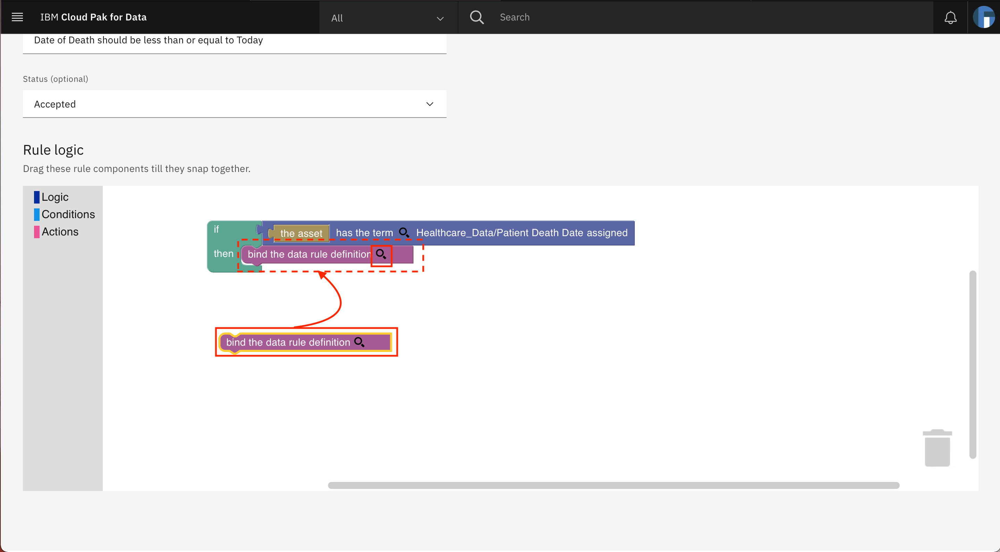

1. 新しいポップアップウィンドウが開きます。**DoD_lte_Today**データルール定義を検索して、リストから**DoD_lte_Today**データルール定義を選択します。「**Save**」をクリックします。

    

    キャンバスに戻ると、データルール定義がアクションで更新されていることがわかります。上にスクロールして、**Save**をクリックします。

    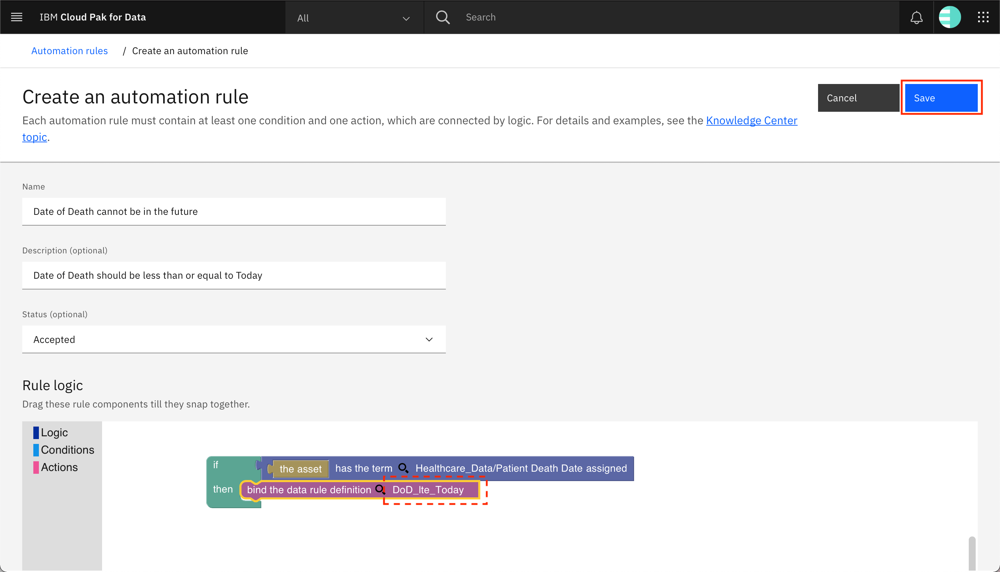

1. ポップアップウィンドウが開きます。自動化ルールの影響を受けるアセットとワークスペースの情報が表示されます。[詳細を表示]をクリックすると、影響を受けるデータ資産と列の一覧が表示される新しいブラウザページが開きます。PATIENTSデータ資産のDEATHDATE列が影響を受けることがわかります。ポップアップ・ウィンドウに戻り、**Save**をクリックして、オートメーション・ルールを保存することを確認します。

    

1. [自動化ルール] ページに戻り、作成した自動化ルールの新しいレコードがページに表示されているはずです。新しいレコードが表示されない場合は、**Refresh**アイコンをクリックしてリストを更新してください。

    

1. 自動化ルールは、データ品質分析プロセスの一部として実行され、DoD_lte_Todayデータ・ルール定義に従って、Patient Death Dateビジネス用語が割り当てられているすべてのデータ資産のすべての列に新しい品質ルールを割り当てます。

### データ品質分析の再実行

データルール、品質ルール、自動化ルールが追加されたら、これらのルールを実行するデータ分析を再実行することができます。

**注意**。データルールは、前述のように単独で実行して出力テーブルを生成することができます(#run-data-rule)。また、データ品質分析プロセスの一部としても実行されます。品質ルールは、データ分析プロセスの一部としてのみ実行されます。自動化ルールは、データ発見およびデータ分析プロセスの一部として実行されます。

1. 左上の**ハンバーガー**メニューに移動し、**ガバナンス**を展開して、**データ品質**をクリックします。**HealthcareAnalysis**データ品質プロジェクトのタイルをクリックします。

    

1. PATIENTSデータ・アセットの**Last analysis**値が**Outdated**であることがわかります。PATIENTSデータ・アセットのレコードの横にあるチェックボックスをクリックして選択し、**Analyze**をクリックします。

    

1. ポップアップウィンドウで、**データ品質の分析**を選択して、**分析**をクリックします。

    

1. データ品質分析が実行され、数分後に結果が表示されます。**Refresh**アイコンをクリックする必要があるかもしれません。データ分析が完了したら、**PATIENTS**をクリックして、PATIENTSデータ資産に移動します。

    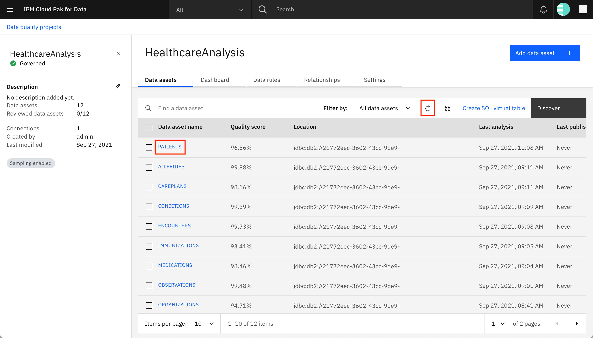

1. PATIENTSデータ・アセットのData qualityタブに移動します。以前に調べたデータ品質ディメンションに加えて、3つの新しいデータ品質ディメンションが表示されます(#step-3-review-data-quality-dimensions-violations)。PATIENTSデータ・アセットの全体的な品質スコアが下がっていることに注目してください。左ペインの[Columns]タブを見ると、これらの新しいルールにより、BIRTHDATE、DEATHDATE、DRIVERS_LICENSE、PASSPORTの各カラムの品質スコアが低下していることがわかります。

    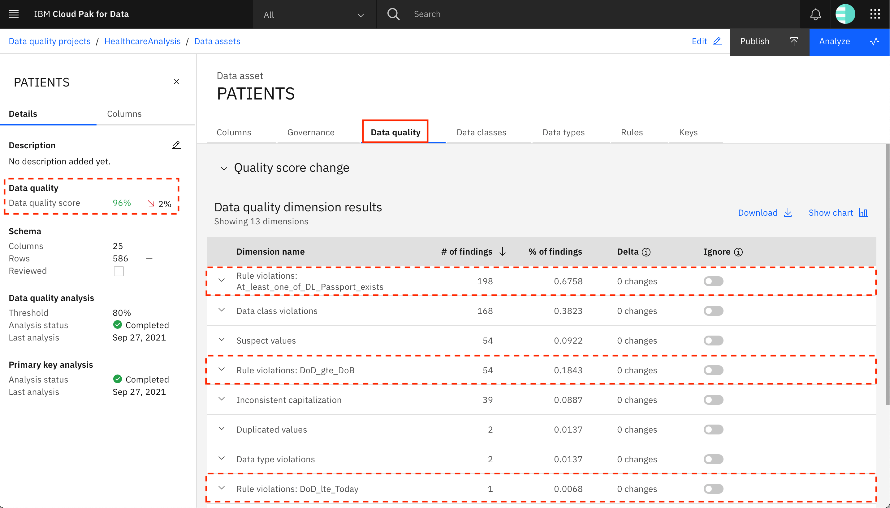

1. **新たに追加された最初のデータ品質ディメンション -- **ルール違反のこと。**At_least_one_of_DL_Passport_exists** - 作成した品質ルールのルール違反を指定します。2つ目は -- **Rule violations:DoD_gte_DoB** -- 作成したデータルールのルール違反を指定します。3つ目は -- **Rule violations:DoD_lte_Today** -- 自動化ルールによって追加された品質ルールのルール違反を指定します。

1. 以前のように、これらの新しいルール違反エントリを展開して、どのレコードがルールに違反したかを確認できます。

    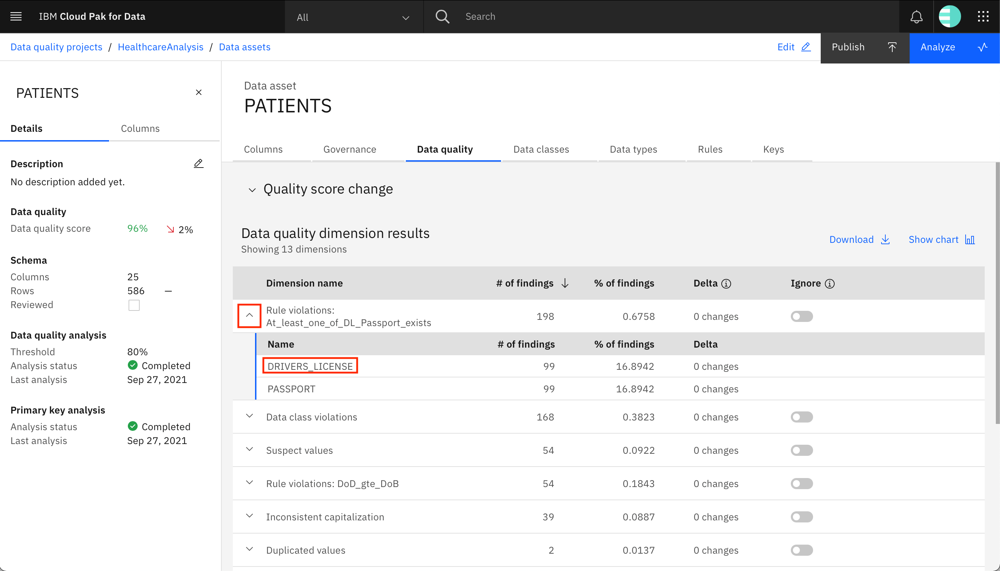
    

## まとめ

このチュートリアルでは、データの品質を向上させるために使用できる、IBM Cloud Pak for Data プラットフォームで利用可能なツールを見ました。データにガバナンス・アーティファクトを割り当てる方法と、分析を実行してデータのデータ品質スコアを計算する方法を学びました。データ資産の主キーを特定・選択し、データ資産間の外部キー関係を特定する。データを最高の品質に保つために、データ品質プロジェクトに組み込むことができるさまざまな種類のルールについて学びました。また、データ資産の品質スコアに何が影響するかを確認するために、さまざまなデータ品質ディメンションを調べました。

このチュートリアルは、[An introduction to the DataOps discipline](https://developer.ibm.com/articles/an-introduction-to-the-dataops-discipline)シリーズの一部です。