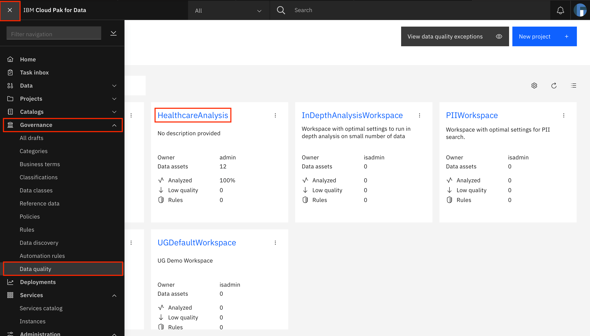
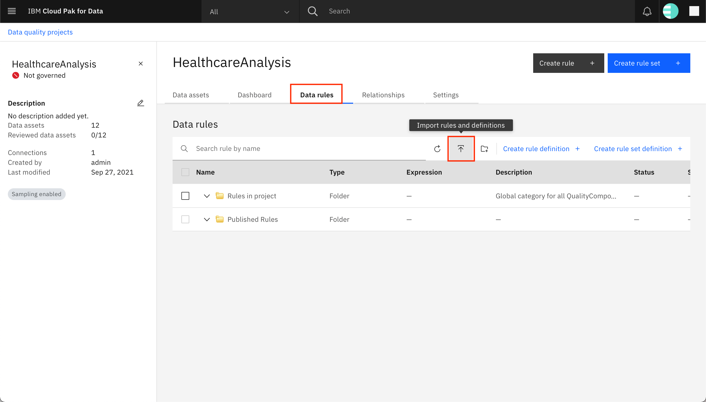
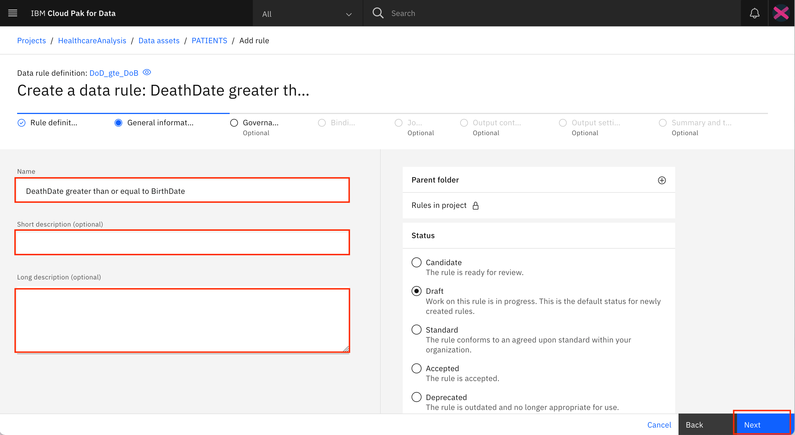
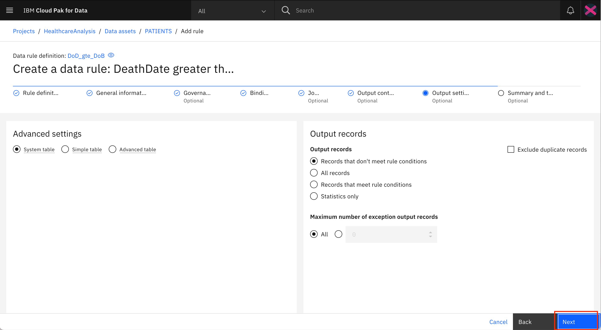
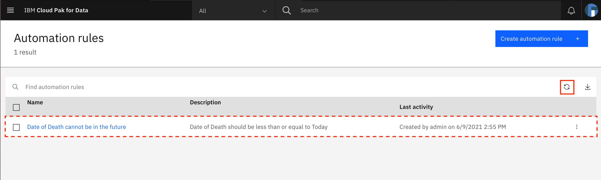

---
also_found_in:
- learningpaths/dataops-fundamentals/
authors: ''
completed_date: '2021-07-20'
components:
- cloud-pak-for-data
draft: false
excerpt: Learn to work with discovered data and how to associate governance artifacts
  with these discovered assets. Identify primary keys for the data assets and perform
  relationship analysis in order to identify foreign key relationships between the
  assets.
last_updated: '2021-10-19'
meta_description: Learn to work with discovered data and how to associate governance
  artifacts with these discovered assets. Identify primary keys for the data assets
  and perform relationship analysis in order to identify foreign key relationships
  between the assets.
meta_keywords: dataops
meta_title: Analyze discovered data to gain insights on the quality of your data
primary_tag: analytics
subtitle: Analyze and enhance data quality
tags:
- data-management
title: Analyze discovered data to gain insights on the quality of your data
---

In the [Learn to discover data that resides in your data sources](/tutorials/learn-to-discover-data-that-resides-in-your-data-sources) tutorial, you saw how data can be discovered by using the data discovery feature of Watson Knowledge Catalog. In this tutorial, you work with the discovered data and learn how to associate governance artifacts with these discovered assets. You identify the primary keys for the data assets and perform relationship analysis to identify foreign key relationships between the assets. Additionally, you look at data quality analysis results and observe what affects the quality scores of data assets. You also learn to enforce rules that you expect the data assets to follow.

## Learning objectives

In this tutorial, you:

* Review and update data classes, business terms, and keys for the data assets
* Run relationship analysis to identify foreign key relationships between the data assets
* Review data quality dimensions violations
* Add rules to improve data quality
* Perform reanalysis of the data assets and observe changes in data quality

## Prerequisites

* [IBM Cloud Pak for Data v4.0](https://www.ibm.com/products/cloud-pak-for-data)
* [Watson Knowledge Catalog on Cloud Pak for Data](https://www.ibm.com/docs/en/cloud-paks/cp-data/4.0?topic=services-watson-knowledge-catalog)
* Completion of the steps in [Learn to discover data that resides in your data sources](/tutorials/learn-to-discover-data-that-resides-in-your-data-sources)

## Estimated time

It should take you approximately 60 minutes to complete this tutorial.

## Step 1. Review and update data classes, business terms, and keys for the data assets

1. Log in to your IBM Cloud Pak for Data instance.

    

1. Navigate to the upper-left **hamburger (☰)** menu, expand **Governance**, and click **Data quality**. Click the tile for your **HealthcareAnalysis** data quality project. This is the project that contains the results from the automated discovery process that was performed in [Learn to discover data that resides in your data sources](/tutorials/learn-to-discover-data-that-resides-in-your-data-sources).

    

1. On the **Data assets** tab, click **PATIENTS** to open the PATIENTS data asset.

    

1. The Columns tab for the PATIENTS data asset shows information about the columns in the asset. You can see that the analysis process has identified and auto-assigned data classes and business terms for some of the columns. To edit these values, click **Edit**, then click the first column: **ID**.

    

1. Go to the **Data classes** tab. You see that the data classes Text and UUID were identified for this column. Additionally, both of these data classes have a confidence of 100%. Of these, the UUID data class was detected as the data class for this column during analysis and therefore, you can see UUID mentioned under Detected Data Class. The data class was correctly identified in this case, but if it is not, and if you want to update the data class, you can use the drop-down menu under Selected Data Class to choose the data class you want to assign to this column.

    

1. Go to the **Governance** tab. You see that a number of business terms have been suggested, but none have been assigned to the ID column. This is because none of the business terms has a confidence of over 80%. You can click the checkmark next to **Patient ID** to assign this business term to the ID column. You can also use the search bar to search for terms in case they aren't assigned or suggested. Additionally, you can click the X next to the other suggested terms to mark them as Rejected. Marking terms as Assigned or Rejected ensures that the terms remain as assigned or rejected after any future analyses of the data.

    
    
    **Note**: While you can skip rejecting incorrectly suggested terms, as in case of this column, rejection of incorrect terms is especially important when the confidence in those terms is over 80%, as a result of which they get automatically assigned to the column. In these cases, rejection ensures that the rejected terms are not assigned to this column on future analyses even if the confidence is over 80%.

1. Now that the business terms have been accepted and rejected, you can repeat the steps of correcting the data classes and business terms for the other columns by going to the **Columns** tab in the left pane, then going to the other columns by using the links. Refer the PATIENTS section of the [Data asset annotations](static/data-asset-annotations.pdf) file to assign data classes and business terms to the columns in the PATIENTS data asset. After you have completed the steps for all of the remaining columns in the PATIENTS data asset, go back to the PATIENTS data asset by using the breadcrumb at the top.

    

1. Go to the **Governance** tab. Here you can view the suggested and assigned business terms for the "PATIENTS" data asset. In this case, the correct term - "Patient" - has already been assigned to the data asset. You can also assign/reject terms just as you had in case of the columns in the previous step.

    

1. Go to the **Keys** tab. You see a list of columns that were identified as candidate keys for the PATIENTS data asset. Check the box next to the ID column, and click **Mark as selected**. In the pop-up window, click **Mark** to confirm. This ensures that the system knows that the ID column is to be used as a primary key for the PATIENTS data asset. You can select the other identified candidate keys and click **Mark as rejected** to reject these keys. This ensures that when you reanalyze the PATIENTS data asset in the future, the rejected keys are not suggested as candidate keys.

    

1. Click **Done** to save all of the data class, business term, and key updates that you have made to the PATIENTS asset, then click **Analyze** to reanalyze the asset based on these updates.

    

1. In the pop-up window, choose the checkbox for **Analyze data quality**, then click **Analyze**.

    

1. The analysis results are updated. (**Note**: You might need to refresh the page to see the new analysis results.) You can see that the data classes and business terms that you had assigned have been retained. The ID column now shows a key icon in front of it to indicate that this is the primary key for the data asset. In the left pane, the Data quality score changes for the PATIENTS asset are shown on the Details tab, and the individual quality score changes for each column are shown on the Columns tab. Here, you see that the quality score for BIRTHDATE has dropped, but because the delta (change) is very small, there is no significant drop in the overall quality score.

    

1. Go back to the project using the breadcrumb. Update the data classes, business terms, and keys for the ENCOUNTERS data asset. (**Note**: For the extended version of this tutorial, update the governance artifacts for all 12 data assets.) Use the [Data asset annotations](static/data-asset-annotations.pdf) file to learn which data class and business term to assign for each column of each data asset. The file also lists the governance term and primary key for each data asset. For each data asset, perform reanalysis after the updates have been made.

## Step 2. Run relationship analysis to identify foreign key relationships between the data assets

1. After you have selected the primary keys for your tables, you can run Relationship analysis to identify foreign key relationships between the data assets. In your project, go to the **Relationships** tab. Click the checkboxes next to **ENCOUNTERS** and **PATIENTS** to select them, then click **Run analysis**.

    

1. In the pop-up window, choose **Key relationship analysis**, and click **Analyze**.

    

1. Wait for the analysis to complete. While you are waiting, go to the **Customize display** tab in the left pane and specify which relationships you want to display on the screen. Select **Selected** and **Candidate** in the filter drop-down menu, click the checkbox to **Select all data assets** (or individually select all of the data assets), then click **Customize display**. This ensures that all candidate and selected relationships for all of the assets are displayed on the screen.

    

1. Click the **Refresh** icon to refresh the page. You can see a chart and a table that both show the relationship between the PATIENTS and the ENCOUNTERS assets.

    

1. Scroll to the end of the table. You can see that this relationship has been set to a **Selected** status. Click the overflow menu for the record. You see the options to set the status as **Candidate** or **Rejected** and the option to delete the key relationship. This relationship must be set as **Selected** (which it already is). For any other relationships that you generate, you can mark them as Selected or Rejected using the options in the overflow menu. This ensures that future key relationship analyses remember what you set.

    

**Note**: For the extended version of this tutorial, run a relationship analysis between the other data assets. The following table lists all of the foreign key relationships between all of the 12 data assets in the Healthcare-Data.zip file. Ensure that you mark these relationships as Selected and all others as Rejected.

| Parent data asset | Primary key | Child data asset | Foreign key  |
|-------------------|-------------|------------------|--------------|
| ENCOUNTERS        | ID          | ALLERGIES        | ENCOUNTER    |
| PATIENTS          | ID          | ALLERGIES        | PATIENT      |
| ENCOUNTERS        | ID          | CAREPLANS        | ENCOUNTER    |
| PATIENTS          | ID          | CAREPLANS        | PATIENT      |
| ENCOUNTERS        | ID          | CONDITIONS       | ENCOUNTER    |
| PATIENTS          | ID          | CONDITIONS       | PATIENT      |
| ORGANIZATIONS     | ID          | ENCOUNTERS       | ORGANIZATION |
| PATIENTS          | ID          | ENCOUNTERS       | PATIENT      |
| PAYERS            | ID          | ENCOUNTERS       | PAYER        |
| PROVIDERS         | ID          | ENCOUNTERS       | PROVIDER     |
| ENCOUNTERS        | ID          | IMMUNIZATIONS    | ENCOUNTER    |
| PATIENTS          | ID          | IMMUNIZATIONS    | PATIENT      |
| ENCOUNTERS        | ID          | MEDICATIONS      | ENCOUNTER    |
| PATIENTS          | ID          | MEDICATIONS      | PATIENT      |
| PAYERS            | ID          | MEDICATIONS      | PAYER        |
| ENCOUNTERS        | ID          | OBSERVATIONS     | ENCOUNTER    |
| PATIENTS          | ID          | OBSERVATIONS     | PATIENT      |
| ENCOUNTERS        | ID          | PROCEDURES       | ENCOUNTER    |
| PATIENTS          | ID          | PROCEDURES       | PATIENT      |
| ORGANIZATIONS     | ID          | PROVIDERS        | ORGANIZATION |

## Step 3. Review data quality dimensions violations

1. Go to the **Data assets** tab, and click **PATIENTS** to open the PATIENTS data asset.

    

1. Go to the **Data quality** tab. The data quality analysis process identifies quality problems with your data by analyzing quality dimensions and lists the violations that it observes on the Data quality tab. The number of violations found against each data quality dimension as well as the delta (percentage change in the number of violations between the last two analyses) is shown on the screen.

    

1. The first dimension in the list, Data class violations, shows the values in a column that do not match the detected data class of that column. Each value that violates the class is identified as a violation. Click **Data class violations** to expand it. The column names that contain data class violations are shown, along with the number of violations found for each column. Click the first column name in the list: **CITY**.

    

1. A pop-up window opens that shows all of the records from the PATIENTS data asset that have data class violations in the CITY column. Scroll left to right to see the entire record, and scroll up and down to see more records. You can also use the Download button to download the records as a CSV file. Close the pop-up window by clicking the **X** on the upper right.

    

1. You can expand and see records for the other columns listed under data class violations, such as ADDRESS and BIRTHDATE.

1. Expand and look through the other data quality dimensions on the screen.

    * *Suspect values* identifies values that do not seem to match most of the other values in the column because their characteristics are different.
    * *Inconsistent capitalization* identifies values where the usage of uppercase and lowercase characters is not consistent.
    * *Data type violations* identifies values that do not conform to the inferred data type in length, precision, or scale, or that violate the specified/identified data type.
    * *Duplicated values* identifies duplicated values in columns where most of the values are unique.
    * *Values out of range* identifies outliers in a column's data. Any value that does not fall between the minimum and maximum values that are specified for the column is identified.
    * *Suspect values in correlated columns* identifies columns that are correlated with other columns (one column's value can be predicted using the other) and then uses that information to identify records that do not have the same correlation.
    * *Missing values* looks for missing values in a column that has been defined as a non-nullable column.
    * *Inconsistent representation of missing values* looks for varying representations of missing data (for example, NA, NULL, or blank fields). A column that contains both null values and empty values suggests that there is no standardized way to represent missing values.
    * *Format violations* identify values that match a format that has been specified as invalid for a particular column in an analysis.

1. You also can ignore any of the dimensions. As a result, the dimension's violations do not affect the quality analysis score. To ignore a dimension, go into the Edit mode by clicking **Edit**, then toggle the **Ignore** button next to the dimension. Click **Done** (which is shown in place of the **Edit** button) to save the changes, then **Analyze** data quality again to view the change in the quality score.

    

## Step 4. Add rules

You can use rules to ensure that your data is of high quality. These include:

* *Data rule definitions*, which are used to develop rule logic to analyze data. These are used as the basis for data rules and quality rules.
* *Rule set definitions*, which are collections of data rule definitions.
* *Data rules* and *Quality rules*, which evaluate and validate specific conditions that are associated with your data sources by binding data rule definitions to physical data.
* *Rule sets*, which are collections of data rules.
* *Automation rules*, which can be used to automate the process of governing your data.

### Import data rule definitions

1. Download the [HealthcareAnalysis-rules.xml](static/HealthcareAnalysis-rules.xml) file.

1. From your data quality project, go to the **Data rules** tab, and click **Import rules and definitions**.

    

1. In the pop-up window, click **Add file**, and choose the HealthcareAnalysis-rules.xml file that you downloaded earlier. After the file has been uploaded, click **Next**.

    

1. On the next screen, you see three checkboxes in the uploaded file, each representing a data rule definition. Ensure that all three are checked, and click **Import**.

    

1. You see a notification that the assets were imported successfully. Click **Close**.

    

1. From the Data rules tab, click **Refresh** to refresh the list of rules and expand **Rules in project**. You see that three new records are now available under Rules in project.

    

    Two of the newly added records relate to the date of death (of a patient). They include two data rule definitions, one of which verifies that the value of Date of Death is less than or equal to today (meaning that the Date of Death cannot be a date in the future), and another verifies that the Date of Death occurs on or after the Date of Birth. The third new record is a data rule definition that verifies that at least the driver's license number or the passport number of a patient has been provided.

### Create data rule

You can now create a data rule using one of the imported data definitions.

1. Go back to the **Data assets** tab, and click **PATIENTS**.

    

1. Click the **Rules** tab, and click **Create rule +**.

    

1. Select **Data rule**, then under Data rule definition, expand **Rules in project** and select the **DoD_gte_DoB** rule. This rule definition says that the date of death of a patient should always be greater than or equal to the date of birth of the patient. Click **Next**.

    

1. Provide a name for the rule (`DeathDate greater than or equal to BirthDate`), and optional short and long descriptions. Click **Next**.

    

1. On the next screen, click **Next**.

    

1. Select the **datebirth** variable on the left. In the table on the right, expand your data source and look for the PATIENTS data asset. Select the **BIRTHDATE** column within the PATIENTS data asset. Click **Bind** on the left side of the screen. The PATIENTS.BIRTHDATE column is bound to the datebirth variable as shown under Implemented bindings. Repeat the steps for the **datedeath** variable on the left and bind it to the DEATHDATE column of the PATIENTS data asset. When both the variables have been bound, click **Next**.

    

1. On the next screen, click **Next**.

    

1. Output from a data rule can be saved to a customized table, wherein you can specify which rows and columns must be included. On this screen, you can select the columns that you would like to include in the output table. The **datedeath** and **datebirth** variables are added automatically to the output table and should be visible under Selected output on the right side of the screen. On the left side of the screen, click **Columns**, then find and select the **ID**, **FIRST_NAME** and **LAST_NAME** columns within the list. Click **Add to output**. The three columns should now be listed under the Selected output on the right. Click **Next**.

    

1. On the next screen, click **Next**.

    

1. Click **Test** to test the rule. The rule is run on a sample of 100 rows, and the results are displayed on the screen. Toward the bottom of the screen, you can click the **Did not meet rule conditions** tab to view the records from the sample that did not satisfy the rule. Click **Save** to save the data rule. (**Note**: It is possible that all 100 records in the sample meet the rule conditions.)

    

1. The newly added data rule is displayed on the Rules tab of the PATIENTS data asset.

    

### Run data rule

1. Scroll to the end, click the overflow menu (the three vertical dots) for the data rule, and click **Run** in the menu.

    

1. Click the **Refresh** icon to refresh the Run status of the data rule. After the rule has completed running, the Run status is updated to **Successful**, and you see that the percentage and number of rows in the PATIENTS data asset have failed the rule. Click the overflow menu icon, then click **View run history**.

    

1. Click the checkbox next to the latest run (the first run in the list), then click **View run details**.

    

1. The 27 records that failed the rule are displayed on the screen. You can see that the Date of Death for these records is not on or after the Date of Birth. You can click the **Download** button to export the failed records to your local machine. You can specify which delimiter to use and whether the column headers should be included. You also can provide a start index and the number of rows starting at that index to export. Finally, click **PATIENTS** in the breadcrumb at the top of the screen to go back to the PATIENTS data asset.

    

1. Data rules also run as part of the quality analysis process, and the results from the data rules (records that do not satisfy the rule condition) affect the quality score for the data asset.

### Create quality rule

Next, you learn how to create a quality rule.

1. From the **Rules** tab of the PATIENTS data asset, click **Create rule +**.

    

1. Select **Quality rule**, then under Data rule definition, expand **Rules in project** and select the **At_least_one_of_DL_Passport_exists** rule. This rule definition says that at least the passport or the driver's license of the patient must be provided (both cannot be null). Click **Next**.

    

1. Select the **passport** variable on the left. In the table on the right, expand your data source and look for the **PATIENTS** data asset. Select the **PASSPORT** column within the PATIENTS data asset. Click **Bind** on the left side of the screen. The PATIENTS.PASSPORT column is bound to the **passport** variable, as shown under Implemented bindings. Repeat the steps for the **drivers_license** variable on the left, and bind it to the DRIVERS_LICENSE column of the PATIENTS data asset. After both of the variables have been bound, click **Next**.

    

1. Click **Test** to test the rule. The rule is run on a sample of 100 rows, and the results are displayed on the screen. Click **Save** to save the quality rule. (**Note**: It is possible that all 100 records in the sample meet the rule condition.)

    

    The newly added quality rule is displayed on the Rules tab of the PATIENTS data asset.

    

Quality rules, as opposed to data rules, can only be run as part of the quality analysis process.

### Create automation rule

Next, you create an automation rule. Automation rules help automate some of the tasks that you might need to run on your data to ensure that it is of the highest quality. This might include applying rule definitions, including data quality dimensions, or setting the data quality threshold.

1. The data quality project must be configured to run automation rules. Go to the **HealthcareAnalysis** project, then go to the **Settings** tab. Click **Data quality**, then scroll down to find the checkbox for **Enable automation rules**. Check the checkbox, and click **Save**.

    

[Earlier](#import-data-rule-definitions), you imported the **DoD_lte_Today** data rule definition into the **HealthcareAnalysis** project. The rule states that the Date of Death should be less than or equal to today, that is, it cannot be a future date.

You now create an automation rule that adds a quality rule using this rule definition to any asset that has the **Patient Death Date** business term assigned to it.

To use a data rule definition in an automation rule, it must first be published so that it is available for other users.

1. Go to the **Data rules** tab. Expand **Rules in project**, look for the **DoD_lte_Today** data rule definition, click the **overflow** menu (three vertical dots) next to it, then click **Publish**. Click **Publish** in the pop-up window to confirm that you want to publish the rule.

    

    The data rule definition is published, and you see a record for the data rule under **Published Rules**. (**Note**: Sorting the table by Type shows the newly published rule at the top of the table under Published Rules)

    

    **Note**: If you want, you can also publish the other rules and definitions under **Rules in project** to make them available to other users.

1. Navigate to the upper-left **hamburger (☰)** menu, expand **Governance**, and click **Automation rules**. Click **Create automation rule +**.

    

1. Give your automation rule a name (`Date of Death cannot be in the future`), a description, and set the Status to **Accepted**. Setting the status to Accepted activates the rule, which means that the assets that are specified in the rule logic are affected.

    

1. Next, you must build the rule logic. Scroll down to the **Rule logic** canvas. Click **Conditions**, and in the menu that is displayed, click **the asset has the term (Select a term) assigned**.

    

1. The selected condition is added on to the canvas on the screen. Drag and drop the condition against the `if` in the `if-then` logic statement that was already present on the canvas. You should hear a click sound when the condition locks in place. You can verify that the condition has been added to the `if-then` statement by clicking the green `if-then` block and moving it around on the canvas. The condition should move along with the `if-then` block. Next, click the magnifying glass within the condition to choose the business term.

    

1. A new pop-up window opens. Search for the **Patient Death Date** business term, then select the **Patient Death Date** business term from the list. Click **Save**.

    

    Back on the canvas, you see that the business term has been updated in the condition.

    

1. The next step is to add an action. Click **Actions** in the left menu, and select **bind the data rule definition**.

    

1. The selected action is added on to the canvas on the screen. As before, drag and drop the action against the `then` in the `if-then` logic statement that was already present on the canvas. You should hear a click sound when the action locks in place. If you click the green `if-then` block and move it around on the canvas, the condition as well as the action should move along with it. Next, click the magnifying glass within the action to choose the data rule definition.

    

1. A new pop-up window opens. Search for the **DoD_lte_Today** data rule definition, then select the **DoD_lte_Today** data rule definition from the list. Click **Save**.

    

    Back on the canvas, you see that the data rule definition has been updated in the action. Scroll back up, and click **Save**.

    

1. A pop-up window opens. It gives information about the assets and workspaces that are affected by the automation rule. Clicking **Show details** opens a new browser page that lists the data assets and columns that are affected. You see that the DEATHDATE column in the PATIENTS data asset is affected. Back on the pop-up window, click **Save** to confirm that you want to save the automation rule.

    

1. You are returned to the Automation rules page, where you should now see a new record on the page for the automation rule that you created. If you don't see the new record, click the **Refresh** icon to refresh the list.

    

1. The automation rule is run as part of the data quality analysis process and assigns a new quality rule as per the DoD_lte_Today data rule definition to all columns across all data assets that have the Patient Death Date business term assigned.

### Rerun data quality analysis

After the data, quality, and automation rules have been added, you can rerun the data analysis, which runs these rules.

**Note**: Data rules can be run by themselves to generate an output table, as seen [earlier](#run-data-rule). They also are run as part of the data quality analysis process. Quality rules are run only as part of the data analysis process. Automation rules are run as part of the data discovery and the data analysis processes.

1. Navigate to the upper-left **hamburger (☰)** menu, expand **Governance**, and click **Data quality**. Click the tile for your **HealthcareAnalysis** data quality project.

    

1. You see that for the PATIENTS data asset, the **Last analysis** value is **Outdated**. Select the record for the PATIENTS data asset by clicking the checkbox next to it, then click **Analyze**.

    

1. In the pop-up window, select **Analyze data quality**, and click **Analyze**.

    

1. The data quality analysis is run, and the results should be available after a few minutes. You might need to click the **Refresh** icon. When the data analysis is complete, click **PATIENTS** to go to the PATIENTS data asset.

    

1. Go to the Data quality tab of the PATIENTS data asset. You see three new data quality dimensions in addition to the ones that you looked through [earlier](#step-3-review-data-quality-dimensions-violations). Notice that the overall quality score for the PATIENTS data asset has dropped. If you go to the Columns tab in the left pane, you see that due to these new rules, the BIRTHDATE, DEATHDATE, DRIVERS_LICENSE, and PASSPORT columns had a drop in quality score.

    

1. The first newly added data quality dimension -- **Rule violations: At_least_one_of_DL_Passport_exists** - specifies the rule violations for the quality rule that you created. The second one -- **Rule violations: DoD_gte_DoB** -- specifies the rule violations for the data rule that you created. The third one -- **Rule violations: DoD_lte_Today** -- specifies the rule violations for the quality rule that was added by the automation rule.

1. As before, you can expand these new rule violation entries to see which records have failed the rules.

    
    

## Summary

In this tutorial, you looked at tools available on the IBM Cloud Pak for Data platform that you can use to improve the quality of your data. You learned how to assign governance artifacts to your data and how to run analyses to calculate the data quality score for your data. You identified and selected primary keys for your data assets and identified foreign key relationships between the data assets. You learned about the various kinds of rules that can be incorporated into your data quality project to ensure that your data is of the highest possible quality. You also looked through the different data quality dimensions to see what affects the quality score for a data asset.

This tutorial is part of the [An introduction to the DataOps discipline](https://developer.ibm.com/articles/an-introduction-to-the-dataops-discipline) series.