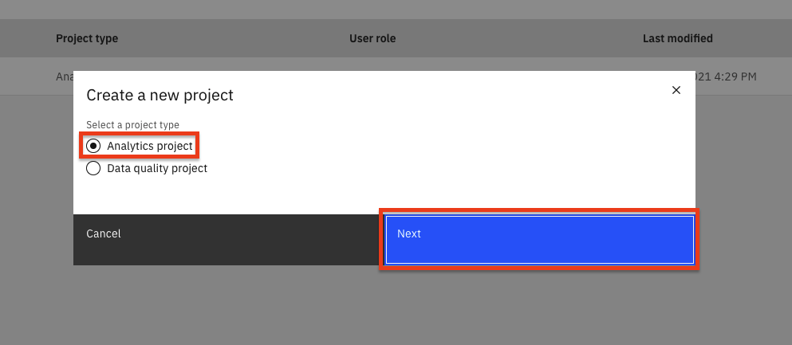
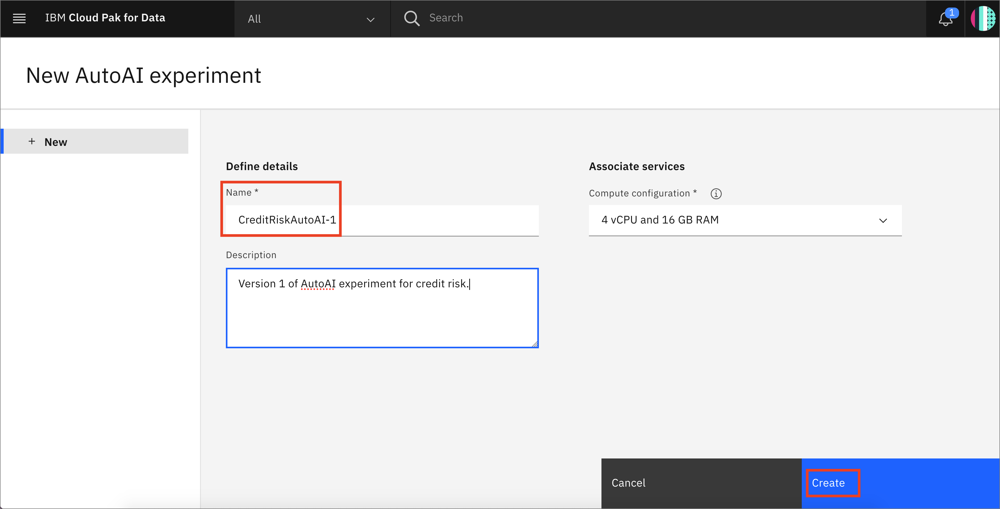
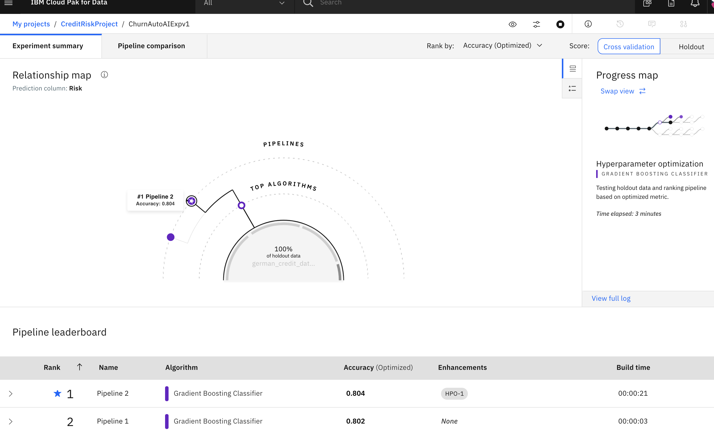
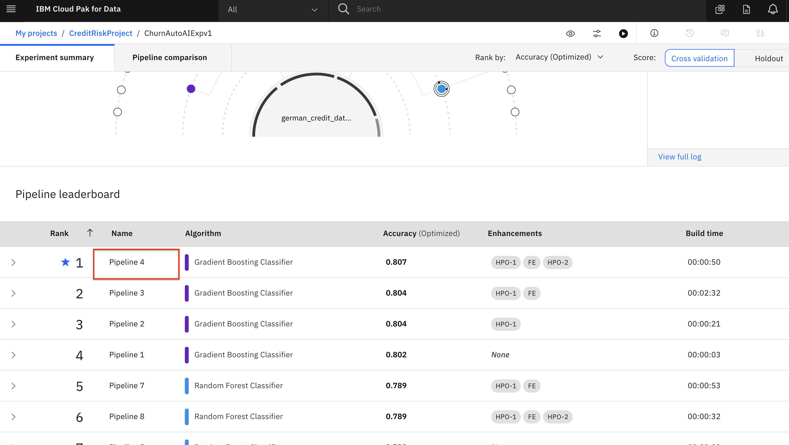
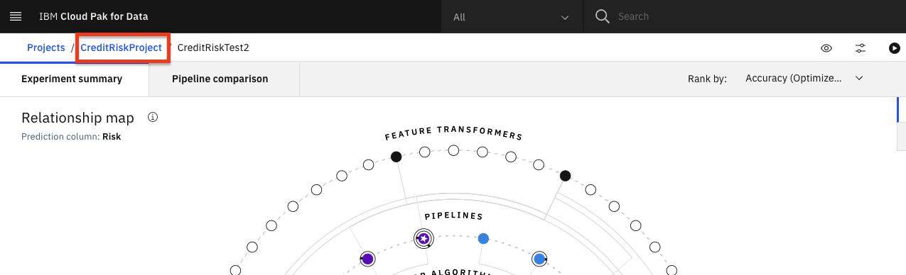
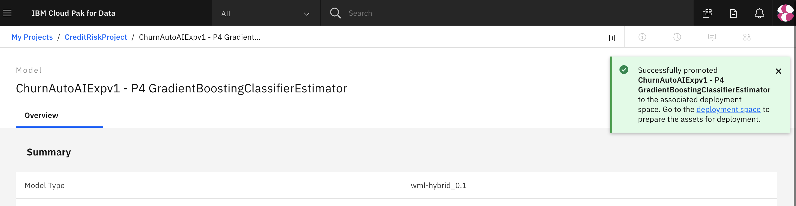

AIのためのAIを作ることを目的に、IBMはWatson&trade;Studio上に[AutoAI](https://www.ibm.com/docs/en/cloud-paks/cp-data/4.0?topic=models-autoai)というサービスを導入しました。

AutoAIは、データサイエンティストの作業を楽にするために、機械学習のタスクを自動化する機能です。モデリングのためのデータの準備、問題に最適なアルゴリズムの選択、学習したモデルのパイプラインの作成などを自動的に行い、パブリック・クラウドでも、IBM Cloud Pak for Dataをはじめとするプライベート・クラウドでも実行することができます。

## 学習目標

このチュートリアルでは、AutoAI サービスの利点をユースケースで説明します。これにより、回帰や分類の問題がどのようにコードなしで処理されるのか -- そして、このサービスでどのようにタスク（フィーチャー・エンジニアリング、モデル選択、ハイパーパラメータ・チューニングなど）が行われるのかについて理解を深めることができます。このチュートリアルには、パイプラインの中から最適なモデルを選択するための詳細や、IBM Cloud Pak for Dataプラットフォームを介してこれらのモデルをデプロイして使用する方法も含まれています。

## 前提条件

* [IBM Cloud Pak for Data](https://www.ibm.com/analytics/cloud-pak-for-data)

## 想定される時間

このチュートリアルの所要時間は約20分(AutoAIのトレーニングを含む)で、以下のステップに分かれています。

このセクションは、以下のステップに分かれています。

1. [プロジェクトとAutoAIインスタンスの作成](#1-create-a-project-and-autoai-instance)
1. [AutoAI実験の実行](#2-run-autoai-experiment)
1. [AutoAIモデルの保存](#3-save-autoai-model)
1. [AutoAIノートの保存](#4-save-autoai-notebook)
1. [モデルを宣伝する](#5-モデルを宣伝する)

## 1.プロジェクトとAutoAIインスタンスの作成

このラーニングパスのためのプロジェクトをまだ作成していない場合は、以下の指示に従ってプロジェクトを作成してください。そうでない場合は、[AutoAI実験の実行](#1-run-autoai-experiment)にスキップできます。

### IBM Cloud Pak for Data プロジェクトの作成

Cloud Pak for Dataでは、特定の目標を達成するために使用するリソース(問題に対する解決策を構築するためのリソース)を収集/整理するために、プロジェクトという概念を使用しています。プロジェクトのリソースには、データ、共同研究者、ノートブックやモデルなどの分析資産などがあります。

* (☰)ナビゲーションメニューの「プロジェクト」セクションで、「すべてのプロジェクト」をクリックします。

  

* `右上にある **New project`** ボタンをクリックします。

  

* `Analytics project` のラジオボタンを選択して、 **`Next`** ボタンをクリックします。

  

* ****``Create an empty project``を選択します。

  

* `プロジェクトの名前とオプションの説明を入力し、 **Create`** をクリックします。

  

### この実験のデータセットをダウンロードして、プロジェクトに読み込みます。

* [german_credit_data.csv](static/german_credit_data.csv) データセットをダウンロードします。

* **Browse** をクリックし、ダウンロードしたファイルを選択して、データセットを分析プロジェクトにアップロードします。

## 2.AutoAI実験の実行

* AutoAI 実験を開始するには、ページ上部の *`Add to Project`* ボタンをクリックし、`AutoAI experiment` を選択します。

  

* AutoAI experiment assetに名前を付け、ドロップダウンメニューにデフォルトのcompute configurationオプションを残します。そして、`Create`ボタンをクリックします。

  

* 実験を設定するには、まず機械学習モデルの学習に使用するデータセットを与える必要があります。ここでは、プロジェクトにあらかじめ読み込まれているCSVファイルのデータセットの1つを使用します。「プロジェクトから選択」オプションをクリックします。

  

* ダイアログで、`german_credit_data.csv` ファイルを選択して、`Select asset` ボタンをクリックします。

  

**** データセットが読み込まれたら、モデルに予測させたい内容を指定する必要があります。*Select prediction column*パネルで、`Risk`の行を探してクリックしてください。

* AutoAIは、データセットと予測のために選択された列に基づいて、実験のためのデフォルト値を設定します。これには、構築するモデルの種類、最適化するメトリクス、テスト/トレーニングの分割などが含まれます。これらの値を表示/変更するには、*`Experiment settings`*ボタンをクリックします。

  

* `Data source settings` パネルの `Select columns to include` セクションで、`CustomerID` カラム名のチェックボックスの選択を外します。これにより、モデルの機能として顧客IDカラムが使用されなくなります。実験の他の部分を変更することもできますが、ここでは残りのデフォルト値を受け入れて、`Save settings`ボタンをクリックします。

  

* 実験を開始するには、`Run experiment`ボタンをクリックします。

  

* AutoAIの実験が実行されます。AutoAIは、データセットを準備し、データセットを学習/評価グループに分割し、モデルの種類に応じて最もパフォーマンスの高いアルゴリズム/推定量を見つけるステップを実行します。そして、上位N個のアルゴリズムのそれぞれについて、以下の一連の候補パイプラインを構築します（ここで、Nは設定で選択した数で、デフォルトは2です）。

    * ベースラインモデル（パイプライン1）
    * ハイパーパラメータの最適化（パイプライン2）
    * 自動フィーチャーエンジニアリング（パイプライン3）
*    ハイパーパラメータの最適化（パイプライン4） * エンジニアリングされたフィーチャーの上でのハイパーパラメータの最適化

* 異なるアルゴリズム／評価者が選択され、異なるパイプラインが作成・評価されると、UIに進捗が表示されます。完了したパイプラインのパフォーマンスは、リーダーボードで各パイプラインのセクションを展開することで確認できます。

  

* 実験の実行には数分かかることがあります。完了すると、パイプラインが作成されたというメッセージが表示されます。実験が完了するまで次のセクションには進まないでください。

## 3.AutoAIモデルの保存

* 実験が完了すると、UIで様々なパイプラインやオプションを検討することができます。利用可能なオプションには、パイプラインの比較、別のパフォーマンス指標に基づくランキングの変更、実験のログの表示、パイプラインのランク付けされたリストの表示などがあります（実験の最適化指標（ここでは精度）に基づくランキング）。

  

* 下にスクロールすると、*Pipeline leaderboard*が表示されます。トップパフォーマンスのパイプラインが1位になっています。

* 次のステップでは、最も良い結果を出したモデルを選択し、そのパフォーマンスを確認します。今回の実験では、Pipeline 4が最も良い結果を出しました。リーダーボードから該当するパイプライン名をクリックすると、詳細な結果を見ることができます。

  

* モデルの評価ページでは、実験のメトリクス、混同行列、実行された特徴変換（もしあれば）、どの特徴がモデルに寄与しているか、パイプラインの詳細などが表示されます。オプションとして、パイプラインの詳細をクリックして見ることができます。

  

* このモデルをデプロイするには、*`Save as`* ボタンをクリックします。次の画面で、`モデル`を選択してください。デフォルトの名前のままか、変更して、オプションで説明やタグを追加して、`Create`をクリックして保存します。

  

* モデルがプロジェクトに保存されたことを示す通知が届きます。モデルがプロジェクトに保存されたことを示す通知が届きます。通知を見てプロジェクトに戻るには、`View in project`をクリックするか、左上のナビゲーターでプロジェクト名をクリックしてプロジェクトのメインページに戻ります。

  

* *Assets*ページの*Models*セクションに新しいモデルが表示されます。

## 4.4. AutoAIノートブックの保存

* AutoAIの実験をノートブックとして保存するには、選択したパイプラインのウィンドウに戻り、「Save as」をクリックします。

> *注：パイプラインのウィンドウに戻るには、プロジェクトの概要ページを開き、AutoAI実験をクリックして、リーダーボードからパイプラインをクリックします*。

  

* `Notebook` タイルを選択し、デフォルトの名前を受け入れるか、必要に応じて変更します。オプションで説明やタグを追加して、「Create」をクリックします。

  

* ノートブックがプロジェクトに保存されたことを示す通知が表示されます。パイプラインの詳細ウィンドウを閉じて、画面の上部にプロジェクトに戻るパスを露出させます。あなたのプロジェクト名をクリックして、プロジェクトの概要ページに移動します。

  

* ノートブックはプロジェクトに保存され、詳細な検討や変更、修正、新しいモデルの作成に利用することができます。詳細は、[Modifying and running an AutoAI generated notebook](static/running-autoai-notebook.md)のドキュメントを参照してください。

## 5.モデルをプロモートする

* モデルを保存したら、次はデプロイスペースでモデルを利用できるようにして、デプロイできるようにする必要があります。「アセット」ページの「モデル」セクションで、保存したモデルの名前をクリックします。

  

* モデルをデプロイできるようにするには、先に設定したデプロイメントスペースで利用できるようにする必要があります。`Promote to deployment space`をクリックしてください。

  

***> ***注：ここでは、ワークショップの *pre-work* セクションでデプロイメントスペースを既に作成していることを前提としています。

* 必要に応じて、任意の説明やタグを追加してください。*`Promote`*ボタンをクリックしてください。

  をクリックします。

* モデルが正常にデプロイメントスペースに昇格したことを示す通知が表示されます。

  

## Conclusion

本節では、Cloud Pak for Data上で機械学習モデルを構築するための1つのアプローチを取り上げました。AutoAIは、以下のようなタスクを自動化することで、最適なモデルを見つけるのに役立つことを見てきました。

* データ整理
* モデルアルゴリズムの評価と選択
* フィーチャーエンジニアリング
* ハイパーパラメータの最適化

AutoAIについてもっと知りたいですか？では、[Use AutoML to find and deploy the best models in minutes](https://developer.ibm.com/technologies/artificial-intelligence/learningpaths/explore-autoai/)をご覧ください。