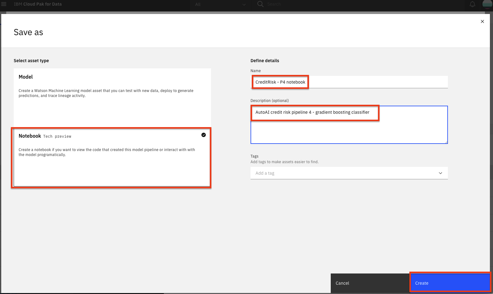

With the aim of creating AI for AI, IBM introduced a service on Watson&trade; Studio called [AutoAI](https://www.ibm.com/docs/en/cloud-paks/cp-data/4.0?topic=models-autoai).

AutoAI is a capability that automates machine learning tasks to ease the tasks of data scientists. It automatically prepares your data for modeling, chooses the best algorithm for your problem, and creates pipelines for the trained models, and it can be run in public clouds and in private clouds, including IBM Cloud Pak for Data.

## Learning objectives

This tutorial explains the benefits of the AutoAI service on a use case. This will give you a better understanding of how regression and classification problems can be handled without any code -- and how the tasks (feature engineering, model selection, hyperparameter tuning, etc.) are done with this service. This tutorial also includes details for choosing the best model among the pipelines and how to deploy and use these models via IBM Cloud Pak for Data platform.

## Prerequisites

* [IBM Cloud Pak for Data](https://www.ibm.com/analytics/cloud-pak-for-data)

## Estimated time

This tutorial should take approximately 20 minutes to complete (including the training in AutoAI) and is broken up into the following steps:

This section is broken up into the following steps:

1. [Create a project and AutoAI instance](#1-create-a-project-and-autoai-instance)
1. [Run AutoAI Experiment](#2-run-autoai-experiment)
1. [Save AutoAI Model](#3-save-autoai-model)
1. [Save AutoAI Notebook](#4-save-autoai-notebook)
1. [Promote the Model](#5-promote-the-model)

## 1. Create a project and AutoAI instance

If you have not already created a project for this learning path, follow the instructions below to create one. Otherwise, you can skip to [Run AutoAI Experiment](#1-run-autoai-experiment).

### Create an IBM Cloud Pak for Data project

In Cloud Pak for Data, we use the concept of a project to collect / organize the resources used to achieve a particular goal (resources to build a solution to a problem). Your project resources can include data, collaborators, and analytic assets like notebooks and models, etc.

* Go the (☰) navigation menu and under the *Projects* section click on *`All Projects`*.

  

* Click on the **`New project`** button on the top right.

  

* Select the `Analytics project` radio button and click the **`Next`** button.

  

* Select **`Create an empty project`**.

  

* Provide a name and optional description for the project and click **`Create`**.

  

### Download the dataset for this experiment and load it into you project.

* Download the [german_credit_data.csv](static/german_credit_data.csv) dataset.

* Upload the dataset to the analytics project by clicking on **Browse** and selecting the downloaded file.

## 2. Run AutoAI Experiment

* To start the AutoAI experiment, click the *`Add to Project`* button from the top of the page and select the `AutoAI experiment` option.

  

* Name your AutoAI experiment asset and leave the default compute configuration option listed in the drop-down menu. Then click the `Create` button.

  

* To configure the experiment, we must first give it the dataset that will be used to train the machine learning model. We will be using one of the CSV file datasets we have preloaded into the project. Click on the `Select from project` option.

  

* In the dialog, select the `german_credit_data.csv` file and click the `Select asset` button.

  

* Once the dataset is read in, we will need to indicate what we want the model to predict. Under *Select prediction column* panel, find and click on the `Risk` row.

* AutoAI will set up defaults values for the experiment based on the dataset and the column selected for the prediction. This includes the type of model to build, the metrics to optimize against, the test/train split, etc. To view/change these values, click the *`Experiment settings`* button.

  

* On the `Data source settings` panel, in the `Select columns to include` section, deselect the checkbox for the `CustomerID` column name. This will remove the customer ID column from being used as a feature for the model. Although we could change other aspects of the experiment, we will accept the remaining default values and click the `Save settings` button.

  

* To start the experiment, click on the `Run experiment` button.

  

* The AutoAI experiment will now run. AutoAI will run through steps to prepare the dataset, split the dataset into training / evaluation groups and then find the best performing algorithms / estimators for the type of model. It will then build the following series of candidate pipelines for each of the top N performing algorithms (where N is a number chosen in the configuration which defaults to 2):

    * Baseline model (Pipeline 1)
    * Hyperparameter optimization (Pipeline 2)
    * Automated feature engineering (Pipeline 3)
    * Hyperparameter optimization on top of engineered features(Pipeline 4)

* The UI will show progress as different algorithms/evaluators are selected and as different pipelines are created & evaluated. You can view the performance of the pipelines that have completed by expanding each pipeline section in the leaderboard.

  

* The experiment can take several minutes to run. Upon completion you will see a message that the pipelines have been created. Do not proceed to the next section until the experiment completes.

## 3. Save AutoAI Model

* Once the experiment completes, you can explore the various pipelines and options in the UI. Some of the options available are to see a comparison of the pipelines, to change the ranking based on a different performance metric, to see a log of the experiment, or to see the ranked listing of the pipelines (ranking based on the optimization metric in your experiment, in this case accuracy.)

  

* Scroll down to see the *Pipeline leaderboard*. The top performing pipeline is in the first rank.

* The next step is to select the model that gives the best result and view its performance. In this case, Pipeline 4 gave the best result for our experiment. You can view the detailed results by clicking the corresponding pipeline name from the leaderboard:

  

* The model evaluation page will show metrics for the experiment, confusion matrix, feature transformations that were performed (if any), which features contribute to the model, and more details of the pipeline. Optionally, feel free to click through these views of the pipeline details.

  

* In order to deploy this model, click on the *`Save as`* button. On the next scren, select the `Model` option. Keep the default name or change it, add an optional description and tags, and click `Create` to save it.

  

* You receive a notification to indicate that your model is saved to your project. You can return to your project using the notification by clicking `View in project`, or go back to your project main page by clicking on the project name on the navigator on the top left.

  

* You will see the new model under *Models* section of the *Assets* page:

## 4. Save AutoAI notebook

* To save the AutoAI experiment as a notebook, go back to the window for the pipeline you have chosen, and click `Save as`.

> *Note: You can get back to the pipeline window by going to your project overview page, clicking on the AutoAI experiment and clicking the pipeline from the leaderboard*

  

* Choose the `Notebook` tile, accept the default name or change it if you like. Add optional description or tags, and click `Create`.

  

* You will receive a notification to indicate that your notebook is saved to your project. Close the pipeline details window to expose the path back to the project at the top of the screen. Click on your project name to navigate to the project overview page.

  

* The notebook will be saved to your project, and can be examined in detail, changed and modified, and used to create a new model. See the documentations for [Modifying and running an AutoAI generated notebook](static/running-autoai-notebook.md) for details.

## 5. Promote the model

* Now that we have saved our model, we will next need to make the model available in our deployment space so it can be deployed. Under the *Models* section of the *Assets* page, click the name of your saved model.

  

* To make the model available to be deployed, we need to make it available in the deployment space we previously set up. Click on the `Promote to deployment space`:

  

> ***Note: This is assuming you have already created a deployment space in the *pre-work* section of the workshop.

* Add an optional description or tags if you'd like. Click on the *`Promote`* button.

  

* You will see a notification that the model was promoted to the deployment space succesfully.

  

## Conclusion

In this section we covered one approach to building machine learning models on Cloud Pak for Data. We have seen how AutoAI helps find an optimal model by automating tasks such as:

* Data Wrangling
* Model Algorithm Evaluation & Selection
* Feature Engineering
* Hyperparameter Optimization.

Want to find out more about AutoAI? Then, take a look at [Use AutoML to find and deploy the best models in minutes](https://developer.ibm.com/technologies/artificial-intelligence/learningpaths/explore-autoai/)