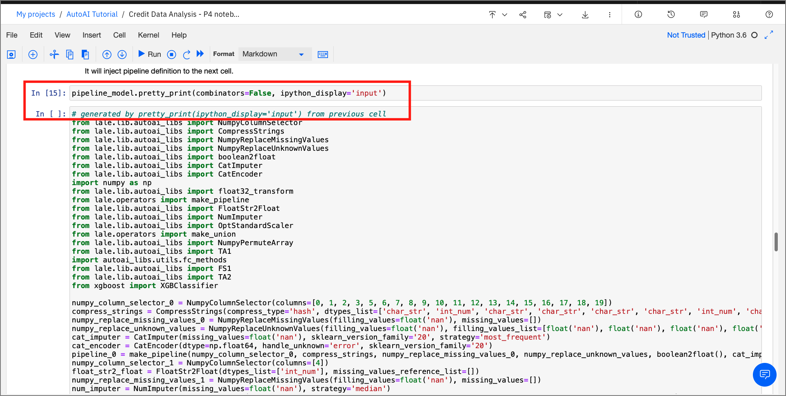

---
{}
---

# Modifying and Running an AutoAI generated notebook

Spend some time looking through the sections of the notebook to get an overview. A notebook is composed of text (markdown or heading) cells and code cells. The markdown cells provide comments on what the code is designed to do.

You will run cells individually by highlighting each cell, then either click the `Run` button at the top of the notebook or hitting the keyboard short cut to run the cell (Shift + Enter but can vary based on platform). While the cell is running, an asterisk ([\*]) will show up to the left of the cell. When that cell has finished executing a sequential number will show up (i.e. [17]).

The notebook generated is pre filled with Python code and is divided into the following steps:

- [1.0 Setup](#10-setup)
- [2.0 Pipeline inspection](#20-pipeline-inspection)
- [3.0 Pipeline refinery and testing](#30-pipeline-refinery-and-testing)
  - [3.1 Modify source code](#31-modify-source-code)
  - [3.2 Use lale library for semiautomated data science](#32-use-lale-library-for-semiautomated-data-science)
- [4.0 Deploy and score as web service using WML instance](#40-deploy-and-score-as-web-service-using-wml-instance)

## 1.0 Setup

In the cell after *Connection to WML* you will enter the Cloud Pak for Data cluster URL to access your instance of Watson Machine Learning. This URL will look like:
`https://zen-cpd-zen.myname-cpd3-os45-v2-2bef1f4b4393021da9302000c44fc3b2-0000.us-south.containers.appdomain.cloud/`

You can get this from your browser window where you are viewing this notebook, dropping everything in the URL after `appdomain.cloud/` (or whatever ends the first section of the URL).

  

This section also contains credentials to *Cloud Object Storage* through which the current AutoAI pipeline is retrieved. The cell contains code prefilled to extract the training data used to create the pipeline and the pipeline results.

  

Also this section contains the metadata of the current pipelines that were used to run the experiment.

  

## 2.0 Pipeline inspection

Within this section of the notebook, there is code that extracts the current model and prints it as Python code.

  

This section also contains code to visualize the stages within the model as a graph using Watson Machine Learning's AutoAI APIs.

  

## 3.0 Pipeline refinery and testing

This optional section walks us through two different ways of editing and retraining the model generated from the chosen pipeline. Here, you could modify parameters or change inputs to the methods such as algorithm choices, cross validation, or maximum evaluations. For this lab, just run the cells as the are, but feel free to come back later and modify things for your own learning and experimentation.

>**Convert Raw NBConvert cells to Code Cells** -
Since this section of the notebook is optional, these cells cannot be run by default. To execute these series of cells, highlight the cell, and click on the `Format` dropdown from the menu and change the selection from `Raw NBConvert` cell to `Code`.
  

### 3.1 Modify source code

By running the `pretty-print` function, a  code cell is inserted as shown below. This new cell contains the source code of the pipeline. This code can now be modified and re-trained to produce a new model.

  

### 3.2 Use lale library for semiautomated data science

By using the *hyperopt* optimizer provided by the *lale* framework, we see how an estimator modified as a graph can be trained and tested.

  

Since the framework is compatible with scikit-learn the output pipeline can be exported as a scikit-learn model using the `export_to_sklearn_pipeline` method.

  

## 4.0 Deploy and score as web service using WML instance

This section of the notebook contains code that deploys the pipeline model as a web service using Watson Machine Learning. This section requires users to enter credentials to be able to identify the deployment space used for this model.

### target_space_id

You'll need the *target_space_id* from your deployment space, created in the [pre-work](https://github.ibm.com/IBMDeveloper/cp4d-workshop-credit-risk/tree/CPDaaS-master/workshop/pre-work#create-a-deployment-space)(pre-work#create-a-deployment-space) part of this workshop.

* Click on the hamburger menu on the top-left corner of the Cloud Pak for Data home page.

* Click on `Deployments` from the list and select the `Spaces` tab.

* Click on the name of your Deployment space, click on the `Settings` tab, and then copy the *Space ID*.

  


Acquire the *target_space_id* as shown in the steps above and paste within the *Create deployment* section. The Watson Machine Learning API uses the `wml_credentials` and the `target_space_id` to deploy the machine learning model as a web service.

  

Once the cells are executed, the model is promoted to the deployment space and is now available as a web service and can be verified from within the UI, or using the Python SDK as demonstrated in the notebook.

  

### Score web service

For details on how to test the deployed model using the UI, see the steps in the [Machine Learning Deployment and Scoring Lab](machine-learning-deployment-scoring/README.md#test-online-model-deployment)

For this lab, you can test this deployment using the Python SDK by running the final cell in the notebook:

```python
predictions = service.score(payload=test_df)
predictions
```
  

## Conclusion

In this part of the lab, we examined and ran a Jupyter notebook that was generated as the result of an AutoAI experiment. Feel free to modify and re-run the notebook, making any changes that you are comfortable with.