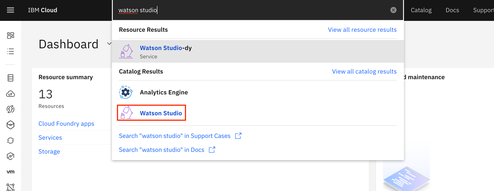

---
also_found_in:
- learningpaths/get-started-with-deep-learning/
authors: ''
check_date: '2021-11-06'
completed_date: '2020-11-06'
components:
- tensorflow
- jupyter
- cloud-pak-for-data
draft: false
excerpt: 線形回帰を定義するためのPythonコードを含むJupyter Notebookを作成し、TensorFlowを使ってそれを実装します。
last_updated: '2020-11-06'
meta_description: 線形回帰を定義するためのPythonコードを含むJupyter Notebookを作成し、TensorFlowを使ってそれを実装します。
meta_keywords: TensorFlow, linear regression, Python
meta_title: TensorFlowによる線形回帰の実行
primary_tag: deep-learning
related_content:
- slug: linear-regression-from-scratch
  type: articles
- slug: learning-path-machine-learning-for-developers
  type: series
- slug: learn-regression-algorithms-using-python-and-scikit-learn
  type: tutorials
subtitle: 線形回帰を定義するためのPythonコードを含むJupyter Notebookを作成し、それをTensorFlowで実装する
tags:
- artificial-intelligence
- machine-learning
- data-science
- python
title: TensorFlowによる線形回帰の実行
---

このチュートリアルでは、線形回帰を定義するためのPythonコードを含むJupyterノートブックを作成し、TensorFlowを使用して実装する方法を学びます。このノートブックは、IBM Cloud Pak&reg; for Data as a Service on IBM Cloud&reg; 上で動作します。IBM Cloud Pak for Dataプラットフォームは、複数のデータソースとの統合、ビルトインのアナリティクス、Jupyter Notebooks、機械学習などの追加サポートを提供します。また、複数のコンピューティングリソースにプロセスを分散させることで、スケーラビリティを実現しています。

## はじめに

線形回帰とは、簡単に言えば、2つ以上の変数の関係を記述するために使用される線形モデルの近似です。単純な線形回帰では、2つの変数があります。

* 従属変数は、我々が研究し、予測しようとする「状態」や「最終的な目標」と見なすことができます。
* 独立変数（説明変数としても知られている）："状態 "の "原因 "と見なすことができます。

複数の独立変数が存在する場合、このプロセスは重回帰と呼ばれます。複数の従属変数を予測する場合、このプロセスは多変量線形回帰と呼ばれます。

単純な線形モデルの式は次のとおりです。

𝑌=𝑎𝑋+𝑏

この式では、*Y*が従属変数、*X*が独立変数、*a*と*b*が調整するパラメータです。*a*は「傾き」または「勾配」、*b*は「切片」と呼ばれています。この式は、*Y*が*X*の関数である、または*Y*が*X*に依存していると解釈できます。

## 前提条件

* [IBM Cloud](https://cloud.ibm.com/registration?cm_sp=ibmdev-_-developer-tutorials-_-cloudreg)のアカウントを持っていること。
* [IBM Cloud Pak for Data](https://www.ibm.com/jp-ja/products/cloud-pak-for-data)
* [Python](https://www.python.org/)の実用的な知識。
* [TensorFlow](https://www.tensorflow.org/)についての実務知識

## 予想される実行時間

このチュートリアルを完了するには、約30分かかります。

## 手順

1. [IBM Cloud アカウントを作成し、IBM Cloud Pak for Data as a Service にアクセスする](#create-ibm-cloud-account-and-access-ibm-cloud-pak for-data-as-a-service)
1. [新しいプロジェクトの作成](#create-a-new-project)
1. [Watson Machine Learning Service をプロジェクトに関連付ける](#associate the Watson-machine-learning-service-with-the-project)
1. [データセットをプロジェクトに追加する](#add-the-data-set-to-your-project) (IBM Cloud Pak for Data as a Service を使用している場合)
1. [ノートブックをプロジェクトに追加する](#add-a-notebook-to-your-project)
1. [ノートブックを実行する](#run-the-notebook)

### IBM Cloud アカウントを作成し、Data as a Service の IBM Cloud Pak にアクセスします。

1. [IBM Cloud](https://cloud.ibm.com/registration?cm_sp=ibmdev-_-developer-tutorials-_-cloudreg)にサインインします。
1. IBM Watson&reg;Studioを検索します。

    

1. 地域と料金プランを選択してサービスを作成し、「**Create**」をクリックします。

    

### 新しいプロジェクトの作成

1. Watson Studio サービスを起動します。

    

1. **Create a project** と **Create an empty project** をクリックします。プロジェクトに名前を付け、ストレージサービスを追加したことを確認してから、**Create** をクリックします。

    

プロジェクトが作成されると、プロジェクトのダッシュボードが表示されます。

### Watson Machine Learning Service をプロジェクトに関連付ける

1. プロジェクトの **設定** に移動します。
1. 「Associated services」の「Add service」をクリックし、ドロップダウンメニューから「**Watson**」を選択します。

    

1. Watson Machine Learning サービスを追加します。

    

1. サービスをマークして、プロジェクトと関連付けます。

    

### プロジェクトにデータセットを追加する

右側の **browse** をクリックし、**csv file** を選択して、データセットをプロジェクトに追加します。データセットは以下の URL からダウンロードできます。

データセットがアップロードされると、「データ資産」の下に表示されます。

### プロジェクトにノートブックを追加する

1. **Add to Project**をクリックして、メニューから**Notebook**を選択して、Jupyter Notebookをプロジェクトに追加します。

    

1. **From URL**を選択し、GitHub repoからノートブックのURLを貼り付けます。

1. ノートブックの名前を決めて、「Create」をクリックします。

    

### ノートブックの実行

ノートブックが読み込まれたら、ノートブックの内容を確認します。**セル**をクリックし、**Run All**を選択してノートブックを実行します。

ノートブックでは、TensorFlowの基本的な仕組みを理解するために、線形関数の簡単な例を示しています。

## まとめ

このチュートリアルと関連するノートブックでは、線形回帰の基本と、TensorFlow が機械学習アルゴリズムの実装にどのように使用されているかを学びました。また、IBM Cloud Pak for Data as a Service 上の Watson Studio を使用して Jupyter Notebook を実行する方法や、IBM Cloud Pak for Data as a Service でオープンソース・フレームワークを使用する方法を学びました。