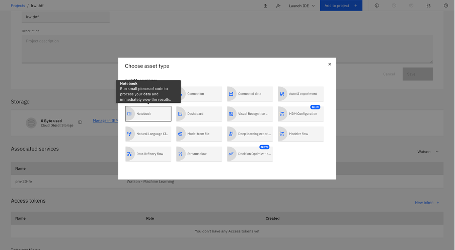

---
also_found_in:
- learningpaths/get-started-with-deep-learning/
authors: ''
check_date: '2021-11-06'
completed_date: '2020-11-06'
components:
- tensorflow
- jupyter
- cloud-pak-for-data
draft: false
excerpt: Create a Jupyter Notebook that contains Python code for defining linear regression,
  then use TensorFlow to implement it.
last_updated: '2020-11-06'
meta_description: Create a Jupyter Notebook that contains Python code for defining
  linear regression, then use TensorFlow to implement it.
meta_keywords: TensorFlow, linear regression, Python
meta_title: Perform linear regression using TensorFlow
primary_tag: deep-learning
related_content:
- slug: linear-regression-from-scratch
  type: articles
- slug: learning-path-machine-learning-for-developers
  type: series
- slug: learn-regression-algorithms-using-python-and-scikit-learn
  type: tutorials
subtitle: Create a Jupyter Notebook that contains Python code for defining linear
  regression, then use TensorFlow to implement it
tags:
- artificial-intelligence
- machine-learning
- data-science
- python
title: Perform linear regression using TensorFlow
---

In this tutorial, learn how to create a Jupyter Notebook that contains Python code for defining linear regression, then use TensorFlow to implement it. The notebook runs on IBM Cloud Pak&reg; for Data as a Service on IBM Cloud&reg;. The IBM Cloud Pak for Data platform provides additional support, such as integration with multiple data sources, built-in analytics, Jupyter Notebooks, and machine learning. It also offers scalability by distributing processes across multiple computing resources.

## Introduction

In simple terms, linear regression is the approximation of a linear model that is used to describe the relationship between two or more variables. In a simple linear regression there are two variables:

* The dependent variable, which can be seen as the "state" or "final goal" that we study and try to predict
* The independent variables, also known as explanatory variables, which can be seen as the "causes" of the "states"

When more than one independent variable is present the process is called multiple linear regression. When multiple dependent variables are predicted, the process is known as multivariate linear regression.

The equation of a simple linear model is:
<p align="center">
𝑌=𝑎𝑋+𝑏
</p>

In this equation, *Y* is the dependent variable, *X* is the independent variable, and *a* and *b* are the parameters that we adjust. *a* is known as "slope" or "gradient," and *b* is the "intercept." You can interpret this equation as *Y* being a function of *X*, or *Y* being dependent on *X*.

## Prerequisites

* An [IBM Cloud](https://cloud.ibm.com/registration?cm_sp=ibmdev-_-developer-tutorials-_-cloudreg) account.
* [IBM Cloud Pak for Data](https://www.ibm.com/products/cloud-pak-for-data)
* A working knowledge of [Python](https://www.python.org/)
* A working knowledge of [TensorFlow](https://www.tensorflow.org/)

## Estimated runtime

It should take you approximately 30 minutes to complete this tutorial.

## Steps

1. [Create your IBM Cloud account and access IBM Cloud Pak for Data as a Service](#create-ibm-cloud-account-and-access-ibm-cloud-pak-for-data-as-a-service)
1. [Create a new project](#create-a-new-project)
1. [Associate the Watson Machine Learning Service with the project](#associate-the-watson-machine-learning-service-with-the-project)
1. [Add the data set to your project](#add-the-data-set-to-your-project) (If you're using IBM Cloud Pak for Data as a Service)
1. [Add a notebook to your project](#add-a-notebook-to-your-project)
1. [Run the notebook](#run-the-notebook)

### Create IBM Cloud account and access IBM Cloud Pak for Data as a Service

1. Sign in to [IBM Cloud](https://cloud.ibm.com/registration?cm_sp=ibmdev-_-developer-tutorials-_-cloudreg).
1. Search for IBM Watson&reg; Studio.

    

1. Create the service by selecting the region and pricing plan, then click **Create**.

    

### Create a new project

1. Start the Watson Studio service.

    

1. Click **Create a project** and **Create an empty project**. Make sure that you name your project and add a storage service, then click **Create**.

    

After your project is created, you are directed to a project dashboard.

### Associate the Watson Machine Learning Service with the project

1. Go to the **Settings** of the project.
1. Click **Add service** in the Associated services, and select **Watson** in the drop-down menu.

    

1. Add the Watson Machine Learning Service.

    

1. Mark the service and associate it with the project.

    

### Add the data set to your project

Add the data set to your project by clicking **browse** on the right, and selecting **csv file**. You can download the data set from the following URL:

```
https://github.com/IBM/dl-learning-path-assets/tree/main/fundamentals-of-deeplearning/data/FuelConsumption.csv
```


After the data set is uploaded, it appears under the Data Assets.

### Add a notebook to your project

1. Add a Jupyter Notebook to your project by clicking **Add to Project**, and selecting **Notebook** in the menu.

    

1. Select **From URL**, and paste the notebook URL from the GitHub repo:

    ```
    https://github.com/IBM/dl-learning-path-assets/tree/main/fundamentals-of-deeplearning/notebooks/LinearRegressionwithTensorFlow.ipynb
    ```

1. Name your notebook, and click **Create**.

    

### Run the notebook

After the notebook is loaded, go through the notebook. Click **Cell**, and **Select Run All** to run the notebook.


The notebook provides a simple example of a linear function to help you understand the basic mechanism behind TensorFlow. 

## Summary

In this tutorial and associated notebook, you learned the basics of linear regression and how TensorFlow is used to implement machine learning algorithms. You learned how to run a Jupyter Notebook using Watson Studio on IBM Cloud Pak for Data as a Service, and how to use open source frameworks in IBM Cloud Pak for Data as a Service.