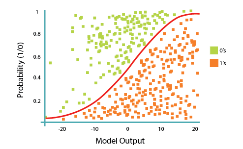
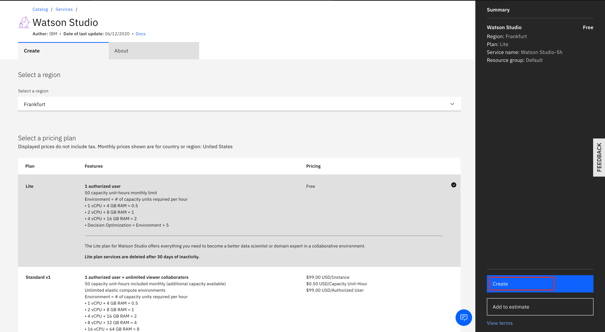
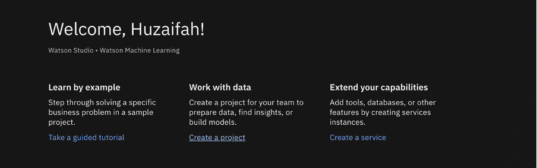
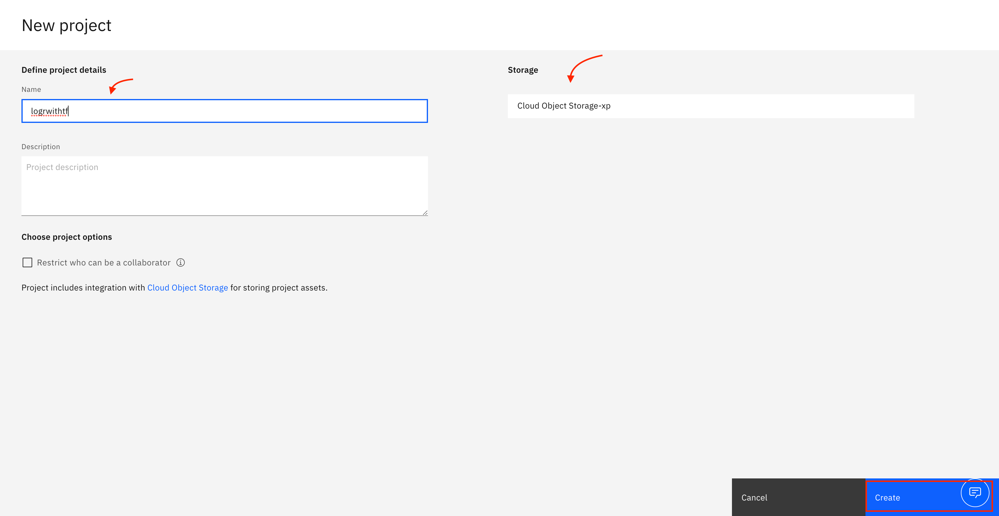
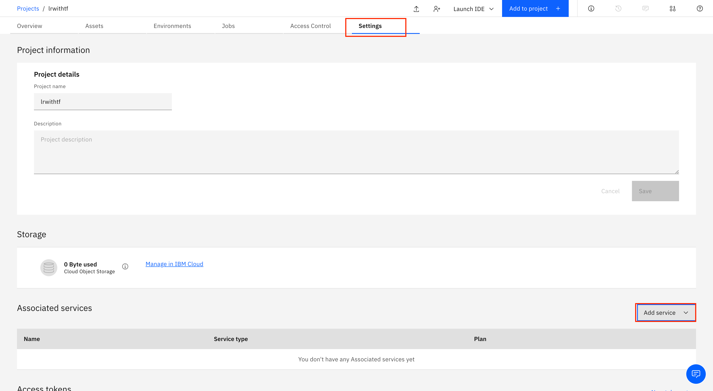
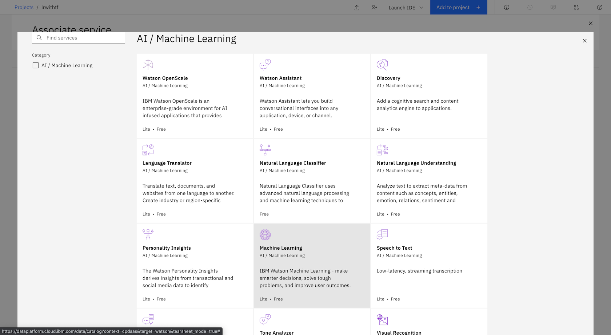
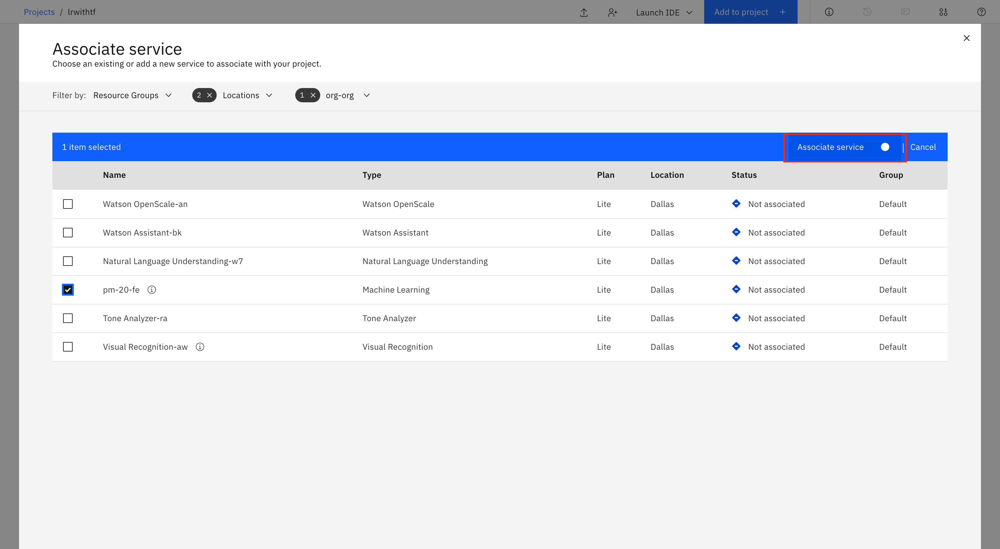
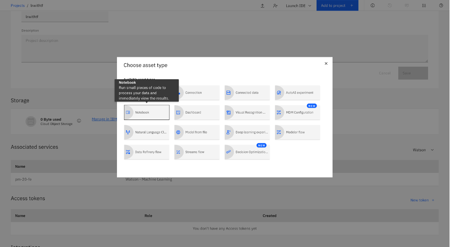
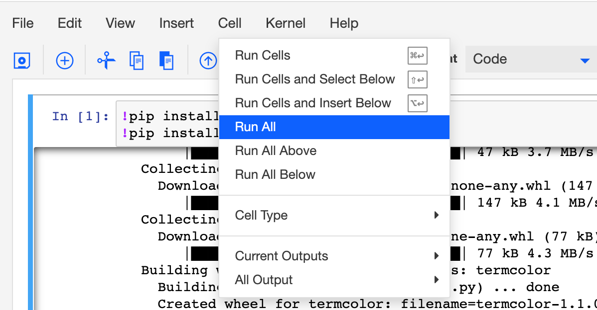

---
also_found_in:
- learningpaths/get-started-with-deep-learning/
authors: ''
check_date: '2022-03-11'
completed_date: '2021-03-11'
components:
- jupyter
- tensorflow
draft: false
excerpt: ロジスティック回帰を定義するPythonコードを含むJupyter Notebookを作成し、TensorFlow（tf.keras）を使って実装します。
meta_description: ロジスティック回帰を定義するPythonコードを含むJupyter Notebookを作成し、TensorFlow（tf.keras）を使って実装します。
meta_keywords: deep learning, machine learning, tutorial, artificial intelligence
meta_title: TensorFlowによるロジスティック回帰の実行
primary_tag: artificial-intelligence
related_content:
- slug: an-introduction-to-deep-learning
  type: articles
- slug: cc-machine-learning-deep-learning-architectures
  type: articles
- slug: neural-networks-from-scratch
  type: articles
subtitle: ロジスティック回帰を定義するためのPythonコードを含むJupyter Notebookを作成し、TensorFlow（tf.keras）を使って実装します。
tags:
- machine-learning
- deep=learning
- data-science
- python
title: TensorFlowによるロジスティック回帰の実行
---

このチュートリアルでは、ロジスティック回帰を定義するためのPythonコードを含むJupyter Notebookを作成し、TensorFlow（tf.keras）を使用して実装する方法を学びます。このノートブックは、IBM Cloud Pak&reg; for Data as a Service on IBM Cloud&reg; 上で動作します。IBM Cloud Pak for Dataプラットフォームは、複数のデータソースとの統合、ビルトインのアナリティクス、Jupyter Notebooks、機械学習などの追加サポートを提供します。また、複数のコンピューティングリソースにプロセスを分散することで、スケーラビリティを実現しています。アセットの作成にはPython、Scala、Rを選択でき、IBM Cloud Pak for Data as a Serviceプラットフォームにすでにインストールされているオープンソースのフレームワーク（TensorFlowなど）を使用できます。

## 線形回帰とロジスティック回帰の違い

線形回帰は、連続的な値を推定するのには適していますが（例えば、住宅価格や製品の売上高の推定など）、観測されたデータポイントが属するクラスを予測するのには最適なツールではありません。分類を推定するためには、そのデータポイントがどのクラスに属している可能性が最も高いのかという指針が必要です。これには、ロジスティック回帰を使用します。

### 線形回帰

線形回帰は、連続的な従属変数`y`をいくつかの予測変数（例えば、独立変数`x1`や`x2`）に関連付ける関数を求めます。単純な線形回帰では、次のような形の関数を想定しています。

これは、`w0`, `w1`, `w2` の値を求めるものです。`w0` は *切片* または *定数項* です (次の式では `b` と表示されています)。

### ロジスティック回帰

ロジスティック回帰は、線形回帰の一種であり、観測される従属変数 `y` がカテゴリー型である場合に有効です。これは、クラスラベルの確率を独立変数の関数として予測する式を作成します。

ロジスティック回帰という名前がついていますが，実際には*確率的分類*モデルです。ロジスティック回帰は、線形回帰をとって、数値の推定値を次の関数で確率に変換することで、特別なS字型の曲線にフィットします。

これにより、p値は0（`y`がマイナス無限大に近づくにつれて）と1（`y`がプラス無限大に近づくにつれて）の間になります。これで特別なタイプの非線形回帰になりました。

この式で、`y`は回帰結果（係数で重み付けされた変数の合計）、`exp`は指数関数、`theta(y)`は[ロジスティック関数](http://en.wikipedia.org/wiki/Logistic_function)で、ロジスティック曲線とも呼ばれます。一般的な「S」字型（シグモイド曲線）で、人口増加のモデル化のために最初に開発されたものです。

この関数は別の設定で見たことがあるかもしれません。

つまり、ロジスティック回帰では、入力をロジスティック/シグモイド関数に通しますが、その結果を確率として扱います。

## 前提条件

このチュートリアルに参加するためには、以下の前提条件が必要です。

* [IBM Cloud アカウント](https://cloud.ibm.com/registration?cm_sp=ibmdev-_-developer-tutorials-_-cloudreg)
* [IBM Cloud Pak for Data](https://www.ibm.com/jp-ja/products/cloud-pak-for-data) または [IBM Watson&reg; Studio](https://www.ibm.com/jp-ja/cloud/watson-studio)
* [IBM Watson Machine Learning Service](https://www.ibm.com/jp-ja/cloud/machine-learning)

## 見積もり時間

このチュートリアルを完了するには、約 60 分かかります。

## 手順

1. [IBM Cloud Account を作成し、Data as a Service の IBM Cloud Pak にアクセスします](#create-ibm-cloud-account)
1. [新しいプロジェクトを作成する](#create-a-new-project)
1. [Watson Machine Learning Service をプロジェクトに関連付ける](#Associate-the-Watson-Machine-Learning-service-with-the-project)
1. [プロジェクトにノートブックを追加する](#add-notebook-to-project)
1. [ノートブックを実行する。

### ステップ 1.IBM クラウドアカウントの作成

1. [IBM Cloud アカウント](https://cloud.ibm.com/registration?cm_sp=ibmdev-_-developer-tutorials-_-cloudreg)にサインインします。
1. 「Watson Studio」を検索します。
1. 地域と料金プランを選択してサービスを作成します。

    

1. 「**Create**」をクリックします。

    をクリックします。

### ステップ 2.新しいプロジェクトを作成します。

1. 「**Get started**」をクリックして、Watson Studio サービスを開始します。

1. **Create a project** をクリックして、空のプロジェクトを作成します。

    

1. プロジェクトに名前を付けて、ストレージサービスを追加します。

    

1. **Create**をクリックします。プロジェクトが作成されると、プロジェクトのダッシュボードが表示されます。

### ステップ 3.Watson Machine Learning Service をプロジェクトに関連付けます。

1. 「**Settings**」タブをクリックします。
1. **Associated services**までスクロールダウンして、**Add service**をクリックします。

    

1. ドロップダウンメニューで **Watson** を選択します。
1. **Machine Learning** を選択します。

    

1. **Associate service**をクリックします。

    をクリックします。

### ステップ 4.プロジェクトへのノートブックの追加

1. **Add to Project**、 **Notebook**の順にクリックして、Jupyter Notebookをプロジェクトに追加します。

    

1. **From URL**を選択して、Notebook URL欄に以下のURLを入力します。

1. ノートブックの名前を決めて、「Create」をクリックします。

    

### ステップ 5.ノートブックの実行

ノートブックが読み込まれたら、**Cell**をクリックし、**Run All**を選択してノートブックを実行します。

#### ノートブックに目を通す

ノートブックには、すべての詳細が記載されています。ノートブックの各セクションに目を通し、ノートブックの概要を把握してください。ノートブックは、テキスト（マークダウンまたは見出し）セルとコードセルで構成されています。マークダウンセルには、コードが何をするために設計されているかのコメントが書かれています。

セルを個別に実行するには、各セルをハイライトしてから、ノートブックの上部にある「**実行**」をクリックするか、キーボードのショートカット（**Shift + Enter**、ただしプラットフォームによって異なる）を使ってセルを実行します。*セルが実行されている間は、セルの左にアスタリスク（`[*]`）が表示されます。そのセルの実行が終了すると、連番が表示されます（例：`[17]`）。

ノートブックでは、TensorFlowの基本的な仕組みを理解するために、ロジスティック関数の簡単な例を紹介している。

## まとめ

このチュートリアルでは、ロジスティック回帰の基本と、TensorFlow が機械学習アルゴリズムの実装にどのように使用されているかを学びました。また、IBM Cloud Pak for Data as a Service 上の Watson Studio を使用して Jupyter Notebook を実行する方法と、IBM Cloud Pak for Data as a Service プラットフォームでオープンソース・フレームワークを使用する方法を学びました。