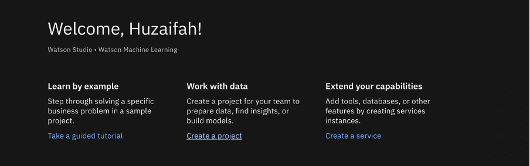
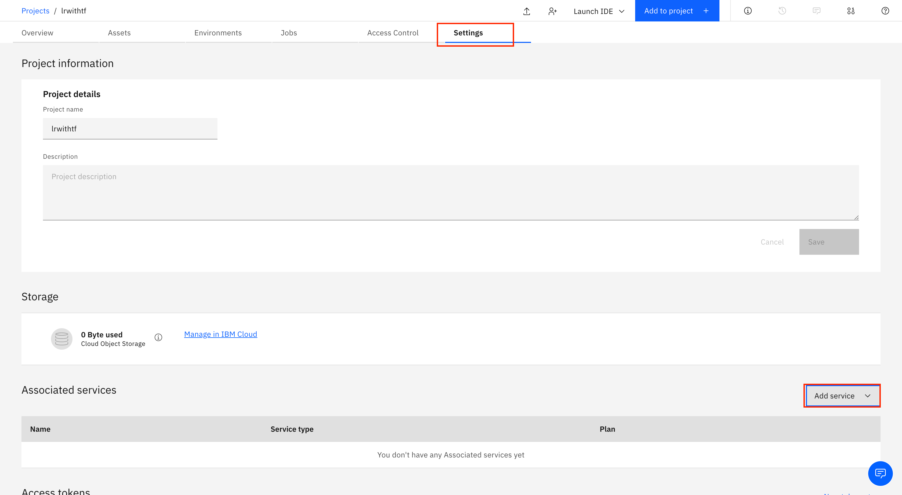
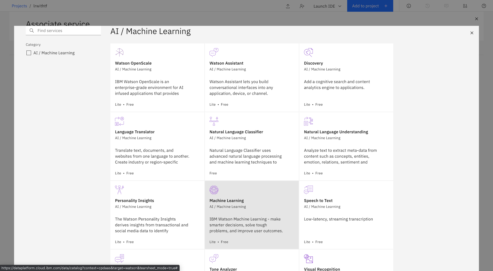
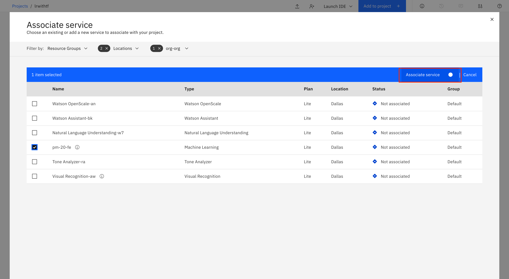
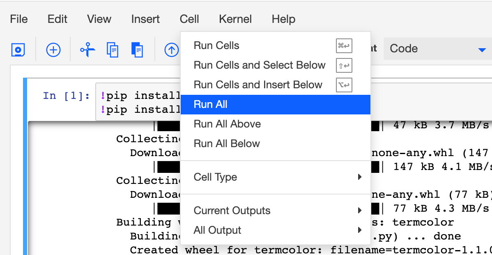

---
also_found_in:
- learningpaths/get-started-with-deep-learning/
authors: ''
check_date: '2022-03-11'
completed_date: '2021-03-11'
components:
- jupyter
- tensorflow
draft: false
excerpt: Create a Jupyter Notebook that contains Python code for defining logistic
  regression, then use TensorFlow (tf.keras) to implement it.
meta_description: Create a Jupyter Notebook that contains Python code for defining
  logistic regression, then use TensorFlow (tf.keras) to implement it.
meta_keywords: deep learning, machine learning, tutorial, artificial intelligence
meta_title: Perform logistic regression using TensorFlow
primary_tag: artificial-intelligence
related_content:
- slug: an-introduction-to-deep-learning
  type: articles
- slug: cc-machine-learning-deep-learning-architectures
  type: articles
- slug: neural-networks-from-scratch
  type: articles
subtitle: Create a Jupyter Notebook that contains Python code for defining logistic
  regression, then use TensorFlow (tf.keras) to implement it
tags:
- machine-learning
- deep=learning
- data-science
- python
title: Perform logistic regression using TensorFlow
---

In this tutorial, learn how to create a Jupyter Notebook that contains Python code for defining logistic regression, then use TensorFlow (tf.keras) to implement it. The Notebook runs on IBM Cloud Pak&reg; for Data as a Service on IBM Cloud&reg;. The IBM Cloud Pak for Data platform provides additional support, such as integration with multiple data sources, built-in analytics, Jupyter Notebooks, and machine learning. It also offers scalability by distributing processes across multiple computing resources. You can choose to create assets in Python, Scala, and R, and use open source frameworks (such as TensorFlow) that are already installed on the IBM Cloud Pak for Data as a Service platform.

## The difference between linear and logistic regression

While linear regression is well suited for estimating continuous values (for example, estimating house prices or product sales), it is not the best tool for predicting the class in which an observed data point belongs. To provide estimates for classification, you need some guidance on what would be the *most probable class* for that data point. For this, you would use logistic regression.

### Linear regression

Linear regression finds a function that relates a continuous dependent variable, `y`, to some predictors (for example, independent variables `x1` or `x2`). Simple linear regression assumes a function of the form:

```
y = w0 + w1 x x1 + w2 x x2 + ...
```

It finds the values of `w0`, `w1`, and `w2`. The term `w0` is the *intercept* or *constant term* (it's shown as `b` in the following formula):

```
 Y = W X + b
```

### Logistic regression

Logistic regression is a variation of linear regression and is useful when the observed dependent variable, `y`, is categorical. It produces a formula that predicts the probability of the class label as a function of the independent variables.

Despite the name logistic regression, it is actually a *probabilistic classification* model. Logistic regression fits a special s-shaped curve by taking the linear regression and transforming the numeric estimate into a probability with the following function:

```
 𝑃𝑟𝑜𝑏𝑎𝑏𝑖𝑙𝑖𝑡𝑦𝑂𝑓𝑎𝐶𝑙𝑎𝑠𝑠=𝑡ℎ𝑒𝑡𝑎(𝑦)=𝑓𝑟𝑎𝑐𝑒𝑦1+𝑒𝑦=𝑒𝑥𝑝(𝑦)/(1+𝑒𝑥𝑝(𝑦))=𝑝
```

This produces p-values between 0 (as `y` approaches minus infinity) and 1 (as `y` approaches plus infinity). This now becomes a special type of non-linear regression.

In this equation, `y` is the regression result (the sum of the variables weighted by the coefficients), `exp` is the exponential function, and `theta(y)` is the [logistic function](http://en.wikipedia.org/wiki/Logistic_function), also called logistic curve. It is a common "S" shape (sigmoid curve), and was first developed for modeling population growth.

You might have seen this function before in another configuration:

```
𝑃𝑟𝑜𝑏𝑎𝑏𝑖𝑙𝑖𝑡𝑦𝑂𝑓𝑎𝐶𝑙𝑎𝑠𝑠=𝑡ℎ𝑒𝑡𝑎(𝑦)=𝑓𝑟𝑎𝑐11+𝑒−𝑦
```

So, logistic regression passes the input through the logistic/sigmoid function, but then treats the result as a probability.


## Prerequisites

The following prerequisites are required to follow the tutorial:

* [IBM Cloud account](https://cloud.ibm.com/registration?cm_sp=ibmdev-_-developer-tutorials-_-cloudreg)
* [IBM Cloud Pak for Data](https://www.ibm.com/products/cloud-pak-for-data) or [IBM Watson&reg; Studio](https://www.ibm.com/cloud/watson-studio)
* [IBM Watson Machine Learning Service](https://www.ibm.com/cloud/machine-learning)

## Estimated time

It should take you approximately 60 minutes to complete this tutorial.

## Steps

1. [Create your IBM Cloud Account and access the IBM Cloud Pak for Data as a Service.](#create-ibm-cloud-account)
1. [Create a new project.](#create-a-new-project)
1. [Associate the Watson Machine Learning Service with the project.](#Associate-the-watson-machine-learning-service-with-the-project)
1. [Add a Notebook to your project.](#add-notebook-to-project)
1. [Run the Notebook.](#run-the-notebook)

### Step 1. Create IBM Cloud account

1. Sign in to your [IBM Cloud account](https://cloud.ibm.com/registration?cm_sp=ibmdev-_-developer-tutorials-_-cloudreg).
1. Search for Watson Studio.
1. Create the service by selecting a region and pricing plan.

    

1. Click **Create**.

    

### Step 2. Create a new project

1. Click **Get started** to start the Watson Studio service.

1. Click **Create a project**, and create an empty project.

    

1. Name your project, and add a storage service.

    

1. Click **Create**. After your project is created, you are directed to a project dashboard.

### Step 3. Associate the Watson Machine Learning Service with the project

1. Click the **Settings** tab.
1. Scroll down to **Associated services**, and click **Add service**.

    

1. Select **Watson** in the drop-down menu.
1. Select **Machine Learning**.

    

1. Click **Associate service**.

    

### Step 4. Add Notebook to project

1. Click **Add to Project**, then **Notebook** to add a Jupyter Notebook to your project.

    

1. Select **From URL**, and enter the following URL in the Notebook URL field.

    ```
    https://github.com/IBM/dl-learning-path-assets/tree/main/fundamentals-of-deeplearning/notebooks/Logistic_Regression_with_TensorFlow.ipynb
    ```

1. Name your Notebook, and click **Create**.

    

### Step 5. Run the Notebook

After the notebook is loaded, click **Cell**, then select **Run All** to run the Notebook.



#### Read through the Notebook

The Notebook contains all of the details. Spend some time looking through the sections of the Notebook to get an overview of the Notebook. The Notebook is composed of text (markdown or heading) cells and code cells. The markdown cells provide comments on what the code is designed to do.

You run cells individually by highlighting each cell, then either click **Run** at the top of the Notebook or use the keyboard shortcut to run the cell (**Shift + Enter**, but this can vary based on the platform). While the cell is running, an asterisk (`[*]`) appears to the left of the cell. When that cell has finished running, a sequential number appears (for example, `[17]`).

The Notebook provides a simple example of a logistic function to help you understand the basic mechanism behind TensorFlow.

## Summary

In this tutorial, you learned the basics of logistic regression and how TensorFlow is used to implement machine learning algorithms. You learned how to run a Jupyter Notebook using Watson Studio on IBM Cloud Pak for Data as a Service, and how to use open source frameworks in the IBM Cloud Pak for Data as a Service platform.