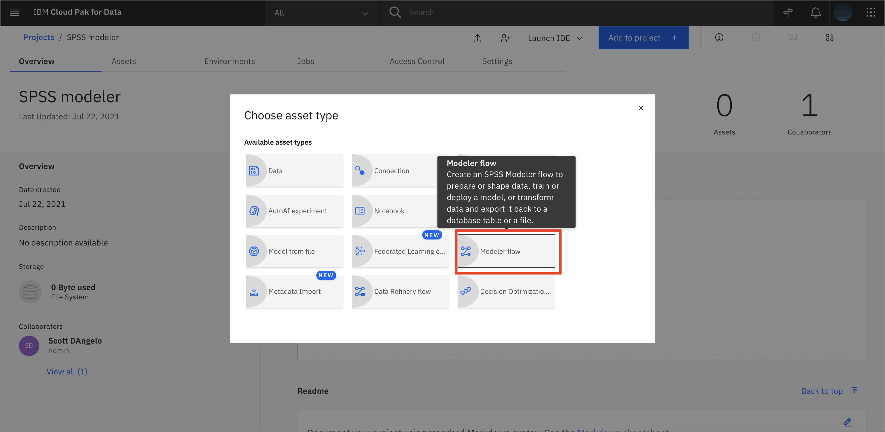
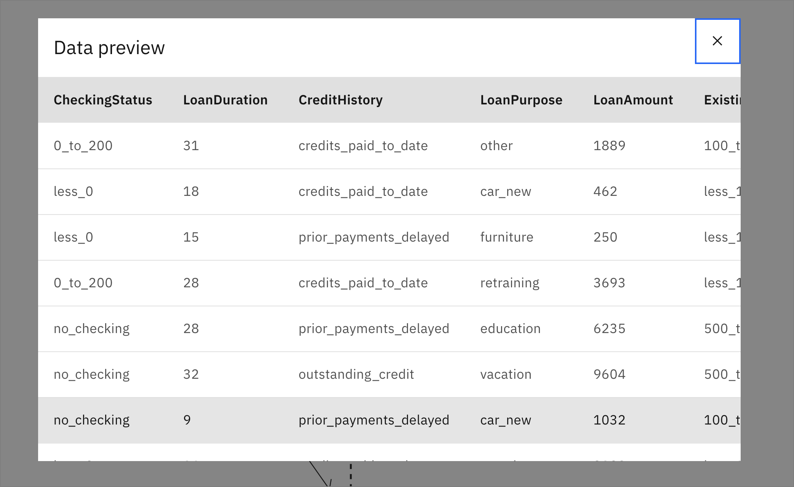

このチュートリアルでは、[IBM Cloud Pak for Data](https://www.ibm.com/jp-ja/products/cloud-pak-for-data)を使って、[IBM SPSS Modeler](https://www.ibm.com/jp-ja/products/spss-modeler)で予測機械学習モデルを構築し、銀行の顧客がローンを滞納するかどうかを判断します。IBM Cloud Pak for Dataは、開発者とデータ・サイエンティストが共同で作業し、データからインサイトを得て、機械学習モデルを構築することができる、インタラクティブでコラボレーティブなクラウドベースの環境です。

## 学習目標

このチュートリアルを終了すると、以下の方法を学ぶことができます。

* [IBM Cloud Pak for Data](https://www.ibm.com/jp-ja/products/cloud-pak-for-data)にデータをアップロードします。
* SPSS Modeler フローを作成する。
* SPSSツールを使用してデータを検査し、インサイトを得る。
* SPSSを使ってAIモデル作成のためにデータを修正し、準備する。
* SPSSで機械学習モデルを学習し、結果を評価する。

## 前提条件

* [IBM Cloud Pak for Data](https://www.ibm.com/jp-ja/products/cloud-pak-for-data)
* [SPSS Modeler Deployed on IBM Cloud Pak for Data](https://www.ibm.com/docs/en/cloud-paks/cp-data/4.0?topic=modeler-installing-spss)

## 想定時間

このチュートリアルの完了には、約 30 分かかります。

## 手順

1. [プロジェクトを作成し、データをアップロードする](#step-1-create a-project and upload the-data)
2.[SPSS Modelerのフローを作成する](#step-2-create-an-spss-modeler-flow)
3.[データのインポート](#step-3-import-the-data)
4.[データの検査](#step-4-inspect-the-data)
5.[データの準備](#step-5-data-preparation)
6.[MLモデルの学習](#step-6-train-the-ml-model)
7.[結果を評価する](#step-7-evaluate-the-results)

### Step 1.プロジェクトの作成とデータのアップロード

このラーニングパスでまだプロジェクトを作成していない場合は、以下の手順でプロジェクトを作成します。そうでない場合は、[SPSS Modelerフローの作成](#step-2-create-an-spss-modeler-flow)にスキップできます。

### IBM Cloud Pak for Data プロジェクトの作成

Cloud Pak for Dataでは、特定の目標を達成するために使用するリソース(問題に対するソリューションを構築するためのリソース)を収集/整理するために、プロジェクトという概念を使用します。プロジェクトのリソースには、データ、共同研究者、ノートブックやモデルなどの分析資産などがあります。

* (☰)ナビゲーションメニューの「プロジェクト」セクションで、「すべてのプロジェクト」をクリックします。

  

* `右上にある **New project`** ボタンをクリックします。

  

* `Analytics project` のラジオボタンを選択して、 **`Next`** ボタンをクリックします。

  

* ****``Create an empty project``を選択します。

  

* `プロジェクトの名前とオプションの説明を入力し、 **Create`** をクリックします。

  

### この実験のデータセットをダウンロードして、プロジェクトに読み込みます。

* [german_credit_data.csv](static/german_credit_data.csv) データセットをダウンロードします。

* **Browse** をクリックし、ダウンロードしたファイルを選択して、データセットを分析プロジェクトにアップロードします。

### Step 2.SPSS Modeler フローの作成

1. プロジェクトのトップページから、**プロジェクトに追加+**をクリックし、**Modeler フロー**を選択します。

    

1. フローに「Credit Risk Flow」のような意味のある名前を付けて、**Create**をクリックします。

    をクリックします。

### ステップ 3.データのインポート

1. 左側のペインで**インポート**を展開し、データアセットのノードをキャンバスにドラッグ＆ドロップします。キャンバス上にドロップしたノードをダブルクリックし、「**データ資産の変更**」をクリックします。

    

1. Assetsページで**Data Assets**タブを開き、先にアップロードしたgerman_credit_data.csvファイルを選択して**Select**をクリックします。

    

1. データのインポートが完了したら、「**Save**」をクリックします。

    

### ステップ 4.データの確認

1. データを洞察するために、**Output**タブを開き、データ監査ノードをキャンバスにドラッグ＆ドロップします。先ほどキャンバスにドラッグ＆ドロップした「データ資産」ノードにカーソルを合わせると、側面に青い円形のアイコンが表示されています。そのアイコンをクリックして、Data Auditノードにドラッグします。これで2つのノードが接続されます。

    

1. Data Auditノードの上にカーソルを置き、3つの縦のドットをクリックして、ノードのメニューを開きます。または、Data Auditノードを右クリックして、**Run**をクリックします。

    

1. 準備ができたら、右の「Outputs」メニューを開いて出力を確認することができます。「目」のアイコンをクリックすると、データ監査（[21フィールド]のデータ監査）が開き、データに関する統計情報を見ることができます。

    ![オープンデータ検査] (images/spss-data-inspection-2.png)

    

1. 右上の **X** をクリックしてウィンドウを閉じます。

### ステップ 5.データの準備

1. [Field Operations] タブを展開し、[Type] ノードをキャンバスにドラッグ＆ドロップします。[Data Asset] ノードと [Type] ノードを接続し、[Type] ノードをダブルクリックして必要な設定を行います。

    

1. 「**Read Values**」をクリックします。読み取り操作が完了したら、各フィールドのメジャーとロールが正しいことを確認します。Risk の役割を `Input` から `Target` に変更して、**Save** をクリックしてタブを閉じます。

    

### ステップ6.MLモデルの学習

1. 「モデリング」タブを展開し、「Random Forest」ノードをキャンバスにドラッグ＆ドロップします。「タイプ」ノードを「ランダムフォレスト」ノードに接続します。ランダムフォレスト・ノードは、自動的に「リスク」という名前に変更されます。

    

1. Random Forestノードを右クリックし、**Run**をクリックします。実行が完了すると、新しい金塊のようなRiskノードがキャンバスに追加されているのがわかります。

    

1. 新しいRiskゴールデンナゲットノードを右クリックし、**Preview**を選択して出力結果を確認します。

    

### ステップ 7.結果を評価する

1. 「出力」タブを展開し、分析ノードをキャンバスにドラッグ＆ドロップします。Risk golden nugget ノードを Analysis ノードに接続します。Analysis ノードを右クリックし、**Run** をクリックします。

    

1. 右側の「Outputs」タブから、「**analysis of [Risk]**」の隣にある「目」のアイコンをクリックして、結果の精度を把握します。

    

    

1. **Return to flow**をクリックすると、元に戻ります。

1. 「グラフ」タブを展開し、「評価」ノードをキャンバスにドラッグ＆ドロップします。Risk golden nugget ノードを Evaluation ノードに接続します。Evaluation ノードは自動的に $R-Risk という名前になります。ノードを右クリックして、**実行**をクリックします。

1. R-Riskの出力（[$R-Risk]の評価：利得）の横にある「目」のアイコンをダブルクリックして、利得のグラフを可視化します。これにより、Predicted Positive Rate（または分類器の支持率）とTrue Positive Rate（または分類器の感度）が表示されます。

    

## まとめ

このチュートリアルでは、IBM Cloud Pak for Data 上の IBM SPSS Modeler で予測機械学習モデルを作成する小さな例を示しました。プロジェクトとモデラー・フローにデータをインポートし、モデリングのためにデータを準備してから、データに適したアルゴリズムを選択し、予測モデルをトレーニングする手順を説明しました。最後のステップでは、トレーニングしたモデルの結果を視覚化して評価する方法を説明しました。