このデータサイエンスと機械学習のチュートリアルでは、分類モデルを作成して実行する方法を、最初から最後まで実例を挙げて説明します。このチュートリアルでは、以下のステップをカバーしています。

* データの探索
* データの前処理
* トレーニングとテストのためのデータの分割
* 分類モデルの準備
* パイプラインを使ってすべてのステップを組み立てる
* モデルのトレーニング
* モデルでの予測の実行
* モデルのパフォーマンスの評価と視覚化

## セットアップ

このチュートリアルには、Python で書かれた Jupyter Notebook が含まれています。このノートブックは、IBM Cloud アカウントで Watson Studio を使用して IBM Cloud 上で実行できます。

1. サインアップまたはログインします。

    * <a href="https://dataplatform.cloud.ibm.com/registration/stepone?cm_sp=ibmdev-_-developer-tutorials-_-cloudreg" target="_blank" rel="noopener noreferrer">Try IBM Cloud Pak for Data</a>のページからIBM Cloudアカウントにログインして、Watson Studioを有効にします。
    * Watson Studio にアクセスするには、<a href="https://dataplatform.cloud.ibm.com?cm_sp=ibmdev-_-developer-tutorials-_-cloudreg" target="_blank" rel="noopener noreferrer">https://dataplatform.cloud.ibm.com</a>からログインします。

1. 空のプロジェクトを作成します。

    * **プロジェクトの作成**または**新規プロジェクト**のいずれかをクリックします。
    * 「空のプロジェクトを作成する」を選択します。
    * プロジェクトに名前を付けます。
    * 既存のObject Storageサービス・インスタンスを選択するか、新しいインスタンスを作成します。
    * **Create**をクリックします。

1. Notebookを追加します。

   * **+Add to project** をクリックします。
   * **Notebook**をクリックします。
   * **From URL** をクリックします。
   * **名前** を入力します。
   * **Select runtime** で **Default Python 3.6 Free** を選択します。
   * **Notebook URL** に `https://raw.githubusercontent.com/IBM/ml-learning-path-assets/master/notebooks/classification_start_to_end_with_scikit_learn.ipynb` と入力します。
   * 「ノートブックを作成する」をクリックします。

1. ノートブックを実行します。

   開いたノートブックで、**実行**をクリックして、セルを1つずつ実行します。このチュートリアルの残りの部分は、ノートブックの順序に従います。

これでノートブックの設定が完了したので、引き続き分類モデルの開発を行います。オンライン取引プラットフォームの顧客に関する情報を含むデータセットを使用して、顧客が解約するかどうかを予測します。

## データ探索

実際に機械学習を始める前には、いくつかのステップがあります。そもそもデータサイエンティストは、予測を実行するために使用するデータの質を分析しなければなりません。データの表現に偏りがあると、歪んだモデルになってしまいます。データを分析する方法はいくつかあります。このチュートリアルでは、最低限のデータ解析を行い、何が行われているかを理解できるようにします。そして、このトピックの中核となるテーマに進みます。

### データセットについて

このチュートリアルでは、あるオンライン取引プラットフォームの顧客に関する情報を含むデータセットを使用して、ある顧客の解約確率が高いか、中程度か、低いかを分類します。これは、分類モデルが最初から最後までどのように構築されるかを学ぶための良い例となります。予測が該当するのは、高、中、低の3つのクラスです。次に、データセットを詳しく見てみましょう。

データは、.csvファイルの形で用意されており、pandasライブラリを使ってインポートします。numpyとmatplotlibを使って、統計を取ったり、データを可視化したりします。

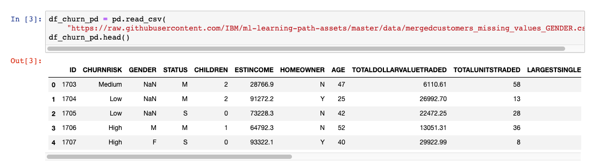

まず、数行のコードを実行して、各列がどのようなデータ型であるか、また、各列のエントリ数を把握します。

性別カラムのカウントの不一致（次の画像を参照）は、データの前処理ステップで処理されます。

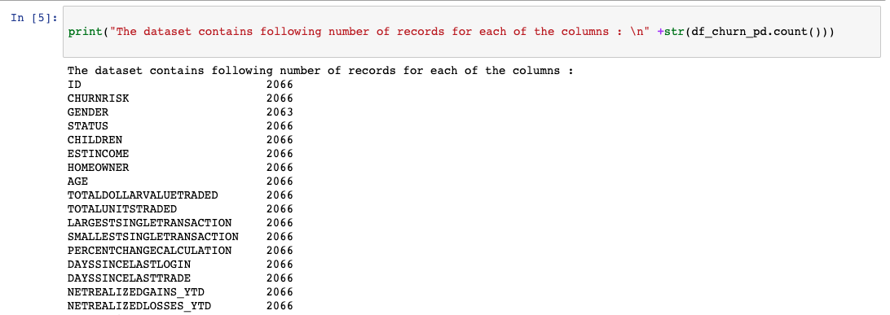

異なる出力クラス間でデータがどのように分割されているかを理解するために、matplotlibを使用して基本的な棒グラフをプロットしました。表現力のあるデータに満足していない場合は、今こそトレーニングやテストに使用するデータを増やすべきです。

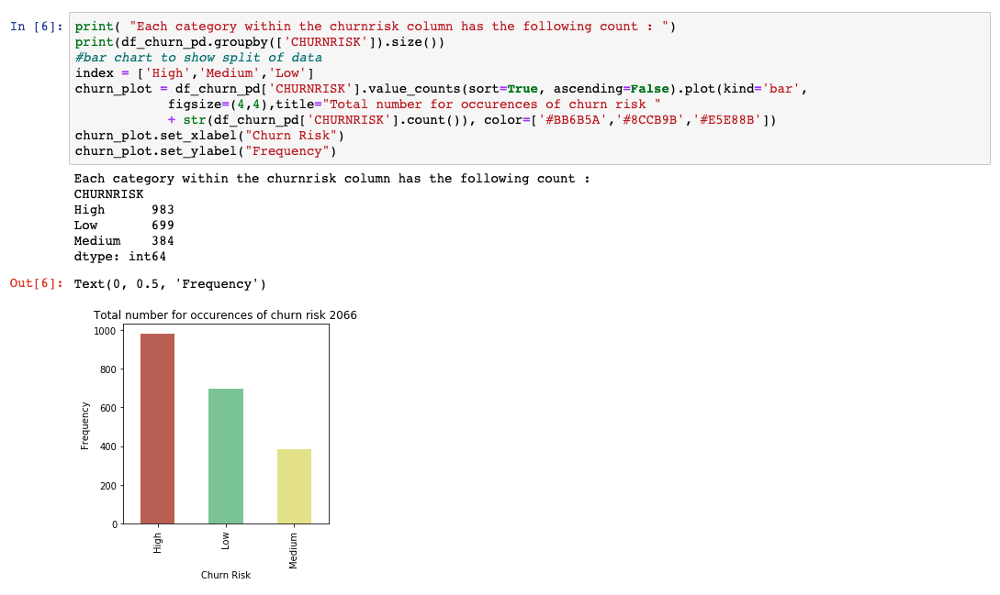

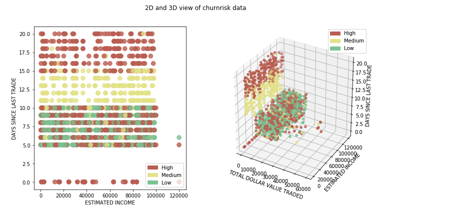

## データの前処理

データの前処理は、機械学習のモデル構築プロセスにおいて重要なステップです。なぜなら、モデルは、学習対象となるデータが良質で準備されている場合にのみ、良いパフォーマンスを発揮できるからです。そのため、モデル構築の際には、このステップに多くの時間が費やされます。

機械学習で行われる一般的なデータの前処理ステップはいくつかありますが、このチュートリアルではそのうちのいくつかを見ていきます。scikit-learnが提供する前処理オプションの完全なリストは、<a href="https://scikit-learn.org/stable/modules/preprocessing.html" target="_blank" rel="noopener noreferrer">scikit-learn data preprocessing</a>のページに掲載されています。

まず、出力を予測する上で何の付加価値もない列を特定することから始めます。これらのカラムの中には簡単に特定できるものもありますが、ほとんどのカラムを特定するためには、通常、その分野の専門家が必要となります。このようなカラムを削除することで、モデルの次元を下げることができます。

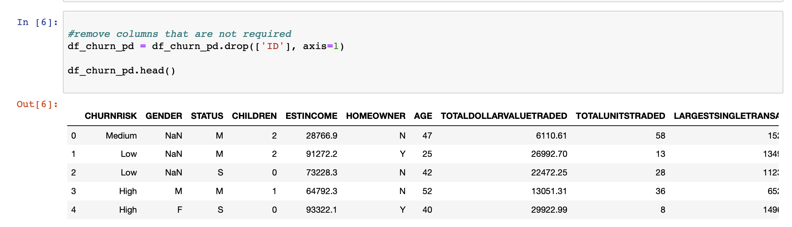

適用される前処理技術は、カラムごとにカスタマイズする必要があります。SklearnはColumnTransformerと呼ばれるライブラリを提供しており、パイプラインを使って選択したカラムにこれらのテクニックを連続して適用することができます。

scikit-learnは、これらの空の値を、そのコンテキストで適用可能なもので埋める方法を提供しています。私たちはSklearnが提供する`SimpleImputer`クラスを使用し、欠損値を列の中で最も頻度の高い値で埋めました。

また、機械学習のアルゴリズムは文字列よりも数値の方が得意なので、カテゴリーがある列を特定して数値に変換したいと思います。ここでは、Sklearnが提供する`OneHotEncoder`クラスを使用します。ワンホットエンコーダーの考え方は、それぞれがカテゴリーを表すバイナリ変数を作ることです。そうすることで、カテゴリーに数字を割り当てるだけで発生する可能性のある順序関係を取り除くことができます。基本的には、複数のクラス番号を含む1つの列から、2進数のクラス番号のみを含む複数の列になります。

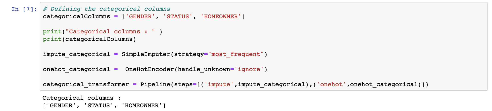

データセットから数値列を特定し、それぞれの列に`StandardScaler`を適用します。これにより、各値はその列の平均値で減算され、その標準偏差で除算されます。

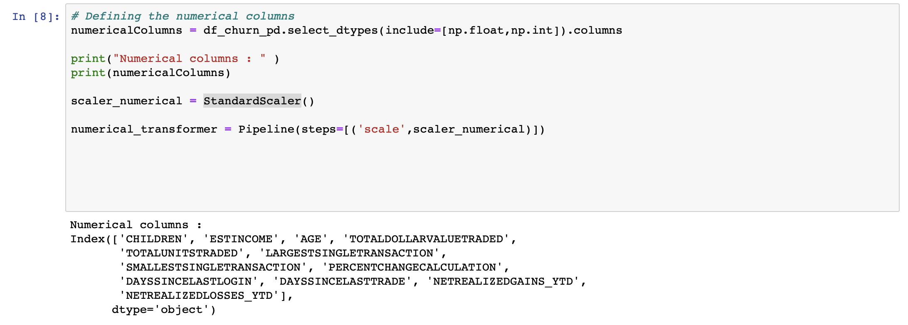

前述したように、各手法は適用する必要のある列でグループ化され、`ColumnTransformer`を使ってキューに入れられます。理想的には、モデルがトレーニングされる直前にこの処理をパイプラインで実行します。しかし、データがどのように見えるかを理解するために、データを一時的な変数に変換しています。

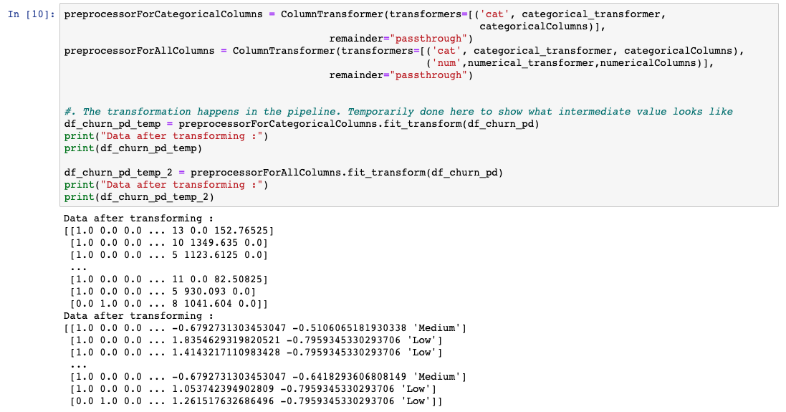

機械学習のアルゴリズムでは、単純なテキストは使えません。データをテキストから数値に変換する必要があります。そのため、クラスとなる文字列には、数字であるラベルを割り当てます。例えば、顧客の解約のデータセットでは、CHURNRISKの出力ラベルは高、中、低に分類され、ラベル0、1、2が割り当てられている。これには、Sklearnが提供する`LabelEncoder`クラスを使用します。

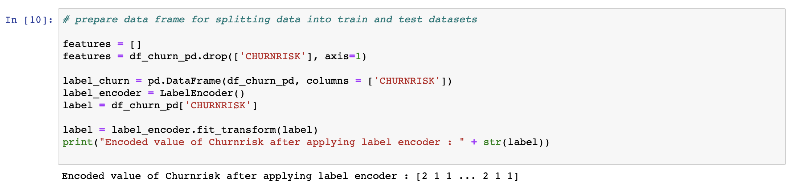

これらは、データセットに適用される一般的な前処理手順の一部です。詳細は以下をご覧ください。
[Data preprocessing in detail](/articles/data-preprocessing-in-detail/)をご覧ください。

## トレーニングとテストのためにデータを分割する

データの前処理が終わったら、次はデータを分割して、モデルの作成・学習と、作成されたモデルのテスト・評価に使用します。データの何パーセントをトレーニングとテストに分けるべきかについては、いくつかの理論があります。このチュートリアルでは、98%のデータをトレーニングに、2%のデータをテストに使用しています。

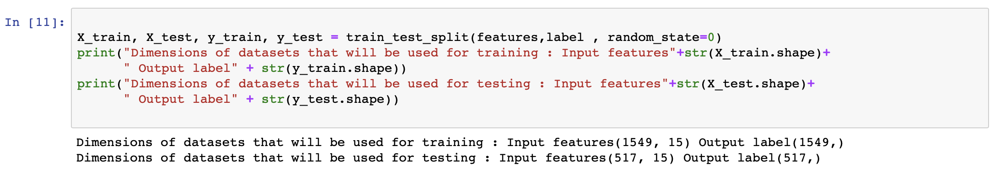

## 分類モデルの準備

人気があり、高い精度で動作することが証明されている分類モデルがいくつかあります。このチュートリアルでは、Sklearnが提供するライブラリを初期化して、ランダムフォレスト分類器を適用しました。このラーニングパスの一環として、[Learn classification algorithms using Python and scikit-learn](/tutorials/learn-classification-algorithms-using-python-and-scikit-learn/)では、様々な分類モデルの詳細な説明と比較を行いました。今のところ、ランダムフォレストがどのように機能するかの詳細は省略して、最初の機械学習モデルの作成を続けます。

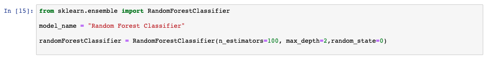

## パイプラインを使ってステップを組み立てる

この学習パスでは、パイプラインを使用します。パイプラインとは、機械学習の流れの中でデータ処理を設計するための便利な方法です。パイプラインを使用する考え方は、[Learn classification algorithms using Python and scikit-learn](/tutorials/learn-classification-algorithms-using-python-and-scikit-learn/)で詳しく説明されています。以下のコード例では、sklearnを使ってパイプラインを設定しています。

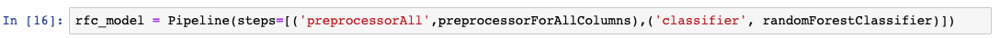

## モデルの学習

モデルを作成する最後のステップはモデリングと呼ばれ、基本的に機械学習アルゴリズムをトレーニングします。データを分割するステップで分割された98%のデータは、前のステップで初期化されたモデルのトレーニングに使用されます。

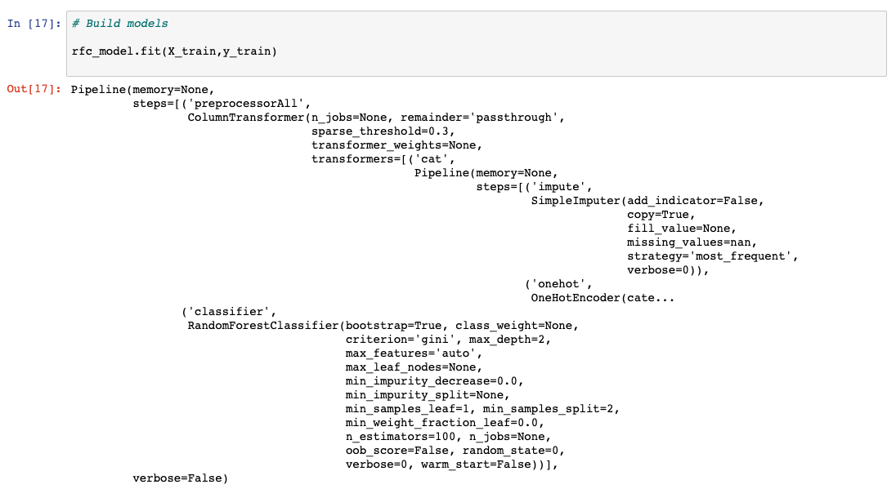

## モデルで予測を実行する

モデルの学習が終わると、分析の準備が整います。このステップでは、モデルのテスト用に確保された2%のデータを使って、予測を実行します。次の画像のように、出力のない目隠しされたデータが渡されます。予測された出力は、実際の結果に対する評価のために集められ、次のステップではそれを行います。

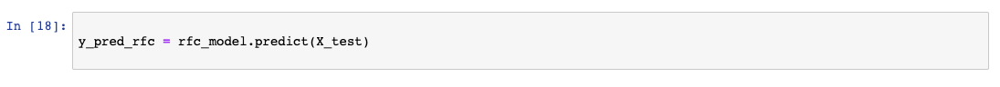

## モデル性能の評価と可視化

前のステップで取得した予測結果を、実際の結果がどうなるべきだったかで比較します。モデルの性能を計算するために、いくつかの評価指標が生成されます。

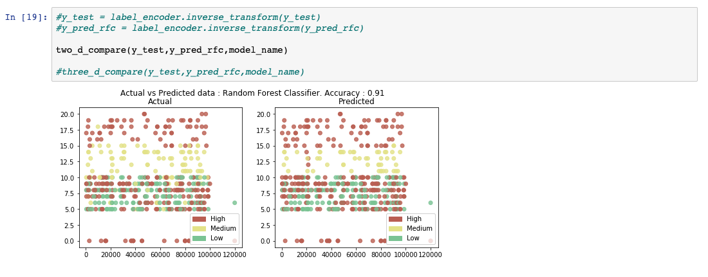
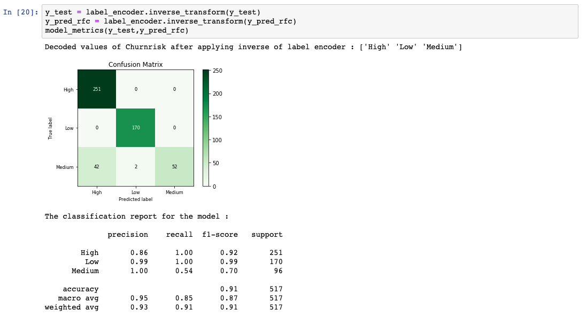

## まとめ

評価で満足のいくスコアが得られるまで、データの前処理から評価のステップを繰り返し、ハイパーパラメータと呼ばれるものを調整していきます。

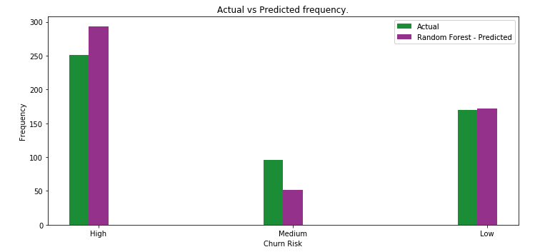

このチュートリアルでは、基本的な機械学習の分類モデルを最初から最後まで開発する方法を実際に体験していただきました。