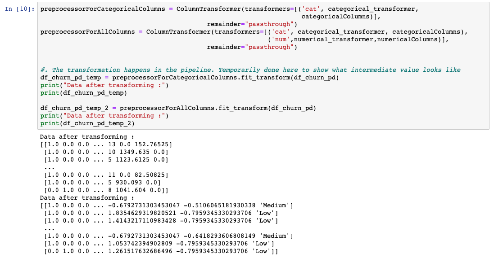
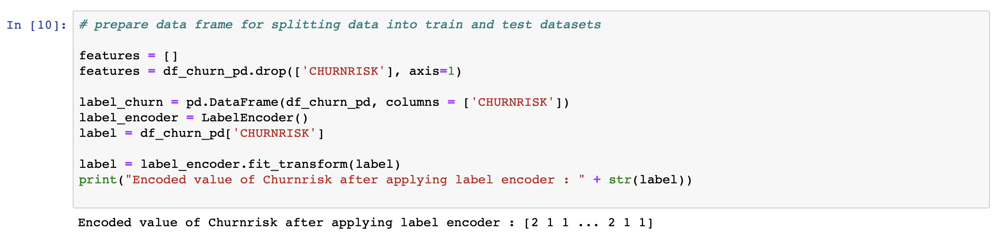
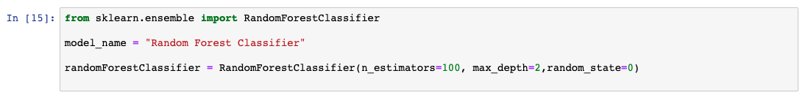
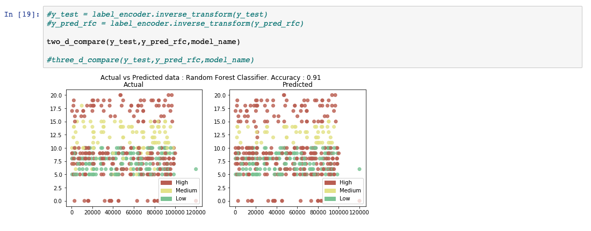
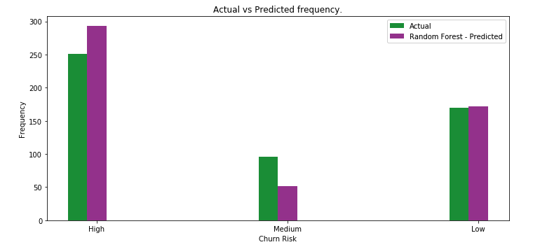

In this data science and machine learning tutorial, get a hands-on example on how to create and run a classification model from start to finish. The tutorial covers the following steps:

* Data exploration
* Data preprocessing
* Splitting data for training and testing
* Preparing a classification model
* Assembling all of the steps using pipeline
* Training the model
* Running predictions on the model
* Evaluating and visualizing model performance

## Set up

This tutorial includes a Jupyter Notebook written in Python. You can run the Notebook on IBM Cloud using Watson Studio with an IBM Cloud account.

1. Sign up or log in.

    * Activate Watson Studio by logging in to your IBM Cloud account from the <a href="https://dataplatform.cloud.ibm.com/registration/stepone?cm_sp=ibmdev-_-developer-tutorials-_-cloudreg" target="_blank" rel="noopener noreferrer">Try IBM Cloud Pak for Data</a> page.
    * Access Watson Studio, by logging in at <a href="https://dataplatform.cloud.ibm.com?cm_sp=ibmdev-_-developer-tutorials-_-cloudreg" target="_blank" rel="noopener noreferrer">https://dataplatform.cloud.ibm.com</a>.

1. Create an empty project.

    * Click either **Create a project** or **New project**.
    * Select **Create an empty project**.
    * Give the project a name.
    * Choose an existing Object Storage service instance or create a new one.
    * Click **Create**.

1. Add the Notebook.

   * Click **+Add to project**.
   * Click **Notebook**.
   * Click **From URL**.
   * Provide a **Name**.
   * Under **Select runtime**, choose **Default Python 3.6 Free**.
   * Enter `https://raw.githubusercontent.com/IBM/ml-learning-path-assets/master/notebooks/classification_start_to_end_with_scikit_learn.ipynb` as the **Notebook URL**.
   * Click **Create Notebook**.

1. Run the Notebook.

   In the open Notebook, click **Run** to run the cells one at a time. The rest of the tutorial follows the order of the Notebook.

Now that you've set up your Notebook, let's continue with developing the classification model, using a data set that contains information about customers of an online trading platform to predict whether the customer will churn.

## Data exploration

There are a few steps that you must do before the actual machine learning starts. To begin with, a data scientist must analyze the quality of the data that will be used to run predictions. Biased representation of data results in a skewed model. There are several ways to analyze the data. In this tutorial, we do minimal data exploration, just enough to give an idea of what is done. We then move on to the core subject of this topic.

### About the data set

In this tutorial, we use a data set that contains information about customers of an online trading platform to classify whether a given customer's probability of churn will be high, medium, or low. This provides a good example to learn how a classification model is built from start to end. The three classes that prediction will fall under are high, medium, and low. Now, let's look closer at the data set.

Data is available to us in the form of a .csv file and is imported using the pandas library. We use numpy and matplotlib to get some statistics and visualize data.

We first run a few lines of code to understand what data type each column is and also the number of entries in each of these columns.

The count mismatch in the gender column (see the following image) is handled in the data preprocessing step.

We have plotted a basic bar chart using matplotlib to understand how data is split between the different output classes. If we are not satisfied with the representational data, now is the time to get more data to be used for training and testing.

## Data preprocessing

Data preprocessing is an important step in the machine learning model building process because the model can perform well only when the data it is trained on is good and well prepared. Therefore, when building models this step consumes a large amount of time.

There are several common data preprocessing steps that are performed in machine learning, and in this tutorial, we look at a few of them. A complete list of preprocessing options provided by scikit-learn can be found on the <a href="https://scikit-learn.org/stable/modules/preprocessing.html" target="_blank" rel="noopener noreferrer">scikit-learn data preprocessing</a> page.

We begin by identifying columns that will not add any value toward predicting the outputs. While some of these columns are easily identified, a subject matter expert is usually engaged to identify most of them. Removing such columns helps in reducing dimensionality of the model.

The preprocessing techniques that are applied must be customized for each of the columns. Sklearn provides a library called the ColumnTransformer, which allows a sequence of these techniques to be applied to selective columns using a pipeline.

A common problem while dealing with data sets is that values will be missing. scikit-learn provides a method to fill these empty values with something that would be applicable in its context. We used the `SimpleImputer` class that is provided by Sklearn and filled the missing values with the most frequent value in the column.

Also, because machine learning algorithms perform better with numbers than with strings, we want to identify columns that have categories and convert them into numbers. We use the `OneHotEncoder` class provided by Sklearn. The idea of one hot encoder is to create binary variables that each represent a category. By doing this, we remove any ordinal relationship that might occur by just assigning numbers to categories. Basically, we go from a single column that contains multiple class numbers to multiple columns that contain only binary class numbers.

The numerical columns from the data set are identified, and `StandardScaler` is applied to each of the columns. This way, each value is subtracted with the mean of its column and divided by its standard deviation.

As discussed previously, each of the techniques are grouped by the columns they needed to be applied on and are queued using the `ColumnTransformer`. Ideally, this is run in the pipeline just before the model is trained. However, to understand what the data will look like, we have transformed the data into a temporary variable.

  

Machine learning algorithms cannot use simple text. We must convert the data from text to a number. Therefore, for each string that is a class we assign a label that is a number. For example, in the customer churn data set, the CHURNRISK output label is classified as high, medium, or low and is assigned labels 0, 1, or 2. We use the `LabelEncoder` class provided by Sklearn for this.

  

These are some of the popular preprocessing steps that are applied on the data sets. You can get more information in
[Data preprocessing in detail](/articles/data-preprocessing-in-detail/).

## Splitting data for training and testing

After the data has been preprocessed, the next step is to split the data into parts to be used to create and train the model and for testing and evaluating the model that is produced. There are several theories behind what percentage of data should be split between training and testing. In this tutorial, we are using 98% of the data for training and 2% of the data for testing.

## Preparing a classification model

There are several classification models that are popular and have been proven to perform with high accuracy. In this tutorial, we applied the random forest classifier by initializing the library provided by Sklearn. As part this learning path, we did a detailed description and comparison of the various classification models in [Learn classification algorithms using Python and scikit-learn](/tutorials/learn-classification-algorithms-using-python-and-scikit-learn/). For now, we'll skip the details of how the random forest works and continue with creating our first machine learning model.

## Assembling the steps using pipeline

In this learning path, we use pipelines. Pipelines are a convenient way of designing your data processing in a machine learning flow. The idea behind using pipelines is explained in detail in [Learn classification algorithms using Python and scikit-learn](/tutorials/learn-classification-algorithms-using-python-and-scikit-learn/). The following code example shows how pipelines are set up using sklearn.

## Training the model

The final step in creating the model is called modeling, where you basically train your machine learning algorithm. The 98% of data that was split in the splitting data step is used to train the model that was initialized in the previous step.

## Running predictions on the model

After the model is trained, it is ready for some analysis. In this step, the 2% of data that was reserved for testing the model is used to run predictions. The data is blindfolded without any outputs and is passed on as shown in the following image. The predicted output is collected for evaluation against the actual results, and that is what we are doing in the next step.

## Evaluating and visualizing model performance

The prediction results acquired in the previous step are compared using what the actual results should have been. Several evaluation metrics are generated to calculate the performance of the model.

## Summary

Until evaluation provides satisfactory scores, you would repeat the data preprocessing through evaluating steps by tuning what are called the hyperparameters.

In this tutorial, you got a hands-on example of how to develop a basic machine learning classification model from start to finish.