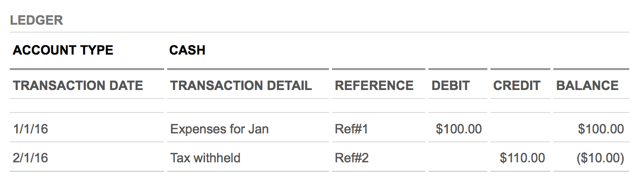

ブロックチェーンの分散型台帳技術は、組織がビジネス取引を行う方法に革命をもたらしています。このチュートリアルでは、ブロックチェーン・ネットワークがどのように動作するのか、どのように活用できるのか、また、IBMや他の企業がどのように協力して、さまざまな業界でこの技術を推進しているのかを紹介します。まず、少し背景を説明します。

## 分散型台帳

**分散型台帳_**は、分散型ネットワークのメンバー間で共有、複製、同期されるデータベースの一種です。分散型台帳は、ネットワークの参加者の間で行われた資産やデータの交換などの取引を記録する。

ネットワークの参加者は、台帳の記録の更新を管理し、コンセンサスによって合意する。金融機関やクリアリングハウスなどの中央機関や第三者の仲介者は関与しない。分散型台帳のすべての記録には、タイムスタンプと固有の暗号化された署名があるため、台帳はネットワーク上のすべての取引の監査可能で不変の履歴となる。

### 業務用台帳の役割

現在、世界はつながり、統合されており、経済活動は、国や地理的、司法権の境界を越えたビジネスネットワークで行われています。ビジネスネットワークは通常、生産者、消費者、供給者、パートナー、マーケットメーカー/イネーブラー、その他の利害関係者などの**参加者**が、**資産**と呼ばれる価値のある対象物を所有し、制御し、その権利、特権、資格を行使する市場に集まります。

資産には、自動車、家、イチゴなどの有形・物理的なものと、証書、特許、株券などの無形・仮想的なものがあります。資産の所有と譲渡は、ビジネスネットワークの中で価値を生み出す「取引」です。

取引には、買い手、売り手、仲介者（銀行、監査人、公証人など）といったさまざまな参加者が関与し、そのビジネス上の合意や契約は***台帳***に記録されます。企業は通常、複数の台帳を使用して、さまざまなビジネスラインの参加者間の資産所有や資産移転を記録します。元帳は、企業の経済活動や利益を記録するシステムである。

典型的な台帳は次のようなものです。

 <figure> </img></figure>

### 現在の業務用台帳の問題点

現在使用されている業務用台帳は、多くの点で欠陥があります。効率が悪く、コストがかかり、悪用されたり改ざんされたりする可能性があります。透明性に欠け、汚職や不正の影響を受けやすく、紛争の原因となります。紛争を解決し、場合によっては取引を取り消したり、取引に保険をかけたりしなければならず、コストがかかります。これらのリスクと不確実性は、ビジネスチャンスを逃す原因となります。

さらに、各ネットワーク参加者のシステム上でビジネス元帳のコピーが同期されていないと、一時的な不正確なデータに基づいて誤ったビジネス判断が下されることになります。せいぜい、異なる元帳のコピーを照合する間、十分な情報に基づいた意思決定を行うことができません。

##  ブロックチェーンとは

 <sidebar> 
さて、あなたは「ブロックチェーン」を誰かに説明できますか？ </strong>
 
躊躇した方、それはあなただけではありません。<a href="https://developer.ibm.com/learningpaths/get-started-blockchain/" target="new">Get started with blockchain</a>のラーニングパスでは、ブロックチェーンについて詳しく説明しています。これを読めば、家族や近所の人、同僚に自分の新しい流暢さを披露する準備が整います！
</sidebar>

</idebar> ブロックチェーンとは、パブリックまたはプライベートなピアツーピアネットワークでの取引を記録する、改ざん不可能な共有デジタル台帳のことです。ネットワーク内のすべてのメンバーノードに配布されたこの台帳は、暗号ハッシュでリンクされた_**blocks**_の連続したチェーンに、ネットワーク内のピア間で行われた資産交換の履歴を永続的に記録します。

確認されたすべてのトランザクションブロックは、チェーンの先頭から最新のブロックまでリンクされ、チェーン化されていることから、_**blockchain**_と呼ばれています。このように、ブロックチェーンは単一の真実の情報源として機能し、ブロックチェーンネットワークのメンバーは、自分に関連のある取引のみを見ることができます。

##  ブロックチェーンネットワークの仕組み

ブロックチェーンネットワークのメンバーであるノードは、金融機関などの第三者に取引を仲介してもらうのではなく、コンセンサスプロトコルを用いて台帳の内容に合意し、暗号ハッシュやデジタル署名を用いて取引の整合性を確保しています。

**コンセンサス**_は、共有された台帳が正確なコピーであることを保証し、改ざんが多くの場所で正確に同時に発生しなければならないため、不正取引のリスクを低減します。SHA256計算アルゴリズムのような**_暗号化ハッシュ**_は、取引の入力に変更があった場合、たとえごくわずかな変更であっても、異なるハッシュ値が計算されることになり、これは取引の入力が危険にさらされている可能性を示すことになります。**デジタル署名_**は、トランザクションが偽者ではなく送信者（秘密鍵で署名されている）から発信されたものであることを保証します。

分散型のピアツーピア・ブロックチェーン・ネットワークは、単一の参加者や参加者グループが基盤となるインフラをコントロールしたり、システム全体を弱体化させたりすることを防ぎます。ネットワークの参加者はすべて平等で、同じプロトコルに従っています。参加者は、個人、国家機関、組織、またはこれらすべてのタイプの参加者の組み合わせです。

システムの中核となるのは、選択されたコンセンサスモデルを用いて、すべてのノードが取引の有効性に同意した取引の時系列を記録することです。その結果、ネットワーク内のすべてのメンバーが後続の取引で変更に同意しない限り、取引を変更したり取り消したりすることはできません。

##  ブロックチェーンのビジネス上の利点

従来のビジネスネットワークでは、すべての参加者がそれぞれの台帳を管理しており、重複や不一致があるため、紛争が発生したり、決済時間が長くなったり、仲介者が必要となり、それに伴うオーバーヘッドコストが発生したりしていました。しかし、ブロックチェーンベースの共有台帳を使用することで、一度コンセンサスによって検証され、台帳に書き込まれた取引は変更できないため、ビジネスは**時間とコストを削減し、リスクを軽減することができます**。

ブロックチェーンのコンセンサスメカニズムは、エラーを減らした統合された一貫性のあるデータセット、ほぼリアルタイムの参照データ、参加者が所有する資産の記述を変更できる柔軟性といったメリットをもたらします。

ブロックチェーン技術は、共有台帳に含まれる情報の出所を参加メンバーの誰もが所有しないため、参加メンバー間の取引情報の流れにおける信頼性と整合性の向上につながります。

ブロックチェーン技術の不変性メカニズムは、透明性の向上により、監査や規制遵守のためのコスト削減につながります。また、ブロックチェーン技術を用いたビジネスネットワーク上で実行される契約は自動化されており、最終的なものであるため、ビジネスは実行速度の向上、コストの削減、リスクの低減といった恩恵を受けることができ、**顧客と対話するための新たな収益源を構築することができます**。

## ブロックチェーンアプリケーション

ブロックチェーンは、[ビットコイン取引所を支える技術](https://www.ibm.com/blogs/blockchain/2017/05/the-difference-between-bitcoin-and-blockchain-for-business/)として初めて市場に紹介されましたが、ビジネスの世界での実用的な用途は、暗号通貨の取引にとどまらずに広がっています。例えば、金融分野では、ブロックチェーンネットワークによって、証券取引を数日ではなく数分で決済することができます。サプライチェーンでは、ブロックチェーンネットワークによって、商品の流れや支払いをリアルタイムで追跡し、記録することができます。

自分のユースケースがブロックチェーンに適しているかどうかを判断するには、次のような質問を自問してみてください。

1. 1.ビジネスネットワークが関係しているか？
2.2. トランザクションの検証にコンセンサスが使われているか？
3.3.監査証跡、つまり証明が必要ですか？
4.4. トランザクションの記録は不変でなければならないか、または、改ざんができないようにしなければならないか。
5.5. 紛争解決は最終的なものでなければならないか？

もしあなたが最初の質問に「はい」と答え、他にも少なくとも1つの質問に答えたのであれば、あなたのユースケースはブロックチェーン技術の恩恵を受けていることになります。ブロックチェーンが正しいソリューションであるためには、必ずネットワークが必要ですが、そのネットワークには様々な形態があります。ネットワークは、サプライチェーンのような組織間のものもあれば、組織内のものもあります。組織内では、ブロックチェーンネットワークを利用して、部門間でリファレンスデータを共有したり、監査やコンプライアンスのネットワークを構築したりすることができます。また、個人の間でも、データ、デジタル資産、契約書などをブロックチェーン上に保存する必要がある場合には、ネットワークを利用することができます。

銀行や金融市場、サプライチェーン、ヘルスケア、輸送などの多様な組織が、新しいビジネスモデルをサポートするためにブロックチェーンをどのように採用しているかについては、[業界事例](https://www.ibm.com/blockchain/industries/)を参照してください。

## Hyperledgerとは

[Hyperledger](https://www.hyperledger.org/)は、業界を超えたブロックチェーン技術をビジネスに活用するためのオープンソースの取り組みです。The Linux Foundation&reg;が主催し、金融、銀行、モノのインターネット、サプライチェーン、製造、テクノロジーなどのリーダーが参加するグローバルなコラボレーションです。この183人以上の多様なメンバーと、Hyperledger Fabricを含む9つの進行中のプロジェクトが協調して、オープンで標準化されたエンタープライズグレードの分散型台帳フレームワークとコードベースを作成しています。

[Hyperledger Fabric](https://www.hyperledger.org/projects/fabric)フレームワークは、幅広い産業分野において、メンバー同士がお互いを知っている許可制ネットワーク上の分散型台帳ソリューションをサポートします。そのモジュラー・アーキテクチャは、ブロックチェーン・ソリューションの機密性、回復力、柔軟性を最大限に高めます。

IBM Blockchain Platformは、Hyperledger Fabricフレームワーク上で動作します。[Hyperledger Fabric](https://www.hyperledger.org/projects/fabric)と[IBM Blockchain Platform](https://www.ibm.com/blockchain/platform)の詳細はこちら。

### エンタープライズ・ブロックチェーンの要件

私たちは、ブロックチェーンがビジネスネットワークを変革する真の破壊的技術であると考えています。また、このようなイノベーションは、他のテクノロジー企業や業界と協力して、オープンに行われるべきだと考えています。この目的のために、IBMはいくつかの活発なHyperledgerプロジェクトにコードを提供し続けています。

IBMの視点では、産業グレードのブロックチェーン技術は、以下のような特徴を持っています。

* **共有され、許可された台帳**は、唯一の記録システム（SOR）であり、単一の真実の情報源です。ビジネスネットワークチャネルの認証されたメンバーが見ることができます。
* ビジネスネットワークに参加している全てのメンバーが合意する**コンセンサスプロトコル**により、ネットワークで検証された取引のみが元帳を更新することができます。
* 暗号技術により、取引の改ざん防止、認証、完全性を確保します。
* **Chaincode**（スマートコントラクトとも呼ばれる）は、ネットワーク上で行われるビジネスのための参加者の合意条件をカプセル化したもので、Chaincodeはブロックチェーン内の有効なピアノードに保存されます。

これらの属性に加えて、エンタープライズ・ブロックチェーン技術は、パフォーマンス、検証された識別情報、プライベートで機密性の高いトランザクションなど、業界の主要な要件を満たす必要があります。Hyperledger Fabricは、これらのニーズを満たすように設計されています。また、プラガブルなコンセンサスモデルを採用しており、企業のネットワークに最適なアルゴリズムを選択することができます。

##  ブロックチェーンを始めよう

IBMは、企業向けに構築された安全なオープンソースのブロックチェーン・ソリューションのリーダーです。Linux FoundationのHyperledger Projectの初期メンバーとして、IBMはオープンに管理されたブロックチェーンの開発支援に尽力しています。IBMは、金融サービス、サプライチェーン、IoT、リスク管理、デジタル著作権管理、ヘルスケアなど、400社以上のお客様と協力して、IBM Cloud経由で提供されるブロックチェーン・アプリケーションを導入してきました。

IBMは、エンタープライズ・ブロックチェーン・ネットワークの開発、統治、運用を支援する柔軟なプラットフォームと安全なインフラを提供しています。複数の組織で構成される40以上のアクティブなネットワークが、IBMブロックチェーン・プラットフォームを使用して、日々資産を交換し、食品の安全性から取引の効率化、デジタル・ペイメントまでのビジネス・プロセスを改善しています。[IBMブロックチェーン・ソリューション](https://www.ibm.com/blockchain/solutions)について学び、どのようにして今日から[ブロックチェーンをビジネスに使い始める](https://www.ibm.com/blockchain/getting-started)ことができるかをご覧ください。

あなたが開発者であれば、実際のビジネス・ブロックチェーンの使い方を学び、ブロックチェーン・スキルとアプリケーションの開発を今すぐ始めるための最も簡単で経済的な方法は、[Visual Studio (VS) Code extension](https://www.ibm.com/blockchain/getting-started)をインストールすることです。VC Codeエクステンションを使用すると、スマートコントラクトの作成、テスト、デバッグ、Hyperledger Fabric環境への接続、ブロックチェーンネットワーク上で取引を行うアプリケーションの構築が可能になります。

## 結論

ブロックチェーン技術は、ビジネスを取引するための根本的に新しい方法を表しています。物理的、仮想的、有形、無形の資産を登録、交換するための堅牢でスマートな次世代のアプリケーションの先駆けとなります。ブロックチェーン技術は、暗号化されたセキュリティ、分散化されたコンセンサス、共有された公開台帳（適切に制御され、許可された可視性を持つ）という重要なコンセプトのおかげで、私たちが経済、社会、政治、科学活動を組織する方法を大きく変えることができます。   

## 次のステップ

この分散型台帳の紹介の最後に、ブロックチェーンの旅を続けるための素晴らしい方法をいくつか紹介します。

* [**Blockchain hub on IBM Developer**](/technologies/blockchain/)に立ち寄ってください。[IBM Developer**](/technologies/blockchain/)の[**Blockchain hub]に立ち寄ってみてください。ここでは、ビジネス向けのブロックチェーン・ソリューションを開発・展開するための無料のツールやチュートリアル、コードやコミュニティのサポートを提供しています。   
* IBM Blockchainを使って仕事を始めましょう。私たちの[**IBM Blockchain 101**](/tutorials/cl-ibm-blockchain-101-quick-start-guide-for-developers-blueemix-trs/)チュートリアルでは、キックスターター・ブロックチェーン・ネットワークを構築し、IBMの次世代ブロックチェーン・プラットフォームでコーディングを開始する方法を紹介しています。   
* 4部構成の[**IBM Blockchain Platform Console Video Series**](/series/ibm-blockchain-platform-console-video-series/)では、IBM Blockchain Platformでビジネスネットワークを構築する方法を詳しく紹介しています。   
* これは、複雑な問題を解決するためのロードマップで、概要、アーキテクチャ図、プロセスフロー、リポジトリへのポインタ、追加の読み物などが含まれます。   
* IBM Developer Blockchainニュースレターの[**past issues**](/newsletters/blockchain/)をチェックしてください。