---
also_found_in:
- learningpaths/dataops-fundamentals/
authors: ''
completed_date: '2021-10-19'
components:
- cloud-pak-for-data
draft: false
excerpt: IBM Cloud Pak for DataのData Virtualizationを使って、ビジネス用語を使って企業データを仮想化します。
meta_description: IBM Cloud Pak for DataのData Virtualizationを使って、ビジネス用語を使って企業データを仮想化します。
meta_keywords: IBM Cloud Pak for Data, Data Virtualization, data, databases
meta_title: データの仮想化により、お客様のデータを一元管理する
primary_tag: analytics
subtitle: ビジネス用語を使ってデータを仮想化し、データの管理と保護を徹底する
tags:
- data-management
title: データの仮想化により、お客様のデータを一元管理する
---

企業のデータは、データマート、データウェアハウス、データレイクなど、さまざまなデータストアに分散していることが多い。企業は、これらのサイロを解消するために、すべてのデータを中央のストアにコピーして分析しようとします。しかし、このようなデータの重複は、データの陳腐化や、中央データストアの管理コストの増加などの問題を引き起こします。

*データ仮想化*は、データのコピーや複製を行わずに、複数のデータソースにクエリを実行する機能を提供し、コストを削減するデータ管理手法です。また、データがどこにあるか、どのようにフォーマットされているかにかかわらず、単一の顧客ビューを生成するために使用することができます。

このチュートリアルでは、IBM Cloud Pak for DataのData Virtualizationを使用して、管理・保護されている企業データを仮想化し、仮想データを結合してデータのシングル・カスタマー・ビューを作成する方法を学びます。

## 学習目標

このチュートリアルでは

* データ仮想化のためのデータソースを追加する
* ビジネス用語でデータを仮想化する
* 結合された仮想ビューを作成する
* ガバナンス用語とデータクラスを仮想ビューの列に割り当てます。
* 仮想ビューへのアクセス権限をユーザーに与える
* 仮想ビューにアクセスし、分析プロジェクトに追加するために、さまざまなユーザーとしてログインします。

## 前提条件

* [IBM Cloud Pak for Data v4.0](https://www.ibm.com/jp-ja/products/cloud-pak-for-data)
* [Watson Knowledge Catalog on IBM Cloud Pak for Data](https://www.ibm.com/docs/en/cloud-paks/cp-data/latest?topic=services-watson-knowledge-catalog)
* [Data Virtualization on IBM Cloud Pak for Data](https://www.ibm.com/docs/en/cloud-paks/cp-data/latest?topic=services-data-virtualization)を参照してください。
* [Protect your data using data privacy features](https://developer.ibm.com/tutorials/protect-your-data-using-data-privacy-features)の手順が完了している必要があります。

## 見積もり時間

このチュートリアルを完了するには、約45～60分かかります。

## Step 1.IBM Cloud Pak for Dataでデータ仮想化をプロビジョニングする

まず、IBM Cloud Pak for Data インスタンスに Data Virtualization をプロビジョニングします。

### IBM Cloud Pak for Data にログインします。

1. IBM Cloud Pak for Data インスタンスに **admin** ユーザーでログインします。
  
    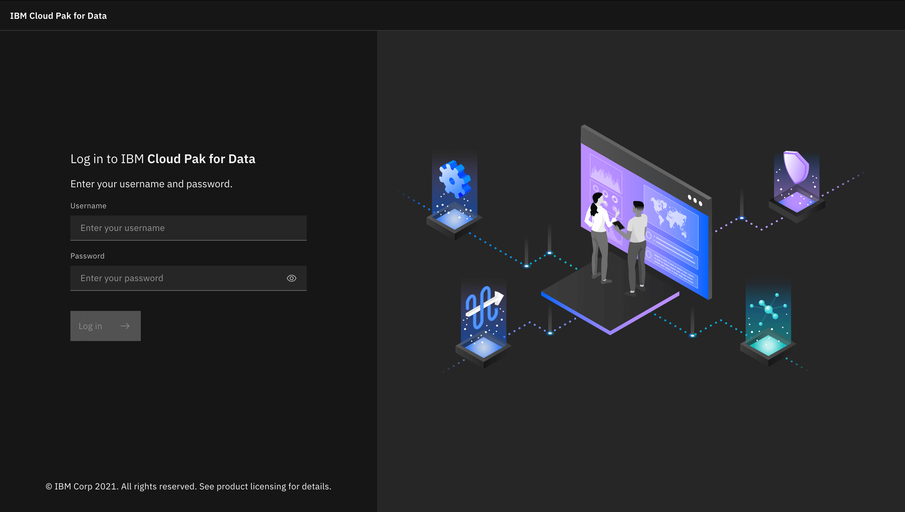

### IBM Cloud Pak for Data でデータ仮想化をプロビジョニングする

1. **ハンバーガー(☰)**メニューで、**サービス**を展開し、**サービスカタログ**をクリックします。

    

1. 左側の「**Data sources**」カテゴリを選択し、「**Data Virtualization**」のタイルをクリックします。
   
    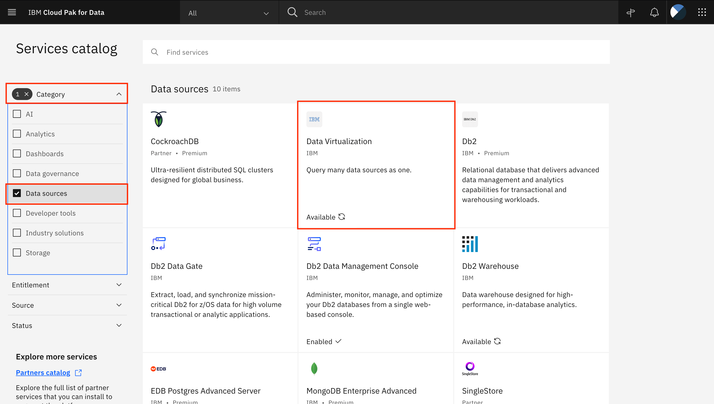

1. 1. **Provision instance** をクリックします。
   
    

1. 指示に従って、データ仮想化インスタンスのプロビジョニングを行います。

**注意**。Managed OpenShiftを使用してデプロイする場合は、以下の作業を行う必要があります。

1. **Updated the kernel semaphore parameter**チェックボックスをチェックするかどうかを決定します。
1. 1. ストレージのデフォルトを *NOT* します。Portworxストレージを使用する場合は、ストレージクラスとして**portworx-db2-rwx-sc**を選択してください。それ以外の場合は、ストレージクラスとして **ibmc-file-gold-gid** を選択してください。

## Step 2.データ仮想化に新しいデータソース接続を追加する

IBM Db2 on Cloud サービス・インスタンスは、[Learn to discover data that resides in your data sources](/tutorials/learn-to-discover-data-that-resides-in-your-data-sources) チュートリアルの一環として、IBM Cloud Pak for Data に Platform 接続として追加しました。次に、データ仮想化で同じデータソースを接続として追加します。

**注意**。データ・ソースがリモート・データ・センター（IBM Cloud Pak for Data インスタンスと同じデータ・センターではない）にある場合は、リモート・コネクターを使用してデータ・ソース接続のパフォーマンスを向上させることができます。[Improve performance for your data virtualization data sources with remote connector](/tutorials/improve-performance-for-your-database-connections-with-remote-connectors/)のチュートリアルの指示に従って、データソースのリモート・コネクターを設定します。

1. ハンバーガーメニューの**Data**を開き、**Data virtualization**をクリックします。
  
    

1. 「データの仮想化」メニューを開きます。メニュー内の**Virtualization**を展開し、**Data sources**をクリックします。
   
    

1. 「Add connection +**」をクリックして、「Existing connection**」をクリックします。
   
    をクリックします。

1. 接続のリストからDb2の接続を選択し、**Add**をクリックします。
   
    をクリックします。
    
    **注意**。[Learn to discover data that resides in your data-sources](/tutorials/learn-to-discover-data-that-resides-in-your-data-sources)のチュートリアルでデータの検出に使用したのと同じDb2接続を選択することを忘れないでください。
    
1. **Skip**をクリックします。
   
    

1. データ接続がデータ仮想化のデータソースとして追加され、**データソース**画面にデータ接続が表示されます。
   
    

## Step 3.データ仮想化による仮想テーブルとビューの作成

データソースがデータ仮想化で利用できるようになったので、データソース内のデータテーブルを仮想化することができます。テーブルが仮想化された後、仮想テーブルを結合して仮想ビューを作成することができます。

### ビジネス用語でテーブルを仮想化する

1. データ仮想化メニューを開き、**仮想化**を展開して、**仮想化**をクリックします。
   
    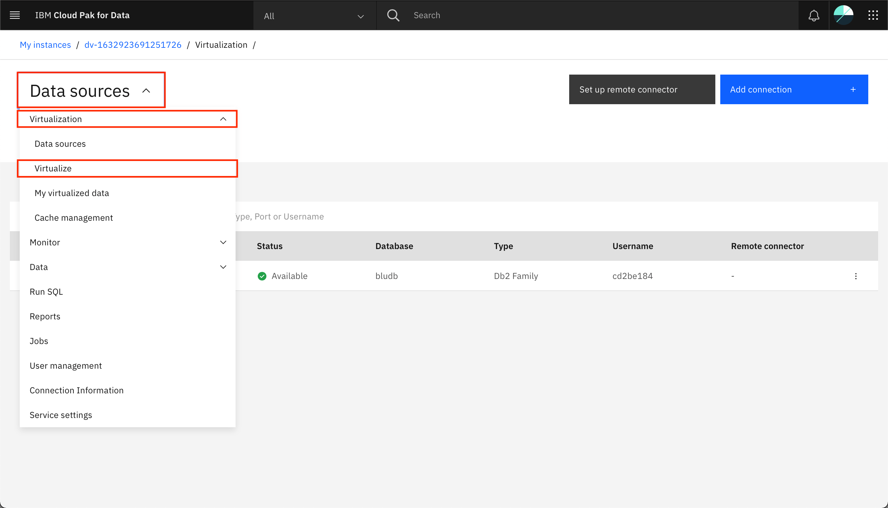

1. いくつかのテーブルが表示されます。追加したDb2接続に含まれる**PATIENTS**と**ENCOUNTERS**のテーブルを探して選択してください。検索バーを使用してテーブルを検索することもできます。選択したら、**Add to cart**、**View cart**の順にクリックします。
   
    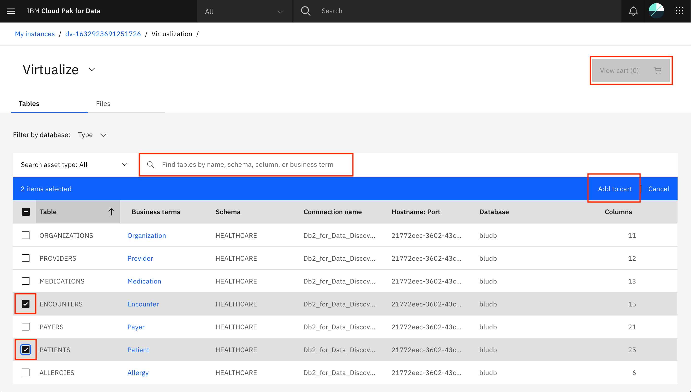
    
**    **注意**:注**: **PATIENTS**と**ENCOUNTERS**テーブルに加えて、ヘルスケアデータセットから他のテーブルを選択することもできます。

1. 次の画面では、仮想化データを*data request*、*project*、または*my virtualized data*のいずれに割り当てるかを選択するよう求められます。**My virtualized data**を選択します。**PATIENTS**テーブルの3つの垂直ドットをクリックしてオーバーフローメニューを開き、**Edit columns**をクリックします。
   
    

1. 「**すべての列をビジネス用語に置き換える**」のチェックボックスをクリックします。これにより、テーブル内のすべての列の名前が、[これらの列に割り当てられたビジネス用語](/tutorials/analyze-discovered-data-to-gain-insights-on-the-quality of-your-data#step-1-review-and-update-classes-business-terms-and-keys-for-the-data-assets)に置き換えられます。変更を適用するには、**Apply**をクリックします。
   
    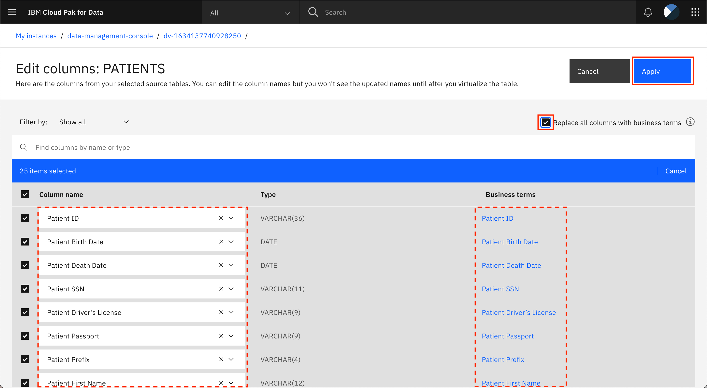

1. **ENCOUNTERS**テーブルの列名をビジネス用語に置き換える手順を繰り返し、**Virtualize**をクリックします。
   
    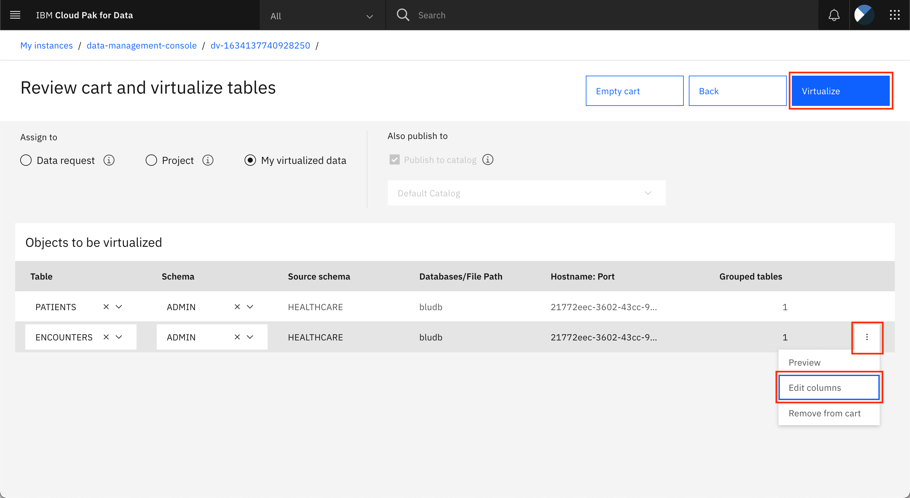
    
    **注意**。**注意**: **PATIENTS**と**ENCOUNTERS**に加えて他のテーブルをカートに追加している場合は、事前にテーブルにビジネス用語を割り当ててデフォルト・カタログに公開していれば、これらのテーブルのすべてのビジネス用語でカラム名を置き換えることができます。

1. 仮想テーブルが作成されたという通知が表示されます。新しく仮想化されたデータを表示するには、「**仮想化されたデータの表示**」をクリックします。
   
    

### 仮想化されたデータを結合してマージビューを作成する

次のステップは、作成された仮想テーブルを結合して、データのマージされたビューを作成することです。複数のテーブルからマージされたデータを得るには、ノートブックを使ってデータを結合するコードを複数行書くという方法があります。一方、データ仮想化を利用すれば、複数のデータ資産間の結合をより簡単に扱うことができます。データ仮想化を利用したデータ資産の結合は、マウスを数回クリックするだけで完了します。

1. PATIENTS**テーブルとENCOUNTERS**テーブルを選択して、**Join**ボタンをクリックします。
   
    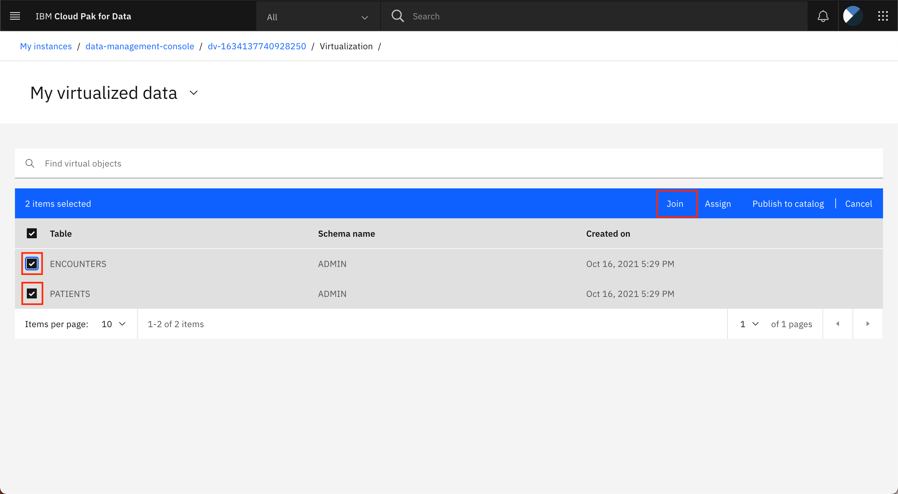

1. 両方のテーブルの列が画面に表示されます。列のビジネス用語が列名として表示されていることがわかります。これは、テーブルを仮想化する際に、列名をビジネス用語に置き換えることを選択したためです。

1. テーブルを結合するには、両方のテーブルに共通するキーを選択する必要があります。この例では、**患者ID**列が2つのテーブルに共通しているので、一方のテーブルの**患者ID**列をクリックして、もう一方のテーブルの**患者ID**列にドラッグすることで、この列をキーとしてマークすることができます。2つのテーブルの列を結ぶ線または曲線が表示されたら、**次へ**をクリックします。
   
    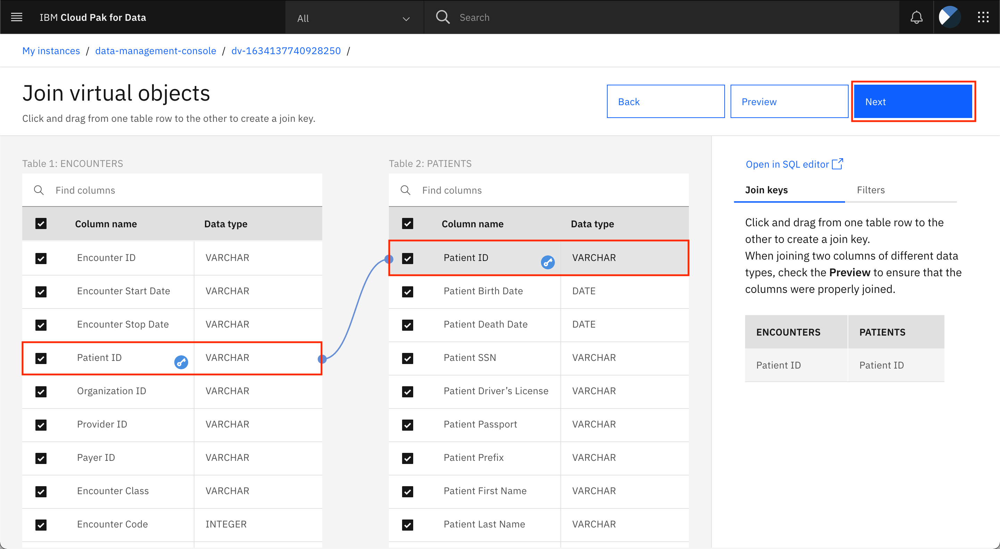

1. 結合ビューの列名を編集することができます。元の列名はすでにビジネス用語に置き換えられているので、列名はそのままで構いません。「次へ」をクリックします。
   
    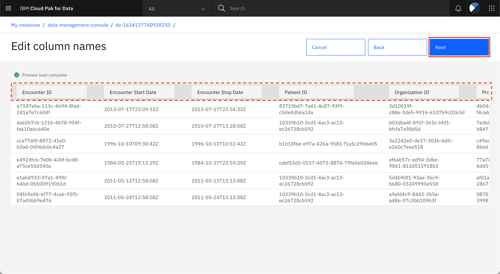

1. 次の画面で、結合したビューの名前を入力します（`PATIENTS_ENCOUNTERS`）。**Assign to**のところで、**My virtualized data**を選択します。「**Create view**」をクリックします。
   
    

1. 結合が成功したことが通知されます。**View my virtualized data**をクリックすると、自分の仮想化データが表示されます。
   
    

## Step 4.公開されたビューへのアクセス権をユーザーに与える

仮想ビューが作成され、デフォルトカタログに公開されたので、公開されたビューへのアクセス権をユーザーに付与することができます。これを行うには、ユーザーにデフォルトカタログとデータ仮想化へのアクセスを許可する必要があります。

**注意**。公開されたビューへのアクセス権は、[データ保護ルールの実施状況の確認](/tutorials/protect-your-data-using-data-privacy-features/#step-7-verify-the-data-protection-rules-are-enforced)に使用された2つのユーザー**regular_user**と**restricted_user**に付与されています。これらのユーザーには、すでにデフォルトカタログへのアクセス権が付与されており、今回はデータ仮想化へのアクセス権のみを付与する必要があります。

### ユーザーへのデータ仮想化へのアクセス権の付与

データ仮想化機能を利用する必要があるIBM Cloud Pak for Dataのユーザーには、職務記述書に基づいて特定のロールを割り当てる必要があります。その役割とは、Admin、Engineer、User、Steward です。これらの役割については、[IBM Cloud Pak for Data ドキュメント](https://www.ibm.com/docs/en/cloud-paks/cp-data/latest?topic=virtualization-managing-roles-users-groups)で詳しく説明しています。

1. **My virtualized data**をクリックしてData Virtualizationメニューを開き、**User management**をクリックします。
   
    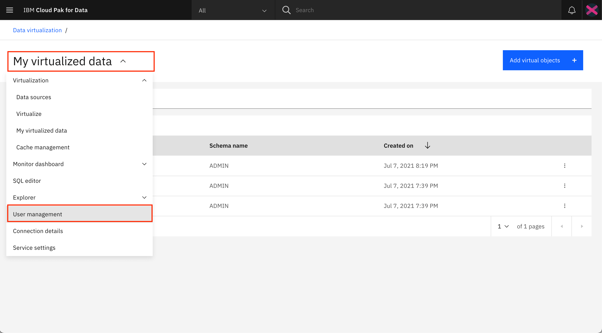

1. **Grant access +** をクリックします。ポップアップウィンドウで、Data Virtualizationに追加したいユーザーを選択します。ドロップダウンメニューを使用して、これらのユーザーのそれぞれに **User** ロールを提供します。**Add**］をクリックします。
   
    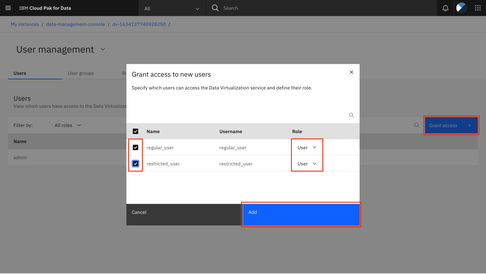

## Step 5.公開された仮想ビューのビジネス用語とデータクラスを更新します。

先ほど、[ビジネス用語を使用してテーブルを仮想化](#virtualize-the-tables-with-business-terms)することができました。これらのビジネス用語は、検出され、その後デフォルト・カタログにパブリッシュされたテーブルに由来します。しかし、仮想テーブルでは、カラム名がビジネス用語に置き換えられただけです。仮想テーブルには、「発見されたテーブルの分析」(/tutorials/analyze-discovered-data-to-gain-insights-on-the-quality-of-your-data)で行われたデータクラスとビジネス用語の割り当てがありません。

公開された仮想ビューを正しいデータ・クラスとビジネス用語で更新します。

**注**:ここでデータクラスとビジネス用語を更新することは、[以前に作成したデータ保護ルール](/tutorials/protect-your-data-using-data-privacy-features)を仮想ビューに適用するために重要です。正しいデータクラスとビジネス用語がない場合、データは（アクセス拒否、マスキング、置換、難読化などによって）保護されず、ユーザーは元のデータをすべて見ることができてしまいます。

1. **ハンバーガー（☰）**メニューに行き、**Catalogs**を展開し、**All catalogs**をクリックします。
   
    

1. 1. **Default Catalog**のタイルをクリックします。
   
    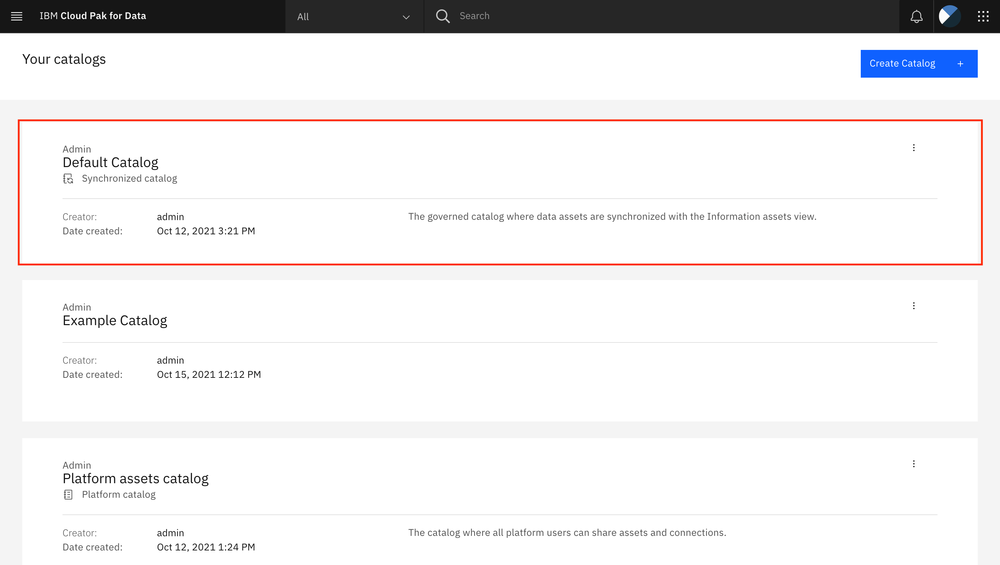

1. スクロールダウンして、**ADMIN.PATIENTS_ENCOUNTERS**アセットの名前をクリックします。
   
    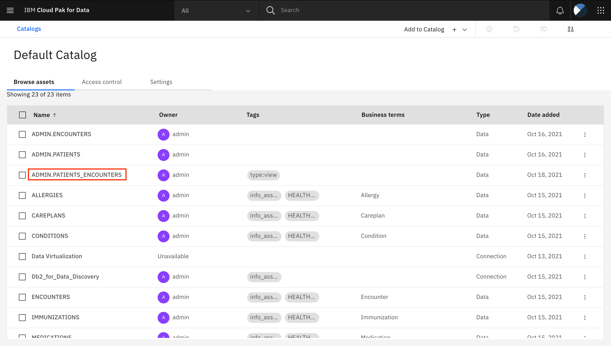

### 公開されたビューのデータプロファイルを作成します。

1. 「プロファイル」タブを開きます。「**プロファイルの作成**」をクリックします。Watson Knowledge Catalog では、ビューの最初の 5,000 行を見て、すべての列のデータクラスを特定して割り当てます。
   
    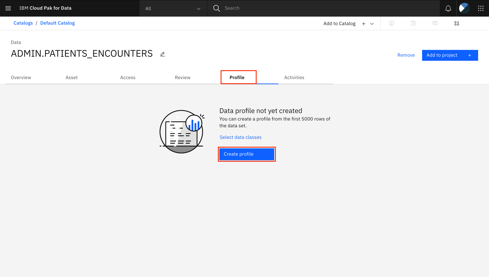

1. データプロファイルの作成には時間がかかります。時々ページを更新して状況を確認する必要があるかもしれません。
   
    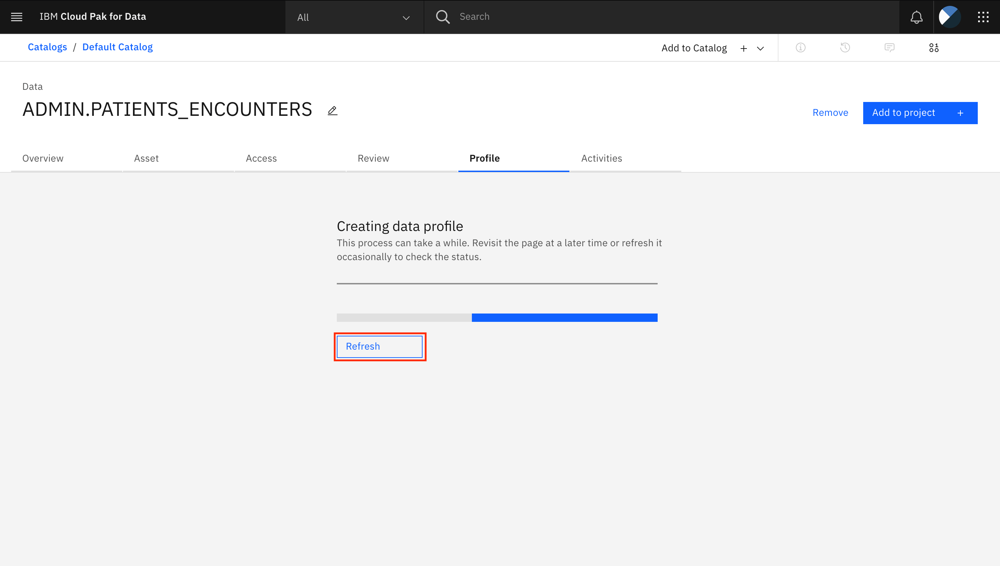

### 公開されたビューのデータクラスを更新

1. Watson Knowledge Catalog は、すべての列に対するデータクラスの識別を試み、各列に 1 つのデータクラスを選択します。識別されて各列に割り当てられたデータクラスを確認し、誤って割り当てられているものを修正します。例えば、エンカウンターコードの列には、`Numeric`のデータクラスが割り当てられています。データクラスを更新するには、列名「Encounter Code」の下にある矢印をクリックします。Watson Knowledge Catalog で提案されている他のデータクラスのリストが表示されます。ここに表示されているデータクラスの 1 つをクリックして新しいデータクラスを選択するか、**View all** をクリックして Watson Knowledge Catalog で提案されなかったデータクラスを選択することができます。「Encounter Code」列では、正しいデータクラスである「**Encounter code**」をクリックします。
   
    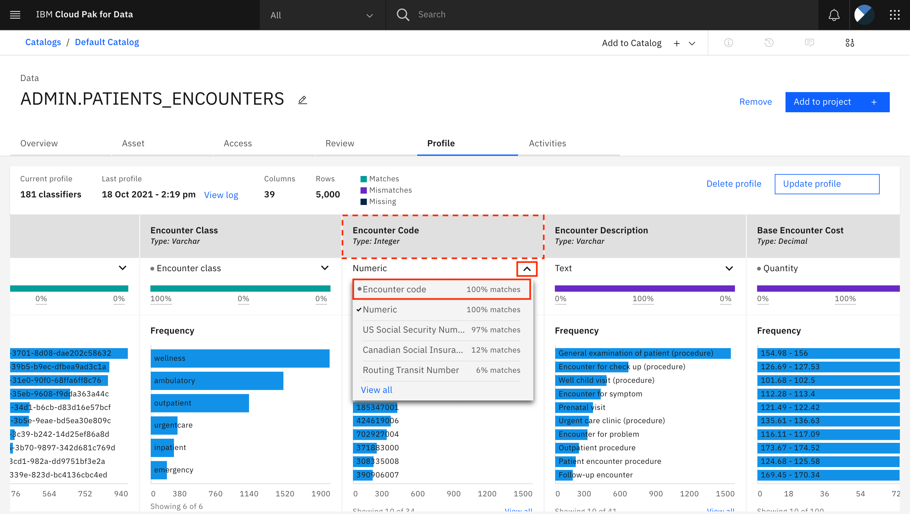

1. Encounter Code列のデータクラスが更新されます。このプロセスを繰り返して、アセットの他のすべての列のデータクラスを確認して更新します。このアセット内の列のデータクラスを取得するには、[Data Asset Annotations file](https://s3.us-east.cloud-object-storage.appdomain.cloud/staging-sombra/default/tutorials/analyze-discovered-data-to-gain-insights-on-the-quality-of-your-data/static/data-asset-annotations.pdf)を参照してください。PATIENTS_ENCOUNTERSビューはこの2つのテーブルを結合して作成されているので、**PATIENTS**テーブルと**ENCOUNTERS**テーブルの列に割り当てられたデータクラスを使用することを忘れないでください。

### 公開されたビューのビジネス用語の更新

1. **Asset**タブに移動します。各列の下に更新されたデータクラスが表示されています。これで、列のビジネス用語を更新できます。最初の列であるEncounter IDについて、列名の横にある目のアイコンをクリックします。
   
    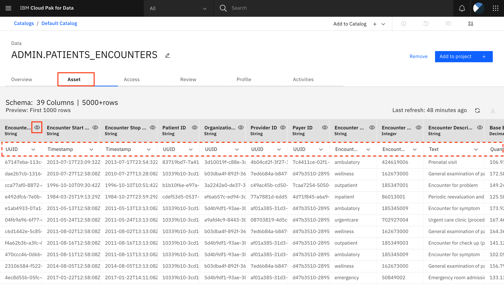

1. ポップアップウィンドウで、Business termsの横の鉛筆アイコンをクリックします。
   
    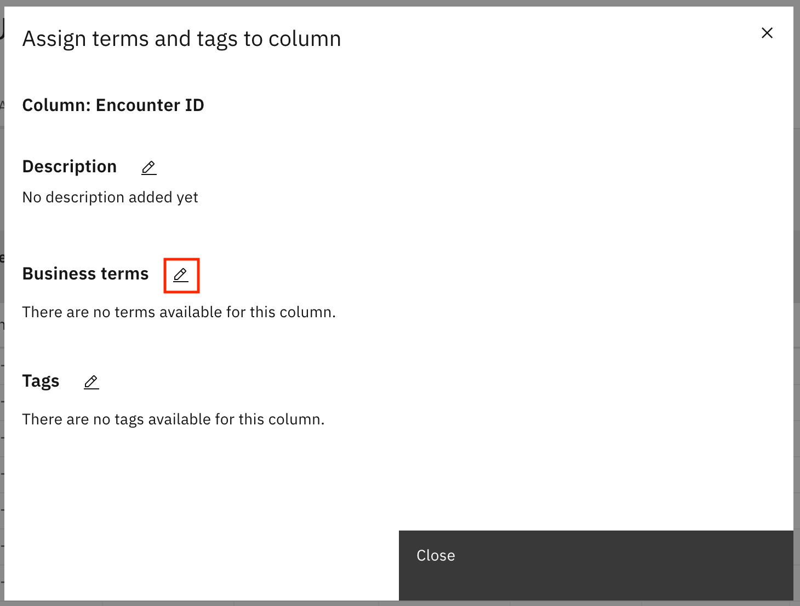

1. エンカウンターIDのビジネス用語を検索して選択します。「Apply」をクリックし、「Close」をクリックします。エンカウンターID列のビジネス用語が更新されます。
   
    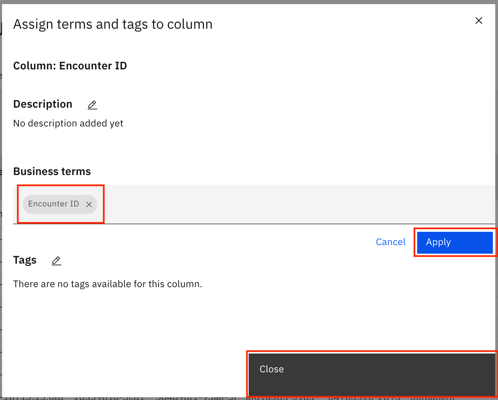

1. このプロセスを繰り返して、資産の他のすべての列のビジネス用語を更新します。[データ・アセット・アノテーション・ファイル](https://s3.us-east.cloud-object-storage.appdomain.cloud/staging-sombra/default/tutorials/analyze-discovered-data-to-gain-insights-on-the-quality-of-your-data/static/data-asset-annotations.pdf)を参照して、このアセット内の列のビジネス・タームを取得することができます。PATIENTS_ENCOUNTERSビューはこの2つのテーブルを結合して作成されているので、**PATIENTS**および**ENCOUNTERS**テーブルの列に割り当てられているビジネス用語を使用することを忘れないでください。

## Step 6.ユーザーは仮想化されたデータを閲覧し、プロジェクトに割り当てる

次に、ユーザーとしてログインし、ユーザーがどのようなデータを見ることができるか、また仮想化データをどのようにプロジェクトに追加できるかを確認します。

### 管理者以外のユーザーとしてIBM Cloud Pak for Dataにログインします。

1. IBM Cloud Pak for Dataからログアウトして、**regular_user**でログインし直します。
   
    

### アナリティクスプロジェクトの作成

1. **ハンバーガー(☰)**メニューで、**プロジェクト**を展開し、**すべてのプロジェクト**をクリックします。
   
    

1. 「**New project +**」をクリックします。ポップアップウィンドウで、**Analytics project**を選択し、**Next**をクリックします。
   
    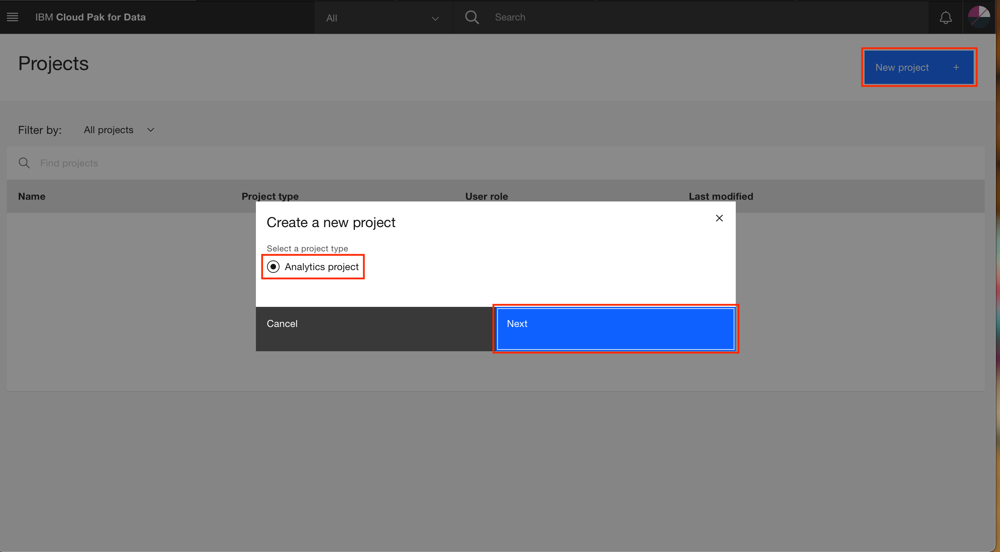

1. 「空のプロジェクトを作成する」のタイルをクリックします。
   
    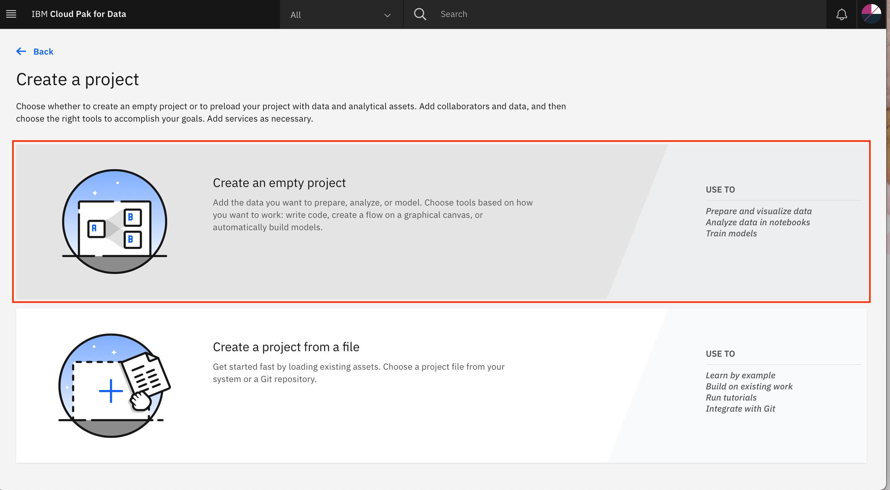

1. プロジェクトの名前（`Healthcare Project`）とオプションの説明（`Healthcare project created by ordinary user`）を入力して、**Create**をクリックします。
   
    

### 公開データのプロジェクトへの割り当て

1. **ハンバーガー(☰)**メニューで**Catalogs**を展開し、**All catalogs**をクリックします。
   
    

1. **Default Catalog**のタイルをクリックします。
   
    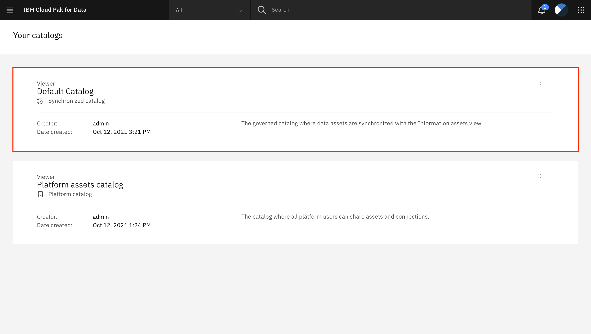

1. スクロールダウンして、**ADMIN.PATIENTS_ENCOUNTERS**アセットの名前をクリックします。
   
    

1. **Asset**タブに移動します。Data Virtualizationアセットのロックを解除するために、認証情報の入力を求められる場合があります。ユーザー名（`regular_user`）とパスワードを入力して、 **接続** をクリックします。
   
    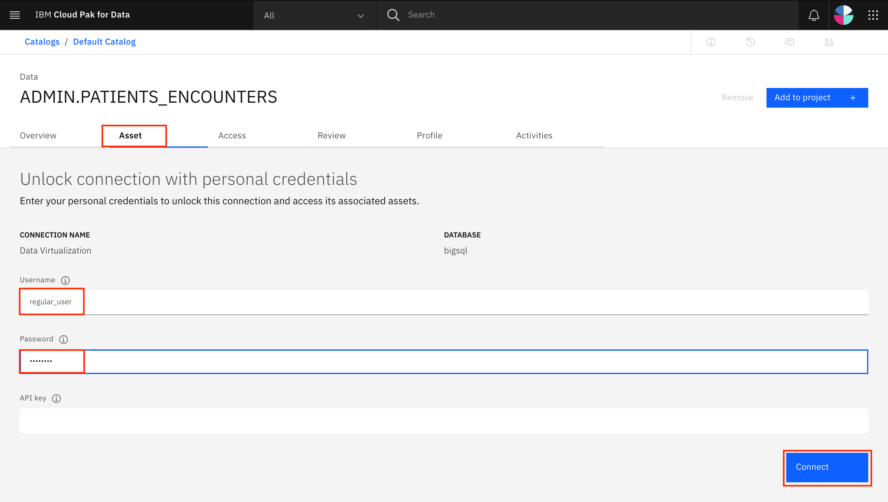

1. データマスキング処理が完了するまでに時間がかかり、ページを更新しなければならない場合があります。アセットが読み込まれると、各列に割り当てられたデータクラスを確認することができます。例えば、最初の列であるEncounter IDには、データクラス`UUID`が割り当てられています。カラム名「Encounter ID」の横にある目のアイコンをクリックします。新しいウィンドウが開き、この列に「Encounter ID」というビジネス用語が割り当てられていることがわかります。**閉じる**をクリックしてウィンドウを閉じます。
   
    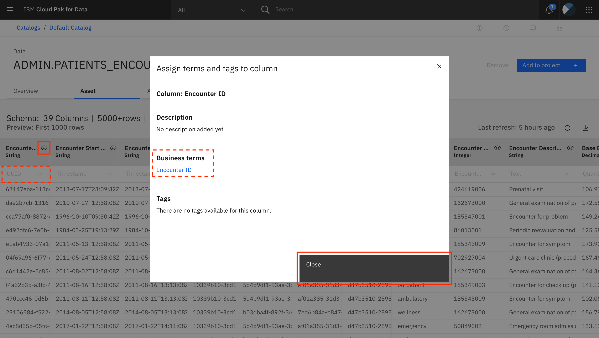

1. ビューの5つの列がマスクされていることに注意してください。錠前のアイコンをクリックすると、異なるマスキング技術を使って何列がマスキングされたかがわかります。
   
    

1. マスキングされている列は、「Patient Birth Date」、「Patient SSN」、「Patient Race」、「Patient Ethnicity」、「Patient Gender」です。すべてのマスクされたカラムには、カラム名の横にロックアイコンが付いています。ロックアイコンをクリックすると、その列がマスクされた理由についての詳細情報が表示されます。
   
    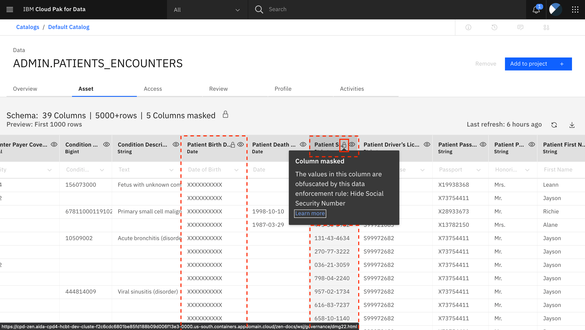

1. [以前](h/tutorials/protect-your-data-using-data-privacy-features)に設定されたデータ保護ルールのために、列がマスクされています。

1. このデータを分析プロジェクトに追加するには、「**プロジェクトに追加 +**」をクリックします。
   
    

1. 「Target」でプロジェクト「**Healthcare Project**」を選択し、「**Add**」をクリックします。
   
    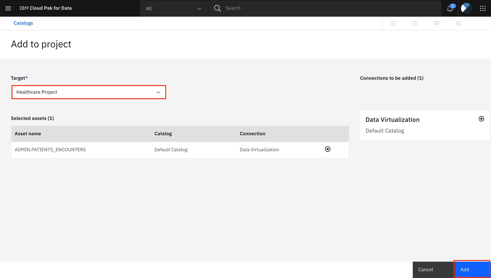をクリックします。

1. 2つのアセットがプロジェクトに正常に追加されたという通知が表示されます。**Go to project**をクリックします。
   
    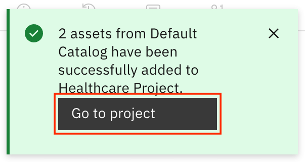

1. [Assets]タブに移動します。2つのエントリが表示されます。1つはData Virtualization接続用、もう1つはADMIN.PATIENTS_ENCOUNTERSアセット用です。**ADMIN.PATIENTS_ENCOUNTERS**資産をクリックします。
   
    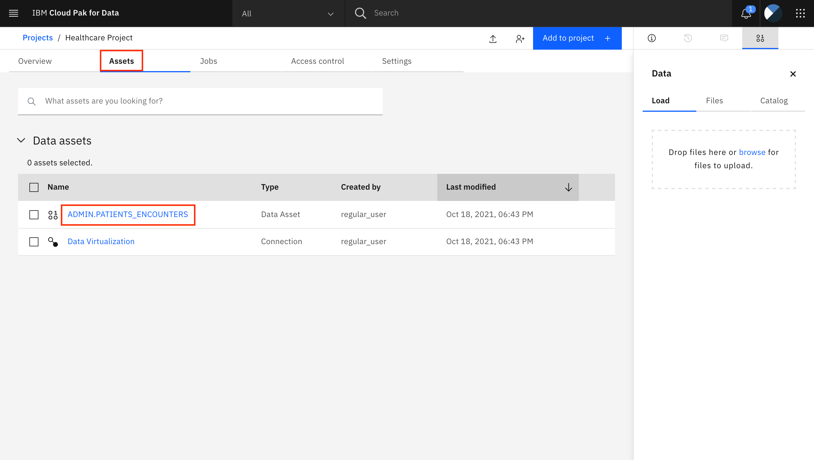

1. データ仮想化の接続を解除するための認証情報の入力を求められたら、ユーザー名`regular_user`とそのパスワードを使用して、**Connect**をクリックします。
   
    

1. アセットの **Preview** タブで、データをプレビューすることができます。カタログで実行されたデータマスキングがプロジェクト内のアセットに伝搬され、アセットに対してData Refinementなどの他の操作が実行されても同じように保護されていることがわかります。

    

1. IBM Cloud Pak for Data からログアウトし、**restricted_user** でログインし直します。前述の手順を実行してデフォルトカタログに移動し、公開された仮想ビューADMIN.PATIENTS_ENCOUNTERSにアクセスしようとすると、エラーが表示されます。これは、データクラスPassportを持つ列、またはビジネス用語Patient Driver's Licenseを持つ列を持つデータ資産へのrestricted_userのアクセスを防止する別のデータ保護ルールが原因です。
   
    

## 概要

このチュートリアルでは、IBM Cloud Pak for Data の Data Virtualization を使用して、Watson Knowledge Catalog on IBM Cloud Pak for Data 内のデータ保護ルールを使用して保護されているデータを仮想化する方法を学びました。仮想化されたデータのカラム名を以前に割り当てられたビジネス用語に置き換えることで、データのカラム名が企業ポリシーに沿って標準化されることを確認しました。仮想化データを結合して仮想ビューを作成する方法と、新しく作成された仮想ビューのデータクラスとビジネス用語を更新する方法を学びました。これにより、以前に定義したデータ保護ルールが確実に適用されるようになりました。管理者以外のユーザーとしてログインし、仮想ビューにアクセスしてプロジェクトに割り当てることで、データ保護ルールが守られていることを確認しました。これにより、ユーザーは実際のデータを見ることはできませんが、存在する列を使用することができ、使用されたデータマスキングのタイプに基づいて、それらの列のフォーマットやテーブル参照についても知ることができます。

このチュートリアルは、[An introduction to the DataOps discipline](https://developer.ibm.com/articles/an-introduction-to-the-dataops-discipline)シリーズの一部です。