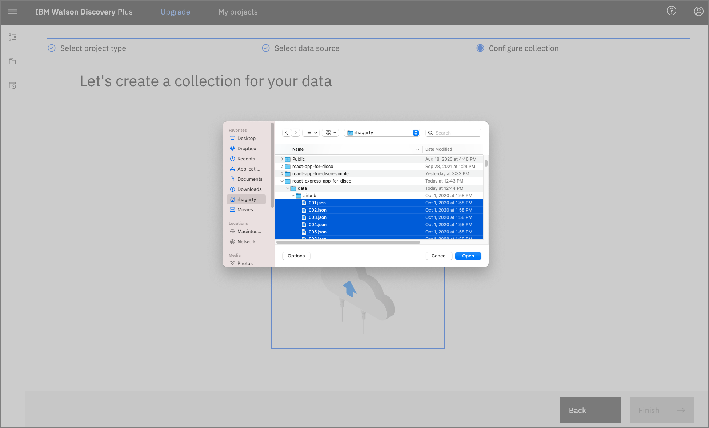
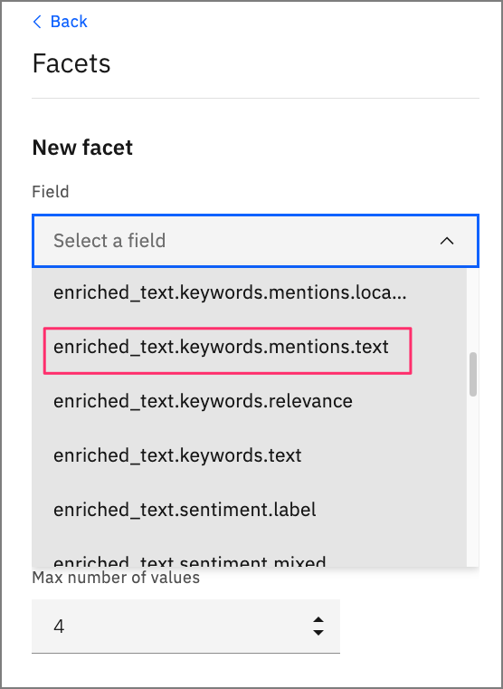

---
also_found_in:
- /learningpaths/get-started-watson-discovery
authors: ''
check_date: '2022-10-11'
completed_date: '2021-10-12'
components:
- watson-discovery
draft: false
excerpt: Enrich your data and build a custom search panel to query and visualize the
  data, then replicate the search panel in a custom application using Watson Discovery
  UI components.
meta_description: Enrich your data and build a custom search panel to query and visualize
  the data, then replicate the search panel in a custom application using Watson Discovery
  UI components.
meta_keywords: Watson Discovery, query data, visualize data, search data
meta_title: Create an intelligent search app using Watson Discovery UI components
primary_tag: artificial-intelligence
related_content:
- slug: get-started-watson-discovery
  type: learningpaths
subtitle: Integrate the Watson Discovery UI components into your application
title: Create an intelligent search app using Watson Discovery UI components
---

IBM Watson Discovery has a powerful analytics engine that provides cognitive enrichments and insights into your data. This tutorial showcases a new feature of the Discovery service -- Watson Discovery UI components. These components are tied directly to your Discovery projects and can easily be plugged into your search application. The components are self-contained and don't require any additional API calls to the Discovery service to retrieve data.

## Learning objectives

In this tutorial, learn how to navigate the Watson Discovery service to load and manage your data. This includes enhancing the enrichments that are applied to your data and building a custom panel to query and visualize your data. Then, learn how to replicate the search panel in your own application, which is built using [React](https://reactjs.org/), [Express](https://expressjs.com/), and the Watson Discovery UI components.

## Prerequisites

To follow along with this tutorial, you must have an [IBM Cloud account](https://cloud.ibm.com/login?cm_sp=ibmdev-_-developer-tutorials-_-cloudreg) where you can provision an instance of Watson Discovery.

## Estimated time

It should take you approximately 60 minutes to complete the tutorial.

## Steps

1. [Launch Watson Discovery](#launch-watson-discovery)
1. [Create a new project](#create-a-new-project)
1. [Upload data files into collection](#upload-data-files-into-collection)
1. [Enrich the data](#enrich-the-data)
1. [Add enrichments to search panel](#add-enrichments-to-search-panel)
1. [Create your UI app](#create-your-ui-app)
1. [Key files and concepts](#key-files-and-concepts)

### Launch Watson Discovery

If you do not have an IBM Cloud account, register for a [free trial account](https://cloud.ibm.com/registration?cm_sp=ibmdev-_-developer-tutorials-_-cloudreg).

1. Using your IBM Cloud account, create a Watson Discovery instance from the [resource catalog](https://cloud.ibm.com/catalog/services/discovery?cm_sp=ibmdev-_-developer-tutorials-_-cloudreg), and select the **Plus** plan.

    **Note:** The first instance of the Plus plan for IBM Watson Discovery comes with a free 30-day trial. If you no longer require your Plus instance for Watson Discovery after going through this exercise, you can delete it.

    

1. From the Discovery instance page, click **Launch Watson Discovery**.

### Create a new project

1. The landing page for the Discovery service shows you a list of current projects. Click **New project**.

    

1. For this tutorial, you are creating a *Document Retrival* type of project. Select that Project type, give the project a unique name, then click **Next**.

    

### Upload data files into collection

1. The next step is telling Discovery where your data will come from. In this example, you upload the data from JSON data files, so click **Upload data**, and then click **Next**.

    

1. Enter a **Collection name**, then click **Next**.
    
    

    **Note:** Projects can contain multiple collections. When Discovery performs a search, it is at the project level, and by default, includes all of the collections within that project. 

1. From the upload panel, click the **Drag and drop files here or upload** text. This opens a file window where you can select what files to upload.
    
    For this tutorial, you use 999 reviews that were submitted by AirBnB customers in Austin, TX. Each review has a title, the AirBnB location and host name, the reviewers name, a rating score, and the text of the review.

1. Download the [AirBnB reviews file](static/AirBnb.zip) to your system, unzip it, then select the 999 JSON files to upload.

    

1. When you complete the action, click **Finish**.

Your data starts to upload. Discovery provides alerts to tell you when the upload is complete.

### Enrich the data

1. Click **Manage collections** on the left to show all of the collections associated with your project. 

    **Note:** To change which project you are currently working on, you can click My projects at the top of the page.

    

    When you click the collection that you just created, you see that all 999 reviews have been loaded.

    

1. Click **Enrichments**. As you can see, the default enrichments are *Part of speech* and *Entities v2*. For this review data, you are also going to include *Keywords* and *Sentiment of Document*.

    

1. For each of these new enrichments, click **Fields to enrich**, and select the **text** field.

### Add enrichments to search panel

Now that you have some new enrichments, add them to your default search panel.

1. Click **Improve and customize** on the left to display the search panel associated with your collection.

    

1. To customize the display, you add all of the facets. To start, click the drop-down menu for **Customize display** located on the right side of the panel.

1. Click **Facets**, **New facet**, then **From existing fields in collection**.

1. For your **Keyword** facet, select the field **enriched_text.keywords.mentions.text**. This provides the most common keywords that are found in the data.

    

1. Provide a meaningful label for the UI component, then click **Apply**.

    

1. Repeat the process for the **Sentiment** facet, but use the field **enriched_text.sentiment.score**.

    

1. When complete, you see how the facets are now a part of the search panel.

    

If you enter a search string, you see the results displayed as well as new facet values that reflect the subset of reviews that match the search.


If you click **View passage in document** for any of the reviews, you drill down into the review data. If you click the **JSON** tab, you can see the actual result that is returned by Discovery.


Notice that in this case, the search found a match with the `title` of the review. The actual review is shown in the `text` field.

### Create your UI app

Now that your search panel has been enhanced to show all of the interesting facets of the data, you can build an application that displays that same panel. For this task, you use the [starter kit](https://github.com/watson-developer-cloud/discovery-components) provided by Watson Discovery.

The starter kit provides multiple ways to develop your app, but in this tutorial, you'll choose the manual method to integrate your Discovery collection with their example app.

#### Clone the repo

1. To get started, you first need to clone the GitHub repo to your local system.

```bash
$ git clone https://github.com/watson-developer-cloud/discovery-components.git
$ cd journeys/discovery-components
```

#### Gather your credentials

1. Return to IBM Cloud and your Watson Discovery launch panel to get your API key and service URL.

    

1. You also need your project ID, which you can get from the Watson Discovery Integrate and deploy panel for your project.

    

#### Add credentials to environment files

1. From the root directory of your local repo, run the following commands to create the environment files. Note that the files must be created in the examples/discovery-search-app directory.

    ```bash
    $ cd examples/discovery-search-app
    $ cp .env .env.local
    $ echo "DISCOVERY_AUTH_TYPE=iam
    DISCOVERY_URL=<replace with discovery URL>
    DISCOVERY_APIKEY=<replace with API key>" > ibm-credentials.env
    ```

1. Update the ibm-credentials.env file with your Discovery credentials, and update the .env.local file with your project ID.

#### Build and run the app

Now, you can return to your project root directory to build and start your app.

The following commands require that the [Yarn](https://yarnpkg.com/) package manager be installed on your local system.

```bash
$ cd ../..
$ yarn workspace @ibm-watson/discovery-react-components run build
$ yarn workspace discovery-search-app run start
```

After it starts, a browser opens with the base search panel displayed. Enter a search string to view the list of matching reviews.


Notice that all of the facets that you added in the Discovery tool show up here.

## Key files and concepts

The Discovery UI app consists of a React client and Express server. To explore the code, navigate to the examples/discovery-search-app subdirectory. There, you find the React code in the src directory and the Express code in the server.js file.

The following code shows the Discovery UI React components being imported.

```js
// examples/disovery-search-app/src/App.js

import {
  DiscoverySearch,
  SearchContext,
  SearchApi,
  SearchInput,
  SearchResults,
  SearchFacets,
  ResultsPagination,
  DocumentPreview,
  CIDocument,
  canRenderCIDocument
} from '@ibm-watson/discovery-react-components';

...

    <DiscoverySearch searchClient={searchClient} projectId={projectId}>
      <AppView />
    </DiscoverySearch>

```

In the previous list, the main component is `DiscoverySearch`. It requires that the Discovery client and project ID be passed in as parameters. This allows all of the details of each component to be self-contained, which means no additional programming is required to use them.

**Note:** Before these UI components were developed, you needed to create your own UI components and tie them to your Discovery data using the Watson Discovery API. While the provided components give you a good starting point to handle the most common UI components found in a typical Discovery search application, you must still use the old approach for any advanced custom components (for example, a line graph chart to show sentiment score trends over time).

For the client to have access to the Discovery service instance, you either must fetch that from the server or instantiate your Discovery service on the client side. In the example app, this is done using a proxy, which is initiated by the client making a call to instantiate a Discovery instance.

```js
// examples/disovery-search-app/src/App.js

const authenticator = new NoAuthAuthenticator();
const searchClient = new DiscoveryV2({
  url: `${window.location.href}api`,
  version: '2019-01-01',
  authenticator
});
```

However, the URL in this case is a route to the server (note that `api` is appended to the route). The server code uses a proxy to handle this route.

```js
// examples/disovery-search-app/server.js

const express = require('express');
const app = express();
const proxy = require('./src/setupProxy.js');

...
proxy(app);
```

When the proxy is called with this route, it does the work of using the credentials file to get and return an authorization token from the Discovery service.

```js
// examples/disovery-search-app/src/setupProxy.js

const addAuthorization = async (req, _res, next) => {
  const authenticator = getAuthenticatorFromEnvironment('discovery');
  try {
    const accessToken = await authenticator.tokenManager.getToken();
    req.headers.authorization = `Bearer ${accessToken}`;
  } catch (e) {
    console.error(e);
  }
  return next();
};

...

app.use(
  '/api',
  addAuthorization,
  proxy({
    ...
  })
);
```

From the client-side perspective, the call to instantiate a Discovery service instance works because the authenticator is substituted with an actual token. This also means that the client doesn't have to worry about embedding the credentials in the client code or making them visible in the browser console.

## Summary

In this tutorial, you learned how to navigate the Watson Discovery tool to create a project and upload data into a collection. You then learned how to enrich the data and build a custom search panel to query and visualize the data.


Finally, you replicated the same search panel in a custom application by using the Watson Discovery UI Components.

