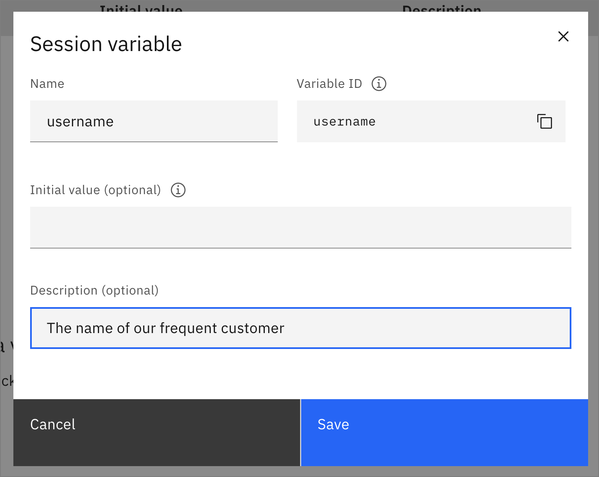
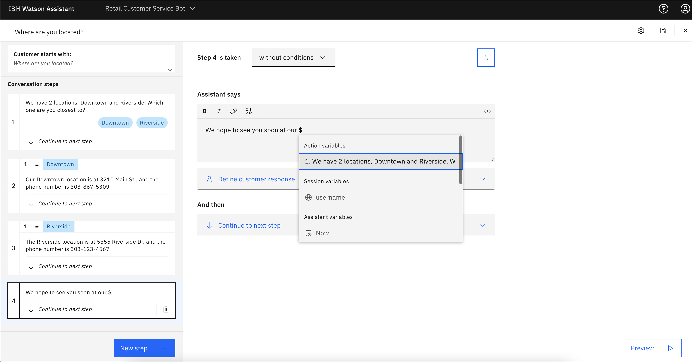

Watson Assistantは、自然言語を用いたインテリジェントなインターフェースを提供することで、お客様の問題解決をサポートします。アシスタントサービスが提供するツールを、お客様に直接役立つスキルで使用することができます。GUIツールとAPIの柔軟性を組み合わせることで、AIを使ったアプリケーションやツールをシンプルかつパワフルにパワーアップすることができます。

## あなたが学ぼうとしていること

1. [アシスタントサービスと最初のアシスタントの作成](#create-the-assistant-service-and-first-assistant)
1. [アクションの作成](#create-an-action)
1. [条件付きアクションの追加](#条件付きアクションの追加)
1. [変数付きアクションの追加](#add-actions-with-variables)
1. [変更を公開する](#publish the changes)
1. [結論](#conclusion)

## アシスタントサービスの作成と最初のアシスタント

1. Watson Assistant を使用するための最初のステップは、サービスのインスタンスを作成することです。これは[IBM Cloud](https://cloud.ibm.com/catalog/services/watson-assistant?cm_sp=ibmdev-_-developer-tutorials-_-cloudreg)を使って行います。インスタンスに意味のある名前を付けます。所属したいリソースグループを選択し、必要に応じてタグを追加して、「**Create**」をクリックします。

    

1. **Launch Watson Assistant** をクリックします。

    をクリックします。

1. 上部のドロップダウンメニューから、**Create new +** をクリックします。

    をクリックします。

1. インスタンスに名前と任意の説明を付けて、**Create Assistant**をクリックします。

    

## アクションの作成

1. 新しいホームページでは、ナビゲーションの手順に従い、**Watson Assistantについて学ぶ**をクリックして1分間のビデオを見ることができます。続けて**Create your first action**をクリックするか、左のナビゲーションパネルを使って*Actions*のアイコンを選択します。

    

*"What does your customer say to start this interaction? "*と聞かれます。このチュートリアルでは、「What are your store hours?」と入力し、**Save**をクリックします。

    

1. "We are open from 8:00 AM to 9:00 PM every day. "などの文言を入力します。お客様は何も入力する必要がなく、質問にも答えているので、*Define customer response*セクションを空にして、デフォルトの*Continue to next step*のままにしておきます。

    

1. それでは、今までの成果を試してみましょう。右下の**Preview**をクリックします。チャットボットは "Welcome, how can I assist you? "と始まります。「What are your store hours?」というテキストを入力し、矢印をクリックするか、キーボードの**Enter/Return**を押してください。入力した "We are open from 8:00 AM to 9:00 PM every day. "という回答が返ってくるはずです。

    

1. 反時計回りの矢印をクリックして、ボットをリセットします。今度は、「When are you open?」と入力します。今度は、ボットが「I'm afraid I don't understand.Please rephase your question." と答えます。ボットが理解できるように、お客様の質問にいくつかの選択肢を追加する必要があります。左上の**Customer starts with**ボックスをクリックして、ここに戻り、質問の別の言い回しを追加します。

    

1. プレビューウィジェットを使用するには、保存する必要があるため、右上の保存アイコンをクリックします。アシスタント設定の歯車アイコンをクリックすると、自動保存がオンになっていることがわかりますが、この保存は、ステップを切り替えたときに実行されます。次に、プレビューウィンドウで、フレーズのリストにある「開く」などと入力して、再度テストしてみてください。正しい反応が得られるはずです。

1. プレビューウィンドウで、ボットが「There are no additional steps for this action.新しいステップを追加するか、アクションを終了してください。" と表示されていることに注意してください。アクションを終了しましょう。左上のConversationステップをクリックして戻り、「*And then*」のドロップダウンを「**End the action**」に変更します。

    

1. 変更を保存して、プレビューをリセットします。これで、店舗の営業時間が指定された後にアクションが完了するはずです。

## 条件付きアクションの追加

1. 今度は、"Where are you located? "という質問に答えるアクションを追加します。ホーム画面から「**新しいアクション+**」をクリックします。

    

1. What does your customer say to start this interaction? "に対して、`Where are you located?`と入力します。
1. *アシスタントの発言*」の項目に、「ダウンタウンとリバーサイドの2つの場所があります。あなたはどちらに近いですか？
1. 「顧客の反応」の項目で、「オプション」を選択し、「ダウンタウン」と「リバーサイド」を入力してください。この情報は前のステップから保存されているので、*Allow skipping or always ask?*のデフォルトを*Skip if the customer already given this information*にしておくことができます。購入前の確認のような場合には、*Always ask for this information, regardless of earlier messages*を選択するとよいでしょう。
1. **Apply**をクリックします。

    

1. 別のステップを追加し、今度はプルダウンメニューを使用して、*Step 2 is taken*を*with conditions*に変更します。*条件には、*「1.このすべてが真である：*We have 2 locations...」*が`Downtown`であることがあらかじめ登録されているはずです。クリックしてみると、*is* から *is not* へ、あるいは *All* of this is true から *Any* へと、さまざまな方法でロジックを変更できることがわかります。さらに条件を追加したり、条件のグループ全体を追加することもできます。ここで、「アシスタントの発言」に、「ダウンタウンの店舗は3210 Main St.で、電話番号は303-867-5309です」というような回答を追加することができます。

    

1. 「If `We have 2 locations` is `Riverside`」と同様の条件を追加することができます。保存後、プレビューウィジェットでボットをテストし、期待通りに動作することを確認します。次の例では、「あなたのロケーションは何ですか」と尋ねていますが、代替案は追加していません。Watson Assistant の曖昧さ回避機能は、私の行動のためのオプションとともに、「Did you mean?私は "Where are you located? "をクリックするか、テキストを入力して希望の回答を得ることができます。また、元の質問にいくつかの代替フレーズを追加する必要があることも分かりました。

    

## 変数を使ったアクションの追加

ここで、変数の仕組みを見てみましょう。*Watson Assistant が設定する変数には、*Now* (現在の時刻と日付)、*Current time*、Current date* などがあります。

1. **自分で作成した変数**と**新規変数+**をクリックします。`username`という名前を入力すると、変数IDに同じ名前があらかじめ入力されていることに気がつきます。これは、APIで読み取ったり設定したりすることができる名前で、必要に応じて異なる名前にすることができます。任意の説明を入力して、**Save**をクリックします。

    

1. **アクション→Created by you**と**New action +**をクリックし、インタラクションの開始位置に`I have a question about my account`と入力します。*Assistant says*には "What is your username? "と入力し、Customer Responseには*Free text*を選択します。

1. **New step +**をクリックして、**Fx**アイコンをクリックして変数を追加します。「新しい値を設定する」をクリックし、「セッション変数」→「ユーザー名」を選択し、「宛先」には**1.あなたのユーザー名は何ですか？**.

    

1. *Assistant says*のレスポンスを編集し、`Hello.Welcome back`と入力し、**01-0**アイコンをクリックして変数を挿入します。ドロップダウンメニューから **セッション変数->ユーザー名** を選択します。

    

1. これをテストすると、アシスタントのレスポンスにユーザー名が挿入されていることがわかります。

    

1. Where are you located? "のアクションに戻って、最後（3番目）のステップをクリックし、次に**New step +**をクリックすると、アクション変数を使用できます。`*Assistant says*のボックス内に、テスト「We hope to see you soon at our`」を追加し、**01-0**アイコンをクリックして変数を挿入します。**01-0**アイコンをクリックして変数を挿入します。*Action variables*の下にある**"1. We have two locations... "**を選択すると、挿入されます。

    

1. レスポンスをスムーズにするために、テキスト ` location.` を追加し、*And then* の部分を **End the action** に変更します。これで、テスト時にダイアログで使用されているロケーションが表示されます。

    

## 変更点の公開

変更を最終的に公開することができます。

1. 左側のナビゲーションにある "ロケット "アイコンをクリックして、自分の更新内容を確認します。次に、「公開」をクリックします。

    

1. 説明を追加して、**Publish**をクリックします。変更内容が新しいバージョンとして公開され、デプロイされたチャットボットに表示されます。

## Conclusion

このチュートリアルでは、初めてAssistantを搭載したチャットボットを作成する手順を説明しました。Assistant サービスの作成、いくつかのアクションの追加、条件付きロジックと応答内の変数の使用について説明しました。探索して使用する他の Watson Assistant 機能があり、これらは Watson Assistant ラーニングパスの他のチュートリアルで説明されています。