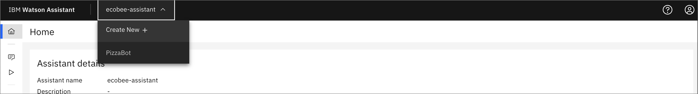
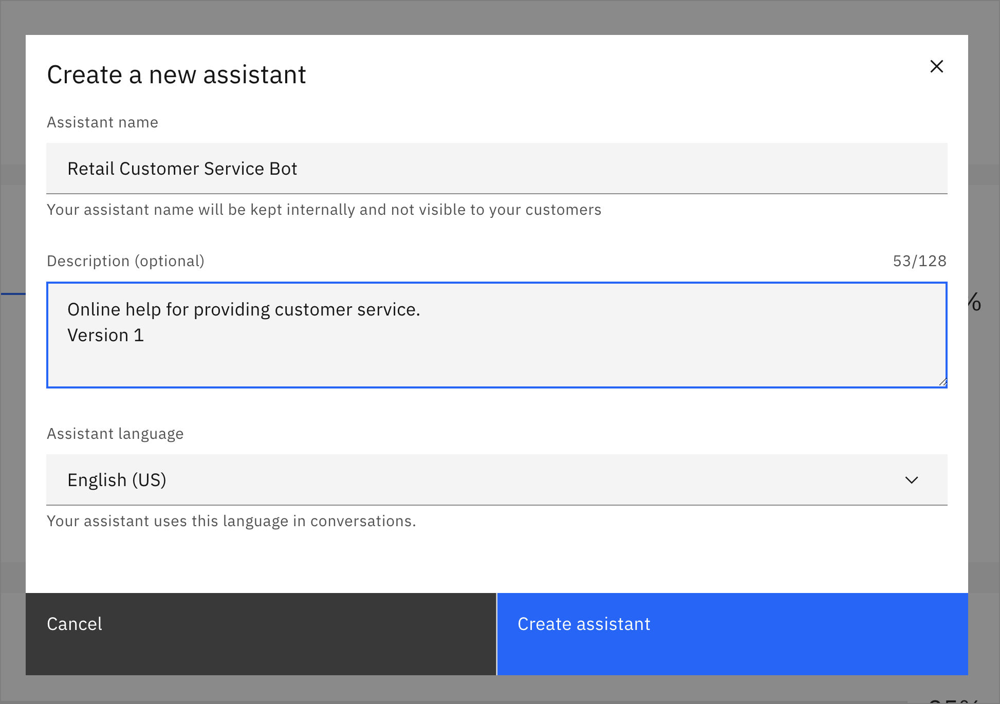
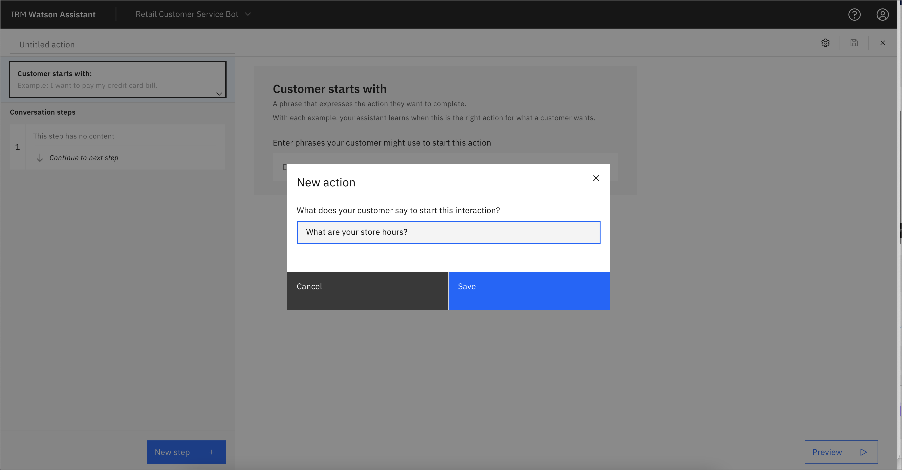
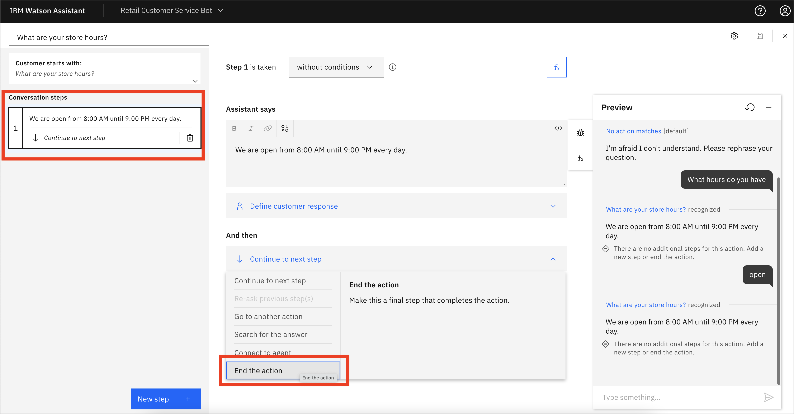
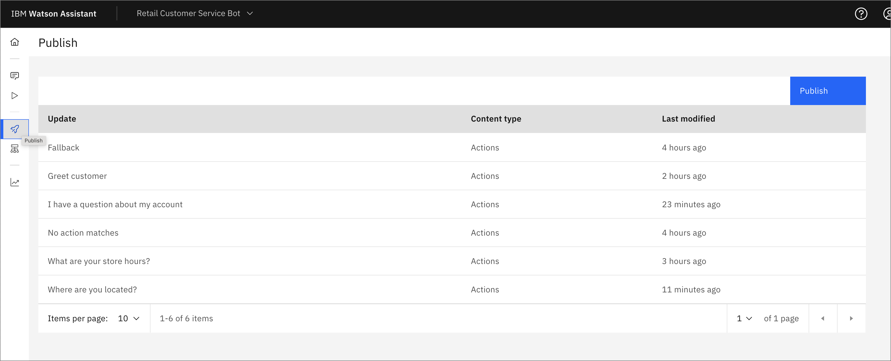

Watson Assistant can help you solve a problem by providing an intelligent interface using natural language. You can use the tools provided by the Assistant service with skills that will directly help your customers. The flexibility of the GUI tools and APIs combine to allow you to power applications and tools using AI in simple and powerful ways.

## What you're going to learn

1. [Create the Assistant service and first Assistant](#create-the-assistant-service-and-first-assistant)
1. [Create an action](#create-an-action)
1. [Add actions with conditions](#add-actions-with-conditions)
1. [Add actions with variables](#add-actions-with-variables)
1. [Publish the changes](#publish-the-changes)
1. [Conclusion](#conclusion)

## Create the Assistant service and first Assistant

1. The first step in using Watson Assistant is creating an instance of the service. You'll do this using [IBM Cloud](https://cloud.ibm.com/catalog/services/watson-assistant?cm_sp=ibmdev-_-developer-tutorials-_-cloudreg). Give your instance a meaningful name. Choose the resource group you wish to belong to, add tags as desired, and click **Create**.

    

1. Click **Launch Watson Assistant**.

    

1. From the top drop-down menu, click **Create new +**.

    

1. Give the instance a name and optional description, and click **Create Assistant**.

    

## Create an action

1. On your new home page, you can follow the navigation steps and click **Learn about Watson Assistant** to watch a 1-minute video. You can either continue and click **Create your first action**, or use the navigation panel on the left and choose the icon for *Actions*.

    

* You are asked *"What does your customer say to start this interaction?"*. For this tutorial, enter `What are your store hours?`, and click **Save**.

    

1. Add a resonse such as "We are open from 8:00 AM until 9:00 PM every day." Because the customer doesn't have to add any input, and the question has been answered, you can leave the *Define customer response* section empty, and leave the default *Continue to next step*. 

    

1. Now let's test what you have so far. Click **Preview** in the lower-right corner. The chatbot begins with "Welcome, how can I assist you?" Enter the text `What are your store hours?`, and click the arrow or press **Enter/Return** on your keyboard.. You should get the response that you entered, "We are open from 8:00 AM until 9:00 PM every day."

    

1. Click the counter-clockwise arrow to reset the bot. This time, enter `When are you open?` This time, the bot responds with "I'm afraid I don't understand. Please rephrase your question." You need to add some alternates to the customer question to help the bot understand. Click the **Customer starts with** box in the upper-left to go back to this and add some alternate ways to phrase the question.

    

1. Click the Save icon in the upper right because this must be saved to use the Preview widget. If you click on the gear icon for the Assistant settings, you see that auto-save is on, but it performs this save when you switch between steps. Now, test again in the preview window by typing something like `open` that is present in your list of phrases. You should get a correct response.

1. Notice in the preview window that the bot ends with "There are no additional steps for this action. Add a new step or end the action." Let's end the action. Go back to the Conversation step by clicking on it in the upper-left corner, and change the *And then* dropdown to **End the action**.

    

1. Save your changes, and reset the Preview. Now, the action should complete after the store hours are given.

## Add actions with conditions

1. Now, add another action to answer the question "Where are you located?" From the home page, click **New action +**.

    

1. In response to "What does your customer say to start this interaction?", enter `Where are you located?`
1. For the section *Assistant says*, enter `We have 2 locations, Downtown and Riverside. Which one are you closest to?`
1. Under *Customer response*, choose **Options**, and enter `Downtown` and `Riverside`. You can leave the default for *Allow skipping or always ask?* to be *Skip if the customer already gave this information* because this information is saved from that previous step. You might choose *Always ask for this information, regardless of earlier messages* for something like a confirmation before a purchase. 
1. Click **Apply**.

    

1. Add another step, and this time you use the pull-down menu to change *Step 2 is taken* to be *with conditions*. The conditions should prepopulate with *"1. All of this is true: If *We have 2 locations..."* is `Downtown`. You can click around and see that you can change the logic in various ways, from *is* to *is not* or from *All* of this is true to *Any*. You can add more conditions or an entire group of conditions. Now, you can add an answer under *Assistant says* such as "Our Downtown location is at 3210 Main St., and the phone number is 303-867-5309".

    

1. You can add a similar condition for If `We have 2 locations` is `Riverside`. After saving, test the bot in the Preview widget to make sure that it works as expected. In the following example, I ask "what are your locations?", but I haven't added any alternatives. The Watson Assistant disambiguation feature displays a question for clarification, "Did you mean?" along with options for my actions. I can click "Where are you located?" or enter the text and get the wanted response. I also learned that I need to add some alternate phrases to my original question.

    

## Add actions with variables

Now, take a look at how variables work. There are variables set by Watson Assistant such as *Now* (the current time and date), *Current time*, and Current date*.

1. Click **Variables created by you** and **New variable +**. Enter the name `username`, and notice that the Variable ID is prepopulated with the same name. This is the name that can be read or set by the API and could be different if you want. Give an optional description, and click **Save**.

    

1. Click **Actions -> Created by you** and **New action +**, and enter `I have a question about my account` for the start of the interaction. For *Assistant says*, ask "What is your username?", and for customer response, choose *Free text*.

1. Click **New step +**, and click the **Fx** icon to add a variable. Click **Set new value +**, choose **Session variables -> username**, and for "to" choose **1. What is your username?**. 

    

1. Edit the *Assistant says* response by entering `Hello. Welcome back`, then click the **01-0** icon to insert a variable. From the drop-down menu, choose **Session variables -> username**.

    

1. When you test this, you see that the username is inserted into the Assistant response.

    

1. If you navigate back to the Action for "Where are you located?" and click the last (third) step, then **New step +**, you can use an Action variable. Inside the *Assistant says* box, add the test `We hope to see you soon at our`, and then click the **01-0** icon to insert a variable. Under *Action variables*, choose **"1. We have 2 locations..."**, and it is inserted.

    

1. Add the text ` location.` to make the response smooth, and change the *And then* section to **End the action**. Now, when you test you see the location used in the dialog.

    

## Publish the changes

You can finalize the changes by publishing them. 

1. Click the rocket"icon on the navigation on the left to see your updates. Then, click **Publish**.

    

1. Add a description, and click **Publish**. The changes are live as a new version and show up in any deployed chatbot.

## Conclusion

This tutorial walked you through the process of creating your first Assistant-powered chatbot. It covered creating the Assistant service and adding several Actions, using conditional logic and variables in the response. There are other Watson Assistant features to explore and use and these are covered in other tutorials on the Watson Assistant learning path.