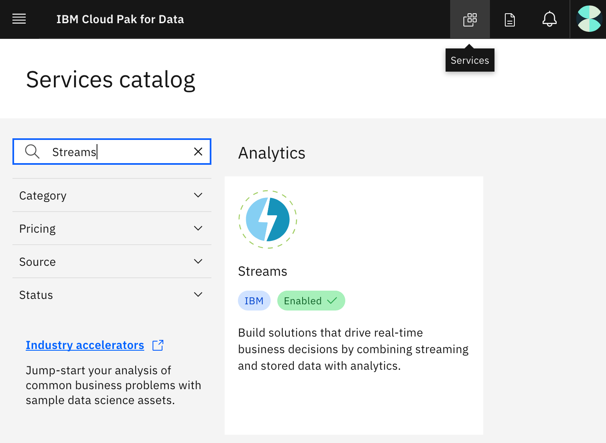
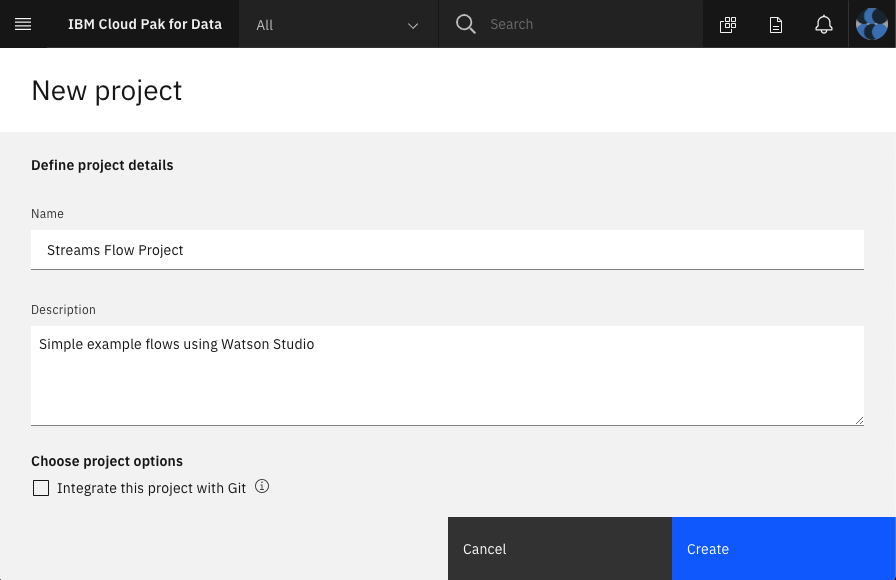
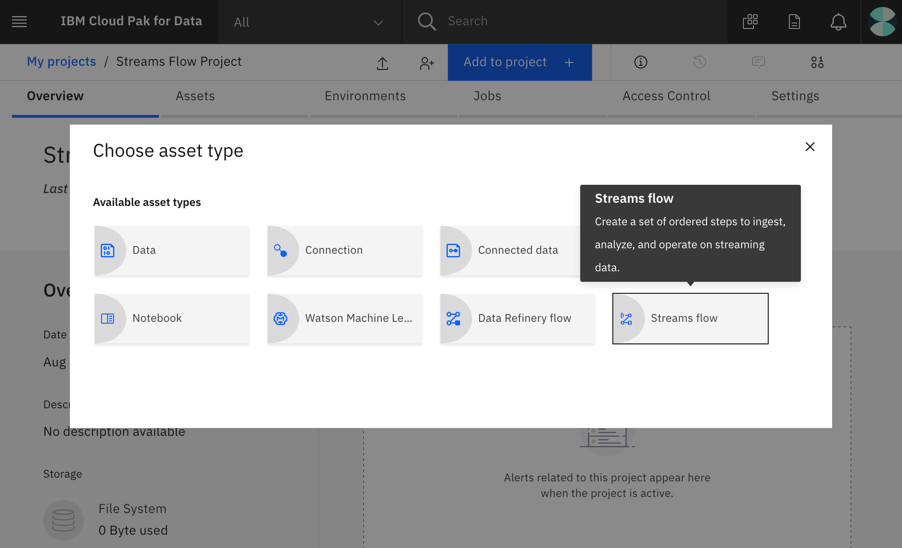
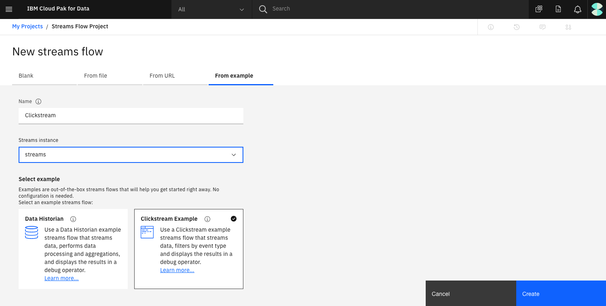
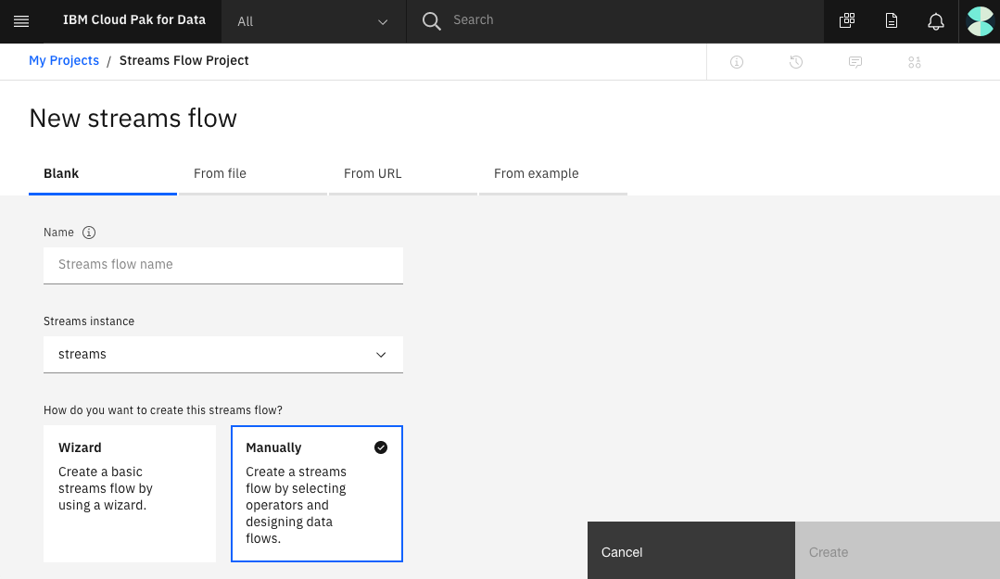
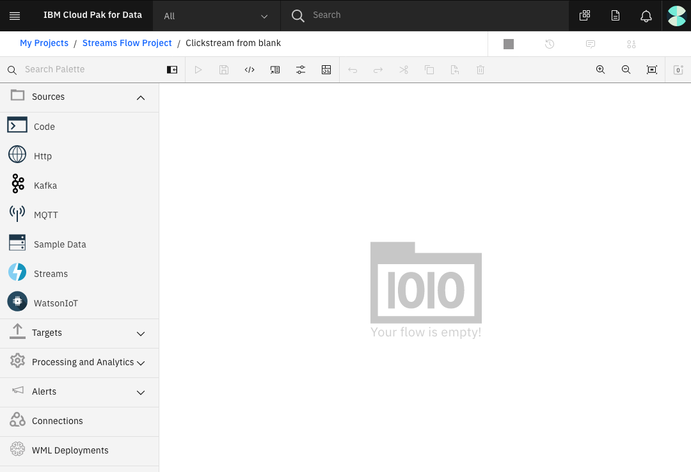
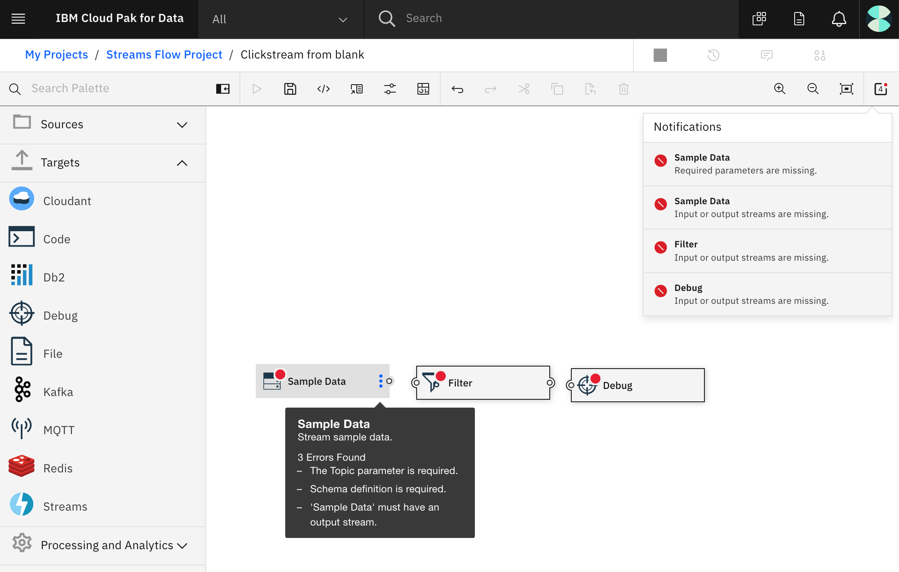
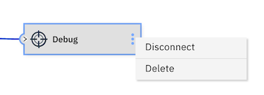
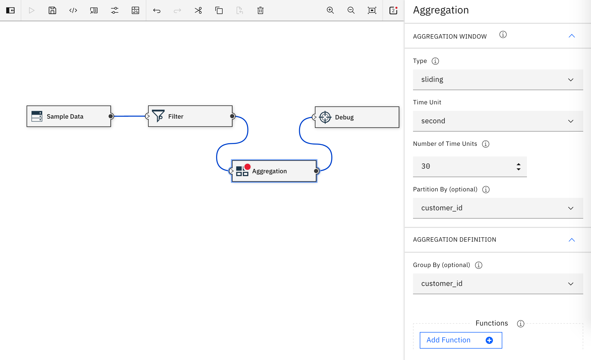
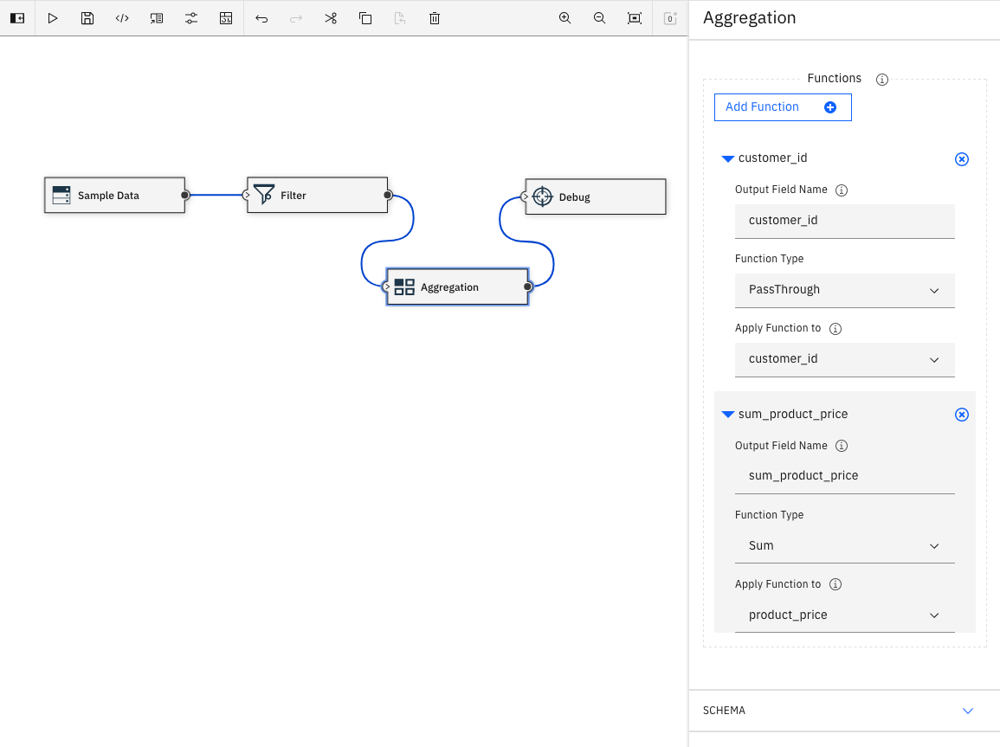

## Introduction

このチュートリアルの目的は、ストリーミング・アプリケーションを構築し、実演する方法を学ぶことです。ストリーミングアプリケーションは、データソースから始まり、データ処理(フィルタリングや集約など)を行い、その結果をターゲットに送信します。このチュートリアルでは、IBM Streams Flowsを使ってストリーミング・アプリケーションを構築します。IBM Cloud Pak&reg; for Data上のIBM Streams Flowsを使えば、コードを書かずに、簡単に使えるユーザー・インターフェースでストリーミング・アプリケーションを構築することができます。処理の一部にコードを書く可能性が高い、より高度なシナリオに移る前に、直感的で視覚的なユーザー・インターフェースでストリーミング・アプリケーションの感触を得るための最初のステップとして最適です。

## 前提条件

このチュートリアルを完了するには、IBM Cloud Pak for Data へのアクセスと、IBM Streams のインスタンスが必要です。

## 見積もり時間

このチュートリアルを完了するには、約 30 分かかります。

## 手順

1. IBM Cloud Pak for Data 上の IBM Streams インスタンスへのアクセスを確認します。
1. IBM Cloud Pak for Data で新しいプロジェクトを作成します。
1. クリックストリーム・データを使ったIBM Streamsフローの例を試します。
1. アプリケーションを最初から再構築します。
1. アグリゲーション演算子を追加します。

### ステップ 1.IBM Cloud Pak for Data 上の IBM Streams インスタンスへのアクセスを確認します。

IBM Cloud Pak for Data インスタンスにログインしたら、管理者が IBM Streams のインスタンスをプロビジョニングし、そのインスタンスへのアクセスをユーザーに与えていることを確認します。

利用可能なサービスを確認するには、サービス・アイコンをクリックし、`Streams`を検索します。**有効**のインジケータが表示されるはずです。

プロビジョニングされたインスタンスを確認するには、画面左上のハンバーガー(☰)メニュー・アイコンをクリックし、**My Instances**をクリックします。

### ステップ 2.IBM Cloud Pak for Data で新しいプロジェクトを作成します。

IBM Cloud Pak for Data では、特定の目標を達成するために使用するリソース (問題に対するソリューションを構築するためのリソース) を収集して整理するために、プロジェクトという概念を使用しています。プロジェクトのリソースには、データ、共同作業者、ノートブックやモデル、IBM Streams Flows などの分析資産が含まれます。

画面左上のハンバーガー(☰)メニューをクリックし、「**Projects > New project +**」をクリックして空のプロジェクトを作成し、プロジェクトに固有の名前を入力してから「**Create**」をクリックします。

### ステップ 3.クリックストリームデータを使用した IBM Streams フローの例を試してみます。

このサンプルアプリケーションでは、クリックストリームデータを取り込み、タイプ別にイベントをフィルタリングします。クリックストリームデータは、**Sample Data**ソース演算子で生成されます。「Add_to_cart」イベントだけを残すために**Filter**演算子が使用されます（他のイベントデータは破棄されます）。最後に、**Debug**ターゲット演算子を使って、結果のデモンストレーションを行います。アプリケーションを実行すると、フィルタリングの前後のデータを見て、フィルタリングが機能していることを確認することができます。

1. **Add to project +**をクリックします。
    

1. アセットタイプ **Streams flow** を選択します。
    

1. **From example**タブをクリックし、名前を入力し、**Streamsインスタンス**を選択し、**Clickstream Example**カードを選択し、**Create**をクリックします。
    

1. 作成されると、2つのストリームで接続された3つのオペレータからなるアプリケーションが表示されます。
    

1. ボタンバーの上にカーソルを置くと、どのような動作ができるか確認できます。以下のボタンが表示されているはずです。
   * IBM Streamsのフローを開始します。
   * フローを停止する（フローがすでに停止しているので無効です）。
   * フローのコピーをこのプロジェクトに作成する。
   * フローのコピーをファイルにエクスポートする。
   * フローを削除する。
   * フローを編集します。
   * IBM ストリームを管理します。
   * 通知を表示します。
   * すべてのフローを表示します。

1. 「**Play**」ボタンを押して、サンプル・フローを構築して実行します。

1. フローが実行されたら、フローの各部分をクリックして詳細情報を確認してください。アニメーションでは、**Sample Data**から**Filter**へのストリーム、**Filter**から**Debug**へのストリームが表示されています。フィルタは "add_to_cart "イベントのみを保持しているため、2つ目のストリームにはかなり少ないデータしかありません。選択した内容に応じて、右のテーブルではデータの流れを確認することができます。
    

    **Note:** 最終ノードに **Debug** を使用すると、このような視覚的なテストに適しています。フローが思い通りに動作するようになったら、Debugノードをデータベース、ファイル、Kafkaブローカーなどの別のターゲットに置き換えます。

1. ストリーミングアプリケーションを停止するには、**Stop**ボタンをクリックします。

おめでとうございます。ストリーミングアプリケーションを初めて実行しました。

### Step 4.アプリケーションを一から作り直す

次に、サンプルを使用する代わりに、スクラッチでアプリケーションを構築します。サンプルのデータソースとデバッグターゲットの演算子を利用するだけの簡単な作業ですが、エディタの使い方をよく理解し、いくつかの追加機能を確認することができます。以下は、その手順です。

1. 自分のプロジェクトに戻ります。
1. 「**Add to project +**」をクリックします。
1. アセットタイプとして「Streams Flow」を選択します。
1. **Blank**タブをクリックし、**名前**を入力し、**Streamsインスタンス**を選択し、**Manually**カードを選択し、**Create**をクリックします。

IBM Streamsの空のフローを作成すると、エディターに入ります。これは、先ほどの例とは少し違って見えます。鉛筆のアイコンをクリックして例を編集できたことを思い出してください。

サイドバーには、**Sources**、**Targets**、**Processing and Analytics**、**Alerts**、**Connections**、**WML Deployments**のプルダウンがあります。

1. 「**ソース**」を展開します。
1. 「サンプルデータ」をキャンバスにドラッグ＆ドロップします。
1. 「処理と分析」を展開します。
1. 「フィルター」をキャンバスにドラッグ＆ドロップします。各オペレータには、エラーを示す赤い点が表示されます。各赤い点の上にカーソルを置くと、そのオペレータに欠けているものを確認することができます。また、右上にある通知アイコンを使うこともできます。
    

足りない設定を埋めてから、接続してみましょう。

1. 1. **Sample Data**をクリックします。
1. 右サイドバーの**Topic**で、プルダウンして**Clickstream**を選択します。ここでは、**Output Schema**を編集または再配置できることに注意してくださいが、今はその必要はありません。
    

1. 「フィルター」をクリックします。

1. 右側のサイドバーにある**Conditional Expression**をTrueから`click_event_type == "add_to_cart"`に変更します。
    

3つのエラーが残っているはずです。

* **Sample Data** には出力ストリームが必要です。
* **Filter** には、入力ストリームと出力ストリームが必要です。
* **Debug** 入力ストリームが必要です。

これらを接続するには、以下の図のように、出力タブの小さな円から入力タブの小さな円へとドラッグ＆ドロップします。

これで、すべてのエラーが解決したはずです。次へ

1. **Save**を使用して、IBM Streamsフローを保存します。
1. **Play**を使用して、構築して実行します。
1. ストリームをクリックすると、動きのあるデータのプレビューが表示されます。
1. 以前、提供された例を使って試したのと同じ動作するストリーミング・アプリケーションが表示されるはずです。
1. 「停止」ボタンをクリックして、アプリケーションを停止します。

ヒント：各オペレータをクリックすると、サイドバーで表示名を編集することができます。

### ステップ5.アグリゲーションオペレーターの追加

例題に集計演算子を追加してみましょう。**集約**演算子の例として、30秒のスライディングウィンドウを使用し、スライディングウィンドウ内の各顧客がカートに追加した商品価格の合計を記録してみます。すべてのカート追加イベントを出力するのではなく、顧客IDと合計金額のみを出力します。

1. **デバッグ**演算子にカーソルを合わせ、縦の3点メニューを使って演算子を**切断**します。
    

1. **Processing and Analytics**の下にある**Aggregation**オペレータをキャンバス上の**Filter**と**Debug**オペレータの間にドラッグ＆ドロップします。**注意：**既存のオペレータをドラッグしてキャンバス上に配置し、新しいオペレータのためのスペースを確保することができます。

1. ドラッグ＆ドロップで、**Filter**の出力を**Aggregation**の入力に、**Aggregation**の出力を**Debug**オペレーターの入力に接続します。

1. **Aggregation**オペレーターをクリックして、サイドバーに不足している情報を入力します。**AGGREGATION WINDOW**を選択する必要があります。この例では、**スライド**を試してみてください。「タイプ」の横にある情報アイコンをクリックすると、タンブリングウィンドウとスライディングウィンドウのオプションについての説明が表示されます。

    * **Time Unit** には **second** を選択します。
    * **Number of Time Units** を `30` に設定します。
    * **Partition By** で **Select Attribute...** のプルダウンから **customer_id** を選択します。

1. 1. **AGGREGATION DEFINITION**の下。
    * 「Group By」では、「Select Attribute...」のプルダウンメニューで「customer_id」を選択します。
    

1. **Functions**の下にあります。
    * **Output Field Name** を **customer_id** に設定します。
    * **Function Type** を **PassThrough** に設定します。
    * **Apply Function to**で属性**customer_id**を選択します。
    * **Add Function +** ボタンをクリックすると、2つ目の **Enter Function Details** が表示されます。
    * **Output Field Name** を `sum_product_price` に設定します。
    * **Function Type** を **Sum** に設定します。
    * **Apply Function to**には、**product_price**という属性を選択します。
    

1. **SCHEMA**を展開して、**Output Schema**を見ます。このスライドウィンドウのデータを集約した結果、customer_idとsum_product_priceが出力されるようになりました。

1. フィルタリングとアグリゲーションを行った新しいストリーミング・アプリケーションを保存して実行します。
    

1. アプリケーションを停止するには、必ず **Stop** ボタンを押してください。

## 次のステップ

この簡単な例では、コードを一切書かずに、ストリーミング・アプリケーションでできることの多くを示しました。あとはUIを見て、他に試してみたい演算子を見つけてください。また、アプリケーションのコピー、エクスポート、インポートについても、便利な例を見ながら検討してみてください。

このチュートリアルは、IBM Streams ラーニング・パスの一部です。このラーニング・パスを進めていくと、ミッドストリームAIのための機械学習モデルの使用方法や、Pythonコードを含む演算子の追加方法などを紹介します。さらに、Python API を使用して Jupyter Notebook からストリーミング・アプリケーションを実行します。