## Introduction

The goal of this tutorial is to teach you how to build and demonstrate a streaming application. Streaming apps start with a data source, do some data processing (such as filtering and aggregation), and send the results to a target. In this tutorial, we'll build a streaming app with IBM Streams Flows. With IBM Streams Flows on IBM Cloud Pak&reg; for Data, you can build streaming applications in a simple-to-use user interface without writing any code. It's a great first step to get a feel for streaming applications in an intuitive and visual user interface, before you move on to more advanced scenarios where you would be more likely to write code for some of the processing.

## Prerequisites

To complete this tutorial, you will need access to IBM Cloud Pak for Data and an instance of IBM Streams.

## Estimated time

It should take you approximately 30 minutes to complete this tutorial.

## Steps

1. Verify access to your IBM Streams instance on IBM Cloud Pak for Data.
1. Create a new project in IBM Cloud Pak for Data.
1. Try the example IBM Streams flow with clickstream data.
1. Rebuild the application from scratch.
1. Add an aggregation operator.

### Step 1. Verify access to your IBM Streams instance on IBM Cloud Pak for Data

Once you log in to your IBM Cloud Pak for Data instance, ensure that your admin has provisioned an instance of IBM Streams and has given your user access to the instance.

To see the available services, click on the services icon and search for `Streams`. You should see an **Enabled** indicator.

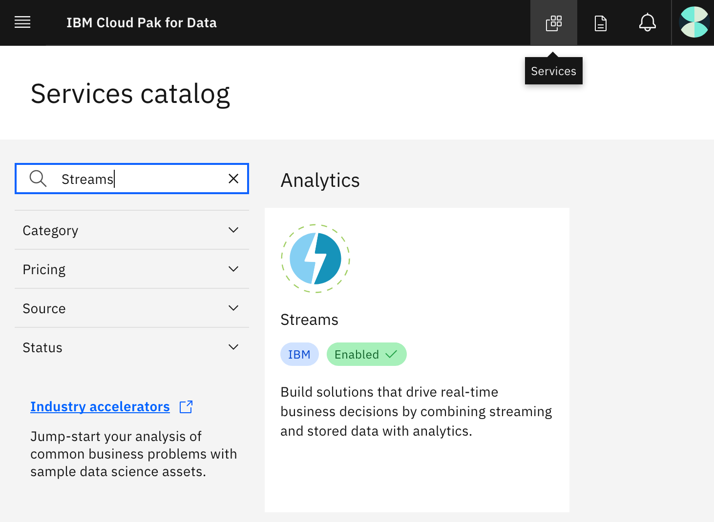

To see your provisioned instances, click on the hamburger (☰) menu icon in the top-left corner of your screen and click **My Instances**.

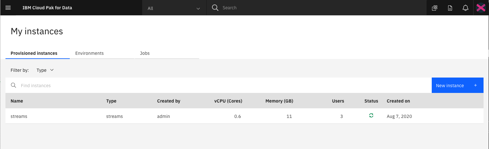

### Step 2. Create a new project in IBM Cloud Pak for Data

In IBM Cloud Pak for Data, we use the concept of a project to collect and organize resources used to achieve a particular goal (resources to build a solution to a problem). Your project resources can include data, collaborators, and analytic assets like notebooks, models, IBM Streams Flows, etc.

Click on the hamburger (☰) menu in the top-left corner of your screen, then click **Projects > New project +**, create an empty project, and enter a unique name for your project, then click **Create**.

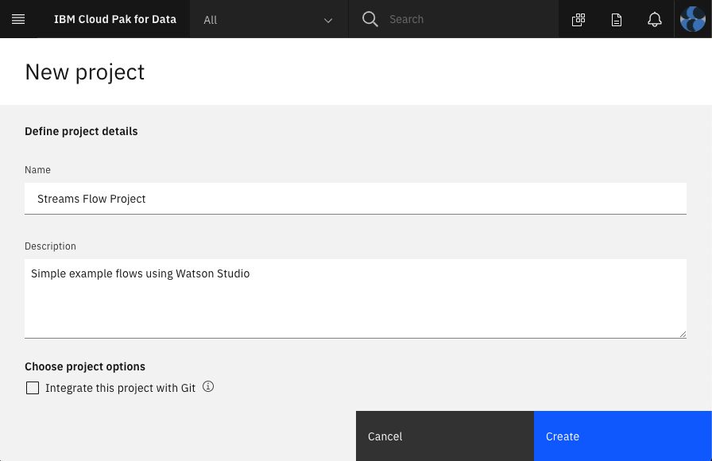

### Step 3. Try the example IBM Streams flow with clickstream data

This example application will ingest clickstream data and filter out events by type. The clickstream data is generated by the **Sample Data** source operator. A **Filter** operator is used to keep only the "add_to_cart" events (discarding the other event data). Finally, a **Debug** target operator is used to help demonstrate the results. When you run the application, you'll be able to watch the data before and after the filter to see that it is working.

1. Click **Add to project +**.
    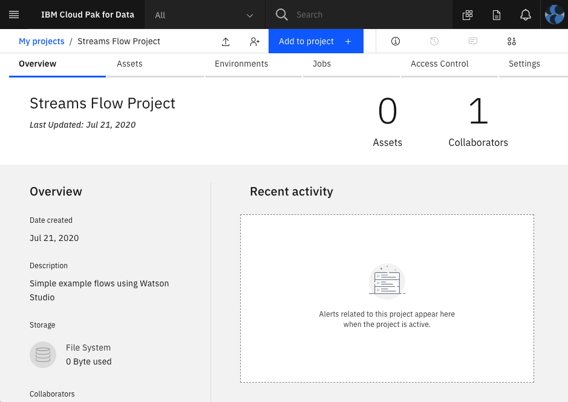

1. Select asset type **Streams flow**.
    

1. Click the **From example** tab, provide a name, select your **Streams instance**, select the **Clickstream Example** card, and click **Create**.
    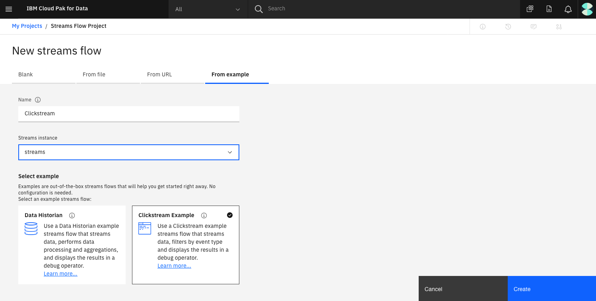

1. Once created, you'll see an application consisting of three operators connected by two streams.
    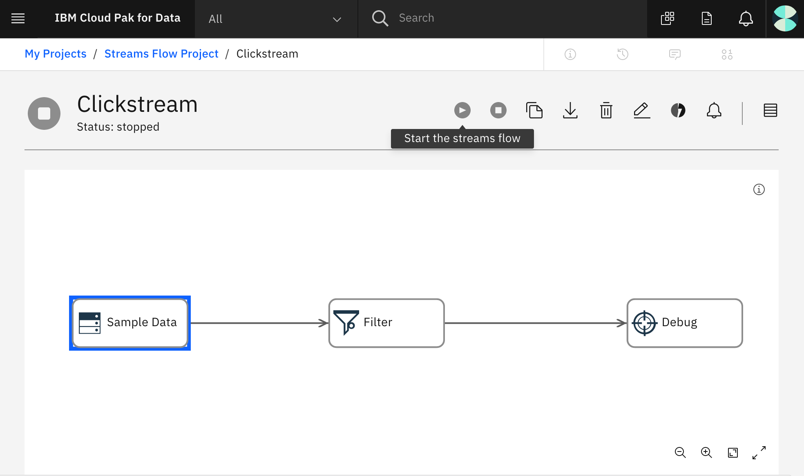

1. Hover over the button bar to see what actions are available. You should see buttons to:
   * Start the IBM Streams flow.
   * Stop the flow (disabled because the flow is already stopped)
   * Make a copy of the flow in this project.
   * Export a copy of the flow to a file.
   * Delete the flow.
   * Edit the flow.
   * Manage IBM Streams.
   * Show notifications.
   * View all flows.

1. Press the **Play** button to build and run your example flow.

1. Once the flow is running, click on the parts of the flow to see more information. Notice the animation shows a stream from the **Sample Data** to **Filter** and from **Filter** to **Debug**. There is much less data in the second stream because the filter is only keeping "add_to_cart" events. Depending on what you select, the tables on the right will give you a view of the data as it streams.
    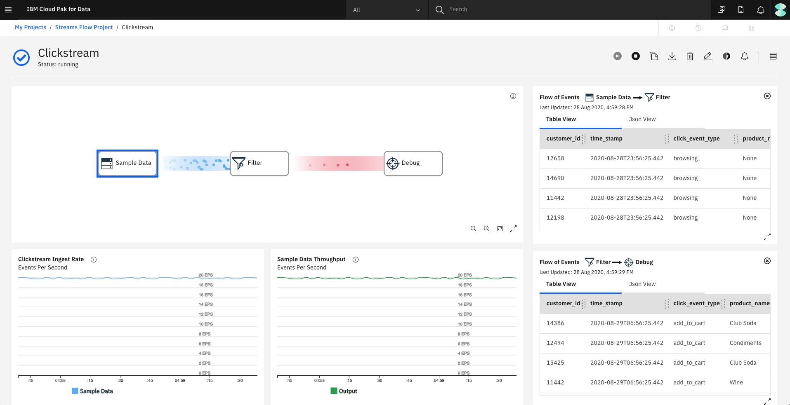

    **Note:** Using **Debug** as the final node is good for visual testing like this. Once the flow is working as desired, the Debug node would be replaced with a different target such as a database, a file, or a Kafka broker.

1. Click the **Stop** button to stop the streaming application.

Congratulations! You ran your first streaming application.

### Step 4. Rebuild the application from scratch

Next, instead of using the example, we'll build it from scratch. This will still be a simple exercise -- we'll leverage the sample data source and debug target operators -- but it will give you a good tour of the editor and show you some additional capabilities. Here's what to do:

1. Go back to your project.
1. Click **Add to project +**.
1. Select asset type **Streams flow**.
1. Click the **Blank** tab, provide a **Name**, select your **Streams instance**, select the **Manually** card, and click **Create**.

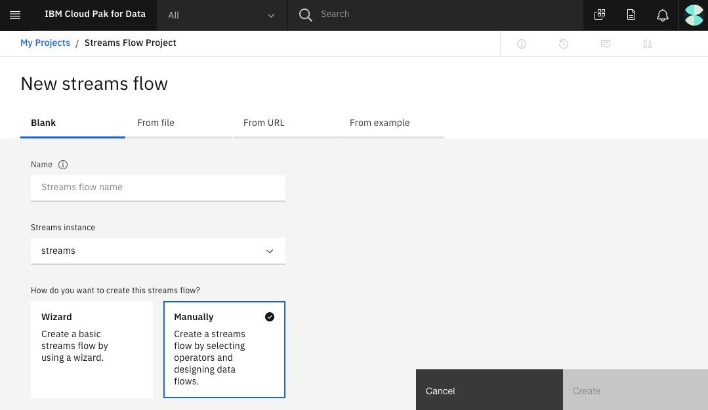

When you create a blank IBM Streams flow, it takes you into the editor. This looks a little different from the example we used earlier. Remember, we could have clicked on the pencil icon to edit the example.

Notice the sidebar has pulldowns for **Sources**, **Targets**, **Processing and Analytics**, **Alerts**, **Connections**, and **WML Deployments**.

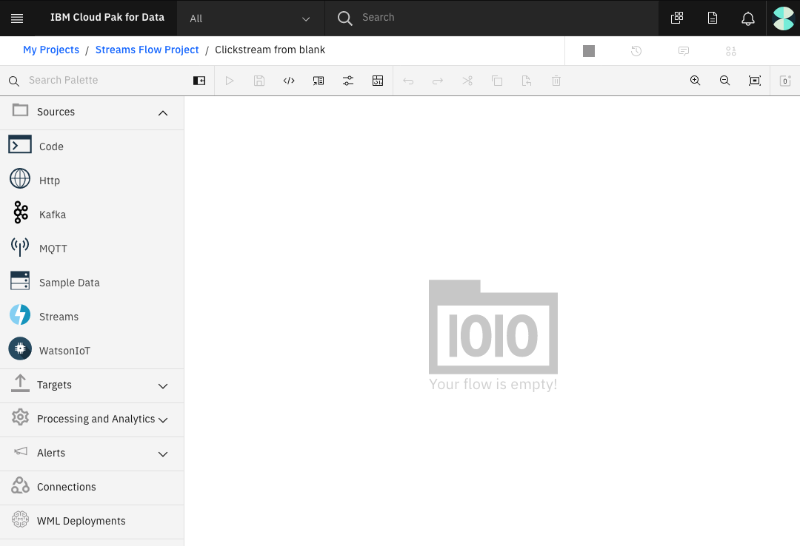

1. Expand **Sources**.
1. Drag and drop **Sample Data** onto the canvas.
1. Expand **Processing and Analytics**.
1. Drag and drop **Filter** onto the canvas. Each operator will have a red dot to indicate errors. You can hover over each red dot to see what the operator is missing. You can also use the notifications icon in the upper-right corner.
    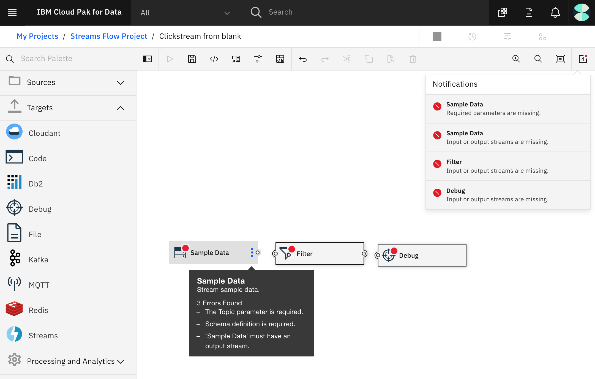

Let's fill in the missing settings and then we'll connect them:

1. Click on **Sample Data**.
1. In the right sidebar and in **Topic**, pull down to select **Clickstream**. Notice you can edit or rearrange the **Output Schema** here, but we don't need to do that now.
    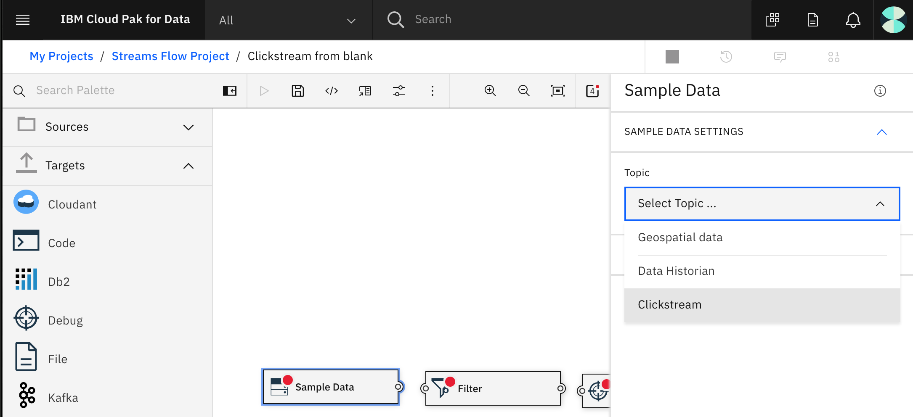

1. Click on your **Filter** operator.

1. In the right sidebar, change the **Conditional Expression** from True to `click_event_type == "add_to_cart"`.
    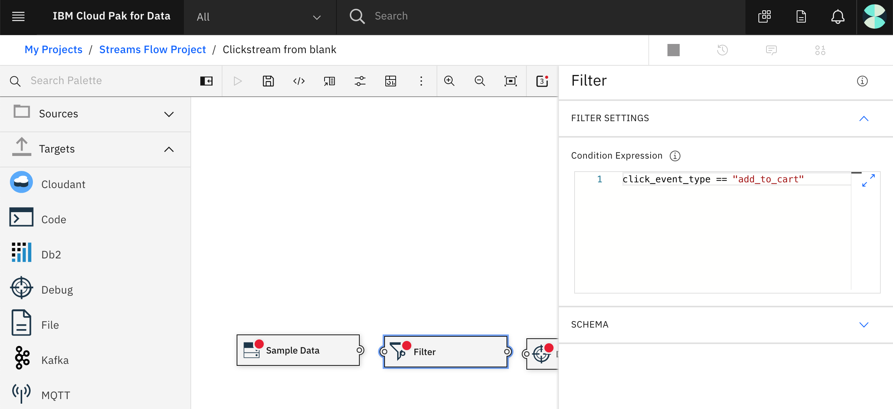

You should have three errors remaining:

* **Sample Data** needs an output stream.
* **Filter** needs an input stream and an output stream.
* **Debug** needs an input stream.

To connect them, drag and drop from the small circle on an output tab to the small circle on an input tab like the following image shows.

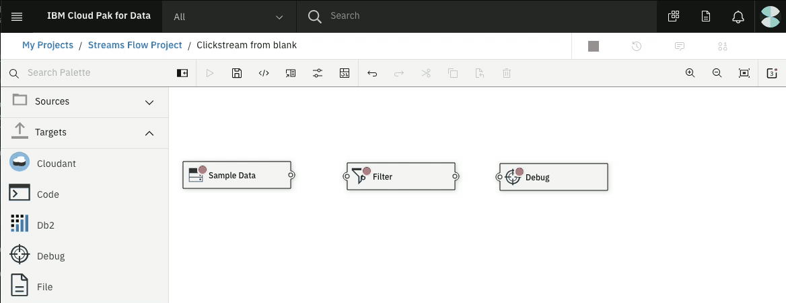

Now you should have resolved all the errors. Next:

1. Use **Save** to save your IBM Streams flow.
1. Use **Play** to build and run it.
1. Click on the streams to see a preview of the data in motion.
1. You should see the same working streaming application that we tried earlier when we used the provided example.
1. Use the **Stop** button to stop the application.

Tip: When you click on each operator, the sidebar gives you the ability to edit the display name.

### Step 5. Add an aggregation operator

Let's try adding an aggregation operator to the example. To demonstrate an **Aggregation** operator, we'll use a 30 second sliding window and keep track of the total product price added to carts by each customer in the sliding window. Instead of outputing all the add-to-cart events, we'll only output the customer ID and the total price.

1. Hover over your **Debug** operator and use the vertical three-dot menu to **Disconnect** the operator.
    

1. Drag and drop an **Aggregation** operator from under **Processing and Analytics** onto the canvas in between the **Filter** and **Debug** operators. **Note:** You can drag your existing operators to arrange them on the canvas and make room for the new one.

1. Drag and drop to connect the output of the **Filter** to the input of **Aggregation** and the output of **Aggregation** to the input of the **Debug** operator.

1. Click on the **Aggregation** operator to fill in the missing information in the sidebar. You must select an **AGGREGATION WINDOW**. For our example, try **sliding**. You can click on the information icon next to Type to get a description of the tumbling window and sliding-window options:

    * For **Time Unit**, select **second**.
    * Set **Number of Time Units** to `30`.
    * Under **Partition By** use the **Select Attribute...** pull-down to select **customer_id**.

1. Under **AGGREGATION DEFINITION**:
    * Under **Group By** use the **Select Attribute...** pull-down to select **customer_id**.
    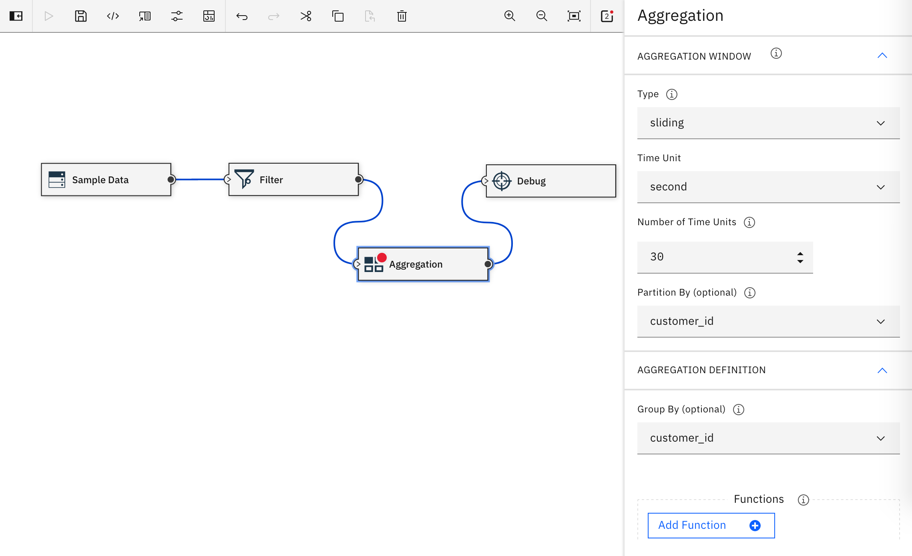

1. Under **Functions**:
    * Set **Output Field Name** to **customer_id**.
    * Set **Function Type** to **PassThrough**.
    * For **Apply Function to**, select the attribute **customer_id**.
    * Click the **Add Function +** button to get a second **Enter Function Details**.
    * Set **Output Field Name** to `sum_product_price`.
    * Set **Function Type** to **Sum**.
    * For **Apply Function to**, select the attribute **product_price**.
    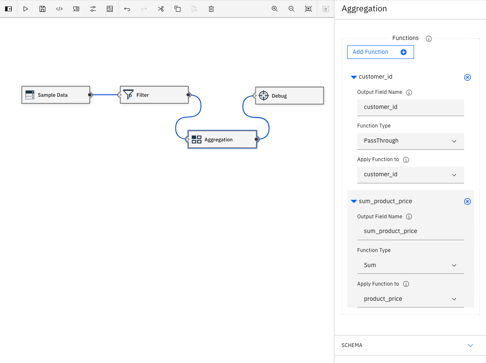

1. Expand **SCHEMA** and look at the **Output Schema**. The output will now include customer_id and sum_product_price that result from our aggregation of the data in this sliding window.

1. Save and run your new streaming application with filtering and aggregation.
    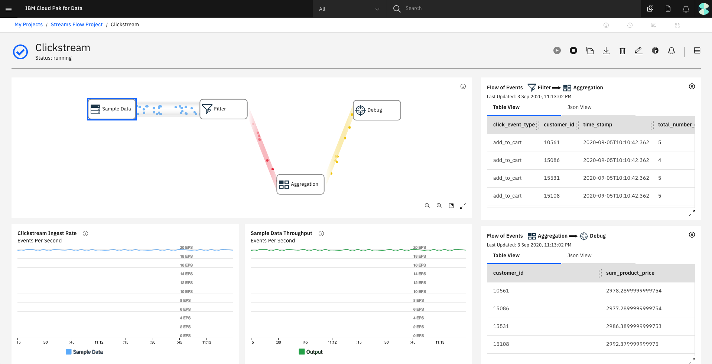

1. Remember to press the **Stop** button to stop the application.

## Next steps

With this simple example -- without writing any code -- we've demonstrated a lot of what you can do with a streaming application. Now you can explore the UI to discover what additional operators you might like to try. You might also want to take a look at copying, exporting, and importing your application while you have a handy example to play with.

This tutorial is part of the IBM Streams learning path. As you continue with this learning path, we'll show you how to use machine learning models for mid-stream AI, and add operators that include Python code. We'll even use the Python API to run a streaming application from a Jupyter Notebook.