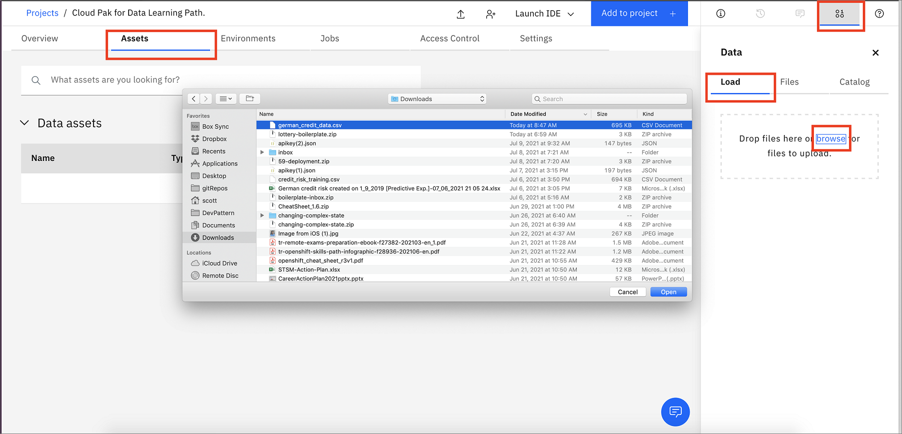
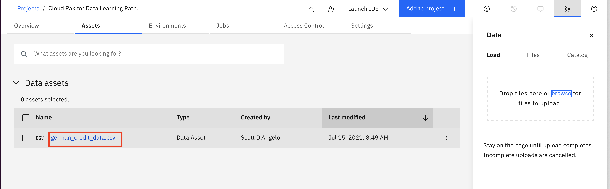
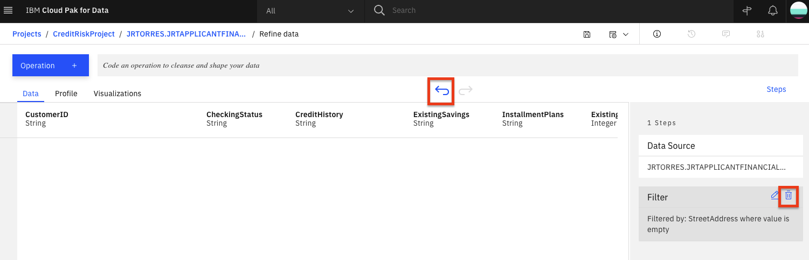
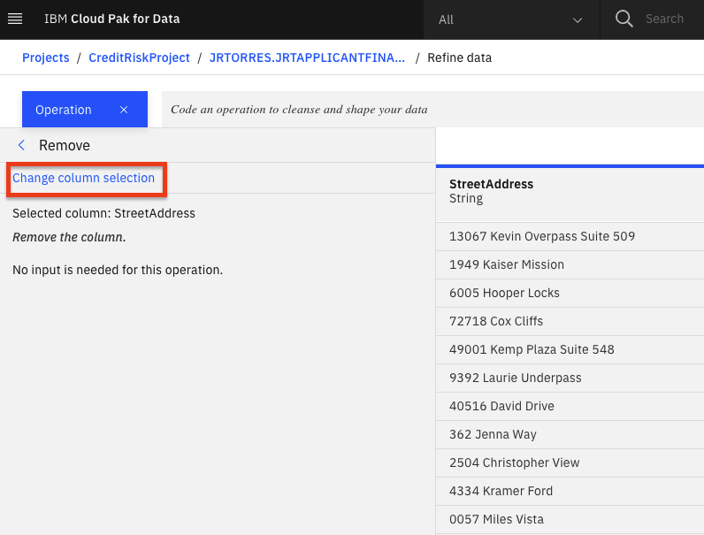
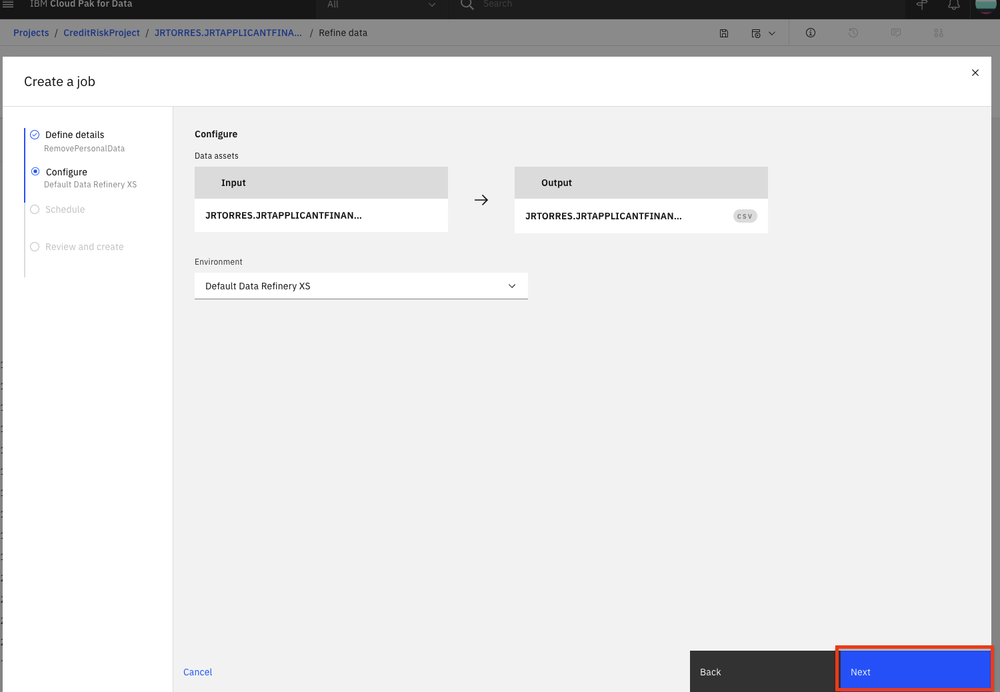
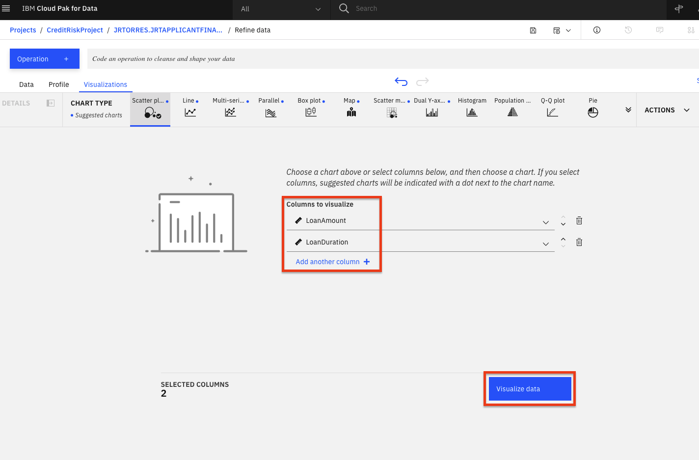
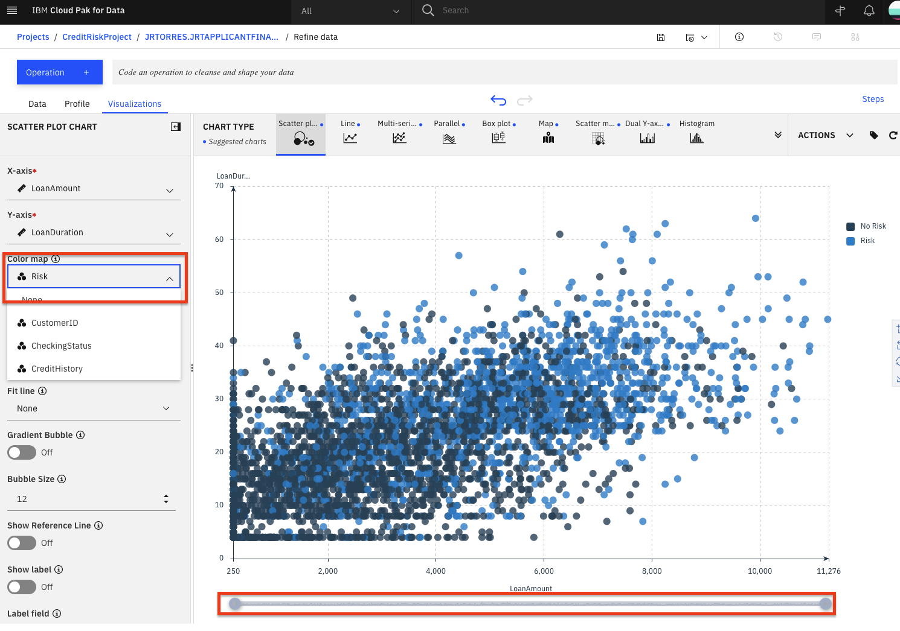
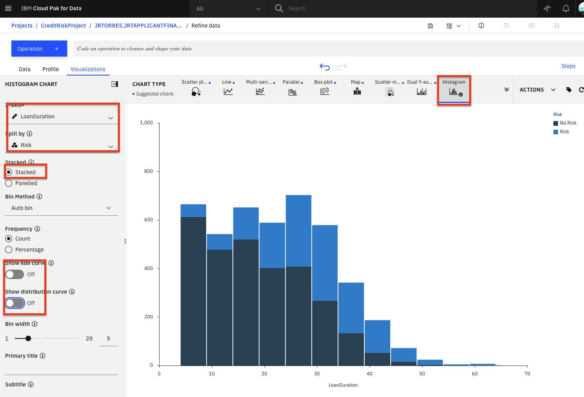

Data RefineryはIBM Watsonの一部で、パブリックなIBM Cloud上のIBM Watson Studioと、IBM Cloud Pak for Dataを使ってオンプレミスで動作するIBM Watson Knowledge Catalogが付属しています。これは、データサイエンティスト、データエンジニア、ビジネスアナリスト向けのセルフサービスのデータ準備クライアントです。これを使えば、大量の生データを分析に適した質の高い消費可能な情報に素早く変換することができます。Data Refineryは、組織全体の人々が信頼できるデータを簡単に探索、準備、提供することができます。

## 学習目標

このチュートリアルでは、以下の方法を学びます。

1. [Data Refinery で使用するために IBM Cloud Pak for Data プラットフォームにデータをロードする](#1-ロード-データ)
1. [コマンドラインのRコードを入力するか、メニューの操作を選択して、サンプル・データ・セットを変換する](#2-refine-data)
1. [データをプロファイルする](#3-profile-data)
1. [チャートやグラフを使ってデータを可視化する](#4-visualize-data)

## 前提条件

* [IBM Cloud Pak for Data](https://www.ibm.com/analytics/cloud-pak-for-data)

## 想定される時間

このチュートリアルの完了には、約45分かかります。

## 1.データの読み込み

### german_credit_data.csv データを Data Refinery に読み込みます。

* [german_credit_data.csv](static/german_credit_data.csv)ファイルをローカルマシンにダウンロードしてください。

* プロジェクトのホームから、「**資産**」タブをクリックします。次に、ダウンロードした[german_credit_data.csv](static/german_credit_data.csv)ファイルを右側のペインの**Drop files here**にドラッグ＆ドロップするか、アップロードするファイルをブラウズするか、**browse**をクリックしてダウンロードした[german_credit_data.csv](static/german_credit_data.csv)ファイルを選択します。

  

* 新しく追加された german_credit_data.csv ファイルをクリックしてください。

  

* 下図のようなデータが表示されます。**Refine**をクリックします。

  

* Data Refineryが起動し、「Data」タブが表示されます。また、データリファイナリーのフローの詳細と、フローの出力がどこに置かれるかを示す情報パネルが表示されます。「情報」パネルの右側にある「X」をクリックして閉じてください。

  

## 2.データを精製する

まず、「データ」タブで、データを整理し、形を整え、洗練させます。データを洗練させると、IBM Data Refinery はデータフローのステップを追跡します。それらを修正したり、ステップを選択してデータ変換の特定の瞬間に戻ったりすることができます。

### トランスフォーメーションフローの作成

* Data Refinery では、[R 構文](https://cran.r-project.org/manuals.html)で直接操作を入力したり、メニューから操作を選択して対話的にデータを変換することができます。例えば、コマンドラインで「filter」と入力すると、表示されている操作の一覧が更新されていくのがわかります。フィルター操作をクリックしてみましょう。

  

* コマンドラインに `filter` オペレーションの構文が表示されます。コマンドライン内の操作名をクリックすると、構文やコマンドの使い方のヒントが表示されます。例えば、クレジットの支払いが完了しているお客様をフィルタリングするには、以下のような式を作ります。フィルタを実行するには、式を `Apply` します。

* データワークフローの `Custom code` ステップでゴミ箱アイコンをクリックすると、このカスタムフィルタを削除することができます。

  

* UIを使って、データの探索と変換を行います。「+Operation」ボタンをクリックします。

  

* `Filter` オペレーションを使って、いくつかの値をチェックしてみましょう。左パネルの「Filter」をクリックします。

  

* `StreetAddress` カラムに空の値がないことを確認したいと思います。`Column` ドロップダウンリストから `StreetAddress` カラムを選択し、`Operator` ドロップダウンリストから *`Is empty`* を選択して、`Apply` ボタンをクリックしてください。

  

*> *注意：選択したカラムが空のレコードがある場合、適用ボタンをクリックした後にそれらが表示されます。このフィルターに該当するレコードがない場合は、サンプリングされる行に選択された列の空の値がないことを意味します。

* ここで、反時計回りの「戻る」矢印をクリックすると、フィルタが削除されます。また、右側の`Steps`パネルで、Filterステップのゴミ箱アイコンをクリックしても、フィルタを削除することができます。

  

* 値が空のレコードを削除することができます。もう一度 `+Operation` をクリックして、今度は `Remove empty rows` を選択します。`StreetAddress`列を選択して、`Next`ボタンをクリックし、最後に`Apply`ボタンをクリックします。

  

* データセットに残したくない列があると判断したとしましょう（機械学習モデルで有用な特徴ではないかもしれないし、それらのデータ属性を他の人にアクセスさせたくないなどの理由があるかもしれません）。ここでは、`FirstName`, `LastName`, `Email`, `StreetAddress`, `City`, `State`, `PostalCode` の各カラムを削除します。

* 「削除する各カラムについて+操作」ボタンをクリックして、「削除」操作を選択する。「Change column selection」オプションをクリックする。

  

* `Select column` ドロップダウンで、削除するカラムのひとつを選択する（例：`FirstName`）。「Next」ボタンをクリックして、「Apply」ボタンをクリックします。カラムが削除されます。上記の各カラムについて繰り返します。

* この時点で、8つのステップからなるデータ変換フローができあがりました。前のセクションで見たように、それぞれのステップを追跡し、円形の矢印を使ってアクションを元に戻す（またはやり直す）こともできます。自分が実行したデータフローのステップを確認するには、「ステップ」ボタンをクリックします。データに対して実行した操作が表示されます。

  

* これらのステップをリアルタイムで変更したり、将来使用するために保存することができます。

### ジョブのスケジュール

Data Refinery では、スケジュールされた時間にジョブを実行し、その出力を保存することができます。このようにして、新しいデータが更新されるたびに、定期的にデータを精査することができます。

* 「ジョブ」アイコンをクリックし、メニューから「Save and create job」を選択します。

  

* ジョブに名前とオプションの説明を付けて、*`Next`* ボタンをクリックします。

  

* ジョブでは、デフォルトの入力データと出力データのアセット、およびランタイム環境を構成します。「次へ」ボタンをクリックします。

  

* ジョブをスケジュールで実行するように設定できます。今のところ、スケジュールをオフにしたまま、*`Next`*ボタンをクリックします。

  

* *`Create and Run`* ボタンをクリックして、このジョブを保存・実行します。

  

* このリファイナリーフローは、プロジェクトの概要ページの「Data Refinery flows」セクションに保存されます。このセクションでは、フローを再訪してステップを編集したり、実行したジョブを確認したりできます。今回は、データの調査に移ります。

## 3.プロファイルデータ

* データリファイナリービューのトップレベルに戻り、「プロファイル」タブをクリックすると、データの属性に関するいくつかの統計やヒストグラムが表示されます。

  

* データプロファイルが読み込まれると、ビューや統計情報からデータを把握することができます。

  * 応募者の年齢の中央値は36歳で、49歳以下の人が多いことがわかります。

  * 応募者の年齢の中央値は 36 歳で、49 歳以下が多い。「no_credits」はほとんどありませんでした。

  * 現在の居住地での滞在期間の中央値は 3 年であった。範囲は1～6年。

## 4.データの可視化

チャートやグラフを使って、データを視覚的に探索してみましょう。これは探索的な段階であり、データの洞察を探していることに注意してください。Data Refineryでは、コーディングすることなく、インタラクティブにこの作業を行うことができます。

* 「Visualizations」タブを選択して、可視化したい列を選択するページを表示します。「可視化する列」のドロップダウンリストから最初の列として`LoanAmount`を選択し、`Add another column`をクリックして別の列を追加します。次に`LoanDuration`を追加して、*`Visualize data`*ボタンをクリックします。システムはデータに基づいて提案されたプロットを選び、上部には提案されたプロットの種類がさらに表示されます。

  

* これらの特徴が、リスクのあるローンにどのような影響を与えるかを知ることに最も興味があることを忘れないでください。そこで、現在の散布図の上に「Risk」を色として追加してみましょう。これで、興味のあるものがあるかどうかを視覚的に確認することができます。左パネルの「カラーマップ」ドロップダウンをクリックして、「リスク」を選択します。また、すべてのデータを表示するには、下部にあるデータセレクタの右側を右にドラッグして、プロット内のすべてのデータを表示します。

  

* このプロットでは、左下よりも右上の方が青（リスク）が多いことがわかります。これは、ローンのリスク度とその期間および金額の間におそらく関係があることを示しており、良いスタートとなっています。金額と期間が高ければ高いほど、ローンのリスクは高くなるようです。興味深いので、ローンのリスク度にローンのデュレーションがどのように関わってくるのか、さらに掘り下げてみましょう。

*> *注：あなたの視覚化で使用されている色は異なる場合があります。チャートの凡例を見て確認してください。

* 「LoanDuration」のヒストグラムをプロットして、何か気付くことができないか見てみましょう。まず、「チャートの種類」から「ヒストグラム」を選択します。

* 左側の 'X 軸' に `LoanDuration` を選択し、'Split By' セクションで `Risk` を選択し、`Stacked` オプションをチェックし、`Show kde curve` トグルのチェックを外し、`Show distribution curve` トグルのチェックを外します。以下の画像のようなチャートが表示されるはずです。

  

* デュレーションが長くなると、青いバー（リスクの高いローン数）が大きくなり、紺色のバー（リスクの高くないローン数）が小さくなるように見えます。これは、期間が長いローンは、一般的にリスクが高い可能性が高いことを示しています。しかし、私たちはより多くの情報を必要としています。

* 次に、ローンの目的別に見たときに、期間に基づくローンのリスク性について、何らかの洞察があるかどうかを調べてみます。そのために、ヒートマップのプロットを作成してみましょう。

* ページ上部の「チャートタイプ」セクションで、右の矢印を開き、「ヒートマップ」を選択します。

  

* 次に、列のセクションで「Risk」を、「Row」のセクションで「LoanPurpose」を選択します。さらに、ローン期間の影響を見るために、サマリーセクションで「Mean」を選択し、「Value」セクションで「LoanDuration」を選択します。

  

* 最もリスクの低いローンは、新車購入のためのローンで、平均して10年であることがわかります。このセルの左側では、同じ目的で借りたローンの平均期間が約15年であることから、よりリスクが高いと考えられる。つまり、ローンの期間が長ければ長いほど、リスクが高くなる可能性が高いと結論づけることができます。対照的に、その他のカテゴリーでは、リスクの高いローンもそうでないローンも、平均的な期間は同じであることがわかり、その他のタイプのローンでは、ローンの長さとリスクの高さにはほとんど関係がないと結論づけることができる。

* 一般的に、各行において、左右の列の色の差が大きいほど、ローンの長さがそのローンカテゴリーのリスク性に関与している可能性が高いと考えられる。

**** それでは、プロットをカスタマイズしてみましょう。「*Actions」パネルでは、「Start over」、「Download chart details」、「Download chart image」、「Global visualization preferences」*（注：アイコンにカーソルを合わせると名称が表示されます）などのタスクを実行することができます。Action "の隣にあるドロップダウン矢印をクリックします。次に、メニューから「グローバル表示設定」をクリックします。

  

* `Global visualization preferences` の中で、`Titles`, `Tools`, `Theme`, `Notifications` の操作ができることがわかります。「Theme」タブをクリックして、カラースキームを「Dark」に更新します。「適用」ボタンをクリックすると、すべてのチャートの色がこれを反映したものになります。いろいろなテーマを試してみて、お好みのものを見つけてください。

  

## Conclusion

Data Refineryの機能の一部をご紹介しました。Rコードを使ってデータを変換したり、データタイプの変更、空の行の削除、列の完全削除など、列に対するさまざまな操作を行う方法を見ました。次に、データフローのすべてのステップが記録されているので、ステップを削除したり、繰り返したり、個々のステップを編集したりすることができます。また、データを素早くプロファイリングし、各列のヒストグラムや統計を見ることができました。最後に、散布図、ヒストグラム、ヒートマップを作成して、ローンのリスク度と期間、目的との関係を調べ、より詳細な視覚化を行いました。