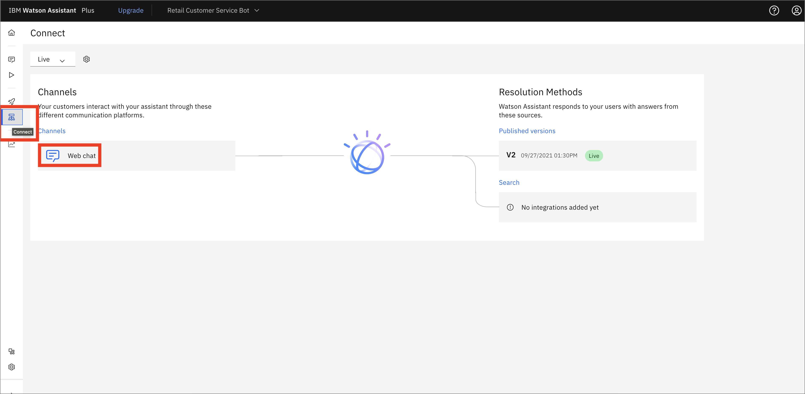
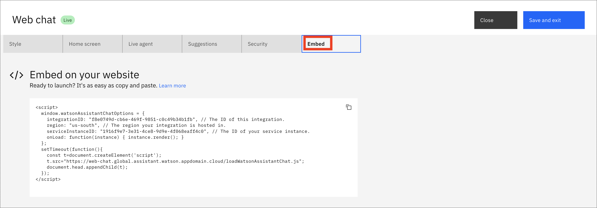
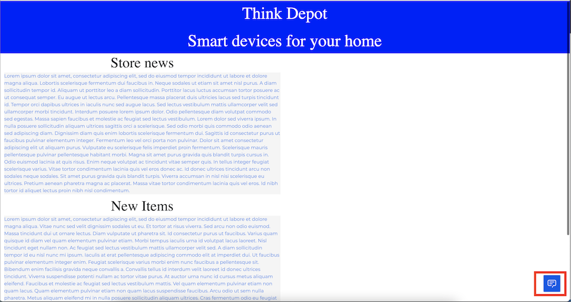
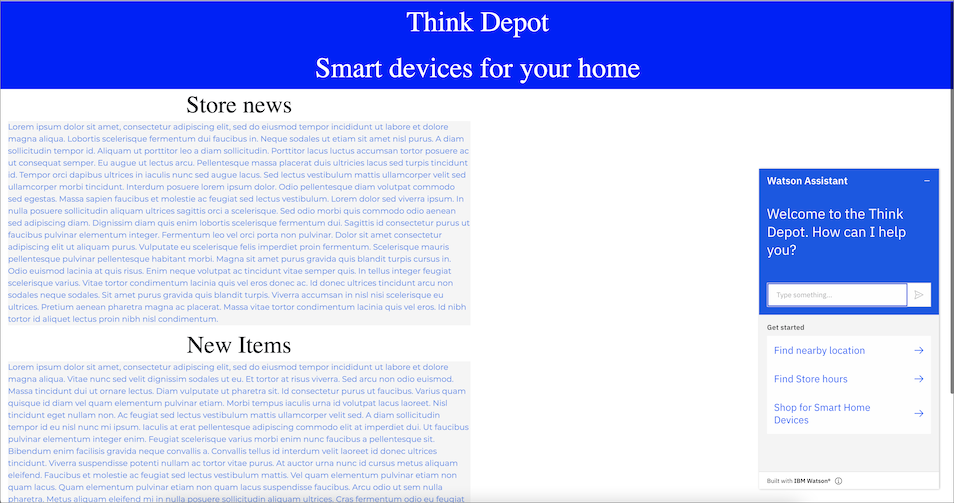

Watson Assistantは、自然言語を用いたインテリジェントなインターフェースを提供することで、問題解決を支援します。GUIツールとAPIの柔軟性を組み合わせることで、AIを使ったアプリケーションやツールをシンプルかつ効率的にパワーアップすることができます。アシスタントを公開した後は、簡単にWebページに埋め込むことができます。

## 前提条件

このチュートリアルに従うには、[Watson Assistant](https://cloud.ibm.com/catalog/services/watson-assistant?cm_sp=ibmdev-_-developer-tutorials-_-cloudreg)の公開されたインスタンスが必要です。[Watson Assistant ラーニングパス](/learningpaths/get-started-watson-assistant) に従っている場合は、すでにこのインスタンスを持っていますが、どの Assistant チャットボットでも使用できます。

さらに、チャットボットを埋め込むための Web ページが必要です。まだお持ちでない場合は、この[index.html](static/index.html)ファイルをテンプレートとして使用することができます（必要に応じて[styles.css](static/styles.css)を使用してください）。

## ステップ

### ステップ 1.ウェブチャットの機能を確認する

1. 「接続」アイコンをクリックし、「チャンネル」の下の「ウェブチャット」をクリックします。

    

1. 「スタイル」タブでは、色やチャットボットの名前を変更したり、アバターを追加することができます。

[    ![スタイル]タブ](images/style-tab.png)

1. 「ホーム画面」タブをクリックします。ここでは、Greetingメッセージを設定したり、会話のきっかけを3つまで設定することができます。この例では、デフォルトにいくつかの変更が加えられています。

    ![ホーム画面]タブ(images/home-screen-tab.png)

[ライブエージェント]タブでは、サービスデスクへの接続を設定し、アシスタントがお客様をライブエージェントに転送できるようにします。この機能については、[詳細](https://cloud.ibm.com/docs/assistant?topic=assistant-deploy-web-chat#deploy-web-chat-haa&cm_sp=ibmdev-_-developer-tutorials-_-cloudreg)を参照してください。

「サジェスチョン」タブでは、お客様が助けを必要としているときに、メッセージオプションとして表示されるサジェスチョンを提供します。提案は会話に適応し、試すべき回答とサポートへの接続の両方を提供することができます。[詳細](https://cloud.ibm.com/docs/assistant?topic=assistant-deploy-web-chat#deploy-web-chat-alternate&cm_sp=ibmdev-_-developer-tutorials-_-cloudreg)をご覧ください。このチュートリアルではサジェスチョンを使用しませんので、**オン**のチェックマークをクリックしてオフにしてください。

[セキュリティ]タブでは、機密データの暗号化や、ウェブチャットやユーザーの認証を行うための機能をご紹介します。[詳細](https://cloud.ibm.com/docs/assistant?topic=assistant-web-chat-security&cm_sp=ibmdev-_-developer-tutorials-_-cloudreg)についてはこちらをご覧ください。

### ステップ 2.チャットボットを埋め込むためのコードを取得する

1. **Embed**タブをクリックして、チャットボットをウェブサイトに埋め込むために必要なコードを取得します。

    

1. チャットボットAPIの使用方法については、[API docs](https://web-chat.global.assistant.watson.cloud.ibm.com/docs.html?to=api-configuration&cm_sp=ibmdev-_-developer-tutorials-_-cloudreg)を参照してください。

### ステップ3.コードをWebページに貼り付けます。

1. このコードを[index.html](static/index.html)ページに貼り付けます。

    

1. ウェブチャットのアイコンをクリックして、チャットボットを起動し、Watson Assistant サービスとのライブ対話を可能にします。

    

## 結論

このチュートリアルでは、Watson Assistant の Web チャットツールの機能の一部を紹介しました。機能の一部を変更する方法や、Assistant のチャットボットをウェブサイトに埋め込む方法を学びました。このツールを使えば、ライブでのやり取りに使えるチャットボットを素早く簡単に組み込むことができます。