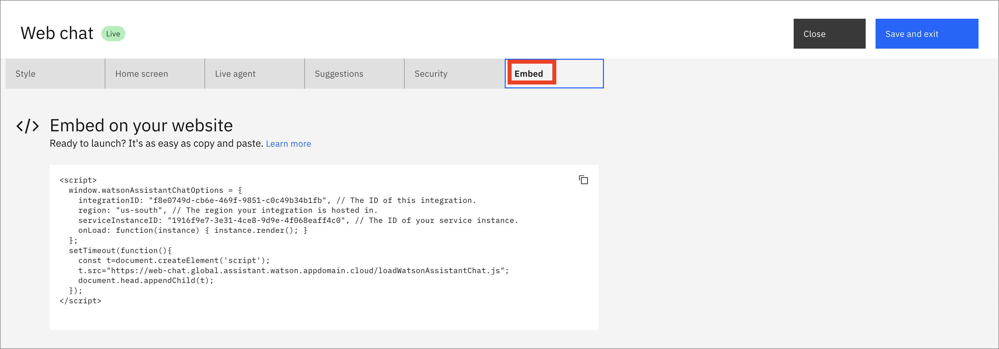
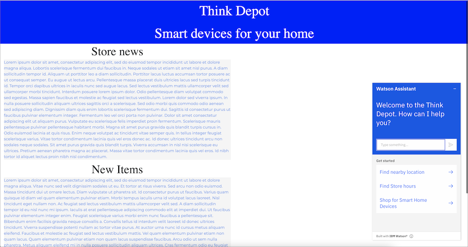

Watson Assistant can help you solve a problem by providing an intelligent interface using natural language. The flexibilities of the GUI tools and APIs combine to allow you to power applications and tools using AI simply and efficiently. After your assistant is published, you can easily embed it into a web page.

## Prerequisites

To follow this tutorial, you need a published instance of [Watson Assistant](https://cloud.ibm.com/catalog/services/watson-assistant?cm_sp=ibmdev-_-developer-tutorials-_-cloudreg). If you are following the [Watson Assistant learning path](/learningpaths/get-started-watson-assistant) then you will already have this, but you can use any Assistant chatbot.

Additionally, you need a web page to embed the chatbot in. If you don't already have one, you can use this [index.html](static/index.html) file as a template (use the [styles.css](static/styles.css) if you want).

## Steps

### Step 1. Explore the Web chat features

1. Click  the **Connect** icon, and under Channels click **Web chat**.

    

1. Under the Style tab, you can change the colors and chatbot name or add an avatar.

    

1. Click the **Home Screen** tab. Here, you can set the Greeting message and have up to three conversation starters. In this example, there are some modifications to the defaults.

    

The Live agent tab lets you set up a service desk connection so that your assistant can transfer customers to live agents. [Learn more](https://cloud.ibm.com/docs/assistant?topic=assistant-deploy-web-chat#deploy-web-chat-haa&cm_sp=ibmdev-_-developer-tutorials-_-cloudreg) about this feature.

The Suggestions tab provides suggestions that appear as message options when your customers need some help. They adapt to the conversation and can offer both responses to try and connections to support. [Learn more](https://cloud.ibm.com/docs/assistant?topic=assistant-deploy-web-chat#deploy-web-chat-alternate&cm_sp=ibmdev-_-developer-tutorials-_-cloudreg). You won't use Suggestions in this tutorial, so click the **On** check mark to turn it off.

Explore the features on the Security tab to encrypt sensitive data as well as to authenticate and authorize your web chat and users. [Learn more](https://cloud.ibm.com/docs/assistant?topic=assistant-web-chat-security&cm_sp=ibmdev-_-developer-tutorials-_-cloudreg) about this.

### Step 2. Get the code to embed your chatbot

1. Click the **Embed** tab to get the code that you need to embed the chatbot into your website.

    

1. See the [API docs](https://web-chat.global.assistant.watson.cloud.ibm.com/docs.html?to=api-configuration&cm_sp=ibmdev-_-developer-tutorials-_-cloudreg) for details on using the chatbot API.

### Step 3. Paste the code into your web page

1. Paste this code into your [index.html](static/index.html) page (or whatever the equivalent is for your website).

    

1. Click the webchat icon to launch the chatbot and allow live interaction with the Watson Assistant service.

    

## Conclusion

This tutorial showed you some of the features of the Web chat tool for Watson Assistant. You learned how to change some of the features, and how to embed an Assistant chatbot into a website. This tool lets you quickly and easily integrate a chatbot that can be used for live interactions.