---
also_found_in:
- learningpaths/get-started-with-deep-learning/
authors: ''
check_date: '2021-10-29'
completed_date: '2020-10-29'
components:
- tensorflow
- jupyter
- cloud-pak-for-data
draft: false
excerpt: Eager Executionを探求し、TensorFlowでデフォルトで有効にすることの利点について学びます。
last_updated: '2020-10-29'
meta_description: Eager Executionを探求し、TensorFlowでデフォルトで有効にすることの利点について学びます。
meta_keywords: TensorFlow, Eager Execution, machine learning
meta_title: TensorFlowでのEager Executionの有効化
primary_tag: artificial-intelligence
related_content:
- slug: learning-path-machine-learning-for-developers
  type: series
- slug: cloud-pak-for-data-learning-path
  type: series
- slug: explore-autoai
  type: learningpaths
subtitle: Eager Executionを探究し、TensorFlowでデフォルトで有効にすることの利点について学ぶ。
tags:
- deep-learning
- machine-learning
title: TensorFlowでのEager Executionの有効化
---

TensorFlowは、機械学習モデルの構築と展開を容易にするエンドツーエンドのオープンソース機械学習プラットフォームである。TensorFlowアプリケーションは、データフローグラフとして知られる構造を使用します。TensorFlowバージョン1.0のデフォルトでは、すべてのグラフはTensorFlowセッション内で実行されなければならず、グラフ全体を一度に実行することしかできず、計算グラフのデバッグが困難になっていた。このデフォルトを回避してコードをデバッグできるようにする唯一の方法は、Eager Executionを使うことだった。

Eager Executionは、研究と実験のための柔軟な機械学習プラットフォームで、以下の機能を提供します。

* 直感的なインターフェースにより、コードを自然に構成し、Pythonのデータ構造を使用することができます。小さなモデルと小さなデータを素早く繰り返し実行することができます。
* 直感的なインターフェースにより、コードを自然に構成し、Pythonのデータ構造を使用することができます。
* グラフ制御フローではなく、Python制御フローを使用した自然な制御フローにより、動的モデルの仕様を簡素化します。

TensorFlow 2.xでは、Eager Executionがデフォルトで有効になっており、TensorFlowのコードを1行ずつ実行して評価することができる。

## 学習目標

このチュートリアルでは、Eager Executionの影響と、TensorFlow 2.xでEager Executionがデフォルトで有効になっていることの利点を見ていきます。Jupyter Notebookを使用して、Eager Executionが無効と有効の両方の場合のTensorFlowの動作を観察します。以下の方法を学びます。

* IBM Watson&reg; Studio on IBM Cloud&reg; Pak for Data as a Serviceを使用してJupyter Notebookを実行する。
* Eager Execution の無効化と有効化
* Eager Execution の利点を理解します。

## 前提条件

このチュートリアルに参加するためには、以下の前提条件が必要です。

* [IBM Cloud Account](https://cloud.ibm.com/registration?cm_sp=ibmdev-_-developer-tutorials-_-cloudreg)が必要です。
* [IBM Cloud Pak for Data](https://www.ibm.com/jp-ja/products/cloud-pak-for-data)

## 見積もり時間

このチュートリアルを完了するには、約30分かかります。

## ステップ

1. [IBM Cloud Pak for Data as a Service をセットアップする](#set-up-ibm-cloud-pak-for-data-as-a-service)
1. [新しいプロジェクトを作成し、ノートブックをインポートする](#create-a-new-project-and-import-the-notebook)
1. [ノートブックに目を通す](#read-through-the-notebook)
1. [ノートブックの前半部分を実行する](#run-the-first-half-of-the-notebook)
1. [カーネルを再起動する](#restart-the-kernel)
1. [ノートブックの後半を実行する](#run-the-second-half-of-the-notebook)

### Data as a ServiceのIBM Cloud Pakの設定

1. ブラウザを開き、IBM Cloudの認証情報で[IBM Cloud](https://cloud.ibm.com/login?cm_sp=ibmdev-_-developer-tutorials-_-cloudreg)にログインします。

     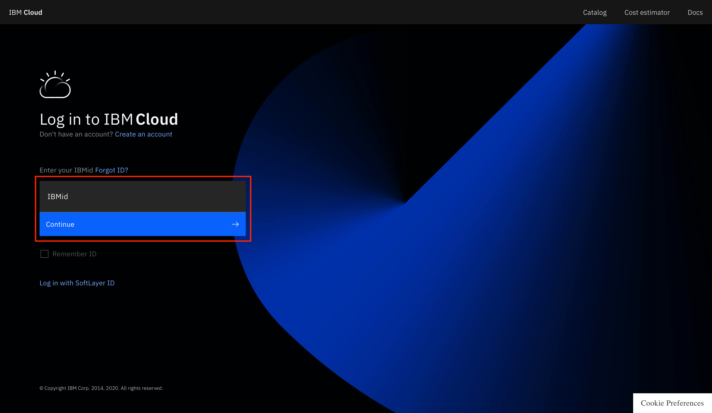

1. 上部にある検索バーに「Watson Studio」と入力します。すでに Watson Studio のインスタンスを持っている場合は、それが表示されているはずです。表示されている場合は、それをクリックします。ない場合は、「Catalog Results」の下にある「**Watson Studio**」をクリックして、新しいサービスインスタンスを作成します。

    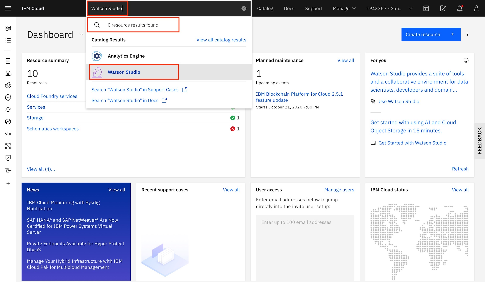

1. 新しいサービスインスタンスを作成する場合、作成するプランの種類を選択します。このチュートリアルでは、Lite（無料）プランで十分です）。「**Create**（作成）」をクリックします。

    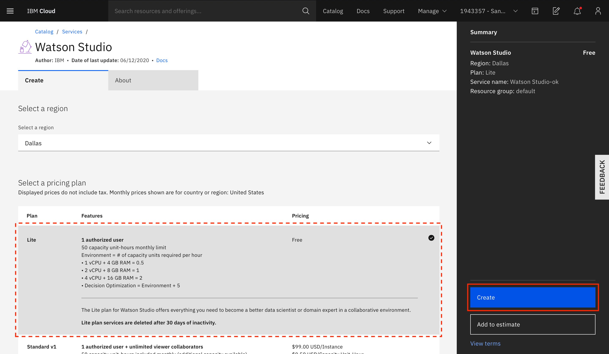

1. サービスインスタンスのランディングページで **Get Started** をクリックします。

    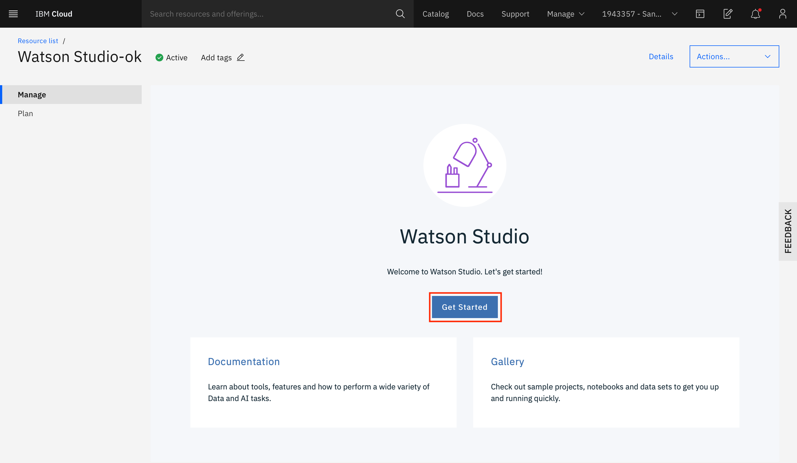をクリックします。

    これにより、IBM Cloud Pak for Data as a Service のランディングページが表示されます。

1. 右上隅にある自分のアバターをクリックし、名前の下にある**Profile and settings**をクリックします。

    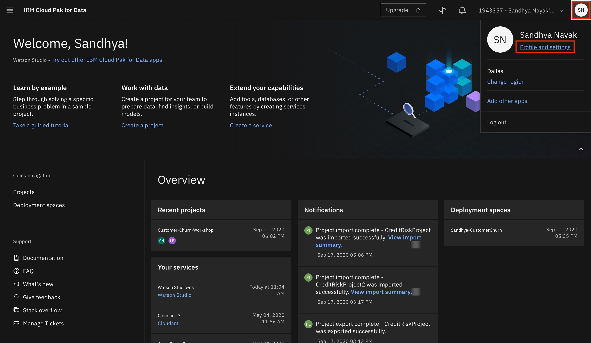をクリックします。

1. [Services] タブに切り替えます。Your Cloud Pak for Data サービスの下に Watson Studio サービスインスタンスが表示されているはずです。

    また、Watson Knowledge Catalog や Watson Machine Learning などの他のサービスを IBM Cloud Pak for Data as a Service アカウントに関連付けることもできます。これらは「Try our available services」の下に表示されます。

    ここに示す例では、Watson Knowledge Catalog サービス・インスタンスがすでに IBM Cloud アカウントに存在しているため、自動的に IBM Cloud Pak for Data as a Service アカウントに関連付けられています。その他のサービス（この例では Watson Machine Learning）を追加するには、「Try our available services」の下にあるサービスのタイル内で「**Add**」をクリックします。

    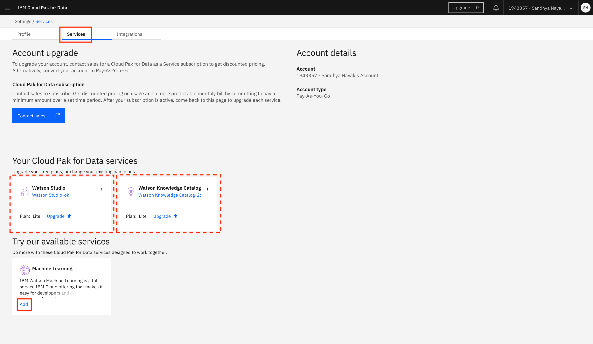

1. 作成するプランの種類を選択して（Liteプランで十分です）、**Create**をクリックします。

    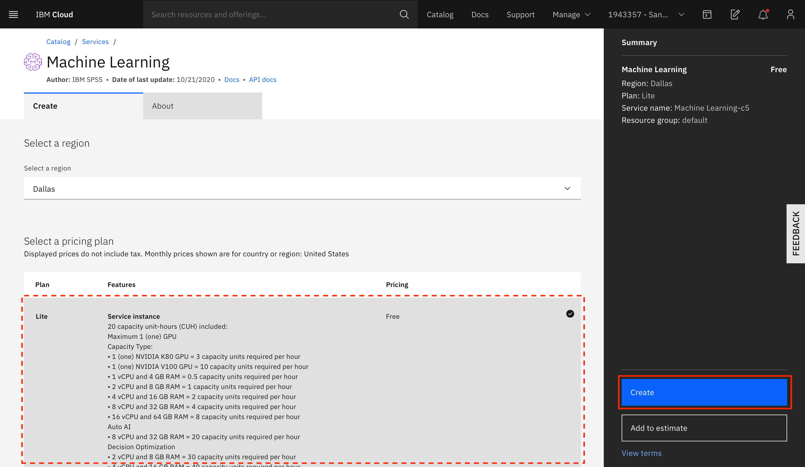

サービス・インスタンスが作成されると、IBM Cloud Pak for Data as a Service インスタンスに戻ります。サービスが IBM Cloud Pak for Data as a Service アカウントに関連付けられたことが確認できます。

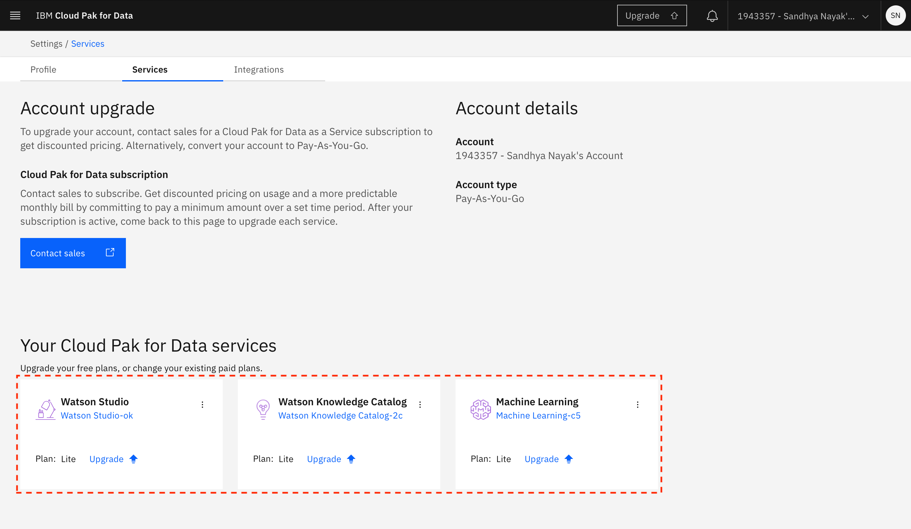

### 新しいプロジェクトを作成し、ノートブックをインポートする

1. 左側のハンバーガーメニュー(☰)に移動し、**すべてのプロジェクトを表示**を選択します。画面が読み込まれたら、「**新規作成 +**」または「**新規プロジェクト +**」をクリックして、新しいプロジェクトを作成します。

    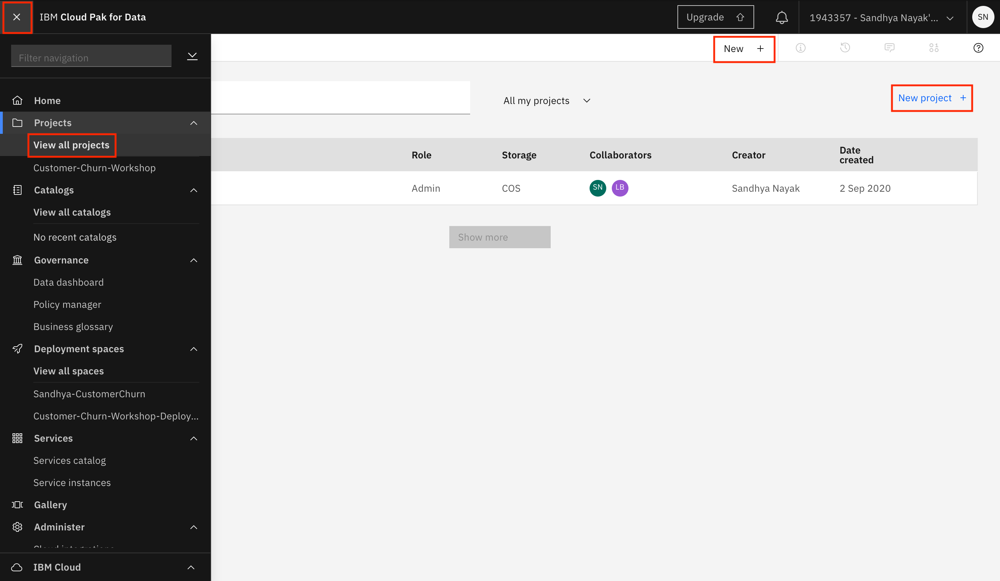

1. **空のプロジェクトを作成する**を選択します。

    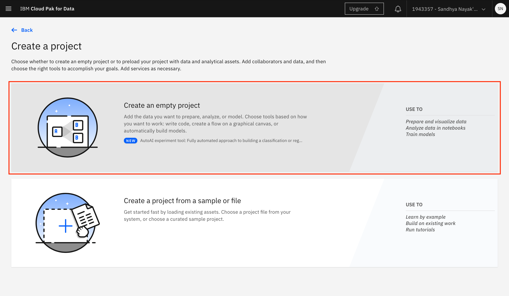

1. プロジェクトの名前を入力します。IBM Cloud Object Storage インスタンスをプロジェクトに関連付ける必要があります。IBM Cloud アカウントに IBM Cloud Object Storage サービス・インスタンスがすでにある場合は、自動的にここに入力されます。そうでない場合は、**Add** をクリックします。

    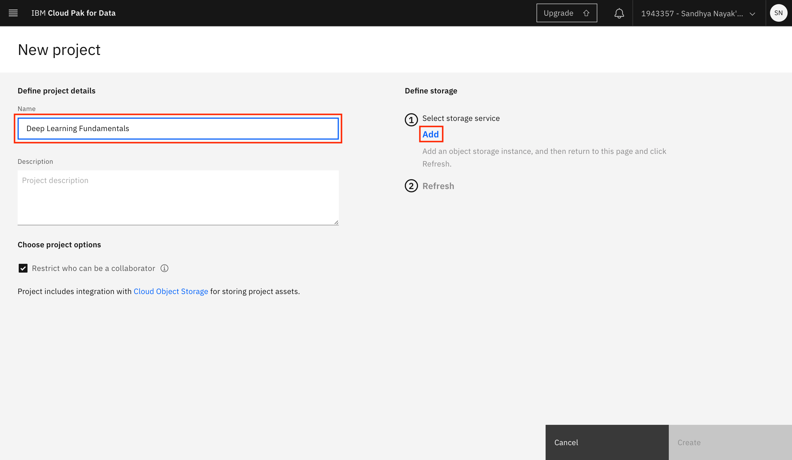

1. 作成するプランの種類を選択し（このチュートリアルではLiteプランで十分です）、**Create**をクリックします。

    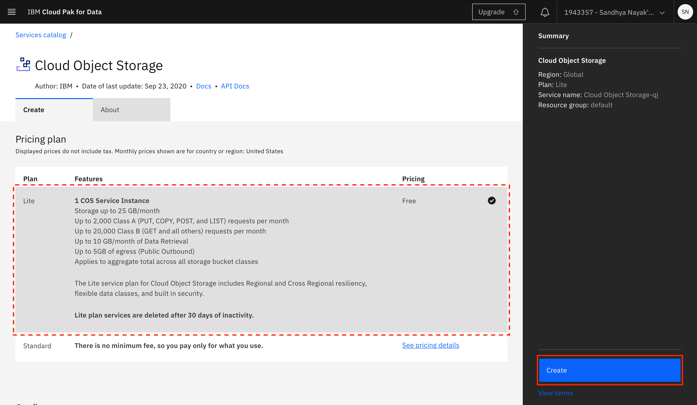

1. プロジェクトの作成画面で、**Refresh**をクリックします。

    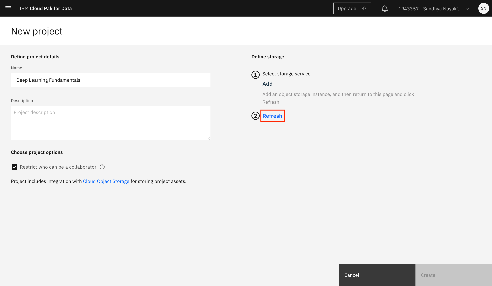

1. 「Storage」に作成したIBM Cloud Object Storageインスタンスが表示されたら、**Create**をクリックします。

    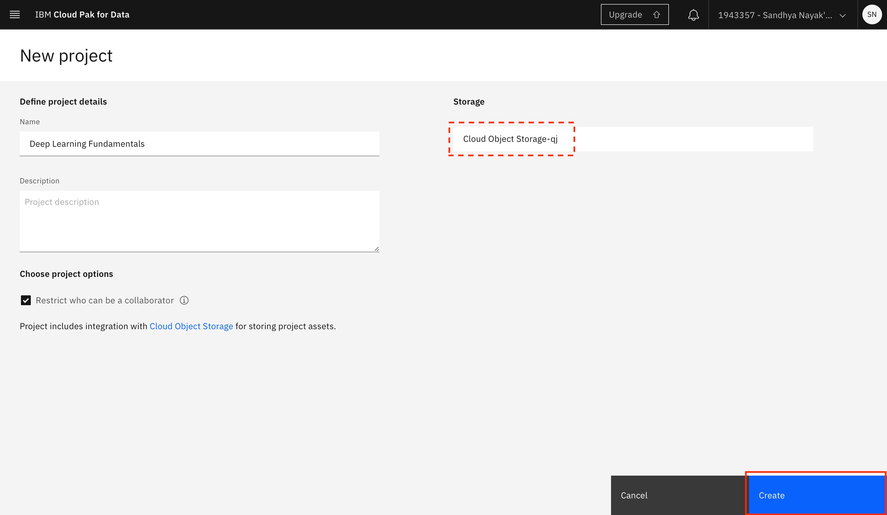をクリックします。

1. プロジェクトが作成されたら、ノートブックをプロジェクトに追加することができます。**Add to project +**をクリックして、**Notebook**を選択します。

    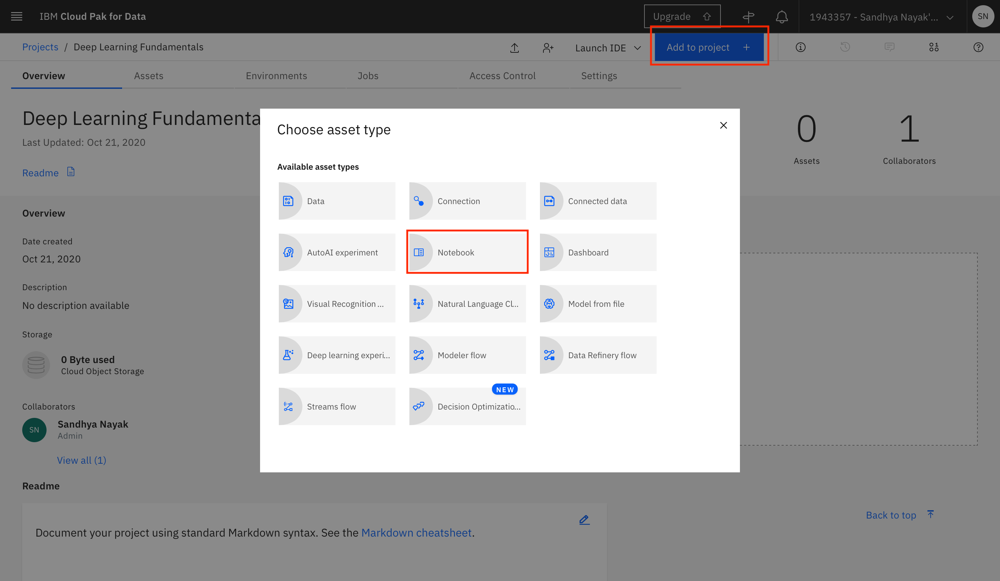

1. [From URL]タブに切り替えます。ノートブックの名前を`Eager_Execution_in_TensorFlow_2.x`とし、ノートブックのURLを`https://raw.githubusercontent.com/IBM/dl-learning-path-assets/main/fundamentals-of-deeplearning/notebooks/Eager_Execution_in_TensorFlow_2.x.ipynb`とします。

1. 「ランタイムの選択」ドロップダウンメニューで、「**Default Python 3.7 XXS (1 vCPU 4 GB RAM)**」（リストの最初のオプション）を選択します。このランタイムは、利用可能なランタイムの中で最も小さく、1時間あたりの容量ユニットの消費量も0.5と最も少ない。このチュートリアルでは、このランタイムで十分です。**Create**をクリックします。

    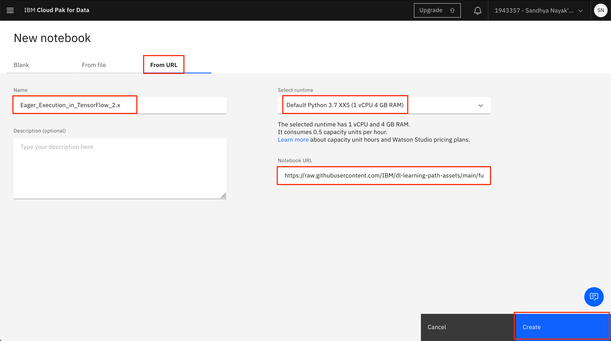

1. Jupyter Notebookが読み込まれ、カーネルの準備ができたら、ノートブック内のセルの実行を開始します。

    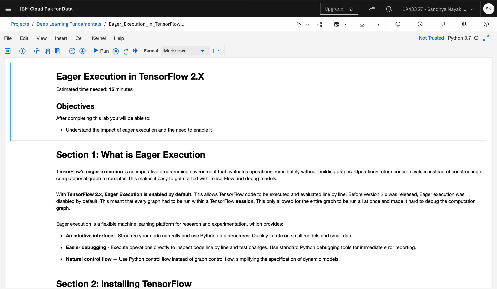

> **大切なこと**:*メモリ資源を節約するために、用が済んだらノートブックのカーネルを停止するようにしてください*。

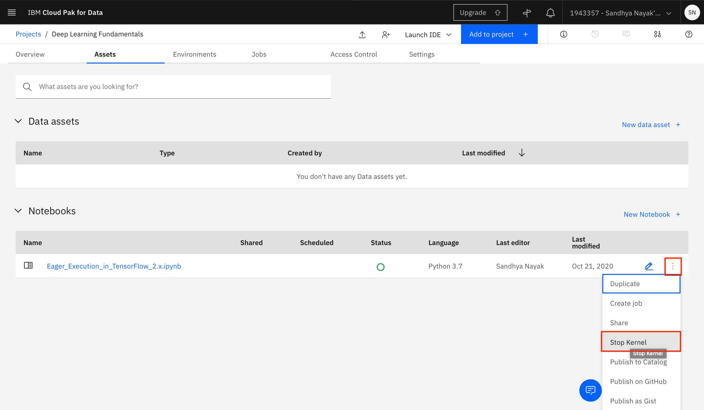

> **注**:プロジェクトに含まれるJupyterノートブックは、出力がクリアされています。すでに出力が完了したノートブックをご覧になりたい方は、[example notebook](https://github.com/IBM/dl-learning-path-assets/blob/main/fundamentals-of-deeplearning/examples/Eager_Execution_in_TensorFlow_2.x_with_output.ipynb)をご参照ください。

### ノートブックに目を通す

ノートブックの各セクションに目を通し、概要を把握します。ノートブックは、テキスト（マークダウンや見出し）のセルとコードのセルで構成されています。マークダウンセルには、コードが何をするために設計されているかのコメントが書かれています。

セルを個別に実行するには、各セルをハイライト表示し、ノートブックの上部にある「**実行**」をクリックするか、セルを実行するためのキーボードショートカット（**Shift + Enter **、ただしプラットフォームによって異なる）を使用します。*セルが実行されている間は、セルの左にアスタリスク（`[*]`）が表示されます。そのセルの実行が終了すると、連番が表示されます（例：`[17]`）。

> **Note**:ノートブックに記載されているコメントの中には，コードの特定の部分を修正するように指示しているものがあります．セルを実行する前に、指示通りに変更してください。

このノートブックは複数のセクションに分かれています。

* セクション1では、Eager Executionとは何か、その機能は何かを説明しています。
* セクション 2 では、TensorFlow をインストールする手順を説明します。
* セクション 3 では、Eager Execution が無効な場合に TensorFlow の操作がどのように動作するかを示す例を説明します。
* セクション4では、Eager Executionが有効な場合にTensorFlowの操作がどのように機能するかを示す例を説明しています。なお、これらの手順を実行する前に、カーネルを再起動する必要があります。
* セクション5では、Eager Executionが有効な場合に可能な、ダイナミックコントロールフローの例を示します。

### ノートブックの前半部分の実行

ノートブックの第 2 章と第 3 章のセルを実行します。これらのセクションのコードは、TensorFlowバージョン2.2.0とその前提条件をインストールし、Eager Executionが無効の場合にTensorsに対する一連の操作がどのように動作するかを示しています。グラフ全体が（***Session***を使用して）実行されるまで、Tensor変数の中間値が利用できないことがわかります。これでは、コードのデバッグが困難になります。

なお、`a = tf.constant(np.array([1., 2., 3.]))`というコードで作成されたオブジェクトの型は、`tensorflow.python.framework.ops.Tensor`です。

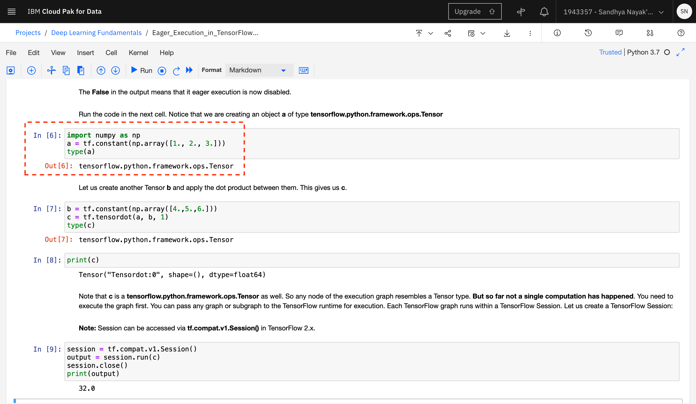

### カーネルを再起動する

次に、Eager Executionを有効にして同じコードを実行します。ただし、Eager Execution の有効化または無効化は、Tensors が作成される前のコードの先頭で行う必要があります。このため、Eager Execution を有効にする前に、カーネルを再起動する必要があります。

1. カーネルを再起動するには、**Kernel**メニューから**Restart**をクリックします。表示されるオプションで、**Restart**をクリックして、カーネルを再起動することを確認します。

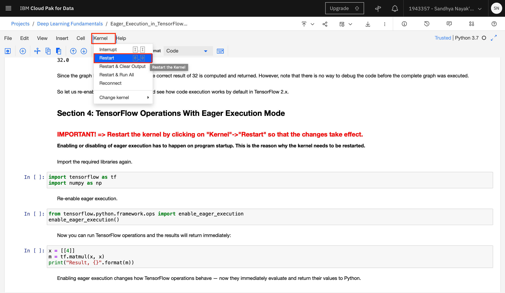

### 後半のノートブックの実行

1. カーネルが再起動されたら、セクション4の最初のコードセルを実行します。実行時にコードの左端に表示される連番がリセットされ、セクション4のimport文の連番が`[1]`になっていることに注意してください。

    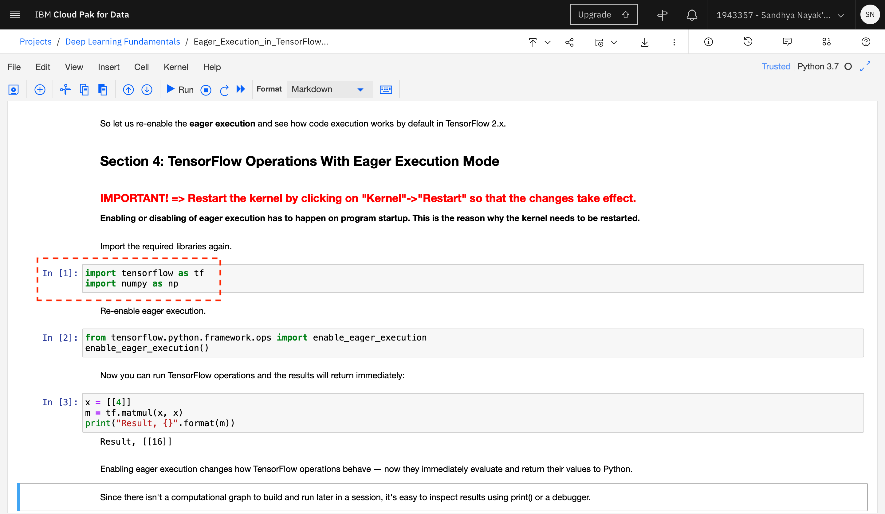

1. 引き続き、セクション4とセクション5の残りのセルを実行します。セクション 4 では、Eager Execution が有効になっており、以前に実行された同じコードが再実行されています。Eager Execution が有効になっているので、コード全体を ***Session*** の一部として実行しなくても、コードをデバッグしたり、中間変数の値をチェックしたりすることができます。

    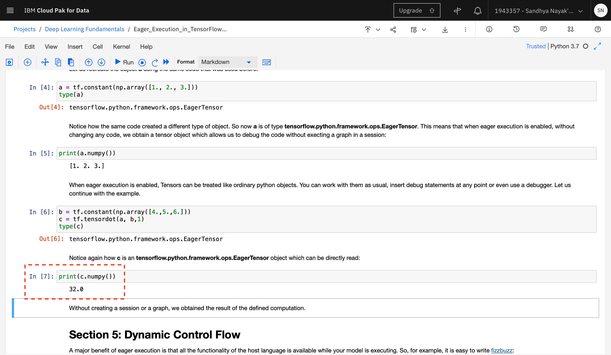

1. また、Eager Executionが有効になっている場合、コード `a = tf.constant(np.array([1., 2., 3.]))` は、代わりに `tensorflow.python.framework.ops.EagerTensor` 型のオブジェクトを作成することに注意してください。つまり、Eager Executionを有効にしたり無効にしたりしても、同じコードを再利用することができるのです。

    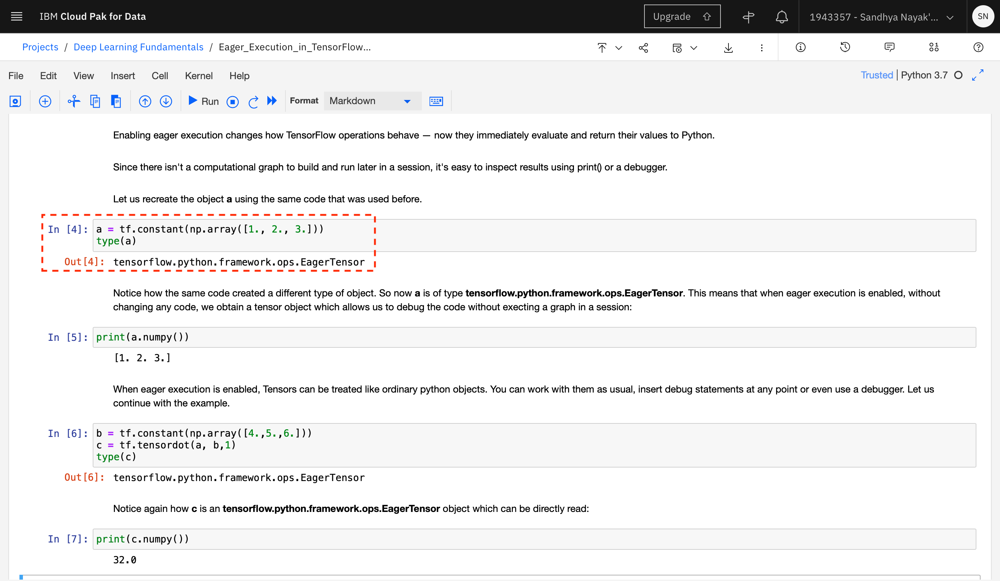

1. セクション5のコードセルを実行する。セクション5のコードでは、Eager Executionを有効にすると、Tensorがホスト言語の他の変数のように動作し、Tensorの制御フローで`if`、`while`、`for`などのホスト言語の制御文やループを使用することもできることを示している。

## まとめ

このチュートリアルでは、Eager Execution の影響と、TensorFlow 2.x で Eager Execution をデフォルトで有効にすることのメリットを見ていきました。また、IBM Cloud Pak for Data as a Service 上の Watson Studio を使用して Jupyter Notebook を実行する方法、Eager Execution を無効にしたり有効にしたりする方法、Eager Execution のメリットを学びました。