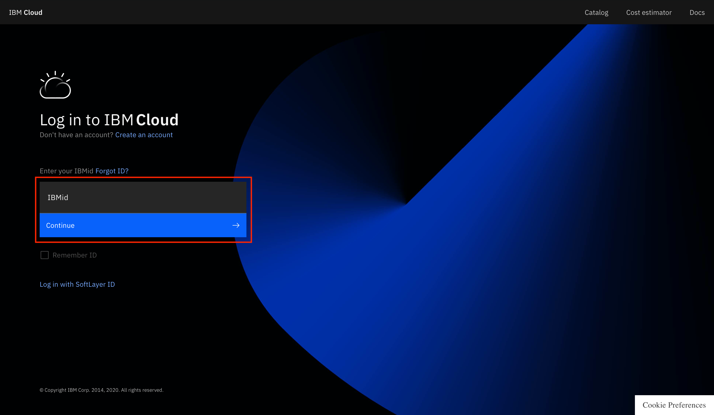
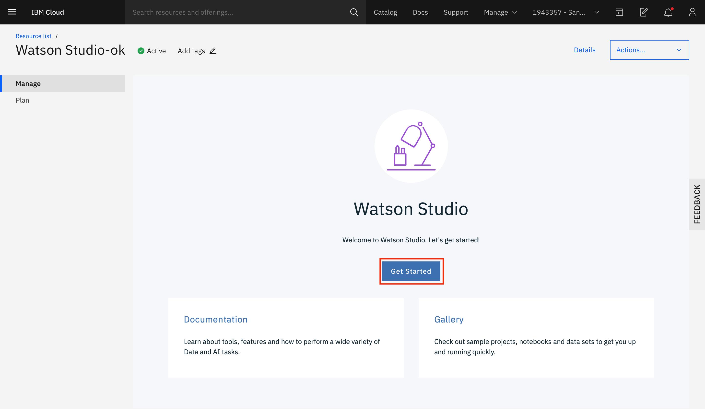
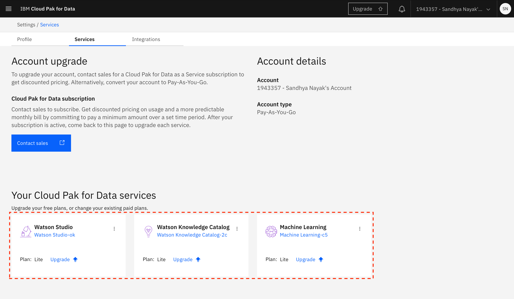
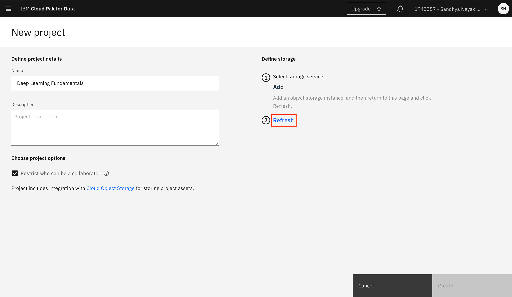
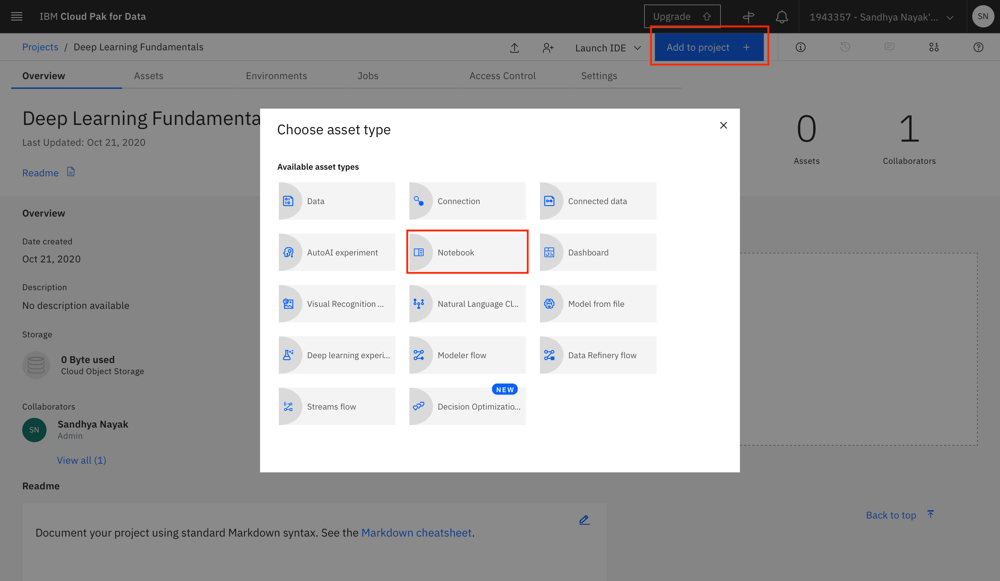
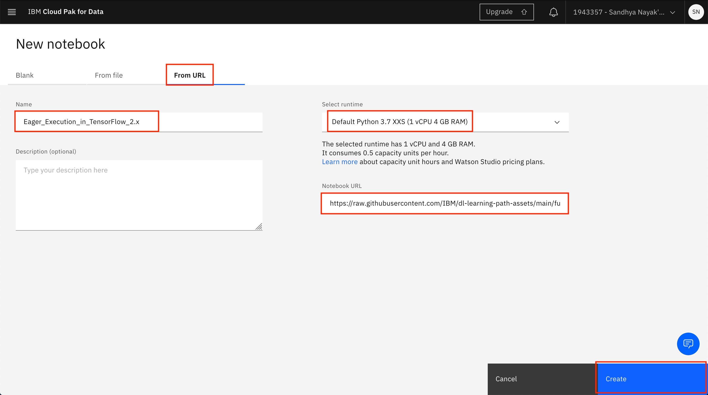
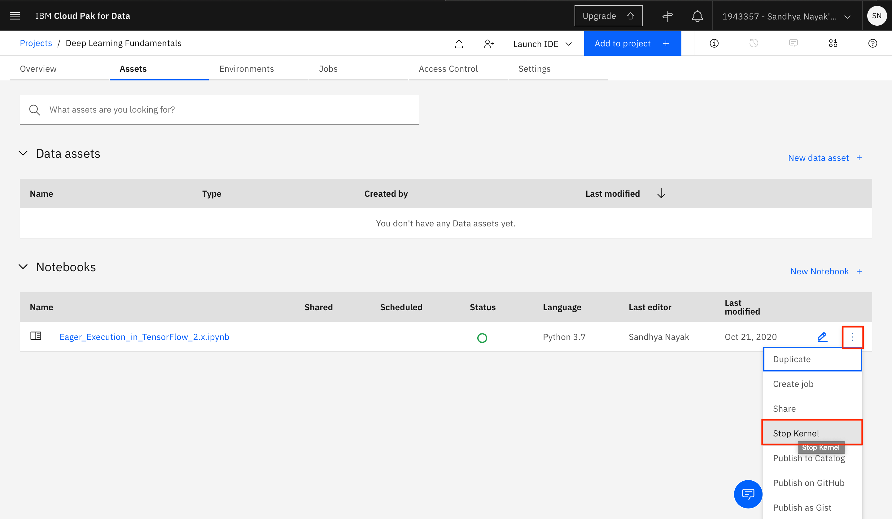
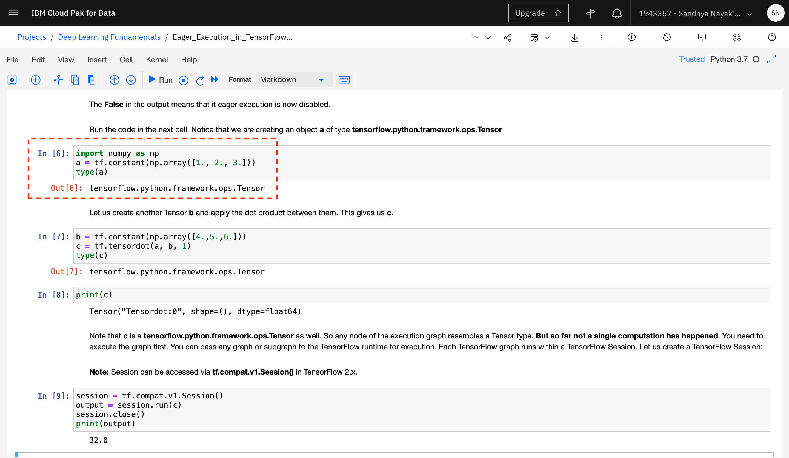
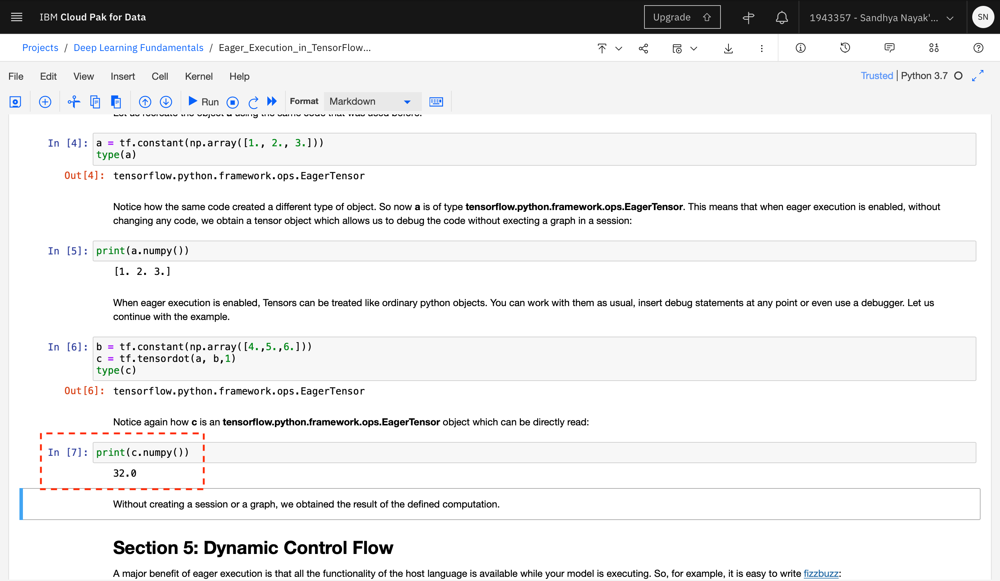

---
also_found_in:
- learningpaths/get-started-with-deep-learning/
authors: ''
check_date: '2021-10-29'
completed_date: '2020-10-29'
components:
- tensorflow
- jupyter
- cloud-pak-for-data
draft: false
excerpt: Explore Eager Execution and learn about the benefits of having it enabled
  by default in TensorFlow.
last_updated: '2020-10-29'
meta_description: Explore Eager Execution and learn about the benefits of having it
  enabled by default in TensorFlow.
meta_keywords: TensorFlow, Eager Execution, machine learning
meta_title: Enable Eager Execution in TensorFlow
primary_tag: artificial-intelligence
related_content:
- slug: learning-path-machine-learning-for-developers
  type: series
- slug: cloud-pak-for-data-learning-path
  type: series
- slug: explore-autoai
  type: learningpaths
subtitle: Explore Eager Execution and learn about the benefits of having it enabled
  by default in TensorFlow
tags:
- deep-learning
- machine-learning
title: Enable Eager Execution in TensorFlow
---

TensorFlow is an end-to-end open source machine learning platform that makes it easier to build and deploy machine learning models. A TensorFlow application uses a structure known as a data flow graph. By default in TensorFlow version 1.0, every graph had to be run within a TensorFlow session, which only allowed for the entire graph to be run all at once, and made it hard to debug the computation graph. The only way to get around this default and be able to debug the code was to use Eager Execution.

Eager Execution is a flexible machine learning platform for research and experimentation that provides:

* An intuitive interface so that the code can be structured naturally and use Python data structures. Small models and small data can be quickly iterated.
* Easier debugging by providing the ability to call operations directly to inspect code line by line and test changes.
* A natural control flow using a Python control flow instead of a graph control flow, which simplifies the specification of dynamic models.

With TensorFlow 2.x, Eager Execution is enabled by default, and allows TensorFlow code to be run and evaluated line by line.

## Learning objectives

This tutorial looks at the impact of Eager Execution and the benefits of having it enabled by default in TensorFlow 2.x. You'll use a Jupyter Notebook to observe the behavior of TensorFlow when Eager Execution is both disabled and enabled. You'll learn how to:

* Run a Jupyter Notebook using IBM Watson&reg; Studio on IBM Cloud&reg; Pak for Data as a Service
* Disable and enable Eager Execution
* Understand the benefits of Eager Execution

## Prerequisites

The following prerequisites are required to follow the tutorial:

* An [IBM Cloud Account](https://cloud.ibm.com/registration?cm_sp=ibmdev-_-developer-tutorials-_-cloudreg)
* [IBM Cloud Pak for Data](https://www.ibm.com/products/cloud-pak-for-data)

## Estimated time

It should take you approximately 30 minutes to complete the tutorial.

## Steps

1. [Set up IBM Cloud Pak for Data as a Service](#set-up-ibm-cloud-pak-for-data-as-a-service)
1. [Create a new Project and import the notebook](#create-a-new-project-and-import-the-notebook)
1. [Read through the notebook](#read-through-the-notebook)
1. [Run the first half of the notebook](#run-the-first-half-of-the-notebook)
1. [Restart the kernel](#restart-the-kernel)
1. [Run the second half of the notebook](#run-the-second-half-of-the-notebook)

### Set up IBM Cloud Pak for Data as a Service

1. Open a browser, and log in to [IBM Cloud](https://cloud.ibm.com/login?cm_sp=ibmdev-_-developer-tutorials-_-cloudreg) with your IBM Cloud credentials.

     

1. Type `Watson Studio` in the search bar at the top. If you already have an instance of Watson Studio, it should be visible. If so, click it. If not, click **Watson Studio** under Catalog Results to create a new service instance.

    

1. Select the type of plan to create if you are creating a new service instance. A Lite (free) plan should suffice for this tutorial). Click **Create**.

    

1. Click **Get Started** on the landing page for the service instance.

    

    This should take you to the landing page for IBM Cloud Pak for Data as a Service.

1.  Click your avatar in the upper-right corner, then click **Profile and settings** under your name.

    

1. Switch to the Services tab. You should see the Watson Studio service instance listed under Your Cloud Pak for Data services.

    You can also associate other services such as Watson Knowledge Catalog and Watson Machine Learning with your IBM Cloud Pak for Data as a Service account. These are listed under Try our available services.

    In the example shown here, a Watson Knowledge Catalog service instance already exists in the IBM Cloud account, so it's automatically associated with the IBM Cloud Pak for Data as a Service account. To add any other service (Watson Machine Learning in this example), click **Add** within the tile for the service under Try our available services.

    

1. Select the type of plan to create (a Lite plan should suffice), and click **Create**.

    

After the service instance is created, you are returned to the IBM Cloud Pak for Data as a Service instance. You should see that the service is now associated with your IBM Cloud Pak for Data as a Service account.

### Create a new project and import the notebook

1. Navigate to the hamburger menu (☰) on the left, and choose **View all projects**. After the screen loads, click **New +** or **New project +** to create a new project.

    

1. Select **Create an empty project**.

    

1. Provide a name for the project. You must associate an IBM Cloud Object Storage instance with your project. If you already have an IBM Cloud Object Storage service instance in your IBM Cloud account, it should automatically be populated here. Otherwise, click **Add**.

    

1. Select the type of plan to create (a Lite plan should suffice for this tutorial), and click **Create**.

    

1. Click **Refresh** on the project creation page.

    

1. Click **Create** after you see the IBM Cloud Object Storage instance you created displayed under Storage.

    

1. After the project is created, you can add the notebook to the project. Click **Add to project +**, and select **Notebook**.

    

1. Switch to the From URL tab. Provide the name of the notebook as `Eager_Execution_in_TensorFlow_2.x` and the Notebook URL as `https://raw.githubusercontent.com/IBM/dl-learning-path-assets/main/fundamentals-of-deeplearning/notebooks/Eager_Execution_in_TensorFlow_2.x.ipynb`.

1. Under the Select runtime drop-down menu, select **Default Python 3.7 XXS (1 vCPU 4 GB RAM)** (the first option in the list). This is the smallest runtime available and consumes the least capacity units per hour (0.5). This runtime should suffice for this tutorial. Click **Create**.

    

1. After the Jupyter Notebook is loaded and the kernel is ready, you can start executing the cells in the notebook.

    

> **Important**: *Make sure that you stop the kernel of your notebooks when you are done to conserve memory resources.*

> **Note**: The Jupyter Notebook included in the project has been cleared of output. If you would like to see the notebook that has already been completed with output, refer to the [example notebook](https://github.com/IBM/dl-learning-path-assets/blob/main/fundamentals-of-deeplearning/examples/Eager_Execution_in_TensorFlow_2.x_with_output.ipynb).

### Read through the notebook

Spend some time looking through the sections of the notebook to get an overview. A notebook is composed of text (markdown or heading) cells and code cells. The markdown cells provide comments on what the code is designed to do.

You run cells individually by highlighting each cell, then either clicking **Run** at the top of the notebook or using the keyboard shortcut to run the cell (**Shift + Enter **, but this can vary based on the platform). While the cell is running, an asterisk (`[*]`) shows up to the left of the cell. When that cell has finished running, a sequential number appears (for example, `[17]`).

> **Note**: Some of the comments in the notebook are directions for you to modify specific sections of the code. Perform any changes as indicated before running the cell.

The notebook is divided into multiple sections.

* Section 1 explains what Eager Execution is and what its features are.
* Section 2 provides instructions for installing TensorFlow.
* Section 3 walks you through an example that demonstrates how TensorFlow operations work when Eager Execution is disabled.
* Section 4 walks you through an example that demonstrates how TensorFlow operations work when Eager Execution is enabled. Note that before these instructions are followed, you must restart the kernel.
* Section 5 gives an example of dynamic control flow, which is possible when Eager Execution is enabled.

### Run the first half of the notebook

Run the cells in Sections 2 and 3 of the notebook. The code in these sections installs TensorFlow version 2.2.0 and its prerequisites, and then demonstrates how a set of operations on Tensors behaves when Eager Execution is disabled. You can see that the intermediate values of the Tensor variables are not available until the entire graph is executed (using a ***Session***). This makes it difficult to debug the code.

Note that the type of the object created using the code `a = tf.constant(np.array([1., 2., 3.]))` is `tensorflow.python.framework.ops.Tensor`.

### Restart the kernel

Next, you'll enable Eager Execution and run the same code. However, Eager Execution enabling or disabling must happen at the beginning of the code before any Tensors are created. Therefore, before enabling Eager Execution, you must restart the kernel.

1. To restart the kernel, go to the **Kernel** menu, and click **Restart**. In the option that appears, click **Restart** to confirm that you want to restart the kernel.

### Run the second half of the notebook

1. After the kernel is restarted, run the first code cell under section 4, which imports `tensorflow` and `numpy`. Note that the sequential numbers that appear on the left side of the code upon execution have now been reset and the import statements of section 4 have the sequential number of `[1]`.

    

1. Continue to execute the rest of the cells in section 4 and 5. In section 4, Eager Execution is enabled, and the same code that was run before is rerun. Because Eager Execution is enabled, the code can now be debugged, and intermediate variable values can be checked without the need to run the entire code as part of a ***Session***.

    

1. Notice also when Eager Execution is enabled, the code `a = tf.constant(np.array([1., 2., 3.]))` creates an object of type `tensorflow.python.framework.ops.EagerTensor` instead. This means that the same code can be reused when you enable or disable Eager Execution.

    

1. Run the code cells in section 5. The code in section 5 shows how with Eager Execution enabled, Tensors behave like any other variables in the host language, and you can even use the host language control statements and loops such as `if`, `while`, and `for` in the Tensor control flow.

## Summary

In this tutorial, you looked at the impact of Eager Execution and the benefits of having it enabled by default in TensorFlow 2.x. You learned how to run a Jupyter Notebook using Watson Studio on IBM Cloud Pak for Data as a Service, how to disable and enable Eager Execution, and what the benefits of Eager Execution are.