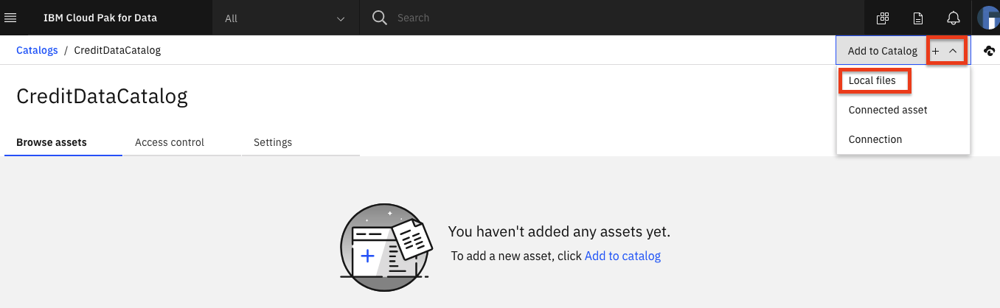
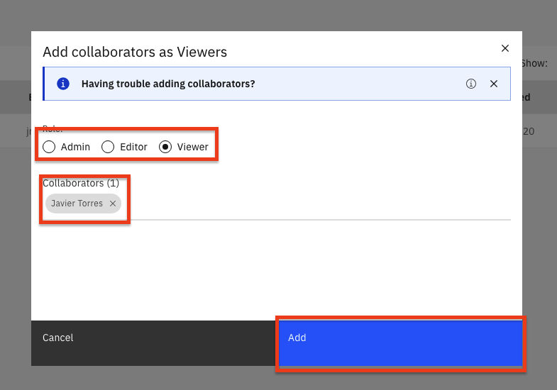
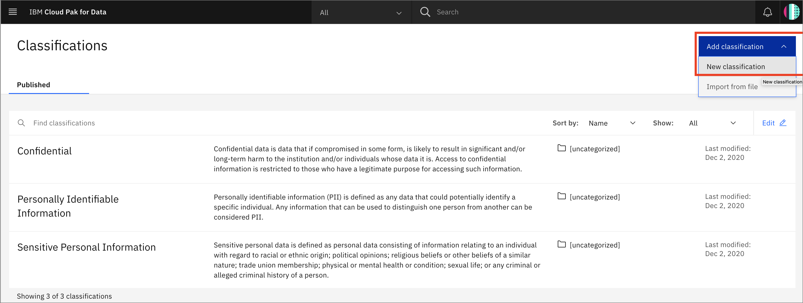
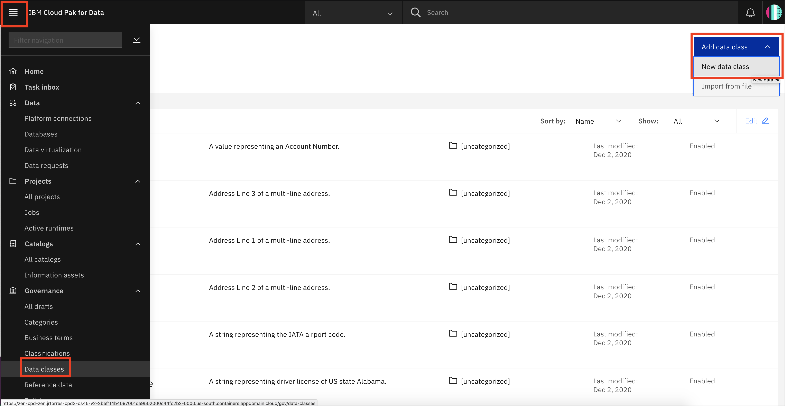
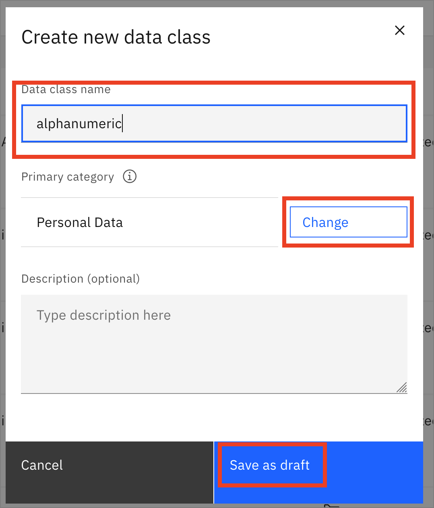
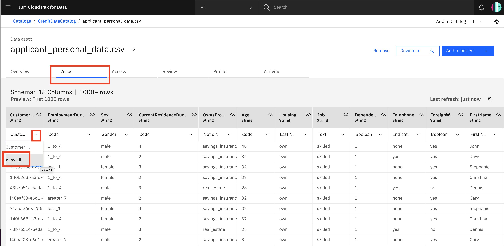
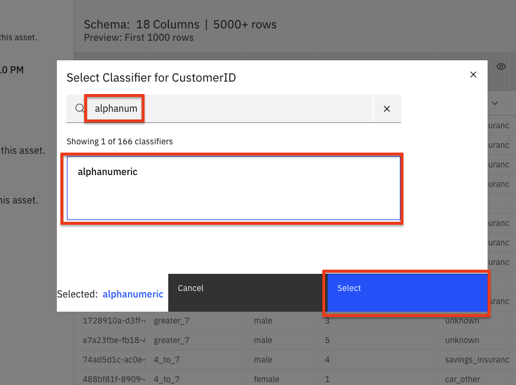

このチュートリアルでは、IBM Cloud Pak for Data プラットフォーム上の IBM Watson Knowledge Catalog を使用して、エンタープライズ・データ・ガバナンスの問題を解決する方法を示します。ガバナンス、データ品質、アクティブ・ポリシー管理を使用して、機密データの保護と管理、データのリネージの追跡、データ・レイクの管理を行う方法を説明します。この知識は、データ資産、データセット、分析モデル、およびそれらの関係をすばやく発見し、キュレーションし、分類し、組織内の他の人と共有するのに役立ちます。

## 学習目標

このチュートリアルでは、以下の方法を学びます。

1. [カタログを設定する](#1-set-up-catalog)
1. [データアセットの追加](#2-add-data-assets)
1. [コラボレーターの追加とアクセス制御](#3-add-collaborators and control-access)
1. [カテゴリの追加](#4-add-categories)
1. [データクラスの追加](#5-add-data-classes)
1. [ビジネス用語の追加](#6-ビジネス用語の追加)
1. [ポリシーのルールを追加](#7-add-rules-for-policies)

## 前提条件

* [IBM Cloud Pak for Data](https://www.ibm.com/jp-ja/products/cloud-pak-for-data)
* [Watson Knowledge Catalog](https://www.ibm.com/jp-ja/cloud/watson-knowledge-catalog)
* カタログを作成・管理するための管理者アクセス

## 見積もり時間

このチュートリアルを完了するには、約 30～45 分かかります。

## 手順

## 1.カタログを作成する

> 注：デフォルトのカタログは、エンタープライズカタログです。これは、Watson Knowledge Catalog サービスをインストールすると自動的に作成され、高度なデータキュレーションツールが適用される唯一のカタログです。デフォルトのカタログは、データ保護ルールが適用されるように管理されています。情報資産ビューには、キュレーションに役立つデフォルトカタログ内の資産の追加プロパティが表示されます。その後に作成するカタログは、ガバナイズされたものでもガバナイズされていないものでもよく、情報資産ビューはなく、基本的なデータ キュレーション ツールが提供されます。

まず、カタログを作成し、いくつかのデータを読み込みます。

### カタログの作成

* 左上(☰)のハンバーガーメニューで、`カタログ`→`全カタログ`を選択します。

  

* *Your catalogs*ページから、`Create catalog`ボタンをクリックします。

  

* カタログに名前をつけ、`Enforce data protection rules`チェックボックスをチェックし、オプションで説明を記入します。そして、`Create`ボタンをクリックします。

  

*> *注意：データ保護のチェックボックスを選択する際には、ポップアップウィンドウで`Ok`をクリックしてください。

## 2.データ資産の追加

カタログにアセットを追加するにはいくつかの方法があります。ここでは、ローカルデータのアセットを追加します。また、以下に接続アセットを追加するオプションセクションがあります。

## ローカルデータアセット

1. [application_personal_data.csv](static/applicant_personal_data.csv)ファイルをダウンロードします。**Browse Assets**タブの下、Now you can add assetsの下、**here**をクリックしてデータを追加します。

* 右上の `Add to Catalog +` をクリックし、`Local files` を選択します。

  

* 「Select file(s)」パネルの「browse」リンクをクリックします。`/data/split/applicant_personal_data.csv` ファイルをブラウズして選択します。任意の説明を追加して、「Add」ボタンをクリックする。

  

*  > *NOTE: 読み込みが完了するまで、カタログの中にいてください!カタログから離れると、不完全なアセットは削除されます。

* 新しく追加されたファイルは、カタログの*Browse Assets*タブの下に表示されます。

  

### (Optional) Add Connection

* `Add to Catalog +` -> `Connection` を選択することで、例えば *DB2 Warehouse in IBM Cloud* など、様々なデータソースへの接続を追加することができます。

  

* 追加したいデータソースの種類をクリックします（例：`Db2 Warehouse`）。

  

* 接続の詳細を入力し、`Create`をクリックします。

  

* カタログに接続が表示されます。

****注意: 仮想化されたデータは、そのカタログの管理者または編集者のアクセス権を持つ人が、*Default*カタログに追加することができます。「データの仮想化」を接続として追加するオプションがあります。

### (オプション) 接続からのデータの追加

データソースへの接続が確立すると、その接続からアセットを追加できるようになります。

* `+Add to Catalog` -> `Connected asset` をクリックします。

  

* `*Source*をクリック -> `Select source`.DV`から自分のスキーマ(例:UserXYZW)を参照し、結合したテーブルを選択する。Select "をクリックします。

これでユーザーは、カタログの他のアセットと同様に、このテーブルをプロジェクトに追加することができます。

## 3.コラボレーターの追加とアクセスコントロール

* *アクセスコントロール*タブで、「コラボレーターの追加」をクリックすると、他のユーザーにカタログへのアクセス権を与えることができます。

  

* `Collaborators` の欄にユーザーの名前を入力すると、そのユーザーを検索することができます。名前をクリックしてユーザーを選択し、`Add`をクリックする。

* ユーザーの役割を `Admin`, `Editor`, `Viewer` のいずれかから選択することができます。その後，「Add」ボタンをクリックする。

  

* カタログのデータにアクセスするには、データ名をクリックしてください。

  

* メタデータとGovernance artifactsを含むデータの概要が開きます。

  

* `Asset` タブをクリックすると、最初の1000行のプレビューが表示されます。

  

* `Review` タブをクリックすると、データを評価したり、コメントをつけたりすることができ、データの消費者にフィードバックを与えることができます。

  

## 4.カテゴリーの追加

Watson Knowledge Catalog の基本的な抽象化は、Category です。カテゴリーは、フォルダに類似しています。必要に応じてカテゴリーを追加したり、CSV形式でインポートしたりすることができます。

### カテゴリーのインポート(オプション)

ユニークな名前のカテゴリーをインポートするには、ターミナルウィンドウでコマンドを実行することに慣れている必要があります。この作業に慣れていない方は読み飛ばしてください。

* カテゴリの名前はすべてグローバルスコープなので、固有の名前を持つファイルをインポートする必要があります。このリポジトリをクローンまたはダウンロードした場所に行き、`data/wkc/glossary-organize-categories.csv`というファイルにナビゲートしてください。スクリプト`data/wkc/prepend-user-tag.py`を、あなたのインティアルやその他のタグを使って実行し、ユニークなファイルを作成します。例えば、`./prepend-user-tag -T scottda`とします。`T`パラメータでタグを追加しなければ、Pythonのtime.time()文字列を使って、ユニークなCategory名を持つユニークなファイルが生成されます。

  

* 左上のハンバーガーメニューから `Governance` -> `Categories` を選択し、`Add category` ボタンをクリックして `Import from file` を選択することで、アセットのカテゴリーをインポートします。

  

* 例えば、`data/wkc/scottda-glossary-organize-categories.csv`は、`./prepend-user-tag.py -T scottda`を実行して作成したファイルになります。「Next」ボタンをクリックします。

  

* `Select merge option` で `Replace all values` を選択し、`Import` をクリックします。

  

* インポートが完了すると、「The import completed succesfully」と表示されます。

* このようにして、カテゴリー、ビジネス用語、分類、ポリシーなどをインポートして、ガバナンスカタログを作成することができます。

### 手動でカテゴリーを追加する

> 注: カテゴリー、ビジネス用語、データクラス、およびその他のガバナンスの成果物は、グローバルな範囲です。注意: カテゴリー、ビジネス用語、データクラス、およびその他のガバナンスアーティファクトはグローバルな範囲です。例えば、以下の例では、`XXX-Personal Data`の代わりに`scottda-Personal Data`を使用しています。

インポートだけでなく、手動でカテゴリーを作成することもできます。左上（☰）のハンバーガーメニューから`Governance`→`Categories`を選択し、`Add category`ボタンをクリックしてから`New category`をクリックして、アセットのカテゴリーを追加します。

  

* イニシャルやユニークなタグ(*XXX-Personal Data*など)を付けた名前と、オプションで説明文を付けて、`Save`ボタンをクリックします。

  

* ここで、*Personal Data*カテゴリー画面の*Subcategories*の下にある`Create category`リンクを押すと、*Residence Information*のようなサブカテゴリーを作成することができます。

  

* *Personal Data* カテゴリでは、`Business term` のような *Type* を選択することができます。

  

* 左上のハンバーガーメニューから`Governance`→`Classifications`を選択することで、同様に*Confidential*、*Personally Identifiable Information*、*Sensitive Personal Information*のような資産の分類を作成することもできます。

  

* 右上の「Add classification」ボタンをクリックして、ドロップダウンメニューから「New classification」を選択します。これらの分類は、あなたのカテゴリーに*タイプ*として追加することができます。

  

## 5.データクラスの追加

> 注：カテゴリー、ビジネス用語、データクラス、およびその他のGovernanceアーティファクトは、グローバルな範囲です。作成するように言われたら、自分のイニシャルや何かユニークなタグを前もって付けておかないと失敗します。例えば、以下の例では、「XXX-alphanumeric」の代わりに「scottda-alphanumeric」を使用します。

アセットをプロファイリングする際には、可能な限りコンテンツからデータクラスが推測されます。これについては後で詳しく説明します。また、独自のデータクラスを追加することもできます。

* 左上のハンバーガーメニューから「ガバナンス」→「データクラス」を選択し、「データクラスの追加」ボタンをクリックし、ドロップダウンメニューから「新規データクラス」を選択することで、アセットにデータクラスを追加することができます。

  

* *XXX-alphanumeric*のように、イニシャルやタグを前もって付けた名前を新しいデータクラスに付けて、Primaryカテゴリの`Change`をクリックします。

  

*Personal Data*のプライマリーカテゴリーを選び、`Add`をクリックします。

  

* ここで、`Save as draft`をクリックします。

* データクラスが作成されたら、オプションとして、このクラスに*Stewards*を追加したり、*classification*や*business terms*を関連付けたりすることができます。準備ができたら、`Publish`ボタンをクリックして、ポップアップウィンドウでもう一度`Publish`をクリックします。

  

* それでは、そのデータクラスを *applicant_personal_data.csv* アセットのカラムに追加してみましょう。

**** 先ほど作成したカタログ（例：*CreditDataCatalog*）に戻って、それを開きます（(☰)ハンバーガーメニューの `Catalogs` -> `All catalogs` で `CreditDataCatalog` を選択）。*Browse assets*タブで、データセット*applicant_personal_data.csv*をクリックして、`Asset`タブをクリックすると、列/行のプレビューが表示されます。*CustomerID*列を見つけて、「顧客番号」の横にある下矢印をクリックし、次に*View all*をクリックします。

  

* 開いたウィンドウで、新しく作成したデータクラスである*alphanumeric*を検索し、検索で戻ってきたらそれをクリックします。そして、`Select`ボタンをクリックします。

  

## 6.ビジネス用語の追加

> 注：カテゴリー、ビジネス用語、データクラス、およびその他のGovernanceアーティファクトは、グローバルな範囲です。作成するように言われたら、自分のイニシャルや何かユニークなタグを前もって付けておかないと失敗します。例えば、以下では、`XXX-連絡先情報`の代わりに`scottda-連絡先情報`を使用しています。

[ビジネス用語](https://dataplatform.cloud.ibm.com/docs/content/wsj/governance/dmg16.html)を使用して、ビジネスコンセプトの定義を標準化することで、企業全体で統一された理解しやすい方法でデータを記述することができます。

カテゴリーを作成して、それを*ビジネス用語*にする方法はすでに見ました。ビジネス・タームを独自のエンティティとして作成することもできます。

* 左上（☰）のハンバーガー・メニューから、「ガバナンス」→「ビジネス用語」を選択します。

  

* 右上の「Add business term」ボタンをクリックし、ドロップダウンメニューの「New business term」オプションをクリックします。

  

* 新しいビジネス用語に、イニシャルや*XXX-Contact Information*のようなタグを前もって付けた名前と、オプションで説明を付けます。*Primary category* の下の `Change` をクリックして *Personal data* を選択し、`Save as draft` ボタンをクリックします。

  

* 用語が作成されると、ウィンドウが表示されます。関連用語の作成やその他のメタデータを追加するための豊富なオプションが表示されます。とりあえず、`Publish`をクリックして、この用語をプラットフォームのユーザーが利用できるようにします。ポップアップした確認ウィンドウで「Publish」をクリックします。

  

****先ほど作成したカタログ（例：*CreditDataCatalog*）に戻って、それを開きます（(☰)ハンバーガーメニュー `Catalog` -> `All catalogs` で `CreditDataCatalog` を選択）。*Browse assets*タブで、データセット*applicant_personal_data.csv*をクリックし、次に`Asset`タブをクリックすると、列/行のプレビューが表示されます。*Email*列を見つけて、*列情報*アイコンをクリックします（「目」のように見えます）。

  

* 開いたウィンドウで、*Business terms*の横にある*edit*アイコン（「鉛筆」のように見える）をクリックします。

  をクリックします。

* *XXX-Contact Information*（*scottda-ContactInfo*のようなあなたのユニークな名前の用語）先ほど*Business terms*で作成した用語を入力すると、その用語が検索されます。見つかった`Contact Information`の用語をクリックして、`Apply`をクリックします。

  

* 用語が適用されたら、そのウィンドウの`Close`をクリックしてください。次に、同じようにして、*Telephone*列に*Contact Information* Business termを追加します。

* これで、プラットフォーム内でこれらの用語を検索できるようになります。例えば、トップレベルの*CreditDataCatalog*に戻って、"What assets are you searching for? "というコメントのある検索バーに、固有の*<unique_string>Contact Information*という用語を入力します。

  

* *applicant_personal_data.csv*データセットは、*Contact Infomation*ビジネス用語でタグ付けされたカラムを含んでいるので、表示されます。

## 7.ポリシーのルールを追加する

ユーザーがデータにアクセスする方法を制御するルールを作成できるようになりました。

> 注意：ワークショップのチームメイトは、ルールに関連付ける用語を単純に1つ再利用することができます（例：*CustomerID*）。

* *XXX-CustomerID*というビジネス用語を作成するか、またはワークショップのチームメイトのビジネス用語の1つをこのエクササイズのために再利用してください。それを上記の手順でデータセットの*CustomerID*列に割り当てます。詳細が必要な場合は以下を参照してくださいが、まず自分で試してみてください。また、注意喚起が不要な場合は以下の*Adding a rule*にスキップしてください。

### ビジネス用語のレビューを作成する方法

* 左上（☰）のハンバーガーメニューから、「Governance」→「Business terms」を選択します。

* 右上の「ビジネス用語の追加」ボタンをクリックし、ドロップダウンメニューの「新規ビジネス用語」を選択します。

**** 新しいビジネス用語に *XXX-CustomerID* という名前と、オプションで説明を付けます。*プライマリー・カテゴリ*の下にある「変更」をクリックして、*Personal data*を選択し、「ドラフトとして保存」ボタンをクリックします。次のウィンドウで`Publish`をクリックします。

* 先ほど作成したカタログ（例：*CreditDataCatalog*）に戻り、それを開きます（(☰)ハンバーガーメニューの`Catalog`->`All catalogs`で`CreditDataCatalog`を選択）。*Browse assets*タブで、データセット*applicant_personal_data.csv*をクリックして、`Asset`タブをクリックすると、列/行のプレビューが表示されます。*CustomerID*列を見つけて、*Column information*アイコンをクリックします（「目」のように見えます）。

* 開いたウィンドウで、*Business terms* の隣にある *edit* アイコンをクリックします（「鉛筆」のように見えます）。

* *Business terms* の下に *CustomerID* を入力すると、その用語が検索されます。検索された `CustumerID` の用語をクリックして、`Apply` をクリックします。その後、ポップアップウィンドウを閉じます。

### ルールの追加

* 左上のハンバーガーメニューから、`Governance` -> `Rules` を選択します。

* 右上の「Add rule」ボタンをクリックして、ドロップダウンメニューから「New rule」を選択してください。

* 「Create a new rule」ページで、「Data protection rule」オプションを選択します。

  

* ルールにユニークな *XXX-Name* を与え、*Type* を `Access` に設定したまま、*Business definition* を追加してください。

* *Rule builder* > *Condition1* の下にあります。`If`の条件では、*Business term* *Contains any* *CustomerID*を選択します。*Action* の下の `then` パネルでは、*mask data* *in columns containing* *alphanumeric* を選択します。「Substitute」のタイルを選択すると、個人を特定できないハッシュが作成されます。これにより、実際のCustomerIDは見えなくなりますが、データベースの結合などの動作は可能になります。「ルールの作成」ボタンをクリックします。

  

* ここで、カタログ内の*applicant_personal_data.csv*アセットの*CustomerID*カラムに戻ると、前と同じように見えます。しかし、管理者ではないユーザーには「ロック」アイコンが表示され、customerIDがハッシュ値で置き換えられていることがわかります。

* データを*難読化*するルールを追加するには、*Age*という新しいデータクラスを作成します。必要に応じて上記の説明を参照し、クラスを公開することを忘れないでください。

*CreditDataCatalog*に戻り、*applicant_personal_data.csv*資産の下で、`Overview`タブに行き、*Age*列までスクロールします。「下矢印」をクリックすると、データが*Code*に分類されていることが推測されます。`View all`をクリックして分類器を変更します。

  

* 今度は、*Age*と入力し始めてclassifierを変更します。これが検索で出てきたら、それを選択して、`Select`ボタンをクリックします。

  

* 前述の指示に従って、この *Age* カラムを *難読化* するための新しいデータ保護ルールを構築することができます。

  

* これで、管理者以外のユーザーがその列を見たときに、同様のフォーマットのデータに置き換えられたデータが表示されます。

## まとめ

このラボでは、以下の方法を学びました。

* カタログとデータの設定
* コラボレーターの追加とアクセス制御
* カテゴリーの追加
* データクラスの追加
* ビジネス用語の追加
* ポリシーのルールの追加

このチュートリアルは、[Getting started with IBM Cloud Pak for Data Learning Path](/learningpaths/cloud-pak-for-data-learning-path/)の一部です。このシリーズを続けて IBM Cloud Pak for Data について詳しく学ぶには、次のパターンである [Data analysis, model building, and deploying with Watson Machine Learning with notebook](/patterns/data-analysis-model-building-and-deploying-with-wml/) を参照してください。次のチュートリアルである[Automate model building with AutoAI](/tutorials/automate-model-building-with-autoai/)または[Build a predictive machine learning model quickly and easily with IBM SPSS Modeler](/tutorials/build-an-ai-model-visually-with-spss-modeler-flow/)を見てみましょう。

このチュートリアルでは、IBM Cloud Pak for Data プラットフォームでデータを扱う際に利用できる強力なツールの一部を学びました。IBM Watson Knowledge Catalog を使えば、チーム・メンバーがそれぞれの役割で協力して、データと AI を企業にもたらすことができます。