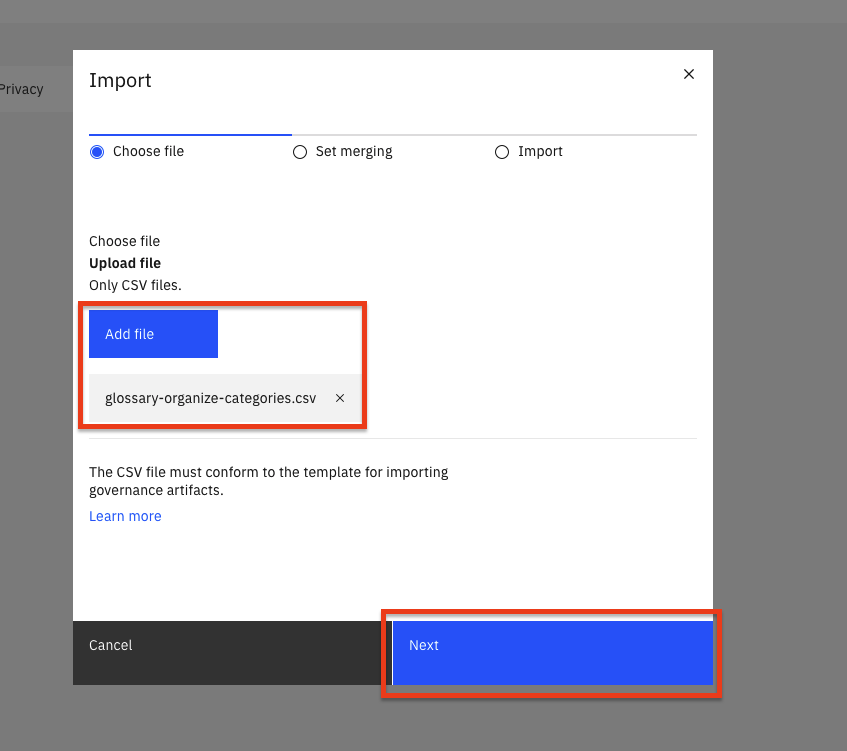
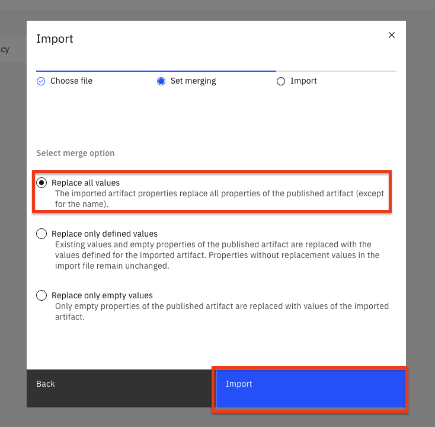
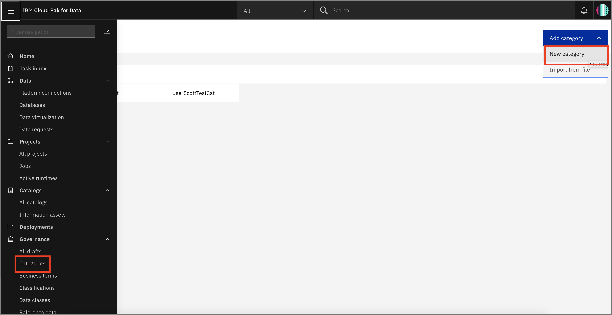
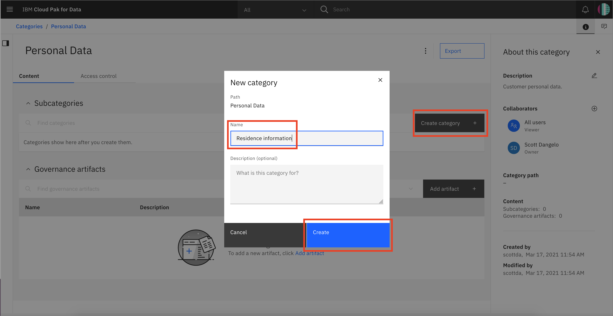
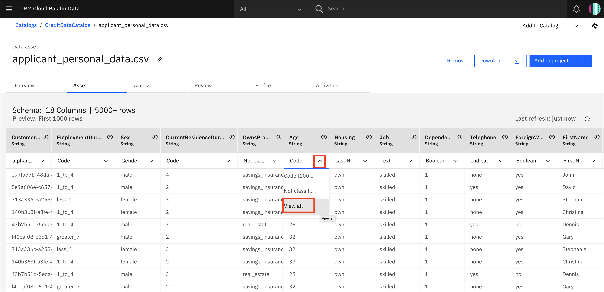

This tutorial demonstrates how to solve the problems of enterprise data governance using the IBM Watson Knowledge Catalog on the IBM Cloud Pak for Data platform. We'll explain how to use governance, data quality, and active policy management to help you protect and govern sensitive data, trace data lineage, and manage data lakes. This knowledge can help you quickly discover, curate, categorize, and share data assets, data sets, analytical models, and their relationships with others in your organization.

## Learning objectives

In this tutorial, you will learn how to:

1. [Set up Catalog](#1-set-up-catalog)
1. [Add Data Assets](#2-add-data-assets)
1. [Add collaborators and control access](#3-add-collaborators-and-control-access)
1. [Add categories](#4-add-categories)
1. [Add data classes](#5-add-data-classes)
1. [Add Business terms](#6-add-business-terms)
1. [Add rules for policies](#7-add-rules-for-policies)

## Prerequisites

* [IBM Cloud Pak for Data](https://www.ibm.com/products/cloud-pak-for-data)
* [Watson Knowledge Catalog](https://www.ibm.com/cloud/watson-knowledge-catalog)
* Admin access to create and administer the catalog

## Estimated time

Completing this tutorial should take about 30-45 minutes.

## Steps

## 1. Set up Catalog

> NOTE: The default catalog is your enterprise catalog. It is created automatically after you install the Watson Knowledge Catalog service and is the only catalog to which advanced data curation tools apply. The default catalog is governed so that data protection rules are enforced. The information assets view shows additional properties of the assets in the default catalog to aid curation. Any subsequent catalogs that you create can be governed or ungoverned, do not have an information assets view, and supply basic data curation tools.

First we'll create a catalog and load some data

### Create the catalog

* Go to the upper-left (☰) hamburger menu and choose `Catalogs` -> `All catalogs`.

  

* From the *Your catalogs* page, click the `Create catalog` button.

  

* Give your catalog a name, check the `Enforce data protection rules` checkbox and provide an optional description. Then click the `Create` button.

  

> *Note: Click `Ok` in the pop up window when selecting the data protection checkbox.*

## 2. Add Data Assets

There are several ways to add assets to the catalog. We are going to add a local data asset. There are also optional sections to add connection assets below.

### Local Data Asset

1. Download the [applicant_personal_data.csv](static/applicant_personal_data.csv) file. Under the **Browse Assets** tab, below Now you can add assets, click **here** to add your data.

* Click `Add to Catalog +` in the top right and choose `Local files`.

  

* Click the `browse` link in the 'Select file(s) panel. Browse to the `/data/split/applicant_personal_data.csv` file to select it. Add an optional description and click the `Add` button.

  

  > *NOTE: Stay in the catalog until loading is complete! If you leave the catalog, the incomplete asset will be deleted.*

* The newly added file will show up under the *Browse Assets* tab of your catalog:

  

### (Optional) Add Connection

* You can add a connection to various data sources, for example *DB2 Warehouse in IBM Cloud*, by choosing `Add to Catalog +` -> `Connection`:

  

* Click on the data source type you want to add (for example, `Db2 Warehouse`).

  

* Enter the connection details and click `Create`:

  

* The connection now shows up in the catalog.

**Note: Virtualized data can be added to the *Default* catalog by someone with Administrator or Editor access to that catalog. There is an option to add `Data Virtualization` as a connection.**

### (Optional) Add Data from Connection

Once you have a connection to a data source, you will be able to add assets from that connection.

* Click `+Add to Catalog` -> `Connected asset`:

  

* Click *Source* -> `Select source`. Browse under `DV` to your Schema (i.e. UserXYZW) and choose the joined table. Click `Select`.

A user can now add this to a project like any other asset from a catalog.

## 3. Add Collaborators and Control access

* Under the *Access Control* tab you can click `Add Collaborator` to give other users access to your catalog.

  

* You can search for a user by entering their name in the `Collaborators` field. Click on the name to select the user., and click `Add`.

* You can choose a role for the user - `Admin`, `Editor`, or `Viewer`. Then click the `Add` button.

  

* To access data in the catalog, click on the name of the data.

  

* An overview of the data will open with metadata and Governance artifacts.

  

* Click on the `Asset` tab to see a preview of the first 1000 rows.

  

* You can click the `Review` tab and rate the data, as well as comment on it, to provide feedback to consumers of the data.

  

## 4. Add categories

The fundamental abstraction in Watson Knowledge Catalog is the Category. A category is analogous to a folder. You can add categories as needed, or you can import them in CSV format.

### Import categories (optional)

To import categories with unique names, you will need to be comfortable with running a command in a terminal window. Please skip this if you are not familiar with that process.

* All category names are global in scope, so you'll need to import a file with unique names. Go to where you cloned or downloaded this repository, and navigate to the file `data/wkc/glossary-organize-categories.csv`. Run the script `data/wkc/prepend-user-tag.py` using your intials or some other tag in order to create a unique file. For example, I might run `./prepend-user-tag -T scottda`. If you do not add a tag with the `-T` parameter, a unique file with unique Category names will be generated with a python time.time() string.

  

* Import a category for your assets by going to the upper-left (☰) hamburger menu, choose `Governance` -> `Categories`, then the click the `Add category` button and choose `Import from file`. 

  

* Click the `Add file` and navigate to where you cloned/downloaded the workshop repository, choosing the file that you have created using the `prepend-user-tag.py` script, i.e `data/wkc/scottda-glossary-organize-categories.csv` would be the file I created by running `./prepend-user-tag.py -T scottda`. Click the `Next` button.

  

* Under `Select merge option` choose `Replace all values` and click `Import`.

  

* You will see "The import completed succesfully" when it is completed.

* In this way, you can import Categories, Business Terms, Classifications, Policies, etc. to populate your governance catalogs.

### Add category manually

> NOTE: Categories, Business Terms, Data Classes, and othe Governance artifacts are global in scope. When you are asked to create one, pre-pend your initials or some unique tag, or it will fail. For example, below I would use `scottda-Personal Data` in place of `XXX-Personal Data`.

In addition to importing, you can manually create categories. Add a category for your assets by going to the upper-left (☰) hamburger menu, choose `Governance` -> `Categories`, then click the `Add category` button and then `New category`.

  

* Give your category a name pre-pended with initials or a unique tag, such as *XXX-Personal Data*, and an optional description, and then click the `Save` button.

  

* Now, if you hit the `Create category` link on the *Personal Data* category screen under *Subcategories*, you can create a subcategory, such as *Residence Information*.

  

* For the *Personal Data* category you can select a *Type*, such as `Business term`.

  

* We can also create classifications for assets, similar to *Confidential*, *Personally Identifiable Information*, or *Sensitive Personal Information* in a similar way, by going to the upper-left (☰) hamburger menu, choose `Governance` -> `Classifications`.

  

* Click on the `Add classification` button on the top right and then `New classification` from the drop down menu. These classifications can then be added to your category as a *Type*:

  

## 5. Add data classes

> NOTE: Categories, Business Terms, Data Classes, and othe Governance artifacts are global in scope. When you are asked to create one, pre-pend your initials or some unique tag, or it will fail. For example, below I would use `scottda-alphanumeric` in place of `XXX-alphanumeric`.

When you profile your assets, a data class will be inferred from the contents where possible. We'll see more on this later. You can also add your own data classes.

* Add a data class for your assets by going to the upper-left (☰) hamburger menu, choose `Governance` -> `Data classes`, then click the `Add data class` button and then the`New data class` option from the drop down menu.

  

* Give your new data class a name pre-pended with initials or a tag, i.e. *XXX-alphanumeric*, and then click `Change` for Primary category.

  

* Choose the *Personal Data* primary category and click `Add`.

  

* Now you can click `Save as draft`.

* Once the data class is created, we can optionally: add *Stewards* for this class, and associate *classifications* and *business terms*. When you are ready, click the `Publish` button and again `Publish` in the pop up window.

  

* Now let's add that data class to a column in our *applicant_personal_data.csv* asset.

* Go back to the catalog you created earlier (i.e *CreditDataCatalog*) and open it ((☰) hamburger menu `Catalogs` -> `All catalogs` and choose `CreditDataCatalog`). Under the *Browse assets* tab, click on the data set *applicant_personal_data.csv*, and then the `Asset` tab, to get the column/row preview. Find the *CustomerID* column and click the down arrow next to "Customer Number" and then *View all*:

  

* In the window that opens, search for your newly created data class, *alphanumeric* and click it when it returns in the search. Then click the `Select` button.

  

## 6. Add Business terms

> NOTE: Categories, Business Terms, Data Classes, and othe Governance artifacts are global in scope. When you are asked to create one, pre-pend your initials or some unique tag, or it will fail. For example, below I would use `scottda-Contact Information` in place of `XXX-Contact Information`.

You can use [Business terms](https://dataplatform.cloud.ibm.com/docs/content/wsj/governance/dmg16.html) to standardize definitions of business concepts so that your data is described in a uniform and easily understood way across your enterprise.

You already saw how to create a category and make it a *business term*. You can also create the business term as its own entity.

* From the upper-left (☰) hamburger menu, choose `Governance` -> `Business terms`:

  

* Click on the upper-right `Add business term` button and then the `New business term` option in the drop down menu.

  

* Give the new Business term a name pre-pended with initials or a tag, such as *XXX-Contact Information* and optional description. Click `Change` under *Primary category* and choose *Personal data*, then Click the `Save as draft` button.

  

* A window will come up once the term is created. You can see a rich set of options for creating related terms and adding other metadata. For now, click `Publish` to make this term available to users of the platform. Go ahead and click `Publish` on the pop up confirmation window.

  

* Go back to the catalog you created earlier (i.e *CreditDataCatalog*) and open it ((☰) hamburger menu `Catalog` -> `All catalogs` and choose `CreditDataCatalog`). Under the *Browse assets* tab, click on the data set *applicant_personal_data.csv*, and then the `Asset` tab, to get the column/row preview. Find the *Email* column and click the *Column information* icon (looks like an "eye").

  

* In the window that opens, click the *edit* icon (looks like a "pencil") next to *Business terms* :

  

* Enter *XXX-Contact Information* (your uniquely named term such as *scottda-ContactInfo*) term you created earlier under *Business terms* and the term will be searched for. Click on the `Contact Information` term that is found, and click `Apply`:

  

* Click `Close` in that window once the term has been applied. Now, do the same thing to add the *Contact Information* Business term to the *Telephone* column.

* You will now be able to search for these terms from within the platform. For example, going back to your top level *CreditDataCatalog*, in the search bar with the comment "What assets are you searching for?" enter your unique *<unique_string>Contact Information* term:

  

* The *applicant_personal_data.csv* data set will show up, since it contains columns tagged with the *Contact Infomation* business term.

## 7. Add rules for policies

We can now create rules to control how a user can access data.

> NOTE: Workshop teammates can simply reuse 1 term to associate with a rule, i.e. *CustomerID*, or you can proceed below to create a uniquely named one.

* Create a business term called *XXX-CustomerID*, or re-use one of your workshop teammates buisness terms for this expercise. Assign it to your *CustomerID* column in the data set using the instructions above. See below if you need details, but try it yourself first, and skip to *Adding a rule* below if you do not need a reminder.

### How to create a Business term review

* From the upper-left (☰) hamburger menu, choose `Governance` -> `Business terms`.

* Click on the upper-right `Add business term` button and then the `New business term` option in the drop down menu.

* Give the new Business term the name *XXX-CustomerID* and optional description. Click `Change` under *Primary category* and choose *Personal data*, then Click the `Save as draft` button. In the next window, click `Publish`.

* Go back to the catalog you created earlier (i.e *CreditDataCatalog*) and open it ((☰) hamburger menu `Catalog` -> `All catalogs` and choose `CreditDataCatalog`). Under the *Browse assets* tab, click on the data set *applicant_personal_data.csv*, and then the `Asset` tab, to get the column/row preview. Find the *CustomerID* column and click the *Column information* icon (looks like an "eye").

* In the window that opens, click the *edit* icon (looks like a "pencil") next to *Business terms* .

* Enter *CustomerID* under *Business terms* and the term will be searched for. Click on the `CustumerID` term that is found, and click `Apply`. Then close the pop up window.

### Adding a rule

* From the upper-left (☰) hamburger menu, choose `Governance` -> `Rules`.

* Click the `Add rule` button on the top right and then select the  `New rule` option from the drop down menu.

* In the 'Create a new rule' page, select the `Data protection rule` option.

  

* Give your rule a unique *XXX-Name*, leave the *Type* set to `Access`, and add a *Business definition*.

* Under *Rule builder* > *Condition1*: For the `If` condition, select *Business term* *Contains any* *CustomerID*. Under *Action*, for the `then` panel, select *mask data* *in columns containing* *alphanumeric*. Choose the tile for `Substitute`, which will make a non-identifiable hash. This obscures the actual CustomerID, but allows actions like database joins to still work. Click the `Create rule` button.

  

* Now if we go back to our *applicant_personal_data.csv* asset in the catalog at the *CustomerID* column, it will look the same as before. But a non-admin user will see the "lock" icon and see that the customerID has now been substituted with a hash value.

* To add a rule to *Obfuscate* data, create a new data class called *Age*. See the instructions above if needed, don't forget to publish the class.

* Back in the *CreditDataCatalog*, under the *applicant_personal_data.csv* asset, go to the `Overview` tab and scroll to the *Age* column. Click the "down arrow" and you can see that the data has been inferred to be classified as a *Code*. Change the classifier by clicking `View all`.

  

* Now change the classifier by starting to type *Age*. When this comes up in the search, select it and then click the `Select` button.

  

* Following the prior instructions, you can build a new data protection rule to *Obfuscate* this *Age* column.

  

* And now when that column is viewed by a non-admin user, it will have data that is replaced with similarly formatted data.

## Summary

In this lab, we learned how to:

* Set up Catalog and Data
* Add collaborators and control access
* Add categories
* Add data classes
* Add Business terms
* Add rules for policies

This tutorial is part of the [Getting started with IBM Cloud Pak for Data learning path](/learningpaths/cloud-pak-for-data-learning-path/). To continue the series and learn more about IBM Cloud Pak for Data, you can either take a look at the next pattern, [Data analysis, model building, and deploying with Watson Machine Learning with notebook](/patterns/data-analysis-model-building-and-deploying-with-wml/), look at the next tutorial titled [Automate model building with AutoAI](/tutorials/automate-model-building-with-autoai/) or [Build a predictive machine learning model quickly and easily with IBM SPSS Modeler](/tutorials/build-an-ai-model-visually-with-spss-modeler-flow/).

In this tutorial, you have learned a few of the powerful tools available for working with data on the IBM Cloud Pak for Data platform. With IBM Watson Knowledge Catalog, team members can work together in their individual roles to bring data and AI to the enterprise.