私たちの生活のあらゆる側面を促進する人工知能が、自らの開発プロセスを促進することを期待するのは必然的なことでした。より優れたモデルを構築するためには、より複雑な時間とコストを要するAIの手順が必要であり、データのクレンジングから機能エンジニアリング、アーキテクチャの設計からパラメータの最適化まで、専門知識が必要となります。このプロセスを容易にし、時間と労力の面で効率的にするには、これらの作業負荷を自動化する必要があります。AIのためのAIを作ることを目的に、IBMはWatson&trade;Studio上に[AutoAI](https://dataplatform.cloud.ibm.com/docs/content/wsj/analyze-data/autoai-overview.html)というサービスを導入しました。AutoAIはパブリック・クラウドでも、IBM Cloud Pak&trade; for Dataを含むプライベート・クラウドでも実行できます。

AutoAIは、機械学習のタスクを自動化し、データサイエンティストの作業を容易にするサービスです。モデリングのためのデータの準備、問題に最適なアルゴリズムの選択、学習済みモデルのパイプラインの作成などを自動的に行います。

## 学習目標

このチュートリアルでは、AutoAIサービスの利点をユースケースで説明し、回帰や分類の問題がどのようにコードなしで処理されるのか、また、このサービスでどのようにタスク（フィーチャーエンジニアリング、モデル選択、ハイパーパラメータチューニングなど）が行われるのかについて理解を深めます。また、このチュートリアルでは、パイプラインの中から最適なモデルを選択する方法や、これらのモデルをデプロイして使用する方法についても詳しく説明しています。

## 前提条件

このチュートリアルに従うには、以下が必要です。

* [IBM Cloud アカウント](https://cloud.ibm.com/registration?cm_sp=ibmdev-_-developer-tutorials-_-cloudreg)にサインアップします。
* Cloud Object Storage サービス・インスタンスを作成します。
* Watson Studio サービス・インスタンスを作成します。
* Watson Machine Learning サービス・インスタンスを作成する。
* 機械学習アルゴリズムの基本的な知識を持っている。

## 見積もり時間

このチュートリアルの所要時間は、AutoAI のトレーニングを含めて約 20 分です。

## 手順

IBM Cloud のアカウントを作成してサインインした後、以下の手順を実行します。

### Step 1: 必要なサービスインスタンスの作成

#### オブジェクト・ストレージ

データを保存するには、後でプロジェクトとリンクさせるためのストレージサービスが必要です。そのためには、[IBM Cloud Catalog](https://cloud.ibm.com/catalog?search=object%20storage&category=storage&cm_sp=ibmdev-_-developer-tutorials-_-cloudreg)でStorageを検索するか、同じページの左メニューからStorageタブを開き、**Object Storage**サービスをクリックします。

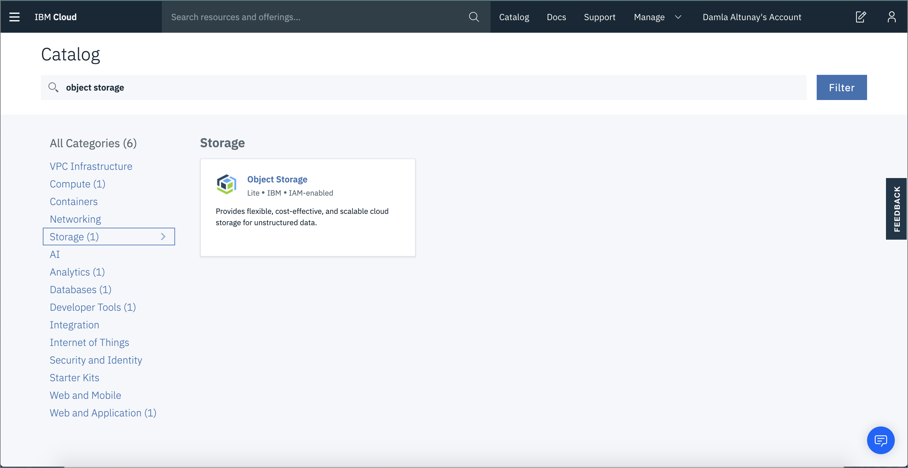

オプションで、このサービス・インスタンスに名前を付けて、**Create**をクリックします。

#### Watson Studio

1. [IBM Cloud Catalog](https://cloud.ibm.com/catalog?search=studio&cm_sp=ibmdev-_-developer-tutorials-_-cloudreg)で Watson Studio を検索し、**Watson Studio** サービスタイルをクリックします。

    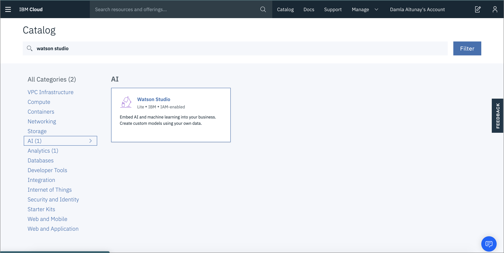

1. Object Storage サービスで行ったように、サービスに名前を付けて、**Create** をクリックします。

    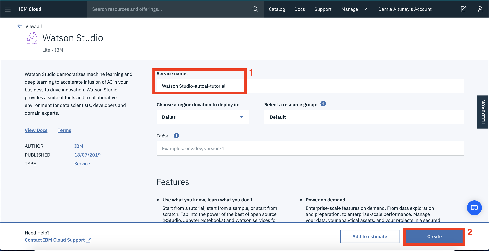

1. Watson Studio サービスのプロビジョニング後、**Get Started** をクリックするか、[Watson Studio](https://dataplatform.cloud.ibm.com/?cm_sp=ibmdev-_-developer-tutorials-_-cloudreg)プラットフォームにアクセスして、IBM Cloud アカウントでログインします。

    

1. 入門チュートリアルを確認して、Watson Studio の詳細を学びます。

### Step 2: AutoAI でモデルを学習する

Watson Studio は、データセット、共同研究者、モデル、ノートブックなどのプロジェクト資産を整理するために設計された統合プラットフォームです。ここでは、Watson Studio を使用して、AutoAI でモデルをトレーニングし、トレーニングしたモデルをデプロイするプロジェクトを作成します。

#### Watson Studio プロジェクトの作成

1. **Create a Project**（プロジェクトの作成）をクリックします。

    

1. 「空のプロジェクトを作成する」を選択します。

    

1. プロジェクトに名前を付けます。ドロップダウンメニューからサービスを選択します。

    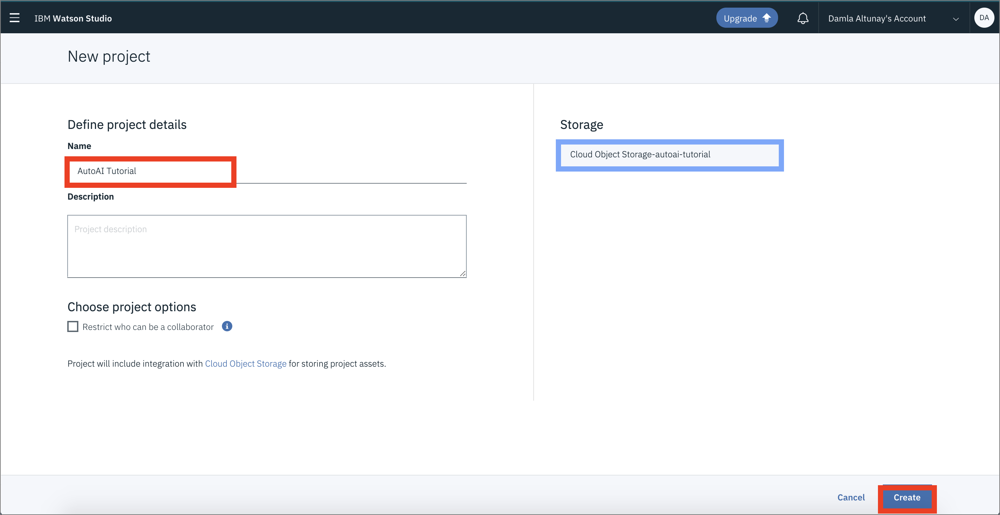

1. データ資産のページが開き、プロジェクトの資産が保存・整理されます。**Assets**バーをクリックすると、左のインターフェースからデータセットを読み込むことができます。

1. 1. [german_credit_data.csv](static/german_credit_data.csv)データセットをアップロードします。

    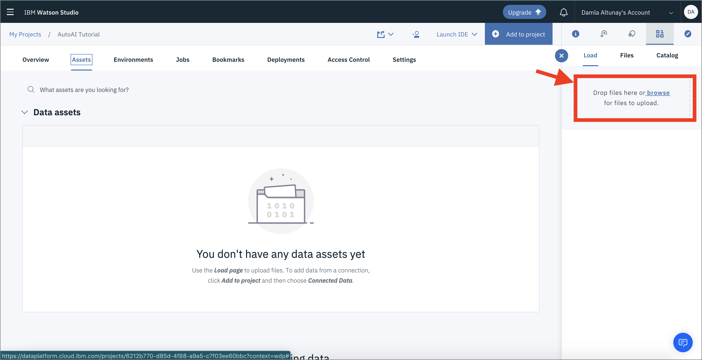

#### AutoAI環境の構築とパイプラインの生成

1. AutoAIの体験を開始するには、トップから**Add to Project**をクリックし、**AutoAI**を選択します。

    

1. サービスに名前を付けます。

    

1. **Watson Machine Learning** インスタンスを関連付けるには、所定のリンクをクリックします。既存のインスタンスがある場合は、既存タブから選択します。ない場合は、[新規]タブから新しいインスタンスを作成します。

    

1. Watson Machine Learning インスタンスのプロビジョニング後、同じページにリダイレクトされます。「Reload**」、「Create**」の順にクリックします。

#### データセットに関する情報

リスクの最小化と利益の最大化を両立させるためには、銀行にとっていくつかの基本的なルールが必要です。その一つが、融資などの顧客との関わりにおいて、損失を最小限に抑えることです。このデータセットの目的は、申請者の人口統計学的および社会経済学的プロファイルを考慮して、顧客がローンを返済できるかどうかを予測することです。

* 申請者が信用リスクの高い人（返済してくれそうな人）であれば、その人への融資を承認しないことは、銀行にとってビジネスの損失につながります。
* 申請者が信用リスクが低い（返済の見込みがない）場合、その人への融資を承認することは銀行にとって金銭的な損失となります。
* データセットは1,000人のローン申請者のデータポイントからなり、それぞれ20の変数（7は数値、13はカテゴリー）を持っています。このデータセットの変数については、ここでは詳しく説明しません。[詳細情報](https://archive.ics.uci.edu/ml/datasets/Statlog+%28German+Credit+Data%29)をすべて確認することができます。

#### AutoAIインスタンスのセットアップ

以下の手順で AutoAI インスタンスをセットアップします。

1. データセットを選択します（ローカルシステムからアップロードするか、プロジェクトから選択します）。
1. 予測する列を **Result** に設定します。
1. 最適化された指標を**ROC AUC**（Area under the ROC Curve）に変更します。
1. 考慮するトップパフォーマンスのアルゴリズムの数を3つに設定します。デフォルトでは、AutoAIはパフォーマンスの高い上位2つのアルゴリズムを選択しますが、1から4までの数に変更することができます。

 

#### AutoAIのパイプライン

これまでの工程を終えた直後に実験を開始します。

データの前処理の後、AutoAIはパフォーマンスの高い上位3つのアルゴリズムを特定し、その3つのアルゴリズムごとに、AutoAIは以下の4つのパイプラインを生成します。

* 自動モデル選択（パイプライン1）
* ハイパーパラメータの最適化（パイプライン2）
* 自動フィーチャーエンジニアリング（パイプライン3）
* ハイパーパラメータの最適化（パイプライン4）

このようにして、AutoAIは合計12のパイプラインを生成し、それらを閲覧、比較、モデルとして保存することができます。

#### パイプラインの可視化

AutoAI がモデルを生成している間、パイプラインの作成状況を可視化するための 2 つの異なるビューがあります。以下の画像にあるように、プログレスマップとリレーションシップマップです。このユースケースでは、AutoAIがXGB、Random Forest、Decision Tree分類器をトップパフォーマンスのアルゴリズムとして選択していることがわかります。

次の図は、これらの各パイプラインの関係を示したリレーションシップマップです。マップにカーソルを合わせると、詳細情報が表示されます。

次の図は、全体で作成された12本のパイプラインの順序と詳細を示した進捗マップです。

次の図は、12個のパイプラインの詳細とハイレベルメトリクスを表示したパイプラインリーダーボードのビューです。ハイパーパラメータの最適化とフィーチャーエンジニアリングの2つのセットを用いたXGB分類器が、最適なモデルを生成したことが推察されます。このパイプラインは、一連の流れの中で4番目のパイプラインです。

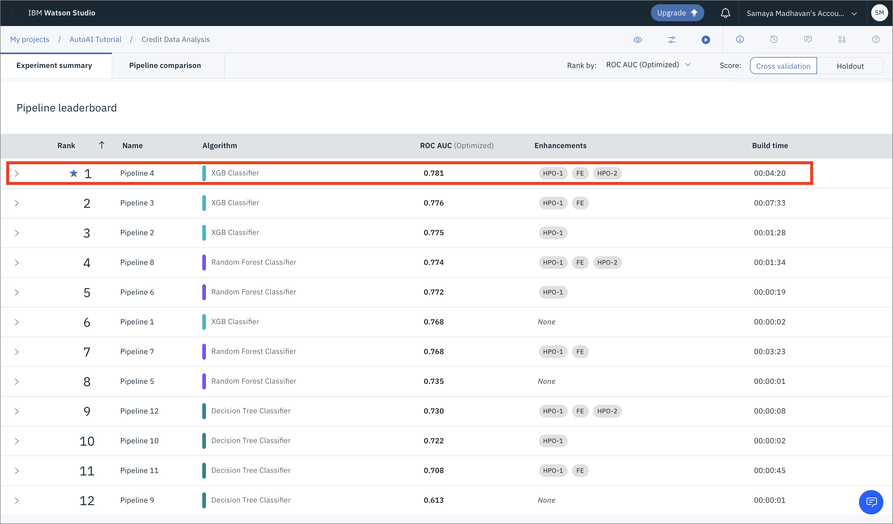

AutoAIでは、これらのモデルのそれぞれの性能を異なる指標に基づいて比較するためのビジュアルも提供しています。

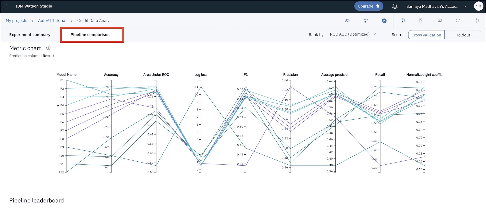

次のステップは、メトリクスを見て最良の結果を出すモデルを選択することです。このケースでは、パイプライン4が "Area under the ROC Curve (ROC AUC) "という指標で最も良い結果を出しました。リーダーボードから対応するパイプラインをクリックすると、詳細な結果を見ることができます。さらに、モデルパイプラインを保存するには、「**名前を付けて保存**」をクリックし、リーダーボードまたはパイプラインのページから「**モデル**」を選択します。ここでは、最も良い結果が得られたモデルを保存することにします。

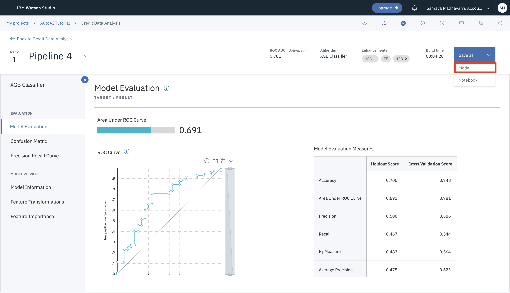

モデルの名前や説明（オプション）などを入力するウィンドウが開きます。これらの項目を入力した後、**Save**をクリックします。

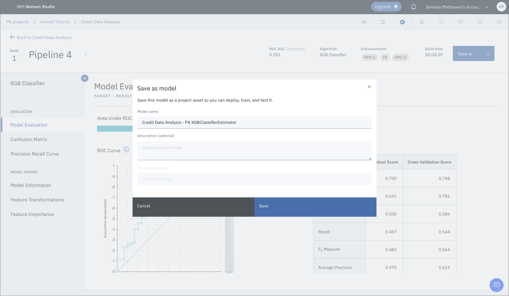

モデルがプロジェクトに保存されたことを示す通知が表示されます。**プロジェクトで表示**をクリックします。

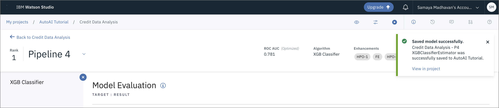

#### モデルのデプロイとテスト

1. 保存したばかりのモデルを表示するには、Assets タブに切り替えます。「Models」セクションにスクロールし、保存したばかりのモデルをクリックします。

    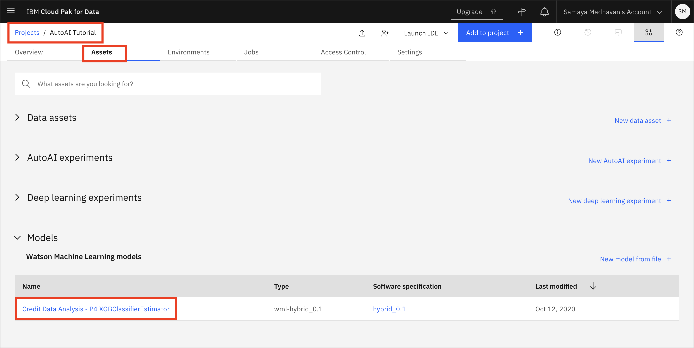

1. モデルを配置できるようにするには、「**Promote to deployment space**」をクリックします。

    

1. 以下のビデオを参照して、次の手順を実行します。

    

1. デプロイ後に提供されるインターフェースから、モデルをテストすることができます。入力内容は、JSON形式で入力するか、インターフェイスにあるフィールドに入力内容を入力することができます。

    * JSON形式での入力
    

    * フィールドへの入力
    