It was inevitable to expect artificial intelligence, which facilitates every aspect of our lives, to facilitate its own development process. Building better models requires more complex time-intensive and costly AI procedures, which require expertise from cleansing the data to feature engineering, designing the architectures to parameter optimization. To ease this process and make it efficient in terms of time and effort, you need to automate these workloads. With the aim of creating AI for AI, IBM introduced a service on Watson&trade; Studio called [AutoAI](https://dataplatform.cloud.ibm.com/docs/content/wsj/analyze-data/autoai-overview.html). AutoAI can be run in public clouds and in private clouds, including IBM Cloud Pak&trade; for Data.

AutoAI is a service that automates machine learning tasks to ease the tasks of data scientists. It automatically prepares your data for modeling, chooses the best algorithm for your problem, and creates pipelines for the trained models.

## Learning objectives

This tutorial explains the benefits of the AutoAI service on a use case so you can have a better understanding of how regression and classification problems can be handled without any code and how the tasks (feature engineering, model selection, hyperparameter tuning, etc.) are done with this service. The tutorial also includes details for choosing the best model among the pipelines and how to deploy and use these models.

## Prerequisites

To follow along, you must:

* Sign up for an [IBM Cloud account](https://cloud.ibm.com/registration?cm_sp=ibmdev-_-developer-tutorials-_-cloudreg).
* Create a Cloud Object Storage service instance.
* Create a Watson Studio service instance.
* Create a Watson Machine Learning service instance.
* Have basic knowledge of machine learning algorithms.

## Estimated time

This tutorial takes approximately 20 minutes to complete, including the training in AutoAI.

## Steps

After creating an IBM Cloud account and signing in, you can follow these steps.

### Step 1: Create required service instances

#### Object Storage

To store the data, you need a storage service to be linked with your project later. To do that, search for Storage in the [IBM Cloud Catalog](https://cloud.ibm.com/catalog?search=object%20storage&category=storage&cm_sp=ibmdev-_-developer-tutorials-_-cloudreg) or go to the Storage tab from the left menu on the same page and click the **Object Storage** service.

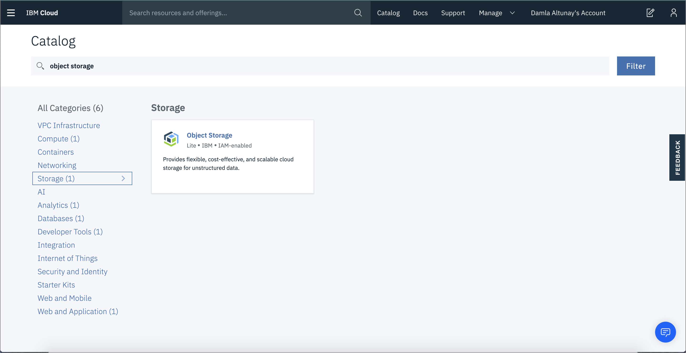

Optionally, you can name this service instance and click **Create**.

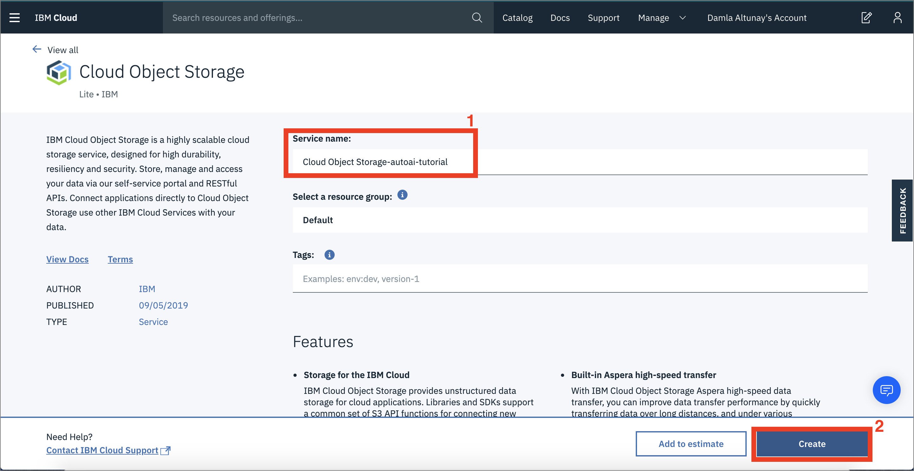

#### Watson Studio

1. Search for Watson Studio in the [IBM Cloud Catalog](https://cloud.ibm.com/catalog?search=studio&cm_sp=ibmdev-_-developer-tutorials-_-cloudreg), and click the **Watson Studio** service tile.

    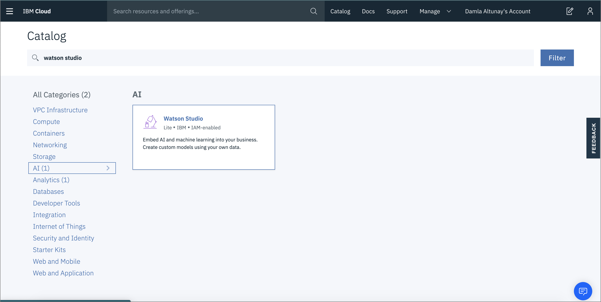

1. As you did with the Object Storage service, you can name your service and click **Create**.

    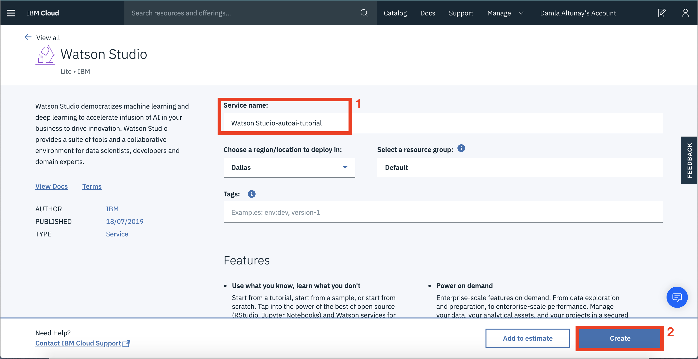

1. After provisioning the Watson Studio service, click **Get Started** or go to the [Watson Studio](https://dataplatform.cloud.ibm.com/?cm_sp=ibmdev-_-developer-tutorials-_-cloudreg) platform and log in with your IBM Cloud account.

    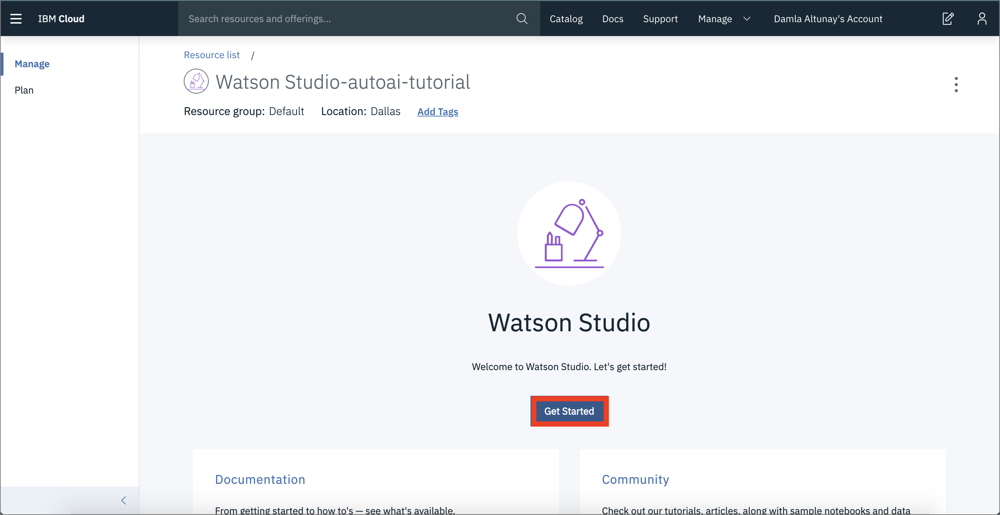

1. Review the introductory tutorial to learn more about Watson Studio.

### Step 2: Train a model with AutoAI

Watson Studio is an integrated platform designed to organize your project assets, like data sets, collaborators, models, notebooks. You are going to use Watson Studio to create a project in which you train a model with AutoAI and deploy this trained model.

#### Create a Watson Studio project

1. Click **Create a Project**.

    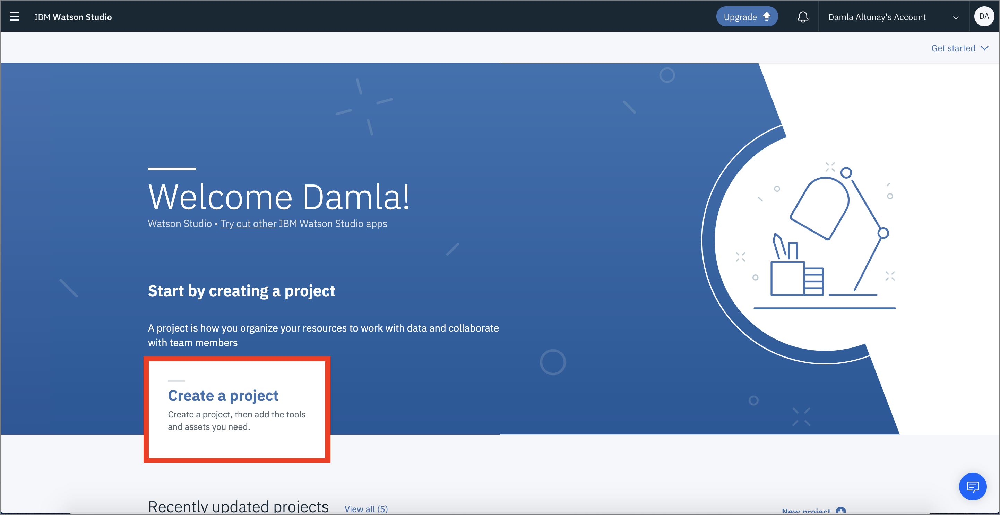

1. Select **Create an empty project**.

    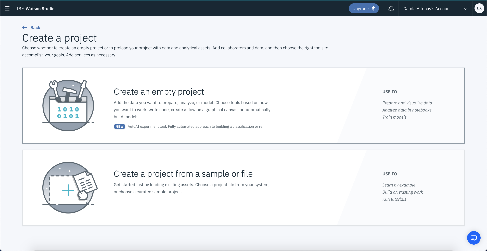

1. Name your project. Select a service from the drop-down menu.

    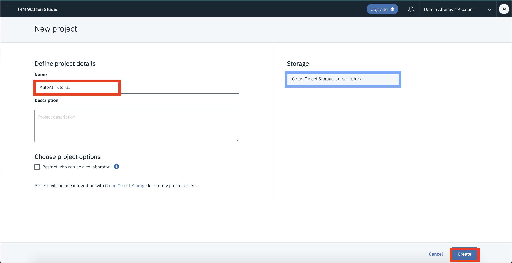

1. The data assets page opens and is where your project assets are stored and organized. By clicking the **Assets** bar, you can load your data set from the left interface.

1. Upload the [german_credit_data.csv](static/german_credit_data.csv) data set.

    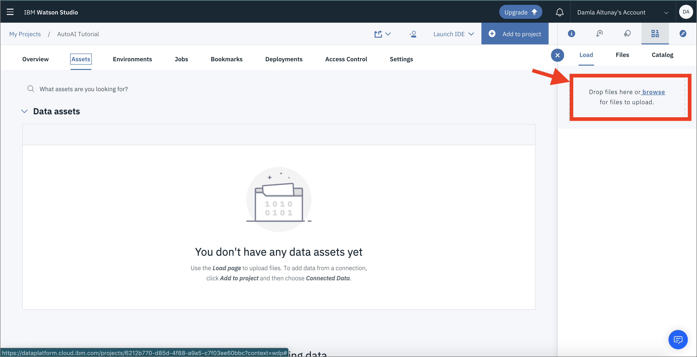

#### Set up your AutoAI environment and generate pipelines

1. To start the AutoAI experience, click **Add to Project** from the top and select **AutoAI**.

    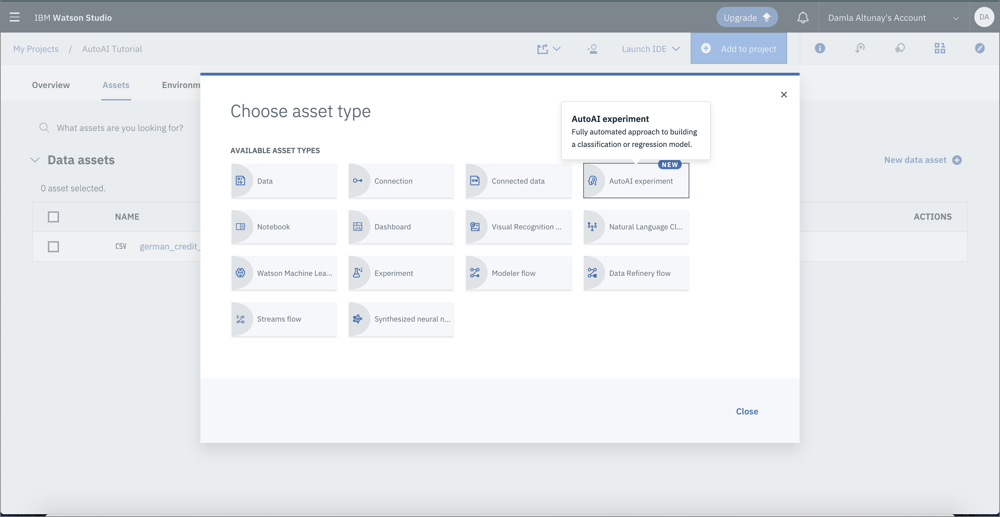

1. Name your service.

    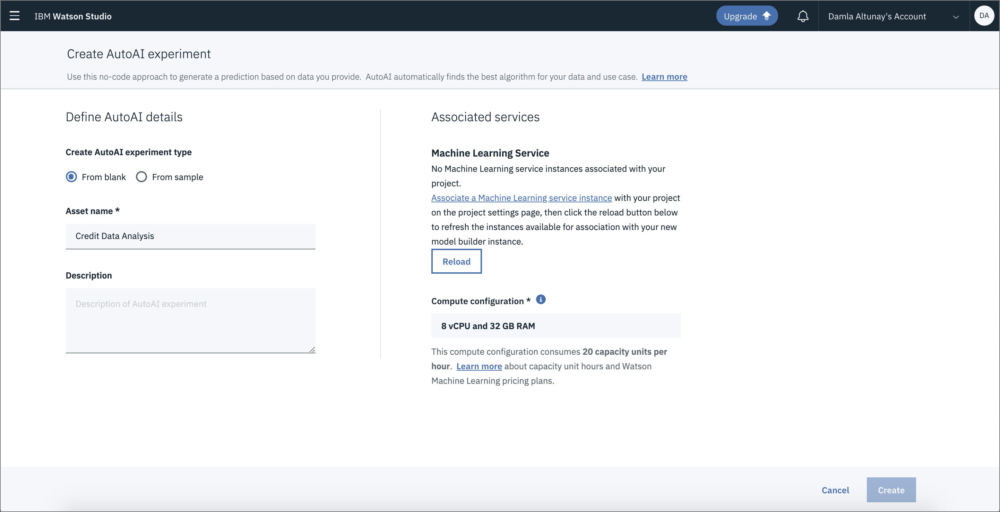

1. To associate a **Watson Machine Learning** instance, click to the given link. If you have an existing instance, select it from the existing tab. If not, create a new one from the New tab.

    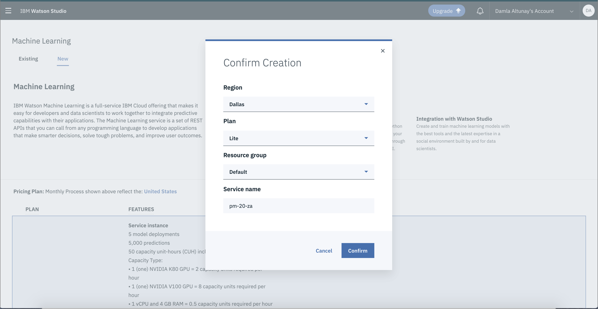

1. After provisioning your Watson Machine Learning instance, it redirects you to the same page. Click **Reload**, then **Create**.


#### Information about the data set

Minimizing the risk along with maximizing the profit requires some basic rules for the banks. One necessity is that they need to minimize their loss in any interaction with the customer, such as in giving loans. The aim of this data set is to predict whether the customer will be able to repay the loan by considering their applicants' demographic and socio-economic profiles.

* If the applicant is a good credit risk (i.e., is likely to repay the loan), then not approving the loan to the person results in a loss of business to the bank.
* If the applicant is a bad credit risk (i.e., is not likely to repay the loan), approving the loan to the person results in a financial loss to the bank.
* The data set consists of 1,000 loan applicants' data points with 20 variables each: seven are numerical, and 13 are categorical. We do not go into detail about the variables of this data set. You can check all [detailed information](https://archive.ics.uci.edu/ml/datasets/Statlog+%28German+Credit+Data%29).

#### Set up AutoAI instance

Use the following steps to set up your AutoAI instance.

1. Select your data set (you can upload it from your local system or select it from the project).
1. Set the column to predict to **Result**.
1. Change the optimized metric to **ROC AUC** (Area under the ROC Curve).
1. Set the number of top performing algorithms to consider to three. By default, AutoAI selects the top two performing algorithms, but you can change the number from 1 to 4.

 

#### AutoAI pipeline

The experiment begins just after you complete the previous processes.

After data preprocessing, AutoAI identifies the top three performing algorithms and for each of these three algorithms, AutoAI generates the following 4 pipelines.

* Automated model selection (Pipeline 1)
* Hyperparameter optimization (Pipeline 2)
* Automated feature engineering (Pipeline 3)
* Hyperparameter optimization (Pipeline 4)

In this manner, AutoAI generates a total of 12 pipelines that you can view, compare, and save as models.

#### Visualizing pipelines

While AutoAI is generating the models, there are two different views through which you can visualize the progress of these pipelines being created. They are the progress map and the relationship map as seen in the following images. You see that AutoAI has choosen XGB, Random Forest, and Decision Tree Classifiers as the top performing algorithms for this use case.

The following figure shows the relationship map with the relations between each of these pipelines. Hover over the map to view more information.

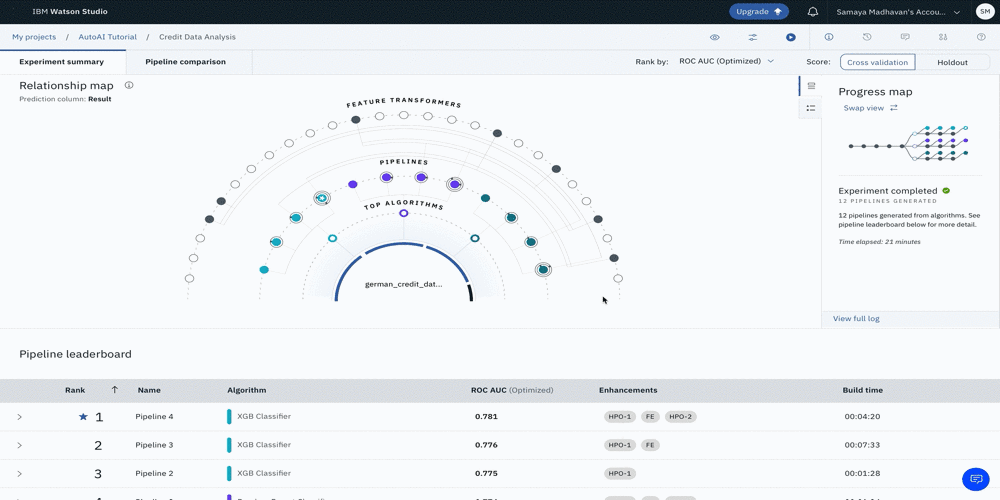

The following figure shows the progress map with the sequence and details of the 12 pipelines created on the whole.

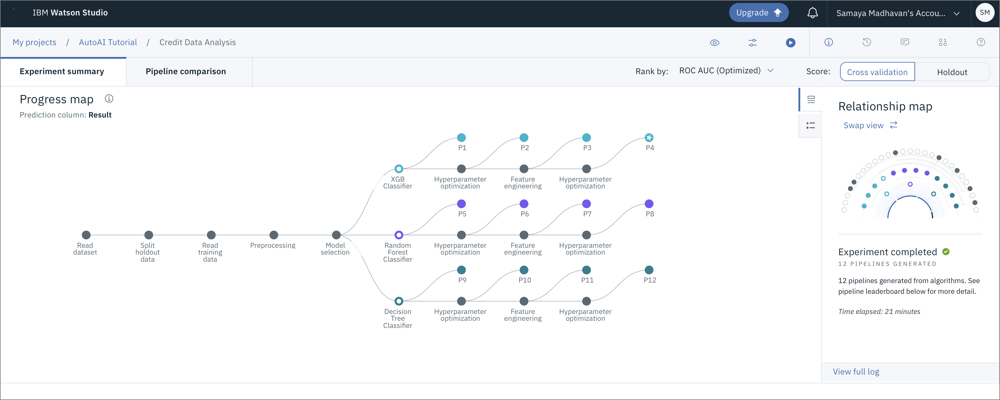

The following figure shows the view of the pipeline leaderboard with the details of all the 12 pipelines along with highlevel metrics. We infer that the XGB classifier with two sets of hyperparameter optimization and feature engineering has generated the best possible model. This is the fourth pipeline in the sequence.

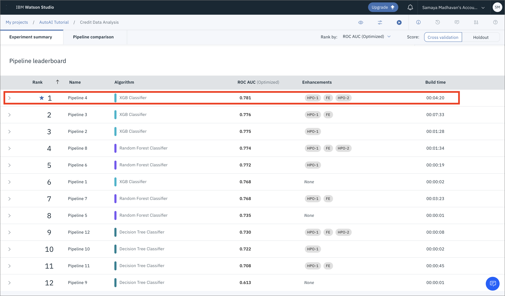

AutoAI also provides a visual to compare how each of these models performs based on different metrics.

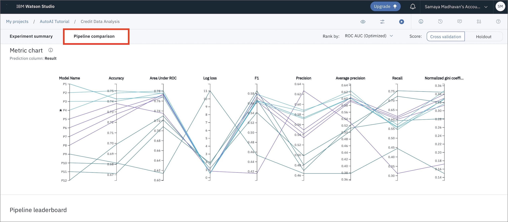

The next step is to select the model that gives the best result by looking at the metrics. In this case, Pipeline 4 gave the best result with the metric "Area under the ROC Curve (ROC AUC)." You can view the detailed results by clicking the corresponding pipeline from the leaderboard. Additionally, you can save your model pipeline by clicking **Save as**, and then choosing **Model** from the leaderboard or pipeline page. You are going to simply save the model that gave the best result for us.

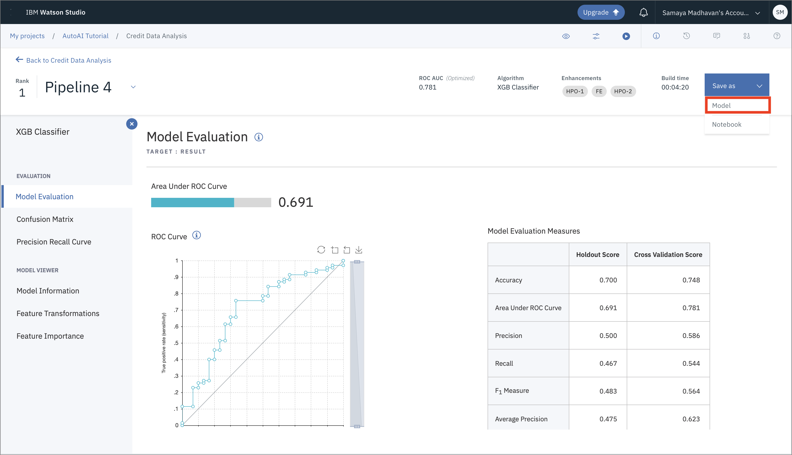

A window opens that asks for the model name, description (optional), and so on. After completing these fields, click **Save**.

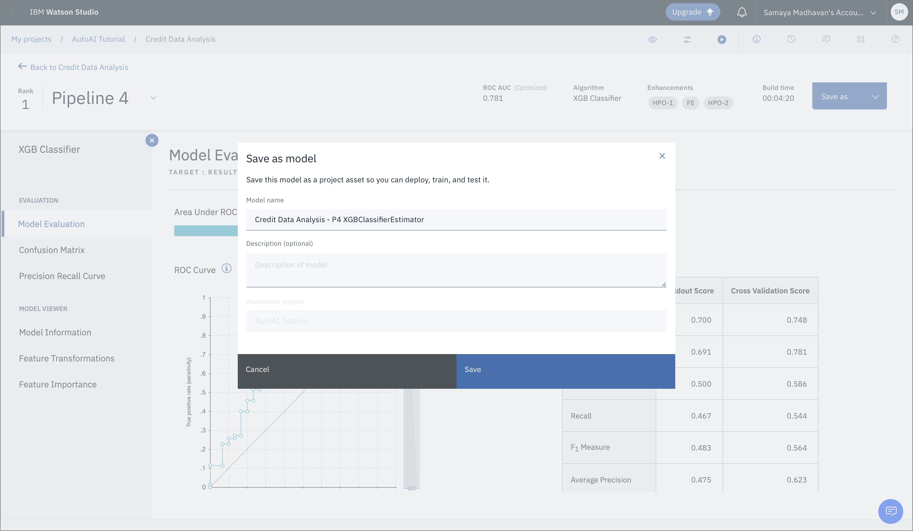

You receive a notification to indicate that your model is saved to your project. Click **View in project**.

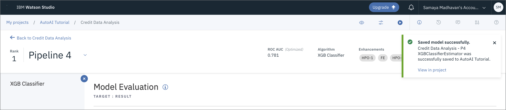

#### Deploy and test the model

1. To view the model you just saved, switch to the Assets tab. Scroll to the Models section, and click the model you just saved.

    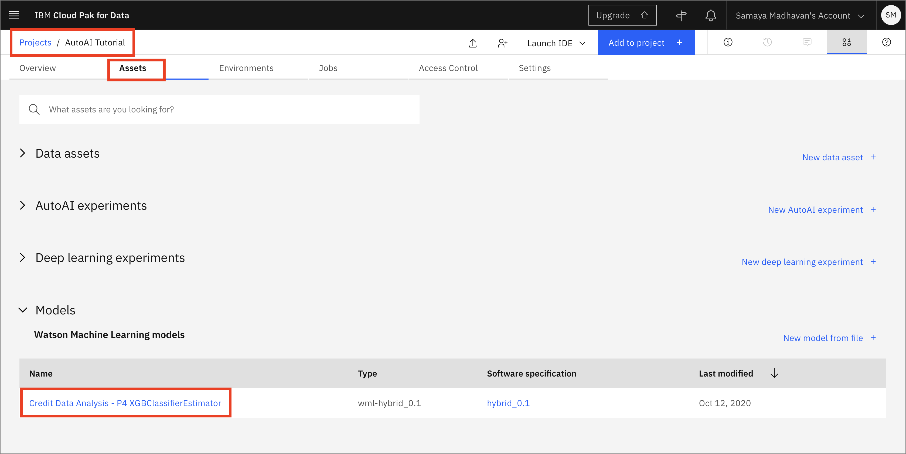

1. To make the model ready for deployment, click **Promote to deployment space**.

    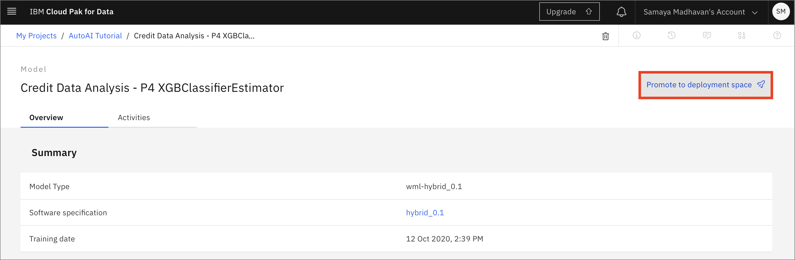

1. Refer to the following video for the next steps.

    

1. Now you can test your model from the interface that is provided after the deployment. You can either provide your input in JSON format or enter the input details to the fields given in the interface.

    * Input with JSON format
    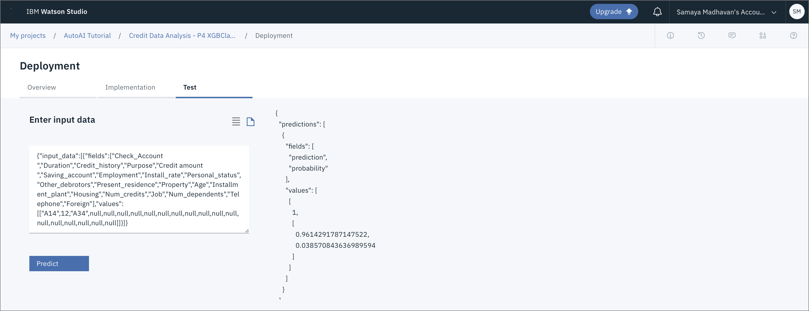

    * Input to the fields
    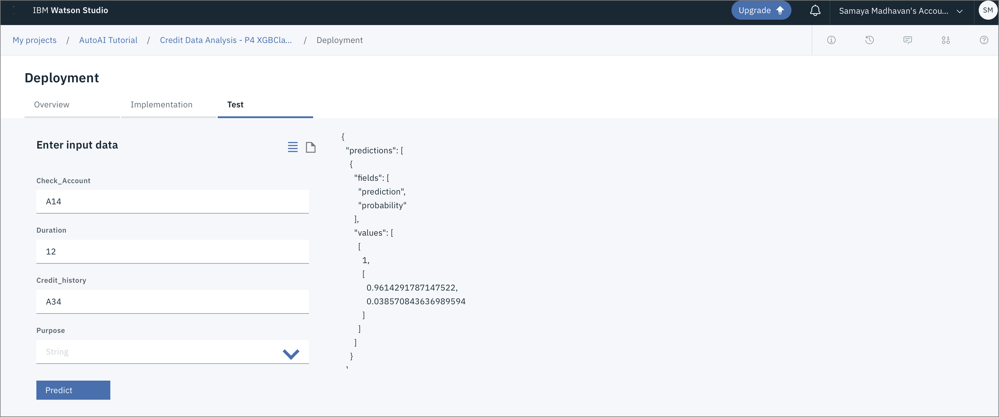

     ```json
    Input data:
    {"input_data": [{"fields": ["Check_Account ", "Duration", "Credit_history", "Purpose", "Credit amount ", "Saving_account", "Employment", "Install_rate", "Personal_status", "Other_debrotors", "Present_residence", "Property", "Age", "Installment_plant", "Housing", "Num_credits", "Job", "Num_dependents", "Telephone", "Foreign"],
                                 "values": [["A14", "48", "A34", "A43", "3573", "A65", "A75", "4", "A93", "A101","1","A121","47","A143","A152","1","A173","1","A192","A201"]]}]}
    ```

1. You can also use deployed models in your applications by making API calls. To show a use case, call your model from the notebook. To do this, go back to your Project Assets page and click **Add to project** and select **Notebook**.

    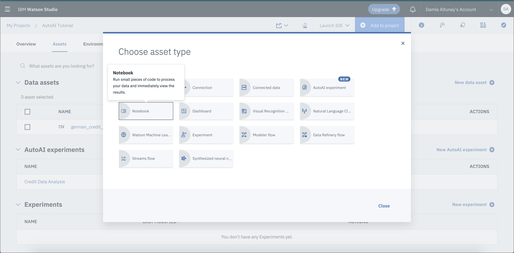

    You can create notebooks in three ways:
      * Create a blank notebook.
      *  Import a notebook file (.ipynb) from your local device.
      *  Import a notebook from URL.

    In this demo, you are going to upload a notebook from [Test WML model.ipynb](static/Test-WML-model.ipynb).

    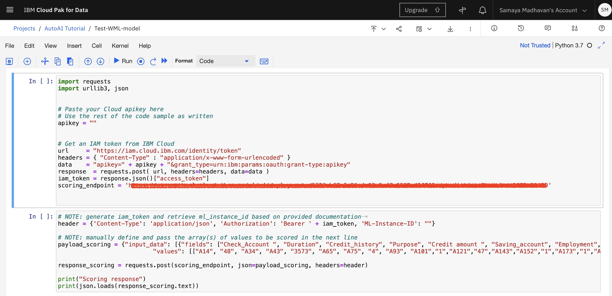

1. In the first cell, enter your IBM Cloud API key. At the end of this cell, you are given an access token from IBM Cloud. The second cell is the part where you call the model and make predictions.

    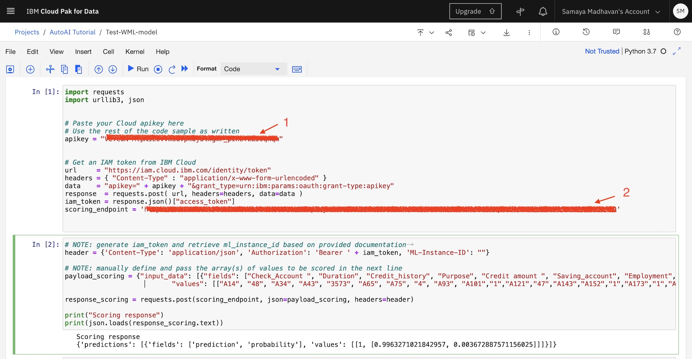

## Conclusion

In this tutorial, we explained how to train your model with the AutoAI Watson service. Along with this training process, you have learned how to deploy and test the models. You also gained an understanding of how to make an API call for the deployed model through a notebook.