このチュートリアルでは、IBM Watson OpenScale を使用して、人工知能 (AI) モデルの公平性と正確性を監視する方法を学びます。Watson OpenScale が公平性の問題を軽減するために *デバイアス* モデル・エンドポイントを自動的に生成し、モデルがどのように予測を行うかを理解するのに役立つ *説明可能性* ビューを提供する方法を実際に見ます。さらに、Watson OpenScale がどのように *drift detection* を使用するかを確認します。ドリフト検出は、ランタイムデータがトレーニングデータと矛盾している場合や、ドリフトが増加している場合には、精度の低下につながる可能性の高いデータであることを教えてくれます。

このチュートリアルは、IBM Cloud Pak for Data または IBM Cloud 上で動作します。自動化されたセットアップは、サンプル・モデルを使ってすぐに始められるように使用されます。

## 公平なユースケース

このチュートリアルで使用するモデルは、クレジット・リスクの予測モデルです。データセットにはローン申請者のデータが含まれており、"リスク "または "リスクなし "を予測するために使用されます。このデータにはセンシティブとされる 2 つの属性、`sex`（性別）と`age`が含まれています。このモデルに Watson OpenScale を使用することで、クレジット・リスク予測器における性別差別を検出し、説明し、修正することができます。

## 自動セットアップ

自動セットアップでは、バックグラウンドでタスクを実行することで、プロセスをガイドします。自動化されたセットアップ・ツアーは、可能な限りユーザーとのインタラクションを少なくして動作するように設計されています。以下のような判断を自動的に行ってくれます。

* 複数の IBM Watson Machine Learning インスタンスがセットアップされている場合、インストールプロセスは API 呼び出しを実行してインスタンスをリストアップし、結果としてリストの最初に表示される Watson Machine Learning インスタンスを選択します。

* Watson Machine Learning インスタンスの新しい lite バージョンを作成するために、Watson OpenScale インストーラは IBM Cloud アカウントのデフォルトのリソースグループを使用します。

自動セットアップの最後にはガイドツアーが表示され、**Next** をクリックしてシナリオを進めると、Watson OpenScale の主要な機能がハイライトされます。ツアーを終了すると（どの時点でも終了できます）、自分で UI を探索することができます。クレジット・リスク・モデルが自動的にデプロイされているので、何かを探索することができます。このチュートリアルでは、信用リスクモデルを使用して、Watson OpenScale の機能を探索するのに役立ちます。

## 見積もり時間

このチュートリアルを完了するには、約 45 分かかります。

## 手順

このチュートリアルでは、以下の方法を学びます。

1. [Watson OpenScale サービスをプロビジョニングする](#provision-a-watson-openscal-service)
1. [Insights ダッシュボードを使用する](#use-the-insights-dashboard)
1. [アナリティクスツールの使用](#using the analytics-tools)

## Watson OpenScale サービスをプロビジョニングする

>注：Watson OpenScale では、サービスの複数のインスタンスをプロビジョニングできるようになりました。以下の手順では、デフォルトのサービスインスタンス（インストール後に自動的にプロビジョニングされる）を構成することを想定しています。

#### IBM Cloud Pak for Data プラットフォーム上で

このセクションでは、IBM Cloud Pak for Data プラットフォーム上で Watson OpenScale をプロビジョニングする方法を説明します。IBM Cloud を使用している場合は、[On IBM Cloud](#on-ibm-cloud) のセクションにスキップしてください。

1. Cloud Pak for Data インスタンスで、(☰)メニューを開き、「**Services**」で「**Instances**」をクリックします。

    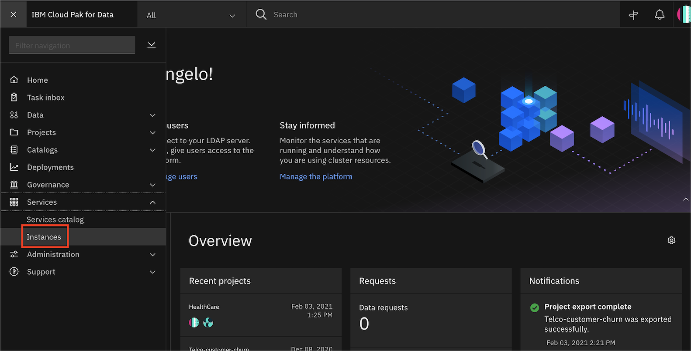

1. InstancesのテーブルからOpenScale-defaultインスタンスを探し、3つの縦のドットをクリックしてアクションメニューを開きます。次に、「**Open**」をクリックします。

    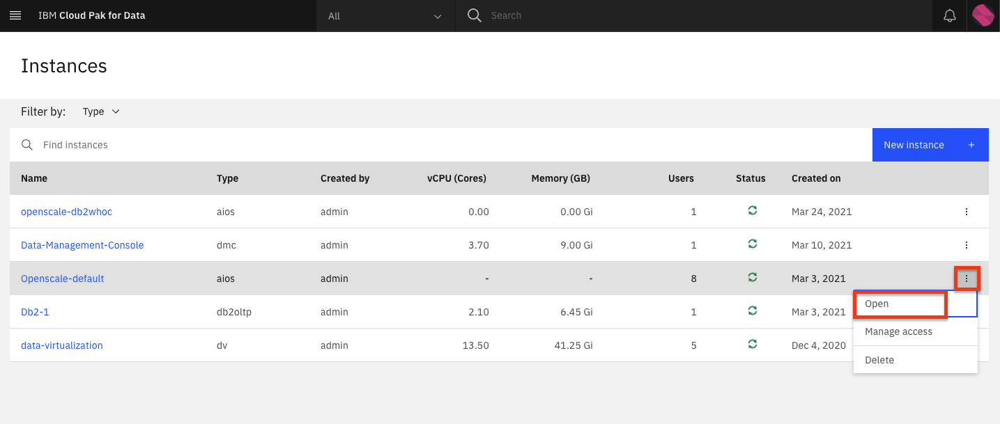

1. OpenScale を初めて起動するため、自動セットアッププロセスを開始するためのウェルカムメッセージが表示されます。「**Auto setup**」をクリックします。

    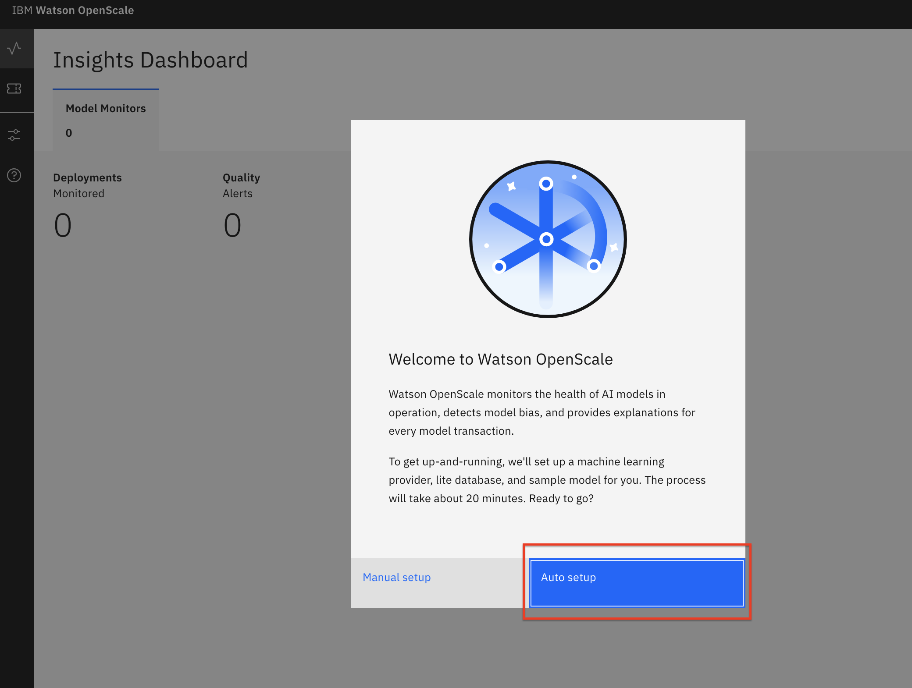

1. [Connect to Watson Machine Learning] パネルで、同じクラスターにデプロイされた Watson Machine Learning インスタンスを使用しているため、デフォルトのままにします。**Next** をクリックします。

    

1. [Connect to your database]パネルで、ローカルDb2データベース（管理者ガイドの前のセクションでプロビジョニングしたデータベース）の接続詳細を入力し、[**Next**]をクリックします。

  

    **Note:** Db2 Warehouse on Cloudを使用した場合、Use SSLのチェックボックスを選択する必要があります。ただし、証明書を用意する必要はありません。

    モデルの自動セットアップは、実行に時間がかかります。

    

    完了した後、成功した場合はメッセージが表示されます。

    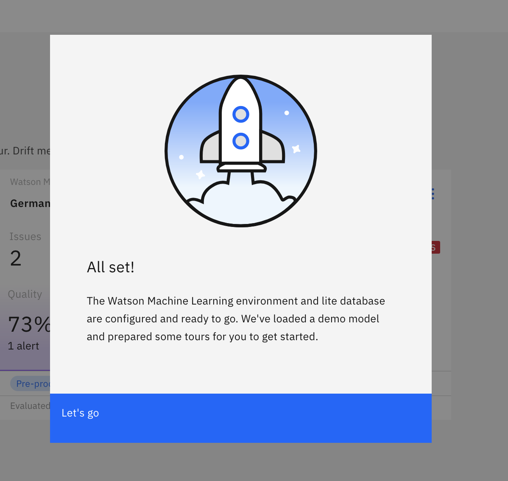

1. デプロイしたモデルの Insights ダッシュボードをクリックして、ページが読み込まれることを確認します。

1. 他のユーザーに OpenScale インスタンスへのアクセスを許可する必要がある場合は、(☰)メニューの「**サービス**」で「**インスタンス**」をクリックします。

    

1. InstancesテーブルからOpenScale-defaultインスタンスを探し、3つの縦のドットをクリックしてアクションメニューを開きます。次に、「**アクセスの管理**」をクリックします。

    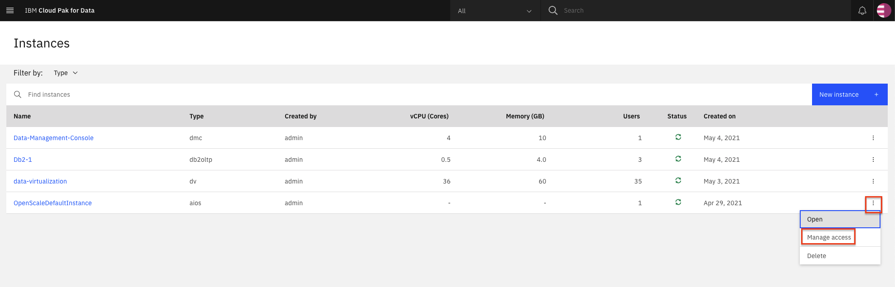

1. サービスインスタンスにユーザーを追加するには、「**ユーザーの追加**」をクリックします。

    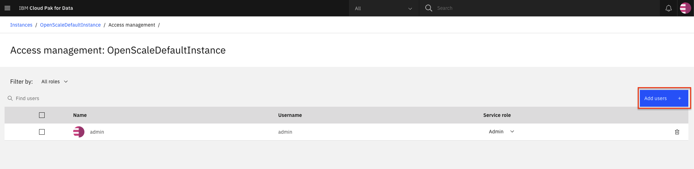をクリックします。

1. すべてのユーザーアカウントについて、各ユーザーの役割として**Editor**を選択し、**Add**をクリックします。

    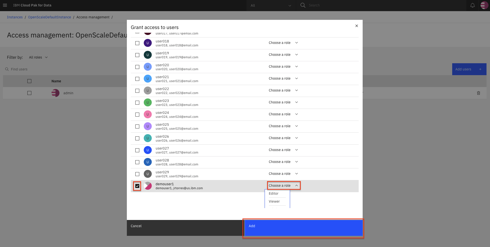を参照してください。

#### On IBM Cloud

1. IBM Cloud のアカウントを持っていない場合は、<a href="https://cloud.ibm.com/registration?cm_sp=ibmdev-_-developer-tutorials-_-cloudreg">アカウント</a>に登録します。

1. <a href="https://cloud.ibm.com/catalog/services/watson-openscale?cm_sp=ibmdev-_-developer-tutorials-_-cloudreg">カタログ</a>からWatson OpenScaleインスタンスを作成します。

1. Lite プランを選択し、サービス名を入力して、「**Create**」をクリックします。

1. **Launch Application** をクリックして、Watson OpenScale を起動します。

1. **Auto setup**をクリックして、サンプルデータを使ってWatson OpenScaleインスタンスを自動的にセットアップします。

    

1. **Start tour** をクリックして、Watson OpenScale ダッシュボードを見学します。

## Insights ダッシュボードを使う

OpenScale サービスを起動する。

1. (☰)ナビゲーションメニューに移動し、**Services -> Instances**をクリックします。

    

1. 管理者がプロビジョニングしたOpenScaleインスタンスの横にある3つの縦のドットをクリックして、**Open**をクリックします。

    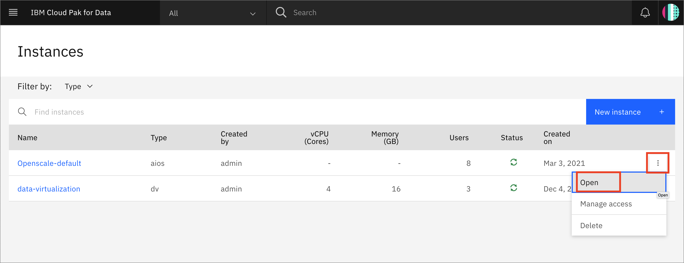

それでは、ツールを使ってみましょう。

1. OpenScaleはInsights Dashboardをロードし、監視しているすべてのモデルのタイルを含みます。「GermanCreditRiskModelICP」タイルが、このチュートリアルで使用するタイルです。このタイルはAuto setupスクリプトを使って設定しました。

1. 左側の［洞察］アイコンをクリックし、［モデルモニター］タブにいることを確認してから、GermanCreditRiskModelICPモデルタイルを開きます。3ドットメニューをクリックして、「**詳細を見る**」をクリックします。

    

1. 各種モニター（Fairness、Quality、Drift）に表示されている赤色の警告インジケータに注目します。「Fairness」の下に赤いインジケータが表示されているはずです。**Fairness score**をクリックします。

    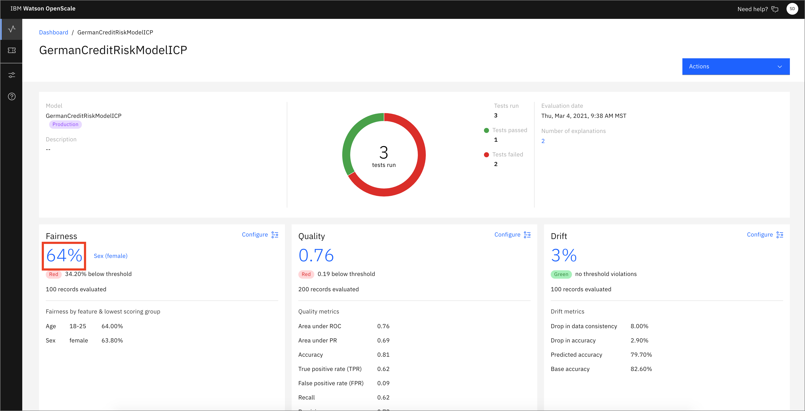

1. 「公正さ」→「性別」の下にある「！」の付いた三角形をクリックします。これは、Fairnessモニターでこの属性に対するアラートが発生したことを示します。アラートは、フェアネスの結果のしきい値に基づいて設定可能で、必要に応じて設定・変更できます。

    トレンドチャートの上にマウスポインタを移動させると、値が変化するのがわかります。グラフが赤いしきい値ラインを下回っているタイムスライスを見つけてクリックしてください。これは、公平性のレベルが所定の最小値を下回っており、その時間帯の取引の一部に偏りがあることを示しています。

    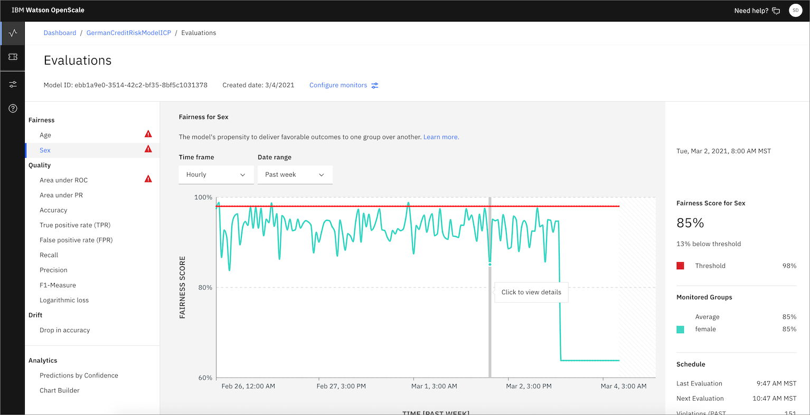

1. 期間のいずれかをクリックすると、「ノーリスク」の結果を得た女性の数と男性の数を示す棒グラフなど、フェアネスモニターの詳細が表示されます。**計算を見る**をクリックすると、フェアネススコアの計算方法が表示されます。**View payload transactions**（ペイロードトランザクションの表示）をクリックします。

    

    トランザクションのリストが表示されます。「Group Bias」にチェックマークが付いていて、「Risk」という予測が付いている「Group - Female」という監視対象グループの1つを探します。**Explain prediction**をクリックします。公平性監視のグラフの期間にこの要素が含まれていない場合、見つかるまで戻って別の期間を選択します。これにより、説明がより面白くなります。

    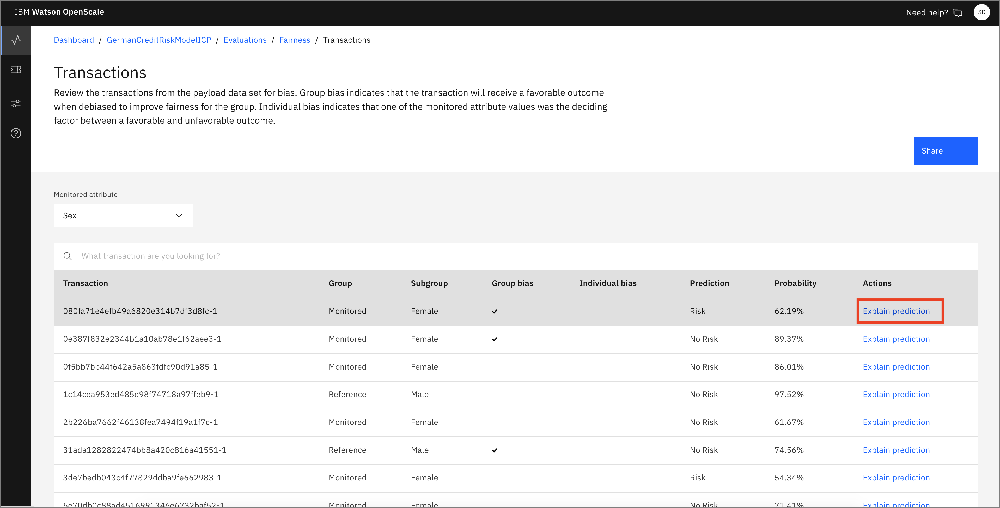

    **Note:** 個々のトランザクションは、その詳細を見るために調べることができます。これを行うと、後で見るようにそのトランザクションがキャッシュされます。Explainability機能では、わずかに乱れたデータのバリエーションを使用してエンドポイントに何千回ものRESTコールを行う必要があることに注意してください。この処理には数秒かかることがあります。

1. 個々のトランザクションの「説明」タブで、この予測にとって最も重要な機能の相対的な重みを確認します。データを調べて、「**Inspect**」タブをクリックします。

    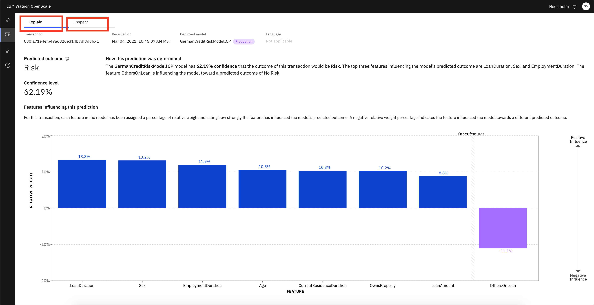

1. このトランザクションのInspectビューでは、この予測を導いた元の機能に加えて、各機能を変更する機能を提供する一連のドロップダウンメニューと入力ボックスが表示されています。どの機能が結果（この場合は「リスク」から「ノーリスク」）を変えるかは、「**ラン分析**」をクリックして確認できます。これには、データにわずかな摂動を加えたエンドポイントへの何千回ものRESTコールが必要なため、実行には数分かかることに注意してください。「分析の実行」をクリックします。

    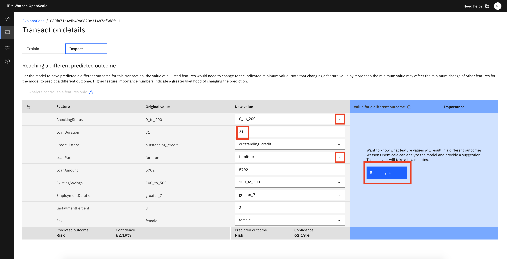

    この特定の取引では、ローンの保証人の存在が、結果を「リスク」から「ノーリスク」に変えるために必要な唯一の要素であることがわかります。他の取引では、異なる分析結果が得られる可能性があります。この例では、「Others on Loan」のドロップダウンメニューをクリックし、guarantorに変更することができます。

    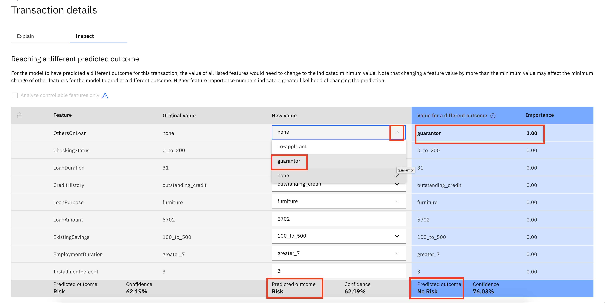

1. 保証人にこの新しい値を選択すると、新しい値をスコアするためのボタンが表示されます。このボタンをクリックします。

    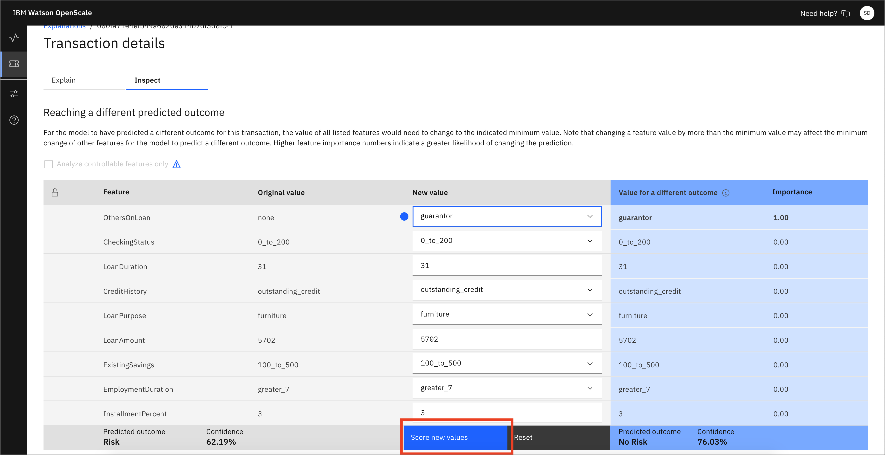

    この例では、結果が "Risk "から "No Risk "に変わっていることがわかります。

    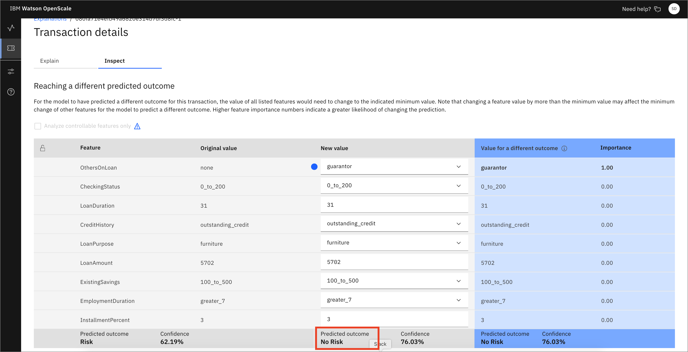

1. 「Insights」メニューのアイコンをクリックして、「Insights Dashboard」ページに戻ります。「モデルモニター」タブにいることを確認します。ここで、タイル上の3点メニューをクリックして、GermanCreditRiskModelICPモデルのモニター設定を開き、「**モニターの設定**」をクリックします。

    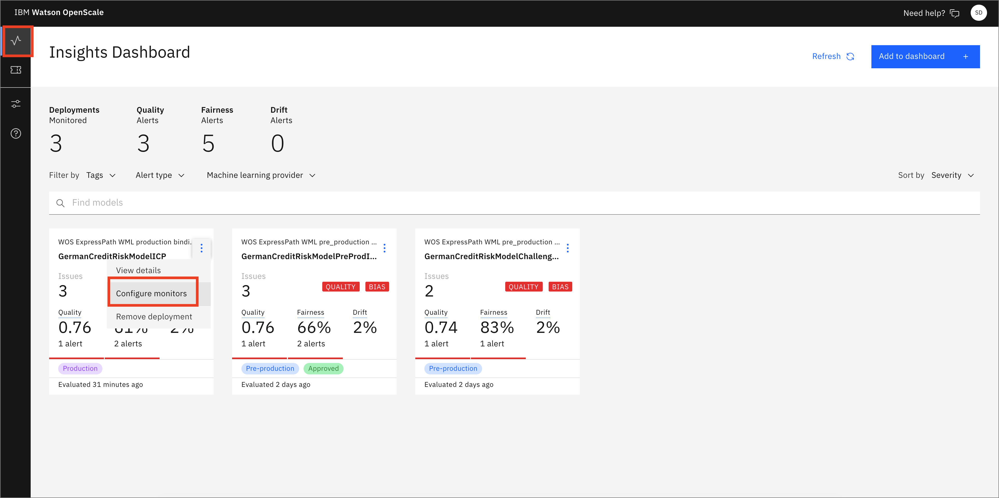

1. 「エンドポイント」メニューをクリックし、「エンドポイント」タブをクリックします。「Endpoints」ドロップダウンメニューを使用して、「**Debiased transactions**」を選択します。これは、設定された機能（つまり、SexとAge）に基づいて、信用リスク機械学習モデルのデバイアスされたバージョンを提供するRESTエンドポイントです。検出されたバイアスを除去しようとする推論を提示します。

    

cURL、Java言語、Pythonを使用したコードスニペットを見ることができ、スクリプトやアプリケーションで使用することができます。

同様に、フィードバックロギングのエンドポイントを選択すると、フィードバックロギング用のコードを入手できます。これは、継続的な品質評価のための新鮮なテストデータを送信するためのエンドポイントを提供します。ここにフィードバックデータをアップロードするか、開発者と協力して提供されたコードスニペットを統合し、Watson OpenScale データベースにフィードバックデータを公開することができます。

## アナリティクスツールの使用

Analytics ツールを使用するには、以下の手順に従います。

1. 左側の「インサイト」アイコンをクリックし、「モデルモニター」タブにいることを確認してから、GermanCreditRiskModelICPモデルタイルを開きます。3ドットメニューをクリックして、「**詳細を見る**」をクリックします。

    

1. 各種モニター（Fairness、Quality、Drift）に表示されている赤色の警告インジケータに注目します。「Fairness」の下に赤いインジケータが表示されているはずです。**Fairness score**をクリックします。

    

1. **Analytics -> Predictions by Confidence**をクリックします。チャートの作成には少し時間がかかります。ここでは、信頼度と "Risk "と "No Risk "の予測を示す棒グラフが表示されています。

    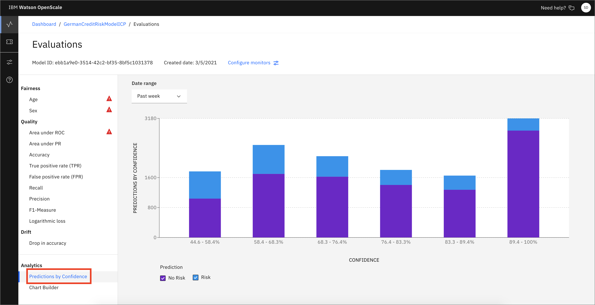

1. このダッシュボードから、**Analytics -> Chart Builder**をクリックします。ここでは、機械学習モデルのさまざまな測定値、特徴、およびディメンションを使用してチャートを作成することができます。ここでは、信頼度別に予測値を分類したチャートをご覧いただけます。

    **注意：**データを読み込むために、「Past Week」や「Yesterday」の日付範囲をクリックする必要があるかもしれません。

1. 値を変更して、作成されたチャートを試してみてください。

    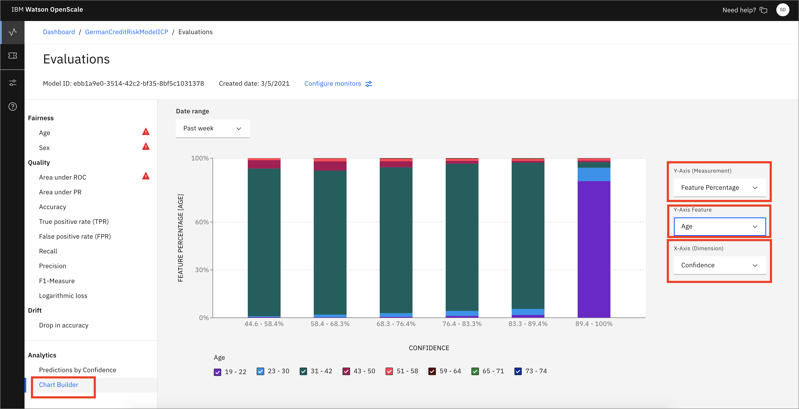

## Conclusion

このチュートリアルでは、Watson OpenScale ツールを使用して、多くの GUI 機能のウォークスルーを行います。自動セットアップのデプロイメントでは、機械学習モデルを作成してデプロイし、過去のデータを挿入して、本番で長期間使用されているモデルをシミュレートします。OpenScale モニターが構成され、その後、様々なメトリクスやデータを探索することができます。