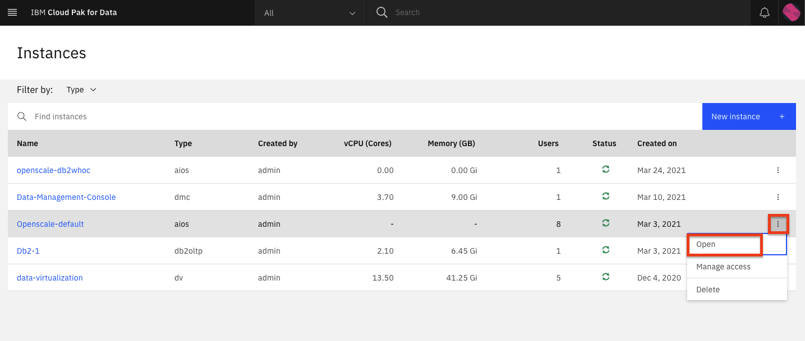
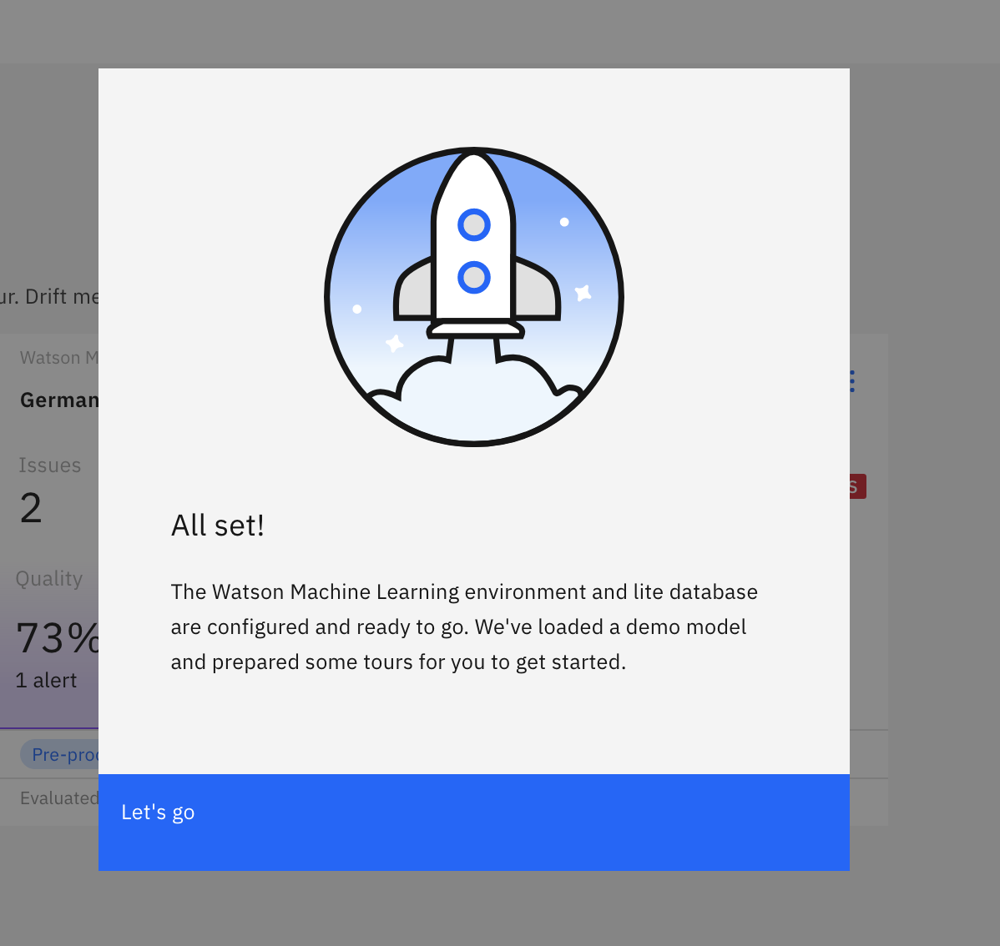
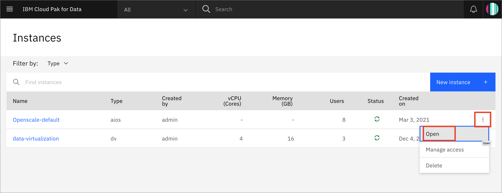
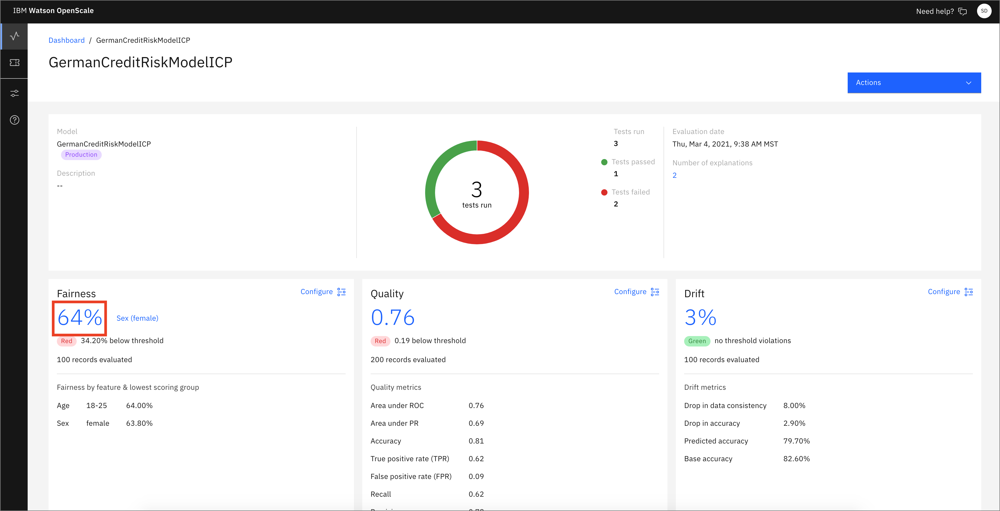
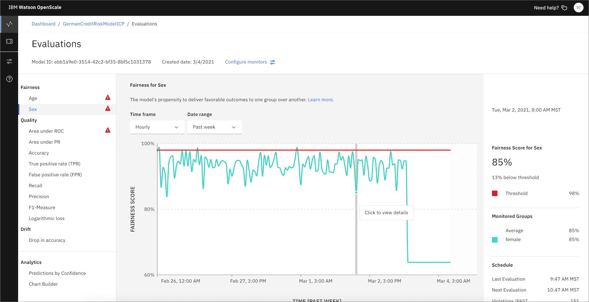
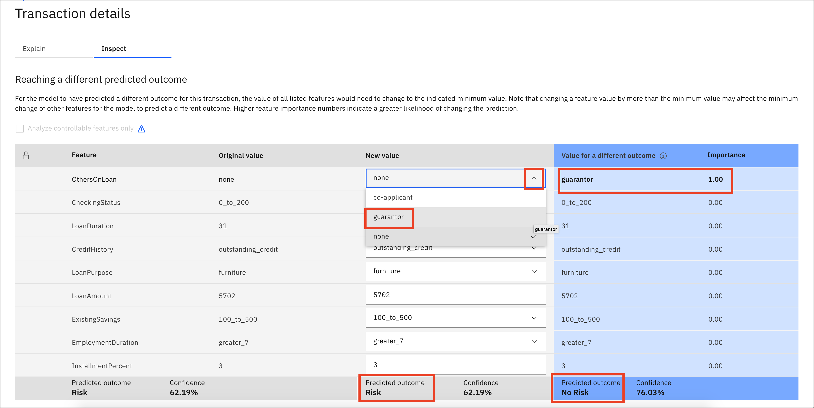
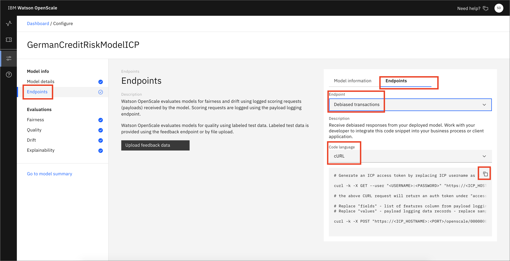

In this tutorial, learn how you can use IBM Watson OpenScale to monitor your artificial intelligence (AI) models for fairness and accuracy. You get a hands-on look at how Watson OpenScale automatically generates a *debiased* model endpoint to mitigate your fairness issues and provides an *explainability* view to help you understand how your model makes its predictions. In addition, you see how Watson OpenScale uses *drift detection*. Drift detection tells you when runtime data is inconsistent with your training data or, if there is an increase in drift, that the data that is likely to lead to lower accuracy.

This tutorial works with IBM Cloud Pak for Data or on IBM Cloud. The automated setup is used to get you started quickly with an example model.

## The fairness use case

The model used in this tutorial is a credit risk predictor. The data set contains loan applicant data and is used to predict "Risk" or "No Risk." The data includes two attributes that are considered sensitive: `sex` (gender) and `age`. Using Watson OpenScale with this model, you are able to detect, explain, and fix gender discrimination in the credit risk predictor.

## Automated setup

The automated setup guides you through the process by performing tasks for you in the background. The automated setup tour is designed to work with the least possible user interaction. It automatically makes the following decisions for you:

* If you have multiple IBM Watson Machine Learning instances set up, the installation process runs an API call to list the instances and chooses the Watson Machine Learning instance that appears first in the resulting list.

* To create a new lite version of a Watson Machine Learning instance, the Watson OpenScale installer uses the default resource group for your IBM Cloud account.

The automated setup ends with a guided tour, which highlights key features of Watson OpenScale as you move through the scenario by clicking **Next**. When you exit the tour (you can exit at any point), you can explore the UI on your own. The credit risk model was automatically deployed so that you have something to explore. This tutorial uses the credit risk model to help you explore the features of Watson OpenScale.

## Estimated time

It should take you approximately 45 minutes to complete this tutorial.

## Steps

In this tutorial, you learn how to:

1. [Provision a Watson OpenScale service](#provision-a-watson-openscale-service)
1. [Use the Insights Dashboard](#use-the-insights-dashboard)
1. [Use the Analytics tools](#using-the-analytics-tools)

## Provision a Watson OpenScale service

> Note: Watson OpenScale now allows for provisioning multiple instances of the service. The following steps assume that you configure the default service instance (which is automatically provisioned after installation).

#### On IBM Cloud Pak for Data platform

This section explains how to provision Watson OpenScale on the IBM  Cloud Pak for Data platform. If you're using IBM Cloud, skip to the [On IBM Cloud](#on-ibm-cloud) section.

1. In the Cloud Pak for Data instance, go the (☰) menu, and under **Services**, click **Instances**.

    

1. Find the OpenScale-default instance from the Instances table, and click the three vertical dots to open the action menu. Then, click **Open**.

    

1. Because this is the first time you are are launching OpenScale, you are presented with a welcome message where you can launch the auto setup process. Click **Auto setup**.

    

1. In the Connect to Watson Machine Learning panel, leave the defaults because you are using the Watson Machine Learning instance deployed in the same cluster. Click **Next**.

    

1. In the Connect to your database panel, enter the connection details for your local Db2 database (this is the database you provisioned in a previous section of the admin guide), and click **Next**.

  

    **Note:** If you used Db2 Warehouse on Cloud, you must select the Use SSL checkbox. However, you don't need to provide a certificate.

    The auto setup of a model will take some time to run.

    

    After it completes, you see a message if it succeeded.

    

1. Click through the Insights dashboard for the deployed models to make sure that the pages load.

1. If you need to give other users access to the OpenScale instance, go to the (☰) menu, and under **Services**, click **Instances**.

    

1. Find the OpenScale-default instance from the Instances table, and click the three vertical dots to open the action menu. Then, click **Manage access**.

    

1. To add users to the service instance, click **Add users**.

    

1. For all of the user accounts, select **Editor** as the role for each user, then click **Add**.

    

#### On IBM Cloud

1. If you do not have an IBM Cloud account, register for <a href="https://cloud.ibm.com/registration?cm_sp=ibmdev-_-developer-tutorials-_-cloudreg">an account</a>.

1. Create a Watson OpenScale instance from the <a href="https://cloud.ibm.com/catalog/services/watson-openscale?cm_sp=ibmdev-_-developer-tutorials-_-cloudreg">catalog</a>.

1. Select the Lite plan, enter a Service name, and click **Create**.

1. Click **Launch Application** to start Watson OpenScale.

1. Click **Auto setup** to automatically set up your Watson OpenScale instance with sample data.

    

1. Click **Start tour** to tour the Watson OpenScale dashboard.

## Use the Insights Dashboard

To launch the OpenScale service:

1. Go to the (☰) navigation menu, and click **Services -> Instances**.

    

1. Click the three vertical dots next to the OpenScale instance that your Administrator has provisioned, and click **Open**.

    

Now, let's interact with the tools.

1. OpenScale loads the Insights Dashboard, which contains tiles for any models being monitored. The GermanCreditRiskModelICP tile is the one you'll use for this tutorial. This tile was configured using the Auto setup script.

1. Click the Insights icon on the left, make sure that you are on the Model monitors tab, and then open the GermanCreditRiskModelICP model tile. Click the 3-dot menu, then click **View details**.

    

1. Notice the red alert indicators on the various monitors (Fairness, Quality, and Drift). You should see a red indicator under Fairness. Click the **Fairness score**.

    

1. Click on the triangle with the ! under **Fairness -> Sex**. This indicates that there has been an alert for this attribute in the Fairness monitor. Alerts are configurable, based on thresholds for fairness outcomes, which can be set and altered as needed.

    By moving your mouse pointer over the trend chart, you can see the values change. Find and click on a time slice where the graph is below the red threshold line. This indicates that the level of fairness is below the predetermined minimum and that some of the transactions at that time are biased.

    

1. After you click on one of the time periods, you see details of the Fairness monitor, including a bar chart that shows how many females received the "No Risk" outcome versus males. You can click **view calculation** to see how the fairness score is calculated. Click **View payload transactions**.

    

    You see a list of transactions. Look for one of the Monitored Group - Female with a `Group Bias` check mark and a Prediction of "Risk." Click **Explain prediction**. If the time period on the graph for Fairness Monitoring doesn't contain this element, go back and choose another time period until you can find one. This makes the explanation more interesting.

    

    **Note:** Each of the individual transactions can be examined to see them in detail. Doing so will cache that transaction as you see later. Be aware that the Explainability feature requires thousands of REST calls to the endpoint using variations of the data that are slightly perturbed. This can require several seconds to complete.

1. On the Explain tab for this individual transaction, you can see the relative weights of the most important features for this prediction. Examine the data, then click the **Inspect** tab.

    

1. In the Inspect view of this transaction, you can see the original features that led to this prediction as well as a series of drop-down menus and input boxes that offer the ability to change each feature. You can find which features will change the outcome (in this case, from "Risk" to "No Risk") by clicking **Run Analysis**. Note that this requires thousands of REST calls to the endpoint with slight perturbations in the data, so it can take a few minutes to run. Click **Run Analysis**.

    

    In this particular transaction, you see that the presence of a guarantor on the loan is the only thing required to flip the outcome from "Risk" to "No Risk." Other transactions might show a different analysis, so be aware that your results might vary from this. In this example, you can click the drop-down menu for Others on Loan and change to guarantor.

    

1. Choosing this new value for guarantor exposes a button for Score new values. Click this button.

    

    In this example, you see that the outcome has now been flipped from "Risk" to "No Risk."

    

1. Go back to the Insights Dashboard page by clicking on the Insights menu icon. Make sure that you are on the Model monitors tab. Now, open the monitor configuration for the GermanCreditRiskModelICP model by clicking the 3-dot menu on the tile, and then click **Configure monitors**.

    

1. Click the **Endpoints** menu, then the **Endpoints** tab. Use the Endpoints drop-down menu to select **Debiased transactions**. This is the REST endpoint that offers a debiased version of the credit risk machine learning model based on the features that were configured (that is, Sex and Age). It presents an inference that attempts to remove the bias that has been detected.

    

You can see code snippets using cURL, the Java language, and Python, which can be used in your scripts or applications.

Similarly, you can choose the Feedback logging endpoint to get code for Feedback Logging. This provides an endpoint for sending fresh test data for ongoing quality evaluation. You can upload feedback data here or work with your developer to integrate the code snippet provided to publish feedback data to your Watson OpenScale database.

## Using the Analytics tools

To use the Analytics tools:

1. Click the Insights icon on the left, make sure that you are on the Model monitors tab, and then open the GermanCreditRiskModelICP model tile. Click the 3-dot menu, then click **View details**.

    

1. Notice the red alert indicators on the various monitors (Fairness, Quality, and Drift). You should see a red indicator under Fairness. Click the **Fairness score**.

    

1. Click **Analytics -> Predictions by Confidence**. It might take a minute to create the chart. Here, you can see a bar chart that indicates confidence levels and predictions of "Risk" and "No Risk."

    

1. From this dashboard, click **Analytics -> Chart Builder**. Here, you can create charts using various Measurements, Features, and Dimensions of your machine learning model. You can see a chart that breaks down Predictions by Confidence.

    **Note:** You might need to click the date range for Past Week or Yesterday to load the data.

1. You can experiment with changing the values and examine the charts that are created.

    

## Conclusion

This tutorial provides a walkthrough of many of the GUI features using the Watson OpenScale tools. The Auto setup deployment creates a machine learning model, deploys it, and inserts historical data to simulate a model that has been used in production over time. The OpenScale monitors are configured, and you can then explore the various metrics and data.