---
also_found_in:
- learningpaths/dataops-fundamentals/
authors: ''
completed_date: '2021-07-20'
components:
- cloud-pak-for-data
draft: false
excerpt: ガバナンスルールとガバナンス成果物（カテゴリー、ビジネス用語、参照データセット、データクラス、分類、ポリシー）について学び、ヘルスケアのユースケースに必要なガバナンス成果物を作成します。
last_updated: '2021-09-27'
meta_description: ガバナンスルールとガバナンス成果物（カテゴリー、ビジネス用語、参照データセット、データクラス、分類、ポリシー）について学び、ヘルスケアのユースケースに必要なガバナンス成果物を作成します。
meta_keywords: governance, data
meta_title: データにエンタープライズガバナンスを組み込む
primary_tag: analytics
subtitle: データのキュレーション、エンリッチ、コントロール
tags:
- data-management
title: データにエンタープライズガバナンスを組み込む
---

ガバナンスとは、データをキュレーションし、充実させ、コントロールするプロセスです。ガバナンス成果物を使ってデータを管理し、カテゴリーを使ってガバナンス成果物へのアクセスを整理・制御します。実際のシナリオでは、ガバナンス成果物は組織のガバナンスチームによって設定されます。

## 学習目標

このチュートリアルでは、[Synthea](https://synthetichealth.github.io/synthea/)を使用して作成した合成患者ヘルスケア・データ・セットに必要なカテゴリーとガバナンス・アーティファクトをIBM Cloud Pak for Dataで作成する方法を学びます。以下のガバナンスアーティファクトについて学び、作成します。

* カテゴリー
* ビジネス用語
* 参照データ
* データクラス
* クラシフィケーション
* ポリシー
* ガバナンスルール

## 前提条件

* [IBM Cloud Pak for Data v4.0](https://www.ibm.com/jp-ja/products/cloud-pak-for-data)
* [Watson Knowledge Catalog on Cloud Pak for Data](https://www.ibm.com/docs/en/cloud-paks/cp-data/4.0?topic=services-watson-knowledge-catalog)

## 見積もり時間

このチュートリアルを完了するには、約 60 分かかります。

## カテゴリー

カテゴリーは、フォルダやディレクトリのように、ガバナンスの成果物を整理するために使用されます。ガバナンス成果物をカテゴリに分類することで、成果物の検索、表示の制御、管理が容易になります。また、カテゴリーを使用して、カテゴリー内の成果物を表示および管理できるユーザーを指定することもできます。カテゴリはサブカテゴリを持つことができますが、サブカテゴリは1つの直接の親カテゴリしか持つことができません。

トップレベルのカテゴリーを作成するには、IBM Cloud Pak for Data の **Manage governance categories** ユーザー権限が必要です。

トップレベルのカテゴリー内にサブカテゴリーを作成するには、IBM Cloud Pak for Data上で**Access governance artifacts**および**Manage governance categories**のユーザー権限が必要です。さらに、親カテゴリーの**Admin**または**Owner**カテゴリー・コラボレーター・ロールを持っている必要があります。

**注**。定義済みの**[未分類]**カテゴリー内にサブカテゴリーを作成することはできません。

カテゴリーを作成するには、**Admin**ロールが必要です。

### カテゴリーのダウンロードとインポート

1. [Healthcare_Data-category-csv-export.csv](static/Healthcare_Data-category-csv-export.csv)ファイルをダウンロードします。

1. ブラウザーを開き、IBM Cloud Pak for Data インスタンスに移動します。管理者権限のあるユーザーとしてログインします。

    

1. 左上の**ハンバーガー**メニューから**Governance**を展開し、**Categories**をクリックします。

    

1. 「カテゴリの追加」→「ファイルからの読み込み」をクリックします。

    

1. [ファイルの追加]をクリックし、先ほどダウンロードしたHealthcare_Data-category-csv-export.csvファイルを選択して、[次へ]をクリックします。

    

1. 「すべての値を置換する」を選択し、「インポート」をクリックします。

    

1. カテゴリーがファイルからインポートされます。インポートが成功すると、"The import completed successfully. "という *Import summary* モダルが表示されます。また、新しいカテゴリーが1つ作成され、エラーが発生しなかったことも表示されます。戻るには**閉じる**をクリックします。

    

## ビジネス用語

ビジネス用語は、ビジネスコンセプトの定義を標準化して、組織全体で統一された方法でデータを記述するために使用されます。ビジネス用語は、異なるカラム名のカラムに注釈を付けるために使用されますが、すべてのカラムはビジネス用語で定義された同じタイプのデータを持っています。

ビジネス用語を作成するには、**Admin**、**Data Engineer**、**Data Steward**、**Data Quality Analyst**のいずれかのロールが必要です。

### ビジネス用語のダウンロードとインポート

1. [Healthcare_Data-glossary_terms-csv-export.csv](static/Healthcare_Data-glossary_terms-csv-export.csv)ファイルをダウンロードします。

1. 左上の**ハンバーガー**メニューで、**Governance**を展開し、**Business terms**をクリックします。

    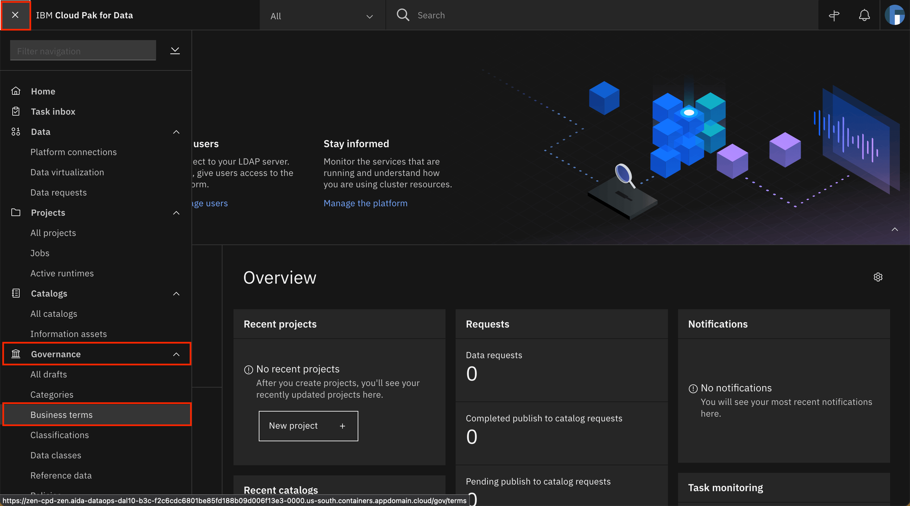

1. **Add business term**をクリックし、次に**Import from file**をクリックします。

    

1. **ファイルの追加**をクリックし、先にダウンロードしたHealthcare_Data-glossary_terms-csv-export.csvファイルを選択して、**次へ**をクリックします。

    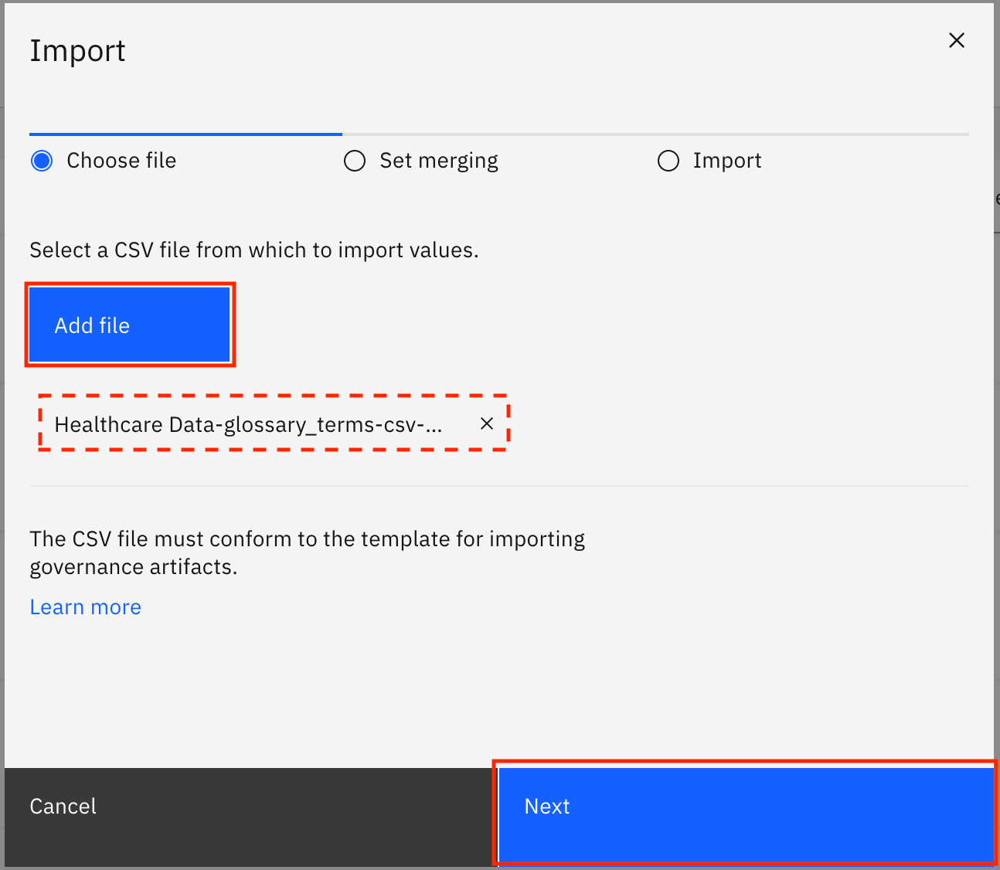

1. 「すべての値を置換する」を選択し、「インポート」をクリックします。

    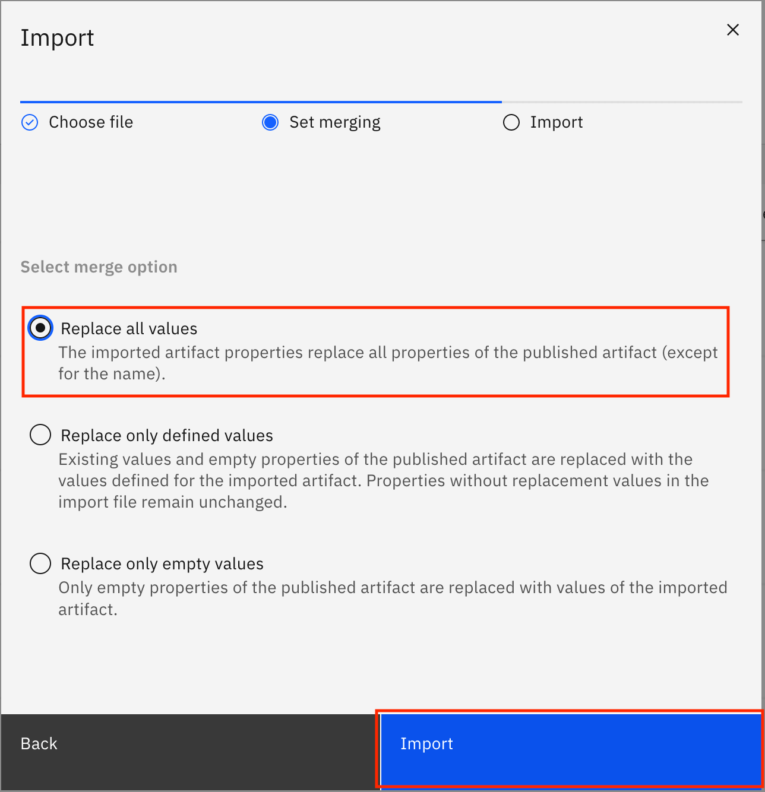をクリックします。

1. ファイルからビジネス用語がインポートされます。インポートが成功すると、"The import completed successfully "という*Import summary*のモーダルが表示されます。また、ビジネス用語の新しいドラフトが124個作成され、エラーが発生しなかったことも表示されます。「タスクに進む」をクリックします。

    

### ビジネス用語の公開

1. **Task inbox**に移動します。**Assigned to you**タブに移動すると、**Publish Business terms**タスクが自分に割り当てられていることがわかります。**公開**をクリックして、ビジネス用語のドラフトを公開します。

    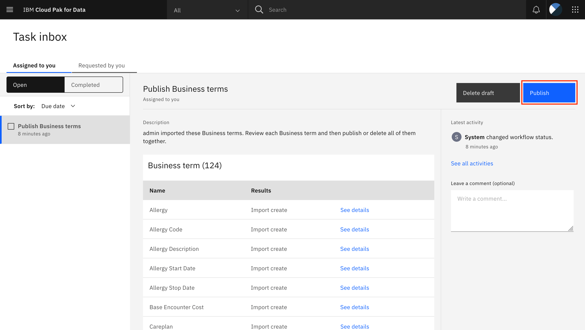

1. ビジネス用語が公開されると、タスクが完了したことと、管理者に通知されたことを示す通知が表示されます。

    

## 参考資料

参照データセットは、製品コードや国コード、あるいは医療分野では症状コードや投薬コードなどのコード値を論理的にグループ化するために使用されます。一般的には、データフィールドに許容される値のセットであり、データクラスのマッチングパターンやビジネス用語の割り当てに使用されます。

参照データ・セットを作成、編集、または削除するには、IBM Cloud Pak for Dataで**Access governance artifacts**のユーザー権限が必要です。さらに、参照データ・セットのプライマリ・カテゴリーにおいて、**Admin**、**Owner**、**Editor**のいずれかのカテゴリー・コラボレーター・ロールを持っている必要があります。

### リファレンスデータファイルのダウンロードとインポート

1. [Healthcare_Data-reference_data-csv-export.csv](static/Healthcare_Data-reference_data-csv-export.csv)ファイルをダウンロードします。このCSVファイルには、IBM Cloud Pak for Dataにインポートする必要のあるリファレンスデータセットが含まれています。

1. [Healthcare_Data-reference_data_sets.zip](static/Healthcare_Data-reference_data_sets.zip)ファイルをダウンロードして解凍します。このアーカイブ・ファイルには複数のファイルが含まれており、それぞれがHealthcare_Data-reference_data-csv-export.csvファイルに記載されているリファレンス・データ・セットを投入します。

1. 左上の**ハンバーガー**メニューを開き、**ガバナンス**を展開し、**参照データ**をクリックします。

    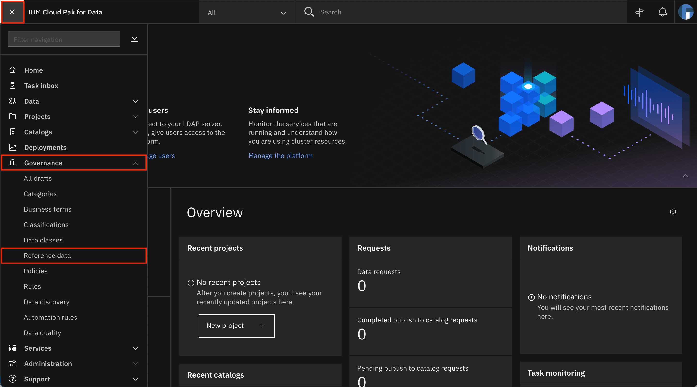

1. 「**Add reference data set > Import from file**」をクリックします。

    

1. **ファイルの追加**をクリックし、先にダウンロードしたHealthcare_Data-reference_data-csv-export.csvファイルを選択して、**次へ**をクリックします。

    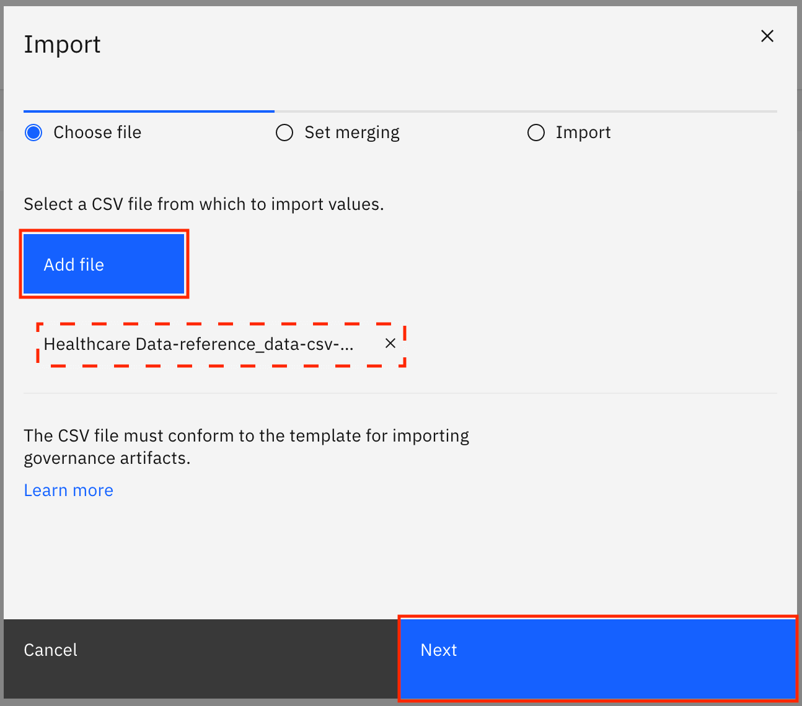

1. 「すべての値を置換する」を選択し、「インポート」をクリックします。

    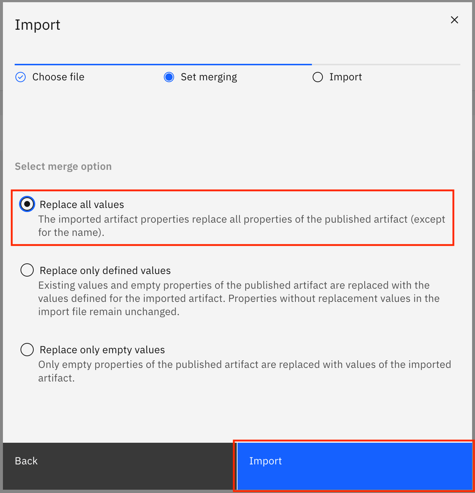

1. ファイルからリファレンスデータセットがインポートされます。インポートが成功すると、"The import completed successfully "という*Import summary*のモーダルが表示されます。また、参照データの新しいドラフトが10個作成され、エラーが発生しなかったことも表示されます。「タスクに進む」をクリックします。

    

### リファレンスデータセットにリファレンスデータを投入する

1. **Task inbox** に移動します。**Assigned to you**タブに移動すると、**Publish Reference data sets**タスクが自分に割り当てられていることがわかります。表の中の**Encounter classes**の行を探し、**See details**をクリックします。

    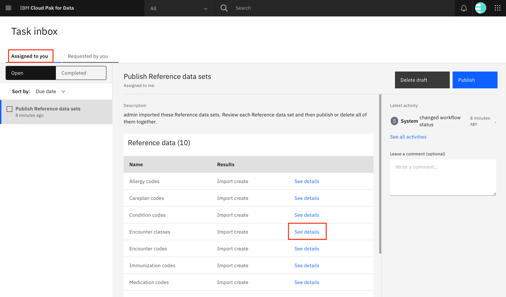

1. エンカウンター・クラスのリファレンス・データ・セットが画面上に読み込まれます。オーバーフローメニューをクリックして、「**ファイルのアップロード**」を選択します。

    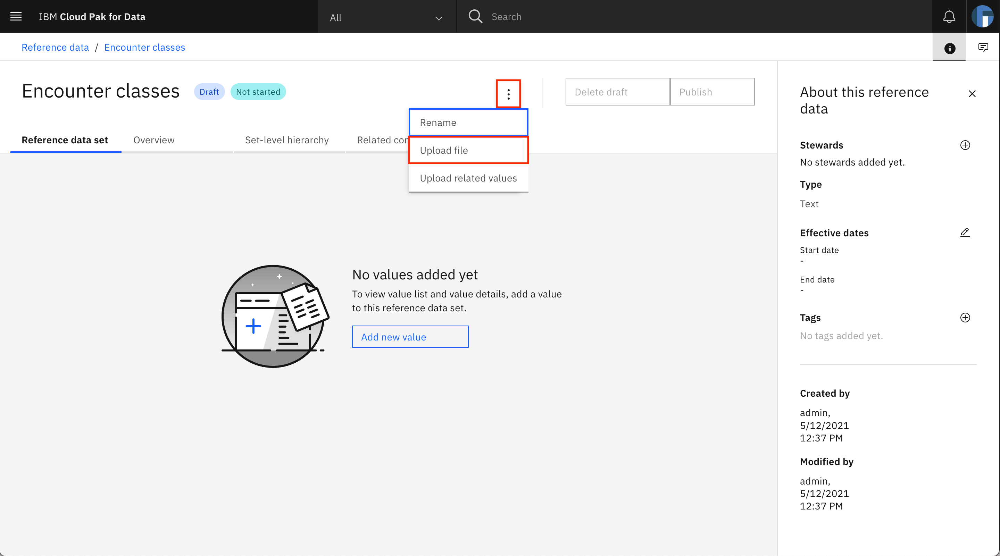

1. Healthcare_Data-reference_data_sets.zipファイルを解凍した内容から、Encounter classes-reference_data_set-csv-export.csvファイルをドラッグ＆ドロップするか、ダウンロードした場所を参照してアップロードし、**Next**をクリックします。

    

1. 次の画面では、CSVファイルの列をターゲット列にマッピングする必要があります。**Code**, **Value**, **Description**, **Parent**, **Related terms** の各カラムを、code, value, description, parent, and related terms の各ドロップダウンフィールドから選択します。「保存」ボタンをクリックします。

    

    ファイルがインポート用に正常に送信されたことを示す通知が表示されます。

    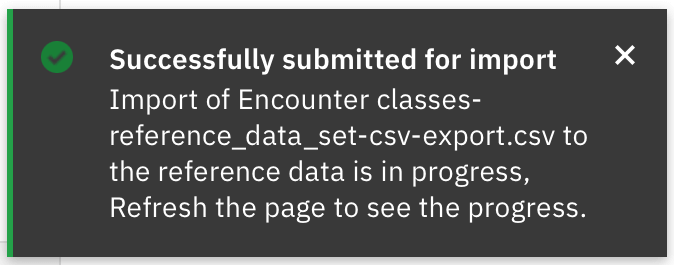

1. 左上の**ハンバーガー（☰）**メニューから**タスクの受信箱**をクリックして、タスクの受信箱の**Assigned to you**タブに戻ります。Encounter codes-reference_data_set-csv-export.csvおよびCondition codes-reference_data_set-csv-export.csvファイルを使用して、Encounter codeおよびCondition codeの参照データセットを生成するプロセスを繰り返す。

    

**注**:***このチュートリアルの拡張バージョン***では、タスクに記載されている各参照データセットを入力します。以下の表を参考に、各参照データセットのcsvファイルを選択してください。

| 参照データセット | CSVファイル
|-|-|
|アレルギーコード|アレルギーコード-reference_data_set-csv-export.csv|。
|ケアプランコード|ケアプランコード-reference_data_set-csv-export.csv| (英語)
|条件コード|条件コード-reference_data_set-csv-export.csv|.
|エンカウンタクラス|エンカウンタクラス-reference_data_set-csv-export.csv|.
|カウンタコード|カウンタコード-reference_data_set-csv-export.csv|.
|免疫コード|免疫コード-reference_data_set-csv-export.csv|.
|投薬コード|投薬コード-reference_data_set-csv-export.csv|.
|Observation codes|Observation codes-reference_data_set-csv-export.csv|.
|プロシージャコード|プロシージャコード-reference_data_set-csv-export.csv|.
|提供者の専門分野|提供者の専門分野-reference_data_set-csv-export.csv|.

### リファレンスデータの公開

1. 参照データセットの入力が完了したら、それを公開することができます。タスクインボックスの**Assigned to you**タブに戻り、**Publish**をクリックして、参照データセットのドラフトを公開します。

    

1. リファレンスデータセットが公開されると、タスクが完了したことと、管理者に通知されたことを示す通知が表示されます。

    

## データクラス

データクラスは、データ資産に含まれるデータの種類を説明するために使用されます - 例えば、都市、口座番号、社会保障番号などのデータフィールドやテーブルの列などです。Watson Knowledge Catalog では、[定義済みのデータクラス](https://www.ibm.com/docs/en/cloud-paks/cp-data/4.0?topic=classes-data) のセットを提供しています。また、カスタムデータクラスを作成し、有効な値のリスト、参照データ、または正規表現などのマッチングロジックを使用して、データを自動的に分類する方法を指定することもできます。データクラスには、分類やビジネス用語など、関連するガバナンスの成果物を関連付けることができます。データクラスがデータ資産に割り当てられると、ビジネス用語がデータ資産に対して提案されます。

データ・クラスを作成、編集、または削除するには、IBM Cloud Pak for Dataの**Access governance artifacts**ユーザー権限が必要です。さらに、データ・クラスのプライマリ・カテゴリーにおいて、**Admin**、**Owner**、**Editor**のいずれかのカテゴリー・コラボレーター・ロールを持っている必要があります。

### データクラスファイルのダウンロードとインポート

1. [Healthcare_Data-data_class-csv-export.csv](static/Healthcare_Data-data_class-csv-export.csv)ファイルをダウンロードします。

1. 左上の**ハンバーガー**メニューを開き、**ガバナンス**を展開し、**データクラス**をクリックします。

    

1. **Add data class > Import from file**をクリックします。

    

1. [ファイルの追加]をクリックし、先にダウンロードしたHealthcare_Data-data_class-csv-export.csvファイルを選択して、[次へ]をクリックします。

    

1. 「すべての値を置き換える」を選択して、「インポート」をクリックします。

    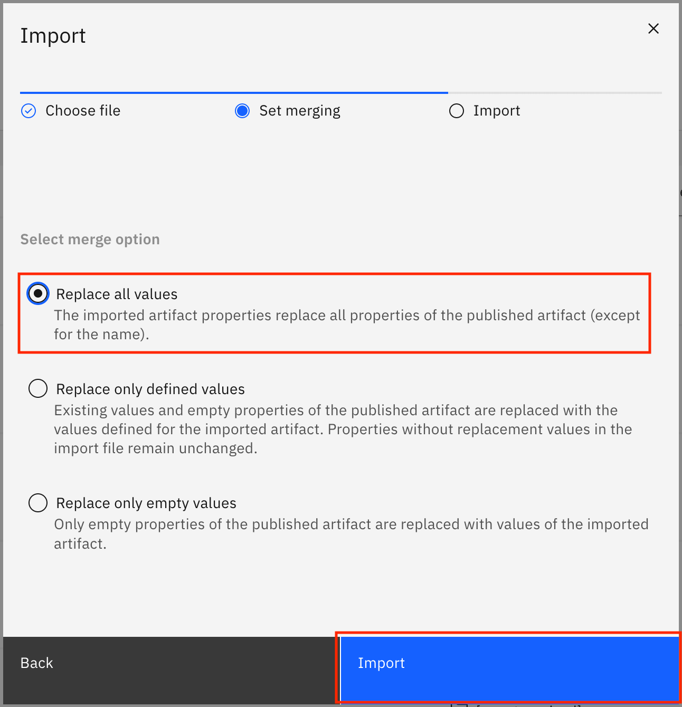

1. ファイルからデータクラスがインポートされます。インポートが成功すると、"The import completed successfully "という *Import summary* モダルが表示されます。また、データクラスの新しいドラフトが16個作成され、エラーが発生しなかったことも表示されます。**Go to task**をクリックします。

    

### データクラスに参照データ(マッチング方法)を追加する

1. **Task inbox**に移動します。**Assigned to you**タブに移動すると、**Publish Data classes**タスクが自分に割り当てられていることが確認できます。テーブルの中の**Encounter class**の行を探して、**詳細を見る**をクリックします。

    

1. エンカウンタークラスのデータクラスが画面に読み込まれます。*Matching method*の**+(Add)**をクリックします。

    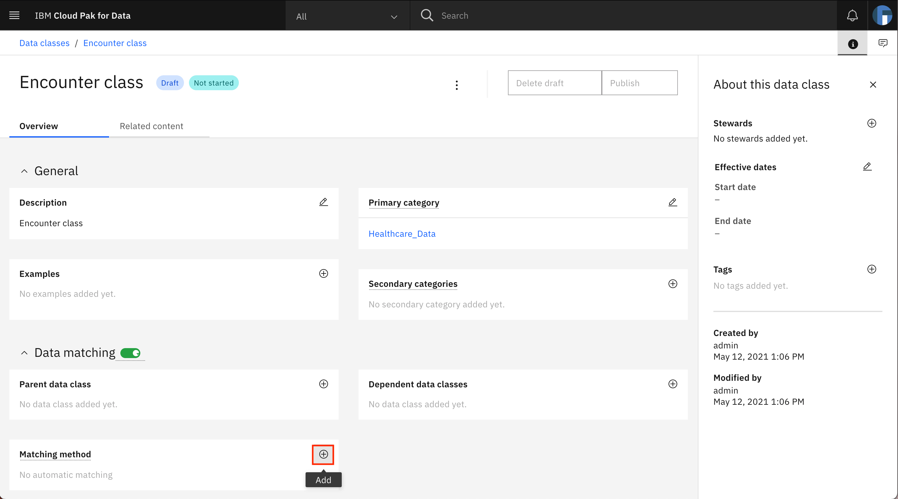

1. モーダルウィンドウで、**Match to reference data**を選択して、**Next**をクリックします。

    

1. 参照データセットのリストから **エンカウンタークラス** を検索します。検索バーを使って検索することもできます。**Encounter classes**の参照データセットをクリックして選択し、**Next**をクリックします。

    

1. 次の画面で「**Save**」をクリックします。

    

    変更が保存されたという通知が表示されます。

    

1. 左上の**ハンバーガー（☰）**メニューから**タスク受信箱**をクリックして、タスク受信箱の**Assigned to you**タブに戻ります。この手順を繰り返してエンカウンターコードとコンディションコードのデータクラスを更新し、参照データを使って照合するという照合方法を追加します。エンカウンターコードとコンディションコードの参照データセットを選択します。

  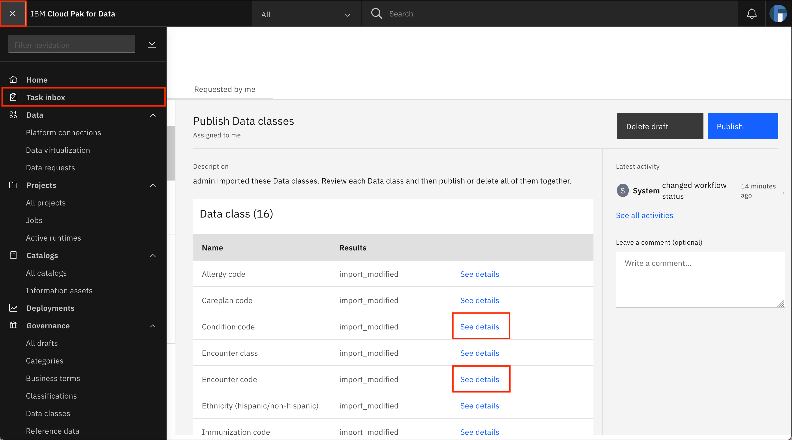

**注**:***このチュートリアルの拡張版***では、タスクに記載されている以下のデータクラスを、与えられた参照データセットを使用して一致するように更新してください。

| データクラス | 参照データセット |
|-|-|
|アレルギー・コード｜アレルギー・コード
|ケアプラン・コード｜ケアプラン・コード
|条件コード|条件コード
|エンカウンタークラス|エンカウンタークラス
|エンカウンターコード|エンカウンターコード|
|予防接種コード|予防接種コード
|薬剤コード|メディケーションコード
|観察コード|Observation code| 観察コード
|手技コード|プロシージャコード
|医療従事者の専門分野|医療従事者の専門分野

### データクラスへの値のリスト（マッチング方法）の追加

1. **Task inbox**の**Assigned to you**タブに戻り、**Ethnicity (hispanic/non-hispanic)**データクラスの**See details**をクリックします。

    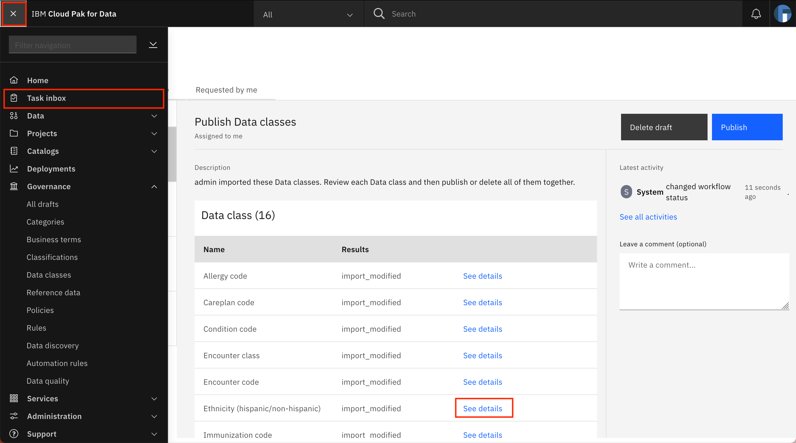

1. Ethnicity (hispanic/non-hispanic)データクラスが画面に読み込まれます。「マッチング方法」の「**+（追加）**」をクリックします。

    

1. モーダルウィンドウで、**有効な値のリストに一致させる**を選択し、**次へ**をクリックします。

    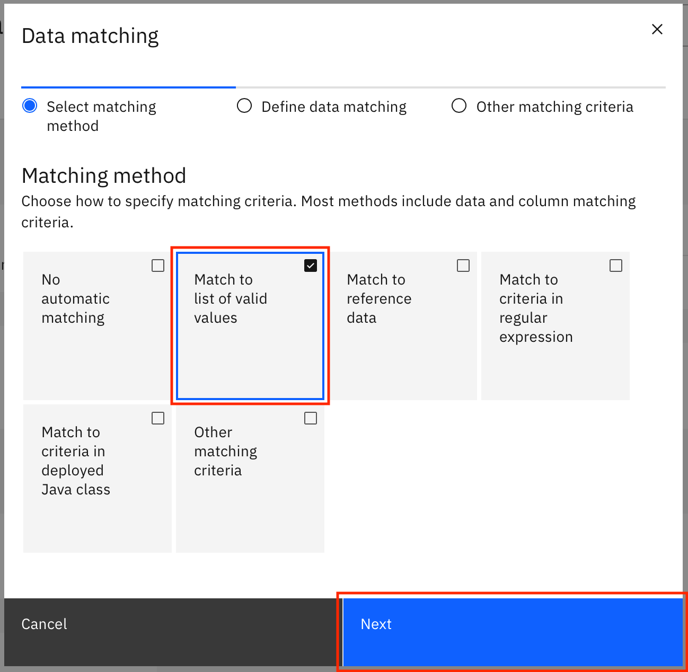

1. **List of valid values**を選択し、**List of valid values**に`hispanic`と入力します。**Add valid value**（有効な値の追加）をクリックすると、有効な値を入力するスペースが1つ追加されるので、「non hispanic」と入力し、**Next**（次へ）をクリックします。

    

1. 次の画面で、**Column name criteria**に`[Ee]thnic|ETHNIC`を追加して、**Save**をクリックします。

    

    変更が保存されたという通知が表示されます。

    が表示されます。

1. 左上の**ハンバーガー(☰)**メニューから**タスクの受信箱**をクリックして、タスクの受信箱の**Assigned to you**タブに戻ります。**人種**データクラスの有効な値のリストを使用するために、マッチングメソッドを更新するプロセスを繰り返します。

    

1. 有効な値として、`asian`、`black`、`native`、`other`、`white`を提供する。**列名の基準**に`[rR]ac(e|ial)|RAC(E|IAL)`を追加。

### データクラスに正規表現(マッチング方法)を追加する

1. **タスク受信箱**の**Assigned to you**タブに戻り、**Passport**データクラスの**See details**をクリックします。

    

1. Passportデータクラスが画面に読み込まれます。「マッチング方法」の**+（追加）**をクリックします。

    

1. モーダルウィンドウで、**正規表現の基準に一致させる**を選択し、**次へ**をクリックします。

    

1. [`A-Z0-9]{6,9}$`を列値の**一致基準**として指定し、**Next**をクリックします。

    

1. 次の画面で、**Column name criteria**に`[pP]assport|PASSPORT|[iI]d|ID`を指定して、**Save**をクリックします。

    

    変更が保存されたという通知が表示されます。

    

1. 左上の **ハンバーガー（☰）** メニューから **タスクの受信箱** をクリックして、タスクの受信箱の**Assigned to you** タブに戻ります。

    

1. 次の表に記載されているデータクラスについて、マッチング方法を正規表現を使用するように更新するプロセスを繰り返します。この表を使用して、各データクラスの正規表現と列名のマッチング基準を選択します。

<table> (テーブル)
  <thead
    <tr> (日本語)
      <th>データクラス</th>
      <th>正規表現</th>
      <th>列名のマッチング条件</th>
    </tr>
  </thead>
  <tbody>
    <tr>
      <td>パスポート</td
      <td>^[A-Z0-9]{6,9}$</td>
      <td>[pP]assport|PASSPORT|[iI]d|ID</td>
    </tr> </tr
       
      <td>数字</td
      <td>^\\+$</td>
      <td></td
    </tr> </tr
    <tr>
      <td>タイムスタンプ</td
      <td>^(19|20)[0-9]{2}-(0[1-9]|1[0-2])-(0[1-9]|[1-2][0-9]|3[0-1])T([0-1][0-9]|2[0-3]):[0-5][0-9]:[0-5][0-9]Z$</td>
      <td></td
    </tr> </tr
       
      <td>UUID</td>
      <td>^[a-f0-9]{8}-[a-f0-9]{4}-[a-f0-9]{4}-[a-f0-9]{4}-[a-f0-9]{12}$</td>
      <td></td
    </tr> </tr
  </tbody>
</table> (英語)

### データクラスの公開

1. すべてのデータクラスのマッチングメソッドが指定されたら、データクラスを発行することができます。**Task inbox**の**Assigned to you**タブに戻り、**Publish**をクリックしてデータクラスのドラフトを公開します。

    

1. データクラスが公開されると、タスクが完了したことと管理者に通知されたことを示す通知が表示されます。

    

## クラス分け

分類は、組織にとっての感度や機密性のレベルに基づいて、資産を分類するために使用されます。データの値を照合するロジックを含むデータクラスとは異なり、分類はラベルのようなものです。

Watson Knowledge Catalog には、一般的に使用される 3 つの定義済みの分類が含まれています。

* 「個人識別情報」は、人と人とを区別するために使用され、特定の個人を識別する可能性のあるデータに使用されます。

* 機密性の高い個人情報とは、人種や民族、政治的意見、宗教的信条、その他類似した性質の信条、労働組合への加盟、身体的・精神的な健康や状態、性的生活、または個人の犯罪歴や犯罪歴の疑いに関する個人に関連する情報のことです。

* データに不適切にアクセスした場合、そのデータを持つ機関または個人に重大または長期的な損害を与える可能性があるデータには、「機密」が使用されます。

分類を作成、編集、または削除するには、IBM Cloud Pak for Dataで**Access governance artifacts**のユーザー権限が必要です。さらに、分類のプライマリ・カテゴリーにおいて、**Admin**、**Owner**、**Editor**のいずれかのカテゴリー・コラボレーター・ロールを持っている必要があります。

**注**。Watson Knowledge Catalog には、ユーザー定義の分類を作成またはインポートする機能があります。ただし、ヘルスケアのユースケースでは、定義済みの分類のみが必要です。

##ポリシー

ポリシーは、組織のデータや情報資産を適切に管理または使用するために、組織が従う必要のあるガイドライン、規制、標準、または手順を記述するために使用される自然言語文書です。ポリシーは、ガバナンスの対象領域を自然言語で記述したものです。

ポリシーには、さらに複数のサブポリシーを含めることができます。サブポリシーは、親ポリシーの広範な定義の中で、特定の領域に関連するものです。また、データや資産のリソースを企業の目標に適合させるための特定の詳細を定義するルールを参照することもできます。ポリシーは、その意味や相互の関係に基づいて、階層的に整理することができます。ポリシーは、リレーショナルデータセットのデータにのみ適用することができます。

ポリシーを作成、編集、または削除するには、IBM Cloud Pak for Dataで**Access governance artifacts**のユーザー権限が必要です。さらに、ポリシーのプライマリ・カテゴリーにおいて、**Admin**、**Owner**、**Editor**のいずれかのカテゴリーのコラボレーター・ロールを持っている必要があります。

### ポリシーファイルのダウンロードとインポート

1. [Healthcare_Data-policy-csv-export.csv](static/Healthcare_Data-policy-csv-export.csv)ファイルをダウンロードします。

1. 左上の**ハンバーガー**メニューを開き、**ガバナンス**を展開し、**ポリシー**をクリックします。

    

1. **Add policy > Import from file**をクリックします。

    をクリックします。

1. [ファイルの追加]をクリックし、先ほどダウンロードしたHealthcare_Data-policy-csv-export.csvファイルを選択して、[次へ]をクリックします。

    

1. 「すべての値を置換する」を選択し、「インポート」をクリックします。

    をクリックします。

1. ファイルからポリシーがインポートされます。インポートが成功すると、"The import completed successfully "という *Import summary* モダルが表示されます。また、ポリシーの新しいドラフトが3つ作成され、エラーが発生しなかったことも表示されます。「タスクに進む」をクリックします。

  

### ポリシーの公開

1. **Task inbox**に移動します。**Assigned to you** タブに移動すると、**Publish Policies** タスクが自分に割り当てられていることがわかります。「公開」をクリックして、ドラフトポリシーを公開します。

    

1. ポリシーが公開されると、タスクが完了したことと、管理者に通知されたことを示す通知が表示されます。

    

## ガバナンスルール

ガバナンスルールは、ガバナンスポリシーを実装するために必要な動作やアクションをビジネス上で記述したものです。ガバナンスルールは、自然言語で書かれた記述的なルールであり、強制することはできません。

ガバナンス・ルールは基本的に、名前とテキストによる説明で構成されています。他のすべてのガバナンス成果物と同様に、主要なカテゴリ内に格納される。ガバナンスルールは、他のルールと同様にガバナンスポリシーを参照することができる。関連するルールの関係は双方向であり、つまり、ガバナンス_ルール_1がガバナンス_ルール_2に関連する場合、ガバナンス_ルール_2は自動的にガバナンス_ルール_1に関連する。

ガバナンスルールを作成するには、IBM Cloud Pak for Dataで**Access governance artifacts**のユーザー権限が必要です。さらに、ガバナンス・ルールのプライマリ・カテゴリーで**Admin**、**Owner**、**Editor**のいずれかのロールを持っている必要があります。

### ガバナンスルールファイルのダウンロードとインポート

1. [Healthcare_Data-rule-csv-export.csv](static/Healthcare_Data-rule-csv-export.csv)ファイルをダウンロードします。

1. 左上の**ハンバーガー**メニューを開き、**ガバナンス**を展開し、**規則**をクリックします。

    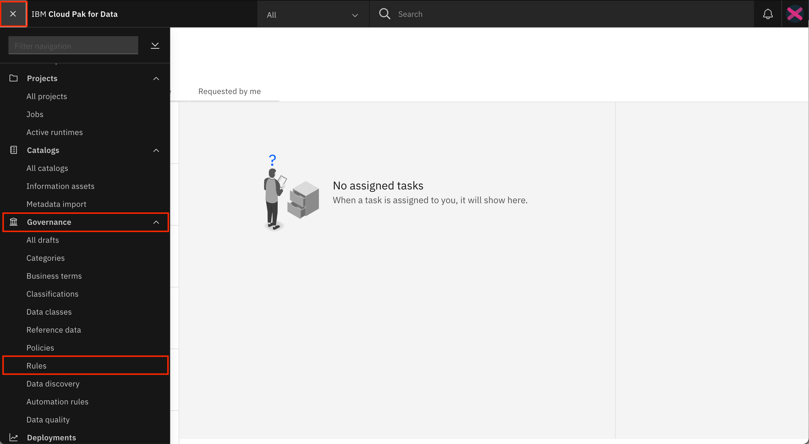

1. **Add rule > Import from file**をクリックします。

    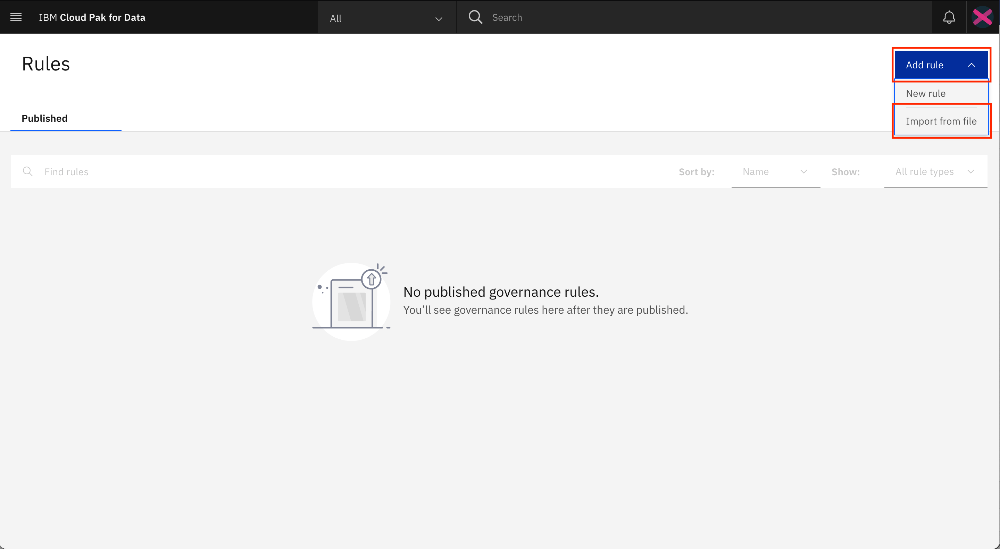

1. **Add file**をクリックして、先ほどダウンロードしたHealthcare_Data-rule-csv-export.csvファイルを選択して、**Next**をクリックします。

    

1. 「すべての値を置き換える」を選択し、「インポート」をクリックします。

    

1. ファイルからルールがインポートされます。インポートが成功すると、"The import completed successfully "という *Import summary* モダルが表示されます。また、ガバナンスルールの新しいドラフトが4つ作成され、エラーが発生しなかったことも表示されます。「タスクに進む」をクリックします。

    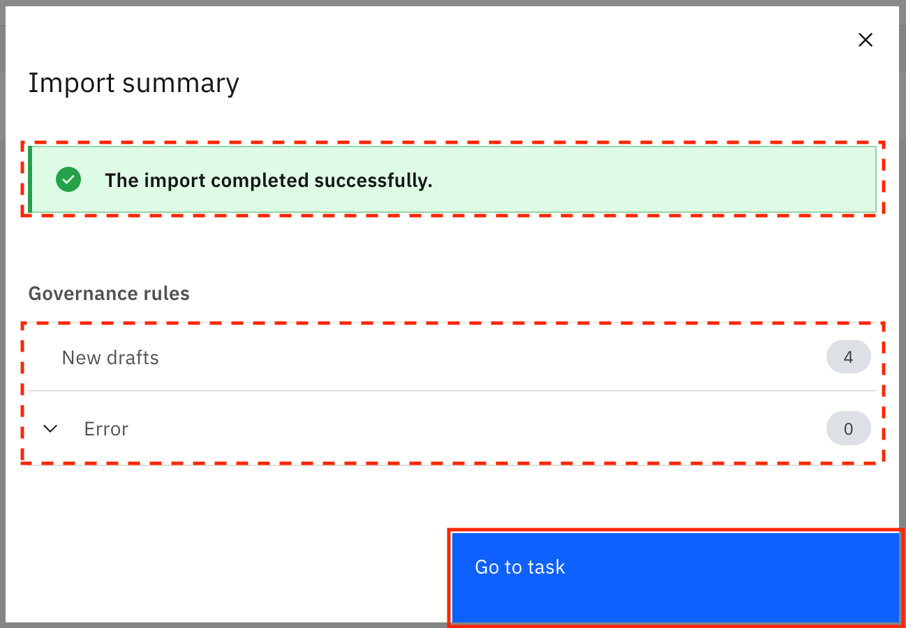

### ガバナンスルールに親ポリシーを追加

1. **Task inbox**に移動します。**Assigned to you** タブに移動し、**Publish Governance rules** タスクが自分に割り当てられていることを確認します。テーブルの中の**機密性の高い個人情報のマスク**の行を探し、**詳細を見る**をクリックします。

    

1. Mask Sensitive Personal Informationルールが画面に表示されます。*Parent policies*の下の**Add policy +**をクリックします。

    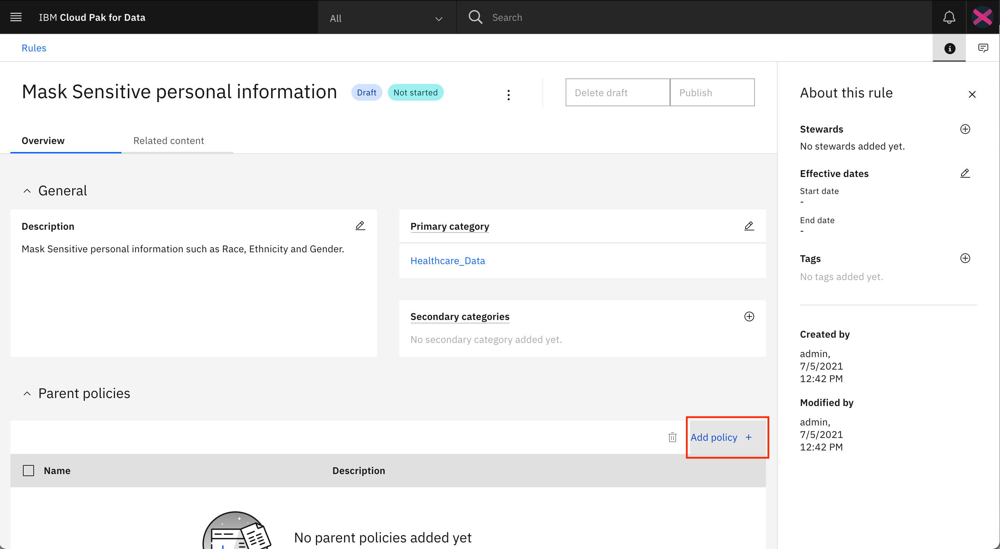

1. モーダルウィンドウで、**Protect Sensitive Personal Information**を選択し、**Add**をクリックします。

    

1. 変更が保存されたことを示す通知が表示されます。親のポリシーが更新されたら、左上の**ハンバーガー（☰）**メニューから**タスクの受信箱**をクリックして、タスクの受信箱の**Assigned to you**タブに戻ります。

    

1. タスクに含まれる残りの3つのルールについて、親ポリシーを追加するプロセスを繰り返します。各ルールに対して、**個人識別情報の保護**ポリシーを選択します。

    
    

### ルールの公開

1. すべてのルールのポリシーが指定されたら、ルールを公開することができます。**Task inbox**の**Assigned to you**タブに戻り、**Publish**をクリックしてルールドラフトを公開します。

    

1. ルールが公開されると、タスクが完了したことと管理者に通知されたことを示す通知が表示されます。

    

## まとめ

このチュートリアルでは、ガバナンスアーティファクト (カテゴリー、ビジネス用語、参照データセット、データクラス、分類、ポリシー、およびガバナンスルール) について学び、ヘルスケアのユースケースに必要なガバナンスアーティファクトを作成しました。ガバナンス・アーティファクトの詳細については、[IBM Cloud Pak for Data documentation](https://www.ibm.com/docs/en/cloud-paks/cp-data/4.0?topic=catalog-governance-artifacts)をお読みください。

このチュートリアルは、[An introduction to the DataOps discipline](https://developer.ibm.com/articles/an-introduction-to-the-dataops-discipline)シリーズの一部です。