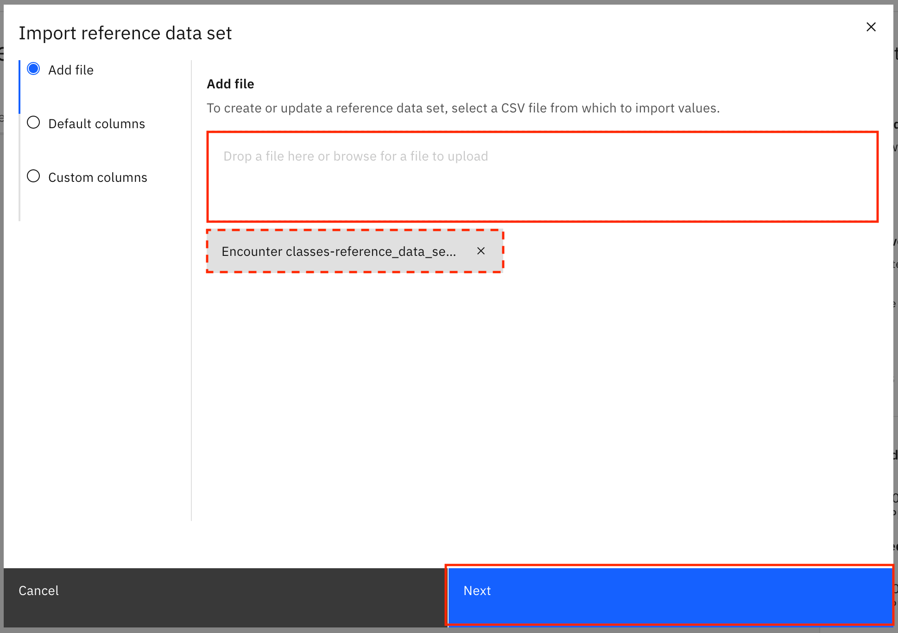
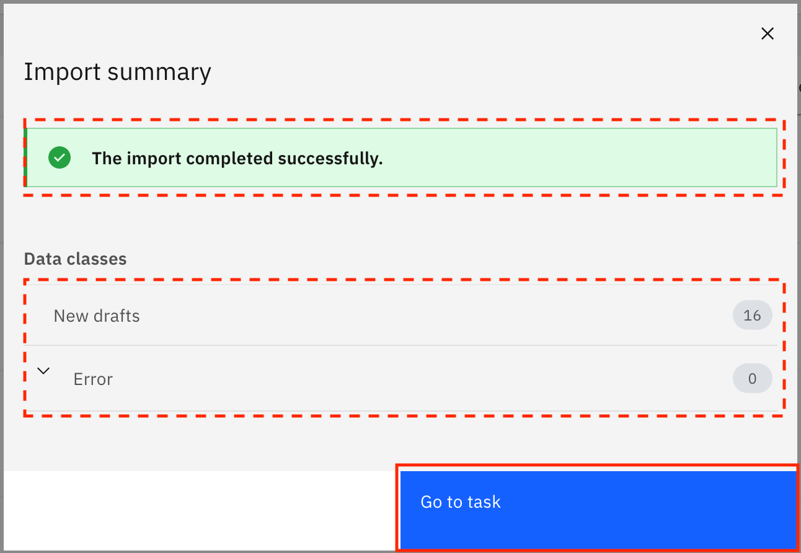
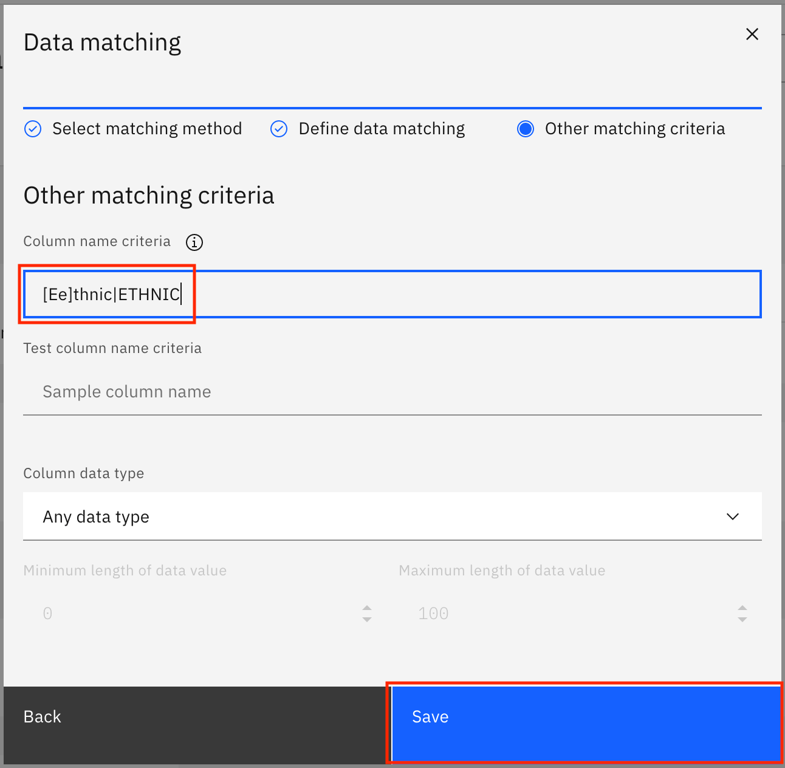
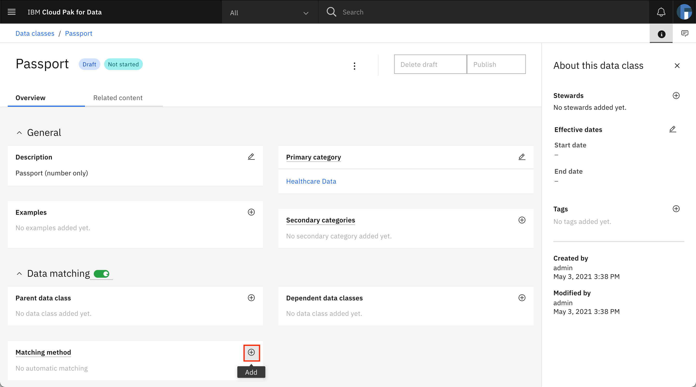
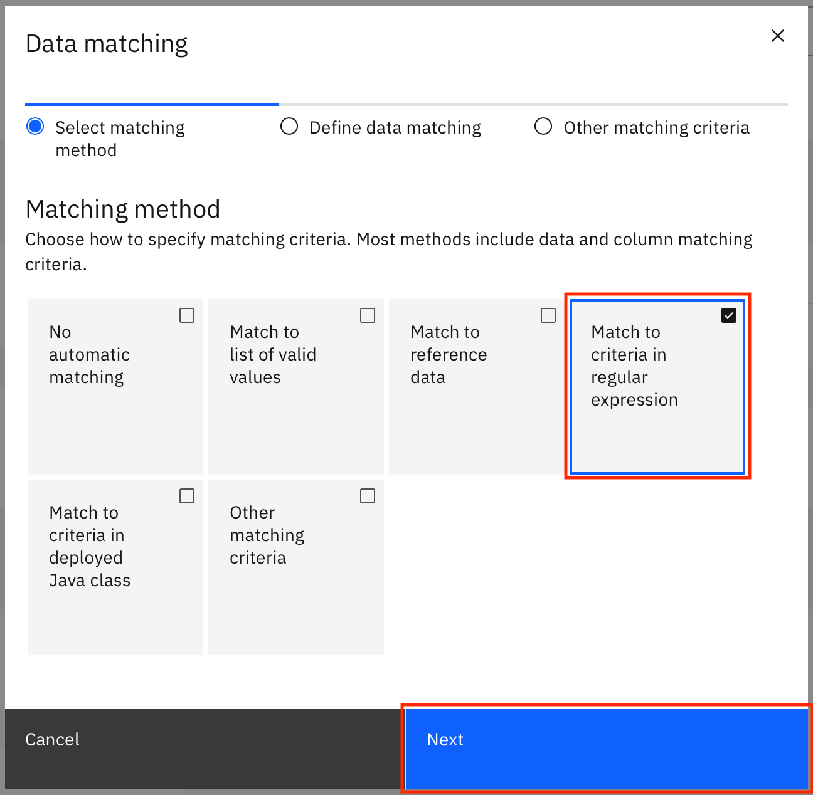
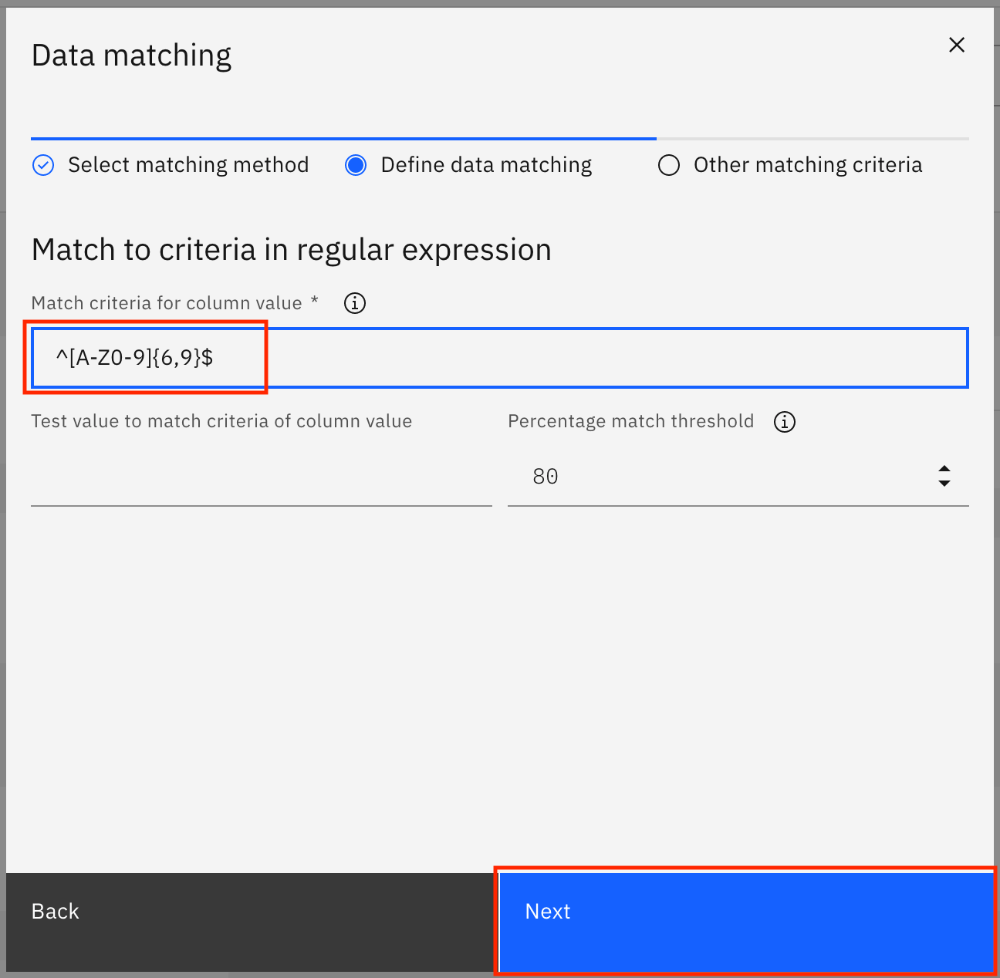
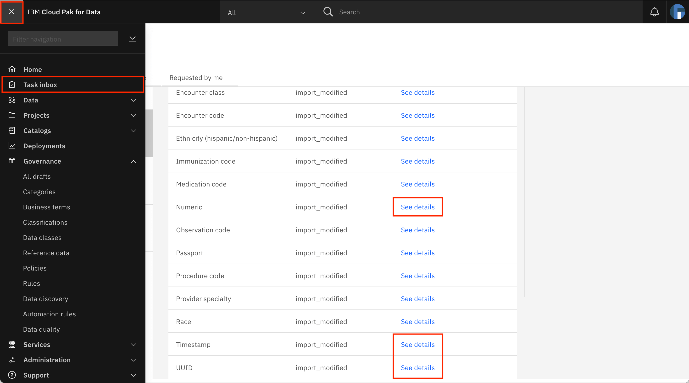
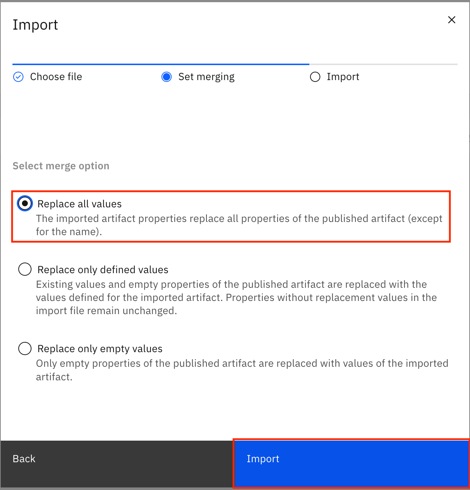
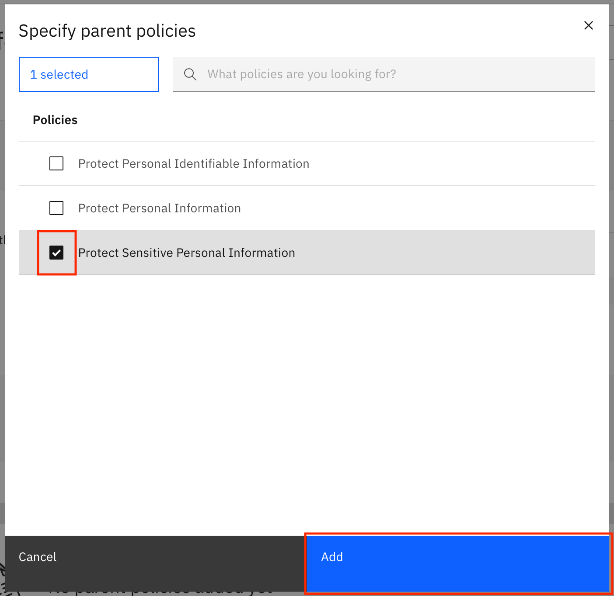

---
also_found_in:
- learningpaths/dataops-fundamentals/
authors: ''
completed_date: '2021-07-20'
components:
- cloud-pak-for-data
draft: false
excerpt: Learn about governance rules and governance artifacts -- categories, business
  terms, reference data sets, data classes, classifications, policies -- and create
  the governance artifacts required for a healthcare use case.
last_updated: '2021-09-27'
meta_description: Learn about governance rules and governance artifacts -- categories,
  business terms, reference data sets, data classes, classifications, policies --
  and create the governance artifacts required for a healthcare use case.
meta_keywords: governance, data
meta_title: Incorporate enterprise governance in your data
primary_tag: analytics
subtitle: Curate, enrich, and control your data
tags:
- data-management
title: Incorporate enterprise governance in your data
---

Governance is the process of curating, enriching, and controlling your data. You govern your data with governance artifacts, and you organize and control access to governance artifacts with categories. In a real-life scenario, the governance artifacts are set up by the governance team of the organization.

## Learning objectives

In this tutorial, learn how to create the categories and the governance artifacts in IBM Cloud Pak for Data that are required for a synthetic patient healthcare data set created using [Synthea](https://synthetichealth.github.io/synthea/). You learn about and create the following governance artifacts:

* Categories
* Business terms
* Reference data
* Data classes
* Classifications
* Policies
* Governance rules

## Prerequisites

* [IBM Cloud Pak for Data v4.0](https://www.ibm.com/products/cloud-pak-for-data)
* [Watson Knowledge Catalog on Cloud Pak for Data](https://www.ibm.com/docs/en/cloud-paks/cp-data/4.0?topic=services-watson-knowledge-catalog)

## Estimated time

It should take you approximately 60 minutes to complete the tutorial.

## Categories

A category is used to organize your governance artifacts, just like a folder or a directory. Grouping governance artifacts into categories makes it easier to find them, control their visibility, and manage them. You can also use categories to specify which users can view and manage the artifacts within the category. A category can have subcategories, but a subcategory can have only one direct parent category.

You must have the **Manage governance categories** user permission on IBM Cloud Pak for Data to create top-level categories.

To create a subcategory within a top-level category, you must have the **Access governance artifacts** and **Manage governance categories** user permissions on IBM Cloud Pak for Data. Additionally, you must have an **Admin** or **Owner** category collaborator role in the parent category.

**Note**: No subcategories can be created within the predefined **[uncategorized]** category.

You must have the **Admin** role to create categories.

### Download and import categories

1. Download the [Healthcare_Data-category-csv-export.csv](static/Healthcare_Data-category-csv-export.csv) file.

1. Open a browser and navigate to your IBM Cloud Pak for Data instance. Log in as a user with admin privileges.

    

1. Go to the **hamburger (☰)** menu in the upper-left, expand **Governance**, and click **Categories**.

    

1. Click **Add category > Import from file**.

    

1. Click **Add file**, select the Healthcare_Data-category-csv-export.csv file that you downloaded earlier, then click **Next**.

    

1. Select **Replace all values**, then click **Import**.

    

1. The categories are imported from the file. When the import is successful, you see the *Import summary* modal that says, "The import completed successfully." It also shows you that one new category was created and no errors were encountered. Click **Close** to go back.

    

## Business terms

Business terms are used to standardize the definitions of business concepts so that the data is described in a uniform manner across the organization. Business terms can be used to annotate columns with different column names, all of which have the same type of data as defined by the business term.

You must have the **Admin**, **Data Engineer**, **Data Steward**, or **Data Quality Analyst** role to create business terms.

### Download and import business terms

1. Download the [Healthcare_Data-glossary_terms-csv-export.csv](static/Healthcare_Data-glossary_terms-csv-export.csv) file.

1. Go to the **hamburger (☰)** menu in the upper-left, expand **Governance** and click **Business terms**.

    

1. Click **Add business term**, then click **Import from file**.

    

1. Click **Add file**, select the Healthcare_Data-glossary_terms-csv-export.csv file that you downloaded earlier, then click **Next**.

    

1. Select **Replace all values**, and click **Import**.

    

1. The business terms are imported from the file. When the import is successful, you see the *Import summary* modal that says, "The import completed successfully." It also shows you that 124 new drafts for business terms were created and no errors were encountered. Click **Go to task**.

    

### Publish business terms

1. You are taken to the **Task inbox**. Go to the **Assigned to you** tab, where you can see that a **Publish Business terms** task has been assigned to you. Click **Publish** to publish the draft business terms.

    

1. After the business terms are published, you see a notification that you have completed the task and that the admin has been notified.

    

## Reference data

Reference data sets are used to provide logical groupings of code values such as product codes, country codes, or in the healthcare domain, condition codes and medication codes. Typically, these are sets of allowed values for data fields, which can be used as matching patterns for data classes and to assign business terms.

You must have the **Access governance artifacts** user permission on IBM Cloud Pak for Data to create, edit, or delete reference data sets. Additionally, you must also have the **Admin**, **Owner**, or **Editor** category collaborator roles in the primary category for the reference data set.

### Download and import reference data files

1. Download the [Healthcare_Data-reference_data-csv-export.csv](static/Healthcare_Data-reference_data-csv-export.csv) file. This CSV file contains the reference data sets that you need to import into IBM Cloud Pak for Data.

1. Download and extract the [Healthcare_Data-reference_data_sets.zip](static/Healthcare_Data-reference_data_sets.zip) file. This archive file contains multiple files, each of which populate a reference data set listed in the Healthcare_Data-reference_data-csv-export.csv file.

1. Go to the **hamburger (☰)** menu in the upper-left, expand **Governance**, and click **Reference data**.

    

1. Click **Add reference data set > Import from file**.

    

1. Click **Add file**, select the Healthcare_Data-reference_data-csv-export.csv file that you downloaded earlier, then click **Next**.

    

1. Select **Replace all values**, and click **Import**.

    

1. The reference data sets are imported from the file. When the import is successful, you see the *Import summary* modal that says, "The import completed successfully." It also shows you that 10 new drafts for reference data were created and no errors were encountered. Click **Go to task**.

    

### Populate the reference data sets with reference data

1. You are taken to the **Task inbox**. Go to the **Assigned to you** tab, where you can see that a **Publish Reference data sets** task has been assigned to you. Look for the **Encounter classes** row in the table, and click **See details**.

    

1. The Encounter classes reference data set is loaded on the screen. Click the overflow menu, then select **Upload file**.

    

1. Upload the Encounter classes-reference_data_set-csv-export.csv file from the extracted contents of the Healthcare_Data-reference_data_sets.zip file either by dragging and dropping the file or by browsing to the downloaded location, then click **Next**.

    

1. On the next screen, you must map the columns in the CSV file to target columns. Select **Code**, **Value**, **Description**, **Parent**, and **Related terms** columns in the drop-downs fields for code, value, description, parent, and related terms. Click **Save**.

    

    You see a notification that says that the file has successfully been submitted for import.

    

1. Go back to the **Assigned to you** tab of the task inbox by going to the upper-left **hamburger (☰)** menu and clicking **Task inbox**. Repeat the process of populating the reference data sets for Encounter codes and Condition codes using the Encounter codes-reference_data_set-csv-export.csv and Condition codes-reference_data_set-csv-export.csv files.

    

**Note**: For the ***extended version of this tutorial***, populate each of the reference data sets listed in the task. Use the following table to choose the csv file for each reference data set:

| Reference data set | CSV file |
|-|-|
|Allergy codes|Allergy codes-reference_data_set-csv-export.csv|
|Careplan codes|Careplan codes-reference_data_set-csv-export.csv|
|Condition codes|Condition codes-reference_data_set-csv-export.csv|
|Encounter classes|Encounter classes-reference_data_set-csv-export.csv|
|Encounter codes|Encounter codes-reference_data_set-csv-export.csv|
|Immunization codes|Immunization codes-reference_data_set-csv-export.csv|
|Medication codes|Medication codes-reference_data_set-csv-export.csv|
|Observation codes|Observation codes-reference_data_set-csv-export.csv|
|Procedure codes|Procedure codes-reference_data_set-csv-export.csv|
|Provider specialties|Provider specialties-reference_data_set-csv-export.csv|

### Publish reference data

1. After the reference data sets have been populated, you can publish them. Go back to the **Assigned to you** tab of the task inbox, and publish the reference data sets draft by clicking **Publish**.

    

1. After the reference data sets have been published, you see a notification that you have completed the task and that the admin has been notified.

    

## Data classes

Data classes are used to describe the type of data contained in data assets -- for example, data fields or table columns such as city, account number, or social security number. Watson Knowledge Catalog provides a set of [predefined data classes](https://www.ibm.com/docs/en/cloud-paks/cp-data/4.0?topic=classes-data). You can also create custom data classes and use matching logic such as lists of valid values, reference data, or regular expressions to specify how to classify data automatically. You can associate related governance artifacts such as classifications and business terms to the data classes. The business terms are then suggested for the data assets when the data class is assigned to the data assets.

You must have the **Access governance artifacts** user permission on IBM Cloud Pak for Data to create, edit, or delete data classes. Additionally, you must have the **Admin**, **Owner**, or **Editor** category collaborator roles in the primary category for the data class.

### Download and import the data classes file

1. Download the [Healthcare_Data-data_class-csv-export.csv](static/Healthcare_Data-data_class-csv-export.csv) file.

1. Go to the **hamburger (☰)** menu in the upper-left, expand **Governance**, and click **Data classes**.

    

1. Click **Add data class > Import from file**.

    

1. Click **Add file**, select the Healthcare_Data-data_class-csv-export.csv file that you downloaded earlier, then click **Next**.

    

1. Select **Replace all values**, and click **Import**.

    

1. The data classes are imported from the file. When the import is successful, you see the *Import summary* modal that says, "The import completed successfully." It also shows you that 16 new drafts for data classes were created and no errors were encountered. Click **Go to task**.

    

### Add reference data (matching method) to data classes

1. You are taken to the **Task inbox**. Go to the **Assigned to you** tab, where you can see that a **Publish Data classes** task has been assigned to you. Look for the **Encounter class** row in the table, and click **See details**.

    

1. The Encounter class data class is loaded on the screen. Click **+ (Add)** under *Matching method*.

    

1. In the modal window, select **Match to reference data**, then click **Next**.

    

1. Search for **Encounter classes** in the list of reference data sets. You can also search for it using the search bar. Click the **Encounter classes** reference data set to select it, then click **Next**.

    

1. On the next screen, click **Save**.

    

    You see a notification that says the changes have been saved.

    

1. Go back to the **Assigned to you** tab of the task inbox by going to the upper-left **hamburger (☰)** menu and clicking **Task inbox**. Repeat the steps to update the Encounter code and Condition code data classes, and add the matching method to match using reference data. Choose the Encounter codes and Condition codes reference data sets.

  

**Note**: For the ***extended version of this tutorial***, update the following data classes that are listed in the task to match using the given reference data sets:

| Data class | Reference data set |
|-|-|
|Allergy code|Allergy codes|
|Careplan code|Careplan codes|
|Condition code|Condition codes|
|Encounter class|Encounter classes|
|Encounter code|Encounter codes|
|Immunization code|Immunization codes|
|Medication code|Medication codes|
|Observation code|Observation codes|
|Procedure code|Procedure codes|
|Provider specialty|Provider specialties|

### Add list of values (matching method) to data classes

1. Back on the **Assigned to you** tab of the **Task inbox**, click **See details** against the **Ethnicity (hispanic/non-hispanic)** data class.

    

1. The Ethnicity (hispanic/non-hispanic) data class is loaded on the screen. Click **+ (Add)** under *Matching method*.

    

1. In the modal window, select **Match to list of valid values**, then click **Next**.

    

1. Select **List of valid values**, and type `hispanic` under **List of valid values**. Click **Add valid value** to add one more space to enter valid values, type in `non hispanic`, then click **Next**.

    

1. On the next screen, add `[Ee]thnic|ETHNIC` under **Column name criteria**, and click **Save**.

    

    You see a notification that says the changes have been saved.

    

1. Go back to the **Assigned to you** tab of the task inbox by going to the upper-left **hamburger (☰)** menu and clicking **Task inbox**. Repeat the process of updating the matching method to use a list of valid values for the **Race** data class.

    

1. Provide `asian`, `black`, `native`, `other`, and `white` as the valid values. Add `[rR]ac(e|ial)|RAC(E|IAL)` under **Column name criteria**.

### Add regular expression (matching method) to data classes

1. Back on the **Assigned to you** tab of the **Task inbox**, click **See details** against the **Passport** data class.

    

1. The Passport data class is loaded on the screen. Click **+ (Add)** under *Matching method*.

    

1. In the modal window, select **Match to criteria in regular expression**, then click **Next**.

    

1. Provide `^[A-Z0-9]{6,9}$` as the **Match criteria for column value**, then click **Next**.

    

1. On the next screen, provide the **Column name criteria** as `[pP]assport|PASSPORT|[iI]d|ID`, and click **Save**.

    

    You see a notification that the changes have been saved.

    

1. Go back to the **Assigned to you** tab of the task inbox by going to the upper-left **hamburger (☰)** menu, and clicking **Task inbox**.

    

1. Repeat the process of updating the matching method to use regular expressions for the data classes listed in the following table. Use the table to choose the regular expression and the column name matching criteria for each data class.

<table>
  <thead>
    <tr>
      <th>Data class</th>
      <th>Regular expression</th>
      <th>Column name matching criteria</th>
    </tr>
  </thead>
  <tbody>
    <tr>
      <td>Passport</td>
      <td>^[A-Z0-9]{6,9}$</td>
      <td>[pP]assport|PASSPORT|[iI]d|ID</td>
    </tr>
    <tr>
      <td>Numeric</td>
      <td>^\d+$</td>
      <td></td>
    </tr>
    <tr>
      <td>Timestamp</td>
      <td>^(19|20)[0-9]{2}-(0[1-9]|1[0-2])-(0[1-9]|[1-2][0-9]|3[0-1])T([0-1][0-9]|2[0-3]):[0-5][0-9]:[0-5][0-9]Z$</td>
      <td></td>
    </tr>
    <tr>
      <td>UUID</td>
      <td>^[a-f0-9]{8}-[a-f0-9]{4}-[a-f0-9]{4}-[a-f0-9]{4}-[a-f0-9]{12}$</td>
      <td></td>
    </tr>
  </tbody>
</table>

### Publish data classes

1. After the matching methods for all of the data classes have been specified, you can publish the data classes. Go back to the **Assigned to you** tab of the **Task inbox**, and publish the data classes draft by clicking **Publish**.

    

1. When the data classes have been published, you see a notification that says that you have completed the task and that the admin has been notified.

    

## Classifications

Classifications are used to classify assets based on their level of sensitivity or confidentiality for the organization. Unlike data classes that include logic to match data values, classifications are more like labels.

Watson Knowledge Catalog includes three predefined, commonly used classifications:

* Personally Identifiable Information is used for any data that can be used to distinguish one person from another and might potentially identify a specific individual.

* Sensitive Personal Information is used for information relating to an individual regarding racial or ethnic origin, political opinions, religious beliefs or other beliefs of a similar nature, trade union membership, physical or mental health or condition, sexual life, or any criminal or alleged criminal history of a person.

* Confidential is used for any data that can cause significant or long-term harm to the institution or individuals whose data it is, if the data is inappropriately accessed.

You must have the **Access governance artifacts** user permission on IBM Cloud Pak for Data to create, edit, or delete classifications. Additionally, you must have the **Admin**, **Owner**, or **Editor** category collaborator roles in the primary category for the classification.

**Note**: Watson Knowledge Catalog provides the ability to create or import user-defined classifications. However, for the Healthcare use case, you only need the predefined classifications.

## Policies

Policies are natural language documents that are used to describe the guidelines, regulations, standards, or procedures that your organization needs to follow to ensure that the organization's data and information assets are properly managed or used. A policy is a natural language description of a governance subject area.

Policies can further contain multiple subpolicies, which pertain to a specific area within the broad definition of the parent policy. They can also reference rules that define specific details to make the data and asset resources compliant with corporate objectives. Policies can be organized in a hierarchy based on their meaning and relationships to each other. Policies can be applied only to data in relational data sets.

You must have the **Access governance artifacts** user permission on IBM Cloud Pak for Data to create, edit, or delete a policy. Additionally, you must have the **Admin**, **Owner**, or **Editor** category collaborator roles in the primary category for the policy.

### Download and import the policies file

1. Download the [Healthcare_Data-policy-csv-export.csv](static/Healthcare_Data-policy-csv-export.csv) file.

1. Go to the **hamburger (☰)** menu in the upper-left, expand **Governance**, and click **Policies**.

    

1. Click **Add policy > Import from file**.

    

1. Click **Add file**, select the Healthcare_Data-policy-csv-export.csv file that you downloaded earlier, then click **Next**.

    

1. Select **Replace all values**, and click **Import**.

    

1. The policies are imported from the file. When the import is successful, you see the *Import summary* modal that says, "The import completed successfully." It also shows you that three new drafts for policies were created and no errors were encountered. Click **Go to task**.

  

### Publish policies

1. You are taken to the **Task inbox**. Go to the **Assigned to you** tab, where you can see that a **Publish Policies** task has been assigned to you. Click **Publish** to publish the draft policies.

    

1. After the policies have been published, you see a notification that says that you have completed the task and that the admin has been notified.

    

## Governance rules

Governance rules provide the business description of the required behavior or actions that need to be taken to implement a governance policy. Governance rules are descriptive rules that are written in natural language and cannot be enforced.

A governance rule essentially consists of a name and a text description. Like all other governance artifacts, it is housed within a primary category. It can reference governance policies as well as other rules. Related rule relationships are bidirectional, meaning if Governance_rule_1 is related to Governance_rule_2, then Governance_rule_2 is automatically related to Governance_rule_1.

To create a governance rule, you must have the **Access governance artifacts** user permission on IBM Cloud Pak for Data. Additionally, you must have an **Admin**, **Owner**, or **Editor** role in the primary category for the governance rule.

### Download and import the governance rules file

1. Download the [Healthcare_Data-rule-csv-export.csv](static/Healthcare_Data-rule-csv-export.csv) file.

1. Go to the **hamburger (☰)** menu in the upper-left, expand **Governance**, and click **Rules**.

    

1. Click **Add rule > Import from file**.

    

1. Click **Add file**, select the Healthcare_Data-rule-csv-export.csv file you downloaded earlier, then click **Next**.

    

1. Select **Replace all values**, and click **Import**.

    

1. The rules are imported from the file. When the import is successful, you see the *Import summary* modal that says, "The import completed successfully." It also shows you that four new drafts for governance rules were created and no errors were encountered. Click **Go to task**.

    

### Add parent policy to governance rules

1. You are taken to the **Task inbox**. Go to the **Assigned to you** tab, where you can see that a **Publish Governance rules** task has been assigned to you. Look for the **Mask Sensitive personal information** row in the table, and click **See details**.

    

1. The Mask Sensitive personal information rule is loaded on the screen. Click **Add policy +** under *Parent policies*.

    

1. In the modal window, select **Protect Sensitive Personal Information**, then click **Add**.

    

1. You see a notification that says that the changes have been saved. After the parent policy has been updated, go back to the **Assigned to you** tab of the task inbox by going to the upper-left **hamburger (☰)** menu and clicking **Task inbox**.

    

1. Repeat the process of adding the parent policy for the three remaining rules in the task. Select the **Protect Personal Identifiable Information** policy for each rule.

    
    

### Publish rules

1. After the policies for all of the rules have been specified, you can publish the rules. Go back to the **Assigned to you** tab of the **Task inbox**, and publish the rules draft by clicking **Publish**.

    

1. After the rules have been published, you see a notification that says that you have completed the task and that the admin has been notified.

    

## Summary

In this tutorial, you learned about the governance artifacts -- categories, business terms, reference data sets, data classes, classifications, policies, and governance rules, and also created the governance artifacts required for the healthcare use case. You can read the [IBM Cloud Pak for Data documentation](https://www.ibm.com/docs/en/cloud-paks/cp-data/4.0?topic=catalog-governance-artifacts) to learn more about governance artifacts.

This tutorial is part of the [An introduction to the DataOps discipline](https://developer.ibm.com/articles/an-introduction-to-the-dataops-discipline) series.