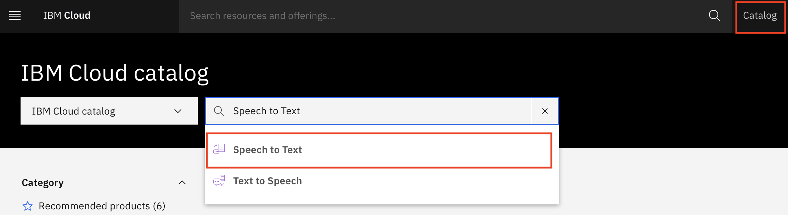
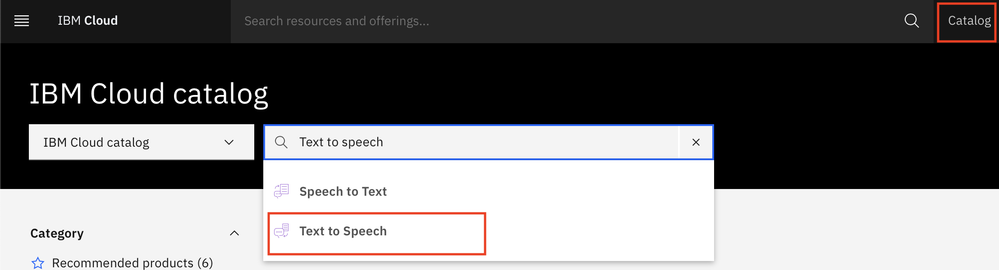
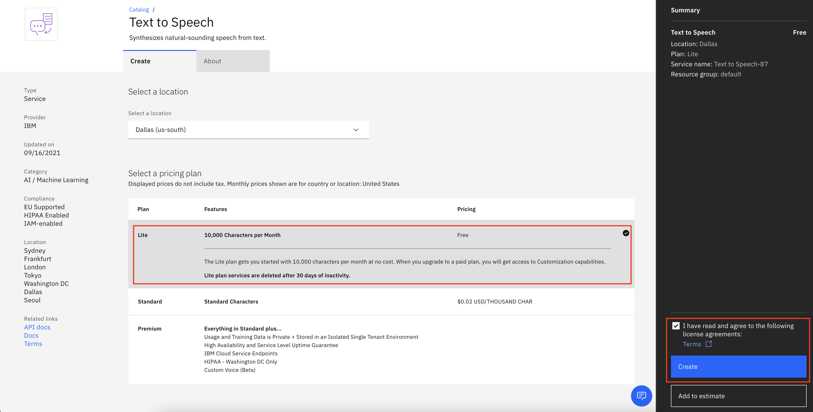
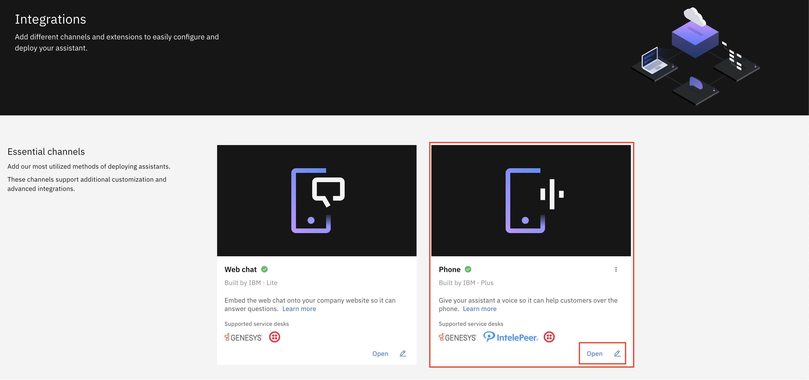
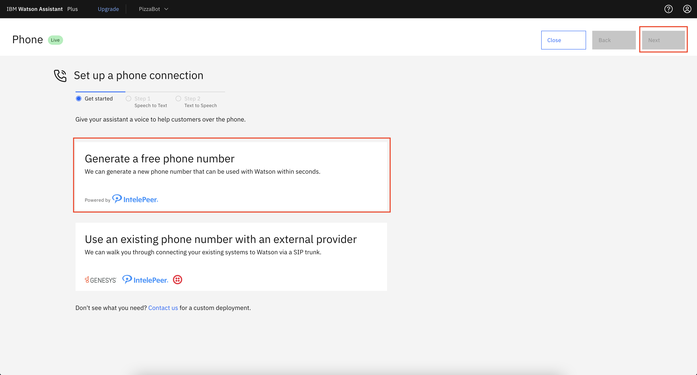

---
also_found_in:
- learningpaths/get-started-watson-assistant/
authors: ''
check_date: '2022-10-10'
completed_date: '2021-10-08'
components:
- watson-assistant
draft: false
excerpt: Watson Assistant を IBM Watson Speech to Text および IBM Text to Speech サービスと連携させることで、Watson
  Assistant との音声会話を可能にします。
meta_description: Watson Assistant を IBM Watson Speech to Text および IBM Text to Speech
  サービスと連携させることで、Watson Assistant との音声会話を可能にします。
meta_keywords: Watson Assistant, Artificial intelligence, chatbot
meta_title: Watson Assistantに音声サービスを組み込む
primary_tag: artificial-intelligence
subtitle: アシスタントとWatson音声サービスを連携させ、音声会話を可能にする。
tags:
- conversation
title: Watson Assistantに音声サービスを組み込む
---

Watson Assistantに声を与えることで、ユーザーは音声でWatson Assistantと対話することができます。このオプションは、アシスタントがユーザーの声に反応して質問に答えたり、タスクを実行したりすることを容易にします。アシスタントを公開した後は、様々な音声サービスを介してリンクさせることができます。このチュートリアルでは、[Genesys](https://www.genesys.com)、[IntelePeer](https://intelepeer.com)、[Twilio](https://www.twilio.com)によるSIPトランク統合を使用しています。このチュートリアルでは、IntelePeer を使って無料の番号を生成し、Watson Assistant を IBM Watson Speech to Text および IBM Text to Speech サービスにリンクして音声会話を可能にする方法を説明しています。ただし、Watson Assistantを独自の音声サービスと連携させることも可能です。

**注：**チュートリアルに従うには、[Watson Assistantのプラスプラン](https://cloud.ibm.com/catalog/services/watson-assistant?cm_sp=ibmdev-_-developer-tutorials-_-cloudreg)をご利用いただく必要があります。[Watson Assistant サービスの作成](https://cloud.ibm.com/catalog/services/watson-assistant?cm_sp=ibmdev-_-developer-tutorials-_-cloudreg)の際にトライアルプランを選択すると、30 日間の無料トライアルが可能です。

## 前提条件

このチュートリアルに従うには、以下が必要です。

* [IBM Cloud Account](https://cloud.ibm.com/registration/trial?cm_sp=ibmdev-_-developer-tutorials-_-cloudreg)が必要です。
* [Watson Assistant](https://cloud.ibm.com/catalog/services/watson-assistant?cm_sp=ibmdev-_-developer-tutorials-_-cloudreg)の公開インスタンス。[Watson Assistant learning path](https://developer.ibm.com/learningpaths/get-started-watson-assistant)に従っている方は、すでに持っていると思いますが、すでに展開しているアシスタントを使用することができます。

## ステップ

### Speech to Text サービスの作成

IBM Watson Speech to Text サービスは、音声をテキストに変換して、アプリケーションの音声転記機能を実現します。このサービスを利用すると、アシスタントがユーザーの要求を処理して理解するために、ユーザーの音声をテキストの応答に変換することができます。

1. [IBM Cloud カタログ](https://cloud.ibm.com/catalog/services?cm_sp=ibmdev-_-developer-tutorials-_-cloudreg)に移動します。

1. **Speech to Text**を検索し、サービスをクリックします。

    

1. 新しいサービスを作成することができる以下のページが表示されます。Watson Assistant インスタンスと同じ場所を選択して、Speech to Text サービスのライトプランを作成します。

    

1. **Create** をクリックします。

    これで、Speech to Textサービスが作成され、[リソースページ](https://cloud.ibm.com/resources)に表示されます。

### 音声合成サービスの作成

IBM Watson Text to Speech サービスは、書かれたテキストを自然な響きの音声に変換し、アプリケーションに音声合成機能を提供します。このサービスは、アシスタントから入力されたテキストを受け取り、ユーザーが電話で聞けるように音声応答に変換します。

1. [IBM Cloud カタログ](https://cloud.ibm.com/catalog/services?cm_sp=ibmdev-_-developer-tutorials-_-cloudreg)に移動します。

1. 「**Text to Speech**」を検索し、サービスをクリックします。

    

1. 新しいサービスを作成することができる以下のページが表示されます。Watson Assistant インスタンスと同じ場所を選択して、Text to Speech サービスのライトプランを作成します。

    

1. **Create** をクリックします。

    これでText to Speechサービスが作成され、[リソースページ](https://cloud.ibm.com/resources)に表示されます。

### IntelePeerで無料の電話番号を生成する

1. Watson Assistant のホームページに移動し、左側のメニューの**Integrations**をクリックします。

    をクリックします。

1. **Essential channels**セクションの**Phone**セクションで、**Open**をクリックします。

    

1. 電話番号を統合する環境を選択するウィンドウが表示されます。ここでは、**Draft**環境、**Live**環境のいずれかを選択できます。このチュートリアルでは、Live環境を使用します。

    

1. 次のページでは、「**Generate a free number**」と「**Use an existing phone number with an external provider**」という2つのオプションが表示されます。

1. **Generate a free number**をクリックして、**Next**をクリックします。

    

次のステップでは、Speech to TextおよびText to Speechサービスをアシスタントにリンクします。

### アシスタントをWatson Speech to TextとText to Speechにリンクさせる

1. 「次へ」をクリックすると、先に作成したSpeech to Textサービスをリンクする**ステップ1**に進みます。「次へ」をクリックします。

    オプションとして、ドロップダウンメニューからSpeech to Textの言語モデルを選択することもできます。[Speech to Textの言語モデル](https://cloud.ibm.com/docs/speech-to-text)についてもっと読む。

    

1. 次のページでは、先に作成したText to Speechサービスをリンクする**ステップ2**に進みます。**Finish**をクリックします。

    オプションとして、ドロップダウンメニューからText to Speechの音声を選択することもできます。[Text to Speech voices](https://cloud.ibm.com/docs/text-to-speech)についてもっと読む。

    

1. **Finish**をクリックすると、自分の番号が表示されたページにリダイレクトされます。これで、アシスタント内で作成したアクションに基づいて、その番号に電話をかけて、アシスタントとのチャットを開始することができます。

1. **閉じる**をクリックすると、Watson Assistant の**統合**セクションにリダイレクトされます。

    オプションとして、アシスタントにリンクしたSpeech to TextとText to Speechのサービスをそれぞれのセクションに移動して変更し、[Genesys](https://www.genesys.com)、[Twilio](https://www.twilio.com)、または独自のライブエージェントツールを使用してライブエージェントサービスを設定することもできます。

    

## まとめ

いくつかの手順とクリックで、無料の電話番号を作成して Watson Assistant に取り付け、Assistant のユーザーがより良い体験をできるようにしました。これで、ユーザーは提供された電話番号に電話して、アシスタントから必要な回答を得ることができます。