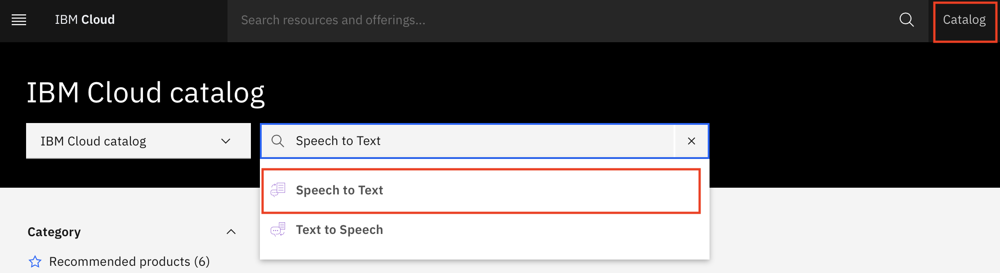
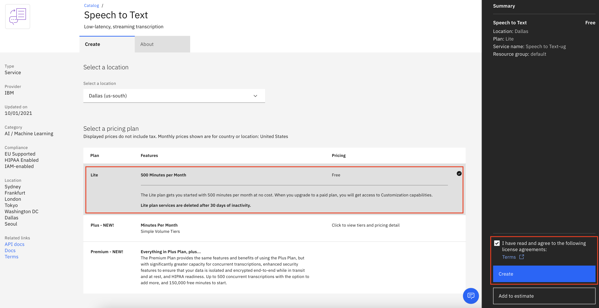
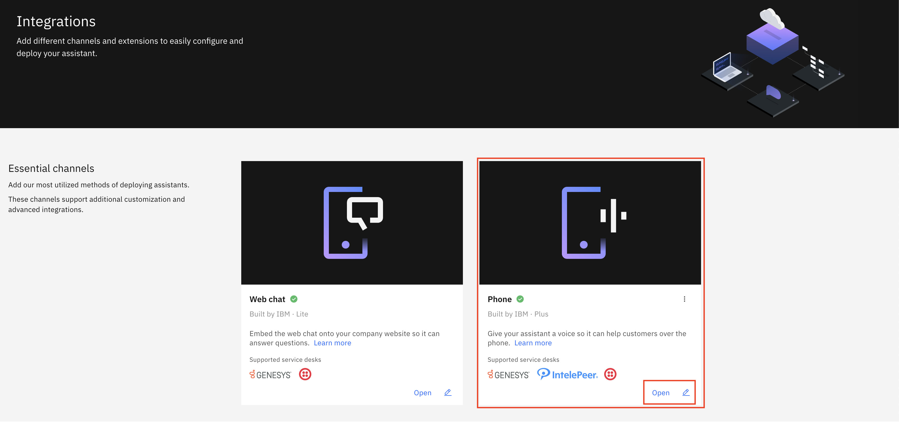

---
also_found_in:
- learningpaths/get-started-watson-assistant/
authors: ''
check_date: '2022-10-10'
completed_date: '2021-10-08'
components:
- watson-assistant
draft: false
excerpt: Enable voice conversations with your Watson Assistant by linking your Assistant
  to IBM Watson Speech to Text and IBM Text to Speech services.
meta_description: Enable voice conversations with your Watson Assistant by linking
  your Assistant to IBM Watson Speech to Text and IBM Text to Speech services.
meta_keywords: Watson Assistant, Artificial intelligence, chatbot
meta_title: Integrate voice services into your Watson Assistant
primary_tag: artificial-intelligence
subtitle: Enable voice conversations by linking your Assistant to Watson speech services
tags:
- conversation
title: Integrate voice services into your Watson Assistant
---

Giving your Watson Assistant a voice lets users interact with it through speech. This option makes it easy for the Assistant to respond to a user's voice and answer their questions or do a task for them. After the Assistant is published, you can link it through various voice services. This tutorial uses SIP trunk integrations by [Genesys](https://www.genesys.com), [IntelePeer](https://intelepeer.com) and [Twilio](https://www.twilio.com). The tutorial explains how to generate a free number with IntelePeer and link your Watson Assistant to IBM Watson Speech to Text and IBM Text to Speech services to enable the voice conversations. However, you can also integrate the Watson Assistant with your own voice services.

**Note:** To follow the tutorial, you must have a [Plus Plan of Watson Assistant](https://cloud.ibm.com/catalog/services/watson-assistant?cm_sp=ibmdev-_-developer-tutorials-_-cloudreg). You can get a free 30-day trial by selecting the trial plan when [creating the Watson Assistant service](https://cloud.ibm.com/catalog/services/watson-assistant?cm_sp=ibmdev-_-developer-tutorials-_-cloudreg).

## Prerequisites

To follow the tutorial, you need:

* An [IBM Cloud Account](https://cloud.ibm.com/registration/trial?cm_sp=ibmdev-_-developer-tutorials-_-cloudreg).
* A published instance of [Watson Assistant](https://cloud.ibm.com/catalog/services/watson-assistant?cm_sp=ibmdev-_-developer-tutorials-_-cloudreg). If you are following the [Watson Assistant learning path](https://developer.ibm.com/learningpaths/get-started-watson-assistant), then you already have this, but you can use any assistant that you have already deployed.

## Steps

### Create a Speech to Text service

The IBM Watson Speech to Text service transcribes audio to text to enable speech transcription capabilities for applications. This service allows the Assistant to translate the user's speech into a text response for the Assistant to process and understand the user's request.

1. Navigate to the [IBM Cloud catalog](https://cloud.ibm.com/catalog/services?cm_sp=ibmdev-_-developer-tutorials-_-cloudreg).

1. Search for **Speech to Text**, and click the service.

    

1. You should see the following page where you can create a new service. Select the same location as your Watson Assistant instance, and create a lite plan for the Speech to Text service.

    

1. Click **Create**.

    Your Speech to Text service should now be created, and you see it in your [resources page](https://cloud.ibm.com/resources).

### Create a Text to Speech service

The IBM Watson Text to Speech service converts written text to natural-sounding speech to provide speech synthesis capabilities for applications. This service accepts the incoming text from the Assistant and converts it into a voice response for the user to hear over the phone.

1. Navigate to the [IBM Cloud catalog](https://cloud.ibm.com/catalog/services?cm_sp=ibmdev-_-developer-tutorials-_-cloudreg).

1. Search for **Text to Speech**, and click the service.

    

1. You should see the following page where you can create a new service. Select the same location as your Watson Assistant instance, and create a lite plan for the Text to Speech service.

    

1. Click **Create**.

    Your Text to Speech service should now be created, and you see it in your [resources page](https://cloud.ibm.com/resources).

### Generate a free phone number with IntelePeer

1. Navigate to your Watson Assistant home page, and click **Integrations** in the menu on the left.

    

1. Under the **Essential channels** section, on the **Phone** section, click **Open**.

    

1. A window opens to select the environment that you want to integrate your phone number with. You can select either the **Draft** environment or the **Live** environment. In this tutorial, I use the Live environment.

    

1. On the next page, you see two options, **Generate a free number** and **Use an existing phone number with an external provider**.

1. Click **Generate a free number**, and click **Next**.

    

The next step is linking your Speech to Text and Text to Speech services to your Assistant.

### Link the Assistant to Watson Speech to Text and Text to Speech

1. After you click Next, you are taken to **Step 1**, which is to link your Speech to Text service that you created earlier. Click **Next**.

    Optionally, you can also select your Speech to Text language model from the drop-down menu. Read more about [Speech to Text language models](https://cloud.ibm.com/docs/speech-to-text).

    

1. On the next page, you are taken to **Step 2**, which is to link your Text to Speech service that you created earlier. Click **Finish**.

    Optionally, you can also select your Text to Speech voice from the drop-down menu. Read more about [Text to Speech voices](https://cloud.ibm.com/docs/text-to-speech).

    

1. After you click **Finish**, you are redirected to a page where your number is displayed, and you can now call the number and start chatting with your assistant based on the actions that you created within your Assistant.

1. After you click **Close**, you are redirected to the **Integrations** section of your Watson Assistant.

    Optionally, you can also change the Speech to Text and Text to Speech services that you have linked to your Assistant by going to their respective sections and setting up Live Agent services by using [Genesys](https://www.genesys.com), [Twilio](https://www.twilio.com), or your own live agent tools.

    

## Summary

With a few steps and clicks, you created a free phone number and attached it to your Watson Assistant to give your Assistant users a better experience. Now, they can call the provided number and get the answers they need from your Assistant.