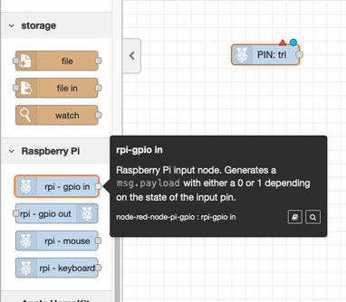
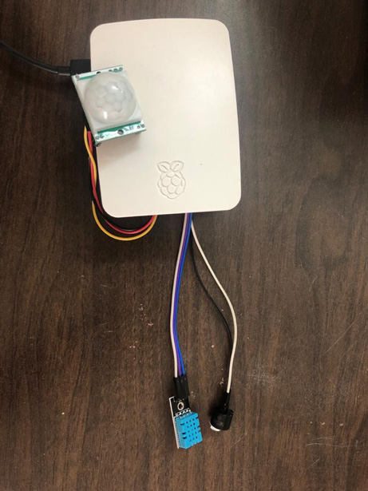

---
also_found_in:
- learningpaths/iot-getting-started-iot-development/
authors: ''
completed_date: '2017-06-30'
draft: false
excerpt: シンプルなホームオートメーションのIoTソリューションを構築する方法をご紹介します。
ignore_prod: false
last_updated: '2021-10-27'
meta_description: シンプルなホームオートメーションのIoTソリューションを構築する方法をご紹介します。
meta_keywords: IoT, sensors, Node-RED, Raspberry Pi
primary_tag: iot
related_content:
- slug: iot-getting-started-iot-development
  type: learningpaths
- slug: iot-next-steps-iot-development
  type: learningpaths
subtitle: Raspberry Pi、センサー、Node-RED、Apple Home Kitでスマートドアベルを作る。
tags:
- iot
time_to_read: 4 hours
title: シンプルなホームオートメーションシステムを構築することで、IoTソリューションの開発を始めることができます。
type: tutorial
---

IoTソリューションの多くは、オートメーションシステムであることが多い。一般的に、ホームオートメーションシステムは、ネットワークを介して情報を転送する複数のソフトウェアおよびハードウェアコンポーネントで構成されています。

このチュートリアルでは、シンプルでありながらスマートなドアベルシステムを作成します。完成したドアベルシステムは、これらのコンポーネントで構成され、次のような機能を備えています。

* 玄関に人が来たことを検知するモーション・センサー
* 人の存在をビープ音で知らせるブザー（ドアベルは動作検知式なので、押すボタンはありません。）
* ドアベルの近くの天気を知ることができる温度・湿度センサー。
* Apple Homeアプリとの連携により、ドアに人が来たことをシステムが通知します（ヘッドホンをして作業している場合など、ドアベルの音が聞こえにくくなることがあります）。
* Apple Homeアプリとの連携により、玄関に人が来たことを通知します。

このチュートリアルを終了すると、同様のシステムを自分で一から作り、その上にさらに面白いアイデアを実装するために必要な[スキル](/learningpaths/iot-getting-started-iot-development/concepts-and-skills/)を身につけることができます。では、さっそく始めてみましょう

## このIoTソリューションを構築するために必要なもの

多くのホームオートメーションシステムと同様に、ドアベルシステムにもハードウェア、ソフトウェアコンポーネント、ネットワークインフラが必要です。

### ハードウェア関連部品

<sidebar>IoTプロジェクトに最適なハードウェアについては、「[Choosing your hardware](/learningpaths/iot-getting-started-iot-development/hardware-guide/)」でご紹介しました。

はじめに、マイクロプロセッサが必要です。今回のIoTソリューションでは、Raspberry Piを使用しますが、Raspberry Piの最新モデルを手に取るのがベストです。コストが気になるのであれば、Raspberry Pi Zero Wを購入してもいいでしょう。Raspberry Piは、ホビイストの間で人気のあるシングルボードコンピュータなので、互換性のある電子部品がすぐに手に入りますし、開発用のオンラインリソースもたくさんあります。
Raspberry Piは最小限のコンピュータなので、ユースケースに応じて追加の部品を取り付ける必要があります。ここでは、スマートドアベルに必要な部品を紹介します。

* マイクロUSBケーブルとUSB電源アダプタ（Raspberry Piに電源を供給するために必要です。）
* 8GB（またはそれ以上）のマイクロSDカードこのカードにRaspberry Pi OSをインストールします。
* <a href="https://learn.adafruit.com/introducing-the-raspberry-pi-zero/gpio-header-options" target="_blank" rel="noopener noreferrer nofollow">_40ピンGPIOヘッダー_</a> Raspberry Pi Zero Wを購入された方や、お使いの機器にヘッダーピンがない場合。
* 以下のRaspberry Pi（またはArduino）と互換性のある電子部品を使用しています。

    * <a href="https://www.adafruit.com/product/189" target="_blank" rel="noopener noreferrer nofollow">_Passive Infra-Red (PIR) digital sensor_</a>
    * <a href="https://www.adafruit.com/product/1536" target="_blank" rel="noopener noreferrer nofollow">_Piezo Buzzer_</a>。
    * <a href="https://www.adafruit.com/product/386" target="_blank" rel="noopener noreferrer nofollow">_DHT-11_</a> または <a href="https://www.adafruit.com/product/385" target="_blank" rel="noopener noreferrer nofollow">_DHT-22_</a> デジタル温湿度センサモジュール
    * <a href="https://www.amazon.com/Haitronic-Multicolored-Breadboard-Arduino-raspberry/dp/B01LZF1ZSZ/" target="_blank" rel="noopener noreferrer nofollow">_雌-雄ジャンパー線_</a>

推奨されているRaspberry Pi以外のデバイスを使用する場合は、wifi経由でデバイスに接続するので、wifiモジュールが搭載されていることを確認してください。

最後に、このチュートリアルでは、MacBook Proを開発に使用します。その他の最新のコンピュータ（LinuxまたはWindows OS搭載）を使用することもできます。

必要に応じて、以下のハードウェアコンポーネントも用意してください。

* Raspberry Piのケース（特に屋外での不慮の事故からデバイスを保護するためのもの
* モニター、HDMIケーブル、キーボード、マウス（SSHクライアントを使わずにRaspberry PiのOSインターフェイスで直接操作したい場合）。

### ネットワーク関連機器

<sidebar>IoTプロジェクトのネットワークについては、「[Connecting all the things](/learningpaths/iot-getting-started-iot-development/networking-guide/)」で学びました。

このプロジェクトでは、ネットワーク技術としてWifiを選択しました。その理由は、私の家にはすでにWifiネットワークがあり、ホームオートメーションシステムの範囲は、家の中のローカルエリアネットワーク（LAN）内に到達するだけでよいからです。また、Wifiはデータ処理能力が高いので、接続したセンサーからのデータ収集にも支障がないと思います。
接続を容易にするために、機器を同じ無線（Wi-Fi）ネットワークに接続することをお勧めします。無線LANルーターがない場合は、同じモバイルWi-Fiホットスポットに機器を接続することもできます。ここでは、多くの人にとって最も簡単な選択肢であるWi-Fiをネットワーク技術として選択しました。Wi-Fi以外にも、Bluetooth、Zigbee、Ethernet、Cellular RFIDなどのプロトコルがありますが、これらのプロトコルは、通信範囲、帯域幅、ネットワークの遅延、電力使用量など、特定の分野でより効率的に使用できます。

## ソフトウェア関連部品

ここでは、以下のソフトウェアを使用しています。

<sidebar>**Troubleshooting tips:** Node-REDを使用したことがない場合は、「[Getting started with Node-RED](/learningpaths/get-started-node-red/)」のラーニングパスを完了してください。

* Raspberry Piにコマンドラインからコマンドを送信するためのSSHクライアントです。最近のOSのほとんどは、コマンドラインシェルにSSHクライアントがすでにプリインストールされています。
* <a href="https://www.raspberrypi.org/software/" target="_blank" rel="noopener noreferrer nofollow">_Raspberry Pi Imager_</a> PiデバイスのマイクロSDカードにRaspberry Pi OSをインストールするためのものです。
<a href="https://nodered.org/" target="_blank" rel="noopener noreferrer">_Node-RED_</a> (Raspberry Piにインストールします)。Node-REDは元々IBMによって作成されましたが、現在は<a href="https://openjsf.org/projects/" target="_blank" rel="noopener noreferrer">_OpenJS Foundation_</a>のオープンソースプロジェクトとなっています。
* ウェブブラウザです。
* <a href="https://developer.apple.com/homekit/" target="_blank" rel="noopener noreferrer nofollow">_Apple Home Health Kit_</a>とAppleの<a href="https://www.apple.com/in/ios/home/" target="_blank" rel="noopener noreferrer nofollow">_Home app_</a>（iOS 10以上を搭載したiPhoneやiPadなどのAppleデバイスが必要）。

## 当社IoTソリューションのアーキテクチャ概要

構築を始める前に、IoTソリューションを構築する際に参考となる、当社システムのアーキテクチャの概要を視覚的に示します。

## ステップ

1. Raspberry Piをセットアップする
2.Node-REDとNode.jsのセットアップ
3.電子部品をRaspberry Piに接続する
4.PIRセンサーとピエゾブザーのワークフローの作成
5.Apple Homeアプリとの接続
6.DHTセンサーのワークフローの作成
7.全ての作業を行う

## Step 1.Raspberry Piのセットアップ

ほとんどのRaspberry Piデバイスには、ストレージやプリインストールされたOSがありません。そこで、最初のステップとして、Piをセットアップします（このチュートリアルでは、Raspberry PiをPiと呼びます）。ここでは、Piをヘッドレスモードで設定します。つまり、ディスプレイ、キーボード、マウスを使って直接操作する必要はありません。代わりに、コンピュータとPiを同じWifiネットワークに接続し、SSHでアクセスします。

### ステップ1a.Raspberry Pi OSの最新版をマイクロSDカードにインストールします。

Raspberry Pi OS（旧称：Raspbian）がプリインストールされたマイクロSDカードを使用する場合は、このステップは省略できます。Raspberry Pi OS（旧称：Raspbian）がプリインストールされたマイクロSDカードを使用する場合は、このステップは省略できます。しかし、空のカードから始める場合は、まずマイクロSDカードに最新バージョンのRaspberry Pi OSをインストールする必要があります。ここでは8GBのマイクロSDカードを使用し、SDカードアダプターを使ってMacBookからセットアップします。

SDカードをコンピュータに差し込んだら、<a href="https://www.raspberrypi.org/software/" target="_blank" rel="noopener noreferrer nofollow">_Raspberry Pi imager_</a>を起動して、SDカードの場所を指定します。

<sidebar>**Troubleshooting tip:** 何らかの理由でPiのイメージングツールが動作しない場合は、他の有名なイメージングツールを試すことができます。ケースの中のSSHとwifiの情報は、Piをディスプレイに接続し（HDMIまたはVGAケーブルを使用）、キーボードとマウスを接続し、Raspbianのユーザーインターフェースを通して設定することで提供できます。それが不可能な場合は、SDカード上の特別なファイルを通してこの情報を提供する必要があります。この <a href="https://raspberrypi.stackexchange.com/questions/10251/prepare-sd-card-for-wifi-on-headless-pi" target="_blank" rel="noopener noreferrer nofollow">_StackExchange thread_</a> では、設定ファイルを使って Pi を設定する方法について説明しています。 </sidebar>

ストレージの場所を選択した後、さらにいくつかの設定を行う必要があります。イメージャーツールを使用すると、SSHの有効化、無線LANの認証情報の提供、タイムゾーンの設定など、アクセスに不可欠な設定で、インストールされたオペレーティングシステムを簡単に事前設定することができます。これらの設定にアクセスするには、MacOSコンピュータでは「Cmd + Shift + X」、その他のコンピュータでは「Ctrl + Shift + X」のキーコンビネーションを使用します。

ホスト名を `raspberry.local` に設定し、SSH を有効にし、パスワードを設定し、Pi が起動後に自動的に無線 LAN に接続できるように無線 LAN の認証情報を提供しました。また、タイムゾーンの指定も行いました。これらの設定を保存したら、**Write**ボタンをクリックして、イメージャに仕事をさせます。

### ステップ 1b.Raspbian OSのインストールの確認

イメージャーツールでOSイメージが書き込まれたら、マイクロSDカードを取り出して、PiのSDカードスロットに挿入します。次に、マイクロUSBケーブルとアダプターを使って、Piを電源に接続します。数分後にデバイスが起動します。

すべてが正しくインストールされていることを確認するために、コマンドラインからpingコマンドを使って、コンピュータが接続されている無線ネットワークを通じてPiにアクセスできることを確認します。問題がなければ、以下のような出力が表示されます。

不明なホストエラー（`ping: cannot resolve raspberrypi.local: Unknown host `）が表示された場合は、SDカードの内容に問題があるか、Piが無線LANネットワークに自動的に接続できなかったかのどちらかです。

`これで、SSHコマンド「ssh pi@raspberrypi.local`」を使って、Piに接続できるはずです。パスワードの入力を求められます。イメージャーツールの詳細オプションで指定したパスワードを入力してください。SSHのデフォルトパスワードは "raspberry "です。SSH のログインに成功すると、以下のような出力が得られます。

## Step 2: Node-REDとNode.jsのセットアップ

IoTソリューション（スマートドアベル）のワークフローを作成するために、Node-REDというフローベースのプログラミングツールを使用します。

Node-REDを使用すると、ハードウェアデバイスとソフトウェアコンポーネント（APIやオンラインサービス）を結びつけるワークフローを視覚的に作成することができます。Node-REDはNode.jsランタイム上で動作するため、Piに両方の最新安定版がインストールされていることを確認する必要があります。

### ステップ2a.Node-RED と Node.js の最新バージョンのインストール

公式ドキュメントには、<a href="https://nodered.org/docs/getting-started/raspberrypi" target="_blank" rel="noopener noreferrer">_install Node-RED on Raspberry Pi OS_</a>の最新の手順が記載されています。この記事を書いている時点では、シェルで以下のコマンドを実行するだけです。

上記のスクリプトは、Node.jsとNode-REDの最新安定版をPiにアップデート（またはインストール）します。このステップには時間がかかりますので、動かないと思っても気にしないでください（30分以上経過していない限り）。

### ステップ2b.Node-REDインストールの確認

インストールが正常に行われていることを確認するために、`node-red-start`コマンドを使用してNode-REDサーバーを起動することができます。このコマンドは、Piのポート1880でサーバーを実行し、以下のような出力が表示されます。

### ステップ2c.Node-RED ダッシュボードへのアクセス

コンピュータからNode-REDダッシュボードにアクセスできるかどうかを必ず確認してください。WebブラウザでURLとして「http://raspberrypi.local:1880」を入力すると、以下のようなダッシュボードが表示されるはずです。インストールされているNode-REDのバージョンによって、表示が若干異なる場合があります。

## Step 3: 電子部品をRaspberry Piに接続する

これで、センサーとブザーをPiに接続し、Node-REDを使ってワークフローにプログラムすることができます。ほとんどのPiデバイスには40本のピンがあります。いくつかのピンは同一の目的を持ち、いくつかのピンは固有の目的を持ちます。下の図は、Raspberry Piの40本のピンの名称とその目的を表しています。ピンの番号は、左上から始まり、左から右、上から下へと段階的に並んでいます。

センサーとブザーには、GPIOピン、GNDピン、+5Vピンを使用します。IoTセンサーのピンをジャンパーワイヤーでPiのヘッダーピンに接続します。お使いのデバイスにヘッダーピンが付属していない場合は、補助ピンヘッダーを取り付けるか、ジャンパーワイヤーをPiにハンダ付けする必要があります。次の図は、接続がどのようになるかを示す参考図です。

上記の接続図について、いくつか注意点があります。

* すべての黒いワイヤーは、PiのGNDピンにつながります。センサーは通常、GNDに接続されるべきピンの近くに`-`（マイナス）の記号が付いています。圧電ブザーの場合は、短い方のピンがGNDに接続されることになっています。
* 2つのセンサーの赤い線は、Piの+5V端子に接続されています。
* どちらのセンサーも、センサーが感知したデジタル情報を送信するためのピンを備えています。これらのピンは、PiのGPIOピンのいずれかに接続できます。ピエゾブザーの長い方のピンは、任意のGPIOピンに接続できるようになっています。ここでは、電子部品を以下のピンに接続してみました。

| センサー/デバイス｜ピンヘッダ#｜GPIOピン#｜。
|---|---|---|
| PIRセンサー｜7｜GPIO4
| ピエゾ式ブザー｜11｜GPIO17
| DHT-11 センサー｜40｜GPIO21｜｜DHT-11 センサー

## Step 4: PIRセンサーとピエゾブザーのワークフローの作成

接続が完了したので、Node-REDを使ってそれらを含むワークフローを作成することができます。まずは、PIRセンサーと圧電ブザーのワークフローを作成してみましょう。PIRセンサーが動きを検知すると、ピエゾブザーが作動し、ビープ音が鳴るようなワークフローを作りたいと思います（空港のセキュリティシステムのようなものですね）。

Node-REDフローを構築したい場合は、ここで紹介する手順に従ってください。  問題が発生した場合 しかし、私のNode-REDフローから始めて、センサーノードとブザーのGPIO PIN番号を自分の配線に合うように変更したい場合は、<a href="https://github.com/satwikkansal/pi-nodered-homekit-automation/tree/master" target="_blank" rel="noopener noreferrer nofollow">_my Github repository_</a>からフローをダウンロードして、Node-REDで直接インポートすることができます。

センサーとブザーに関する以下の情報は、ワークフローをより理解するのに役立ちます。

* PIRセンサーは、動きを感知するとHIGHパルス（デジタル信号レベル1）を出力し、そうでない場合はLOWパルス（デジタル信号レベル0）を出力します。
* ブザーは、HIGHの電圧パルスを受信するたびに音を鳴らします。LOW パルスを受信すると停止します。

以上を踏まえて、PIRセンサーとピエゾブザーを接続するためのワークフローをご紹介します。

Node-REDダッシュボードの左側で、入力ノード（RPI-gpio inと呼ばれる）を探し、キャンバスにドラッグします。

ノードをダブルクリックすると、入力ノードを設定する以下のようなダイアログボックスが表示されます。PIRセンサーの信号ピンがPiの7番ピンに接続されているので、それを選択しています。ノードには好きな意味のある名前をつけることができます。

次に、ピエゾブザーを表す出力ノード（名前はRPI-gpio out）をキャンバスに追加します。

ピエゾブザーの長い方のピンがPiの11番ピンに接続されているので、それを選択しています。また、ピンを0（LOW）レベルで初期化し、ワークフローをデプロイしたときにブザーがすでにトリガーされていないようにしていることにも注目してください。

さて、あとはこの2つのノードをトリガー関数ノードで接続するだけです。

トリガーノードの構成を以下に示す。トリガー・ノードが1を受け取るたびに、出力として1を250ms送信し、その後0を送信します。これにより、ピエゾブザーで短いビープ音を鳴らす効果が得られます。

ダッシュボードの右上にある **deploy** ボタンをクリックします。Node-RED アプリのデプロイが完了すると、成功通知として `Successfully deployed` が届きます。

最後に、PIRセンサーをテストしてみましょう。PIRセンサーの前に手を置くと、sensorノードとbuzzerノードの値が1に変わり、ビープ音が聞こえるはずです。

## Step 5: Apple Homeアプリへの接続

次にPIRセンサーをApple Home Kitのサービスで公開します。Home Kitは、Appleのホームオートメーションフレームワークで、iPhone、iPad、iTVからHomeアプリを使って、自宅に設置されたセンサーからの読み取りやスマートデバイスの制御を行うことができます。Apple Home Kitを使うと、センサーの読み取り値をスマホで確認でき、これらの機器をコントロールすることもできます。

### 5a.homekit-contribモジュールのインストール

最後のステップで見たように、Node-REDパレットには、いくつかの既存のノード（input、output、triggerなど）があります。追加の（`contrib`）モジュールをインストールすることで、カスタムノードを追加することができます。モジュールを追加するには、ウェブインターフェイスの右上にあるメニューから「**Manage palette**」を選択し、検索を行います。

<sidebar>**トラブルシューティングのヒント：** contribモジュールをインストールした後、パレットにNode-REDノードが表示されない場合は、UIからcontribモジュールをインストールしたことを確認してください。  また、モジュールの説明ページに記載されている依存関係がインストールされていることを確認してください。最後に、コマンドラインからnode-red-startコマンドを実行して、node-redサーバを再起動します</sidebar>。

Homeアプリに接続するには、`node-red-contrib-homekit-bridged`モジュールを使用します。このモジュールはHomeKitという名前の新しいNode-REDノードを提供し、他のノードとApple Home Kitを統合するために、すべてWebユーザーインターフェイスを使用します。ノードは Node-RED ダッシュボードから直接インストールすることができますが、手動でインストールする際に必要な追加の依存関係があるかどうか、モジュールのドキュメントを確認することをお勧めします。

<!!!--これを放置すると？
 -->

執筆時点では、node-red-contrib-homekit-bridgedモジュールを手動でインストールする必要のある依存関係はありませんでした。

### 5b.HomeKitノード用メッセージの準備

Node-REDのメッセージとは、ワークフローのあるノードから別のノードに渡されるJSONオブジェクトで、ワークフローのロジックをプログラムするために必要な情報を運びます。PIRセンサーノードもメッセージを発行し、それがトリガー機能ノードに送られます。

ありがたいことに、このメッセージが何であるかを推測する必要はありません。Node-REDのデバッグノードを使用して、メッセージの正確な内容を確認することができます。次の画像の緑色のノードがデバッグノードで、PIRセンサーから送信されるメッセージを右側のペインに出力しているのがわかります。センサーが動きを検知すると、メッセージのペイロードキーに「1」を送信し、検知が止まると「0」を送信します。

### 5c.HomeKitノードの設定

PIRセンサーが送信しているメッセージがわかったので、この情報をHomeアプリに渡す方法を考えてみましょう。前述のステップでインストールしたHomekitサービスノード `node-red-contrib-homekit-bridged` モジュールを使って行います。このノードはNode-REDとHome Kitの間の「ブリッジ」として機能し、データの送信を行います。このノードは、特定のフォーマットでデータを求めることを覚えておいてください（これについては近日中に説明します）。まずは、ノードをキャンバスに挿入してみましょう。左のサイドバーで「homekit」を検索し、ノードをキャンバスにドラッグしてからダブルクリックすると設定が更新されます。

サービスでは、「MotionSensor」を選択し、「Host Type」を「Accessory」に指定します。アクセサリを作成する必要がありますが、これは「Accessory」入力の横にある「edit」ボタンをクリックして行います。Home Kitアプリは、この情報（サービスタイプとアクセサリタイプ）を使用してデータを適切に処理し、Homeアプリ上でウィジェットをレンダリングします。

アクセサリーノードの構成はこんな感じです。Accessory CategoryをSENSORに指定し、ピンコードを設定し（このコードは後でHomeアプリに入れる必要があります）、その他の詳細は機能に影響しないのでデフォルトのままにしています。

作成したら、ファンクションノードを使ってPIRセンサーとDoor Sensorを接続します。この関数ノードは、HomeKitノードによるMotionSensorサービスのために、メッセージを望ましい形式に整形します。データが正しい形式でない場合は、デバッグメッセージペインにエラーが表示されます。

しかし、正しいフォーマットをどうやって知ることができるのでしょうか？  1つの方法は、意図的に間違ったメッセージを送信し、デバッグペインのエラーからリバースエンジニアリングを行うことです。これらのサービスについては、node-red-contrib-homekit-bridgeのドキュメントから情報を得ることもできます。ドキュメントに記載されている特性は、メッセージ・フォーマットのフィールドに対応しています。homekitに大きな変更があった場合、ドキュメントが古くなっている可能性があることを念頭に置いておく必要があります。

データフォーマットを理解した後、特に興味深いフィールドがMotionDetectedフィールドであることを発見し、これをfunctionノードで設定することにしました。受信したメッセージのペイロード値が<a href="https://developer.mozilla.org/en-US/docs/Glossary/Truthy" target="_blank" rel="noopener noreferrer nofollow">_truthy_</a>だった場合に、MotionDetected characteristicをtrueに設定します。

デプロイ後のフローは、以下のようになります。

「Door Sensor」ノードの下にある「MotionDetected: true」というラベルは、正常に動作していることを示しています。

## Step 5d.ホームアプリへの接続

ここからが面白いところです。Node-REDで作成したモーションセンサーサービスをホームアプリに追加して、その状態をリアルタイムで確認することができます。そのためには、まずホームアプリにアクセスして、「Add accessory」ボタンをクリックします。

iOSデバイスがPiと同じネットワークに接続されていれば、以下のようにセンサーが検出されるのがわかります。それをタップしてください。

私たちのカスタムシステムなので、HomeKitの認証を受けていないので、以下のような警告が表示されたら、"Add Anyway "をクリックしてください。すると、ピンコードの入力を求められます。Node-REDでアクセサリーを設定したときに入力したものと同じピンを入力してください。

また、センサーがどの部屋に設置されているか、名前をどうするかなど、メタ情報の入力を求められることもあります。入力が完了すると、アプリ内にモーションセンサーのアクセサリーが表示されます。

これで、PIRセンサーが動きを検知するたびに、アプリにこのような素敵なアニメーションが表示されるようになります。

しかし、積極的に情報を得たい場合はどうすればいいでしょうか？このアクセサリーの設定で、「通知」をオンにしてみましょう。ここでは、睡眠中に邪魔されないように、通知のタイミングを「日中」に設定しています。

最後に、ドアの前に誰かがいると、モバイルデバイスに通知が届きます!かなりクールでしょう？

## Step 6: DHTセンサーのワークフローの作成

モーションセンサーとブザーのフローはうまくいきました。次は、DHTセンサーのワークフローを作る番です。ここでは、DHTセンサーの配線を新しいフローに追加しており、完成後のフローは以下のようになっています。

このプロセスはPIRセンサーで行ったことと多少似ているので、簡潔にするために明確な部分だけを見てみましょう。

### ステップ 6a.node-red-contrib-dht-sensorモジュールのインストール

まず最初に、DHTセンサーを便利に使うために、<a href="https://flows.nodered.org/node/node-red-contrib-dht-sensor" target="_blank" rel="noopener noreferrer nofollow">_node-red-contrib-dht-sensor_</a>というcontribモジュールをインストールします。

node-red自体からインストールすることもできますが、このモジュールのドキュメントには、BCM2835ライブラリとnode-red-DHTモジュールへのいくつかの依存関係が記載されています。そのため、まずそれらの依存関係をインストールする必要があります。執筆時には、以下のコマンドですべての依存関係をインストールしました。

インストールが完了すると、以下のようにパレットとキャンバスに`dht22`ノードが表示されます。

### ステップ6b.メッセージの内容を把握する

次に、インジェクションノードとデバッグノードを追加します。インジェクションノードは、DHTセンサーをトリガーして、一定の間隔で測定値をメッセージとして出力させます。デバッグノードの助けを借りて、DHTセンサーノードがどのようなメッセージを発しているかを確認することができます。

ここでは、10秒ごとに繰り返すように設定したinjectノードの設定を紹介します。

次の図は、センサーから発信され、デバッグペインに取り込まれたメッセージを示しています。ご覧のとおり、ペイロードには温度の値が含まれており、湿度の値は湿度という別のトップレベルのフィールドに存在しています。メッセージから抽出できる他の有用な情報はありません。

### ステップ 6c.HomeKitノードをワークフローに追加する

今度は2つのHomeKitサービスノードを追加します。1つはサービスタイプがTemperatureSensorで、もう1つはHumidiumSensorです。
前回同様、まずこれらのサービスにランダムなメッセージを送信することで、期待されるメッセージ形式を把握することができます。この2つのノードの変換関数を以下に示します。

Temperature:

湿度

温度センサのサービスノードは，CurrentTemperature特性値が設定されることを期待しており，湿度センサのサービスノードは，CurrentRelativeHumidity特性値が設定されることを期待している．

デプロイされると、温度と湿度のラベルがそれぞれのHomeKitノードの下に表示されるようになります。

<サイドバー>**トラブルシューティングのヒント：**センサーによっては、どのピンがグランド、ポジティブ、シグナルであるかが記載されていないため、正しい配線を把握するために試行錯誤やマニュアルの検索が必要になることがあります。また、人によってはPiのPIN7が使えないこともあります。その場合は、他のGPIOピン（PIN13など）を使う必要があるかもしれません。ごくまれに、ジャンパーワイヤーに不具合がある場合もあります。これらがすべて揃っていて、それでもNode-REDが何も表示しない場合は、そもそもセンサーが故障している可能性があります</sidebar>。

### ステップ6d.温度と湿度のアクセサリーをホームアプリに追加する

DHTセンサーのワークフローを完成させる最後のステップは、ホームアプリにアクセサリーを追加することです。前回と同じ手順で、新しいアクセサリーを追加します。

ただし、温度と湿度の両方のアクセサリーを1つずつ追加しなければならないことに注意してください。これで、以下のように完成しました。

## Step 7.すべてをまとめる

さて、両方のフローが動作し、デプロイされたところで、最後にいくつかのステップを行います。まず、電源が切れて戻ってきてPiが再起動しなければならなくなったときに、node-redサーバーが自動的に起動するようにしなければなりません。そのためには、以下のコマンドでnoderedサービスを有効にします。

これで、起動のたびにnode-redが自動起動するようになりました。次に、オプションとして、すべてをケースで囲ってしまいます。もちろん、これがベストな方法というのはありません。Piをプラスチックのケースに入れて、PIRセンサーを両面テープで固定し、DHTセンサーとピエゾブザーをぶら下げておくこともできます。その様子をご紹介します。

ドア部分が上から覆われているので、水の心配はありませんでした。しかし、Piが誤って水に触れないようにしなければならないかもしれません。そうしないと、ショートして破損する可能性があります。そのためには、大きなケースに入れて、シリコンで防水するのがいいかもしれません。

## まとめと次のステップ

このチュートリアルでは、ホームオートメーションシステムをゼロから構築するプロセス全体をカバーしています。このチュートリアルでは、安価な電子部品、オープンソース・ソフトウェア、手頃な価格のRaspberry Piデバイスを使って、スマート・ドアベル・システムを作成しました。また、各部品をどのように接続してエンド・ツー・エンドのソリューションを構築するかについても説明しました。このチュートリアルで説明したコンセプトと方法は、あなたのホームオートメーションのアイデアを実現したり、ここで構築したものをさらに発展させるのに役立つはずです。

ここでは、スマートドアベルの同様のアイデアをいくつかご紹介します。
* LCDディスプレイを使用して、メッセージを表示する。
* Piにカメラを取り付ける（DoorbellタイプのHomeKitサービスを使用できます）。
* ブザーの代わりにLEDライトを使ってフィードバックする。
* Do Not Disturbモードの追加。Switchノードを追加して、HomeアプリからOn/Offできるようにします。そして、訪問者に自分が不在であることを知らせるために、Node-REDフローを設計します。例えば、入っても安全なときは緑のLEDを点灯させ、安全でないときは赤のLEDを点灯させることができます。
* 光センサーを追加し、それをスマート電球に（wifi経由で）接続するか、リレーモジュールを使ってPiに直接接続します。

### 謝辞

このサンプルとチュートリアルは、Anna Gerberによって開発・執筆され、Vidya Madhuvarsuによって更新されました。  

著者は、このチュートリアルのために、これらのフリット化されたコンポーネントの回路図を使用して、彼女自身の回路図を作成しました。

* AdaFruit ライブラリ。 [https://github.com/adafruit/Fritzing-Library/](https://github.com/adafruit/Fritzing-Library/)
* DHT11 センサーモジュール。 [http://fritzing.org/projects/ky-015-temperature-and-humidity-sensor-module](http://fritzing.org/projects/ky-015-temperature-and-humidity-sensor-module)
* PIR センサーとリレー。 [https://github.com/rwaldron/fritzing-components/blob/master/components/keyes-relay.fzpz](https://github.com/rwaldron/fritzing-components/blob/master/components/keyes-relay.fzpz)
