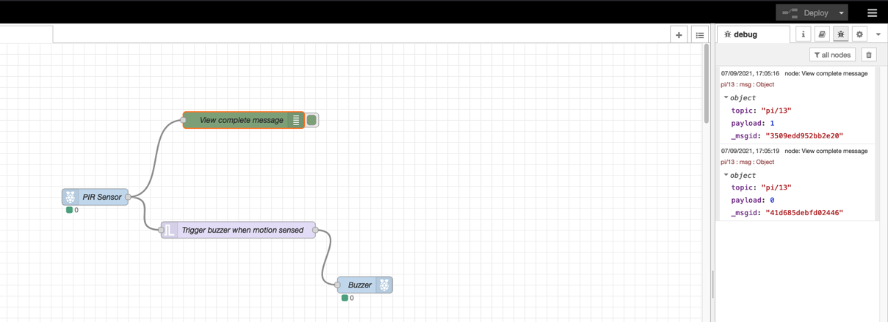
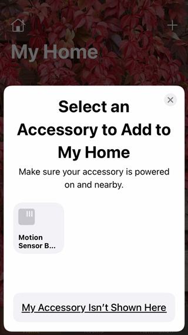
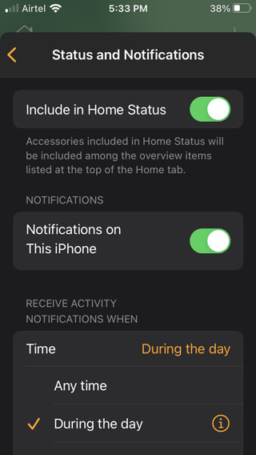

---
also_found_in:
- learningpaths/iot-getting-started-iot-development/
authors: ''
completed_date: '2017-06-30'
draft: false
excerpt: Learn how you can build a simple home automation IoT solution.
ignore_prod: false
last_updated: '2021-10-27'
meta_description: Learn how you can build a simple home automation IoT solution.
meta_keywords: IoT, sensors, Node-RED, Raspberry Pi
primary_tag: iot
related_content:
- slug: iot-getting-started-iot-development
  type: learningpaths
- slug: iot-next-steps-iot-development
  type: learningpaths
subtitle: Build a smart doorbell with a Raspberry Pi, some sensors, Node-RED, and
  Apple Home Kit
tags:
- iot
time_to_read: 4 hours
title: Get started developing IoT solutions by building a simple home automation system
type: tutorial
---

Many IoT solutions are often automation systems. Typically, a home automation system consists of multiple software and hardware components that transfer information via a network.

In this tutorial, we’ll create a simple, but smart, doorbell system. The completed doorbell system consists of these components and has the following capabilities:

* A motion sensor that detects if someone is at your front door
* A buzzer that acknowledges their presence with a beeping sound (the doorbell is motion detecting, so there is no button to press)
* A temperature and humidity sensor that gives you insight into the weather near your doorbell.
* Connectivity with Apple Home app so that the system sends notification once someone is at the door (you may have trouble hearing the doorbell, for instance, when working with headphones on).
* The temperature and humidity sensor readings are synced with the Apple Home app so you know when it makes sense to grab a coat or carry an umbrella.

Upon completing this tutorial you should have the [skills](/learningpaths/iot-getting-started-iot-development/concepts-and-skills/) required to create a similar system from scratch yourself, implementing even more interesting ideas on top of it. So let's get started!

## What you'll need to build this IoT solution

Like most home automation systems, the doorbell system will require some hardware, software components, and network infrastructure.

### Hardware-related components

<sidebar>You learned all about the best hardware for IoT projects in “[Choosing your hardware](/learningpaths/iot-getting-started-iot-development/hardware-guide/).”</sidebar>

To begin, you’ll need a microprocessor. In this IoT solution, we’ll use a Raspberry Pi, and it is best to pick up the latest Raspberry Pi model. If cost is a concern, you can buy a Raspberry Pi Zero W. Raspberry Pi is a popular single-board computer among hobbyists, so there are compatible electronic components readily available and many online resources for development.
The Raspberry Pi is a minimal computer, so we need to attach extra components to it based on our use case. Here are the components needed for our smart doorbell:

* Micro USB cable and USB power adapter (needed to power the Raspberry Pi).
* A micro SD card with 8GB (or more) of storage. We'll install Raspberry Pi OS on this card.
* <a href="https://learn.adafruit.com/introducing-the-raspberry-pi-zero/gpio-header-options" target="_blank" rel="noopener noreferrer nofollow">_40-pin GPIO header_</a> if you bought Raspberry Pi Zero W or your device doesn't have header pins.
* The following Raspberry Pi (or Arduino) compatible electronic components:

    * <a href="https://www.adafruit.com/product/189" target="_blank" rel="noopener noreferrer nofollow">_Passive Infra-Red (PIR) digital sensor_</a>
    * <a href="https://www.adafruit.com/product/1536" target="_blank" rel="noopener noreferrer nofollow">_Piezo Buzzer_</a>
    * <a href="https://www.adafruit.com/product/386" target="_blank" rel="noopener noreferrer nofollow">_DHT-11_</a> or <a href="https://www.adafruit.com/product/385" target="_blank" rel="noopener noreferrer nofollow">_DHT-22_</a> digital temperature and humidity sensor module
    * <a href="https://www.amazon.com/Haitronic-Multicolored-Breadboard-Arduino-raspberry/dp/B01LZF1ZSZ/" target="_blank" rel="noopener noreferrer nofollow">_Female-to-female jumper wires_</a>

If you're using any other device than the recommended Raspberry Pi devices, make sure they have a wifi module, as we'll be connecting to the device via wifi.

Lastly, I'll be using my MacBook Pro for development in this tutorial. You can also use any other modern computer (with Linux or Windows OS).

Optionally, you might also want these hardware components

* A Raspberry Pi case to provide some protection to your device from accidental damages, especially being outdoors.
* A monitor, HDMI cable, keyboard, and mouse in case you'd want to interact with Raspberry Pi directly through the Raspberry Pi OS interface (without using an SSH client).

### Network-related components

<sidebar>You learned all about networking for IoT projects in “[Connecting all the things](/learningpaths/iot-getting-started-iot-development/networking-guide/).”</sidebar>

Wifi was my preferred choice of networking technology for this project because I already have a Wifi network in my house, and the range of my home automation system only needs to reach within the local area network (LAN) in my house. Wifi also has the advantage of having a high data throughput, which means I should have no trouble gathering data from the connected sensors.
For ease of connectivity, it's recommended to connect the devices to the same wireless (Wi-Fi) network. If you don't have a wireless network router, you can connect the devices to the same mobile Wi-Fi hotspot. I picked Wi-Fi as the networking technology for the set up because it is the easiest option for most people. There are other protocol choices (like Bluetooth, Zigbee, Ethernet, Cellular RFID) which can be more efficient in certain areas like coverage, bandwidth, network latency, and power usage.

### Software-related components

We'll make use of the following software components:

<sidebar>**Troubleshooting tip:** If you've never used Node-RED before, complete the "[Getting started with Node-RED](/learningpaths/get-started-node-red/)" learning path.</sidebar>

* An SSH client to send commands to the Raspberry Pi through the command line. Most modern operating systems already have an SSH client preinstalled in their command-line shells.
* <a href="https://www.raspberrypi.org/software/" target="_blank" rel="noopener noreferrer nofollow">_Raspberry Pi Imager_</a> to install Raspberry Pi OS to the micro SD card for our Pi device.
* <a href="https://nodered.org/" target="_blank" rel="noopener noreferrer">_Node-RED_</a> (to be installed on Raspberry Pi). Node-REDwas originally created by IBM but is now an <a href="https://openjsf.org/projects/" target="_blank" rel="noopener noreferrer">_open source project in the OpenJS Foundation_</a>.
* A web browser.
* <a href="https://developer.apple.com/homekit/" target="_blank" rel="noopener noreferrer nofollow">_Apple Home Health Kit_</a> and the Apple <a href="https://www.apple.com/in/ios/home/" target="_blank" rel="noopener noreferrer nofollow">_Home app_</a> (requires an Apple device such as an iPhone or iPad that runs iOS 10 or higher).

## Architecture overview of our IoT solution

Before we begin building, here's a visual overview of the architecture of our system that you can use as a reference as you build the IoT solution.


## Steps

1. Setting up the Raspberry Pi
2. Setting up Node-RED and Node.js
3. Connect electronic components to the Raspberry Pi
4. Creating a workflow for PIR sensor and piezo buzzer
5. Connecting to the Apple Home app
6. Creating the workflow for the DHT sensor
7. Putting it all together

## Step 1. Setting up the Raspberry Pi

Most Raspberry Pi devices come without any storage or a preinstalled operating system. So, the first step is to set up our Pi (we refer to Raspberry Pi as Pi for the rest of the tutorial). We'll configure the Pi in headless mode implying that we won't have to interact with it directly (using the display, keyboard, and mouse). Instead, we will connect our computer and our Pi to the same wifi network and then access it via SSH.

### Step 1a. Install the latest version of the Raspberry Pi OS on the micro SD card

You can skip this step if you are using a micro SD card preinstalled with Raspberry Pi OS (previously called Raspbian). If you are starting with a blank card, however, you'll first need to install the latest version of the Raspberry Pi OS onto the micro SD card. We use an 8 GB micro SD card, setting up the card from a MacBook using an SD card adapter.

After you plug the SD card into your computer, you can launch <a href="https://www.raspberrypi.org/software/" target="_blank" rel="noopener noreferrer nofollow">_Raspberry Pi imager_</a> and provide the SD card's location.

<sidebar>**Troubleshooting tip:** If for some reason the Pi's Imaging tool doesn't work for you, you can try other popular imaging tools. The SSH and wifi information in the case can be provided by plugging the Pi into a display (using HDMI or VGA cable), connecting a keyboard & mouse, and configuring them through Raspbian's user interface. If that's not feasible, you have to provide this information through special files on the SD card. This <a href="https://raspberrypi.stackexchange.com/questions/10251/prepare-sd-card-for-wifi-on-headless-pi" target="_blank" rel="noopener noreferrer nofollow">_StackExchange thread_</a> discusses how to configure a Pi through config files.</sidebar>

After selecting the storage location, we need to do some more configuration. The imager tool makes it easier to pre-configure the installed operating system with essential settings for accessibility like enabling SSH, providing wifi credentials, and setting up the timezone. You can access these settings by using the key combination `Cmd + Shift + X` on a MacOS computer or `Ctrl + Shift + X` on other computers.

We’ve set the hostname as `raspberry.local`, enabled SSH, set a password, and provided wifi credentials so that the Pi can connect to the wifi automatically once booted. We have also specified the time zone. After saving these configurations, click the **Write** button, and let the imager do its job.

### Step 1b. Verifying the Raspbian OS installation

After the operating system image is written by the Imager tool, eject your micro SD card, and insert it in the SD card slot in your Pi. Next, connect the Pi to a power source through a micro USB cable and adapter. The device will boot up in few minutes.

To verify everything is installed correctly, use the ping command from the command line to make sure the computer can access the Pi through the wireless network it is connected to. If everything is fine, you should see output like the following:


If you see an unknown host error (`ping: cannot resolve raspberrypi.local: Unknown host `), then there's either some issue with the SD card content or the Pi couldn't connect to the wifi network automatically.

You should now be able to connect to Pi using the SSH command `ssh pi@raspberrypi.local`. It'll prompt for a password. Enter the password that you provided in the advanced options of the Imager tool. The default password for SSH is "raspberry." A successful SSH login attempt will have output similar to this:


## Step 2: Setting up Node-RED and Node.js

To create workflows for our IoT solution (the smart doorbell), we will use a flow-based programming tool called Node-RED.

Using Node-RED, we can visually create workflows that wire together hardware devices and software components (APIs and online services). Node-RED runs on Node.js runtime, so we'll need to ensure we have the latest stable versions of both installed on our Pi.

### Step 2a. Installing the latest version of Node-RED and Node.js

You can check the official documentation for the most up-to-date instructions to <a href="https://nodered.org/docs/getting-started/raspberrypi" target="_blank" rel="noopener noreferrer">_install Node-RED on Raspberry Pi OS_</a>. At the time of this writing, you simply run the following command in the shell:

```
bash <(curl -sL https://raw.githubusercontent.com/node-red/linux-installers/master/deb/update-nodejs-and-nodered)
```

The above script will update (or install) the latest stable versions of Node.js and Node-RED on our Pi. This step takes some time, so don't worry if you think it's stuck (unless it's been more than 30 minutes or so).


### Step 2b. Verifying Node-RED installation

You can start the Node-RED server using the command `node-red-start` to ensure the installation is good. This command will run the server on port 1880 of the Pi, and you'll see an output similar to the following:


### Step 2c. Accessing Node-RED dashboard

Be sure to verify whether or not you can access the Node-RED dashboard from your computer. If you enter `http://raspberrypi.local:1880` as the URL in the web browser, you should see a dashboard like the following. It might look slightly different based on the version of Node-RED that is installed.


## Step 3: Connect electronic components to the Raspberry Pi

You can now connect your sensors and buzzer to the Pi and then program them into the workflow using Node-RED. Most Pi devices contain 40 pins. Some pins serve identical purposes, and some serve a unique purpose. Below is a diagram representing all the 40 Raspberry Pi pins, what they are called, and their purpose. PIN numbering starts from the top-left and then goes left-to-right, and top-to-down in incremental fashion.


For our sensors and buzzer, we'll be using GPIO pins, GND pins, and +5V pins. We'll connect pins in our IoT sensors to the header pins in the Pi through jumper wires. If your device did not come with the header pins attached, you’ll need to either attach an auxiliary pin header or solder jumper wires to the Pi. The following is a reference figure illustrating what the connections should look like.


A few things to note about the above connections diagram:

* All the black wires go to the GND pins in the Pi. The sensors are usually marked with a `-` (minus) sign near the pins that are meant to be connected to GND. In the case of the Piezo buzzer, the shorter pin is supposed to be connected to GND.
* The red wires of both sensors go to +5V pins in the Pi.
* Both sensors contain a pin to transmit the digital information that they sense. These pins can be connected to any of the GPIO pins in the Pi. The longer pin in the Piezo buzzer is supposed to be connected to any GPIO pin. Here’s how we have connected the electronic components to the following pins:

| Sensor/Device | Pin header # | GPIO pin # |
|---|---|---|
| PIR Sensor | 7 | GPIO4 |
| Piezo Buzzer | 11 | GPIO17 |
| DHT-11 Sensor | 40 | GPIO21 |

## Step 4: Creating a workflow for PIR sensor and piezo buzzer

Now that we have finished the connections, we can create workflows involving them using Node-RED. Let's begin by creating a workflow for the PIR sensor and the piezo buzzer. We'd like to create a workflow where if the PIR sensor detects any motion, the piezo buzzer is triggered, and we hear a beeping sound (kind of like we hear on the security systems at airports).

If you’d like to build the Node-RED flows for yourself, follow the steps outlined here.  If you run into issues However, if you’d like to start with my Node-RED flow and modify the GPIO PIN numbers of sensor nodes and the buzzer such that they match with your wiring, you can download the flow from <a href="https://github.com/satwikkansal/pi-nodered-homekit-automation/tree/master" target="_blank" rel="noopener noreferrer nofollow">_my Github repository_</a> and import it directly in Node-RED.

The following information about the sensors and buzzer will help you make better sense of the workflow:

* Whenever the PIR sensor senses motion, it outputs a HIGH voltage pulse (that is, a digital signal level 1), otherwise it outputs LOW pulse (that is, a digital signal level 0).
* Whenever the buzzer receives a HIGH voltage pulse, it makes a sound. It stops if it receives a LOW pulse.

Keeping that in mind, here are the steps to set up a workflow connecting the PIR sensor and piezo buzzer.

On the left side of the Node-RED dashboard, search for the input node (called RPI-gpio in) and drag it to the canvas.


Double click on the node, and you'll see a dialog box similar to the following configuring the input node. Since the signal pin of the PIR sensor is connected to the 7th pin of the Pi, we’ve chosen that. We can give the node any meaningful name we like.


Next, add an output node (named RPI-gpio out) to the canvas that'll represent the piezo buzzer.


Since the longer pin of the piezo buzzer is connected to the 11th pin of the Pi, we have chosen that. Also, note how we initialized the pin at 0 (LOW) level so that the buzzer doesn't start already triggered when we deploy our workflow.


Now, all we have to do is to connect these two nodes with a trigger function node.


The configurations of the trigger node is shown below. Whenever the trigger node receives a 1, it'll send 1 as its output for 250ms and then send 0. This will produce an effect of a short beep through the piezo buzzer.


Click on the **deploy** button (at the top right corner of the dashboard). After your Node-RED app is deployed, you'll receive a success notification: `Successfully deployed`.

Finally, let’s test the PIR sensor. If you put your hand in front of the PIR sensor, the values in the sensor node and buzzer node should change to 1, and you should hear a beeping sound!


## Step 5: Connecting to the Apple Home app

Next we’ll expose the PIR sensor with the Apple Home Kit service. Home Kit is Apple's home automation framework that allows you to read from sensors and control smart devices installed in your home by using the Home app from an iPhone, iPad, or iTV. Using the Apple Home Kit, you'll see the sensor readings on your phones and even control these devices.

### 5a. Installing the homekit-contrib module

As seen in the last step, the Node-RED palette has a few pre-existing nodes (like input, output, trigger, and so on). You can add custom nodes by installing additional (`contrib`) modules. Modules can be added by using the web interface by going to the menu at the upper-right of the web interface, then selecting **Manage palette** and searching.

<sidebar>**Troubleshooting tip:** If you are not able to see the Node-RED node in the palette after you install the contrib module, make sure that you've installed the contrib module from the UI, which means the install button is greyed out when you search for the module, and it says "installed" instead.  Also, make sure that you've installed the dependencies mentioned on the description page of the module. Finally, restart the node-red server by running the command node-red-start from the command line.</sidebar>

To connect to the Home app, use the `node-red-contrib-homekit-bridged` module. This module provides a new Node-RED node named HomeKit, for integrating other nodes with the Apple Home Kit, all using the web user interface. You can install the nodes directly from the Node-RED dashboard, but it is recommended to check out the module's documentation to see if there are any additional dependencies needed for manual installation.

<!-- LEAVING THIS ONE OUT?
 -->

At the time of writing, there were no dependencies to be manually installed for the node-red-contrib-homekit-bridged module.

### 5b. Preparing messages for HomeKit node

A message in Node-RED is a JSON object that is passed from one node of the workflow to another and carries the information needed to program the logic of the workflow. The PIR sensor node also publishes a message that then goes to the trigger function node.

Thankfully, we don't have to guess what that message is. We can use Node-RED's debug node to see the exact contents of the message. The green node in the next image is the debug node, and as you can see, it prints out the messages being sent out by the PIR sensor to the pane on the right. When the sensor detects motion, it sends "1" in the payload key of the message, and it sends "0" once the detection stops.



### 5c. Setting up the HomeKit node

Now that you know what message the PIR sensor is sending, let’s figure out how to pass this information to the Home app. We do so through the Homekit Service node `node-red-contrib-homekit-bridged` module installed in the last step. This node will serve as a "bridge" between Node-RED and Home Kit and take care of data transmission. Keep in mind that this node seeks data in a particular format (more on this soon). Let's start by inserting the node into the canvas. We can search for "homekit" in the left sidebar, drag the node to the canvas, and then double click it to update its configuration.


In the service, choose MotionSensor, and specify Host Type as Accessory. We'll have to create an accessory, which we can do by clicking the edit button next to the Accessory input. The Home Kit app will use this information (service type and accessory type) to handle the data appropriately and render widgets on the Home app.


Here's what the accessory node configuration looks like. We have specified the Accessory Category to SENSOR, set the pin code (we'll need to put this code later in the Home app), and left other details as default ones since they don't affect the functionality.


Once created, we'll connect the PIR sensor and Door Sensor using a function node. This function node shapes the message into the desired format for a MotionSensor service by the HomeKit node. You'll see errors in the debug messages pane if the data is not in the correct format.


But how do we know what is the correct format?  One way to do it is to send the wrong message intentionally and then reverse engineer from the errors in the debug pane. You can also get info from the node-red-contrib-homekit-bridge's documentation about these services. The characteristics mentioned in the documentation map to the fields in the message format. We have to keep in mind that the documentation can be outdated if there are major changes in homekit, so the first way becomes more useful in those situations.

After I figured out the data format, I discovered that a particularly interesting field was the MotionDetected field, which is what we'll set in the function node. We'll set MotionDetected characteristic to true if the payload value in the message it receives is <a href="https://developer.mozilla.org/en-US/docs/Glossary/Truthy" target="_blank" rel="noopener noreferrer nofollow">_truthy_</a>.


Here’s what our flow looks like now, after deploying it:


The MotionDetected: true label below the Door Sensor node indicates that things are working fine.

## Step 5d. Connecting to the Home app

Now comes the fun part. We can add the Motion sensor service created in Node-RED to the Home app and see its status in real-time. To do this, we first need to go to the Home app and click on Add accessory button.


If the iOS device is connected to the same network as the Pi, you'll see the sensor getting detected like below. Just tap on it.



Since it's our custom system, it won't be certified by HomeKit, so if you see a warning like the following, click on "Add Anyway." It'll then ask for a pin code. Enter the same pin that you entered while configuring the accessory in Node-RED.


You might also be prompted to enter some meta information, like which room the sensor is located in, or what you'd like to name it, etc. Once complete, you'll see the Motion Sensor accessory in the app.


Now, whenever the PIR sensor detects a motion, you'll see this nice little animation in the app.


But what if you want to be actively informed? We can go to the settings of this accessory and turn on Notifications. Here we have set the Notification timings to "during the day" to avoid being disturbed while sleeping.



Finally, whenever someone is in front of the door, you’ll get a notification on your mobile device! Pretty cool, right?


## Step 6: Creating the workflow for the DHT sensor

The motion sensor and buzzer flow work well. Now it's time for the DHT sensor workflow. Here, we’ve added the DHT sensor wiring in a new flow, and after completion, the flow looks as follows.


Since the process is somewhat similar to what we did for the PIR sensor, let’s only look at the distinct parts for brevity.

### Step 6a. Installing node-red-contrib-dht-sensor module

First of all, to work conveniently with the DHT sensor, we'll install a contrib module named <a href="https://flows.nodered.org/node/node-red-contrib-dht-sensor" target="_blank" rel="noopener noreferrer nofollow">_node-red-contrib-dht-sensor_</a>.

We can install it from the node-red itself, but the documentation for this module lists a couple of dependencies on the BCM2835 library and the node-red-DHT module. So, we'll need to install those dependencies first. At the time of writing, the following commands were used to install all of the dependencies:

```
cd ~
wget http://www.airspayce.com/mikem/bcm2835/bcm2835-1.68.tar.gz
tar xzf bcm2835-1.68.tar.gz
cd bcm2835-1.68/
./configure
make
sudo make check
sudo make install
sudo npm install --unsafe-perm -g node-dht-sensor
sudo npm install --unsafe-perm -g node-red-contrib-dht-sensor
```

Once installed, you'll see the `dht22` node in the palette and to the canvas as follows.


### Step 6b. Figuring out the message contents

Next, add an inject node and a debug node. The inject node will trigger the DHT sensor to give out readings as a message in regular intervals, and with the help of debug node, you can see what message the DHT sensor node is emitting.


Here's the configuration of inject node, set to repeat every 10 seconds.


The following figure shows the message that's emitted by the sensor and captured in the debug pane. As you can see, the payload contains a temperature value, and the humidity value is present in another top-level field named humidity. There's no other useful information to extract from the message.


### Step 6c. Add HomeKit nodes to the workflow

We'll now add two HomeKit service nodes, one with the service type TemperatureSensor and the other with HumiditySensor.
Like the last time, you can figure out the expected message format by first sending random messages to these services. The transformation functions for these two nodes are below:

Temperature:
```
// Prepare temperature payload
msg.payload = {
  CurrentTemperature: parseFloat(msg.payload)
}
return msg;
```

Humidity:
```
// Prepare humidity payload
msg.payload = {
  CurrentRelativeHumidity: parseInt(msg.humidity)
}
return msg;
```

The temperature sensor service node expects the CurrentTemperature characteristic value to be set, and the humidity sensor service node expects the CurrentRelativeHumidity characteristic value to be set.

Once deployed, you should be able to see temperature and humidity labels below their respective HomeKit nodes.


<sidebar>**Troubleshooting tip:** Some sensors don't mention which pin is ground, positive, and signal, which might require some trial and error or the manual's search to figure out the correct wiring. Also, sometimes PIN 7 of the Pi doesn't work for some people. In that case, you might have to use some other GPIO pin (like PIN 13). In very rare cases, the jumper wires are faulty. If all those things are in place, and the Node-RED still doesn't show anything, it is possible that the sensor might be faulty in the first place.</sidebar>

### Step 6d. Adding Temperature and Humidity accessories to the Home app

The last step to complete the DHT sensor workflow is to add the accessories to your Home app. Follow the same process as the last time to add a new accessory.

Note that you'll have to add both Temperature and Humidity accessories one by one. Once done, the following is what we end up with!


## Step 7. Putting it all together

Now that we have both of the flows working and deployed, here are some final steps to take. First, we need to ensure that if the power goes off and comes back up and the Pi has to restart, the node-red server is automatically started. To do that, enable nodered service using the following commands:

```
pi@raspberrypi:~ $ sudo systemctl enable nodered.service
Created symlink /etc/systemd/system/multi-user.target.wants/nodered.service → /lib/systemd/system/nodered.service.
```

After this, node-red will autostart on every boot. Next, optionally, we can enclose everything together in a case. Of course, there's no single best way to do this. You can enclose the Pi in a plastic case, fix the PIR sensor on the top with double-sided tape, and leave the DHT sensor and piezo buzzer hanging. Here's how that looks like:


I didn't have to worry about water since my door area is covered from the top. You might have to ensure that your Pi doesn't accidentally come in contact with water. Otherwise, it can be damaged because of short circuits. So it might be a good idea to enclose everything in a bigger case and waterproof it using silicone.


## Summary and next steps

This tutorial covers the entire process of building a home automation system from scratch. We created a smart doorbell system using inexpensive electronic components, open source software, and a reasonably priced Raspberry Pi device. We covered how the different components are connected to build an end-to-end solution. The concepts and methods discussed in the tutorial should help you implement your own home automation ideas or build further on top of what we built here.

Here are a few similar ideas for a smart doorbell that you may want to build:
* Use an LCD display so that you can display messages.
* Attach a camera to the Pi (you can use Doorbell type HomeKit service).
* Use LED lights for feedback instead of a buzzer.
* Add a Do Not Disturb mode. You can add a Switch node that you turn On or Off from the Home app. Then you can design a Node-RED flow to let the visitor know that you're unavailable. For example, you can turn on the green LED when it's safe to enter and turn on the red LED when it's not.
* Add a light sensor and connect it to a smart bulb (via wifi) or directly to the Pi using a relay module.


### Acknowledgements

This sample and tutorial were originally developed and written by Anna Gerber and then updated by Vidya Madhuvarsu.  

The authors used the circuit diagrams from these fritzing components to create her own circuit diagrams for this tutorial:

* AdaFruit library: <br/>[https://github.com/adafruit/Fritzing-Library/](https://github.com/adafruit/Fritzing-Library/)
* DHT11 sensor module: <br/>[http://fritzing.org/projects/ky-015-temperature-and-humidity-sensor-module](http://fritzing.org/projects/ky-015-temperature-and-humidity-sensor-module)
* PIR Sensor and relay: <br/>[https://github.com/rwaldron/fritzing-components/blob/master/components/keyes-relay.fzpz](https://github.com/rwaldron/fritzing-components/blob/master/components/keyes-relay.fzpz)
