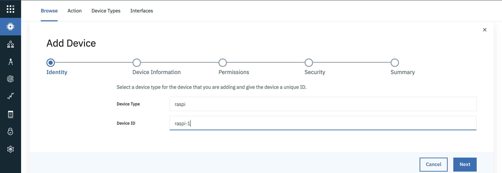
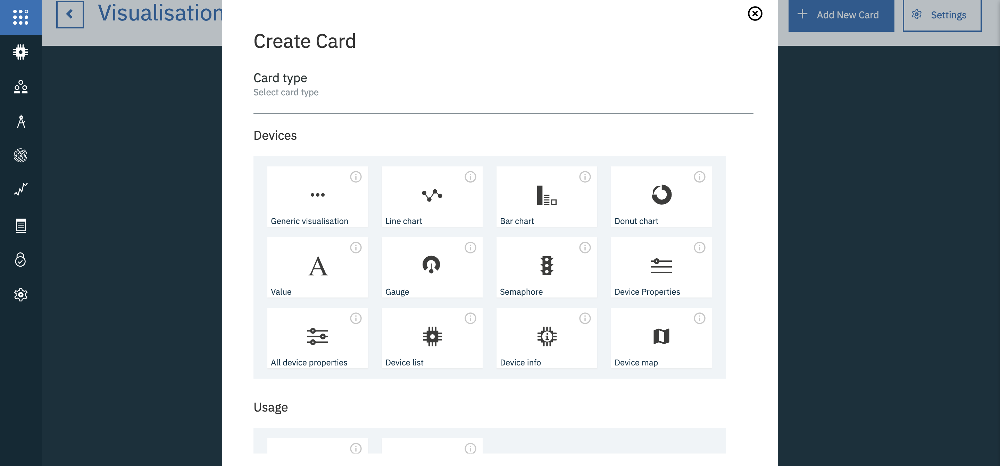
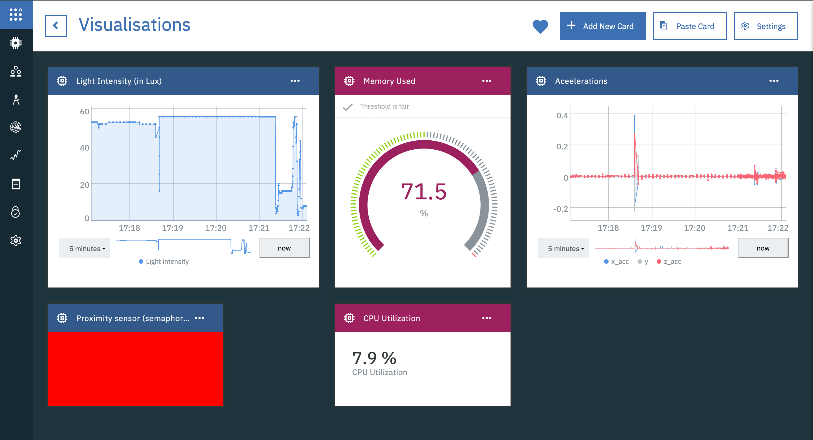

<!-- <サイドバー> <見出し>ラーニングパス。Building skills in IoT development</heading> 
このチュートリアルは、IoTの開発者向けガイドであるIoT 201 learning pathの一部です。
 <ul> <li> [IoTアーキテクチャ](/articles/iot-lp201-iot-architectures/)</li><li> [IoTセキュリティの課題](/articles/iot-top-10-iot-security-?challenges/)</li> <li>[IoTデータアナリティクス](/tutorials/iot-lp301-iot-manage-data)</li><li>[IoTデバイスマネジメント](/tutorials/iot-lp301-iot-device-management)</li> <li>チュートリアルです。Build a door monitoring system (this tutorial)</li></ul></sidebar> -->

チュートリアルの["Get started development IoT solutions by building a simple home automation system"](/tutorials/iot-lp101-get-started-develop-iot-home-automation/)では、Raspberry Piに接続された複数のセンサーを使用してドア監視デバイスを組み立て、Node-REDを使用してIoTフローを設計し、Apple HomeKitフレームワークを使用してiOSアプリケーションを使用してシステムを監視しました。この方法では、コードはほとんど必要ありません。

このチュートリアルでは、似たようなシステムである「ドア・モニタリング・システム」を構築しますが、焦点は異なります。コードを深く掘り下げ、アーキテクチャやデザイン、分析、セキュリティなど、IoTシステムのさまざまな側面に焦点を当てていきます。このプロジェクトでは、ハードウェアや配線を最小限に抑えるために、スマートフォンを、個別のハードウェア・センサーの集合体の代理として使用します。このプロジェクトでは、加速度センサー、近接センサー、光量センサーを搭載した私の古いAndroidスマートフォンを使用します。ほとんどのスマートフォンは、たとえ古いものであっても、これらの基本的なセンサーを備えています。だからこそ、実際のスマートフォンが、実際のセンサーの代わりになるのです。

当社のドア・モニタリング・システムでは、センサー（スマートフォン）をドアに取り付け、さまざまなセンサーの読み取り値を継続的に記録します。これらの測定値は、さまざまなアクションを起こすために使用され、収集されたデータは分析を行うために使用されます。

## 前提条件

* [Python](/articles/os-beginners-guide-python)の使用に慣れていること。
* [ネットワークプロトコル](/articles/iot-lp101-connectivity-network-protocols/)の基礎知識
* <a href="https://cloud.ibm.com/register?cm_sp=ibmdev-_-developer-tutorials-_-cloudreg" target="_blank" rel="noopener noreferrer">_IBM Cloud account_</a>をお持ちの方

## IoTシステムのアーキテクチャ

シンプルなIoTアーキテクチャは、デバイスとクラウドの2つの層で構成されているものと考えられます。デバイスは、ネットワークを介してクラウドに直接接続されます。クラウドはデバイスをオーケストレーションし、そのデータを分析やモニタリングなどに利用します。この構造は、単純なユースケースには有効ですが、システムの規模が大きくなると、より複雑な要素を加える必要が出てくるかもしれません。

典型的なIoTアーキテクチャには、多くの異種IoTデバイスが含まれ、異なるフォーマットのデータを異なる速度で生成するセンサーがあり、それらのデータを処理・分析して洞察を得ることになります。IoTデバイスは、ネットワークに直接接続されるか、ゲートウェイデバイスを介してネットワークに接続され、デバイス同士やクラウドサービス、アプリケーションとの通信が可能になります。デバイスは地理的に離れていても、Bluetooth、Zigbee、WiFi、Cellular、RFIDなどの無線プロトコルや、Ethernetなどの有線プロトコルで情報を送信することができます。

そこで、デバイスとクラウドの間にレイヤーを追加し、これらの異種プロトコルやデータフォーマットをクラウドに送信する前に集約することが有効です。この層は、ゲートウェイ層またはエッジ層と呼ばれ、ルーターに組み込むことも、専用の別のデバイスに組み込むこともできます。ゲートウェイまたはエッジレイヤーは、アグリゲーション以外にも、以下のような目的で使用されます。

* **デバイスのプロビジョニング**。**デバイスのプロビジョニング**：ゲートウェイは、デバイスの最初の接点となるため、新しいデバイスのプロビジョニングやネットワークへの登録に使用できます。
* **エッジコンピューティング**。デバイスから生成されるデータのすべてが、IoTシステムにとって有用とは限りません。そこで、ゲートウェイは、データをクラウドに送信する前に、データの一部を前処理またはフィルタリングするために使用することができます。これにより、クラウドに不要な負荷がかかることを防ぎ、システムの帯域幅やリソースをより効率的に利用することができます。
* **デバイスの仮想的な抽象化**。クラウド層では、デバイスとの通信をエッジに依存することができます。デバイスは断続的に接続される可能性があるため、エッジはデバイスの最後の状態をクラウドに提供し、デバイスが到達できない場合には上の層からデバイスに送られたコマンドを保存することができます。これらのコマンドは、デバイスがオンラインに戻った時点で、デバイスに送信することができます。

この3層構造のアーキテクチャは、役割と責任を異なるサービスに分割することで、さらに拡張することができます。例えば、<a href="https://www.ibm.com/jp-ja/cloud/architecture/architectures/iotArchitecture/reference-architecture" target="_blank" rel="noopener noreferrer">_IBM IoTリファレンス・アーキテクチャ_</a>では、アーキテクチャにエンタープライズ層とユーザー層を追加し、各層のさまざまなコンポーネント（またはサービス）を描いています。IoTアーキテクチャを設計する際には、特定のレイヤーやサービスは、そのレイヤーにすぐに接続されているレイヤーやサービスとのみ連携する必要があることを覚えておいてください。

今回のドア監視システムでは、1台のスマートフォンを使ってプロジェクトを進めます。しかし、複数のデバイスへの拡張が容易で、セキュリティ、デバイス管理、分析など、さまざまなコンセプトに対応できるようにシステムを構築したいと考えています。そこで、ゲートウェイ層となるデバイスを追加します。今回は、無線LANに対応した予備のRaspberry Piをゲートウェイとして使用します。ゲートウェイに関連するコードを実行するために、別のマイクロコントローラーや、PCを使用することもできます。IBM Watson IoT Platformやその他のサービスを活用することで、セキュリティ、デバイス管理、モニタリング、アナリティクス、ビジュアライゼーションなど、車輪の再発明を避けることができます。  

当社のドア監視システムのアーキテクチャについては、次の図を参照してください。

## IoTアプリケーションのIoTプロトコル

前述のように、IoTシステムでは、ゲートウェイとの通信に異なるプロトコルを使用する異種のデバイスが存在する可能性があります。しかし、IoTの世界で最も普及しているプロトコルは、MQTT（MQ Telemetry Transport）です。MQTTはMachine to Machineのメッセージングプロトコルです。一般的なIoTデバイスの電力やリソースの制約を考慮して、軽量かつ高速に設計されています。このプロトコルはTCP/IP上で動作し、パブリッシュ・サスクライブ・モデルで動作します。MQTTの仕組みについては、[Getting to know MQTT](/articles/iot-mqtt-why-good-for-iot/)の記事で詳しく解説しています。

機能的なMQTTシステムの主要なエンティティは次のとおりです。

* MQTTクライアント
* メッセージブローカー
* トピックとメッセージ

クライアントはブローカと通信します（お互いに直接通信するわけではありません）。ブローカでは、メッセージを発行したり、階層化されたメッセージトピックを購読することができます。トピックは、異なるデータを分離するために使用されます。

ドア・モニタリング・システムでは、ゲートウェイ（Raspberry Pi）からIBM Cloudのメッセージ・ブローカーへのデータ通信にMQTTを使用し、その逆も同様です。Watson IoT Platform は MQTT で動作します。

スマートフォンからのデータ通信には、複数の選択肢があります。Bluetooth、MQTT、Webソケット、HTTPを使用することができます。選択したプロトコルに基づいて、ゲートウェイに適切なリスニングロジックを実装する必要があります。一般的には、センサーデータやその他のデバイスの詳細にアクセスできるカスタムのモバイルアプリケーションやWebサイトを構築することになるでしょう。しかし、今回のユースケースはセンサーデータを中継するというシンプルなものなので、<a href="https://play.google.com/store/apps/details?id=com.mscino.sensornode&hl=en_IN" target="_blank" rel="noopener noreferrer nofollow">_SensorNode_</a>（MQTTを使用）、<a href="https://github.com/satwikkansal/ibm_iot_example/tree/master/sensor-udp" target="_blank" rel="noopener noreferrer nofollow">_SensorUDP_</a>（ソケットを使用）や<a href="https://play.google.com/store/apps/details?id=cz.honzamrazek.sensorstreamer&hl=en_IN" target="_blank" rel="noopener noreferrer nofollow">_SensorStreamer_</a>（HTTPを使用）のような既存のアプリケーションや、以下のようなカスタムウェブページを活用することができます。

<a href="https://developer.mozilla.org/en-US/docs/Web/API/Sensor_APIs" target="_blank" rel="noopener noreferrer nofollow">_Sensor APIs_</a>を利用して、デバイスのセンサー読み取り値にアクセスすることができます。

ここではゲートウェイとクラウド間の通信にMQTTプロトコルを採用しており、連続的な遠隔測定データにはHTTPは不要なオーバーヘッドであるため、センサーデータのストリーミングには<a href="https://github.com/satwikkansal/ibm_iot_example/tree/master/sensor-udp" target="_blank" rel="noopener noreferrer nofollow">_SensorUDP_</a>を選択しましょう。

## ステップ

さて、システムのアーキテクチャが決まり、使用するプロトコルも決まったところで、コーディングを始めましょう。

私のコードはすべて、<a href="https://github.com/satwikkansal/ibm_iot_example/" target="_blank" rel="noopener noreferrer">_GitHub repo_</a>で公開しています。

<button-link> <text>Get the code</text> <url>https://github.com/satwikkansal/ibm_iot_example/</url></button-link>

### ステップ1.IoT Platformサービスの作成

1. <a href="https://cloud.ibm.com/register?cm_sp=ibmdev-_-developer-tutorials-_-cloudreg" target="_blank" rel="noopener noreferrer">_IBM Cloud account_</a>にログインします。

2.IBM Cloud カタログを開き、サイドバーから「Internet of Things」を選択し、「<a href="https://cloud.ibm.com/catalog/services/internet-of-things-platform?cm_sp=ibmdev-_-developer-tutorials-_-cloudreg" target="_blank" rel="noopener noreferrer">_Internet of Things Platform_</a>」を選択します。

3.3. サービス名を入力し、地域とプランを選択して、「**Create**」をクリックします。

4.サービスが作成されたら、「**Launch**」をクリックして、このような Watson IoT Platform ダッシュボードを開きます。

    

### ステップ 2.新しいゲートウェイデバイスタイプの作成とゲートウェイデバイスの登録

ここでは、デバイスと IoT Platform サービスの間のゲートウェイとして Raspberry Pi を使用します。  新しいゲートウェイデバイスタイプを作成して、先ほど作成したIoT Platformサービスに登録する必要があります。

Watson IoT Platform ドキュメントの <a href="https://cloud.ibm.com/docs/services/IoT?topic=iot-platform-getting-started#step1" target="_blank" rel="noopener noreferrer">_registering your device_</a> の説明に従うことができます。

1. Watson IoT Platform ダッシュボードから、サイドバーの **Devices** を選択し、**Device Types** を選択します。**  Add Device Type**（デバイスタイプの追加）をクリックします。

    

2.選択したデバイス・タイプでデバイスを追加し、ウィザードを使用してゲートウェイ・デバイスを登録します。

    

3.ウィザードの最終画面で、デバイスの認証情報をコピーしてください。

    

「raspi」というゲートウェイタイプを作成し、ID「raspi-1」のゲートウェイデバイスを登録しました。デフォルトでは、ゲートウェイデバイスは、Watson IoT Platform Service にデバイスを追加する権限を与える特権的なパーミッションロールで登録されています (これについては後で詳しく説明します)。

### ステップ 3.スマートフォンのデバイスタイプを作成する

次に、スマートフォン用のデバイスタイプを作成する必要があります（ゲートウェイは別のデバイスタイプです）。ここでは、Androidを搭載した端末を使用するので、デバイスタイプ名を「Android」としますが、お好みの名前にしてください。

[![デバイスタイプの追加]画面のスクリーンショット](images/iotplatform-device-type2.png)

**Note:** 今回は、スマートフォンのデバイスを登録する必要はありません（raspi-1を登録したのと同じです）。後ほど説明しますが、特権ゲートウェイを使ってプログラムでスマートフォンを登録します。

### ステップ4.ゲートウェイの設定とクラウドへの接続

ゲートウェイデバイスは、MQTT プロトコルを使用してクラウドと通信します。Watson IoT Platform の MQTT ブローカーへの接続を設定するには、以下の情報が必要になります（ゲートウェイデバイス `raspi-1` を登録したときにコピーした情報です）。

* Organization ID (6 文字の識別子)
* デバイスタイプ（ここでは、`raspi`）。
* 特定のデバイスのデバイスID（例：`raspi-1`を使用した場合）
* 認証トークン

セキュリティのため、MQTTブローカーへの接続にはTLSを使用する必要があります。ブローカーへのMQTT接続を開始するには、ホストアドレス、クライアントID、ユーザー名、パスワードが必要です。接続先のホストアドレスは`<orgid>.messaging.internetofthings.ibmcloud.com`、clientIdは`"d:<orgid>:<device_type>:<device_id>"`という形式で、ユーザーは認証にトークンを使っている場合は`use-token-auth`、パスワードは認証トークンそのものの値です。

<a href="https://pypi.org/project/paho-mqtt/" target="_blank" rel="noopener noreferrer nofollow">_paho-mqtt_</a>のようなライブラリを使って接続を設定することもできますが、正しく設定するには多少の手間がかかるかもしれません。幸いなことに、IBMは<a href="https://pypi.org/project/wiotp-sdk/" target="_blank" rel="noopener noreferrer nofollow">_Python SDK_</a>（内部的には`paho-mqtt`を使用している）を提供しており、私たちにとっては開発が非常に楽になります。

以下のコードを使用すると、`wiotp-sdk` を使用して Watson IoT Platform の MQTT ブローカーにゲートウェイクライアントとして接続することができます。  python スクリプトは私の <a href="https://github.com/satwikkansal/ibm_iot_example/" target="_blank" rel="noopener noreferrer">_GitHub repo_</a> からダウンロードできます。

まず、SDKをインストールします。

# ファイル gateway_client.py
ANDROID_DEVICE_TYPE = "Android"

def send_android_device_event(client, device_id, eventId, data):
    client.publishDeviceEvent(
      ANDROID_DEVICE_TYPE, device_id, eventId, msgFormat="json", data=data, qos=0)

for data, device_addr in listen_sensor_data():
     send_android_device_event(client, device_addr[0], "status", data)

上のスニペットでは

* ゲートウェイのステータスアップデート（CPUとメモリの使用率データ）を5秒ごとに発行しています。
* 200ミリ秒ごとにデバイスデータを公開しています。

ホストアドレスに基づいてデバイスを区別しているので、上記のスニペットは複数のデバイスに対しても機能します。上記のロジックは、以前の値と比較して大幅な変化があった場合にのみイベントを発行するように拡張することもできます。このような技術は、クラウドでの計算オーバーヘッドを軽減し、ネットワークの帯域幅を節約するのに役立つため、エッジ・コンピューティングの一部となっています。

### ステップ9.データの視覚化

データをさまざまに視覚化することで、発生した事象をより明確に把握することができます。Watson IoT Platform を使って、クラウドに送信されているデータを可視化してみましょう。

ビジュアライゼーションを作成するために、新しいボードを作成します。

1. Watson IoT Platform ダッシュボードに移動し、「**Create New Board**」を選択します。

    

「**2.Add new card**」をクリックします。  そして、利用可能なカードの種類から、**Devices**の**Line chart**を選択します。

    

3.カードに表示されるデータを提供するデバイスを選択します。一部のカードタイプでは、表示されるデータセットのデータソースとして別のカードを使用するオプションがあります。これにより、他のカードの値を選択することで、依存するカードに表示されるデータをフィルタリングすることができます。例えば、ビジュアライゼーションカードに含まれる値は、デバイスリストカードから表示するデバイスを選択することでフィルタリングすることができます。

4.データセットを接続します。イベントタイプ（ステータス）を選択し、データタイプを選択して値の範囲を入力することでプロパティを設定し、「**次へ**」をクリックします。

    

5.カードのサイズ、色、タイトルを入力して、カードの外観を構成し、**Submit** をクリックしてカードをボードに追加します。

私は、さまざまな種類の視覚化（ゲージ、ラインチャート、セマフォなど）を試して、次のようなボードを作成しました。ボードをざっと見ると、システムのハイレベルなビューがわかります。

### ステップ10.  デバイスへのコマンドや情報の送信

これまでに設定したインフラでは、データを一方向（デバイス→ゲートウェイ→クラウド）にしか送信しませんでした。しかし、別の方向にデータを送りたい場合はどうすればよいでしょうか？例えば、ある動作をするようにデバイスに指示を出したい場合はどうでしょうか？これはコマンドを使って行うことができます。コマンドとは、クラウドやアプリケーション層から下位層に送り返されるMQTTメッセージに他なりません。

`wiotp-sdk` SDKは、アプリケーションクライアント（3層構造のアプリケーション層）に、デバイスやゲートウェイにコマンドを送信するための関数を提供しています。以下のコードスニペットは、そのようなユースケースの実装を説明しています。