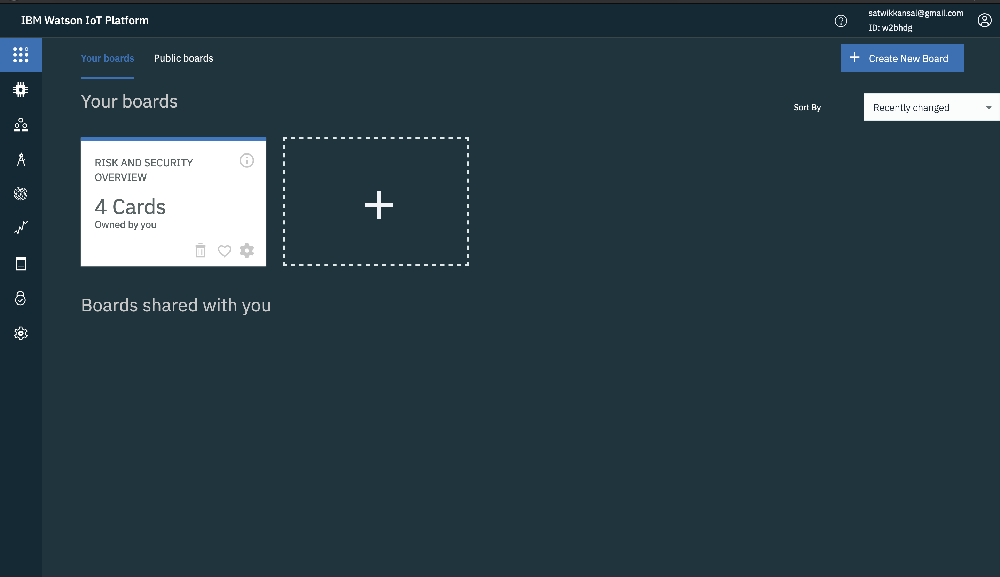
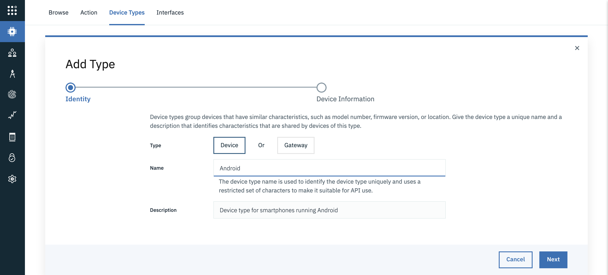

<!-- <sidebar> <heading>Learning path: Building skills in IoT development</heading> <p>This tutorial is part of the IoT 201 learning path, an developer guide for IoT.</p> <ul> <li> [IoT architectures](/articles/iot-lp201-iot-architectures/)</li><li> [IoT security challenges](/articles/iot-top-10-iot-security-challenges/)</li> <li>[IoT data analytics](/tutorials/iot-lp301-iot-manage-data) </li><li> [IoT device management](/tutorials/iot-lp301-iot-device-management)</li> <li> Tutorial: Build a door monitoring system (this tutorial)</li></ul></sidebar> -->

In the ["Get started developing IoT solutions by building a simple home automation system"](/tutorials/iot-lp101-get-started-develop-iot-home-automation/) tutorial, you assembled a door monitoring device using multiple sensors connected to a Raspberry Pi, used Node-RED to design IoT flows, and then used the Apple HomeKit framework to monitor the system using an iOS application. That approach involved little to no code.

In this tutorial, we'll try to build a similar system, a Door Monitoring System, but with a different focus. We'll dive deep into the code and focus on architecture and design, analytics, security, and other aspects of an IoT system. To minimize fiddling with hardware and wires, we'll use a smartphone device in this project as a proxy for the collection of discrete hardware sensors. I'll use my old Android phone during development, which includes an accelerometer, a proximity sensor, and a light intensity sensor. Most smartphones, even the older ones, will have these basic sensors. That's why a real smartphone will serve as a good alternative for actual sensors.

Our Door Monitoring System has the sensors (smartphone) attached to the door, which will continuously record different sensor readings. These readings can be used to trigger different actions, and the collected data can be used to perform analytics.

## Prerequisites

* Familiarity with [Python](/articles/os-beginners-guide-python)
* Basic understanding of [network protocols](/articles/iot-lp101-connectivity-network-protocols/)
* An <a href="https://cloud.ibm.com/register?cm_sp=ibmdev-_-developer-tutorials-_-cloudreg" target="_blank" rel="noopener noreferrer">_IBM Cloud account_</a>

## Architecture of our IoT system

A simple IoT architecture can be seen as the one consisting of two layers: the device and the cloud. The devices are connected directly through the cloud via the network. The cloud orchestrates the devices and uses their data for analytics, monitoring, and so on. This structure can work for simplistic use cases, but as the system scales, we might have to add more complexity.

A typical IoT architecture involves many heterogeneous IoT devices, with sensors that produce data in different formats at different rates, which is then processed and analyzed to gain insights. IoT devices can be connected either directly to a network or through a gateway device to a network, which enables the devices to communicate with each other and with cloud services and applications. The devices can be geographically separated and can transmit information over any of the wireless protocols like Bluetooth, Zigbee, WiFi, Cellular, RFID, or over-the-wire protocols like Ethernet.

So it helps to add a layer between the devices and the cloud where these heterogeneous protocols and data formats can be aggregated before sending them to the cloud. This layer can be called gateway or edge layer, and it can be integrated into your router or on another dedicated device altogether. Apart from aggregation, the gateway or edge layer can serve the following purposes:

* **Device provisioning**: Because the gateway is the first point-of-contact for a device, it can be used to provision and register new devices to the network.
* **Edge computing**: Not all of the data that is generated by the devices will be useful for our IoT system. So the gateway can be used to pre-process or filter some of the data before sending it to the cloud. This helps to prevent unnecessary load at the cloud and makes the system much more bandwidth- and resource-efficient.
* **Virtual abstraction for devices**: The cloud layer can rely on the edge for communicating with the devices. Since the devices might have intermittent connectivity, the edge can provide the last known status of the device to the cloud and store the commands sent to the device from the above layers if the device is not reachable. These commands can be sent to the device once it's back online.

This three-layered architecture can be extended further by dividing roles and responsibilities into different services. For example, the <a href="https://www.ibm.com/cloud/architecture/architectures/iotArchitecture/reference-architecture" target="_blank" rel="noopener noreferrer">_IBM IoT reference architecture_</a> adds enterprise and user layers into the architecture and depicts various components (or services) of each layer. When you design an IoT architecture, remember that a particular layer or service only needs to engage with those layers or services that are immediately connected to it.

For our Door Monitoring System, we'll be using a single smartphone device in our project implementation. But we'd like to architect the system in a way that's easy to scale to multiple devices and touch on different concepts like security, device management, and analytics. We'll add another device to the system to represent the gateway layer. I have a spare Raspberry Pi that supports wifi that I'll use as a gateway. You can also use a different micro-controller or even your PC to run the code related to the gateway. We'll be leveraging IBM Watson IoT Platform and other services to avoid reinventing the wheel for things like security, device-management, monitoring, analytics, and visualizations.  

See the following figure for the architecture of our door monitoring system:


## IoT protocols for our IoT application

As mentioned earlier, in an IoT system there may be heterogeneous devices using different protocols to communicate with the gateway. The most prevalent protocol, however, in the IoT world is MQTT (MQ Telemetry Transport). MQTT is a machine to machine messaging protocol. It is designed to be lightweight and fast, keeping in mind the power and resource constraints of a typical IoT device. The protocol runs over TCP/IP and operates on the publish-subscribe model. You can learn more about how MQTT works in the [Getting to know MQTT](/articles/iot-mqtt-why-good-for-iot/) article.

The key entities in a functional MQTT system are:

* MQTT client
* Message broker
* Topics and messages

The clients communicate with the broker (not directly with each other), where they can publish messages or subscribe to hierarchical message topics. Topics are used to segregate different data.

For our Door Monitoring System, we'll be using MQTT for communicating data from our gateway (the Raspberry Pi) to the message broker in the IBM Cloud and vice-versa. The Watson IoT Platform operates over MQTT.

For communicating data from the smartphone, we have multiple options. We can use Bluetooth, MQTT, web-sockets, or HTTP. Based on the protocol we choose, we'll have to implement appropriate listening logic at the gateway. Typically, one might go after building a custom mobile application or a website that can access sensor data and other device details. But since our use case is simple (relaying the sensor data), we can use any of the existing applications like <a href="https://play.google.com/store/apps/details?id=com.mscino.sensornode&hl=en_IN" target="_blank" rel="noopener noreferrer nofollow">_SensorNode_</a> (uses MQTT), <a href="https://github.com/satwikkansal/ibm_iot_example/tree/master/sensor-udp" target="_blank" rel="noopener noreferrer nofollow">_SensorUDP_</a> (uses sockets) or <a href="https://play.google.com/store/apps/details?id=cz.honzamrazek.sensorstreamer&hl=en_IN" target="_blank" rel="noopener noreferrer nofollow">_SensorStreamer_</a> (uses HTTP) or a custom webpage leveraging

<a href="https://developer.mozilla.org/en-US/docs/Web/API/Sensor_APIs" target="_blank" rel="noopener noreferrer nofollow">_Sensor APIs_</a> like <a href="https://sensor-js.xyz/demo.html" target="_blank" rel="noopener noreferrer nofollow">_this_</a> to access device's sensor readings.

As we'll be covering MQTT protocol for the gateway to cloud communication, and HTTP is un-necessary overhead for continuous telemetry data, let's pick <a href="https://github.com/satwikkansal/ibm_iot_example/tree/master/sensor-udp" target="_blank" rel="noopener noreferrer nofollow">_SensorUDP_</a> to stream the sensor data.

## Steps

Now that we've settled on the architecture for our system, and chosen the protocols we'll use, let's start coding!

All of my code is available in my <a href="https://github.com/satwikkansal/ibm_iot_example/" target="_blank" rel="noopener noreferrer">_GitHub repo_</a>.

<button-link> <text>Get the code</text> <url>https://github.com/satwikkansal/ibm_iot_example/</url></button-link>

### Step 1. Create an IoT Platform service

1. Log in to your <a href="https://cloud.ibm.com/register?cm_sp=ibmdev-_-developer-tutorials-_-cloudreg" target="_blank" rel="noopener noreferrer">_IBM Cloud account_</a>.

2. Open the IBM Cloud catalog, select Internet of Things from the sidebar, and then select <a href="https://cloud.ibm.com/catalog/services/internet-of-things-platform?cm_sp=ibmdev-_-developer-tutorials-_-cloudreg" target="_blank" rel="noopener noreferrer">_Internet of Things Platform_</a>.

3. Enter a service name, select a region and a plan, and then click **Create**.

4. After the service is created, click **Launch** to open the Watson IoT Platform dashboard, which is similar to this one:

    

### Step 2. Create a new gateway device type and register the gateway device

We'll be using a Raspberry Pi as a gateway between the devices and the IoT Platform service.  We need to create a new gateway device type and register it in our IoT Platform service that we just created.

You can follow the instructions in the Watson IoT Platform documentation for <a href="https://cloud.ibm.com/docs/services/IoT?topic=iot-platform-getting-started#step1" target="_blank" rel="noopener noreferrer">_registering your device_</a>.

1. From the Watson IoT Platform dashboard, select **Devices** from the sidebar, and then select **Device Types**.  Click **Add Device Type**.

    

2. Add your device with the selected device type, and use the wizard to register your gateway device.

    

3. On the final wizard screen, copy the device credentials, as you'll not be able to see them again, and we'll be needing them later on.

    

I've created a gateway type called "raspi" and registered a gateway device with ID "raspi-1". By default, the gateway devices are registered with a privileged permission role that gives them the authority to add devices to the Watson IoT Platform Service (more on this later).

### Step 3. Create a device type for the smartphone

Now we need to create a device type for our smartphone (a gateway is a different device type). Since we'll be using a device running Android, I'll just set the device type name as "Android", but you can choose to name it whatever you like.



**Note:** We don't need to register our smartphone device (just like we registered our raspi-1) for now. As you'll see later, we'll use the privileged gateway to register the smartphone programmatically.

### Step 4. Configure and connect the gateway to the cloud

The gateway device will be communicating with the cloud by using the MQTT protocol. To configure the connection to the MQTT broker in Watson IoT Platform, we'll need the following pieces of information (which we copied when we registered our gateway device `raspi-1`):

* Organization ID (the 6-character identifier)
* Device Type (in our case, `raspi`)
* Device ID for the specific device (for example, I used `raspi-1`)
* Authentication Token

For security, we should use TLS to connect to the MQTT broker. We need a host address, client ID, username, and password to initiate an MQTT connection to the broker. The host address to which we need to connect is of the form `<orgid>.messaging.internetofthings.ibmcloud.com`, the clientId is of the form `"d:<orgid>:<device_type>:<device_id>"`, and the user is `use‑token‑auth` if you're using a token for authentication, and the password is the value of the authentication token itself.

We can use a library like <a href="https://pypi.org/project/paho-mqtt/" target="_blank" rel="noopener noreferrer nofollow">_paho-mqtt_</a> to set up the connection, but it might take some effort to configure things correctly. Fortunately, IBM provides a <a href="https://pypi.org/project/wiotp-sdk/" target="_blank" rel="noopener noreferrer nofollow">_Python SDK_</a> (which internally uses `paho-mqtt`) that will make development much easier for us.

You can use the following code to connect as a gateway client to the MQTT broker in the Watson IoT Platform using the `wiotp-sdk`.  You can download the python scripts from my <a href="https://github.com/satwikkansal/ibm_iot_example/" target="_blank" rel="noopener noreferrer">_GitHub repo_</a>.

First, install the SDK:

```sh
# Installing the pypi package
$ pip install wiotp-sdk
```

Then, these Python scripts do the work:

```python
# File gateway_client.py

import wiotp.sdk.gateway

def get_gateway_cilent(config_file_path):
    config = wiotp.sdk.gateway.parseConfigFile(config_file_path)
    client = wiotp.sdk.gateway.GatewayClient(config=config, logHandlers=None)
    return client

client = get_gateway_cilent('gateway_config.yml')
```

The `get_gateway_cilent` takes path to yaml config file, where you can specify all the above mentioned configurations. The file looks something like this,

```yaml
# File gateway_config.yml
identity:
    orgId: 65cjsf
    typeId: raspi
    deviceId: raspi-2
auth:
    token: your_auth_token_here
options:
    domain: internetofthings.ibmcloud.com
    logLevel: debug
    mqtt:
        port: 8883
        transport: tcp
```

We can call the `connect` method to initiate the connection.

```python
client.connect() # Initiating the connection
```

If the logLevel is set to `debug` in the configuration file, you'll see an output similar to this:

```
# The debug output
2020-03-03 22:38:46,897   wiotp.sdk.gateway.client.GatewayClient  DEBUG   Connecting... (address = 65cjsf.messaging.internetofthings.ibmcloud.com, port = 8883, clientId = g:65cjsf:raspi:raspi-1, username = use-token-auth)
2020-03-03 22:38:46,897   wiotp.sdk.gateway.client.GatewayClient  DEBUG   Connecting with clientId g:65cjsf:raspi:raspi-1 to host 65cjsf.messaging.internetofthings.ibmcloud.com on port 8883 with keepAlive set to 60
2020-03-03 22:38:46,898   wiotp.sdk.gateway.client.GatewayClient  DEBUG   User-Agent: MQTT/3.1.1 (Darwin 19.2.0) Paho/1.5.0 (Python) WIoTP/0.11.0 (Python)
2020-03-03 22:38:47,316   wiotp.sdk.gateway.client.GatewayClient  DEBUG   16 Sending CONNECT (u1, p1, wr0, wq0, wf0, c1, k60) client_id=b'g:65cjsf:raspi:raspi-1'
2020-03-03 22:38:47,474   wiotp.sdk.gateway.client.GatewayClient  DEBUG   16 Received CONNACK (0, 0)
2020-03-03 22:38:47,474   wiotp.sdk.gateway.client.GatewayClient  INFO    Connected successfully: g:65cjsf:raspi:raspi-1
```

### Step 5. Send gateway status events

After establishing the connection, we can try publishing some data to the broker. We'll do so by sending events to the cloud, or in MQTT terms, we'll be publishing messages to a specific topic in the MQTT broker. By convention, the MQTT topics for events take the this form: `iot-2/type/<device type>/id/<device id>/evt/<event type>/fmt/`.

We don't have to worry much about the topic structure as the `wiotp-sdk` takes care of this internally. Following is the code to publish the status event for our gateway device `raspi-1`.

```python
# File gateway_client.py

import psutil

def send_status_event(client):
    payload = {
        "cpu": psutil.cpu_percent(),
        "memory": psutil.virtual_memory().percent
    }
    return client.publishEvent(eventId="status", msgFormat="json", data=payload, qos=1)
```

We're sending the current CPU and memory utilization as the message data in the status event by using the `client.publishEvent` method. I've set the <a href="https://www.ibm.com/support/knowledgecenter/en/SSMKHH_10.0.0/com.ibm.etools.mft.doc/bc62020_.htm" target="_blank" rel="noopener noreferrer">_QoS level_</a> to 1 which means we want to ensure "at least once" delivery of the message. The status events we send will be reflected in the platform similar to the following window:


### Step 6. Connect the device to the gateway

Now let's add the smartphone device to the system. As mentioned before, we're going to connect the smartphone to the gateway over the UDP socket. The SensorUDP app provides support for cccelerometer, gyroscope, magnetometer, light, and proximity sensors, but not all devices have all of these sensors (like my old Android device doesn't have gyroscope and magnetometer sensors), so some data might be missing.

We'll have to implement the function to listen to smartphone data over sockets at our gateway. The code for this function is as follows:

```python
# File udp_listener.py

import socket
from struct import unpack_from

UDP_IP = "0.0.0.0"
UDP_PORT = 6000 # The port where you want to receive the packets

# https://github.com/satwikkansal/ibm_iot_example/tree/master/sensor-udp
properties = ['x_acc', 'y_acc', 'z_acc', 'x_gravity', 'y_gravity', 'z_gravity',  'x_rotation', 'y_rotation', 'z_rotation',
              'x_orientation', 'y_orientation', 'z_orientation', 'deprecated_1', 'deprecated_2', 'ambient_light', 'proximity',
              'keyboard_button_pressed']


def unpack_and_return(data, offset):
    return unpack_from("!f", data, offset)[0]


def process_data(data):
    offset = 0
    result = {}
    for property in properties:
        result[property] = unpack_and_return(data, offset)
        offset += 4
    return result


def listen_sensor_data():
    sock = socket.socket(socket.AF_INET,
                         socket.SOCK_DGRAM) # UDP
    sock.bind((UDP_IP, UDP_PORT))
    # Keep listening for data indefinitely
    while True:
        data, addr = sock.recvfrom(1024) # buffer size is 1024 bytes
        data = process_data(data)
        yield data, addr

for data, addr in listen_sensor_data():
     print(data, addr)
```

You can find the IP address of the gateway device using the `ipconfig` shell command), and add that in the SensorUDP app along with a port number (`6000` in our case).


After the smartphone starts sending data, you should see output logs similar to below in your gateway device,

 ```
{'x_acc': -0.003208909183740616, 'y_acc': -0.006447315216064453, 'z_acc': 0.01796436309814453, 'x_gravity': 0.0, 'y_gravity': 0.0, 'z_gravity': 0.0, 'x_rotation': 0.0, 'y_rotation': 0.0, 'z_rotation': 0.0, 'x_orientation': 0.0, 'y_orientation': 0.0, 'z_orientation': 0.0, 'deprecated_1': 0.0, 'deprecated_2': 0.0, 'ambient_light': 56.0, 'proximity': 100.0, 'keyboard_button_pressed': 0.0} ('172.20.10.4', 42048)

{'x_acc': -0.01315280981361866, 'y_acc': 0.034984588623046875, 'z_acc': -0.01422119140625, 'x_gravity': 0.0, 'y_gravity': 0.0, 'z_gravity': 0.0, 'x_rotation': 0.0, 'y_rotation': 0.0, 'z_rotation': 0.0, 'x_orientation': 0.0, 'y_orientation': 0.0, 'z_orientation': 0.0, 'deprecated_1': 0.0, 'deprecated_2': 0.0, 'ambient_light': 56.0, 'proximity': 100.0, 'keyboard_button_pressed': 0.0} ('172.20.10.4', 42048)
 ```

Make sure that you connect the smartphone and the gateway device to the same network for this to work. For better security, you can add provisions like SSL, Firewall, and IP allowlisting.

### Step 7. Send device events via the gateway

Now that we have the data coming from the device in our gateway, the only task that's left is to publish it to the MQTT broker in the cloud. The gateways are allowed to publish events on behalf of devices connected to them. Also, when a privileged gateway publishes an event on behalf of a device for the first time, Watson IoT Platform will automatically register that device. This is known as auto-provisioning of devices. Here's the code:

```python
# File gateway_client.py
ANDROID_DEVICE_TYPE = "Android"

def send_android_device_event(client, device_id, eventId, data):
    client.publishDeviceEvent(
      ANDROID_DEVICE_TYPE, device_id, eventId, msgFormat="json", data=data, qos=0)

for data, device_addr in listen_sensor_data():
     send_android_device_event(client, device_addr[0], "status", data)
```

Just like the `client.publishEvent`, there's `client.publishDeviceEvent` to publish device events through gateway clients. In the above snippet, we've used the smartphone's static IP address as the device ID (as that's the unique information we have for now). Ideally, the device ID should be something fixed and unique to identify a particular device. If you go about creating a custom application for the device, you can add the provisions to share meta information like device ID in the data.

After you start publishing the events, the sensor readings should reflect in your IoT Platform dashboard in real-time like this:


### Step 8. Filtering and aggregating data at the edge

The smartphone streams the sensor data at a fast pace, and the data is sent as is to the MQTT broker in the cloud. Let's try to send this data to the MQTT broker at a slower rate.

The following code implements such mechanism using the <a href="https://pypi.org/project/timeloop/" target="_blank" rel="noopener noreferrer nofollow">_timeloop_</a> library (which internally uses Python's <a href="https://docs.python.org/3/library/threading.html" target="_blank" rel="noopener noreferrer nofollow">_threading_</a> module).

```python
# File main.py

from datetime import timedelta
import time
from timeloop import Timeloop


client = get_gateway_cilent('gateway_config.yml')
client.connect()
time.sleep(2)
tl = Timeloop()

devices_data = {}


# Job that runs every 5 seconds
@tl.job(interval=timedelta(seconds=5))
def send_gateway_status():
    send_status_event(client)


# Job that runs every 200 milliseconds
@tl.job(interval=timedelta(milliseconds=200))
def send_device_readings():
    for device_addr, data in devices_data.items():
        send_android_device_event(client, device_addr, "status", data)
    devices_data.clear()

tl.start()

for data, device_addr in listen_sensor_data():
    devices_data[device_addr[0]] = data
```

In the above snippet:

* We're publishing the gateway status updates (the CPU and memory utilization data) every 5 seconds.
* We're publishing the device data every 200 milliseconds.

Since we're distinguishing devices based on their host address, the above snippet will work for multiple devices too. The above logic can further be extended by only publishing the event when there's a substantial change in the values as compared to the previous ones. Such techniques help ease the computational overhead at the cloud, and also save network bandwidth, which makes this a part of edge computing.

### Step 9. Visualizing the data

Different visualizations of data help us provide a clearer picture of the events that have happened. Let's use the Watson IoT Platform for visualizing the data that is being sent to the cloud.

To create visualizations, we'll create a new board:

1. Go to your Watson IoT Platform dashboard, and select **Create New Board**.

    

2. Click **Add new card**.  And then from the types of cards available, select **Line chart** under **Devices**.

    

3. Select the device that will provide the data to be displayed in the card. Some card types provide an option to use another card as a data source for the data set that is displayed. This allows the data displayed on the dependent card to be filtered by selecting values on the other card. For example, the values that are included in a visualization card can be filtered by selecting which devices to display from a device list card.

4. Connect a data set. You'll need to select the event type (status), and then configure a property by selecting the data type and entering a range of values and then clicking **Next**.

    

5. Configure the appearance of the card, by entering size, color, and title for the card, and then click **Submit** to add the card to the board.

I played around with different kinds visualizations (Gauge, Line chart, and Semaphores, for example) to create the following board. A quick glance at the board gives a high-level view of the system.


### Step 10.  Sending commands and information to the devices

The infrastructure that we've set up so far transmits the data only in one direction (from device to gateway to the cloud). But what if we want to send the data in another direction? What if we want to send instructions to the device to act in a certain way? This can be done through commands. Commands are nothing but MQTT messages that are sent from the cloud or application layer back to the lower layers.

The `wiotp-sdk` SDK provides an abstraction for application clients (the application layer in our three-tier architecture) with functions to send commands to the devices or gateways. The following code snippet walks through one such use-case implementation:

```python
# File application.py

import wiotp.sdk.application

def get_gateway_cilent(config_file_path):
    config = wiotp.sdk.gateway.parseConfigFile(config_file_path)
    client = wiotp.sdk.gateway.ManagedGatewayClient(config=config, logHandlers=None)
    return client

def send_reset_command(client, type, id):
  data = {'reset': True}
  client.publishCommand(type, id, "reset", "json", data)


app_client = get_gateway_cilent("app_config.yml")
app_client.connect()
send_reset_command(app_client, 'raspi', 'raspi-1')
```

In this code, we initialize an application client that connects directly to the cloud and resides at a different location than the gateway. We use the application client to send a simple command to the gateway instructing the gateway to reset itself. It's a naive use case, but you can extend it to do more useful things like restarting the device, changing the rate at which data is sent, and so on.

Just like the gateway config, we'll specify the application config in a YAML file:

```yaml
# app_config.yml
identity:
    appId: any_app_id
auth:
    key: your_key
    token: your_token
options:
    domain: internetofthings.ibmcloud.com
    logLevel: debug
```

The key and the token for the application (which is different from the one that we used for the gateway client) can be generated by clicking the **Generate API Key** button in the Apps section of your Watson IoT Platform Dashboard.


 I've assigned the Role to be "Backend Trusted application:"


Copy the key and the auth token that you get on the next screen, and then add them to your `application_config.yml` file.

The above implementation suffices for the application side, but what about the gateway? How should the gateway handle the command? We need to add the following logic at our gateway:

```python
# File main.py contd..
def gateway_command_callback(cmd):
    print("Command received for {}:{}: {}".format(cmd.typeId, cmd.deviceId, cmd.data))
    if cmd.typeId == 'reset':
        reset_data(devices_data)
    else:
        print("Unknown command type received")


def reset_data():
    devices_data.clear()
    # Add more custom logic here.
    pass


# Subscribing to specific command
# client.subscribeToCommands(self, commandId="reset")
# Subscribing to all commands being sent to the gateway
client.subscribeToCommands(self)
# Registering a callback
client.commandCallback = gateway_command_callback
```

In this code, we've registered a callback function that gets fired every time the gateway client receives a command. The command can then be handled based on its ID and the data being sent. In a similar manner, commands can also be sent to the devices.

### Step 11. Managing devices

A complex IoT system might contain many devices, so it is helpful to include device management capabilities in the architecture. IoT devices are often deployed in hostile environments. They need to be monitored actively, and when they fail, they might need to be retired or updated so that they can continue to operate in those environments.

Device management capabilities allow IoT developers to control IoT devices by performing operations like resetting them to factory defaults or applying updates to patch security issues or fix bugs.

We can use the IBM Watson IoT Platform device management protocol to configure your IoT devices as <a href="https://cloud.ibm.com/docs/services/IoT/devices/device_mgmt/index.html#index" target="_blank" rel="noopener noreferrer">_managed devices_</a> (we've so far been working with unmanaged devices), which allows the devices to be rebooted, to be reset to factory defaults, or for firmware to be downloaded or upgraded remotely. Managed devices implement the <a href="https://cloud.ibm.com/docs/services/IoT/devices/device_mgmt/index.html" target="_blank" rel="noopener noreferrer">_Device Management Protocol_</a>, which is built on MQTT. The `wiotp-sdk` also provides separate clients for <a href="https://ibm-watson-iot.github.io/iot-python/device/managed/" target="_blank" rel="noopener noreferrer">_Managed devices_</a> and <a href="https://ibm-watson-iot.github.io/iot-python/gateway/managed/" target="_blank" rel="noopener noreferrer">_Managed gateways_</a> for convenience. In our use case, we can simply use `wiotp.sdk.gateway.ManagedGatewayClient` instead of `wiotp.sdk.gateway.GatewayClient`) which will allow us to trigger device management actions through the Watson IoT Platform dashboard. Just like command handling, you'll need to set up callbacks to handle the device management actions.

After registering a managed device, the Device Actions section on the device detail page in the Watson IoT Platform dashboard is automatically updated to include buttons that can be used to trigger these device actions.


Also, a log of device actions that have been applied is available under the Action tab on the Devices page in the dashboard, and the  Initiate Action button on this page can also be used here to trigger actions. These actions can be applied to a single device or all devices of a given type at the same time.


### Step 12.  Storing data in a database

What if we want to persist the data for later use? We can store the events in a
<a href="https://www.ibm.com/cloud/cloudant" target="_blank" rel="noopener noreferrer">_Cloudant_</a> NoSQL database.

We'll add a Cloudant DB service to our IoT application.

1. In IBM Cloud catalog, click **Databases** from the left menu, then click <a href="https://cloud.ibm.com/catalog/services/cloudant?cm_sp=ibmdev-_-developer-tutorials-_-cloudreg" target="_blank" rel="noopener noreferrer">_Cloudant_</a>.

2. Select a plan and a region, then specify a service name. Then click **Create**.

    

3. We then need to get to the service dashboard and generate service credentials that'll be used in the application. On the service page, click **Service credentials**.

    

4. Once we have the credentials, we can create bind the application client to the Cloudant service and configure connector, destination, and rules to send the events to the Cloudant database. Here's the code to do that binding:

```python
# File application.py

CLOUDANT_CREDS = {
  "apikey": "your_api_key_here",
  "host": "eeca8e52-1774-4698-93d1-cafa434762ac-bluemix.cloudantnosqldb.appdomain.cloud",
  "password": "your_pwd_here",
  "port": 443,
  "username": "your_username_here"
}

SERVICE_BINDING = {
    "name": "any-binding-name",
    "description": "Test Cloudant Binding",
    "type": "cloudant",
    "credentials": CLOUDANT_CREDS
}

ANDROID_DEVICE_TYPE = "Android"
GATEWAY_DEVICE_TYPE = "raspi"
STATUS_EVENT_TYPE = "status"


def get_application_client(config_file_path):
    config = wiotp.sdk.application.parseConfigFile(config_file_path)
    app_client = wiotp.sdk.application.ApplicationClient(config)
    return app_client


def create_cloudant_connections(client, service_binding):
    # Bind application to the Cloudant DB
    cloudant_service = client.serviceBindings.create(service_binding)

    # Create the connector
    connector = client.dsc.create(
        name="connector_1", type="cloudant", serviceId=cloudant_service.id, timezone="UTC",
        description="Data connector", enabled=True
    )

    # Create a destination under the connector
    destination_1 = connector.destinations.create(name="sensor-data", bucketInterval="DAY")

    # Create a rule under the connector, that routes all Android status events to the destination
    connector.rules.createEventRule(
        name="status_events", destinationName=destination_1.name, typeId=ANDROID_DEVICE_TYPE, eventId=STATUS_EVENT_TYPE,
        description="Send android status events", enabled=True
    )

    # Create another destination under the connector
    destination_2 = connector.destinations.create(name="gateway-data", bucketInterval="DAY")

    # Create a rule under the connector, that routes all raspi status events to the destination
    connector.rules.createEventRule(
        name="status_events", destinationName=destination_2.name, typeId=GATEWAY_DEVICE_TYPE, eventId=STATUS_EVENT_TYPE,
        description="Gateway status events", enabled=True)

create_cloudant_connections(app_client, SERVICE_BINDING)
```

You can read in detail about bindings, connectors, destination, and rules <a href="https://www.ibm.com/support/knowledgecenter/SSQP8H/iot/platform/reference/dsc/index.html" target="_blank" rel="noopener noreferrer">_here_</a>.

In brief, what we did above was configured our application with the Cloudant service in such a way that all the `Android` status events go to a separate historian database, and all the `raspi` status events are sent to another historian database. Both historian databases are bucketed by the interval of a day.

If you go to the Cloudant service dashboard after setting up these rules through the `wiotp-sdk`, you'll see a few generated databases like this:


And they'll contain all your events data in the form of documents. Click the JSON button to view the event data in JSON format:


### Step 13. Use the data for advanced analytics

The data that you saved into Cloudant can be used for advanced analytics. Let's fetch this data in a Jupyter Notebook available in <a href="https://www.ibm.com/cloud/watson-studio" target="_blank" rel="noopener noreferrer">_Watson Studio_</a>, where we can write custom logic for analytics.

1. Go to the <a href="https://cloud.ibm.com/catalog/?cm_sp=ibmdev-_-developer-tutorials-_-cloudreg" target="_blank" rel="noopener noreferrer">_IBM Cloud Catalog_</a> and under **AI**, select <a href="https://cloud.ibm.com/catalog/services/data-science-experience?cm_sp=ibmdev-_-developer-tutorials-_-cloudreg" target="_blank" rel="noopener noreferrer">_Watson Studio_</a>.
2. Create the service. Select a region, and choose the **Lite** pricing plan. Enter a **Service name**, and select a resource group.
3. Launch the dashboard by clicking **Get Started**. Then, click **Create project > Create an empty project** and enter some name for the project.
4. Create a new cloud storage service (Select **Lite** plan > Create). Hit **Refresh** to see the created service.
5. Click **Create**. Your new project opens.
6. You can start adding resources to it by clicking **Add to project** button.

    

7. We'll select Notebook, but there are other resources too that you can explore. Enter some name and description, and select an appropriate runtime. Watson Studio supports both Python and R environments. It also has support for Spark and Scala. Let's choose Spark with Python environment for now.

8. To use our Cloudant data, we need to add a connection resource to the project. To do that, go to the project page of Watson studio, click on **Add to project** again, and choose **Connection** asset this time, select your Cloudant service, and click on **Create**.

    

9. Now in your notebook, you'll be able to see the Cloudant service, click on credentials, and insert them in a cell.

    

10. Run the following code in the notebook:

```python
# The Watson studio notebook cell
!pip install --upgrade pixiedust

import pixiedust

username = credentials_1["username"]
password = credentials_1["password"]
host = username + '.cloudantnosqldb.appdomain.cloud'
dbName = 'iotp_65cjsf_sensor-data_2020-03-03' # DB name, can be found on the cloudant service

pixiedust.installPackage("cloudant-labs:spark-cloudant:2.0.0-s_2.11")


cloudantdata = sqlContext.read.format("com.cloudant.spark").\
option("cloudant.host", host).\
option("cloudant.username", username).\
option("cloudant.password", password).\
load(dbName)

cloudantdata.show()
```

Now, we have all the `Android` events data available as a PySpark dataframe object, which we can use for analysis and visualization via PySpark and Python.


In the context of our door monitoring system, some ideas for custom analytics include:

* Analyzing accelerometer and proximity sensor data to estimate out how many times the door is opened throughout the day.
* Identifying the busiest times throughout the week.
* Calculating various statistics and metrics. Invoking other third party services or applications (like IFTTT) based on these metrics.
* Processing the data and plotting complex graphs that might not have been possible to generate through visualization cards in the Watson IoT Platform service.

## Conclusion

In this tutorial, we discussed various components of a typical IoT system. Although IoT is a vast topic and its use cases cover multiple domains, the knowledge of the different concepts discussed in this tutorial will enable you to get going with most IoT use cases.

The infrastructure that we've set up will make it easy to try some of the following ideas:

* Use the proximity sensor to trigger some events (such as a greeting sound, turning on other devices connected to the gateway, and so on).
* Monitor accelerometer readings, use some anomaly detection techniques to figure out how many times the door is opened throughout the day and other statistics.
* Create your custom application and record other things like noise levels. Or maybe use discrete hardware sensors like temperature, humidity, light, and so on. You can add a button in the application or a hardware buzzer that can serve as your doorbell.
* Do some actions based on the light intensity, like turning on some light (connected to the network) when the intensity falls below a threshold.