このチュートリアルでは、分類ベースの機械学習問題を解決するための基本を説明し、現在最も人気のあるアルゴリズムのいくつかを比較検討します。

## セットアップ

1. サインアップまたはログインしてください。

    * [Try IBM Watson](https://dataplatform.cloud.ibm.com/registration/stepone?cm_sp=ibmdev-_-developer-tutorials-_-cloudreg)ページから IBM Cloud アカウントにログインして、Watson Studio を有効にします。
    * [https://dataplatform.cloud.ibm.com](https://dataplatform.cloud.ibm.com?cm_sp=ibmdev-_-developer-tutorials-_-cloudreg)でログインして、Watson Studio にアクセスします。

1. 空のプロジェクトを作成します。

    * **Create a project** または **New project** のいずれかをクリックします。
    * 「空のプロジェクトを作成する」を選択します。
    * プロジェクトに名前を付けます。
    * 既存のObject Storageサービス・インスタンスを選択するか、新しいインスタンスを作成します。
    * **Create**をクリックします。

1. Notebookを追加します。

   * **+Add to project** をクリックします。
   * **Notebook**をクリックします。
   * **From URL** をクリックします。
   * **名前** を入力します。
   * **Select runtime** で **Default Python 3.6 Free** を選択します。
   * `https://raw.githubusercontent.com/IBM/ml-learning-path-assets/master/notebooks/classification_with_scikit-learn.ipynb` と入力します。
   * **Create Notebook** をクリックします。

1. ノートブックを実行します。

   開いたノートブックで、**実行**をクリックして、セルを1つずつ実行します。このチュートリアルの残りの部分は、ノートブックの順序に従います。

## 概要

分類とは、予測される特徴に値のカテゴリが含まれている場合です。これらのカテゴリーはそれぞれ、予測される値が当てはまるクラスとみなされ、それゆえに分類という名前がついています。

このチュートリアルでは、あるオンライン取引プラットフォームの顧客に関する情報を含むデータセットを用いて、ある顧客の解約確率が高いか、中程度か、低いかを分類します。  以前の[チュートリアル](/tutorials/build-and-test-your-first-machine-learning-model-using-python-and-scikit-learn/)では、モデルを作成する前に必要な様々な前処理の手順を説明しましたが、このチュートリアルではその詳細を省略します。その代わりに、異なる分類アルゴリズムの詳細を調べ、比較のために同じデータセットに適用します。

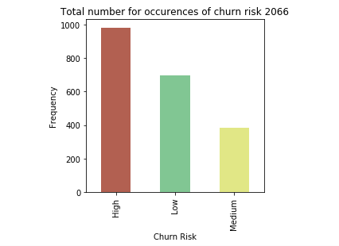

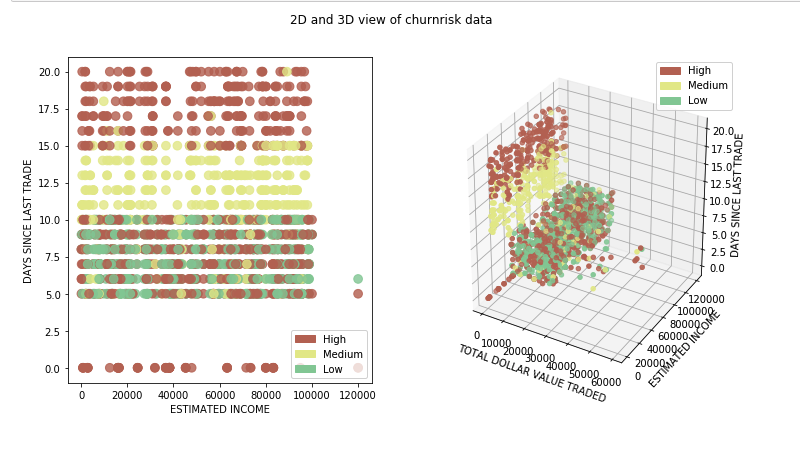

## 分類アルゴリズムと比較

先に述べたように、分類とは、予測される特徴に値のカテゴリが含まれている場合です。これらのカテゴリーはそれぞれ、予測値が該当するクラスとみなされます。分類アルゴリズムには次のようなものがあります。

* ナイーブベイズ
* ロジスティック回帰（Logistic regression
* K-nearest neighbors
* カーネル）SVM
* 決定木
* アンサンブル学習

* ## ナイーブベイズ

ナイーブベイズは、ベイズの定理を応用して、あるデータポイントが特定のクラスに属する確率を算出します。ある関連する値の確率が与えられている場合、事象_A_が発生したときに事象_B_が発生する確率を計算する式は以下のように計算されます。

*P(B|A) = (P(A|B) * P(B) / P(A))

この理論は、入力された特徴の間に依存性がないことを前提としているため、ナイーブであると考えられます。しかし、ナイーブ・ベイズ・アルゴリズムは、スパムフィルターのような特定のユースケースにおいて、非常に優れた性能を発揮することが証明されています。

次のコードスニペットは、scikit-learnのライブラリを使用してナイーブベイズモデルを作成し、予測する方法の例を示しています。

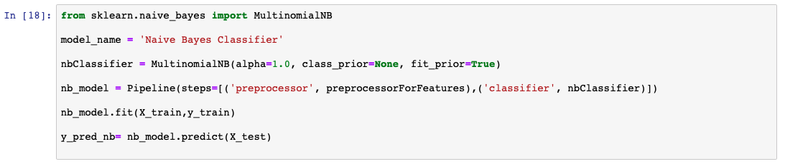

予測出力リストを分析すると、モデルの精度が69%であることがわかります。また、実測値と予測値の比較表も表示されています。

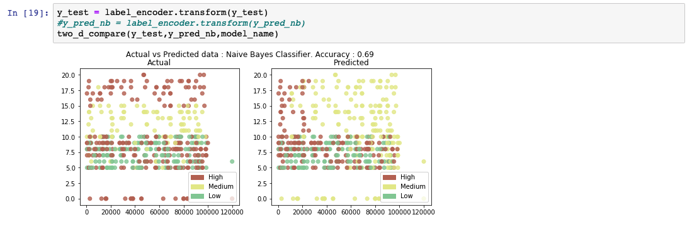

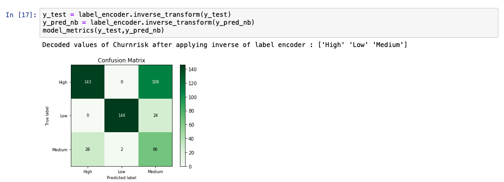

### ロジスティック回帰

ロジスティック回帰は、線形回帰アルゴリズムを拡張したものです。線形回帰アルゴリズムの詳細は、[Learn regression algorithms using Python and scikit-learn](/tutorials/learn-regression-algorithms-using-python-and-scikit-learn/)で説明しています。ロジスティック回帰アルゴリズムでは、実際の連続値を予測するのではなく、結果の確率を予測します。これを実現するために、ロジスティック関数を線形回帰の結果に適用します。ロジスティック関数はシグモイド関数とも呼ばれています。これは、0と1の間の値を出力します。 そして、ユースケースに応じたラインを選択します。線より上の確率値を持つデータポイントは、1で表されるクラスに分類され、線より下のデータポイントは、0で表されるクラスに分類されます。

次のコードスニペットは，scikit-learnのライブラリを使用してロジスティック回帰モデルを作成し，予測する方法の例を示しています．

予測出力リストを分析すると、モデルの精度が92%であることがわかります。また、実際の値と予測値の比較表も表示されています。

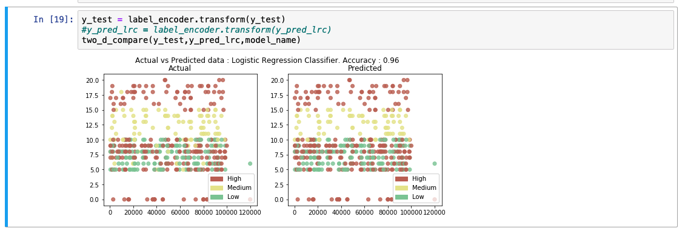

### K-nearest neighbors

K-nearest neighbors(KNN)の一般的な考え方は、「データ点は、その距離から見て、最も多くの共通点を持つクラスに属すると考える」というものです。予測したいデータポイントの周囲にあるK個の最近接点が考慮されます。このときのK個の点は、すでにあるクラスに属している。予測対象のデータポイントは、このK個の点の中で最も多くの点が属するクラスに属するとされる。点間の距離を計算する方法はいくつかあります。最も一般的な計算式はユークリッド距離です。

次のコードスニペットは、scikit-learnのライブラリを使用してKNNモデルを作成し、予測する方法の例を示しています。

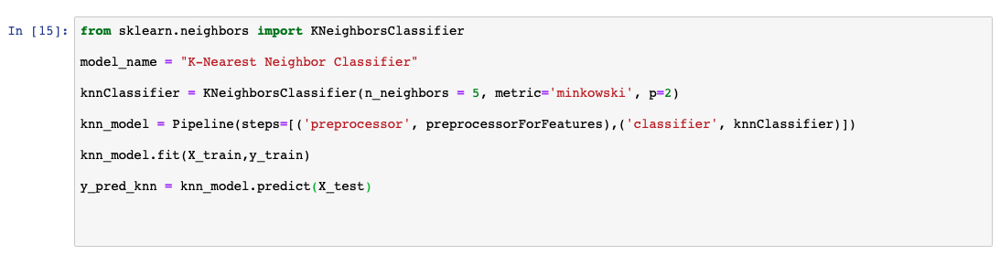

予測出力リストを分析すると、モデルの精度が89%であることがわかります。また、実測値と予測値の比較表も表示されています。

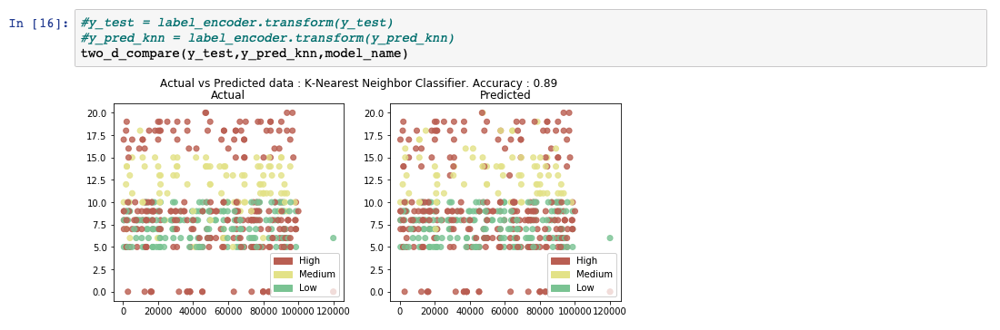

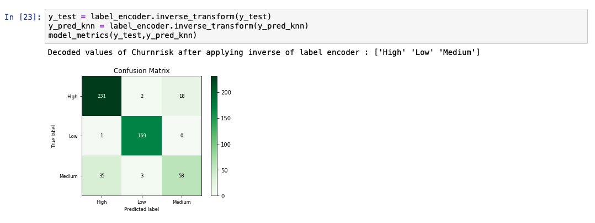

### サポートベクターマシン

サポートベクターマシン(SVM)は、入力された学習データをもとに、クラス間の最適な分離線を出力します。この分離線は、多次元環境では超平面と呼ばれます。SVMは、この分離超平面を導き出すために、別のクラスにかなり近いところにある外れ値を考慮します。この超平面を用いてモデルを構築した後、新たに予測する点は、その値が超平面のどちら側にあるかを確認します。

2次元空間であっても、点が明確に区別されずに分布している場合、クラス間の分離線を構築するのは難しいことがあります。また、1つのデータポイントを記述するために複数の特徴が寄与している場合、この作業は複雑なプロセスとなります。このような多次元空間では、データが直線的に分離できないため、高次元の空間にマッピングして分離を行います。この高次元へのマッピングは，「カーネル関数」を適用することで実現する．カーネル関数にはいくつかの種類がありますが、最も一般的なものは、多項式とGuassian radial basis function (RBF)です。このようにして分離面を導き出した後、データは元の次元にマッピングされます。この時点での予測は、単にこの点が平面の内側にあるか外側にあるかを見つけることです。

次のコードスニペットは，scikit-learnのライブラリを使用してSVMモデルを作成し，予測する方法の例です．カーネル値を「rbf」に設定し、超平面を生成しています。

予測出力リストを分析すると、モデルの精度が95%であることがわかります。また、実際の値と予測値の比較表も表示されています。
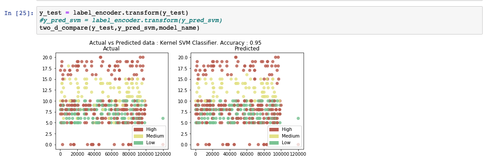

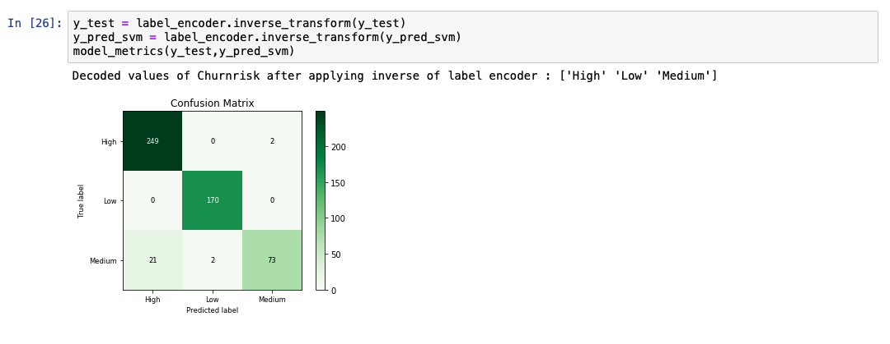

### ![決定木

決定木ベースのモデルは、学習データを使って、出力を予測するためのルールを導き出します。例えば、「ある人が今日、テニスができるかどうか」という問題文があったとします。学習データの値に応じて、モデルは決定木を形成します。導き出されたモデルは、次のようなルールで決定木を構築することができました。

1. まず、見通しの欄を確認します。曇っていたら絶対に行かない。
2.しかし、晴れていても湿度が高ければ、行かないほうがいい。
3.3.晴れていて普通なら、行く。
4.雨が降っていて風が強ければ、行かない。
5.雨が降っていても、風がなければ行く。

### アンサンブル学習

アンサンブル学習とは、機械学習のアルゴリズムのうち、複数のアルゴリズムを組み合わせてより良いモデルを作るタイプのものを指します。2つ以上の同じアルゴリズムを繰り返して実現する場合は、*同種のアンサンブル*アルゴリズムと呼ばれます。また、異なるアルゴリズムが組み合わされる場合は、*heterogenous ensemble*と呼ばれます。このセクションでは、決定木ベースのモデルをランダムフォレストと勾配ブースト木に組み合わせて、より高い精度レベルを得る方法を見てみましょう。

#### ランダムフォレスト

決定木アルゴリズムは、出力を予測する上で付加価値のない列を効率的に排除することができます。場合によっては、ツリーをバックトラックすることで、予測がどのように導かれたかを確認することもできます。しかし、このアルゴリズムは、ツリーが巨大で解釈が難しい場合には個別に実行できません。このようなモデルは、しばしば弱いモデルと呼ばれます。モデルの性能は、学習データのサブセットから得られたいくつかのそのような決定木の平均を取ることによって即効性があります。この方法は、*ランダムフォレスト*分類と呼ばれています。

次のコードスニペットは，scikit-learnのライブラリを使用してランダムフォレストモデルを作成し，予測する方法の一例を示しています。

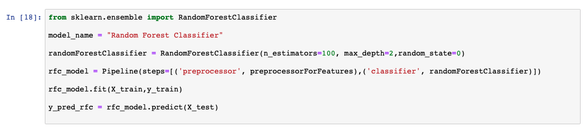

予測出力リストを分析すると、モデルの精度が91%であることがわかります。また、実測値と予測値の比較表も表示されています。

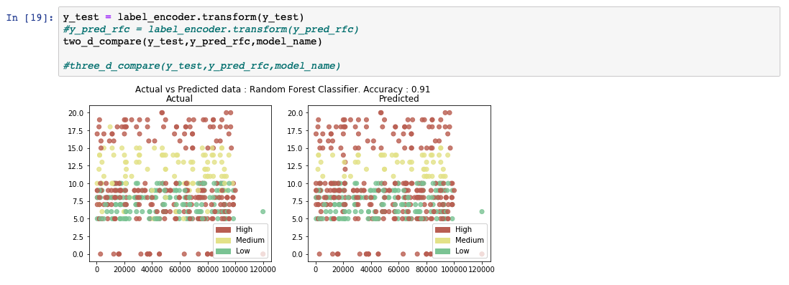

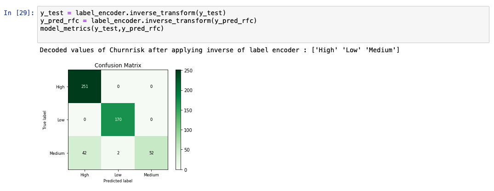

#### Gradient boosted trees

グラディエント・ブースト・ツリーもアンサンブル学習の一種です。ブースティングと呼ばれる手法で、前のモデルの出力をもとに次々とモデルを学習していきます。

グラディエント・ブースト・ツリーでは、前のモデルからの誤差（残差）を計算します。次に、この残差に基づいて学習される別のモデルを定義します。結果として得られるモデルは、前のモデルと残差で訓練されたモデルの合計です。このプロセスは収束するまで繰り返されます。グラジエント・ブースト・ツリーは、ランダム・フォレスト・モデルよりも優れた性能を持っていますが、逐次的に構築されるため、計算量が多くなります。この問題を解決するために、XGBoostと呼ばれる特別な実装が使用されています。XGBoostの詳細については、このチュートリアルでは説明しません。

## まとめ

このチュートリアルでは、同じデータセットを使って、いくつかの分類アルゴリズムを使って予測を行いました。このチュートリアルで取り上げたアルゴリズムは

* ナイーブ・ベイズ
* ロジスティック回帰（Logistic regression
* K-nearest neighbors
* SVM (Kernel)
* 決定木
* アンサンブル学習

アルゴリズムの違いにより、精度のスコアが異なることがわかります。これは、あるアルゴリズムが他のアルゴリズムよりも一貫して優れていることを意味するものではありません。ある分類アルゴリズムが他のアルゴリズムよりも一貫して優れているとしても、モデルの性能は通常、ユースケースに影響されます。また、それぞれのアルゴリズムにおいて、いくつかのハイパーパラメータを異なる方法で調整することで、より良い精度を得ることができます。以下の棒グラフでは、異なる分類アルゴリズムを実際の値と比較しています。

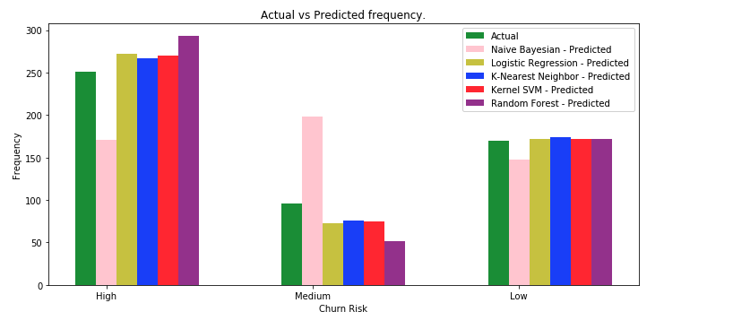

一般的に、中程度の値の予測は、精度が低いことがわかります。この理由の1つは、「中」の値のエントリ数が「高」や「低」の値に比べて非常に少ないことが考えられます。さらに、Mediumのエントリー数を増やすか、いくつかのデータ捏造技術を用いてテストを行うことができます。