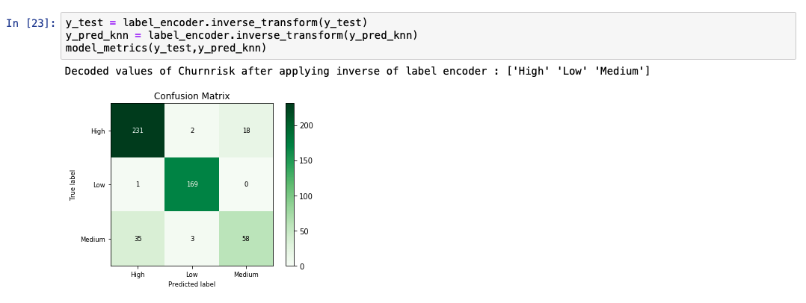
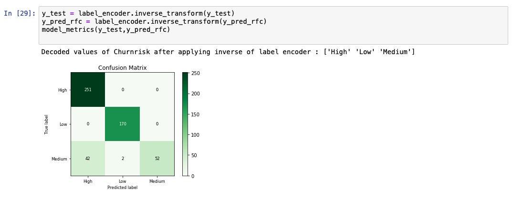
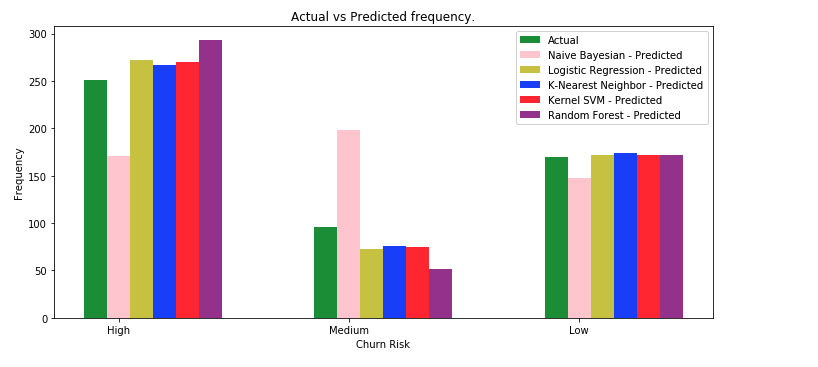

In this tutorial, we describe the basics of solving a classification-based machine learning problem, and give you a comparative study of some of the current most popular algorithms.

## Set up

1. Sign up or log in.

    * Activate Watson Studio by logging in to your IBM Cloud account from the [Try IBM Watson](https://dataplatform.cloud.ibm.com/registration/stepone?cm_sp=ibmdev-_-developer-tutorials-_-cloudreg) page.
    * Access Watson Studio, by logging in at [https://dataplatform.cloud.ibm.com](https://dataplatform.cloud.ibm.com?cm_sp=ibmdev-_-developer-tutorials-_-cloudreg).

1. Create an empty project.

    * Click either **Create a project** or **New project**.
    * Select **Create an empty project**.
    * Give the project a name.
    * Choose an existing Object Storage service instance or create a new one.
    * Click **Create**.

1. Add the Notebook.

   * Click **+Add to project**.
   * Click **Notebook**.
   * Click **From URL**.
   * Provide a **Name**.
   * Under **Select runtime**, choose **Default Python 3.6 Free**.
   * Enter `https://raw.githubusercontent.com/IBM/ml-learning-path-assets/master/notebooks/classification_with_scikit-learn.ipynb`.
   * Click **Create Notebook**.

1. Run the Notebook.

   In the open Notebook, click **Run** to run the cells one at a time. The rest of the tutorial follows the order of the Notebook.

## Overview

Classification is when the feature to be predicted contains categories of values. Each of these categories is considered as a class into which the predicted value falls and hence has its name, classification.

In this tutorial, we use a data set that contains information about customers of an online trading platform to classify whether a given customer's probability of churn will be high, medium, or low.  Because a previous [tutorial](/tutorials/build-and-test-your-first-machine-learning-model-using-python-and-scikit-learn/) covered the various preprocessing steps that need to occur before model creation, we skip those details in this tutorial. Instead, we do a detailed study of the different classification algorithms and apply it to the same data set for the sake of comparison.

## Classification algorithms and comparison

As stated earlier, classification is when the feature to be predicted contains categories of values. Each of these categories is considered as a class into which the predicted value falls. Classification algorithms include:

* Naive Bayes
* Logistic regression
* K-nearest neighbors
* (Kernel) SVM
* Decision tree
* Ensemble learning

### Naive Bayes

Naive Bayes applies the Bayes' theorem to calculate the probability of a data point belonging to a particular class. Given the probability of certain related values, the formula to calculate the probability of an event _B_, given event _A_ to occur is calculated as follows.

P(B|A) = (P(A|B) * P(B) / P(A))

This theory is considered naive, because it assumes that there is no dependency between any of the input features. Even with this not true or naive assumption, the Naive Bayes algorithm has been proven to perform really well in certain use cases like spam filters.

The following code snippet shows an example of how to create and predict a Naive Bayes model using the libraries from scikit-learn.

While analyzing the predicted output list, we see that the accuracy of the model is at 69%. A comparative chart between the actual and predicted values is also shown.

### Logistic regression

Logistic regression is an extension to the linear regression algorithm. The details of the linear regression algorithm are discussed in [Learn regression algorithms using Python and scikit-learn](/tutorials/learn-regression-algorithms-using-python-and-scikit-learn/). In a logistic regression algorithm, instead of predicting the actual continuous value, we predict the probability of an outcome. To achieve this, a _logistic function_ is applied to the outcome of the linear regression. The logistic function is also referred to as a _sigmoid function_. This outputs a value between 0 and 1. Then, we select a line that depends on the use case. Any data point with a probability value above the line is classified into the class represented by 1. The data point below the line is classified into the class represented by 0.

The following code snippet shows an example of how to create and predict a logistic regression model using the libraries from scikit-learn.

While analyzing the predicted output list, we see that the accuracy of the model is at 92%. A comparative chart between the actual and predicted values is also shown.

### K-nearest neighbors

The general idea behind K-nearest neighbors (KNN) is that data points are considered to belong to the class with which it shares the most number of common points in terms of its distance. K number of nearest points around the data point to be predicted are taken into consideration. These K points at this time already belong to a class. The data point under consideration is said to belong to the class with which the most number of points from these K points belong. There are several methods to calculate the distance between points. The most popular formula to calculate this is the Euclidean distance.

The following code snippet shows an example of how to create and predict a KNN model using the libraries from scikit-learn.

While analyzing the predicted output list, we see that the accuracy of the model is at 89%. A comparative chart between the actual and predicted values is also shown.

### Support Vector Machines

Support Vector Machines (SVM) output an optimal line of separation between the classes, based on the training data entered as input. This line of separation is called a hyperplane in a multi-dimensional environment. SVM takes into consideration outliers that lie pretty close to another class to derive this separating hyperplane. After the model is constructed with this hyperplane, any new point to be predicted checks to see which side of the hyperplane this values lies in.

Even in 2-dimensional space, constructing this line of separation between classes can sometimes be tricky if the points are distributed without a clear distinction. Also, doing this when multiple features contribute to describe a data point is a complicated process. For these multi-dimensional spaces, where data is not linearly separable, we map it to a higher dimensional space to create this separation. This mapping to a higher dimension is achieved by applying a _kernel function_. There are several types of kernel functions, and the most common ones are the polynomial and the Guassian radial basis function (RBF). After this plane of separation is derived, the data is mapped back to its original dimension. Prediction at this point is merely finding if this point lies within or outside the plane.

The following code snippet shows an example of how to create and predict an SVM model using the libraries from scikit-learn. The kernel value is set to 'rbf' to generate the hyperplane.

While analyzing the predicted output list, we see that the accuracy of the model is at 95%. A comparative chart between the actual and predicted values is also shown.

### Decision trees

Decision tree-based models use training data to derive rules that are used to predict an output. For example, assume that the problem statement was to identify if a person can play tennis today. Depending on the values from the training data, the model forms a decision tree. The model derived could have constructed a decision tree with the following rules.

1. First check the outlook column. If it's overcast, you definitely never go.
2. But if it's sunny and humid, then you don't go.
3. If it's sunny and normal, you go.
4. If it's rainy and windy, you don't go.
5. And if it's rainy and not windy, you go.

### Ensemble learning

Ensemble learning refers to the type of machine learning algorithms where more than one algorithm is combined to produce a better model. When two or more same algorithms are repeated to achieve this, it is called a *homogenous ensemble* algorithm. If different algorithms are assembled together, it is called a *heterogenous ensemble*. In this section, we'll look at how we can combine a decision tree-based model into a random forest and gradient boosted tree to get a higher accuracy level.

#### Random forest

Decision tree algorithms are efficient in eliminating columns that don't add value in predicting the output. In some cases, we are even able to see how a prediction was derived by backtracking the tree. However, this algorithm doesn't perform individually when the trees are huge and hard to interpret. Such models are often referred to as weak models. The model performance is improvised by taking an average of several such decision trees derived from the subsets of the training data. This approach is called the *random forest* classification.

The following code snippet shows an example of how to create and predict a random forest model using the libraries from scikit-learn.

While analyzing the predicted output list, we see that the accuracy of the model is at 91%. A comparative chart between the actual and predicted values is also shown.

  

#### Gradient boosted trees

Gradient boosted trees are also a type of ensemble learning. They are based on the method called boosting, which involves training a model one after another based up on the outputs from the previous models.

In gradient boosted trees, we calculate the error from the previous model, also known as _residuals_. Now we define another model that is trained on this residual. The resulting model is the sum of previous model and the model trained on residuals. This process is repeated until convergence. Even though gradient boosted trees out perform random forest models, they are computationally expensive because they are built sequentially. A specific implementation called XGBoost is used to overcome this issue. The details of XGBoost are out of scope of this tutorial.

## Summary

In this tutorial, we used the same data set to make predictions using several classification algorithms. The algorithims discussed in this tutorial are:

* Naive Bayes
* Logistic regression
* K-nearest neighbors
* SVM (Kernel)
* Decision tree
* Ensemble learning

We see that different algorithms behaves different accuracy scores. This does not mean that one algorithm is consistently better than the other ones. Even though certain classification algorithms consistently perform better than others, model performances are typically affected by the use case. Several hyperparameters can also be tuned in different ways within each of these algorithms to yield better accuracy. In the following bar chart, we compare the different classification algorithms against the actual values.

In general, we see that the predictions around the Medium values is low on accuracy. One reason for this could be that the number of entries for the Medium values were much less represented than the High and Low values. Further testing can be done by either increasing the number of Medium entries or involving several data fabrication techniques.